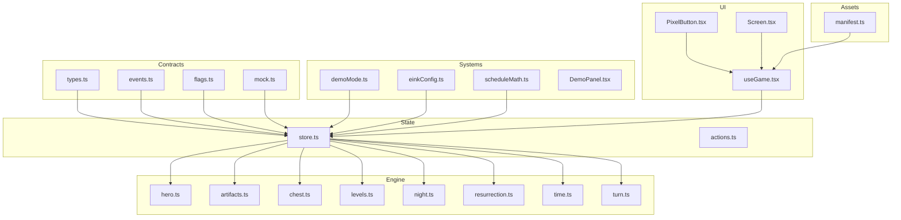
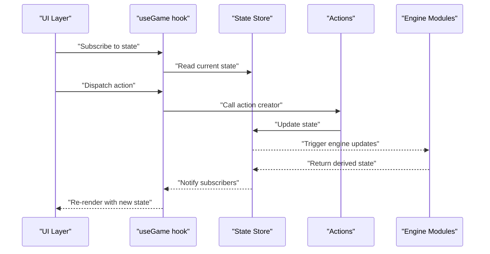
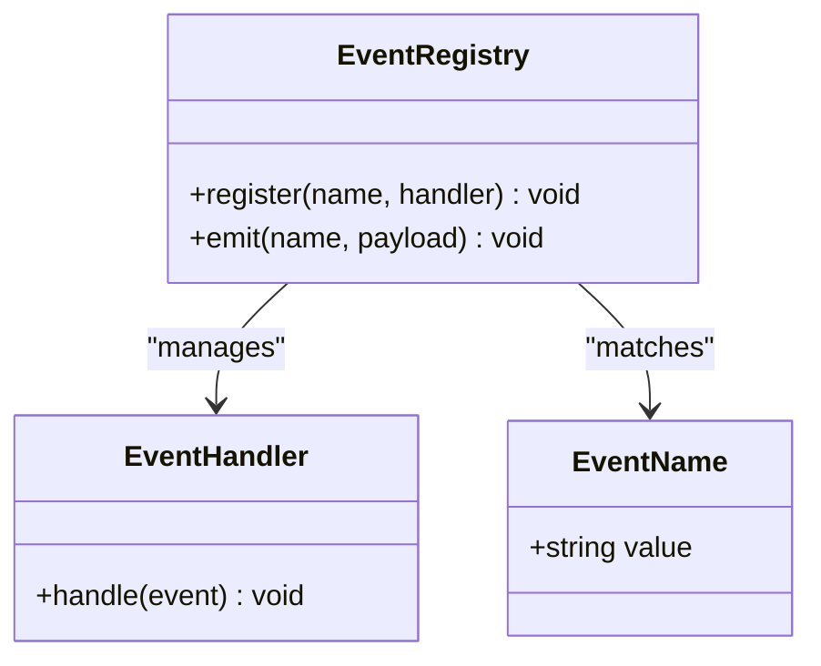
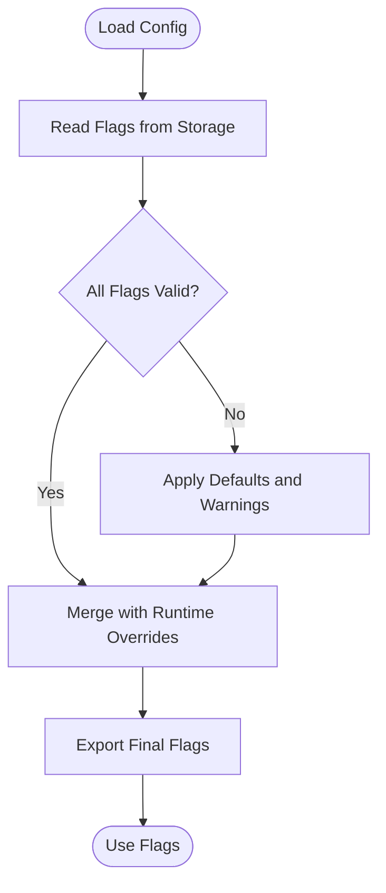
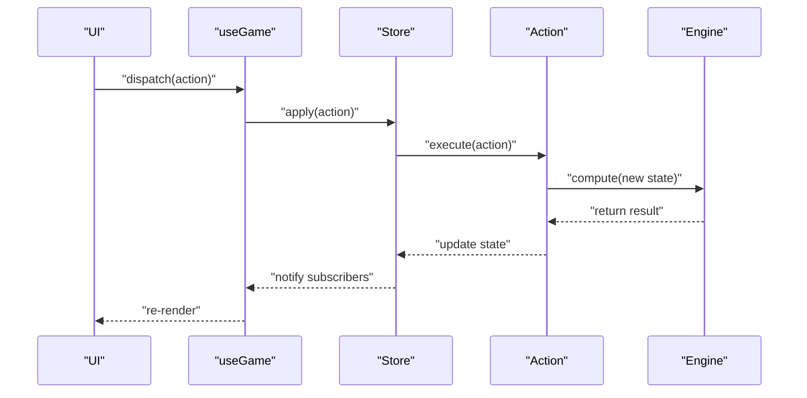
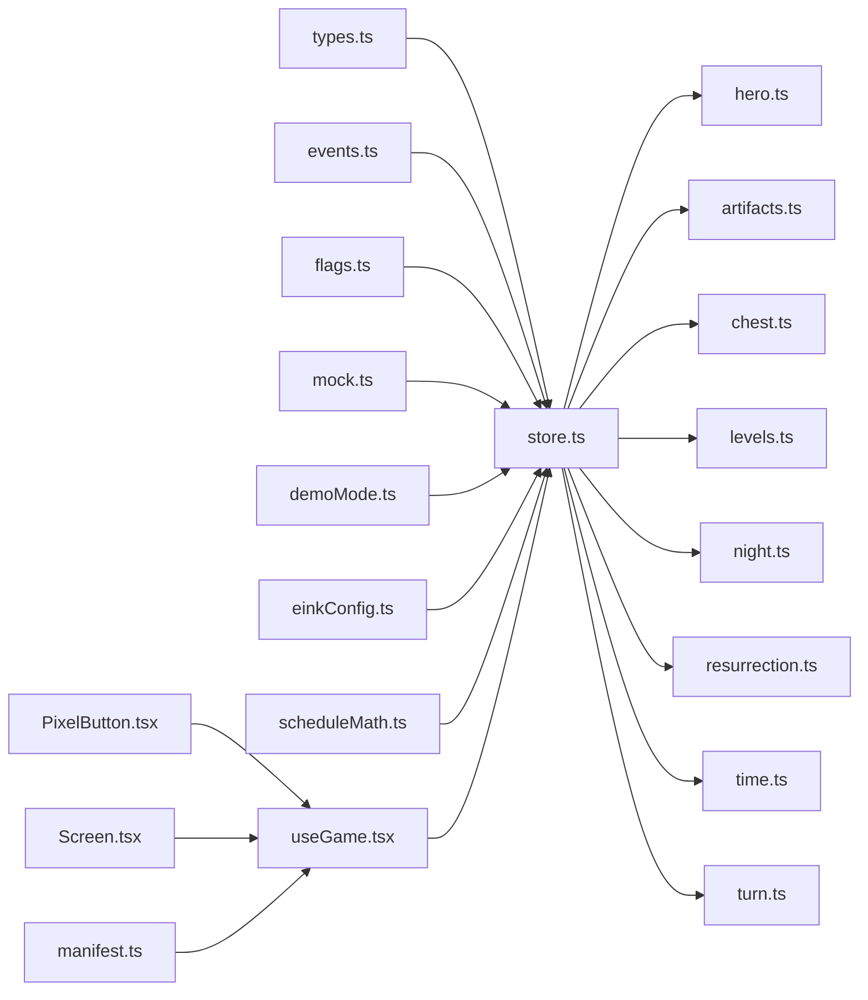

# API Reference

<cite>
**Referenced Files in This Document**
- [events.ts](file://src/contracts/events.ts)
- [flags.ts](file://src/contracts/flags.ts)
- [mock.ts](file://src/contracts/mock.ts)
- [types.ts](file://src/contracts/types.ts)
- [store.ts](file://src/state/store.ts)
- [actions.ts](file://src/state/actions.ts)
- [hero.ts](file://src/engine/hero.ts)
- [artifacts.ts](file://src/engine/artifacts.ts)
- [chest.ts](file://src/engine/chest.ts)
- [levels.ts](file://src/engine/levels.ts)
- [night.ts](file://src/engine/night.ts)
- [resurrection.ts](file://src/engine/resurrection.ts)
- [time.ts](file://src/engine/time.ts)
- [turn.ts](file://src/engine/turn.ts)
- [DemoPanel.tsx](file://src/systems/DemoPanel.tsx)
- [demoMode.ts](file://src/systems/demoMode.ts)
- [einkConfig.ts](file://src/systems/einkConfig.ts)
- [scheduleMath.ts](file://src/systems/scheduleMath.ts)
- [useGame.tsx](file://src/ui/useGame.tsx)
- [PixelButton.tsx](file://src/ui/PixelButton.tsx)
- [Screen.tsx](file://src/ui/Screen.tsx)
- [manifest.ts](file://assets/manifest.ts)
</cite>

## Table of Contents

1. [Introduction](#introduction)
2. [Project Structure](#project-structure)
3. [Core Components](#core-components)
4. [Architecture Overview](#architecture-overview)
5. [Detailed Component Analysis](#detailed-component-analysis)
6. [Dependency Analysis](#dependency-analysis)
7. [Performance Considerations](#performance-considerations)
8. [Troubleshooting Guide](#troubleshooting-guide)
9. [Conclusion](#conclusion)
10. [Appendices](#appendices)

## Introduction

This document provides a comprehensive API reference for the application’s public interfaces and data contracts. It focuses on TypeScript interfaces, type definitions, and schemas used across the codebase, with special attention to:

- Event system types, payloads, and handler patterns
- Flag systems for feature toggles and configuration options
- Mock implementations and testing utilities
- Examples of API usage, parameter validation, and error handling patterns
- Contract evolution and backward compatibility considerations

The goal is to make it easy for both new and experienced developers to understand how to interact with the engine, state management, UI hooks, and configuration layers safely and consistently.

## Project Structure

At a high level, the project organizes its public APIs into clear layers:

- Contracts: Core types, events, flags, and mocks
- State: Store and actions that drive application state transitions
- Engine: Game logic modules (heroes, artifacts, chests, levels, night cycle, resurrection, time, turns)
- Systems: Cross-cutting features like demo mode, eink configuration, scheduling, audio, NFC, notifications, etc.
- UI: Reusable components and hooks that consume state and engine capabilities
- Assets: Manifests and resources consumed by the app

**Diagram sources**

- [types.ts](file://src/contracts/types.ts)
- [events.ts](file://src/contracts/events.ts)
- [flags.ts](file://src/contracts/flags.ts)
- [mock.ts](file://src/contracts/mock.ts)
- [store.ts](file://src/state/store.ts)
- [actions.ts](file://src/state/actions.ts)
- [hero.ts](file://src/engine/hero.ts)
- [artifacts.ts](file://src/engine/artifacts.ts)
- [chest.ts](file://src/engine/chest.ts)
- [levels.ts](file://src/engine/levels.ts)
- [night.ts](file://src/engine/night.ts)
- [resurrection.ts](file://src/engine/resurrection.ts)
- [time.ts](file://src/engine/time.ts)
- [turn.ts](file://src/engine/turn.ts)
- [demoMode.ts](file://src/systems/demoMode.ts)
- [einkConfig.ts](file://src/systems/einkConfig.ts)
- [scheduleMath.ts](file://src/systems/scheduleMath.ts)
- [DemoPanel.tsx](file://src/systems/DemoPanel.tsx)
- [useGame.tsx](file://src/ui/useGame.tsx)
- [PixelButton.tsx](file://src/ui/PixelButton.tsx)
- [Screen.tsx](file://src/ui/Screen.tsx)
- [manifest.ts](file://assets/manifest.ts)

**Section sources**

- [types.ts](file://src/contracts/types.ts)
- [events.ts](file://src/contracts/events.ts)
- [flags.ts](file://src/contracts/flags.ts)
- [mock.ts](file://src/contracts/mock.ts)
- [store.ts](file://src/state/store.ts)
- [actions.ts](file://src/state/actions.ts)
- [hero.ts](file://src/engine/hero.ts)
- [artifacts.ts](file://src/engine/artifacts.ts)
- [chest.ts](file://src/engine/chest.ts)
- [levels.ts](file://src/engine/levels.ts)
- [night.ts](file://src/engine/night.ts)
- [resurrection.ts](file://src/engine/resurrection.ts)
- [time.ts](file://src/engine/time.ts)
- [turn.ts](file://src/engine/turn.ts)
- [demoMode.ts](file://src/systems/demoMode.ts)
- [einkConfig.ts](file://src/systems/einkConfig.ts)
- [scheduleMath.ts](file://src/systems/scheduleMath.ts)
- [DemoPanel.tsx](file://src/systems/DemoPanel.tsx)
- [useGame.tsx](file://src/ui/useGame.tsx)
- [PixelButton.tsx](file://src/ui/PixelButton.tsx)
- [Screen.tsx](file://src/ui/Screen.tsx)
- [manifest.ts](file://assets/manifest.ts)

## Core Components

This section outlines the primary public contracts and their responsibilities:

- Types and Data Contracts: Centralized TypeScript interfaces and schemas used throughout the app
- Events: Typed event names, payload structures, and handler registration patterns
- Flags: Feature toggle and configuration keys with default values and validation
- Mocks: Deterministic fixtures and helpers for unit tests and demos

Key areas to focus on when integrating:

- Use typed events to ensure payload correctness at call sites
- Read flags from the configuration layer and avoid hardcoding feature gates
- Leverage mock utilities to write stable tests without external dependencies

**Section sources**

- [types.ts](file://src/contracts/types.ts)
- [events.ts](file://src/contracts/events.ts)
- [flags.ts](file://src/contracts/flags.ts)
- [mock.ts](file://src/contracts/mock.ts)

## Architecture Overview

The application follows a layered architecture:

- Contracts define immutable data shapes and event contracts
- State encapsulates the single source of truth and exposes actions
- Engine modules implement game logic and expose pure functions or stateful services
- Systems provide cross-cutting concerns (audio, NFC, scheduling, demo mode)
- UI consumes state via hooks and renders interactive screens

**Diagram sources**

- [useGame.tsx](file://src/ui/useGame.tsx)
- [store.ts](file://src/state/store.ts)
- [actions.ts](file://src/state/actions.ts)
- [hero.ts](file://src/engine/hero.ts)
- [artifacts.ts](file://src/engine/artifacts.ts)
- [chest.ts](file://src/engine/chest.ts)
- [levels.ts](file://src/engine/levels.ts)
- [night.ts](file://src/engine/night.ts)
- [resurrection.ts](file://src/engine/resurrection.ts)
- [time.ts](file://src/engine/time.ts)
- [turn.ts](file://src/engine/turn.ts)

## Detailed Component Analysis

### Contracts: Types and Data Schemas

Centralized type definitions include core entities such as heroes, artifacts, chests, levels, and game state slices. These types are consumed by the store, engine, and UI layers to ensure consistent data shapes.

Highlights:

- Strongly-typed entity models with required and optional fields
- Discriminated unions for variant states where applicable
- Immutable update patterns enforced by type constraints

Usage guidance:

- Prefer importing shared types over redefining local interfaces
- Validate incoming data against these types before processing
- Extend types carefully to maintain backward compatibility

**Section sources**

- [types.ts](file://src/contracts/types.ts)

### Contracts: Event System

The event system defines typed event names and payloads, enabling safe publish-subscribe interactions between modules.

Key aspects:

- Event name constants for strict matching
- Payload interfaces per event type
- Handler registration patterns for decoupled communication

Best practices:

- Always dispatch typed events with validated payloads
- Handle unknown events gracefully in consumers
- Avoid side effects inside event handlers; delegate to actions or engine methods

**Diagram sources**

- [events.ts](file://src/contracts/events.ts)

**Section sources**

- [events.ts](file://src/contracts/events.ts)

### Contracts: Flags and Configuration

Flags represent feature toggles and configuration options. They typically include:

- Key identifiers
- Default values
- Validation rules or ranges
- Descriptions for discoverability

Recommendations:

- Access flags through a central configuration module
- Provide fallback defaults for missing keys
- Log warnings for deprecated or invalid flag values

**Diagram sources**

- [flags.ts](file://src/contracts/flags.ts)

**Section sources**

- [flags.ts](file://src/contracts/flags.ts)

### Contracts: Mock Implementations and Testing Utilities

Mock utilities provide deterministic fixtures for unit tests and demos. They include:

- Predefined state snapshots
- Factory functions for creating test entities
- Helpers to simulate events and engine responses

Testing tips:

- Use mocks to isolate behavior under test
- Keep fixtures aligned with evolving types
- Assert on derived state rather than implementation details

**Section sources**

- [mock.ts](file://src/contracts/mock.ts)

### State Management: Store and Actions

The store manages the application’s single source of truth. Actions encapsulate state transitions and coordinate engine updates.

Responsibilities:

- Initialize and persist state
- Expose typed actions for mutations
- Coordinate engine-side computations and side effects

Patterns:

- Pure reducers for predictable updates
- Thunks or async actions for I/O-bound operations
- Selectors for efficient UI subscriptions

**Diagram sources**

- [store.ts](file://src/state/store.ts)
- [actions.ts](file://src/state/actions.ts)
- [hero.ts](file://src/engine/hero.ts)
- [artifacts.ts](file://src/engine/artifacts.ts)
- [chest.ts](file://src/engine/chest.ts)
- [levels.ts](file://src/engine/levels.ts)
- [night.ts](file://src/engine/night.ts)
- [resurrection.ts](file://src/engine/resurrection.ts)
- [time.ts](file://src/engine/time.ts)
- [turn.ts](file://src/engine/turn.ts)

**Section sources**

- [store.ts](file://src/state/store.ts)
- [actions.ts](file://src/state/actions.ts)

### Engine: Core Game Logic Modules

Engine modules encapsulate domain-specific logic:

- Hero management and attributes
- Artifact inventory and effects
- Chest interactions and loot tables
- Level progression and milestones
- Night cycle and environmental effects
- Resurrection mechanics and penalties
- Time tracking and scheduling
- Turn-based resolution and sequencing

Guidelines:

- Keep engine functions pure where possible
- Return new state objects instead of mutating existing ones
- Expose clear APIs for integration with the store

**Section sources**

- [hero.ts](file://src/engine/hero.ts)
- [artifacts.ts](file://src/engine/artifacts.ts)
- [chest.ts](file://src/engine/chest.ts)
- [levels.ts](file://src/engine/levels.ts)
- [night.ts](file://src/engine/night.ts)
- [resurrection.ts](file://src/engine/resurrection.ts)
- [time.ts](file://src/engine/time.ts)
- [turn.ts](file://src/engine/turn.ts)

### Systems: Demo Mode, E Ink Configuration, Scheduling

Cross-cutting systems enhance gameplay and device integration:

- Demo mode toggles and scripted sequences
- E Ink display configuration and performance tuning
- Schedule math for time-based events and reminders

Integration notes:

- Configure systems early in app lifecycle
- Respect user preferences and platform constraints
- Debounce heavy operations to maintain responsiveness

**Section sources**

- [demoMode.ts](file://src/systems/demoMode.ts)
- [einkConfig.ts](file://src/systems/einkConfig.ts)
- [scheduleMath.ts](file://src/systems/scheduleMath.ts)
- [DemoPanel.tsx](file://src/systems/DemoPanel.tsx)

### UI: Hooks and Components

UI layer consumes state via hooks and renders interactive elements:

- useGame hook provides reactive access to store state and actions
- PixelButton and Screen components offer reusable UI primitives
- Asset manifest supplies metadata for dynamic loading

Usage patterns:

- Subscribe only to necessary state slices
- Memoize expensive computations in selectors
- Handle loading and error states explicitly

**Section sources**

- [useGame.tsx](file://src/ui/useGame.tsx)
- [PixelButton.tsx](file://src/ui/PixelButton.tsx)
- [Screen.tsx](file://src/ui/Screen.tsx)
- [manifest.ts](file://assets/manifest.ts)

## Dependency Analysis

The following diagram illustrates key dependencies among modules:

**Diagram sources**

- [types.ts](file://src/contracts/types.ts)
- [events.ts](file://src/contracts/events.ts)
- [flags.ts](file://src/contracts/flags.ts)
- [mock.ts](file://src/contracts/mock.ts)
- [store.ts](file://src/state/store.ts)
- [hero.ts](file://src/engine/hero.ts)
- [artifacts.ts](file://src/engine/artifacts.ts)
- [chest.ts](file://src/engine/chest.ts)
- [levels.ts](file://src/engine/levels.ts)
- [night.ts](file://src/engine/night.ts)
- [resurrection.ts](file://src/engine/resurrection.ts)
- [time.ts](file://src/engine/time.ts)
- [turn.ts](file://src/engine/turn.ts)
- [demoMode.ts](file://src/systems/demoMode.ts)
- [einkConfig.ts](file://src/systems/einkConfig.ts)
- [scheduleMath.ts](file://src/systems/scheduleMath.ts)
- [useGame.tsx](file://src/ui/useGame.tsx)
- [PixelButton.tsx](file://src/ui/PixelButton.tsx)
- [Screen.tsx](file://src/ui/Screen.tsx)
- [manifest.ts](file://assets/manifest.ts)

**Section sources**

- [store.ts](file://src/state/store.ts)
- [actions.ts](file://src/state/actions.ts)
- [useGame.tsx](file://src/ui/useGame.tsx)

## Performance Considerations

- Minimize re-renders by subscribing to specific state slices in hooks
- Use memoization for derived computations in selectors
- Batch state updates to reduce churn during complex operations
- Defer heavy engine calculations to background tasks where possible
- Profile memory usage for large asset manifests and sprite atlases

[No sources needed since this section provides general guidance]

## Troubleshooting Guide

Common issues and resolutions:

- Event payload mismatches: Ensure payloads conform to defined interfaces; add runtime checks if necessary
- Flag misconfiguration: Validate flags at startup and log warnings for invalid values
- State inconsistencies: Verify actions are pure and do not mutate existing state
- UI desynchronization: Confirm hooks subscribe to correct state slices and handle loading/error states
- Engine errors: Isolate failures in engine modules and return safe fallback states

Debugging tips:

- Enable verbose logging in development builds
- Use mock fixtures to reproduce edge cases deterministically
- Add assertions around critical transitions in actions

**Section sources**

- [events.ts](file://src/contracts/events.ts)
- [flags.ts](file://src/contracts/flags.ts)
- [store.ts](file://src/state/store.ts)
- [actions.ts](file://src/state/actions.ts)

## Conclusion

This API reference consolidates the application’s public interfaces, event contracts, flags, and testing utilities. By adhering to the documented patterns—typed events, immutable state updates, and modular engine design—you can extend functionality safely while maintaining backward compatibility and performance.

[No sources needed since this section summarizes without analyzing specific files]

## Appendices

### API Usage Examples

- Event dispatch: Create a typed event payload and emit via the registry; handle in consumers with pattern matching on event names
- Flag access: Read flags from the configuration module; apply defaults and validate ranges
- State mutation: Dispatch an action that triggers engine computation and returns a new state snapshot
- UI consumption: Use the game hook to subscribe to relevant state slices and render accordingly

[No sources needed since this section provides general guidance]

### Contract Evolution and Backward Compatibility

- Introduce new fields as optional to preserve compatibility
- Deprecate old fields gradually with migration helpers
- Maintain discriminators for union types to support multiple versions
- Version event payloads and route based on version numbers

[No sources needed since this section provides general guidance]
