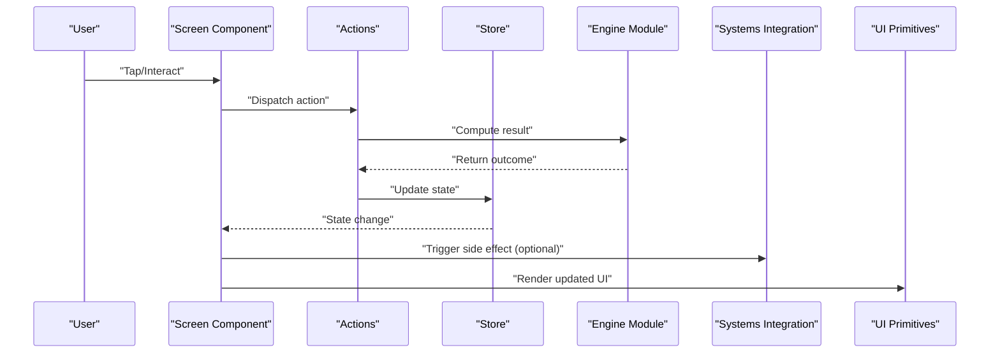
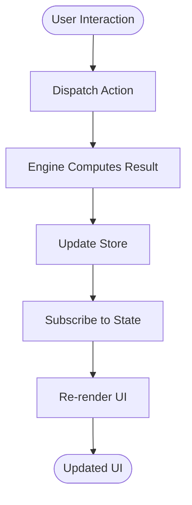
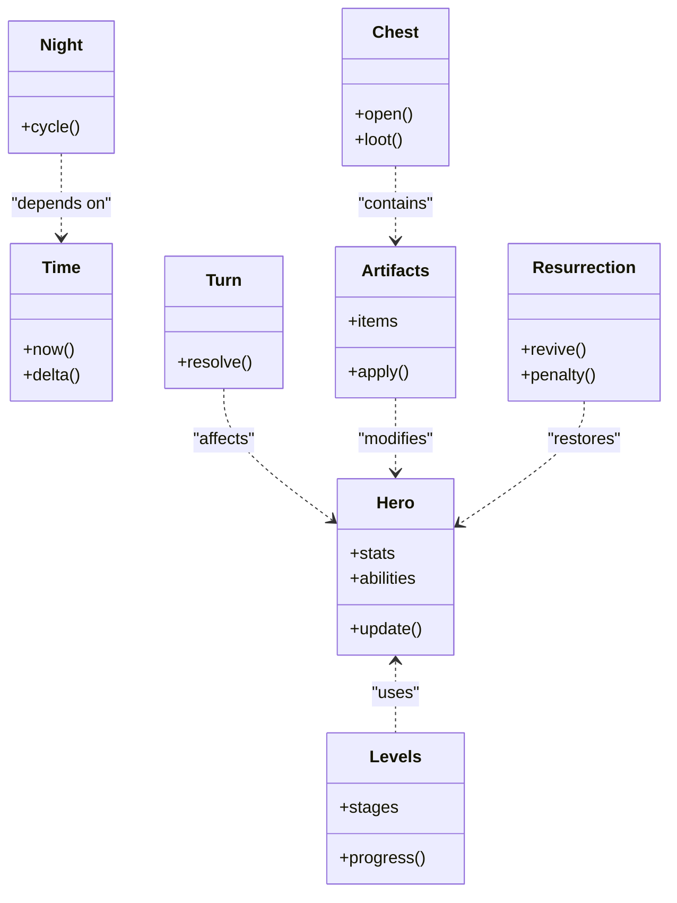
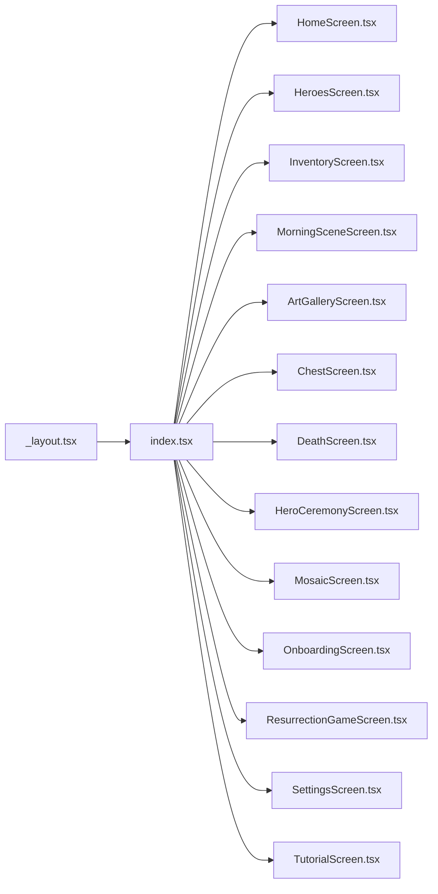
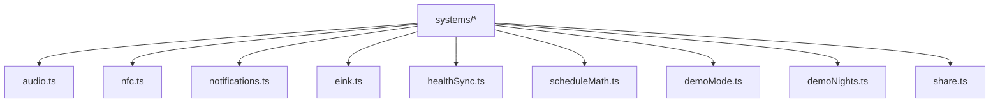
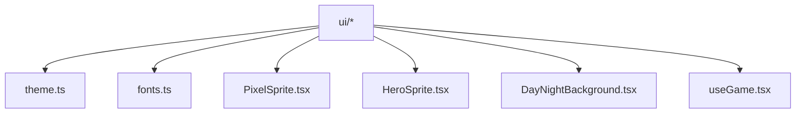
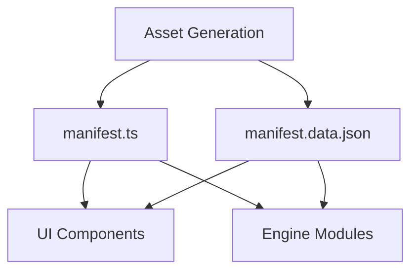
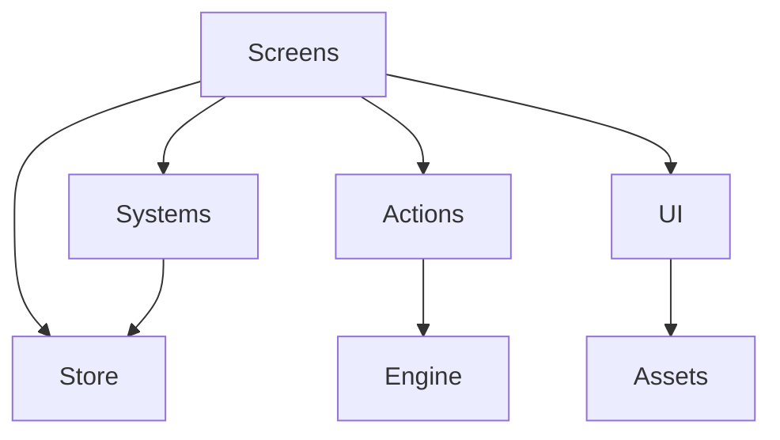

# Architecture Overview

<cite>
**Referenced Files in This Document**
- [app/_layout.tsx](file://app/_layout.tsx)
- [app/index.tsx](file://app/index.tsx)
- [src/screens/HomeScreen.tsx](file://src/screens/HomeScreen.tsx)
- [src/screens/HeroesScreen.tsx](file://src/screens/HeroesScreen.tsx)
- [src/screens/InventoryScreen.tsx](file://src/screens/InventoryScreen.tsx)
- [src/screens/MorningSceneScreen.tsx](file://src/screens/MorningSceneScreen.tsx)
- [src/screens/ArtGalleryScreen.tsx](file://src/screens/ArtGalleryScreen.tsx)
- [src/screens/ChestScreen.tsx](file://src/screens/ChestScreen.tsx)
- [src/screens/DeathScreen.tsx](file://src/screens/DeathScreen.tsx)
- [src/screens/HeroCeremonyScreen.tsx](file://src/screens/HeroCeremonyScreen.tsx)
- [src/screens/MosaicScreen.tsx](file://src/screens/MosaicScreen.tsx)
- [src/screens/OnboardingScreen.tsx](file://src/screens/OnboardingScreen.tsx)
- [src/screens/ResurrectionGameScreen.tsx](file://src/screens/ResurrectionGameScreen.tsx)
- [src/screens/SettingsScreen.tsx](file://src/screens/SettingsScreen.tsx)
- [src/screens/TutorialScreen.tsx](file://src/screens/TutorialScreen.tsx)
- [src/state/store.ts](file://src/state/store.ts)
- [src/state/actions.ts](file://src/state/actions.ts)
- [src/engine/artifacts.ts](file://src/engine/artifacts.ts)
- [src/engine/chest.ts](file://src/engine/chest.ts)
- [src/engine/hero.ts](file://src/engine/hero.ts)
- [src/engine/levels.ts](file://src/engine/levels.ts)
- [src/engine/night.ts](file://src/engine/night.ts)
- [src/engine/resurrection.ts](file://src/engine/resurrection.ts)
- [src/engine/time.ts](file://src/engine/time.ts)
- [src/engine/turn.ts](file://src/engine/turn.ts)
- [src/systems/audio.ts](file://src/systems/audio.ts)
- [src/systems/eink.ts](file://src/systems/eink.ts)
- [src/systems/nfc.ts](file://src/systems/nfc.ts)
- [src/systems/notifications.ts](file://src/systems/notifications.ts)
- [src/systems/scheduleMath.ts](file://src/systems/scheduleMath.ts)
- [src/systems/healthSync.ts](file://src/systems/healthSync.ts)
- [src/systems/demoMode.ts](file://src/systems/demoMode.ts)
- [src/systems/demoNights.ts](file://src/systems/demoNights.ts)
- [src/systems/share.ts](file://src/systems/share.ts)
- [src/ui/theme.ts](file://src/ui/theme.ts)
- [src/ui/fonts.ts](file://src/ui/fonts.ts)
- [src/ui/useGame.tsx](file://src/ui/useGame.tsx)
- [src/ui/DayNightBackground.tsx](file://src/ui/DayNightBackground.tsx)
- [src/ui/PixelSprite.tsx](file://src/ui/PixelSprite.tsx)
- [src/ui/HeroSprite.tsx](file://src/ui/HeroSprite.tsx)
- [assets/manifest.ts](file://assets/manifest.ts)
- [assets/manifest.data.json](file://assets/manifest.data.json)
</cite>

## Table of Contents

1. [Introduction](#introduction)
2. [Project Structure](#project-structure)
3. [Core Components](#core-components)
4. [Architecture Overview](#architecture-overview)
5. [Detailed Component Analysis](#detailed-component-analysis)
6. [Dependency Analysis](#dependency-analysis)
7. [Performance Considerations](#performance-considerations)
8. [Troubleshooting Guide](#troubleshooting-guide)
9. [Conclusion](#conclusion)

## Introduction

This document describes the architecture of a React Native mobile game with a clear separation between:

- Engine logic (game mechanics and rules)
- UI components (React Native screens and shared UI primitives)
- System integrations (hardware APIs, platform services)
- Centralized state management (actions and store)
- Asset pipeline and theme system

The design follows component-based patterns, screen-based navigation, and a unidirectional data flow from user interactions to actions, then to state updates and UI re-renders.

## Project Structure

The project is organized into distinct layers:

- app: Entry points and screen modules for navigation
- src/engine: Pure game logic modules (artifacts, chest, hero, levels, night, resurrection, time, turn)
- src/screens: React Native screens that compose UI and interact with state
- src/state: Centralized store and actions
- src/systems: Platform integrations (audio, NFC, notifications, eInk, health sync, scheduling math, demo mode)
- src/ui: Shared UI primitives, theming, fonts, animations, and hooks
- assets: Manifests and generated assets for the asset pipeline

```mermaid
graph TB
subgraph "App Layer"
Layout["_layout.tsx"]
Index["index.tsx"]
Screens["Screens (Home, Heroes, Inventory, MorningScene, ArtGallery, Chest, Death, HeroCeremony, Mosaic, Onboarding, Resurrection, Settings, Tutorial)"]
end
subgraph "State Layer"
Store["store.ts"]
Actions["actions.ts"]
end
subgraph "Engine Layer"
Engine["engine/* (artifacts, chest, hero, levels, night, resurrection, time, turn)"]
end
subgraph "Systems Layer"
Systems["systems/* (audio, eink, nfc, notifications, scheduleMath, healthSync, demoMode, demoNights, share)"]
end
subgraph "UI Layer"
UI["ui/* (theme, fonts, PixelSprite, HeroSprite, DayNightBackground, useGame)"]
end
subgraph "Assets"
Assets["assets/manifest.ts<br/>assets/manifest.data.json"]
end
Screens --> Store
Screens --> Actions
Actions --> Engine
Screens --> UI
Screens --> Systems
UI --> Assets
Systems --> Store
```

**Diagram sources**

- [app/_layout.tsx](file://app/_layout.tsx)
- [app/index.tsx](file://app/index.tsx)
- [src/screens/HomeScreen.tsx](file://src/screens/HomeScreen.tsx)
- [src/screens/HeroesScreen.tsx](file://src/screens/HeroesScreen.tsx)
- [src/screens/InventoryScreen.tsx](file://src/screens/InventoryScreen.tsx)
- [src/screens/MorningSceneScreen.tsx](file://src/screens/MorningSceneScreen.tsx)
- [src/screens/ArtGalleryScreen.tsx](file://src/screens/ArtGalleryScreen.tsx)
- [src/screens/ChestScreen.tsx](file://src/screens/ChestScreen.tsx)
- [src/screens/DeathScreen.tsx](file://src/screens/DeathScreen.tsx)
- [src/screens/HeroCeremonyScreen.tsx](file://src/screens/HeroCeremonyScreen.tsx)
- [src/screens/MosaicScreen.tsx](file://src/screens/MosaicScreen.tsx)
- [src/screens/OnboardingScreen.tsx](file://src/screens/OnboardingScreen.tsx)
- [src/screens/ResurrectionGameScreen.tsx](file://src/screens/ResurrectionGameScreen.tsx)
- [src/screens/SettingsScreen.tsx](file://src/screens/SettingsScreen.tsx)
- [src/screens/TutorialScreen.tsx](file://src/screens/TutorialScreen.tsx)
- [src/state/store.ts](file://src/state/store.ts)
- [src/state/actions.ts](file://src/state/actions.ts)
- [src/engine/artifacts.ts](file://src/engine/artifacts.ts)
- [src/engine/chest.ts](file://src/engine/chest.ts)
- [src/engine/hero.ts](file://src/engine/hero.ts)
- [src/engine/levels.ts](file://src/engine/levels.ts)
- [src/engine/night.ts](file://src/engine/night.ts)
- [src/engine/resurrection.ts](file://src/engine/resurrection.ts)
- [src/engine/time.ts](file://src/engine/time.ts)
- [src/engine/turn.ts](file://src/engine/turn.ts)
- [src/systems/audio.ts](file://src/systems/audio.ts)
- [src/systems/eink.ts](file://src/systems/eink.ts)
- [src/systems/nfc.ts](file://src/systems/nfc.ts)
- [src/systems/notifications.ts](file://src/systems/notifications.ts)
- [src/systems/scheduleMath.ts](file://src/systems/scheduleMath.ts)
- [src/systems/healthSync.ts](file://src/systems/healthSync.ts)
- [src/systems/demoMode.ts](file://src/systems/demoMode.ts)
- [src/systems/demoNights.ts](file://src/systems/demoNights.ts)
- [src/systems/share.ts](file://src/systems/share.ts)
- [src/ui/theme.ts](file://src/ui/theme.ts)
- [src/ui/fonts.ts](file://src/ui/fonts.ts)
- [src/ui/useGame.tsx](file://src/ui/useGame.tsx)
- [src/ui/DayNightBackground.tsx](file://src/ui/DayNightBackground.tsx)
- [src/ui/PixelSprite.tsx](file://src/ui/PixelSprite.tsx)
- [src/ui/HeroSprite.tsx](file://src/ui/HeroSprite.tsx)
- [assets/manifest.ts](file://assets/manifest.ts)
- [assets/manifest.data.json](file://assets/manifest.data.json)

**Section sources**

- [app/_layout.tsx](file://app/_layout.tsx)
- [app/index.tsx](file://app/index.tsx)

## Core Components

- State Management: Centralized store and actions define the single source of truth and how it mutates.
- Engine Modules: Pure functions/classes encapsulate game mechanics without UI or platform concerns.
- Screen Components: React Native screens orchestrate user input, call actions, read state, and render UI.
- Systems Integrations: Encapsulate hardware/platform features such as audio, NFC, notifications, eInk, health sync, and scheduling.
- UI Primitives: Reusable pixel-art components, theming, fonts, and animation utilities.
- Asset Pipeline: Manifest files describe available assets consumed by UI and engine.

Key responsibilities:

- Actions dispatch changes to the store based on user events and engine outcomes.
- Engine modules compute deterministic results from inputs (e.g., hero stats, level progression).
- Systems provide side effects (I/O) like playing sounds or syncing health data.
- UI renders state via hooks and composes primitives.

**Section sources**

- [src/state/store.ts](file://src/state/store.ts)
- [src/state/actions.ts](file://src/state/actions.ts)
- [src/engine/artifacts.ts](file://src/engine/artifacts.ts)
- [src/engine/chest.ts](file://src/engine/chest.ts)
- [src/engine/hero.ts](file://src/engine/hero.ts)
- [src/engine/levels.ts](file://src/engine/levels.ts)
- [src/engine/night.ts](file://src/engine/night.ts)
- [src/engine/resurrection.ts](file://src/engine/resurrection.ts)
- [src/engine/time.ts](file://src/engine/time.ts)
- [src/engine/turn.ts](file://src/engine/turn.ts)
- [src/systems/audio.ts](file://src/systems/audio.ts)
- [src/systems/eink.ts](file://src/systems/eink.ts)
- [src/systems/nfc.ts](file://src/systems/nfc.ts)
- [src/systems/notifications.ts](file://src/systems/notifications.ts)
- [src/systems/scheduleMath.ts](file://src/systems/scheduleMath.ts)
- [src/systems/healthSync.ts](file://src/systems/healthSync.ts)
- [src/systems/demoMode.ts](file://src/systems/demoMode.ts)
- [src/systems/demoNights.ts](file://src/systems/demoNights.ts)
- [src/systems/share.ts](file://src/systems/share.ts)
- [src/ui/theme.ts](file://src/ui/theme.ts)
- [src/ui/fonts.ts](file://src/ui/fonts.ts)
- [src/ui/useGame.tsx](file://src/ui/useGame.tsx)
- [assets/manifest.ts](file://assets/manifest.ts)
- [assets/manifest.data.json](file://assets/manifest.data.json)

## Architecture Overview

The application follows a layered architecture:

- App layer defines screens and navigation entry points.
- State layer centralizes data and mutations through actions.
- Engine layer contains pure game logic.
- Systems layer abstracts platform/hardware integrations.
- UI layer provides reusable components and theming.
- Assets are referenced via manifests.



**Diagram sources**

- [src/screens/HomeScreen.tsx](file://src/screens/HomeScreen.tsx)
- [src/state/actions.ts](file://src/state/actions.ts)
- [src/state/store.ts](file://src/state/store.ts)
- [src/engine/hero.ts](file://src/engine/hero.ts)
- [src/systems/audio.ts](file://src/systems/audio.ts)
- [src/ui/PixelSprite.tsx](file://src/ui/PixelSprite.tsx)

## Detailed Component Analysis

### State Management and Data Flow

- Store holds global game state and exposes selectors/hooks for screens.
- Actions encapsulate business operations, calling engine modules to compute new state and updating the store accordingly.
- Screens subscribe to state via hooks and trigger actions on user interactions.



**Diagram sources**

- [src/state/actions.ts](file://src/state/actions.ts)
- [src/state/store.ts](file://src/state/store.ts)
- [src/engine/hero.ts](file://src/engine/hero.ts)
- [src/ui/useGame.tsx](file://src/ui/useGame.tsx)

**Section sources**

- [src/state/store.ts](file://src/state/store.ts)
- [src/state/actions.ts](file://src/state/actions.ts)
- [src/ui/useGame.tsx](file://src/ui/useGame.tsx)

### Engine Modules

Engine modules implement deterministic game mechanics:

- Hero: character stats, abilities, and lifecycle
- Levels: progression and stage definitions
- Night: day/night cycle logic
- Time: temporal calculations
- Turn: turn-based resolution
- Artifacts: item definitions and effects
- Chest: loot and reward mechanics
- Resurrection: revival rules and penalties

These modules are pure and avoid direct UI or platform dependencies, ensuring testability and predictability.



**Diagram sources**

- [src/engine/hero.ts](file://src/engine/hero.ts)
- [src/engine/levels.ts](file://src/engine/levels.ts)
- [src/engine/night.ts](file://src/engine/night.ts)
- [src/engine/time.ts](file://src/engine/time.ts)
- [src/engine/turn.ts](file://src/engine/turn.ts)
- [src/engine/artifacts.ts](file://src/engine/artifacts.ts)
- [src/engine/chest.ts](file://src/engine/chest.ts)
- [src/engine/resurrection.ts](file://src/engine/resurrection.ts)

**Section sources**

- [src/engine/hero.ts](file://src/engine/hero.ts)
- [src/engine/levels.ts](file://src/engine/levels.ts)
- [src/engine/night.ts](file://src/engine/night.ts)
- [src/engine/time.ts](file://src/engine/time.ts)
- [src/engine/turn.ts](file://src/engine/turn.ts)
- [src/engine/artifacts.ts](file://src/engine/artifacts.ts)
- [src/engine/chest.ts](file://src/engine/chest.ts)
- [src/engine/resurrection.ts](file://src/engine/resurrection.ts)

### Screen Components and Navigation

Screens are React Native components responsible for:

- Rendering UI using primitives and themes
- Subscribing to store state
- Dispatching actions on user interactions
- Invoking systems integrations when needed

Navigation is managed at the app layer with layout and index entry points.



**Diagram sources**

- [app/_layout.tsx](file://app/_layout.tsx)
- [app/index.tsx](file://app/index.tsx)
- [src/screens/HomeScreen.tsx](file://src/screens/HomeScreen.tsx)
- [src/screens/HeroesScreen.tsx](file://src/screens/HeroesScreen.tsx)
- [src/screens/InventoryScreen.tsx](file://src/screens/InventoryScreen.tsx)
- [src/screens/MorningSceneScreen.tsx](file://src/screens/MorningSceneScreen.tsx)
- [src/screens/ArtGalleryScreen.tsx](file://src/screens/ArtGalleryScreen.tsx)
- [src/screens/ChestScreen.tsx](file://src/screens/ChestScreen.tsx)
- [src/screens/DeathScreen.tsx](file://src/screens/DeathScreen.tsx)
- [src/screens/HeroCeremonyScreen.tsx](file://src/screens/HeroCeremonyScreen.tsx)
- [src/screens/MosaicScreen.tsx](file://src/screens/MosaicScreen.tsx)
- [src/screens/OnboardingScreen.tsx](file://src/screens/OnboardingScreen.tsx)
- [src/screens/ResurrectionGameScreen.tsx](file://src/screens/ResurrectionGameScreen.tsx)
- [src/screens/SettingsScreen.tsx](file://src/screens/SettingsScreen.tsx)
- [src/screens/TutorialScreen.tsx](file://src/screens/TutorialScreen.tsx)

**Section sources**

- [app/_layout.tsx](file://app/_layout.tsx)
- [app/index.tsx](file://app/index.tsx)
- [src/screens/HomeScreen.tsx](file://src/screens/HomeScreen.tsx)
- [src/screens/HeroesScreen.tsx](file://src/screens/HeroesScreen.tsx)
- [src/screens/InventoryScreen.tsx](file://src/screens/InventoryScreen.tsx)
- [src/screens/MorningSceneScreen.tsx](file://src/screens/MorningSceneScreen.tsx)
- [src/screens/ArtGalleryScreen.tsx](file://src/screens/ArtGalleryScreen.tsx)
- [src/screens/ChestScreen.tsx](file://src/screens/ChestScreen.tsx)
- [src/screens/DeathScreen.tsx](file://src/screens/DeathScreen.tsx)
- [src/screens/HeroCeremonyScreen.tsx](file://src/screens/HeroCeremonyScreen.tsx)
- [src/screens/MosaicScreen.tsx](file://src/screens/MosaicScreen.tsx)
- [src/screens/OnboardingScreen.tsx](file://src/screens/OnboardingScreen.tsx)
- [src/screens/ResurrectionGameScreen.tsx](file://src/screens/ResurrectionGameScreen.tsx)
- [src/screens/SettingsScreen.tsx](file://src/screens/SettingsScreen.tsx)
- [src/screens/TutorialScreen.tsx](file://src/screens/TutorialScreen.tsx)

### Systems Integrations

Systems encapsulate platform-specific functionality:

- Audio: playback and volume control
- NFC: card reading/writing
- Notifications: alerts and reminders
- EInk: display optimizations for eInk devices
- Health Sync: integration with health data
- Schedule Math: date/time calculations
- Demo Mode: toggles for development/demo flows
- Share: sharing content across apps

Screens and actions may call these systems to perform side effects while keeping engine logic pure.



**Diagram sources**

- [src/systems/audio.ts](file://src/systems/audio.ts)
- [src/systems/nfc.ts](file://src/systems/nfc.ts)
- [src/systems/notifications.ts](file://src/systems/notifications.ts)
- [src/systems/eink.ts](file://src/systems/eink.ts)
- [src/systems/healthSync.ts](file://src/systems/healthSync.ts)
- [src/systems/scheduleMath.ts](file://src/systems/scheduleMath.ts)
- [src/systems/demoMode.ts](file://src/systems/demoMode.ts)
- [src/systems/demoNights.ts](file://src/systems/demoNights.ts)
- [src/systems/share.ts](file://src/systems/share.ts)

**Section sources**

- [src/systems/audio.ts](file://src/systems/audio.ts)
- [src/systems/nfc.ts](file://src/systems/nfc.ts)
- [src/systems/notifications.ts](file://src/systems/notifications.ts)
- [src/systems/eink.ts](file://src/systems/eink.ts)
- [src/systems/healthSync.ts](file://src/systems/healthSync.ts)
- [src/systems/scheduleMath.ts](file://src/systems/scheduleMath.ts)
- [src/systems/demoMode.ts](file://src/systems/demoMode.ts)
- [src/systems/demoNights.ts](file://src/systems/demoNights.ts)
- [src/systems/share.ts](file://src/systems/share.ts)

### UI Components and Theme System

UI layer provides:

- Pixel art primitives (PixelSprite, HeroSprite)
- Scene elements (DayNightBackground, SceneClouds, SceneGrass, SceneSun)
- Controls (PixelButton, WheelPicker)
- Theming (colors, typography, spacing)
- Fonts configuration
- Hooks for game state consumption (useGame)

Theme and fonts are centralized to ensure consistent visuals across screens.



**Diagram sources**

- [src/ui/theme.ts](file://src/ui/theme.ts)
- [src/ui/fonts.ts](file://src/ui/fonts.ts)
- [src/ui/PixelSprite.tsx](file://src/ui/PixelSprite.tsx)
- [src/ui/HeroSprite.tsx](file://src/ui/HeroSprite.tsx)
- [src/ui/DayNightBackground.tsx](file://src/ui/DayNightBackground.tsx)
- [src/ui/useGame.tsx](file://src/ui/useGame.tsx)

**Section sources**

- [src/ui/theme.ts](file://src/ui/theme.ts)
- [src/ui/fonts.ts](file://src/ui/fonts.ts)
- [src/ui/PixelSprite.tsx](file://src/ui/PixelSprite.tsx)
- [src/ui/HeroSprite.tsx](file://src/ui/HeroSprite.tsx)
- [src/ui/DayNightBackground.tsx](file://src/ui/DayNightBackground.tsx)
- [src/ui/useGame.tsx](file://src/ui/useGame.tsx)

### Asset Pipeline Architecture

Assets are described by manifests that list available resources:

- manifest.ts: TypeScript definitions for assets
- manifest.data.json: JSON data describing asset metadata

Screens and UI components consume these manifests to load sprites, audio, and other resources deterministically.



**Diagram sources**

- [assets/manifest.ts](file://assets/manifest.ts)
- [assets/manifest.data.json](file://assets/manifest.data.json)
- [src/ui/PixelSprite.tsx](file://src/ui/PixelSprite.tsx)
- [src/engine/artifacts.ts](file://src/engine/artifacts.ts)

**Section sources**

- [assets/manifest.ts](file://assets/manifest.ts)
- [assets/manifest.data.json](file://assets/manifest.data.json)

## Dependency Analysis

The dependency graph shows clear boundaries:

- Screens depend on state, UI, and systems
- Actions depend on engine modules
- Engine modules are pure and independent
- UI depends on theme, fonts, and assets
- Systems are isolated and invoked by screens/actions



**Diagram sources**

- [src/screens/HomeScreen.tsx](file://src/screens/HomeScreen.tsx)
- [src/state/actions.ts](file://src/state/actions.ts)
- [src/state/store.ts](file://src/state/store.ts)
- [src/engine/hero.ts](file://src/engine/hero.ts)
- [src/systems/audio.ts](file://src/systems/audio.ts)
- [src/ui/PixelSprite.tsx](file://src/ui/PixelSprite.tsx)
- [assets/manifest.ts](file://assets/manifest.ts)

**Section sources**

- [src/screens/HomeScreen.tsx](file://src/screens/HomeScreen.tsx)
- [src/state/actions.ts](file://src/state/actions.ts)
- [src/state/store.ts](file://src/state/store.ts)
- [src/engine/hero.ts](file://src/engine/hero.ts)
- [src/systems/audio.ts](file://src/systems/audio.ts)
- [src/ui/PixelSprite.tsx](file://src/ui/PixelSprite.tsx)
- [assets/manifest.ts](file://assets/manifest.ts)

## Performance Considerations

- Keep engine modules pure and memoize expensive computations where possible.
- Use selective subscriptions in screens to minimize re-renders.
- Batch state updates in actions to reduce frequent store writes.
- Optimize asset loading by lazy-loading large resources.
- Avoid heavy synchronous work on the UI thread; offload to background tasks if needed.

[No sources needed since this section provides general guidance]

## Troubleshooting Guide

Common issues and strategies:

- State inconsistencies: Verify actions update the store correctly and engine outputs are deterministic.
- Missing assets: Ensure manifests include required assets and paths are correct.
- Platform integrations failures: Wrap systems calls with try/catch and fallback behaviors.
- UI not updating: Confirm screens subscribe to the correct state slices and actions are dispatched.

**Section sources**

- [src/state/store.ts](file://src/state/store.ts)
- [src/state/actions.ts](file://src/state/actions.ts)
- [assets/manifest.ts](file://assets/manifest.ts)
- [assets/manifest.data.json](file://assets/manifest.data.json)
- [src/systems/audio.ts](file://src/systems/audio.ts)
- [src/systems/nfc.ts](file://src/systems/nfc.ts)
- [src/systems/notifications.ts](file://src/systems/notifications.ts)

## Conclusion

The architecture cleanly separates concerns across layers:

- Engine logic remains pure and testable
- UI components focus on presentation and interaction
- Systems encapsulate platform specifics
- Centralized state ensures predictable data flow
- Asset manifests standardize resource usage

This structure supports scalability, maintainability, and performance while enabling clear communication between layers.
