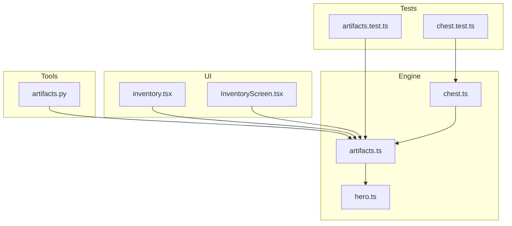
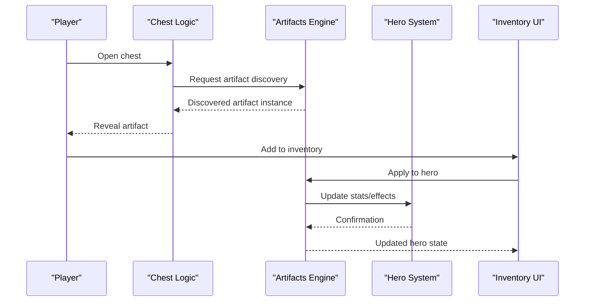
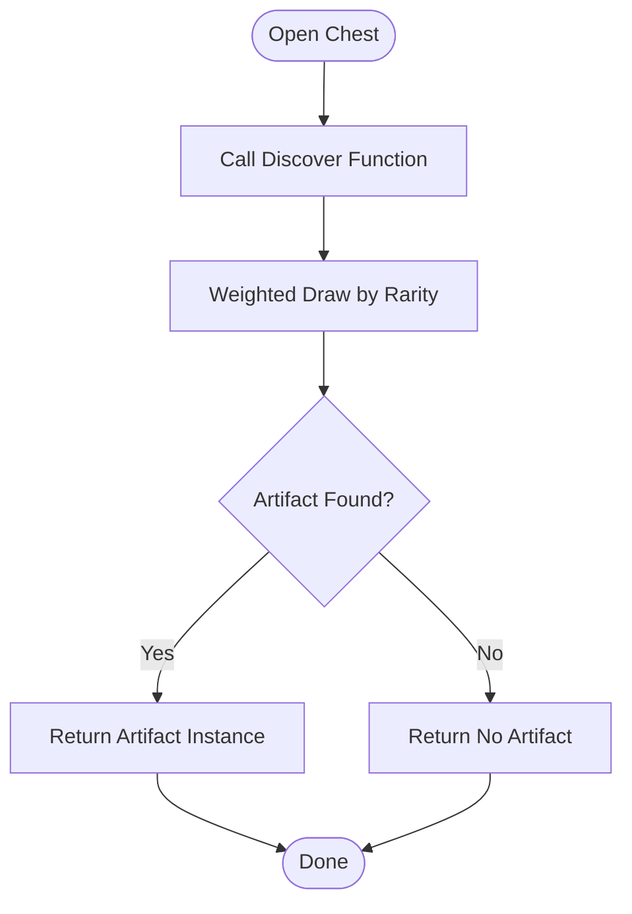
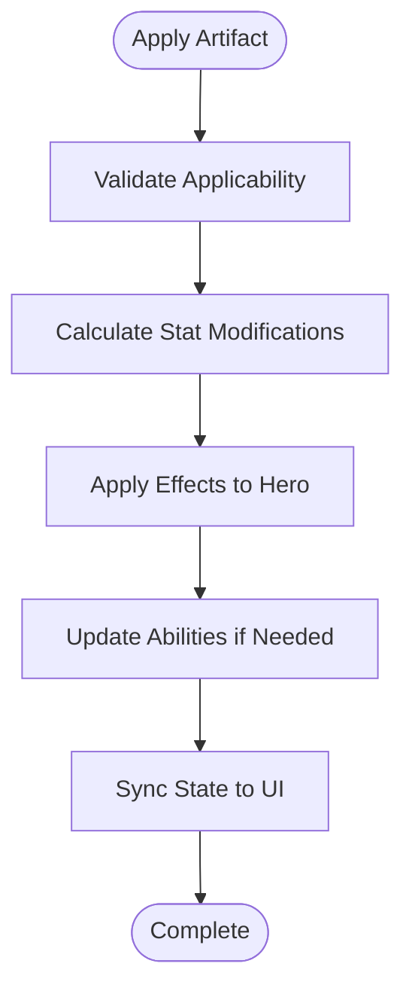
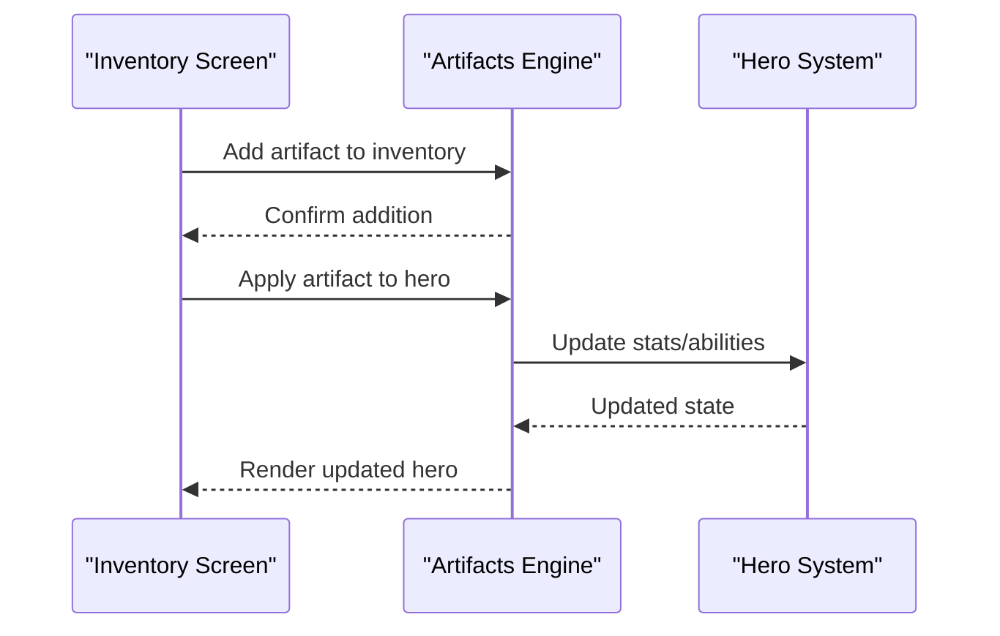
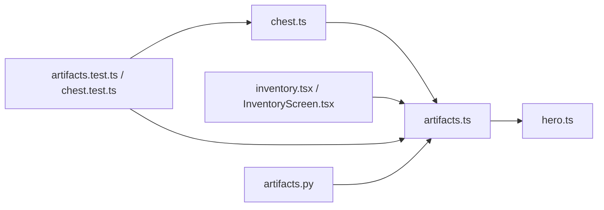

# Artifacts System

<cite>
**Referenced Files in This Document**
- [artifacts.ts](file://src/engine/artifacts.ts)
- [artifacts.test.ts](file://src/engine/__tests__/artifacts.test.ts)
- [chest.ts](file://src/engine/chest.ts)
- [chest.test.ts](file://src/engine/__tests__/chest.test.ts)
- [hero.ts](file://src/engine/hero.ts)
- [inventory.tsx](file://app/inventory.tsx)
- [InventoryScreen.tsx](file://src/screens/InventoryScreen.tsx)
- [artifacts.py](file://tools/art/artifacts.py)
</cite>

## Table of Contents

1. [Introduction](#introduction)
2. [Project Structure](#project-structure)
3. [Core Components](#core-components)
4. [Architecture Overview](#architecture-overview)
5. [Detailed Component Analysis](#detailed-component-analysis)
6. [Dependency Analysis](#dependency-analysis)
7. [Performance Considerations](#performance-considerations)
8. [Troubleshooting Guide](#troubleshooting-guide)
9. [Conclusion](#conclusion)
10. [Appendices](#appendices)

## Introduction

This document explains the artifacts system that manages collectible items, their properties, and effects. It covers artifact types, rarity levels, stat modifications, discovery and storage mechanics, and integration with hero abilities. It also provides examples of artifact definitions, effect calculations, and interaction patterns with other game systems such as chests and inventory screens.

## Project Structure

The artifacts system spans engine logic, tests, UI screens, and asset generation tools:

- Engine layer defines artifact data structures, discovery, application to heroes, and persistence hooks.
- Tests validate behavior for artifact discovery, application, and interactions.
- UI screens expose inventory management and artifact usage flows.
- Tools generate or process artifact assets and metadata.

**Diagram sources**

- [artifacts.ts](file://src/engine/artifacts.ts)
- [chest.ts](file://src/engine/chest.ts)
- [hero.ts](file://src/engine/hero.ts)
- [inventory.tsx](file://app/inventory.tsx)
- [InventoryScreen.tsx](file://src/screens/InventoryScreen.tsx)
- [artifacts.test.ts](file://src/engine/__tests__/artifacts.test.ts)
- [chest.test.ts](file://src/engine/__tests__/chest.test.ts)
- [artifacts.py](file://tools/art/artifacts.py)

**Section sources**

- [artifacts.ts](file://src/engine/artifacts.ts)
- [chest.ts](file://src/engine/chest.ts)
- [hero.ts](file://src/engine/hero.ts)
- [inventory.tsx](file://app/inventory.tsx)
- [InventoryScreen.tsx](file://src/screens/InventoryScreen.tsx)
- [artifacts.test.ts](file://src/engine/__tests__/artifacts.test.ts)
- [chest.test.ts](file://src/engine/__tests__/chest.test.ts)
- [artifacts.py](file://tools/art/artifacts.py)

## Core Components

- Artifact definition model: Defines artifact type, rarity, base stats, and effect rules.
- Discovery mechanism: Determines when and how an artifact is found (e.g., chest opens).
- Application pipeline: Applies artifact effects to a hero’s stats and abilities.
- Inventory integration: Stores discovered artifacts and exposes them to UI.
- Tooling: Generates artifact assets and metadata used by the engine.

Key responsibilities:

- Centralize artifact schema and validation.
- Provide deterministic discovery and effect calculation.
- Ensure consistent state updates across hero and inventory.

**Section sources**

- [artifacts.ts](file://src/engine/artifacts.ts)
- [artifacts.test.ts](file://src/engine/__tests__/artifacts.test.ts)

## Architecture Overview

The artifacts system integrates three primary subsystems:

- Chest discovery triggers artifact acquisition.
- Engine applies artifact effects to the hero.
- UI displays and manages inventory.

**Diagram sources**

- [chest.ts](file://src/engine/chest.ts)
- [artifacts.ts](file://src/engine/artifacts.ts)
- [hero.ts](file://src/engine/hero.ts)
- [inventory.tsx](file://app/inventory.tsx)
- [InventoryScreen.tsx](file://src/screens/InventoryScreen.tsx)

## Detailed Component Analysis

### Artifact Model and Types

- Artifact types define categories (e.g., passive bonuses, active abilities, stat modifiers).
- Rarity levels influence probability of discovery and magnitude of effects.
- Base stats include numeric modifiers and conditional rules.
- Effect calculations are deterministic and context-aware (e.g., scaling with hero level or current stats).

Examples of definition elements:

- Type: categorization for gameplay behavior.
- Rarity: common, uncommon, rare, epic, legendary.
- Modifiers: additive or multiplicative changes to core stats.
- Conditions: triggers based on events or states.

**Section sources**

- [artifacts.ts](file://src/engine/artifacts.ts)
- [artifacts.test.ts](file://src/engine/__tests__/artifacts.test.ts)

### Discovery Mechanics

Discovery occurs primarily through chest interactions:

- Chest logic requests an artifact from the artifacts engine.
- The engine selects an artifact based on rarity weights and availability.
- The discovered artifact is returned to the caller for presentation and storage.

Flow overview:

- Trigger: player opens chest.
- Selection: weighted random draw by rarity.
- Output: artifact instance ready for inventory.

**Diagram sources**

- [chest.ts](file://src/engine/chest.ts)
- [artifacts.ts](file://src/engine/artifacts.ts)

**Section sources**

- [chest.ts](file://src/engine/chest.ts)
- [chest.test.ts](file://src/engine/__tests__/chest.test.ts)
- [artifacts.ts](file://src/engine/artifacts.ts)

### Application to Heroes

When an artifact is applied:

- The engine computes stat modifications based on artifact rules.
- Effects may be immediate or persistent until removed.
- Hero abilities can be enhanced or unlocked depending on artifact type.

Processing steps:

- Validate artifact applicability to current hero state.
- Calculate net modifiers (additive/multiplicative).
- Update hero stats and ability flags.
- Emit state changes for UI synchronization.

**Diagram sources**

- [artifacts.ts](file://src/engine/artifacts.ts)
- [hero.ts](file://src/engine/hero.ts)

**Section sources**

- [artifacts.ts](file://src/engine/artifacts.ts)
- [hero.ts](file://src/engine/hero.ts)

### Inventory Integration

Inventory stores discovered artifacts and exposes actions:

- Add new artifacts upon discovery.
- Remove or equip artifacts as needed.
- Reflect changes in hero stats via engine updates.

Integration points:

- UI components call engine functions to apply/remove artifacts.
- Engine returns updated hero state for rendering.
- Persistence hooks save inventory and hero state.

**Diagram sources**

- [inventory.tsx](file://app/inventory.tsx)
- [InventoryScreen.tsx](file://src/screens/InventoryScreen.tsx)
- [artifacts.ts](file://src/engine/artifacts.ts)
- [hero.ts](file://src/engine/hero.ts)

**Section sources**

- [inventory.tsx](file://app/inventory.tsx)
- [InventoryScreen.tsx](file://src/screens/InventoryScreen.tsx)
- [artifacts.ts](file://src/engine/artifacts.ts)

### Tooling and Asset Generation

The artifacts tool generates or processes assets and metadata:

- Produces visual assets for artifact icons and frames.
- Outputs configuration files consumed by the engine.
- Ensures consistency between art and runtime behavior.

Usage:

- Run tool to regenerate artifacts based on updated definitions.
- Integrate generated outputs into the app bundle.

**Section sources**

- [artifacts.py](file://tools/art/artifacts.py)

## Dependency Analysis

The artifacts system has clear dependencies:

- Chest logic depends on artifacts for discovery.
- Artifacts depend on hero for applying effects.
- UI screens depend on artifacts and hero for display and interaction.
- Tests validate contracts between these modules.

**Diagram sources**

- [chest.ts](file://src/engine/chest.ts)
- [artifacts.ts](file://src/engine/artifacts.ts)
- [hero.ts](file://src/engine/hero.ts)
- [inventory.tsx](file://app/inventory.tsx)
- [InventoryScreen.tsx](file://src/screens/InventoryScreen.tsx)
- [artifacts.test.ts](file://src/engine/__tests__/artifacts.test.ts)
- [chest.test.ts](file://src/engine/__tests__/chest.test.ts)
- [artifacts.py](file://tools/art/artifacts.py)

**Section sources**

- [chest.ts](file://src/engine/chest.ts)
- [artifacts.ts](file://src/engine/artifacts.ts)
- [hero.ts](file://src/engine/hero.ts)
- [inventory.tsx](file://app/inventory.tsx)
- [InventoryScreen.tsx](file://src/screens/InventoryScreen.tsx)
- [artifacts.test.ts](file://src/engine/__tests__/artifacts.test.ts)
- [chest.test.ts](file://src/engine/__tests__/chest.test.ts)
- [artifacts.py](file://tools/art/artifacts.py)

## Performance Considerations

- Discovery should use efficient weighted selection to avoid unnecessary computations.
- Stat modification calculations should be cached where possible to reduce recomputation.
- UI updates should batch state changes to minimize re-renders.
- Asset generation should be incremental to speed up development cycles.

[No sources needed since this section provides general guidance]

## Troubleshooting Guide

Common issues and resolutions:

- Artifact not appearing after opening chest: verify discovery function returns valid instances and that inventory add action is invoked.
- Stats not updating: ensure artifact application pipeline runs and hero state sync is triggered.
- UI not reflecting changes: confirm event propagation from engine to UI components.
- Test failures: check assumptions about rarity weights and effect calculations.

**Section sources**

- [artifacts.test.ts](file://src/engine/__tests__/artifacts.test.ts)
- [chest.test.ts](file://src/engine/__tests__/chest.test.ts)

## Conclusion

The artifacts system provides a robust framework for managing collectible items, their properties, and effects. It integrates seamlessly with chest discovery, hero abilities, and inventory management. By following the defined models and pipelines, developers can extend artifact types, adjust rarities, and implement new effects while maintaining consistency and performance.

[No sources needed since this section summarizes without analyzing specific files]

## Appendices

- Example artifact definition structure: see artifact model sections for fields and constraints.
- Effect calculation guidelines: refer to application pipeline flowcharts.
- Interaction patterns: consult sequence diagrams for chest discovery and inventory integration.

[No sources needed since this section provides general guidance]
