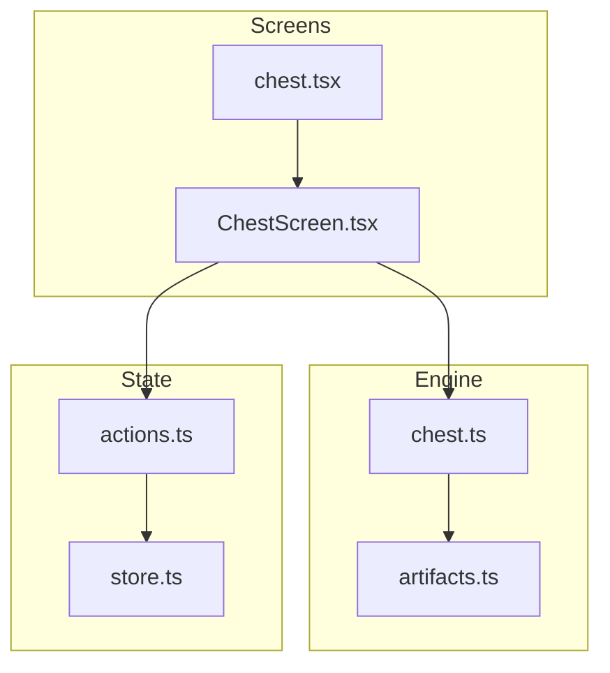
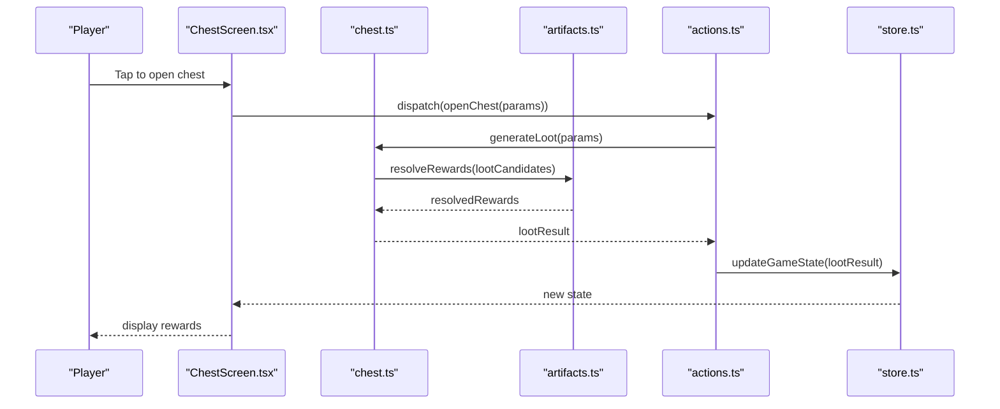
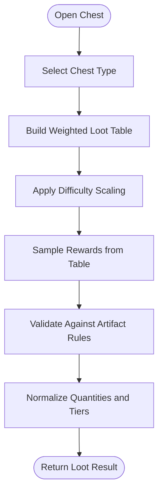
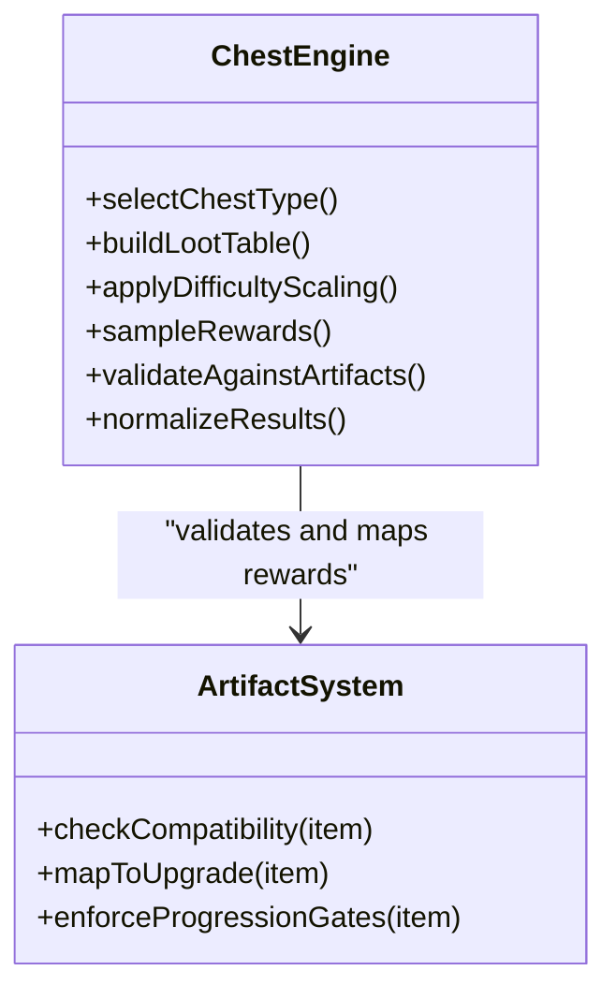
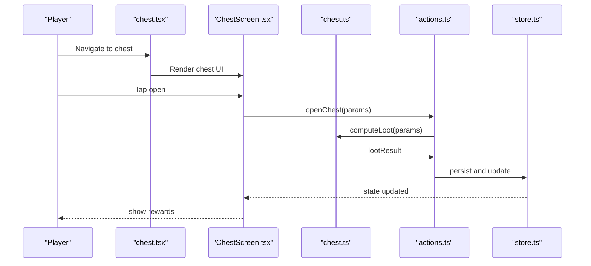
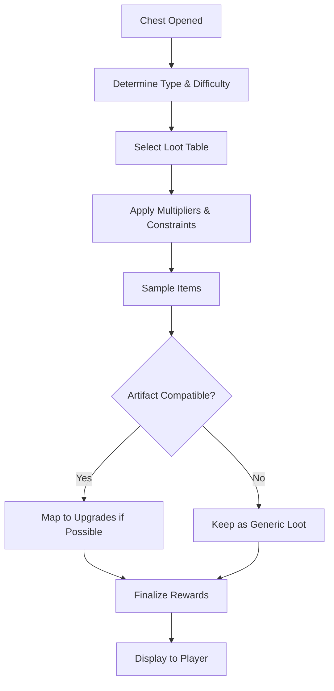
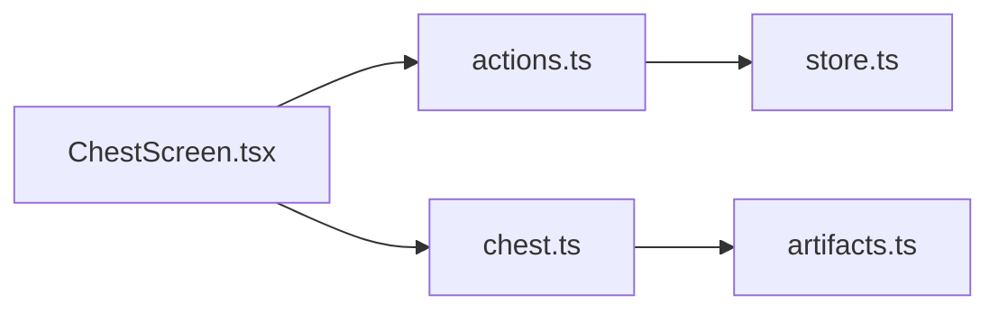

# Chest System

<cite>
**Referenced Files in This Document**
- [chest.ts](file://src/engine/chest.ts)
- [artifacts.ts](file://src/engine/artifacts.ts)
- [chest.test.ts](file://src/engine/__tests__/chest.test.ts)
- [artifacts.test.ts](file://src/engine/__tests__/artifacts.test.ts)
- [ChestScreen.tsx](file://src/screens/ChestScreen.tsx)
- [chest.tsx](file://app/chest.tsx)
- [store.ts](file://src/state/store.ts)
- [actions.ts](file://src/state/actions.ts)
</cite>

## Table of Contents

1. [Introduction](#introduction)
2. [Project Structure](#project-structure)
3. [Core Components](#core-components)
4. [Architecture Overview](#architecture-overview)
5. [Detailed Component Analysis](#detailed-component-analysis)
6. [Dependency Analysis](#dependency-analysis)
7. [Performance Considerations](#performance-considerations)
8. [Troubleshooting Guide](#troubleshooting-guide)
9. [Conclusion](#conclusion)
10. [Appendices](#appendices)

## Introduction

This document explains the chest system that powers treasure discovery, loot generation, and reward distribution. It covers chest types, content randomization, difficulty scaling, player interaction patterns, and integration with the artifact system to support player progression. It also provides examples for creating chests, defining loot tables, and calculating rewards.

## Project Structure

The chest system spans engine logic, UI screens, and state management:

- Engine: core algorithms for chest creation, loot tables, randomization, and artifact integration
- Screens: user-facing flows for opening chests and viewing results
- State: actions and store updates triggered by chest interactions

**Diagram sources**

- [chest.ts](file://src/engine/chest.ts)
- [artifacts.ts](file://src/engine/artifacts.ts)
- [ChestScreen.tsx](file://src/screens/ChestScreen.tsx)
- [chest.tsx](file://app/chest.tsx)
- [store.ts](file://src/state/store.ts)
- [actions.ts](file://src/state/actions.ts)

**Section sources**

- [chest.ts](file://src/engine/chest.ts)
- [artifacts.ts](file://src/engine/artifacts.ts)
- [ChestScreen.tsx](file://src/screens/ChestScreen.tsx)
- [chest.tsx](file://app/chest.tsx)
- [store.ts](file://src/state/store.ts)
- [actions.ts](file://src/state/actions.ts)

## Core Components

- Chest engine: defines chest types, difficulty tiers, loot table selection, and reward calculation
- Artifact integration: maps generated rewards to artifacts or upgrades, ensuring progression consistency
- Screen layer: orchestrates player input, triggers chest opening, and displays outcomes
- State layer: persists chest results and updates game state via actions

Key responsibilities:

- Randomized content generation with deterministic seeds where applicable
- Difficulty scaling based on context (e.g., level, night, or progression stage)
- Reward normalization and artifact compatibility checks
- Clear feedback and state transitions after opening a chest

**Section sources**

- [chest.ts](file://src/engine/chest.ts)
- [artifacts.ts](file://src/engine/artifacts.ts)
- [ChestScreen.tsx](file://src/screens/ChestScreen.tsx)
- [actions.ts](file://src/state/actions.ts)

## Architecture Overview

The chest system follows a layered architecture:

- UI triggers an action when the player interacts with a chest
- The engine computes loot using tables and difficulty parameters
- Results are validated against artifact rules and applied to state
- The screen renders the outcome and updates the UI accordingly

**Diagram sources**

- [ChestScreen.tsx](file://src/screens/ChestScreen.tsx)
- [chest.ts](file://src/engine/chest.ts)
- [artifacts.ts](file://src/engine/artifacts.ts)
- [actions.ts](file://src/state/actions.ts)
- [store.ts](file://src/state/store.ts)

## Detailed Component Analysis

### Chest Engine: Types, Tables, and Randomization

- Chest types: define categories such as common, rare, boss, or event-specific chests
- Loot tables: per-type tables mapping item IDs to weights and constraints
- Randomization: weighted sampling with optional seed control for reproducibility
- Difficulty scaling: adjusts drop rates, item tiers, and quantity based on context

**Diagram sources**

- [chest.ts](file://src/engine/chest.ts)
- [artifacts.ts](file://src/engine/artifacts.ts)

**Section sources**

- [chest.ts](file://src/engine/chest.ts)

### Artifact Integration: Compatibility and Progression

- Artifact compatibility: ensures generated items fit into inventory slots and upgrade paths
- Progression gates: restricts high-tier rewards until certain milestones are reached
- Upgrade mapping: converts generic loot into specific artifact upgrades when possible

**Diagram sources**

- [chest.ts](file://src/engine/chest.ts)
- [artifacts.ts](file://src/engine/artifacts.ts)

**Section sources**

- [artifacts.ts](file://src/engine/artifacts.ts)

### Player Interaction Flow: Opening a Chest

- Input handling: detects taps or gestures to initiate chest opening
- Parameter resolution: determines chest type, difficulty, and contextual modifiers
- Feedback loop: shows loading, result animation, and final reward summary

**Diagram sources**

- [chest.tsx](file://app/chest.tsx)
- [ChestScreen.tsx](file://src/screens/ChestScreen.tsx)
- [chest.ts](file://src/engine/chest.ts)
- [actions.ts](file://src/state/actions.ts)
- [store.ts](file://src/state/store.ts)

**Section sources**

- [ChestScreen.tsx](file://src/screens/ChestScreen.tsx)
- [chest.tsx](file://app/chest.tsx)
- [actions.ts](file://src/state/actions.ts)
- [store.ts](file://src/state/store.ts)

### Examples: Chest Creation, Loot Tables, and Reward Calculation

- Chest creation: instantiate a chest with type, difficulty, and optional seed
- Loot tables: define entries with item identifiers, weights, and constraints
- Reward calculation: combine base drops, multipliers, and artifact mappings

Use these references for concrete implementations:

- Chest creation and table building: [chest.ts](file://src/engine/chest.ts)
- Artifact compatibility and mapping: [artifacts.ts](file://src/engine/artifacts.ts)
- Test cases demonstrating usage: [chest.test.ts](file://src/engine/__tests__/chest.test.ts), [artifacts.test.ts](file://src/engine/__tests__/artifacts.test.ts)

**Section sources**

- [chest.ts](file://src/engine/chest.ts)
- [artifacts.ts](file://src/engine/artifacts.ts)
- [chest.test.ts](file://src/engine/__tests__/chest.test.ts)
- [artifacts.test.ts](file://src/engine/__tests__/artifacts.test.ts)

### Conceptual Overview

Conceptually, the chest system balances randomness with fairness:

- Weighted tables ensure predictable rarity distributions
- Difficulty scaling adapts rewards to player progress
- Artifact integration guarantees meaningful progression without breaking balance

[No sources needed since this diagram shows conceptual workflow, not actual code structure]

## Dependency Analysis

The chest system depends on artifact rules and state actions:

- Chest engine depends on artifact compatibility checks
- Screens depend on actions to trigger state changes
- Store holds persistent game state reflecting chest outcomes

**Diagram sources**

- [chest.ts](file://src/engine/chest.ts)
- [artifacts.ts](file://src/engine/artifacts.ts)
- [ChestScreen.tsx](file://src/screens/ChestScreen.tsx)
- [actions.ts](file://src/state/actions.ts)
- [store.ts](file://src/state/store.ts)

**Section sources**

- [chest.ts](file://src/engine/chest.ts)
- [artifacts.ts](file://src/engine/artifacts.ts)
- [ChestScreen.tsx](file://src/screens/ChestScreen.tsx)
- [actions.ts](file://src/state/actions.ts)
- [store.ts](file://src/state/store.ts)

## Performance Considerations

- Precompute loot tables for frequently used chest types to reduce runtime overhead
- Cache artifact compatibility results to avoid repeated checks
- Use deterministic seeds for reproducible testing and debugging
- Batch state updates to minimize re-renders in the UI

[No sources needed since this section provides general guidance]

## Troubleshooting Guide

Common issues and resolutions:

- Empty loot results: verify table weights and constraints; ensure at least one valid entry exists
- Incompatible artifacts: check compatibility rules and progression gates
- Non-deterministic behavior: confirm seed usage and randomization settings
- State inconsistencies: validate actions and store updates after chest opening

Relevant files for debugging:

- Chest logic and tables: [chest.ts](file://src/engine/chest.ts)
- Artifact rules and mapping: [artifacts.ts](file://src/engine/artifacts.ts)
- Tests for expected behavior: [chest.test.ts](file://src/engine/__tests__/chest.test.ts), [artifacts.test.ts](file://src/engine/__tests__/artifacts.test.ts)

**Section sources**

- [chest.ts](file://src/engine/chest.ts)
- [artifacts.ts](file://src/engine/artifacts.ts)
- [chest.test.ts](file://src/engine/__tests__/chest.test.ts)
- [artifacts.test.ts](file://src/engine/__tests__/artifacts.test.ts)

## Conclusion

The chest system provides a robust framework for treasure discovery and reward distribution. By combining weighted loot tables, difficulty scaling, and artifact integration, it delivers balanced and engaging progression. Proper use of seeds, caching, and clear state updates ensures reliability and performance across player interactions.

[No sources needed since this section summarizes without analyzing specific files]

## Appendices

- Example references:
  - Chest creation and table building: [chest.ts](file://src/engine/chest.ts)
  - Artifact compatibility and mapping: [artifacts.ts](file://src/engine/artifacts.ts)
  - Usage tests: [chest.test.ts](file://src/engine/__tests__/chest.test.ts), [artifacts.test.ts](file://src/engine/__tests__/artifacts.test.ts)
  - UI flow: [ChestScreen.tsx](file://src/screens/ChestScreen.tsx), [chest.tsx](file://app/chest.tsx)
  - State updates: [actions.ts](file://src/state/actions.ts), [store.ts](file://src/state/store.ts)

[No sources needed since this section lists references only]
