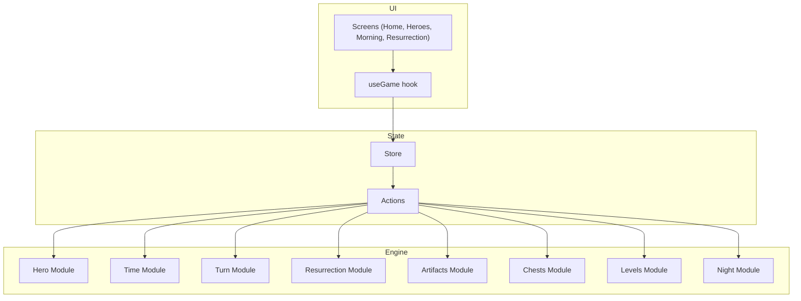
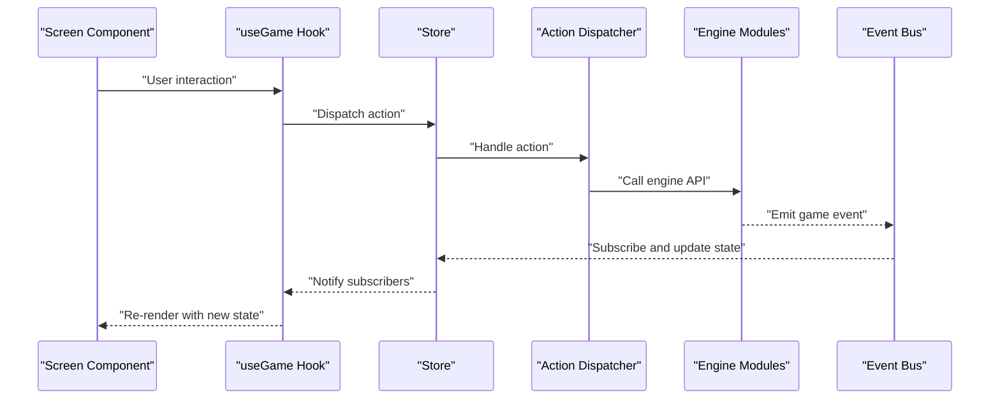
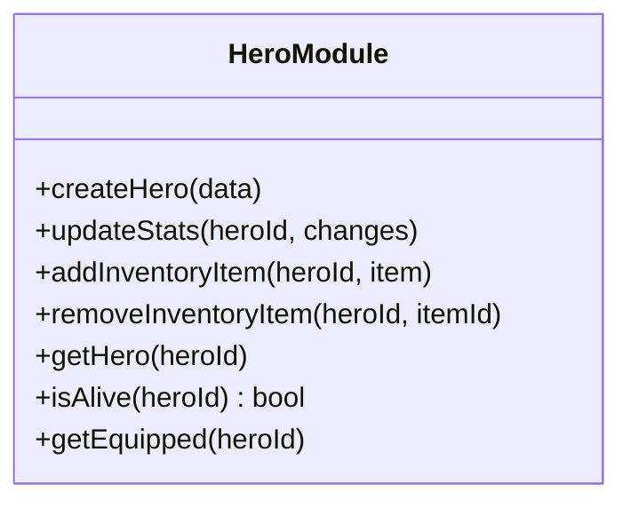
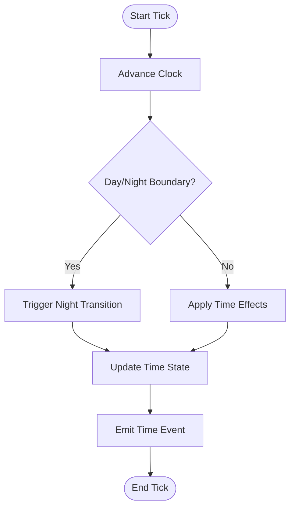
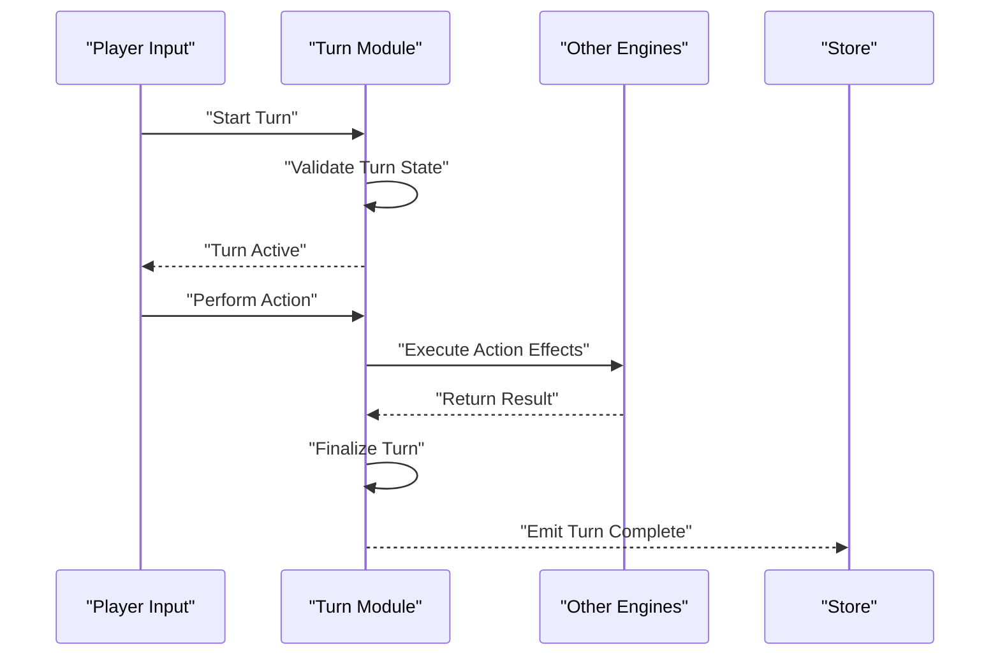
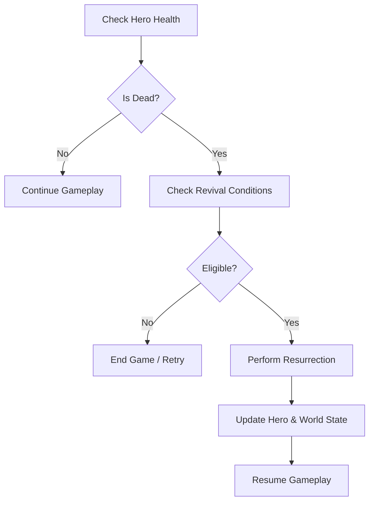
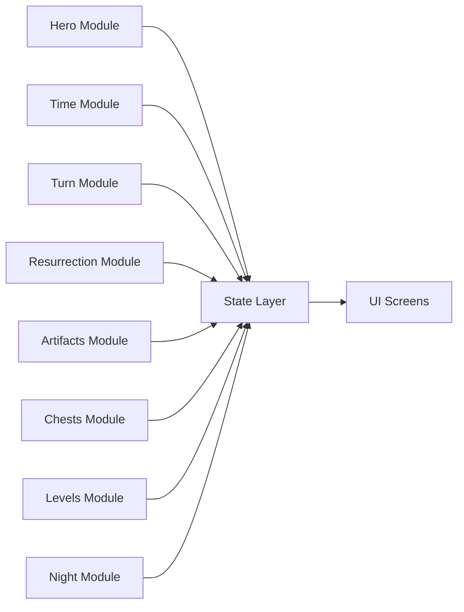
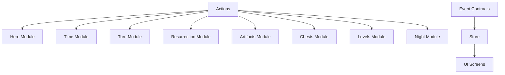

# Engine Layer Architecture

<cite>
**Referenced Files in This Document**
- [src/engine/hero.ts](file://src/engine/hero.ts)
- [src/engine/time.ts](file://src/engine/time.ts)
- [src/engine/turn.ts](file://src/engine/turn.ts)
- [src/engine/resurrection.ts](file://src/engine/resurrection.ts)
- [src/engine/artifacts.ts](file://src/engine/artifacts.ts)
- [src/engine/chest.ts](file://src/engine/chest.ts)
- [src/engine/levels.ts](file://src/engine/levels.ts)
- [src/engine/night.ts](file://src/engine/night.ts)
- [src/state/store.ts](file://src/state/store.ts)
- [src/state/actions.ts](file://src/state/actions.ts)
- [src/screens/HomeScreen.tsx](file://src/screens/HomeScreen.tsx)
- [src/screens/HeroesScreen.tsx](file://src/screens/HeroesScreen.tsx)
- [src/screens/MorningSceneScreen.tsx](file://src/screens/MorningSceneScreen.tsx)
- [src/screens/ResurrectionGameScreen.tsx](file://src/screens/ResurrectionGameScreen.tsx)
- [src/ui/useGame.tsx](file://src/ui/useGame.tsx)
- [src/contracts/types.ts](file://src/contracts/types.ts)
- [src/contracts/events.ts](file://src/contracts/events.ts)
</cite>

## Table of Contents

1. [Introduction](#introduction)
2. [Project Structure](#project-structure)
3. [Core Components](#core-components)
4. [Architecture Overview](#architecture-overview)
5. [Detailed Component Analysis](#detailed-component-analysis)
6. [Dependency Analysis](#dependency-analysis)
7. [Performance Considerations](#performance-considerations)
8. [Troubleshooting Guide](#troubleshooting-guide)
9. [Conclusion](#conclusion)

## Introduction

This document explains the engine layer architecture that encapsulates core game mechanics and business logic, keeping it separate from UI concerns. The engine exposes stable APIs for screen components to interact with game state through a thin state layer. It is organized into modular systems: hero management, time progression, turn-based mechanics, resurrection logic, artifacts, chests, levels, and night transitions. Each module focuses on a single responsibility and communicates via well-defined interfaces and events.

## Project Structure

The engine resides under src/engine and contains domain-specific modules. A thin state layer under src/state provides actions and a store that screens consume via hooks. UI components live under src/screens and src/ui and should not contain game logic; they call engine APIs through the state layer. Contracts under src/contracts define shared types and event shapes used across layers.

**Diagram sources**

- [src/screens/HomeScreen.tsx](file://src/screens/HomeScreen.tsx)
- [src/screens/HeroesScreen.tsx](file://src/screens/HeroesScreen.tsx)
- [src/screens/MorningSceneScreen.tsx](file://src/screens/MorningSceneScreen.tsx)
- [src/screens/ResurrectionGameScreen.tsx](file://src/screens/ResurrectionGameScreen.tsx)
- [src/ui/useGame.tsx](file://src/ui/useGame.tsx)
- [src/state/store.ts](file://src/state/store.ts)
- [src/state/actions.ts](file://src/state/actions.ts)
- [src/engine/hero.ts](file://src/engine/hero.ts)
- [src/engine/time.ts](file://src/engine/time.ts)
- [src/engine/turn.ts](file://src/engine/turn.ts)
- [src/engine/resurrection.ts](file://src/engine/resurrection.ts)
- [src/engine/artifacts.ts](file://src/engine/artifacts.ts)
- [src/engine/chest.ts](file://src/engine/chest.ts)
- [src/engine/levels.ts](file://src/engine/levels.ts)
- [src/engine/night.ts](file://src/engine/night.ts)

**Section sources**

- [src/state/store.ts](file://src/state/store.ts)
- [src/state/actions.ts](file://src/state/actions.ts)
- [src/ui/useGame.tsx](file://src/ui/useGame.tsx)
- [src/contracts/types.ts](file://src/contracts/types.ts)
- [src/contracts/events.ts](file://src/contracts/events.ts)

## Core Components

- Hero Management: Encapsulates hero lifecycle, stats, inventory, and interactions. Provides functions to create, update, and query hero state.
- Time Progression: Advances day/night cycles and manages time-related effects such as scene changes and scheduled events.
- Turn-Based Mechanics: Coordinates turns, action resolution, and turn boundaries for gameplay sequences.
- Resurrection Logic: Handles death, revival conditions, and post-resurrection state transitions.
- Artifacts: Manages artifact definitions, acquisition, and effects.
- Chests: Controls chest states, opening, and rewards.
- Levels: Tracks level progression, unlocks, and transitions.
- Night Transitions: Orchestrates night scenes and related state updates.

These modules expose pure functions or classes with clear inputs and outputs, enabling deterministic behavior and testability. They do not depend on UI frameworks and can be invoked by the state layer.

**Section sources**

- [src/engine/hero.ts](file://src/engine/hero.ts)
- [src/engine/time.ts](file://src/engine/time.ts)
- [src/engine/turn.ts](file://src/engine/turn.ts)
- [src/engine/resurrection.ts](file://src/engine/resurrection.ts)
- [src/engine/artifacts.ts](file://src/engine/artifacts.ts)
- [src/engine/chest.ts](file://src/engine/chest.ts)
- [src/engine/levels.ts](file://src/engine/levels.ts)
- [src/engine/night.ts](file://src/engine/night.ts)

## Architecture Overview

The engine is separated from UI by a strict boundary: screens interact only with the state layer, which dispatches actions to engine modules. Engine modules mutate internal state deterministically and emit events when needed. The store subscribes to these events and updates UI state accordingly.

**Diagram sources**

- [src/ui/useGame.tsx](file://src/ui/useGame.tsx)
- [src/state/store.ts](file://src/state/store.ts)
- [src/state/actions.ts](file://src/state/actions.ts)
- [src/contracts/events.ts](file://src/contracts/events.ts)

## Detailed Component Analysis

### Hero Management

Hero management encapsulates creation, stat updates, inventory operations, and status checks. It exposes methods to modify hero state safely and returns derived information for UI rendering.

**Diagram sources**

- [src/engine/hero.ts](file://src/engine/hero.ts)

**Section sources**

- [src/engine/hero.ts](file://src/engine/hero.ts)

### Time Progression

Time progression advances the game clock, triggers day/night transitions, and coordinates time-based effects like scene banners and ambient changes. It maintains current time state and exposes tick functions for scheduling.

**Diagram sources**

- [src/engine/time.ts](file://src/engine/time.ts)
- [src/engine/night.ts](file://src/engine/night.ts)

**Section sources**

- [src/engine/time.ts](file://src/engine/time.ts)
- [src/engine/night.ts](file://src/engine/night.ts)

### Turn-Based Mechanics

Turn-based mechanics manage turn ownership, action sequencing, and turn completion. It ensures that only one action executes per turn and handles turn boundaries and rollback on invalid moves.

**Diagram sources**

- [src/engine/turn.ts](file://src/engine/turn.ts)

**Section sources**

- [src/engine/turn.ts](file://src/engine/turn.ts)

### Resurrection Logic

Resurrection logic handles death detection, revival eligibility, and resurrection outcomes. It integrates with hero state and turn flow to ensure consistent state transitions after death and revival.

**Diagram sources**

- [src/engine/resurrection.ts](file://src/engine/resurrection.ts)
- [src/engine/hero.ts](file://src/engine/hero.ts)

**Section sources**

- [src/engine/resurrection.ts](file://src/engine/resurrection.ts)
- [src/engine/hero.ts](file://src/engine/hero.ts)

### Artifacts, Chests, Levels, and Night Transitions

- Artifacts: Defines artifact schemas, acquisition rules, and effect application.
- Chests: Manages chest states, unlock conditions, and reward distribution.
- Levels: Tracks progression milestones and unlocks new content.
- Night Transitions: Orchestrates scene changes and environmental updates during night phases.

These modules follow the same pattern: accept inputs, validate, compute new state, and optionally emit events.

**Section sources**

- [src/engine/artifacts.ts](file://src/engine/artifacts.ts)
- [src/engine/chest.ts](file://src/engine/chest.ts)
- [src/engine/levels.ts](file://src/engine/levels.ts)
- [src/engine/night.ts](file://src/engine/night.ts)

### Conceptual Overview

The engine’s modular design ensures separation of concerns. Each system owns its domain data and logic, exposing minimal APIs. The state layer aggregates engine calls and emits events for UI synchronization. Screens remain presentation-only, focusing on user interactions and rendering.

[No sources needed since this diagram shows conceptual workflow, not actual code structure]

## Dependency Analysis

Engine modules are loosely coupled and communicate via the state layer and event contracts. Direct dependencies between engine modules are minimized to avoid circular references. The state layer orchestrates cross-module interactions by dispatching actions and handling events.

**Diagram sources**

- [src/state/actions.ts](file://src/state/actions.ts)
- [src/contracts/events.ts](file://src/contracts/events.ts)
- [src/state/store.ts](file://src/state/store.ts)

**Section sources**

- [src/state/actions.ts](file://src/state/actions.ts)
- [src/contracts/events.ts](file://src/contracts/events.ts)
- [src/state/store.ts](file://src/state/store.ts)

## Performance Considerations

- Deterministic Updates: Engine functions should be pure where possible to enable memoization and efficient re-renders.
- Batched State Changes: Group multiple engine calls within a single action to minimize store updates.
- Lazy Loading: Load heavy assets and computations only when needed to reduce startup time.
- Event Throttling: Coalesce frequent events (e.g., time ticks) to prevent excessive UI updates.

[No sources needed since this section provides general guidance]

## Troubleshooting Guide

Common issues and resolutions:

- State Inconsistency: Ensure all engine mutations go through the state layer to maintain consistency.
- Missing Events: Verify that engine modules emit required events for UI synchronization.
- Circular Dependencies: Refactor shared logic into utility modules to break cycles.
- Performance Drops: Profile expensive engine calls and consider caching or lazy evaluation.

**Section sources**

- [src/state/store.ts](file://src/state/store.ts)
- [src/contracts/events.ts](file://src/contracts/events.ts)

## Conclusion

The engine layer provides a clean separation between game mechanics and UI, offering stable APIs for screen components. Its modular design supports independent development and testing of hero management, time progression, turn-based mechanics, and resurrection logic. By adhering to strict boundaries and event-driven communication, the system remains maintainable, scalable, and responsive to user interactions.
