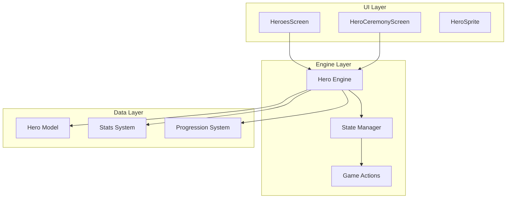
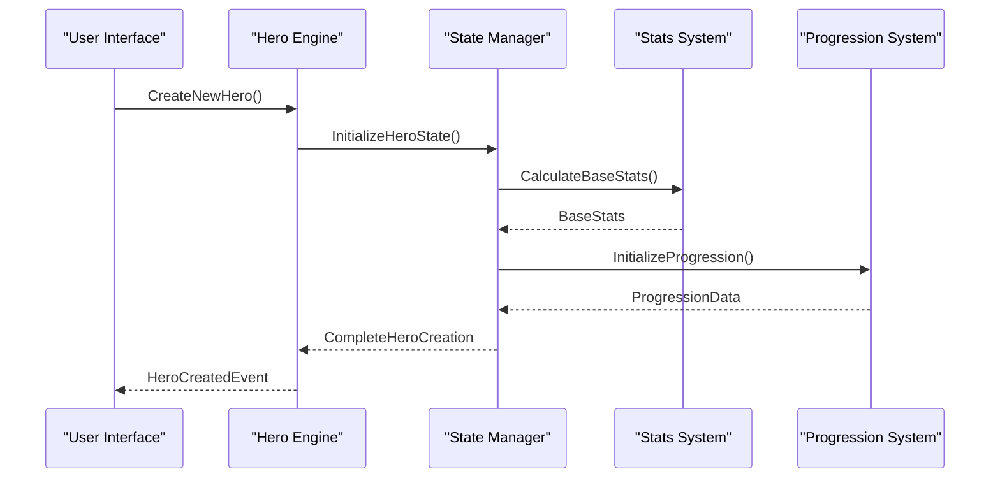
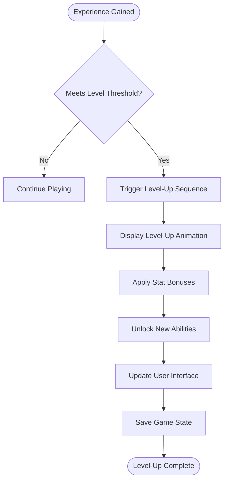
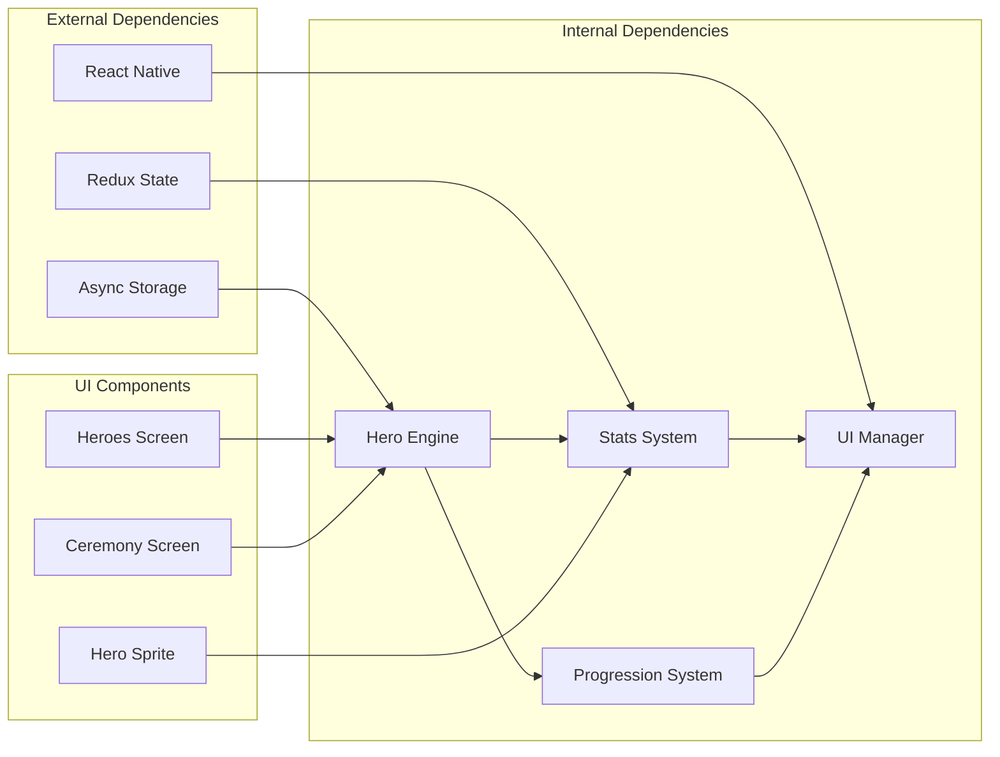

# Hero System

<cite>
**Referenced Files in This Document**
- [src/engine/hero.ts](file://src/engine/hero.ts)
- [app/hero-ceremony.tsx](file://app/hero-ceremony.tsx)
- [app/heroes.tsx](file://app/heroes.tsx)
- [src/screens/HeroCeremonyScreen.tsx](file://src/screens/HeroCeremonyScreen.tsx)
- [src/screens/HeroesScreen.tsx](file://src/screens/HeroesScreen.tsx)
- [src/state/store.ts](file://src/state/store.ts)
- [src/state/actions.ts](file://src/state/actions.ts)
- [src/ui/HeroSprite.tsx](file://src/ui/HeroSprite.tsx)
</cite>

## Table of Contents

1. [Introduction](#introduction)
2. [Project Structure](#project-structure)
3. [Core Components](#core-components)
4. [Architecture Overview](#architecture-overview)
5. [Detailed Component Analysis](#detailed-component-analysis)
6. [Dependency Analysis](#dependency-analysis)
7. [Performance Considerations](#performance-considerations)
8. [Troubleshooting Guide](#troubleshooting-guide)
9. [Conclusion](#conclusion)

## Introduction

The hero system is a core component of the game that manages character creation, customization, and lifecycle management. It handles hero definition, attributes, stats, progression mechanics, and the hero ceremony system that affects hero development. This system provides a comprehensive framework for creating and managing heroes throughout the game experience.

## Project Structure

The hero system is distributed across multiple layers of the application architecture:

**Diagram sources**

- [src/screens/HeroesScreen.tsx](file://src/screens/HeroesScreen.tsx)
- [src/screens/HeroCeremonyScreen.tsx](file://src/screens/HeroCeremonyScreen.tsx)
- [src/engine/hero.ts](file://src/engine/hero.ts)

## Core Components

### Hero Data Model

The hero data model defines the structure and properties of heroes in the game. This includes base attributes, customizable features, and progression tracking.

### Hero Creation System

The hero creation process allows players to define their character's initial appearance, starting attributes, and basic customization options.

### Stats and Attributes System

Heroes have various stats and attributes that determine their capabilities and performance in different game scenarios.

### Progression Mechanics

The progression system tracks hero development over time, including experience points, level-ups, and skill improvements.

**Section sources**

- [src/engine/hero.ts](file://src/engine/hero.ts)
- [src/state/store.ts](file://src/state/store.ts)

## Architecture Overview

The hero system follows a modular architecture pattern with clear separation of concerns:

**Diagram sources**

- [src/engine/hero.ts](file://src/engine/hero.ts)
- [src/state/store.ts](file://src/state/store.ts)
- [src/state/actions.ts](file://src/state/actions.ts)

## Detailed Component Analysis

### Hero Engine

The hero engine serves as the central coordinator for all hero-related operations. It manages hero lifecycle, stat calculations, and progression tracking.

#### Key Responsibilities:

- Hero creation and initialization
- Stat calculation and modification
- Progression management
- Event handling for hero state changes

#### Core Methods:

- `createHero()` - Initializes a new hero instance
- `updateStats()` - Modifies hero attributes
- `applyProgression()` - Handles level-up and skill improvements
- `getHeroState()` - Retrieves current hero information

### Hero Ceremony System

The hero ceremony system provides special events and rituals that affect hero development and capabilities.

#### Ceremony Types:

- **Ritual Ceremonies** - Permanent stat modifications
- **Blessing Ceremonies** - Temporary power boosts
- **Initiation Ceremonies** - Unlock new abilities or traits

#### Ceremony Effects:

- Attribute enhancement
- New skill unlocks
- Special ability grants
- Visual transformations

**Section sources**

- [app/hero-ceremony.tsx](file://app/hero-ceremony.tsx)
- [src/screens/HeroCeremonyScreen.tsx](file://src/screens/HeroCeremonyScreen.tsx)

### Stats and Attributes System

The stats system manages all numerical aspects of hero capabilities.

#### Core Stats Categories:

- **Physical Attributes** - Strength, Dexterity, Constitution
- **Mental Attributes** - Intelligence, Wisdom, Charisma
- **Combat Stats** - Health, Mana, Defense, Attack Power
- **Special Stats** - Luck, Speed, Magic Resistance

#### Stat Modification Rules:

- Base stats from hero creation
- Bonuses from equipment and ceremonies
- Temporary modifiers from buffs/debuffs
- Permanent growth from progression

### Progression Mechanics

The progression system tracks and manages hero development over time.

#### Progression Elements:

- Experience point accumulation
- Level-based stat increases
- Skill tree advancement
- Achievement tracking

#### Level-Up Process:

**Diagram sources**

- [src/engine/hero.ts](file://src/engine/hero.ts)

## Dependency Analysis

The hero system has well-defined dependencies between components:

**Diagram sources**

- [src/engine/hero.ts](file://src/engine/hero.ts)
- [src/state/store.ts](file://src/state/store.ts)

**Section sources**

- [src/engine/hero.ts](file://src/engine/hero.ts)
- [src/state/store.ts](file://src/state/store.ts)
- [src/state/actions.ts](file://src/state/actions.ts)

## Performance Considerations

### Memory Management

- Implement efficient hero object pooling for frequently created/destroyed heroes
- Use lazy loading for hero assets and animations
- Optimize stat calculation algorithms for real-time updates

### Rendering Optimization

- Cache hero sprite animations and visual effects
- Implement view recycling for hero lists
- Use efficient state update patterns to minimize re-renders

### Calculation Efficiency

- Pre-compute static stat values where possible
- Batch stat modifications to reduce recalculations
- Implement incremental updates for large stat changes

## Troubleshooting Guide

### Common Issues and Solutions

#### Hero Creation Failures

- **Issue**: Hero creation fails during initialization
- **Solution**: Verify all required attributes are present and valid
- **Debug**: Check hero validation rules and default value assignments

#### Stat Calculation Errors

- **Issue**: Incorrect stat values after modifications
- **Solution**: Review stat modification order and dependency resolution
- **Debug**: Enable detailed stat change logging

#### Progression System Bugs

- **Issue**: Heroes not leveling up correctly
- **Solution**: Verify experience thresholds and level-up conditions
- **Debug**: Monitor experience accumulation and threshold checks

#### Ceremony System Problems

- **Issue**: Ceremonies not applying expected effects
- **Solution**: Check ceremony trigger conditions and effect application order
- **Debug**: Log ceremony execution flow and effect application

**Section sources**

- [src/engine/hero.ts](file://src/engine/hero.ts)
- [src/screens/HeroCeremonyScreen.tsx](file://src/screens/HeroCeremonyScreen.tsx)

## Conclusion

The hero system provides a comprehensive framework for character creation, customization, and lifecycle management in the game. Its modular architecture allows for easy extension and maintenance while providing robust functionality for hero development, stat management, and progression tracking. The ceremony system adds depth to hero customization by offering meaningful choices that impact gameplay.

The system's design emphasizes scalability and performance, making it suitable for games with complex character systems and extensive customization options. Future enhancements could include more advanced progression mechanics, additional ceremony types, and enhanced integration with other game systems.
