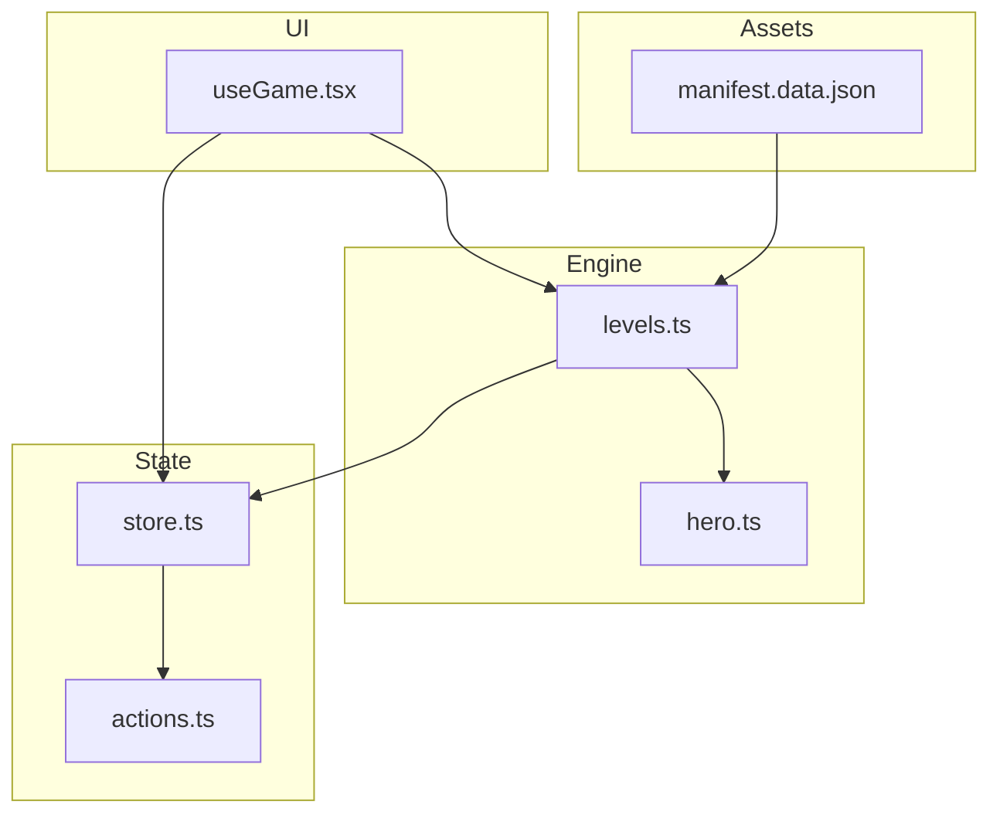
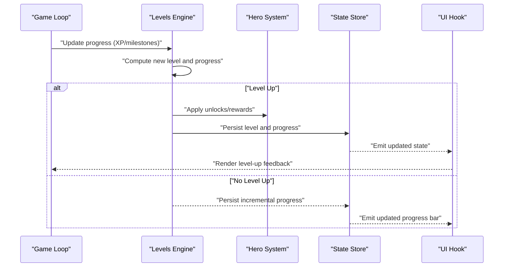
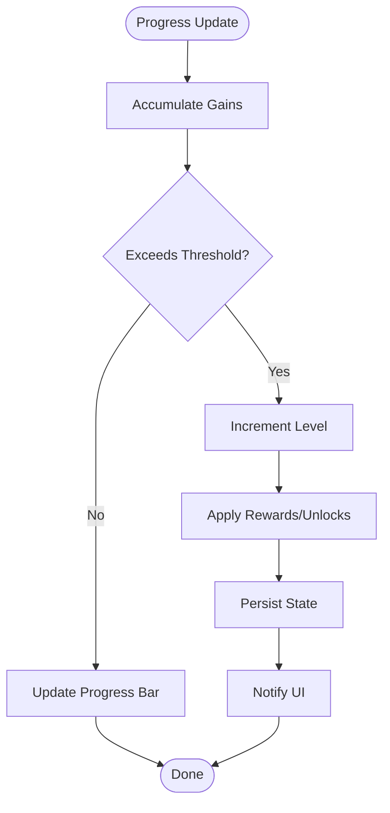
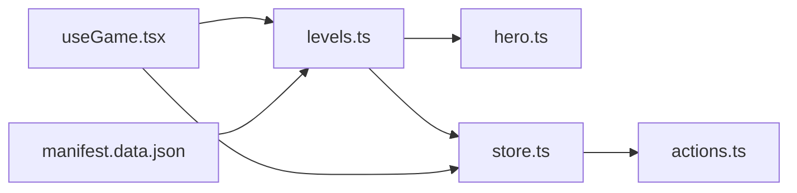
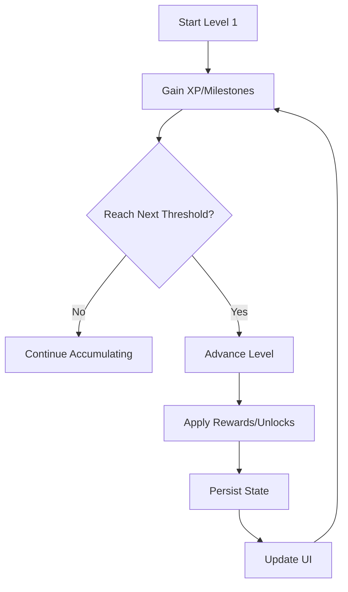

# Levels System

<cite>
**Referenced Files in This Document**
- [levels.ts](file://src/engine/levels.ts)
- [levels.test.ts](file://src/engine/__tests__/levels.test.ts)
- [hero.ts](file://src/engine/hero.ts)
- [store.ts](file://src/state/store.ts)
- [actions.ts](file://src/state/actions.ts)
- [useGame.tsx](file://src/ui/useGame.tsx)
- [manifest.data.json](file://assets/manifest.data.json)
</cite>

## Table of Contents

1. [Introduction](#introduction)
2. [Project Structure](#project-structure)
3. [Core Components](#core-components)
4. [Architecture Overview](#architecture-overview)
5. [Detailed Component Analysis](#detailed-component-analysis)
6. [Dependency Analysis](#dependency-analysis)
7. [Performance Considerations](#performance-considerations)
8. [Troubleshooting Guide](#troubleshooting-guide)
9. [Conclusion](#conclusion)
10. [Appendices](#appendices)

## Introduction

This document explains the levels system that manages game progression, level structures, and milestone tracking. It covers how levels are defined, progression criteria, rewards for advancement, level-up mechanics, skill unlocks, and how levels affect gameplay balance. It also provides examples of level definitions, progression curves, and integration points with other systems such as heroes, state management, and UI hooks.

## Project Structure

The levels system is implemented in the engine layer and integrates with state management and UI hooks:

- Engine: Core logic for level definitions, thresholds, and progression calculations
- State: Actions and store updates triggered by level changes
- UI: Hooks to read current level and react to progress
- Assets: Optional external data sources for level configuration

**Diagram sources**

- [levels.ts](file://src/engine/levels.ts)
- [hero.ts](file://src/engine/hero.ts)
- [store.ts](file://src/state/store.ts)
- [actions.ts](file://src/state/actions.ts)
- [useGame.tsx](file://src/ui/useGame.tsx)
- [manifest.data.json](file://assets/manifest.data.json)

**Section sources**

- [levels.ts](file://src/engine/levels.ts)
- [store.ts](file://src/state/store.ts)
- [actions.ts](file://src/state/actions.ts)
- [useGame.tsx](file://src/ui/useGame.tsx)
- [manifest.data.json](file://assets/manifest.data.json)

## Core Components

- Level definitions and thresholds: Centralized rules for what constitutes each level and the experience required to reach it
- Progression calculation: Computes current progress toward next level based on accumulated experience or milestones
- Milestone tracking: Tracks achievements or events that contribute to leveling
- Rewards and unlocks: Applies benefits (e.g., stat boosts, abilities) when advancing
- Integration points: Connects with hero stats, state persistence, and UI feedback

Key responsibilities:

- Provide deterministic progression curves
- Expose APIs for querying current level and remaining progress
- Emit side effects (rewards, unlocks) upon level-up
- Maintain consistency across sessions via state synchronization

**Section sources**

- [levels.ts](file://src/engine/levels.ts)
- [levels.test.ts](file://src/engine/__tests__/levels.test.ts)

## Architecture Overview

The levels system sits at the core of progression logic and interacts with hero mechanics, state management, and UI layers.

**Diagram sources**

- [levels.ts](file://src/engine/levels.ts)
- [hero.ts](file://src/engine/hero.ts)
- [store.ts](file://src/state/store.ts)
- [actions.ts](file://src/state/actions.ts)
- [useGame.tsx](file://src/ui/useGame.tsx)

## Detailed Component Analysis

### Level Definitions and Curves

- Purpose: Define the structure of levels, including thresholds and scaling behavior
- Typical elements:
  - Base requirement per level
  - Scaling factor or curve function
  - Cap or maximum level
- Examples of definition patterns:
  - Linear growth: constant XP increase per level
  - Polynomial growth: increasing difficulty with higher exponents
  - Piecewise segments: different curves for early, mid, and late game

Implementation guidance:

- Keep threshold functions pure and testable
- Allow configuration via assets where appropriate
- Validate minimum and maximum bounds

**Section sources**

- [levels.ts](file://src/engine/levels.ts)
- [manifest.data.json](file://assets/manifest.data.json)

### Progression Calculation

- Inputs: Current experience/milestone totals, thresholds, caps
- Outputs: Current level, progress percentage, remaining requirements
- Behavior:
  - Accumulate gains from actions/events
  - Clamp values to valid ranges
  - Compute fractional progress for UI bars

Edge cases:

- Zero or negative inputs should be handled gracefully
- Overflow protection for large accumulators
- Consistency between persisted and computed states

**Section sources**

- [levels.ts](file://src/engine/levels.ts)
- [levels.test.ts](file://src/engine/__tests__/levels.test.ts)

### Milestone Tracking

- Tracks discrete events or achievements that contribute to progression
- Supports:
  - Counters for specific actions
  - Boolean flags for completed objectives
  - Weighted contributions for varied activities

Integration:

- Aggregates counts into total progress
- Triggers level checks after updates
- Persists state changes atomically

**Section sources**

- [levels.ts](file://src/engine/levels.ts)
- [actions.ts](file://src/state/actions.ts)

### Rewards and Unlocks

- Applies benefits upon level-up:
  - Stat increases (e.g., health, attack)
  - Skill unlocks or enhancements
  - Gameplay modifiers (e.g., reduced cooldowns)
- Ensures idempotency:
  - Avoid duplicate rewards
  - Track applied unlocks to prevent reapplication

Interaction with hero system:

- Updates hero attributes and capabilities
- Validates compatibility with existing abilities

**Section sources**

- [levels.ts](file://src/engine/levels.ts)
- [hero.ts](file://src/engine/hero.ts)

### Level-Up Mechanics

- Trigger conditions:
  - Experience crosses threshold
  - Milestone count reaches target
- Effects:
  - Update current level
  - Apply rewards/unlocks
  - Persist state
  - Notify UI for feedback

Flow overview:

**Diagram sources**

- [levels.ts](file://src/engine/levels.ts)
- [actions.ts](file://src/state/actions.ts)
- [useGame.tsx](file://src/ui/useGame.tsx)

**Section sources**

- [levels.ts](file://src/engine/levels.ts)
- [actions.ts](file://src/state/actions.ts)
- [useGame.tsx](file://src/ui/useGame.tsx)

### Integration with Other Systems

- Hero system: Adjusts stats and unlocks skills based on level
- State store: Persists level and progress across sessions
- UI hooks: Reads current level and progress for rendering
- Asset manifest: Optional external configuration for level curves and rewards

Example interactions:

- On level-up, hero receives stat boosts and new abilities
- UI displays progress bar and level-up animations
- Store ensures consistent state after updates

**Section sources**

- [hero.ts](file://src/engine/hero.ts)
- [store.ts](file://src/state/store.ts)
- [useGame.tsx](file://src/ui/useGame.tsx)
- [manifest.data.json](file://assets/manifest.data.json)

## Dependency Analysis

The levels system depends on and influences several components:

**Diagram sources**

- [levels.ts](file://src/engine/levels.ts)
- [hero.ts](file://src/engine/hero.ts)
- [store.ts](file://src/state/store.ts)
- [actions.ts](file://src/state/actions.ts)
- [useGame.tsx](file://src/ui/useGame.tsx)
- [manifest.data.json](file://assets/manifest.data.json)

**Section sources**

- [levels.ts](file://src/engine/levels.ts)
- [hero.ts](file://src/engine/hero.ts)
- [store.ts](file://src/state/store.ts)
- [actions.ts](file://src/state/actions.ts)
- [useGame.tsx](file://src/ui/useGame.tsx)
- [manifest.data.json](file://assets/manifest.data.json)

## Performance Considerations

- Keep threshold computations efficient; avoid heavy operations in hot paths
- Batch state updates to minimize re-renders
- Use memoization for derived values like progress percentage
- Validate inputs once and cache results where safe
- Ensure persistence operations are asynchronous and non-blocking

[No sources needed since this section provides general guidance]

## Troubleshooting Guide

Common issues and resolutions:

- Stuck progress: Verify accumulation logic and threshold comparisons
- Duplicate rewards: Check idempotency guards and unlock tracking
- Inconsistent state: Ensure atomic updates and proper persistence
- UI desynchronization: Confirm event emissions and hook subscriptions

Debugging steps:

- Log progress updates and threshold checks
- Inspect stored state snapshots before and after updates
- Validate asset configurations for correct thresholds

**Section sources**

- [levels.test.ts](file://src/engine/__tests__/levels.test.ts)
- [actions.ts](file://src/state/actions.ts)
- [store.ts](file://src/state/store.ts)

## Conclusion

The levels system provides a robust foundation for game progression through well-defined thresholds, clear progression curves, and integrated rewards. By separating concerns across engine, state, and UI layers, it maintains scalability and testability while enabling rich player experiences through skill unlocks and balanced gameplay adjustments.

[No sources needed since this section summarizes without analyzing specific files]

## Appendices

### Example Level Definition Patterns

- Linear: Constant XP per level
- Quadratic: Increasing difficulty with squared terms
- Piecewise: Different curves for early, mid, and late stages

[No sources needed since this section provides conceptual examples]

### Progression Curve Visualization

[No sources needed since this diagram shows conceptual workflow, not actual code structure]
