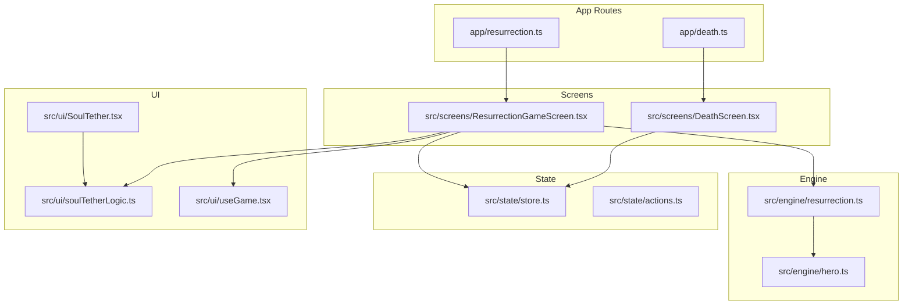
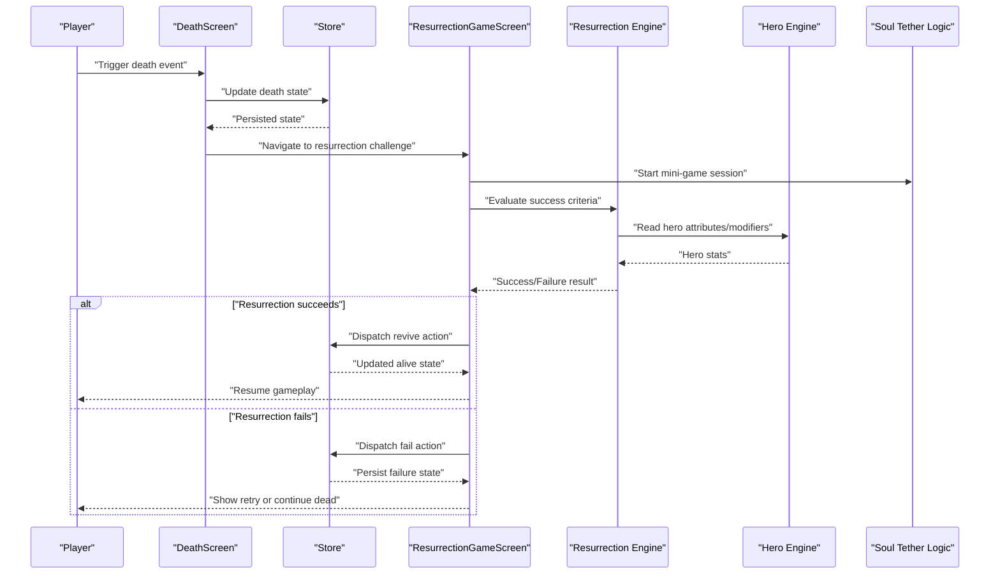
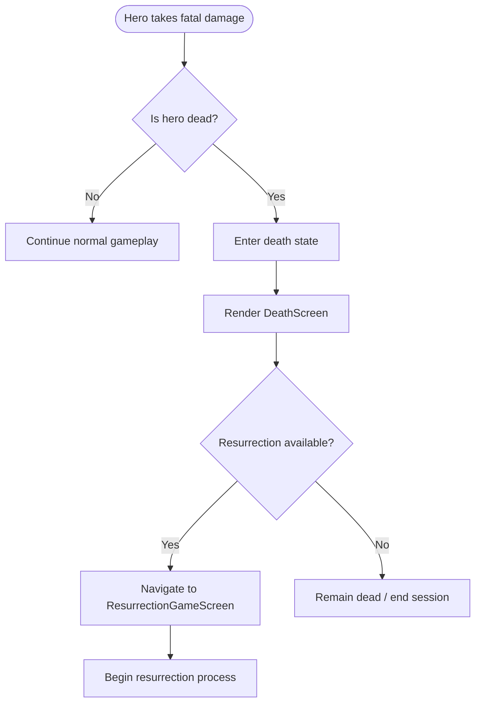
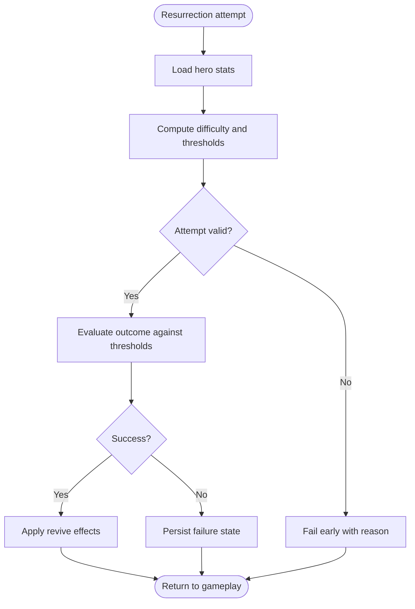
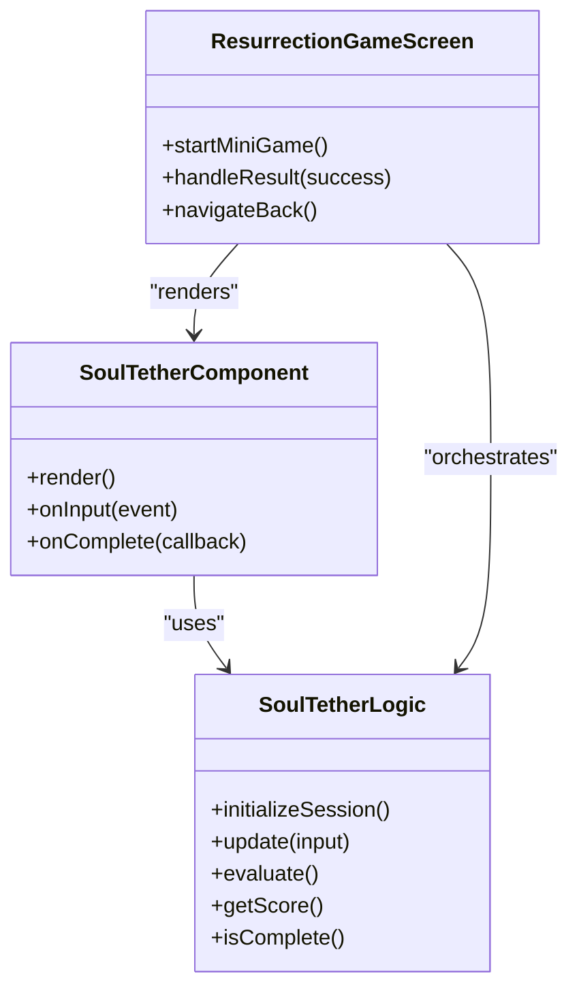
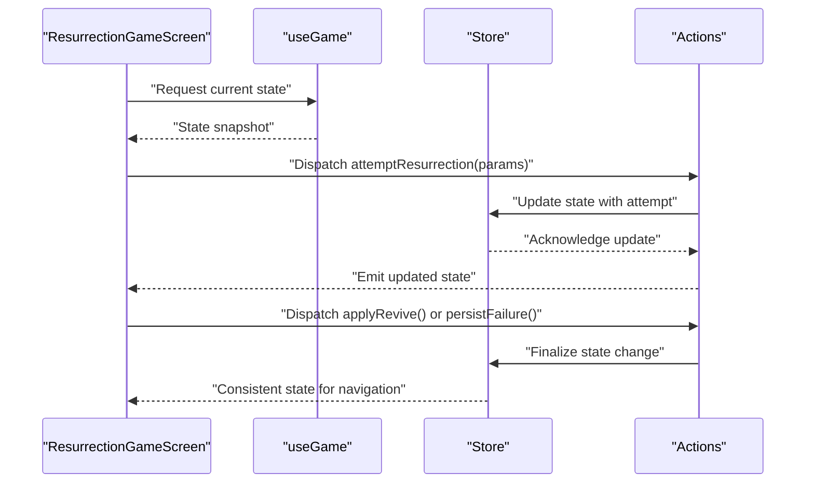
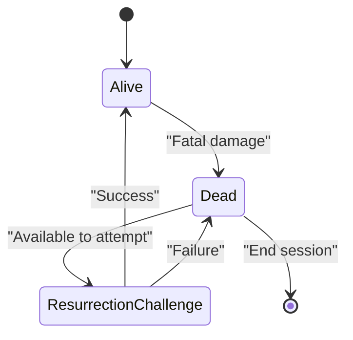
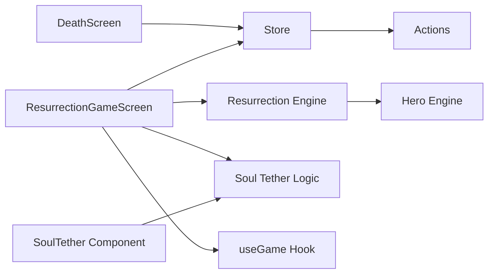

# Resurrection System

<cite>
**Referenced Files in This Document**
- [death.ts](file://app/death.ts)
- [resurrection.ts](file://app/resurrection.ts)
- [ResurrectionGameScreen.tsx](file://src/screens/ResurrectionGameScreen.tsx)
- [DeathScreen.tsx](file://src/screens/DeathScreen.tsx)
- [resurrection.ts](file://src/engine/resurrection.ts)
- [hero.ts](file://src/engine/hero.ts)
- [store.ts](file://src/state/store.ts)
- [actions.ts](file://src/state/actions.ts)
- [soulTetherLogic.ts](file://src/ui/soulTetherLogic.ts)
- [SoulTether.tsx](file://src/ui/SoulTether.tsx)
- [useGame.tsx](file://src/ui/useGame.tsx)
</cite>

## Table of Contents

1. [Introduction](#introduction)
2. [Project Structure](#project-structure)
3. [Core Components](#core-components)
4. [Architecture Overview](#architecture-overview)
5. [Detailed Component Analysis](#detailed-component-analysis)
6. [Dependency Analysis](#dependency-analysis)
7. [Performance Considerations](#performance-considerations)
8. [Troubleshooting Guide](#troubleshooting-guide)
9. [Conclusion](#conclusion)

## Introduction

This document explains the resurrection system that handles hero death, revival mechanics, and post-death gameplay. It covers death conditions, the resurrection process, associated mini-games or challenges, state transitions between alive and dead states, persistence across death cycles, and how resurrection impacts hero progression. The goal is to make the system understandable for both technical and non-technical readers while providing precise references to the implementation.

## Project Structure

The resurrection system spans UI screens, engine logic, state management, and supporting UI components:

- App-level routes for death and resurrection flows
- Engine module implementing core resurrection rules and calculations
- State store and actions for persisting and updating game state
- UI screens and hooks for user interaction during death and resurrection
- Soul tether logic and component for the resurrection mini-game

**Diagram sources**

- [death.ts](file://app/death.ts)
- [resurrection.ts](file://app/resurrection.ts)
- [DeathScreen.tsx](file://src/screens/DeathScreen.tsx)
- [ResurrectionGameScreen.tsx](file://src/screens/ResurrectionGameScreen.tsx)
- [resurrection.ts](file://src/engine/resurrection.ts)
- [hero.ts](file://src/engine/hero.ts)
- [store.ts](file://src/state/store.ts)
- [actions.ts](file://src/state/actions.ts)
- [soulTetherLogic.ts](file://src/ui/soulTetherLogic.ts)
- [SoulTether.tsx](file://src/ui/SoulTether.tsx)
- [useGame.tsx](file://src/ui/useGame.tsx)

**Section sources**

- [death.ts](file://app/death.ts)
- [resurrection.ts](file://app/resurrection.ts)
- [DeathScreen.tsx](file://src/screens/DeathScreen.tsx)
- [ResurrectionGameScreen.tsx](file://src/screens/ResurrectionGameScreen.tsx)
- [resurrection.ts](file://src/engine/resurrection.ts)
- [hero.ts](file://src/engine/hero.ts)
- [store.ts](file://src/state/store.ts)
- [actions.ts](file://src/state/actions.ts)
- [soulTetherLogic.ts](file://src/ui/soulTetherLogic.ts)
- [SoulTether.tsx](file://src/ui/SoulTether.tsx)
- [useGame.tsx](file://src/ui/useGame.tsx)

## Core Components

- Death route and screen: Initiates death flow and presents death context to the player.
- Resurrection route and game screen: Orchestrates the resurrection challenge and updates state on success.
- Resurrection engine: Encapsulates rules for determining death outcomes, calculating revival costs, and validating success conditions.
- Hero engine: Provides hero attributes and modifiers used by resurrection logic (e.g., health thresholds, resistances).
- State store and actions: Persist death and resurrection states, track progress, and ensure consistency across sessions.
- Soul tether logic and component: Implement the mini-game mechanics for the resurrection challenge.
- Game hook: Centralizes access to current game state and dispatches actions from screens.

Key responsibilities:

- Detect death conditions and transition to death state.
- Present a challenge (mini-game) to attempt resurrection.
- Compute success/failure based on player performance and hero stats.
- Update persistent state with new hero status and any progression changes.

**Section sources**

- [DeathScreen.tsx](file://src/screens/DeathScreen.tsx)
- [ResurrectionGameScreen.tsx](file://src/screens/ResurrectionGameScreen.tsx)
- [resurrection.ts](file://src/engine/resurrection.ts)
- [hero.ts](file://src/engine/hero.ts)
- [store.ts](file://src/state/store.ts)
- [actions.ts](file://src/state/actions.ts)
- [soulTetherLogic.ts](file://src/ui/soulTetherLogic.ts)
- [SoulTether.tsx](file://src/ui/SoulTether.tsx)
- [useGame.tsx](file://src/ui/useGame.tsx)

## Architecture Overview

The resurrection system follows a clear separation of concerns:

- UI layers handle presentation and input.
- Engine modules implement deterministic rules and calculations.
- State layer persists data and coordinates cross-screen updates.
- Mini-game logic encapsulates interactive challenges.

**Diagram sources**

- [DeathScreen.tsx](file://src/screens/DeathScreen.tsx)
- [ResurrectionGameScreen.tsx](file://src/screens/ResurrectionGameScreen.tsx)
- [resurrection.ts](file://src/engine/resurrection.ts)
- [hero.ts](file://src/engine/hero.ts)
- [store.ts](file://src/state/store.ts)
- [actions.ts](file://src/state/actions.ts)
- [soulTetherLogic.ts](file://src/ui/soulTetherLogic.ts)

## Detailed Component Analysis

### Death Flow and State Transitions

- Death detection triggers a transition to a dead state, preserving relevant hero information for potential resurrection.
- The death screen provides context and navigates to the resurrection challenge when available.
- State persistence ensures death status survives app restarts until resolved.

**Section sources**

- [DeathScreen.tsx](file://src/screens/DeathScreen.tsx)
- [store.ts](file://src/state/store.ts)
- [actions.ts](file://src/state/actions.ts)

### Resurrection Engine Rules

- Calculates difficulty and success probability based on hero attributes and current conditions.
- Validates whether a resurrection attempt can proceed and determines required resources or thresholds.
- Produces deterministic results used by the UI to render feedback and outcomes.

**Section sources**

- [resurrection.ts](file://src/engine/resurrection.ts)
- [hero.ts](file://src/engine/hero.ts)

### Resurrection Mini-Game: Soul Tether

- The soul tether logic defines the interactive challenge parameters, scoring, and win conditions.
- The SoulTether component renders the mini-game and forwards user interactions to the logic layer.
- The resurrection game screen orchestrates the mini-game lifecycle and integrates results into the overall resurrection flow.

**Diagram sources**

- [soulTetherLogic.ts](file://src/ui/soulTetherLogic.ts)
- [SoulTether.tsx](file://src/ui/SoulTether.tsx)
- [ResurrectionGameScreen.tsx](file://src/screens/ResurrectionGameScreen.tsx)

**Section sources**

- [soulTetherLogic.ts](file://src/ui/soulTetherLogic.ts)
- [SoulTether.tsx](file://src/ui/SoulTether.tsx)
- [ResurrectionGameScreen.tsx](file://src/screens/ResurrectionGameScreen.tsx)

### State Management and Persistence

- The store maintains global game state including hero status, death flags, and resurrection progress.
- Actions encapsulate mutations triggered by UI events (e.g., entering death, attempting resurrection, reviving).
- Persistence ensures that death and resurrection states survive app reloads and are consistent across screens.

**Diagram sources**

- [ResurrectionGameScreen.tsx](file://src/screens/ResurrectionGameScreen.tsx)
- [useGame.tsx](file://src/ui/useGame.tsx)
- [store.ts](file://src/state/store.ts)
- [actions.ts](file://src/state/actions.ts)

**Section sources**

- [store.ts](file://src/state/store.ts)
- [actions.ts](file://src/state/actions.ts)
- [useGame.tsx](file://src/ui/useGame.tsx)

### Relationship Between Death and Resurrection States

- Death state indicates the hero is unavailable for normal gameplay and may restrict certain features.
- Resurrection attempts transition the state toward revived if successful; otherwise, the death state persists.
- Progression changes upon revival (e.g., temporary debuffs, resource costs) are applied via state updates.

**Section sources**

- [store.ts](file://src/state/store.ts)
- [actions.ts](file://src/state/actions.ts)
- [resurrection.ts](file://src/engine/resurrection.ts)

### Post-Death Gameplay Effects

- Upon successful resurrection, the hero resumes gameplay with any applicable modifiers or penalties determined by the engine.
- Certain progression elements may be preserved or adjusted to balance difficulty and reward risk-taking.
- UI reflects the current state (alive/dead/challenge) and guides the player through next steps.

**Section sources**

- [resurrection.ts](file://src/engine/resurrection.ts)
- [hero.ts](file://src/engine/hero.ts)
- [ResurrectionGameScreen.tsx](file://src/screens/ResurrectionGameScreen.tsx)

## Dependency Analysis

The resurrection system depends on cohesive integration between UI, engine, and state layers:

- Screens depend on the game hook for state access and actions for mutations.
- The resurrection engine depends on hero engine for attribute evaluation.
- Mini-game logic is isolated but consumed by the resurrection screen.
- State persistence ensures consistency across the entire application.

**Diagram sources**

- [DeathScreen.tsx](file://src/screens/DeathScreen.tsx)
- [ResurrectionGameScreen.tsx](file://src/screens/ResurrectionGameScreen.tsx)
- [resurrection.ts](file://src/engine/resurrection.ts)
- [hero.ts](file://src/engine/hero.ts)
- [soulTetherLogic.ts](file://src/ui/soulTetherLogic.ts)
- [SoulTether.tsx](file://src/ui/SoulTether.tsx)
- [useGame.tsx](file://src/ui/useGame.tsx)
- [store.ts](file://src/state/store.ts)
- [actions.ts](file://src/state/actions.ts)

**Section sources**

- [resurrection.ts](file://src/engine/resurrection.ts)
- [hero.ts](file://src/engine/hero.ts)
- [store.ts](file://src/state/store.ts)
- [actions.ts](file://src/state/actions.ts)
- [ResurrectionGameScreen.tsx](file://src/screens/ResurrectionGameScreen.tsx)
- [soulTetherLogic.ts](file://src/ui/soulTetherLogic.ts)
- [SoulTether.tsx](file://src/ui/SoulTether.tsx)
- [useGame.tsx](file://src/ui/useGame.tsx)

## Performance Considerations

- Keep resurrection calculations deterministic and lightweight to avoid UI jank during mini-games.
- Batch state updates where possible to minimize re-renders.
- Cache hero attributes and computed thresholds to reduce recomputation.
- Ensure mini-game input handling is efficient and avoids unnecessary allocations.

[No sources needed since this section provides general guidance]

## Troubleshooting Guide

Common issues and resolutions:

- Resurrection does not start: Verify death state is set and resurrection availability flags are correct.
- Mini-game does not respond: Confirm input bindings in the soul tether logic and component rendering.
- State inconsistencies after restart: Ensure actions properly persist state and that the store initializes from persisted data.
- Unexpected difficulty or failure rates: Review hero attribute inputs and threshold computations in the resurrection engine.

**Section sources**

- [resurrection.ts](file://src/engine/resurrection.ts)
- [soulTetherLogic.ts](file://src/ui/soulTetherLogic.ts)
- [SoulTether.tsx](file://src/ui/SoulTether.tsx)
- [store.ts](file://src/state/store.ts)
- [actions.ts](file://src/state/actions.ts)

## Conclusion

The resurrection system integrates death detection, a structured challenge via the soul tether mini-game, and robust state management to deliver a coherent post-death experience. By separating concerns across UI, engine, and state layers, it remains maintainable and extensible. Proper persistence and deterministic calculations ensure fairness and consistency across death cycles, while post-resurrection effects balance progression and challenge.
