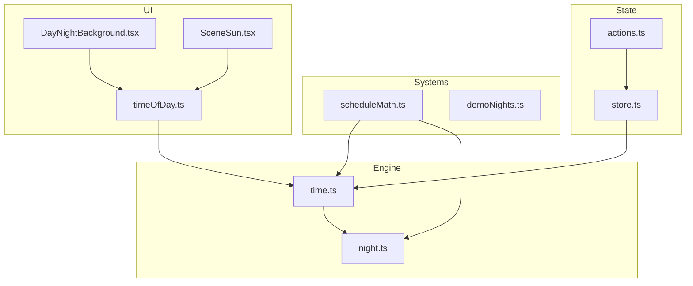
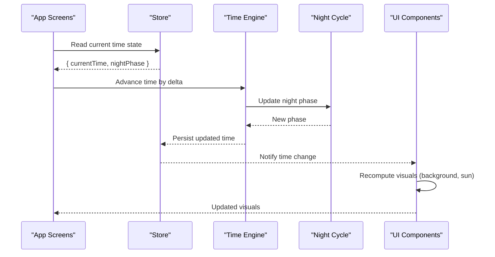
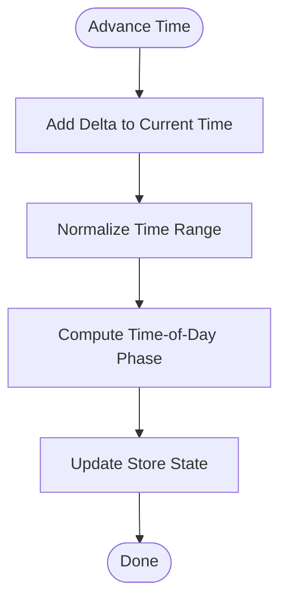
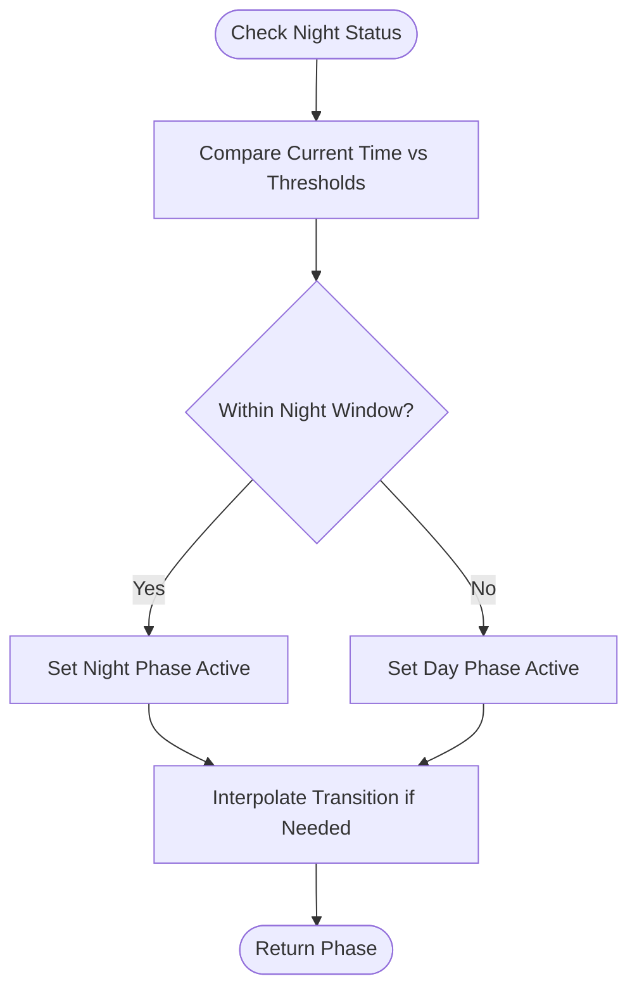
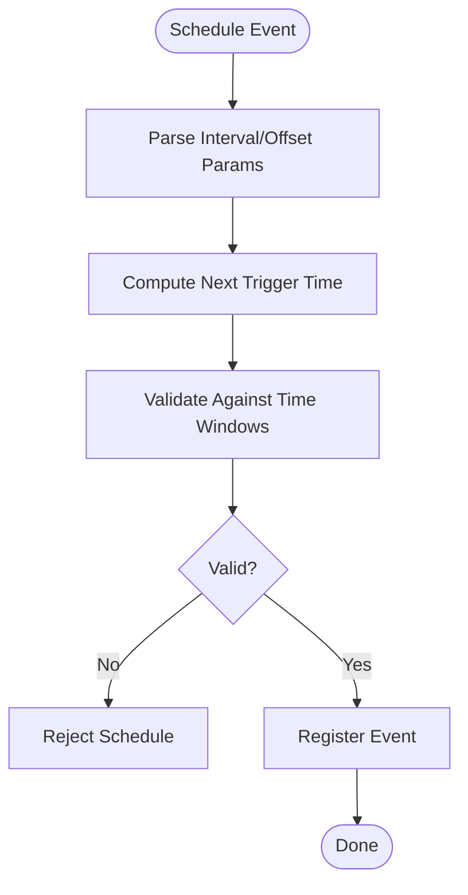
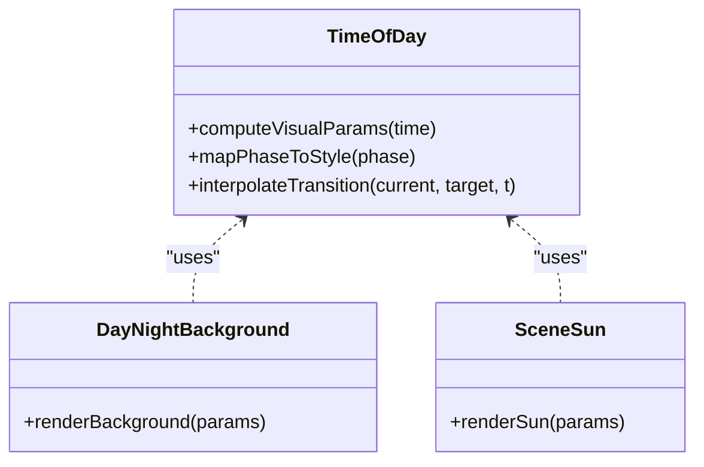
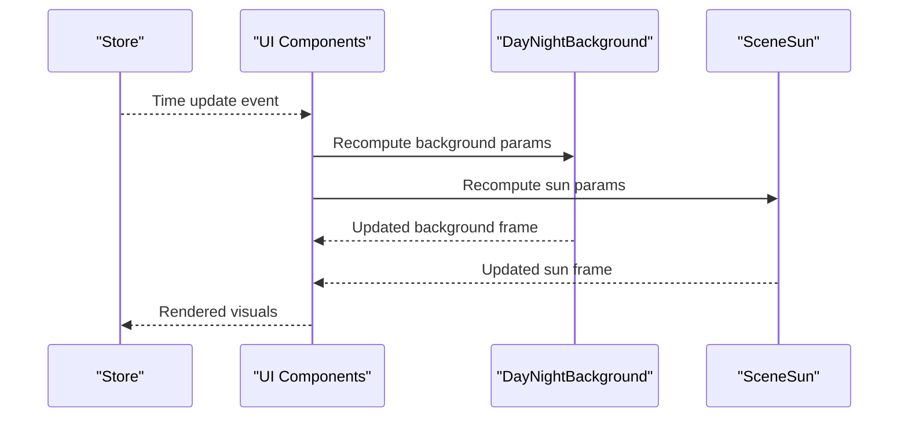
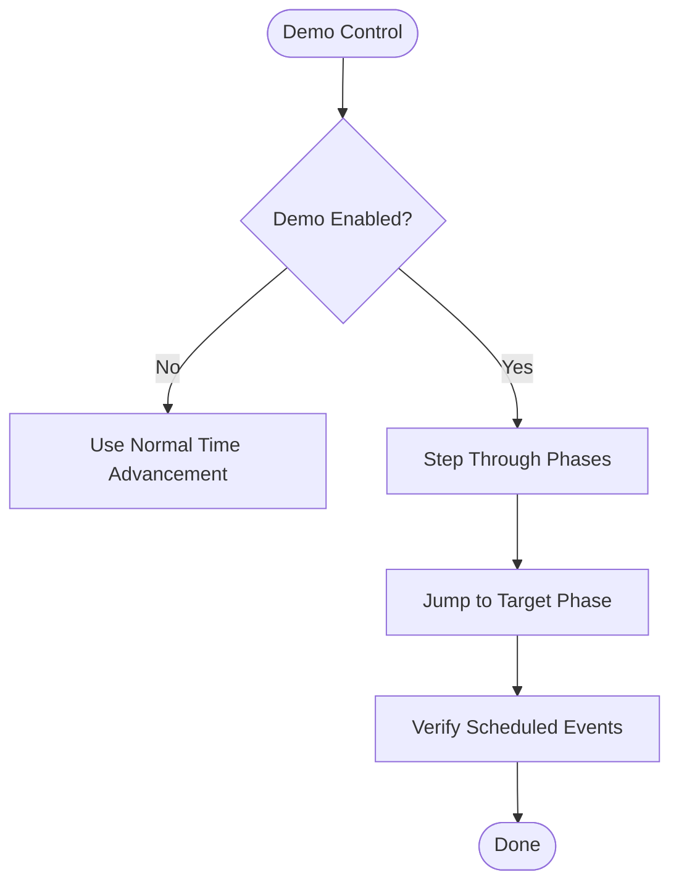
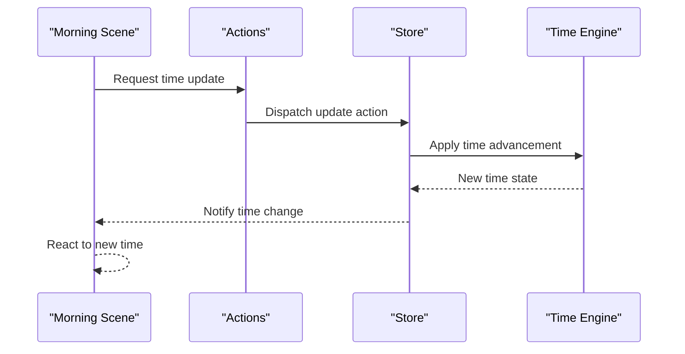
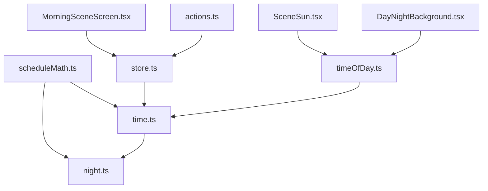

# Time System

<cite>
**Referenced Files in This Document**
- [time.ts](file://src/engine/time.ts)
- [night.ts](file://src/engine/night.ts)
- [scheduleMath.ts](file://src/systems/scheduleMath.ts)
- [timeOfDay.ts](file://src/ui/timeOfDay.ts)
- [DayNightBackground.tsx](file://src/ui/DayNightBackground.tsx)
- [SceneSun.tsx](file://src/ui/SceneSun.tsx)
- [MorningSceneScreen.tsx](file://app/morning-scene.tsx)
- [demoNights.ts](file://src/systems/demoNights.ts)
- [store.ts](file://src/state/store.ts)
- [actions.ts](file://src/state/actions.ts)
</cite>

## Table of Contents

1. [Introduction](#introduction)
2. [Project Structure](#project-structure)
3. [Core Components](#core-components)
4. [Architecture Overview](#architecture-overview)
5. [Detailed Component Analysis](#detailed-component-analysis)
6. [Dependency Analysis](#dependency-analysis)
7. [Performance Considerations](#performance-considerations)
8. [Troubleshooting Guide](#troubleshooting-guide)
9. [Conclusion](#conclusion)

## Introduction

This document explains the time system that drives day/night cycles and temporal mechanics in the game world. It covers how time progresses, how time-based events are scheduled and triggered, and how real-world time is synchronized with in-game states. It also documents calculations for time progression, event scheduling logic, and how different systems respond to time changes. Examples include time-based triggers and visual effects tied to time progression.

## Project Structure

The time system spans engine logic, UI rendering, and state management:

- Engine layer defines core time and night cycle logic.
- Systems layer provides scheduling utilities and demo controls.
- UI layer renders time-of-day visuals and backgrounds.
- State layer persists and exposes time-related state to screens.

**Diagram sources**

- [time.ts](file://src/engine/time.ts)
- [night.ts](file://src/engine/night.ts)
- [scheduleMath.ts](file://src/systems/scheduleMath.ts)
- [timeOfDay.ts](file://src/ui/timeOfDay.ts)
- [DayNightBackground.tsx](file://src/ui/DayNightBackground.tsx)
- [SceneSun.tsx](file://src/ui/SceneSun.tsx)
- [store.ts](file://src/state/store.ts)
- [actions.ts](file://src/state/actions.ts)

**Section sources**

- [time.ts](file://src/engine/time.ts)
- [night.ts](file://src/engine/night.ts)
- [scheduleMath.ts](file://src/systems/scheduleMath.ts)
- [timeOfDay.ts](file://src/ui/timeOfDay.ts)
- [DayNightBackground.tsx](file://src/ui/DayNightBackground.tsx)
- [SceneSun.tsx](file://src/ui/SceneSun.tsx)
- [store.ts](file://src/state/store.ts)
- [actions.ts](file://src/state/actions.ts)

## Core Components

- Time engine: Computes current time, advances time, and derives time-of-day phases.
- Night cycle: Manages transitions between day and night, including thresholds and durations.
- Schedule math: Provides deterministic helpers for scheduling events based on time intervals or offsets.
- UI time-of-day: Converts internal time into visual parameters (e.g., background tint, sun position).
- Visual components: Render dynamic backgrounds and sun elements that reflect the current time.
- Demo mode: Allows fast-forwarding or toggling night/day for testing.
- State integration: Stores and updates time-related state across the app.

**Section sources**

- [time.ts](file://src/engine/time.ts)
- [night.ts](file://src/engine/night.ts)
- [scheduleMath.ts](file://src/systems/scheduleMath.ts)
- [timeOfDay.ts](file://src/ui/timeOfDay.ts)
- [DayNightBackground.tsx](file://src/ui/DayNightBackground.tsx)
- [SceneSun.tsx](file://src/ui/SceneSun.tsx)
- [demoNights.ts](file://src/systems/demoNights.ts)
- [store.ts](file://src/state/store.ts)
- [actions.ts](file://src/state/actions.ts)

## Architecture Overview

The time system follows a layered architecture:

- Engine computes canonical time and night phase.
- Systems provide scheduling utilities and test/demo controls.
- UI reads time-of-day values to render visuals.
- State persists and broadcasts changes to consumers.

**Diagram sources**

- [time.ts](file://src/engine/time.ts)
- [night.ts](file://src/engine/night.ts)
- [store.ts](file://src/state/store.ts)
- [timeOfDay.ts](file://src/ui/timeOfDay.ts)
- [DayNightBackground.tsx](file://src/ui/DayNightBackground.tsx)
- [SceneSun.tsx](file://src/ui/SceneSun.tsx)

## Detailed Component Analysis

### Time Engine

Responsibilities:

- Maintain canonical time value and derive time-of-day phases.
- Provide functions to advance time deterministically.
- Expose current time state to other layers.

Key behaviors:

- Time advancement uses consistent deltas to avoid drift.
- Phase derivation maps time ranges to named phases (e.g., morning, afternoon, evening, night).
- Integration with store ensures persistence and cross-screen consistency.

**Diagram sources**

- [time.ts](file://src/engine/time.ts)
- [store.ts](file://src/state/store.ts)

**Section sources**

- [time.ts](file://src/engine/time.ts)
- [store.ts](file://src/state/store.ts)

### Night Cycle

Responsibilities:

- Manage transitions between day and night using thresholds and durations.
- Determine when night begins/ends and compute intermediate phases.
- Provide helpers to check if current time falls within night windows.

Key behaviors:

- Thresholds define boundaries for entering/exiting night.
- Duration controls length of night periods.
- Phase interpolation may be used for smooth transitions.

**Diagram sources**

- [night.ts](file://src/engine/night.ts)

**Section sources**

- [night.ts](file://src/engine/night.ts)

### Schedule Math

Responsibilities:

- Provide deterministic helpers for scheduling events based on time intervals or offsets.
- Calculate next trigger times and validate event windows.
- Support periodic and one-off events aligned with time phases.

Key behaviors:

- Interval-based scheduling aligns with time deltas from the engine.
- Offset calculations ensure events occur at desired moments relative to time-of-day.
- Validation prevents overlapping or invalid schedules.

**Diagram sources**

- [scheduleMath.ts](file://src/systems/scheduleMath.ts)

**Section sources**

- [scheduleMath.ts](file://src/systems/scheduleMath.ts)

### UI Time-of-Day

Responsibilities:

- Convert internal time into visual parameters such as background tint, sun elevation, and scene brightness.
- Provide hooks or selectors for components to react to time changes.
- Ensure consistent mapping from time phases to visual styles.

Key behaviors:

- Phase-to-style mapping yields colors, gradients, and opacity levels.
- Smooth transitions avoid abrupt visual changes during phase switches.
- Re-computation occurs on time updates from the store.

**Diagram sources**

- [timeOfDay.ts](file://src/ui/timeOfDay.ts)
- [DayNightBackground.tsx](file://src/ui/DayNightBackground.tsx)
- [SceneSun.tsx](file://src/ui/SceneSun.tsx)

**Section sources**

- [timeOfDay.ts](file://src/ui/timeOfDay.ts)
- [DayNightBackground.tsx](file://src/ui/DayNightBackground.tsx)
- [SceneSun.tsx](file://src/ui/SceneSun.tsx)

### Visual Components

Responsibilities:

- Render dynamic backgrounds reflecting time-of-day.
- Animate sun position and intensity based on current phase.
- Respond to store updates to refresh visuals smoothly.

Key behaviors:

- Background gradient and color shift with phase transitions.
- Sun elevation correlates with time-of-day angle.
- Animation frames interpolate between states for fluidity.

**Diagram sources**

- [DayNightBackground.tsx](file://src/ui/DayNightBackground.tsx)
- [SceneSun.tsx](file://src/ui/SceneSun.tsx)
- [store.ts](file://src/state/store.ts)

**Section sources**

- [DayNightBackground.tsx](file://src/ui/DayNightBackground.tsx)
- [SceneSun.tsx](file://src/ui/SceneSun.tsx)
- [store.ts](file://src/state/store.ts)

### Demo Mode

Responsibilities:

- Allow rapid cycling through day/night for testing.
- Provide controls to jump to specific phases or accelerate time.
- Integrate with schedule math to verify event triggers under accelerated time.

Key behaviors:

- Toggle flags to enable/disable demo behavior.
- Override normal time advancement with controlled steps.
- Emit events to simulate real-time progression.

**Diagram sources**

- [demoNights.ts](file://src/systems/demoNights.ts)
- [scheduleMath.ts](file://src/systems/scheduleMath.ts)

**Section sources**

- [demoNights.ts](file://src/systems/demoNights.ts)
- [scheduleMath.ts](file://src/systems/scheduleMath.ts)

### State Integration

Responsibilities:

- Persist current time and night phase across sessions.
- Expose actions to update time and notify subscribers.
- Coordinate with screens to read and react to time changes.

Key behaviors:

- Actions encapsulate time updates and side effects.
- Store subscriptions trigger UI re-renders and system responses.
- Consistency checks prevent invalid states.

**Diagram sources**

- [actions.ts](file://src/state/actions.ts)
- [store.ts](file://src/state/store.ts)
- [time.ts](file://src/engine/time.ts)
- [MorningSceneScreen.tsx](file://app/morning-scene.tsx)

**Section sources**

- [actions.ts](file://src/state/actions.ts)
- [store.ts](file://src/state/store.ts)
- [time.ts](file://src/engine/time.ts)
- [MorningSceneScreen.tsx](file://app/morning-scene.tsx)

## Dependency Analysis

The time system exhibits clear separation of concerns:

- Engine depends on minimal external modules for core calculations.
- Systems layer depends on engine for time primitives and provides utilities.
- UI depends on engine-derived values via time-of-day mappings.
- State layer coordinates persistence and broadcasting.

**Diagram sources**

- [time.ts](file://src/engine/time.ts)
- [night.ts](file://src/engine/night.ts)
- [scheduleMath.ts](file://src/systems/scheduleMath.ts)
- [timeOfDay.ts](file://src/ui/timeOfDay.ts)
- [DayNightBackground.tsx](file://src/ui/DayNightBackground.tsx)
- [SceneSun.tsx](file://src/ui/SceneSun.tsx)
- [store.ts](file://src/state/store.ts)
- [actions.ts](file://src/state/actions.ts)
- [MorningSceneScreen.tsx](file://app/morning-scene.tsx)

**Section sources**

- [time.ts](file://src/engine/time.ts)
- [night.ts](file://src/engine/night.ts)
- [scheduleMath.ts](file://src/systems/scheduleMath.ts)
- [timeOfDay.ts](file://src/ui/timeOfDay.ts)
- [DayNightBackground.tsx](file://src/ui/DayNightBackground.tsx)
- [SceneSun.tsx](file://src/ui/SceneSun.tsx)
- [store.ts](file://src/state/store.ts)
- [actions.ts](file://src/state/actions.ts)
- [MorningSceneScreen.tsx](file://app/morning-scene.tsx)

## Performance Considerations

- Avoid frequent recalculations by batching time updates and debouncing UI recompositions.
- Use efficient phase-to-style mappings to minimize per-frame computations.
- Cache derived values like interpolated colors and sun positions where appropriate.
- Limit heavy operations in event scheduling to initialization or explicit triggers.

[No sources needed since this section provides general guidance]

## Troubleshooting Guide

Common issues and resolutions:

- Time drift: Ensure deltas are consistent and normalized; verify store persistence after updates.
- Night phase flicker: Check threshold boundaries and interpolation smoothing; confirm no conflicting overrides.
- Event misfires: Validate interval and offset calculations; ensure schedules respect time windows.
- UI lag: Reduce per-frame work; use memoization for time-of-day parameters; batch state updates.

**Section sources**

- [time.ts](file://src/engine/time.ts)
- [night.ts](file://src/engine/night.ts)
- [scheduleMath.ts](file://src/systems/scheduleMath.ts)
- [timeOfDay.ts](file://src/ui/timeOfDay.ts)
- [store.ts](file://src/state/store.ts)

## Conclusion

The time system integrates engine calculations, scheduling utilities, UI rendering, and state management to deliver robust day/night cycles and temporal mechanics. By separating responsibilities and providing deterministic time progression, it supports reliable event scheduling and smooth visual feedback. Proper performance practices and troubleshooting strategies ensure stability and responsiveness across the application.

[No sources needed since this section summarizes without analyzing specific files]
