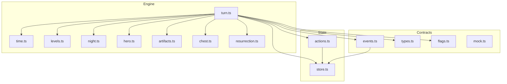
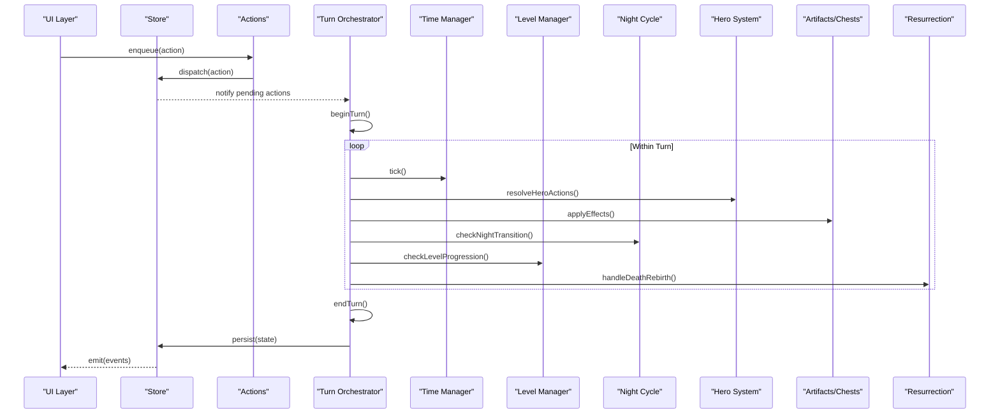
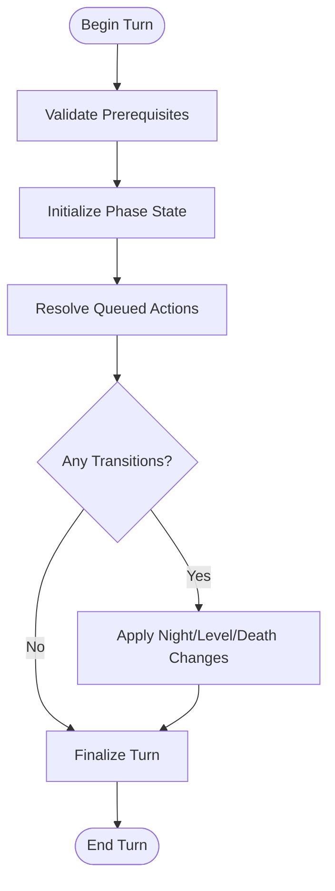
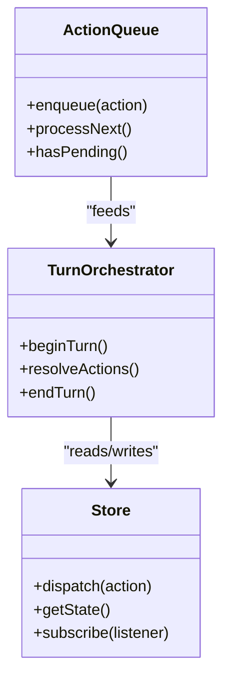
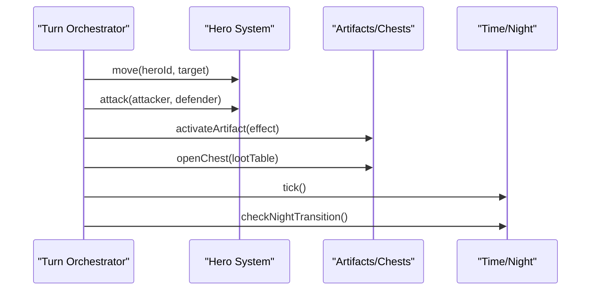
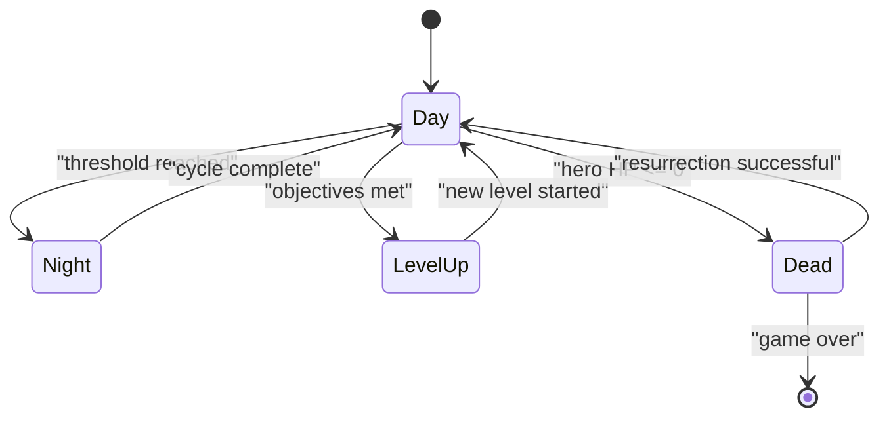
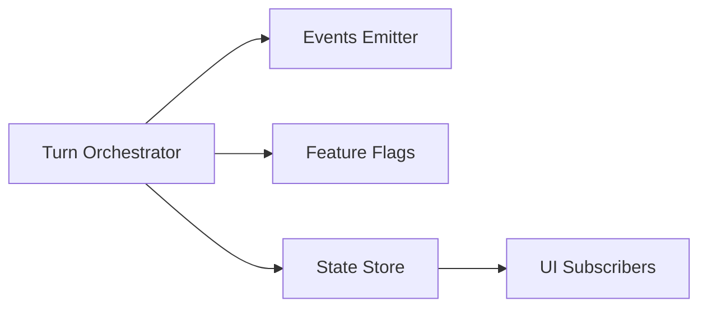
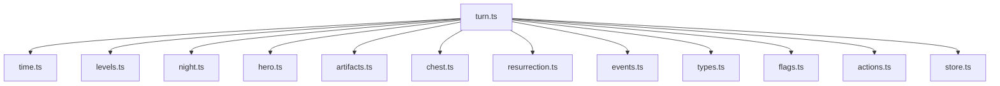

# Turn System

<cite>
**Referenced Files in This Document**
- [turn.ts](file://src/engine/turn.ts)
- [time.ts](file://src/engine/time.ts)
- [levels.ts](file://src/engine/levels.ts)
- [night.ts](file://src/engine/night.ts)
- [hero.ts](file://src/engine/hero.ts)
- [artifacts.ts](file://src/engine/artifacts.ts)
- [chest.ts](file://src/engine/chest.ts)
- [resurrection.ts](file://src/engine/resurrection.ts)
- [actions.ts](file://src/state/actions.ts)
- [store.ts](file://src/state/store.ts)
- [events.ts](file://src/contracts/events.ts)
- [types.ts](file://src/contracts/types.ts)
- [flags.ts](file://src/contracts/flags.ts)
- [mock.ts](file://src/contracts/mock.ts)
- [turn.test.ts](file://src/engine/__tests__/turn.test.ts)
</cite>

## Table of Contents

1. [Introduction](#introduction)
2. [Project Structure](#project-structure)
3. [Core Components](#core-components)
4. [Architecture Overview](#architecture-overview)
5. [Detailed Component Analysis](#detailed-component-analysis)
6. [Dependency Analysis](#dependency-analysis)
7. [Performance Considerations](#performance-considerations)
8. [Troubleshooting Guide](#troubleshooting-guide)
9. [Conclusion](#conclusion)
10. [Appendices](#appendices)

## Introduction

This document explains the turn-based system that manages game turns, player actions, and turn progression. It covers how turns are structured, how actions are resolved within a turn, and how state transitions occur between turns. It also documents the turn lifecycle, action queuing, multi-entity interactions within turn boundaries, common patterns for managing turns, and integration points with other game systems such as time, levels, night cycles, heroes, artifacts, chests, and resurrection logic.

## Project Structure

The turn system is implemented primarily under src/engine with supporting contracts and state management modules:

- Engine layer: turn orchestration, timekeeping, level progression, night cycle, hero behavior, artifacts, chests, and resurrection.
- Contracts: shared types, events, flags, and mocks used across engine and UI.
- State layer: actions and store for persisting and broadcasting game state changes.

**Diagram sources**

- [turn.ts](file://src/engine/turn.ts)
- [time.ts](file://src/engine/time.ts)
- [levels.ts](file://src/engine/levels.ts)
- [night.ts](file://src/engine/night.ts)
- [hero.ts](file://src/engine/hero.ts)
- [artifacts.ts](file://src/engine/artifacts.ts)
- [chest.ts](file://src/engine/chest.ts)
- [resurrection.ts](file://src/engine/resurrection.ts)
- [events.ts](file://src/contracts/events.ts)
- [types.ts](file://src/contracts/types.ts)
- [flags.ts](file://src/contracts/flags.ts)
- [actions.ts](file://src/state/actions.ts)
- [store.ts](file://src/state/store.ts)

**Section sources**

- [turn.ts](file://src/engine/turn.ts)
- [time.ts](file://src/engine/time.ts)
- [levels.ts](file://src/engine/levels.ts)
- [night.ts](file://src/engine/night.ts)
- [hero.ts](file://src/engine/hero.ts)
- [artifacts.ts](file://src/engine/artifacts.ts)
- [chest.ts](file://src/engine/chest.ts)
- [resurrection.ts](file://src/engine/resurrection.ts)
- [events.ts](file://src/contracts/events.ts)
- [types.ts](file://src/contracts/types.ts)
- [flags.ts](file://src/contracts/flags.ts)
- [actions.ts](file://src/state/actions.ts)
- [store.ts](file://src/state/store.ts)

## Core Components

- Turn orchestrator: coordinates start, action resolution, and end-of-turn transitions; enforces turn boundaries and ensures consistent state updates.
- Time manager: tracks day/night ticks and provides timing hooks for turn phases.
- Level manager: handles progression between levels and resets or persists per-level state.
- Night cycle: controls night-specific rules and transitions back to day.
- Hero subsystem: processes hero actions, movement, and combat within a turn.
- Artifacts and Chests: item effects and loot resolution during turns.
- Resurrection: handles death/rebirth mechanics triggered by turn events.
- Contracts (types, events, flags): define data shapes, event payloads, and feature flags governing turn behavior.
- State actions and store: dispatches immutable updates and broadcasts events to subscribers.

Key responsibilities:

- Maintain a single source of truth for turn state.
- Enforce deterministic order of operations within a turn.
- Emit typed events for cross-system reactions.
- Persist state changes via actions and store.

**Section sources**

- [turn.ts](file://src/engine/turn.ts)
- [time.ts](file://src/engine/time.ts)
- [levels.ts](file://src/engine/levels.ts)
- [night.ts](file://src/engine/night.ts)
- [hero.ts](file://src/engine/hero.ts)
- [artifacts.ts](file://src/engine/artifacts.ts)
- [chest.ts](file://src/engine/chest.ts)
- [resurrection.ts](file://src/engine/resurrection.ts)
- [events.ts](file://src/contracts/events.ts)
- [types.ts](file://src/contracts/types.ts)
- [flags.ts](file://src/contracts/flags.ts)
- [actions.ts](file://src/state/actions.ts)
- [store.ts](file://src/state/store.ts)

## Architecture Overview

The turn system follows a layered architecture:

- Input layer: user actions and system triggers queue into an action queue.
- Orchestrator: processes queued actions deterministically within a turn boundary.
- Subsystems: each subsystem encapsulates its own logic and side effects.
- State layer: central store persists state and emits events.

**Diagram sources**

- [turn.ts](file://src/engine/turn.ts)
- [time.ts](file://src/engine/time.ts)
- [levels.ts](file://src/engine/levels.ts)
- [night.ts](file://src/engine/night.ts)
- [hero.ts](file://src/engine/hero.ts)
- [artifacts.ts](file://src/engine/artifacts.ts)
- [chest.ts](file://src/engine/chest.ts)
- [resurrection.ts](file://src/engine/resurrection.ts)
- [actions.ts](file://src/state/actions.ts)
- [store.ts](file://src/state/store.ts)

## Detailed Component Analysis

### Turn Lifecycle and Phases

The turn lifecycle consists of discrete phases:

- Begin Turn: validate prerequisites, initialize phase-local state, and prepare subsystems.
- Action Resolution: process queued actions in a deterministic order; execute hero moves, attacks, item effects, and environmental updates.
- End Turn: finalize changes, trigger transitions (night/day, level), and broadcast events.

**Diagram sources**

- [turn.ts](file://src/engine/turn.ts)
- [time.ts](file://src/engine/time.ts)
- [levels.ts](file://src/engine/levels.ts)
- [night.ts](file://src/engine/night.ts)
- [resurrection.ts](file://src/engine/resurrection.ts)

**Section sources**

- [turn.ts](file://src/engine/turn.ts)
- [time.ts](file://src/engine/time.ts)
- [levels.ts](file://src/engine/levels.ts)
- [night.ts](file://src/engine/night.ts)
- [resurrection.ts](file://src/engine/resurrection.ts)

### Action Queue and Resolution

- Queueing: actions are enqueued from UI or system triggers and dispatched through the actions module.
- Deterministic processing: the turn orchestrator processes actions in a stable order to ensure reproducibility.
- Side effects: each action may update multiple subsystems; changes are batched until end-of-turn persistence.

**Diagram sources**

- [actions.ts](file://src/state/actions.ts)
- [store.ts](file://src/state/store.ts)
- [turn.ts](file://src/engine/turn.ts)

**Section sources**

- [actions.ts](file://src/state/actions.ts)
- [store.ts](file://src/state/store.ts)
- [turn.ts](file://src/engine/turn.ts)

### Multi-Entity Interactions Within Turns

- Heroes: movement, combat, and ability usage are processed sequentially to avoid race conditions.
- Artifacts and Chests: item effects and loot drops are applied after hero actions to maintain order.
- Environmental updates: time ticks and night checks occur at defined intervals within the turn.

**Diagram sources**

- [hero.ts](file://src/engine/hero.ts)
- [artifacts.ts](file://src/engine/artifacts.ts)
- [chest.ts](file://src/engine/chest.ts)
- [time.ts](file://src/engine/time.ts)
- [night.ts](file://src/engine/night.ts)
- [turn.ts](file://src/engine/turn.ts)

**Section sources**

- [hero.ts](file://src/engine/hero.ts)
- [artifacts.ts](file://src/engine/artifacts.ts)
- [chest.ts](file://src/engine/chest.ts)
- [time.ts](file://src/engine/time.ts)
- [night.ts](file://src/engine/night.ts)
- [turn.ts](file://src/engine/turn.ts)

### State Transitions Between Turns

- Night transition: when certain thresholds are met, the system switches to night mode and applies night-specific rules.
- Level progression: upon meeting criteria (e.g., objectives completed), the next level is loaded and state is reset accordingly.
- Death and resurrection: if a hero dies during a turn, resurrection logic determines revival outcomes and subsequent state.

**Diagram sources**

- [night.ts](file://src/engine/night.ts)
- [levels.ts](file://src/engine/levels.ts)
- [resurrection.ts](file://src/engine/resurrection.ts)
- [turn.ts](file://src/engine/turn.ts)

**Section sources**

- [night.ts](file://src/engine/night.ts)
- [levels.ts](file://src/engine/levels.ts)
- [resurrection.ts](file://src/engine/resurrection.ts)
- [turn.ts](file://src/engine/turn.ts)

### Integration With Other Systems

- Events: the system emits typed events for UI updates, analytics, and cross-module reactions.
- Flags: feature flags gate turn behaviors and optional subsystems.
- Mocks: test doubles enable isolated testing of turn logic without full environment setup.

**Diagram sources**

- [events.ts](file://src/contracts/events.ts)
- [flags.ts](file://src/contracts/flags.ts)
- [store.ts](file://src/state/store.ts)
- [turn.ts](file://src/engine/turn.ts)

**Section sources**

- [events.ts](file://src/contracts/events.ts)
- [flags.ts](file://src/contracts/flags.ts)
- [store.ts](file://src/state/store.ts)
- [turn.ts](file://src/engine/turn.ts)

### Patterns and Best Practices

- Single Responsibility: each subsystem owns its domain logic and exposes clear interfaces.
- Deterministic Order: enforce strict sequencing to prevent non-deterministic outcomes.
- Event-Driven Updates: decouple subsystems using typed events for reactive updates.
- Immutable State: use actions and store to maintain consistent snapshots and history.

[No sources needed since this section provides general guidance]

## Dependency Analysis

The turn orchestrator depends on multiple subsystems and contracts. Understanding these dependencies helps identify coupling and potential circular references.

**Diagram sources**

- [turn.ts](file://src/engine/turn.ts)
- [time.ts](file://src/engine/time.ts)
- [levels.ts](file://src/engine/levels.ts)
- [night.ts](file://src/engine/night.ts)
- [hero.ts](file://src/engine/hero.ts)
- [artifacts.ts](file://src/engine/artifacts.ts)
- [chest.ts](file://src/engine/chest.ts)
- [resurrection.ts](file://src/engine/resurrection.ts)
- [events.ts](file://src/contracts/events.ts)
- [types.ts](file://src/contracts/types.ts)
- [flags.ts](file://src/contracts/flags.ts)
- [actions.ts](file://src/state/actions.ts)
- [store.ts](file://src/state/store.ts)

**Section sources**

- [turn.ts](file://src/engine/turn.ts)
- [time.ts](file://src/engine/time.ts)
- [levels.ts](file://src/engine/levels.ts)
- [night.ts](file://src/engine/night.ts)
- [hero.ts](file://src/engine/hero.ts)
- [artifacts.ts](file://src/engine/artifacts.ts)
- [chest.ts](file://src/engine/chest.ts)
- [resurrection.ts](file://src/engine/resurrection.ts)
- [events.ts](file://src/contracts/events.ts)
- [types.ts](file://src/contracts/types.ts)
- [flags.ts](file://src/contracts/flags.ts)
- [actions.ts](file://src/state/actions.ts)
- [store.ts](file://src/state/store.ts)

## Performance Considerations

- Batch updates: group state mutations within a turn to minimize re-renders and I/O.
- Lazy evaluation: defer expensive calculations until necessary (e.g., pathfinding).
- Event throttling: coalesce frequent events to reduce UI overhead.
- Memory management: reuse objects where possible and avoid unnecessary allocations during high-frequency loops.

[No sources needed since this section provides general guidance]

## Troubleshooting Guide

Common issues and resolutions:

- Non-deterministic outcomes: verify action ordering and ensure no concurrent modifications during resolution.
- Stuck turns: check prerequisites and validation logic; ensure transitions are reachable.
- Missing events: confirm event emission points and subscriber registration.
- State inconsistencies: inspect action dispatch sequence and store persistence.

Use tests to isolate problems:

- Turn behavior tests: validate lifecycle and transitions.
- Mock environments: simulate subsystems to reproduce edge cases.

**Section sources**

- [turn.test.ts](file://src/engine/__tests__/turn.test.ts)
- [mock.ts](file://src/contracts/mock.ts)

## Conclusion

The turn-based system provides a robust framework for managing game turns, resolving actions deterministically, and transitioning between states reliably. By adhering to clear separation of concerns, event-driven communication, and immutable state practices, the system supports complex interactions among heroes, items, and environment while maintaining performance and predictability.

[No sources needed since this section summarizes without analyzing specific files]

## Appendices

- Example scenarios:
  - Player initiates a move followed by an attack; artifacts activate post-combat; night transition occurs if threshold reached.
  - Level completion triggers level-up; new level initializes with fresh state; events propagate to UI.
- References:
  - Contract types define payload structures for events and actions.
  - Flags control optional features like advanced night mechanics or artifact chains.

[No sources needed since this section provides general guidance]
