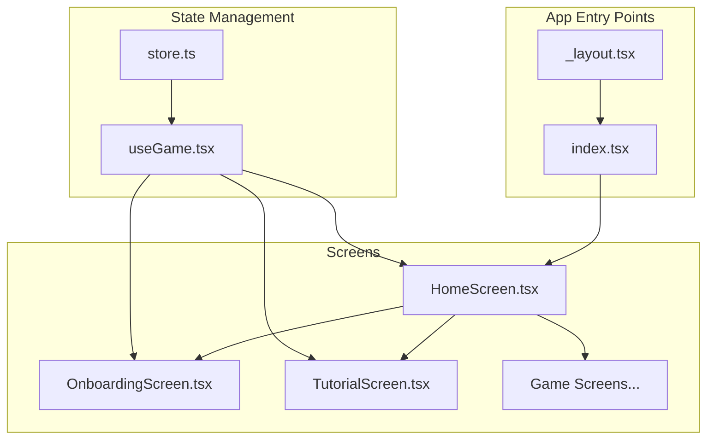
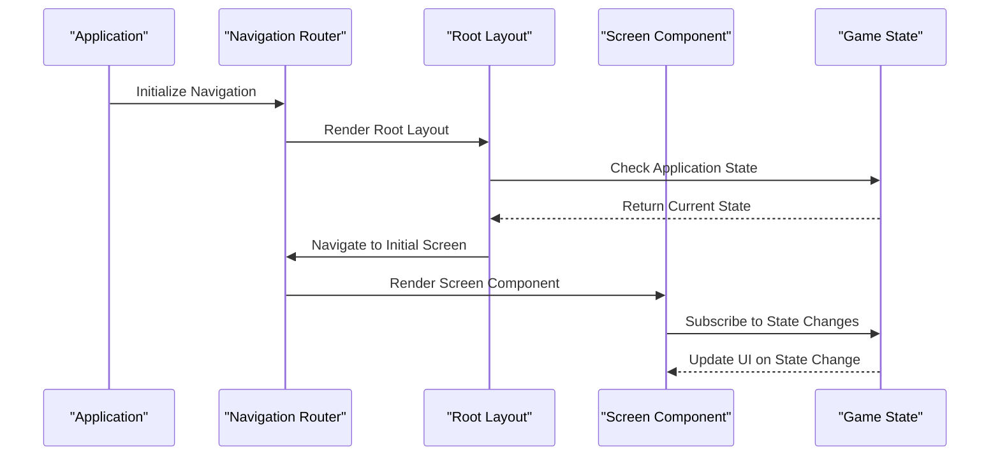
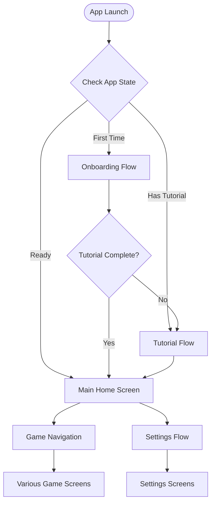
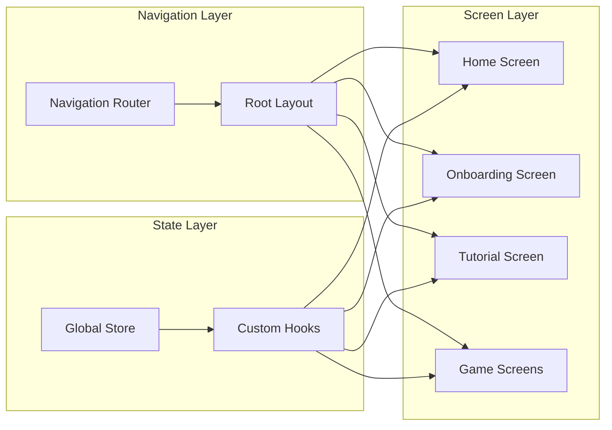

# Screen Navigation Architecture

<cite>
**Referenced Files in This Document**
- [app/_layout.tsx](file://app/_layout.tsx)
- [app/index.tsx](file://app/index.tsx)
- [src/screens/HomeScreen.tsx](file://src/screens/HomeScreen.tsx)
- [src/screens/OnboardingScreen.tsx](file://src/screens/OnboardingScreen.tsx)
- [src/screens/TutorialScreen.tsx](file://src/screens/TutorialScreen.tsx)
- [src/state/store.ts](file://src/state/store.ts)
- [src/ui/useGame.tsx](file://src/ui/useGame.tsx)
</cite>

## Table of Contents

1. [Introduction](#introduction)
2. [Project Structure](#project-structure)
3. [Core Components](#core-components)
4. [Architecture Overview](#architecture-overview)
5. [Detailed Component Analysis](#detailed-component-analysis)
6. [Dependency Analysis](#dependency-analysis)
7. [Performance Considerations](#performance-considerations)
8. [Troubleshooting Guide](#troubleshooting-guide)
9. [Conclusion](#conclusion)

## Introduction

This document explains the screen-based navigation architecture for a React Native application using Expo Router and React Navigation patterns. It covers how screens are organized, routed, and managed, including layout structure, transitions, and coordination between navigation state and game state.

## Project Structure

The application follows a feature-based organization with clear separation between app entry points, screen components, and state management:

**Diagram sources**

- [app/_layout.tsx](file://app/_layout.tsx)
- [app/index.tsx](file://app/index.tsx)
- [src/screens/HomeScreen.tsx](file://src/screens/HomeScreen.tsx)
- [src/state/store.ts](file://src/state/store.ts)

**Section sources**

- [app/_layout.tsx](file://app/_layout.tsx)
- [app/index.tsx](file://app/index.tsx)

## Core Components

### Navigation Container Setup

The root layout component initializes the navigation container and provides global configuration for the entire application.

### Screen Organization

Screens are organized in the `src/screens/` directory with each screen having its own dedicated component file. The main entry point (`app/index.tsx`) determines the initial screen based on application state.

### State Integration

Navigation state is coordinated with game state through custom hooks and context providers, ensuring seamless transitions between different application modes.

**Section sources**

- [src/screens/HomeScreen.tsx](file://src/screens/HomeScreen.tsx)
- [src/state/store.ts](file://src/state/store.ts)

## Architecture Overview

The navigation architecture follows a hierarchical pattern with clear separation of concerns:

**Diagram sources**

- [app/_layout.tsx](file://app/_layout.tsx)
- [app/index.tsx](file://app/index.tsx)
- [src/state/store.ts](file://src/state/store.ts)

## Detailed Component Analysis

### Root Layout Configuration

The root layout component serves as the foundation for all navigation, providing common functionality and state management across all screens.

### Screen Transition Management

Transitions between screens are handled through React Navigation's built-in transition system, with custom animations available for specific screen types.

### Programmatic Navigation

Screens implement programmatic navigation using navigation hooks and methods, allowing for dynamic routing based on user interactions and application state changes.

### Screen Parameters Passing

Data is passed between screens through navigation parameters, enabling contextual information transfer during navigation flows.

**Section sources**

- [src/screens/HomeScreen.tsx](file://src/screens/HomeScreen.tsx)
- [src/screens/OnboardingScreen.tsx](file://src/screens/OnboardingScreen.tsx)
- [src/screens/TutorialScreen.tsx](file://src/screens/TutorialScreen.tsx)

### Tutorial and Onboarding Integration

The tutorial and onboarding flows integrate seamlessly with the main navigation structure, providing guided experiences while maintaining consistent navigation patterns.

**Diagram sources**

- [app/index.tsx](file://app/index.tsx)
- [src/screens/OnboardingScreen.tsx](file://src/screens/OnboardingScreen.tsx)
- [src/screens/TutorialScreen.tsx](file://src/screens/TutorialScreen.tsx)
- [src/screens/HomeScreen.tsx](file://src/screens/HomeScreen.tsx)

## Dependency Analysis

The navigation system has clear dependency relationships:

**Diagram sources**

- [src/state/store.ts](file://src/state/store.ts)
- [src/ui/useGame.tsx](file://src/ui/useGame.tsx)
- [src/screens/HomeScreen.tsx](file://src/screens/HomeScreen.tsx)

**Section sources**

- [src/state/store.ts](file://src/state/store.ts)
- [src/ui/useGame.tsx](file://src/ui/useGame.tsx)

## Performance Considerations

### Navigation Optimization

- Use lazy loading for heavy screens to improve initial load time
- Implement proper cleanup in screen components to prevent memory leaks
- Optimize navigation stack depth to maintain smooth transitions

### State Management Integration

- Minimize re-renders by using selective state subscriptions
- Implement proper memoization for navigation-related computations
- Use efficient data passing patterns between screens

## Troubleshooting Guide

### Common Navigation Issues

- **Screen not rendering**: Verify navigation route configuration and screen registration
- **State synchronization problems**: Check state subscription patterns and cleanup logic
- **Memory leaks**: Ensure proper unsubscription in useEffect hooks and component cleanup

### Debugging Navigation Flow

- Use React Navigation DevTools for debugging navigation state
- Implement logging for navigation events during development
- Test navigation flows with different application states

## Conclusion

The screen-based navigation architecture provides a robust foundation for managing complex application flows. By separating concerns between navigation, state management, and screen logic, the application maintains scalability and maintainability. The integration of tutorial and onboarding flows ensures a smooth user experience while preserving the consistency of the navigation pattern throughout the application.
