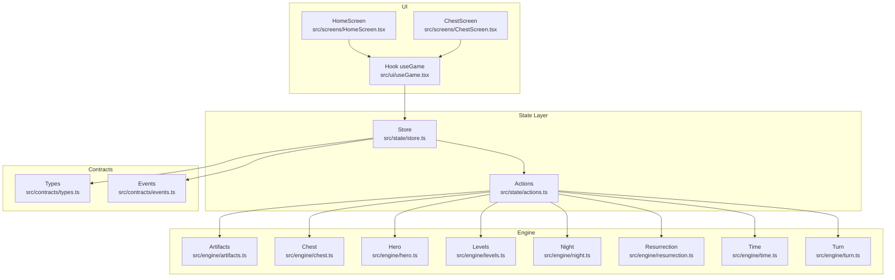
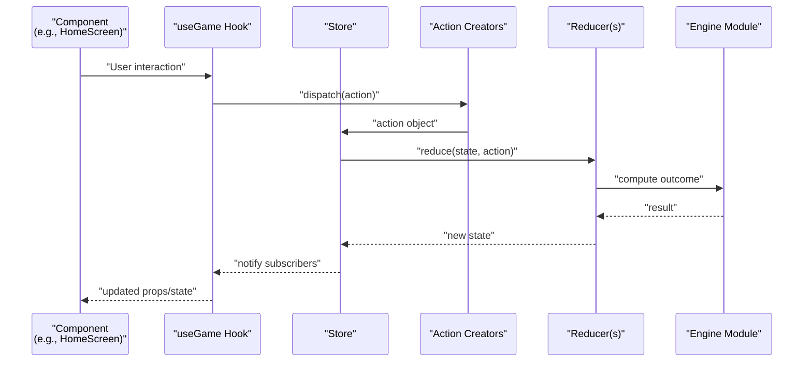
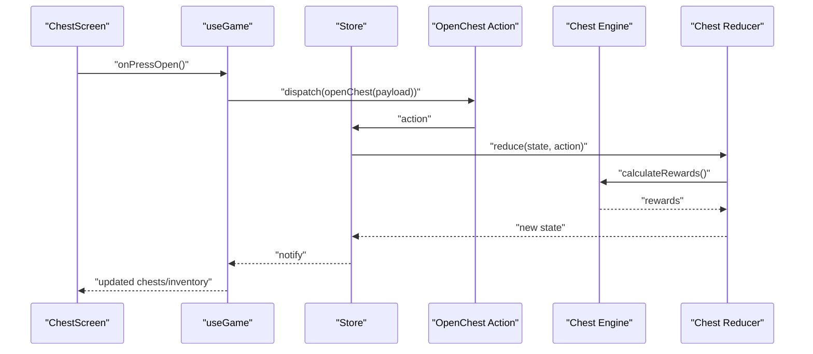
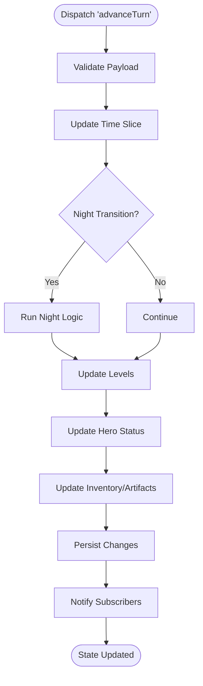
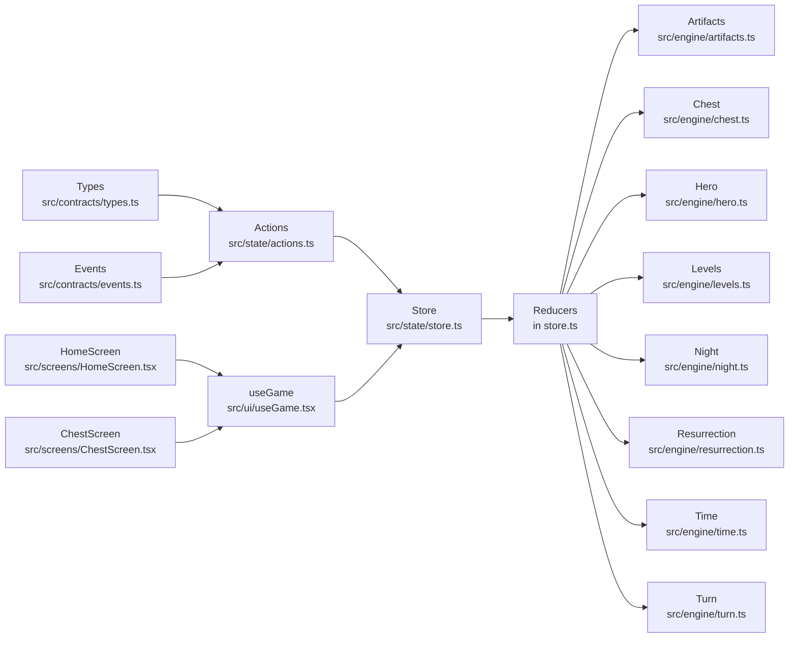

# State Management Architecture

<cite>
**Referenced Files in This Document**
- [store.ts](file://src/state/store.ts)
- [actions.ts](file://src/state/actions.ts)
- [types.ts](file://src/contracts/types.ts)
- [events.ts](file://src/contracts/events.ts)
- [useGame.tsx](file://src/ui/useGame.tsx)
- [HomeScreen.tsx](file://src/screens/HomeScreen.tsx)
- [ChestScreen.tsx](file://src/screens/ChestScreen.tsx)
- [artifacts.ts](file://src/engine/artifacts.ts)
- [chest.ts](file://src/engine/chest.ts)
- [hero.ts](file://src/engine/hero.ts)
- [levels.ts](file://src/engine/levels.ts)
- [night.ts](file://src/engine/night.ts)
- [resurrection.ts](file://src/engine/resurrection.ts)
- [time.ts](file://src/engine/time.ts)
- [turn.ts](file://src/engine/turn.ts)
</cite>

## Table of Contents

1. Introduction
2. Project Structure
3. Core Components
4. Architecture Overview
5. Detailed Component Analysis
6. Dependency Analysis
7. Performance Considerations
8. Troubleshooting Guide
9. Conclusion

## Introduction

This document explains the React Native application’s state management architecture with a focus on the centralized store pattern, action dispatching mechanism, and how game state is managed across screens and components. It details the relationship between actions, reducers, and state updates; shows how game events trigger state changes; and documents the type definitions and contracts that ensure data consistency throughout the application.

## Project Structure

The state management system is organized into focused modules:

- Centralized store and reducer orchestration live under src/state.
- Action creators are defined in a single module for clarity and discoverability.
- Type contracts and event payloads are centralized under src/contracts to enforce consistency.
- Game logic (engine) is separated from UI and state layers, keeping concerns clean and testable.
- UI hooks and screens subscribe to the store and dispatch actions in response to user interactions or engine events.

**Diagram sources**

- [store.ts](file://src/state/store.ts)
- [actions.ts](file://src/state/actions.ts)
- [types.ts](file://src/contracts/types.ts)
- [events.ts](file://src/contracts/events.ts)
- [useGame.tsx](file://src/ui/useGame.tsx)
- [HomeScreen.tsx](file://src/screens/HomeScreen.tsx)
- [ChestScreen.tsx](file://src/screens/ChestScreen.tsx)
- [artifacts.ts](file://src/engine/artifacts.ts)
- [chest.ts](file://src/engine/chest.ts)
- [hero.ts](file://src/engine/hero.ts)
- [levels.ts](file://src/engine/levels.ts)
- [night.ts](file://src/engine/night.ts)
- [resurrection.ts](file://src/engine/resurrection.ts)
- [time.ts](file://src/engine/time.ts)
- [turn.ts](file://src/engine/turn.ts)

**Section sources**

- [store.ts](file://src/state/store.ts)
- [actions.ts](file://src/state/actions.ts)
- [types.ts](file://src/contracts/types.ts)
- [events.ts](file://src/contracts/events.ts)
- [useGame.tsx](file://src/ui/useGame.tsx)
- [HomeScreen.tsx](file://src/screens/HomeScreen.tsx)
- [ChestScreen.tsx](file://src/screens/ChestScreen.tsx)
- [artifacts.ts](file://src/engine/artifacts.ts)
- [chest.ts](file://src/engine/chest.ts)
- [hero.ts](file://src/engine/hero.ts)
- [levels.ts](file://src/engine/levels.ts)
- [night.ts](file://src/engine/night.ts)
- [resurrection.ts](file://src/engine/resurrection.ts)
- [time.ts](file://src/engine/time.ts)
- [turn.ts](file://src/engine/turn.ts)

## Core Components

- Centralized Store: A single source of truth holds the entire game state. The store exposes methods to read state, subscribe to updates, and dispatch actions.
- Action Dispatching: All state mutations go through explicit actions. This ensures predictable transitions and makes debugging straightforward.
- Reducers: Pure functions receive the current state and an action, returning a new immutable state slice. Each domain (e.g., hero, chest, levels) typically has its own reducer.
- Contracts and Types: Shared types define the shape of state slices, action payloads, and event structures, preventing drift between engine, state, and UI layers.
- Engine Modules: Domain-specific logic lives in the engine layer. They compute outcomes based on inputs and return results that actions translate into state updates.

Key responsibilities:

- Store: initialization, subscription management, and dispatch pipeline.
- Actions: typed creators that encapsulate intent and payload validation.
- Reducers: deterministic state transitions keyed by action types.
- Contracts: strict interfaces for cross-layer communication.
- Engine: pure computations that do not mutate state directly.

**Section sources**

- [store.ts](file://src/state/store.ts)
- [actions.ts](file://src/state/actions.ts)
- [types.ts](file://src/contracts/types.ts)
- [events.ts](file://src/contracts/events.ts)

## Architecture Overview

The application follows a unidirectional data flow:

- UI components call action creators via the hook or store API.
- The store routes dispatched actions to corresponding reducers.
- Reducers compute the next state using engine functions when needed.
- Subscribers (hooks and screens) receive the updated state and re-render only what depends on changed slices.

**Diagram sources**

- [store.ts](file://src/state/store.ts)
- [actions.ts](file://src/state/actions.ts)
- [useGame.tsx](file://src/ui/useGame.tsx)
- [HomeScreen.tsx](file://src/screens/HomeScreen.tsx)
- [artifacts.ts](file://src/engine/artifacts.ts)
- [chest.ts](file://src/engine/chest.ts)
- [hero.ts](file://src/engine/hero.ts)
- [levels.ts](file://src/engine/levels.ts)
- [night.ts](file://src/engine/night.ts)
- [resurrection.ts](file://src/engine/resurrection.ts)
- [time.ts](file://src/engine/time.ts)
- [turn.ts](file://src/engine/turn.ts)

## Detailed Component Analysis

### Centralized Store

Responsibilities:

- Holds the global state tree composed of all domain slices.
- Provides subscribe/unsubscribe to notify listeners on state changes.
- Exposes a dispatch function that validates and routes actions to reducers.
- Ensures immutability by producing new state objects per update.

Typical operations:

- Initialize store with default state.
- Subscribe components/hooks to specific slices or the whole state.
- Dispatch actions with typed payloads.
- Provide selectors or memoized accessors to avoid unnecessary re-renders.

Best practices:

- Keep reducers pure and free of side effects.
- Normalize frequently accessed data to reduce duplication.
- Batch related updates where appropriate to minimize renders.

**Section sources**

- [store.ts](file://src/state/store.ts)

### Action Creators and Dispatching

Responsibilities:

- Encapsulate intent with strongly-typed payloads.
- Validate input shapes against contracts before dispatch.
- Coordinate multiple engine calls when necessary.
- Maintain a clear mapping between action types and reducer handlers.

Common patterns:

- One action creator per meaningful game operation (e.g., open chest, advance turn).
- Thunk-like helpers for async flows if needed, while keeping reducers synchronous.
- Event-driven wrappers that convert engine events into store actions.

**Section sources**

- [actions.ts](file://src/state/actions.ts)
- [types.ts](file://src/contracts/types.ts)
- [events.ts](file://src/contracts/events.ts)

### Reducers and State Updates

Responsibilities:

- Implement deterministic transitions for each action type.
- Merge partial updates into the state tree immutably.
- Delegate complex calculations to engine modules.
- Preserve referential stability for unchanged slices to optimize rendering.

Guidelines:

- Handle unknown actions gracefully by returning the current state.
- Keep reducer logic small and focused per domain.
- Avoid direct mutation; always return new objects/arrays.

**Section sources**

- [store.ts](file://src/state/store.ts)
- [actions.ts](file://src/state/actions.ts)
- [types.ts](file://src/contracts/types.ts)

### Contracts and Type Definitions

Responsibilities:

- Define shared interfaces for state slices, actions, and events.
- Enforce consistent payloads across engine, state, and UI layers.
- Serve as living documentation for expected data shapes.

Key areas:

- State schema describing root and domain slices.
- Action union types discriminated by type fields.
- Event payloads bridging engine outputs to store actions.

**Section sources**

- [types.ts](file://src/contracts/types.ts)
- [events.ts](file://src/contracts/events.ts)

### Engine Modules

Responsibilities:

- Contain pure game logic independent of UI and persistence.
- Compute outcomes given inputs (e.g., item drop chances, level progression).
- Emit structured results consumed by actions/reducers.

Examples:

- Artifact generation and inventory integration.
- Chest opening mechanics and reward distribution.
- Hero stats computation and status updates.
- Level progression and night cycle transitions.
- Resurrection rules and health restoration.
- Time and turn advancement logic.

**Section sources**

- [artifacts.ts](file://src/engine/artifacts.ts)
- [chest.ts](file://src/engine/chest.ts)
- [hero.ts](file://src/engine/hero.ts)
- [levels.ts](file://src/engine/levels.ts)
- [night.ts](file://src/engine/night.ts)
- [resurrection.ts](file://src/engine/resurrection.ts)
- [time.ts](file://src/engine/time.ts)
- [turn.ts](file://src/engine/turn.ts)

### UI Subscription and Usage

Responsibilities:

- Subscribe to relevant state slices via a custom hook.
- Dispatch actions in response to user interactions.
- Render efficiently by selecting only needed data.

Patterns:

- useGame hook provides state slices and dispatch helpers.
- Screens import actions and call them within event handlers.
- Selectors or derived values minimize re-renders.

Example flows:

- Opening a chest triggers an action, which computes rewards via engine and updates state.
- Advancing time or turns triggers cascading updates across domains.

**Section sources**

- [useGame.tsx](file://src/ui/useGame.tsx)
- [HomeScreen.tsx](file://src/screens/HomeScreen.tsx)
- [ChestScreen.tsx](file://src/screens/ChestScreen.tsx)
- [actions.ts](file://src/state/actions.ts)

#### Sequence: Chest Open Flow

**Diagram sources**

- [ChestScreen.tsx](file://src/screens/ChestScreen.tsx)
- [useGame.tsx](file://src/ui/useGame.tsx)
- [actions.ts](file://src/state/actions.ts)
- [chest.ts](file://src/engine/chest.ts)
- [store.ts](file://src/state/store.ts)

#### Flowchart: Turn Advance Logic

**Diagram sources**

- [actions.ts](file://src/state/actions.ts)
- [time.ts](file://src/engine/time.ts)
- [night.ts](file://src/engine/night.ts)
- [levels.ts](file://src/engine/levels.ts)
- [hero.ts](file://src/engine/hero.ts)
- [artifacts.ts](file://src/engine/artifacts.ts)
- [store.ts](file://src/state/store.ts)

## Dependency Analysis

The state layer depends on contracts and engine modules, while UI depends on the store and actions. Engine modules are decoupled from UI and state, promoting testability and reuse.

**Diagram sources**

- [types.ts](file://src/contracts/types.ts)
- [events.ts](file://src/contracts/events.ts)
- [actions.ts](file://src/state/actions.ts)
- [store.ts](file://src/state/store.ts)
- [useGame.tsx](file://src/ui/useGame.tsx)
- [HomeScreen.tsx](file://src/screens/HomeScreen.tsx)
- [ChestScreen.tsx](file://src/screens/ChestScreen.tsx)
- [artifacts.ts](file://src/engine/artifacts.ts)
- [chest.ts](file://src/engine/chest.ts)
- [hero.ts](file://src/engine/hero.ts)
- [levels.ts](file://src/engine/levels.ts)
- [night.ts](file://src/engine/night.ts)
- [resurrection.ts](file://src/engine/resurrection.ts)
- [time.ts](file://src/engine/time.ts)
- [turn.ts](file://src/engine/turn.ts)

**Section sources**

- [types.ts](file://src/contracts/types.ts)
- [events.ts](file://src/contracts/events.ts)
- [actions.ts](file://src/state/actions.ts)
- [store.ts](file://src/state/store.ts)
- [useGame.tsx](file://src/ui/useGame.tsx)
- [HomeScreen.tsx](file://src/screens/HomeScreen.tsx)
- [ChestScreen.tsx](file://src/screens/ChestScreen.tsx)
- [artifacts.ts](file://src/engine/artifacts.ts)
- [chest.ts](file://src/engine/chest.ts)
- [hero.ts](file://src/engine/hero.ts)
- [levels.ts](file://src/engine/levels.ts)
- [night.ts](file://src/engine/night.ts)
- [resurrection.ts](file://src/engine/resurrection.ts)
- [time.ts](file://src/engine/time.ts)
- [turn.ts](file://src/engine/turn.ts)

## Performance Considerations

- Prefer selective subscriptions: subscribe to minimal state slices to avoid unnecessary re-renders.
- Memoize derived data: compute expensive selections once and cache results.
- Batch related updates: group multiple state changes into a single dispatch when possible.
- Keep reducers fast: offload heavy computations to engine modules and return plain data.
- Avoid deep object cloning: use shallow merges and normalized structures where feasible.

[No sources needed since this section provides general guidance]

## Troubleshooting Guide

Common issues and resolutions:

- Unexpected re-renders: verify selectors and ensure you are subscribing to the smallest necessary state slice.
- Stale state: confirm actions are dispatched with correct payloads and that reducers return new references.
- Type mismatches: align payloads with contract types; add runtime checks if needed.
- Engine errors: isolate failures in engine modules and validate inputs before calling them from reducers.

Debugging tips:

- Log action types and payloads at dispatch time.
- Snapshot state before and after critical actions.
- Add assertions in reducers for invariant checks.

**Section sources**

- [store.ts](file://src/state/store.ts)
- [actions.ts](file://src/state/actions.ts)
- [types.ts](file://src/contracts/types.ts)
- [events.ts](file://src/contracts/events.ts)

## Conclusion

The application employs a robust centralized store pattern with explicit action dispatching and pure reducers, ensuring predictable state transitions. Engine modules encapsulate game logic, while contracts enforce strong typing across layers. UI components subscribe selectively to state updates, enabling efficient rendering and clear separation of concerns. This architecture supports scalability, maintainability, and testability across the game’s evolving features.

[No sources needed since this section summarizes without analyzing specific files]
