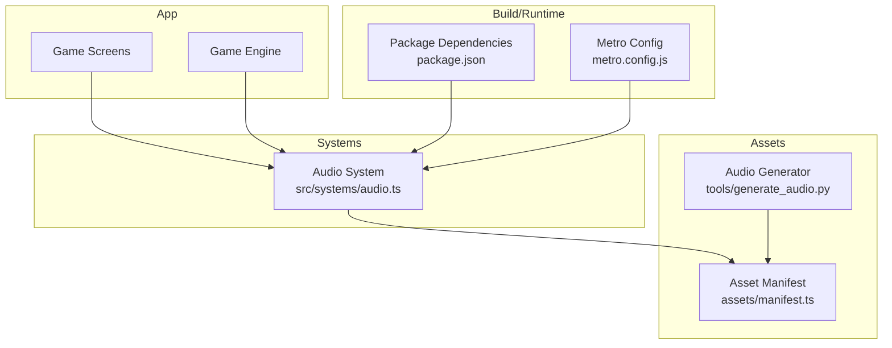
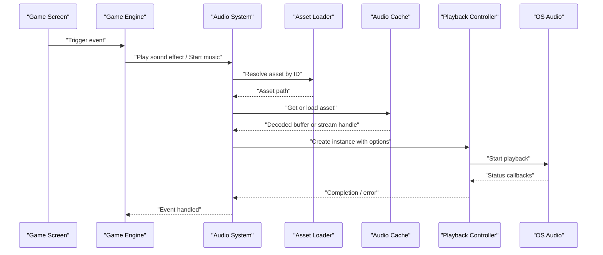
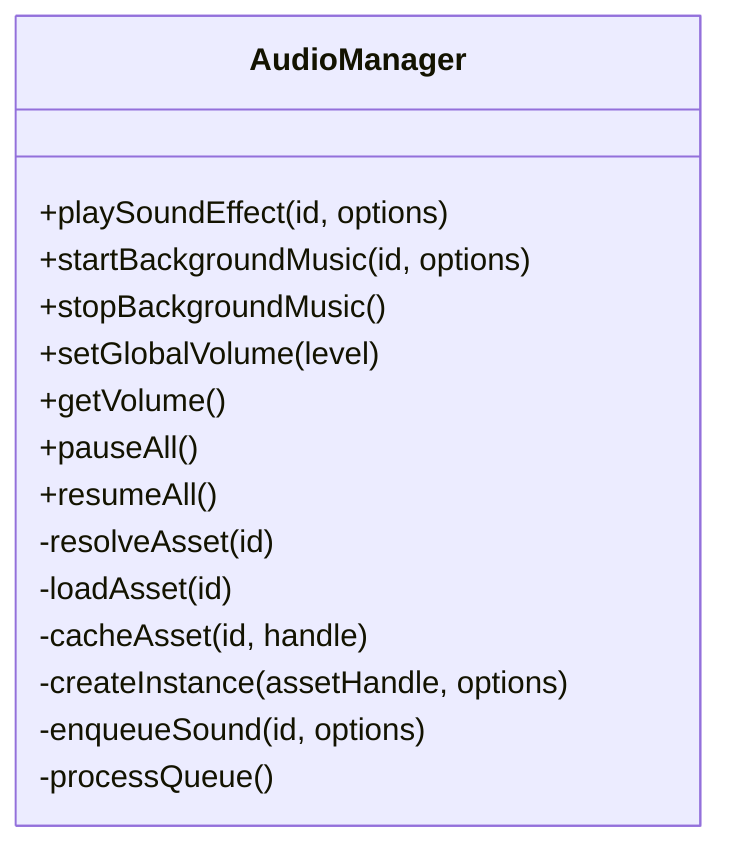
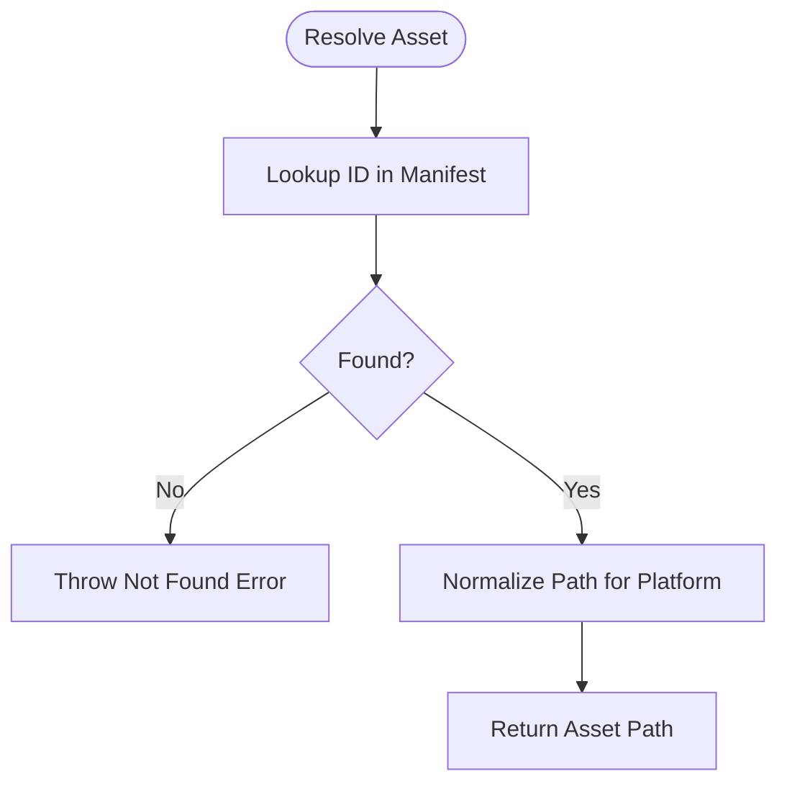
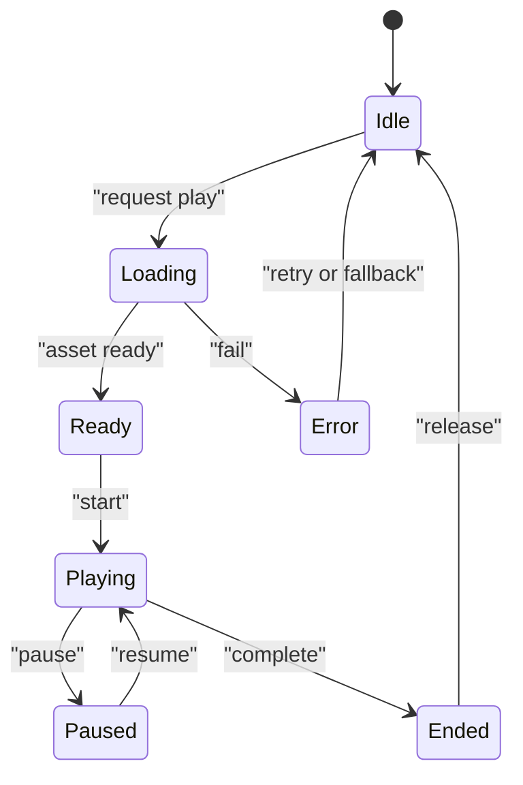
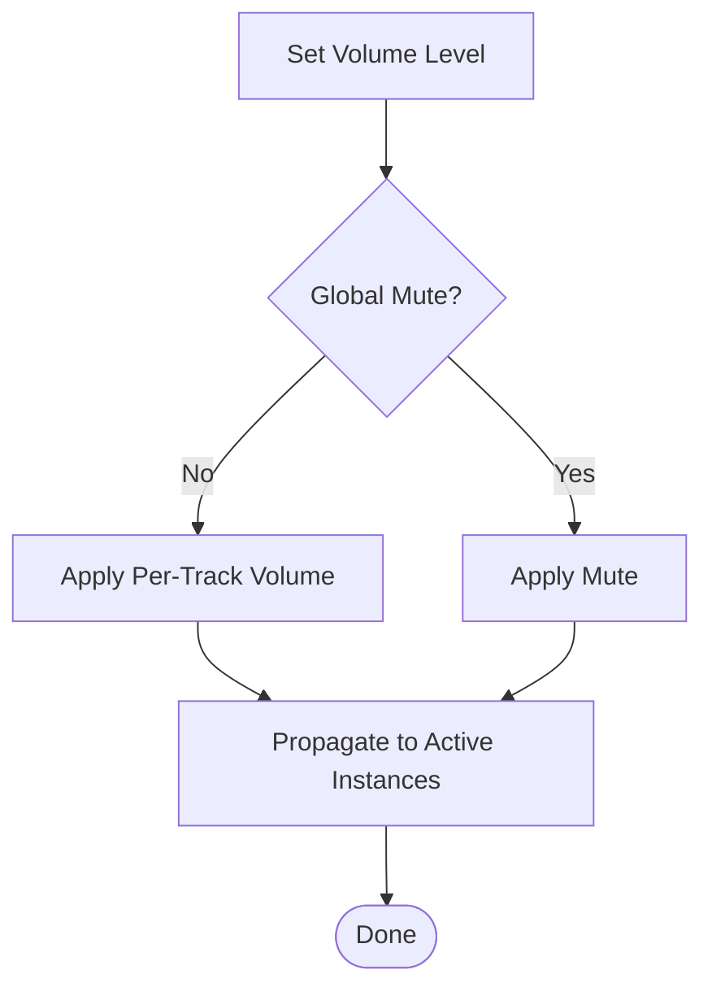
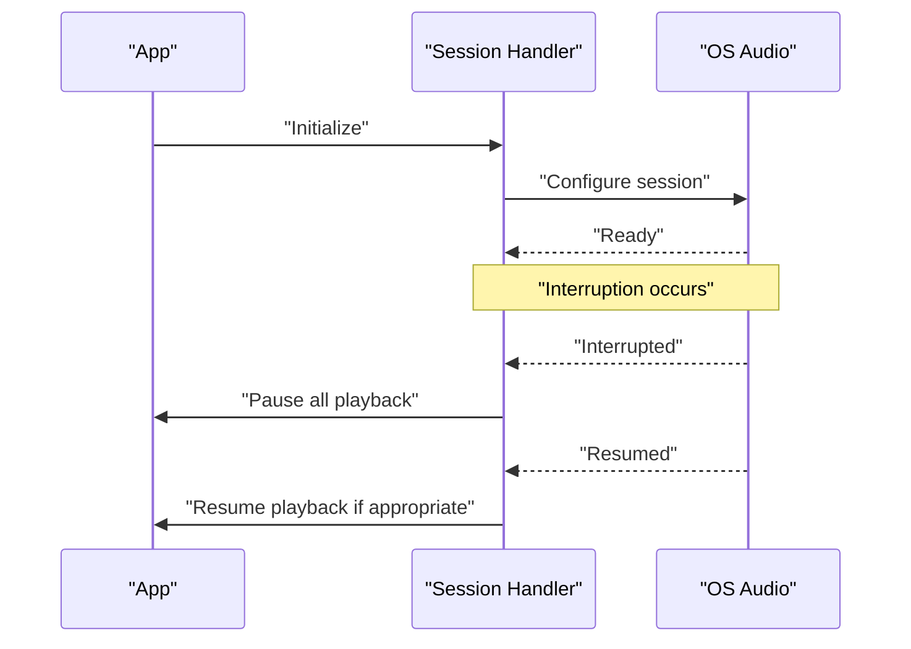
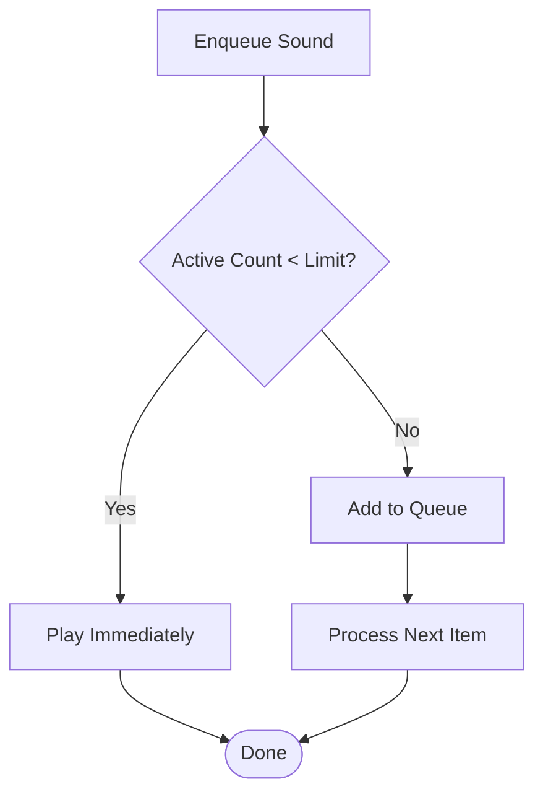
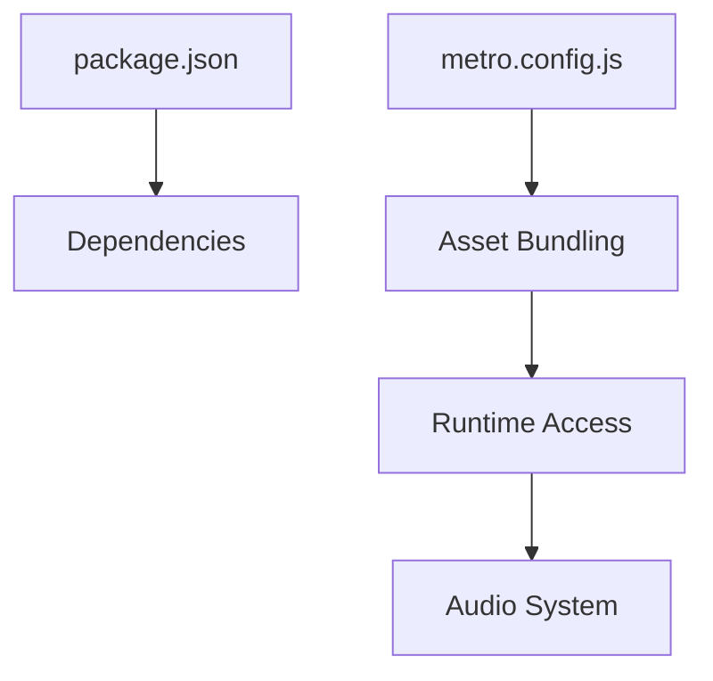

# Audio System

<cite>
**Referenced Files in This Document**
- [audio.ts](file://src/systems/audio.ts)
- [generate_audio.py](file://tools/generate_audio.py)
- [manifest.ts](file://assets/manifest.ts)
- [package.json](file://package.json)
- [metro.config.js](file://metro.config.js)
</cite>

## Table of Contents

1. [Introduction](#introduction)
2. [Project Structure](#project-structure)
3. [Core Components](#core-components)
4. [Architecture Overview](#architecture-overview)
5. [Detailed Component Analysis](#detailed-component-analysis)
6. [Dependency Analysis](#dependency-analysis)
7. [Performance Considerations](#performance-considerations)
8. [Troubleshooting Guide](#troubleshooting-guide)
9. [Conclusion](#conclusion)

## Introduction

This document explains the audio system implementation for managing sound effects, background music, and general audio playback. It covers how audio assets are loaded, cached, and played; how audio context is managed; volume controls; and platform-specific audio session handling. It also provides guidance on playing sound effects during game events, managing audio queues, handling interruptions, optimizing performance, managing memory for large audio files, and ensuring cross-platform compatibility.

## Project Structure

The audio-related code resides primarily under src/systems/audio.ts. Asset generation utilities live under tools/generate_audio.py. The asset manifest (assets/manifest.ts) centralizes references to bundled resources, including audio. Metro configuration (metro.config.js) and package dependencies (package.json) influence how audio assets are bundled and accessed at runtime.

**Diagram sources**

- [audio.ts](file://src/systems/audio.ts)
- [manifest.ts](file://assets/manifest.ts)
- [generate_audio.py](file://tools/generate_audio.py)
- [package.json](file://package.json)
- [metro.config.js](file://metro.config.js)

**Section sources**

- [audio.ts](file://src/systems/audio.ts)
- [manifest.ts](file://assets/manifest.ts)
- [generate_audio.py](file://tools/generate_audio.py)
- [package.json](file://package.json)
- [metro.config.js](file://metro.config.js)

## Core Components

- Audio Manager: Central API for loading, caching, and playing audio assets. Provides methods for sound effects and background music with volume control and queueing.
- Asset Loader: Resolves audio file paths via the asset manifest and handles platform-specific bundling differences.
- Playback Controller: Manages active instances, looping, and concurrent playback limits.
- Volume Mixer: Applies global and per-track volume settings.
- Session Handler: Manages audio sessions, interruptions, and platform-specific behaviors (e.g., iOS/Android).
- Queue Manager: Orders and schedules queued sounds to avoid conflicts and ensure smooth transitions.

[No sources needed since this section provides a conceptual overview]

## Architecture Overview

The audio system follows a layered architecture:

- Presentation layer (screens/engine) triggers audio events.
- Systems layer (audio manager) coordinates loading, caching, and playback.
- Asset layer (manifest) resolves resource identifiers to actual files.
- Build/runtime layer (dependencies, metro config) ensures assets are available at runtime.

**Diagram sources**

- [audio.ts](file://src/systems/audio.ts)
- [manifest.ts](file://assets/manifest.ts)

## Detailed Component Analysis

### Audio Manager

Responsibilities:

- Expose APIs for playing sound effects and background music.
- Manage volume levels globally and per track.
- Maintain an audio cache keyed by asset IDs.
- Provide queue management for overlapping sounds.
- Handle platform-specific audio session policies.

Key patterns:

- Singleton-like access to ensure consistent state across screens.
- Lazy loading of assets on first use.
- Reference counting for shared audio instances.

**Diagram sources**

- [audio.ts](file://src/systems/audio.ts)

**Section sources**

- [audio.ts](file://src/systems/audio.ts)

### Asset Loader

Responsibilities:

- Map logical asset IDs to concrete file paths.
- Normalize paths for different platforms (iOS, Android, web).
- Validate asset availability before playback.

Implementation notes:

- Uses the asset manifest to resolve IDs.
- Caches resolved paths to avoid repeated lookups.

**Diagram sources**

- [manifest.ts](file://assets/manifest.ts)
- [audio.ts](file://src/systems/audio.ts)

**Section sources**

- [manifest.ts](file://assets/manifest.ts)
- [audio.ts](file://src/systems/audio.ts)

### Playback Controller

Responsibilities:

- Create and manage audio instances.
- Support looping, fade-in/out, and concurrency limits.
- Emit lifecycle events (start, pause, resume, end, error).

Platform considerations:

- iOS: respects audio session categories and interruption handling.
- Android: manages focus and ducking behavior.
- Web: uses Web Audio API where applicable.

**Diagram sources**

- [audio.ts](file://src/systems/audio.ts)

**Section sources**

- [audio.ts](file://src/systems/audio.ts)

### Volume Mixer

Responsibilities:

- Apply global volume multiplier.
- Track per-track volumes for independent control.
- Update active instances when volume changes.

Behavior:

- Changes propagate to all active instances.
- Supports mute/unmute toggles.

**Diagram sources**

- [audio.ts](file://src/systems/audio.ts)

**Section sources**

- [audio.ts](file://src/systems/audio.ts)

### Session Handler

Responsibilities:

- Initialize audio session on app start.
- Handle interruptions (phone calls, notifications).
- Respect platform-specific audio policies.

Platform specifics:

- iOS: configure AVAudioSession category and interruption listeners.
- Android: manage audio focus and ducking.
- Web: handle user gesture requirements and autoplay policies.

**Diagram sources**

- [audio.ts](file://src/systems/audio.ts)

**Section sources**

- [audio.ts](file://src/systems/audio.ts)

### Queue Manager

Responsibilities:

- Enqueue sound effects to prevent overlap.
- Process queue based on priority and timing.
- Allow cancelation and replacement of queued items.

**Diagram sources**

- [audio.ts](file://src/systems/audio.ts)

**Section sources**

- [audio.ts](file://src/systems/audio.ts)

### Asset Generation

Purpose:

- Generate audio assets programmatically or batch-process existing files.
- Integrate with the asset manifest to register new entries.

Usage:

- Run the generator tool to produce optimized audio files.
- Update the manifest with generated asset IDs and paths.

**Section sources**

- [generate_audio.py](file://tools/generate_audio.py)
- [manifest.ts](file://assets/manifest.ts)

## Dependency Analysis

External dependencies and build-time configurations impact audio functionality:

- package.json lists runtime dependencies that may include audio libraries.
- metro.config.js defines how audio assets are bundled and resolved.

**Diagram sources**

- [package.json](file://package.json)
- [metro.config.js](file://metro.config.js)
- [audio.ts](file://src/systems/audio.ts)

**Section sources**

- [package.json](file://package.json)
- [metro.config.js](file://metro.config.js)

## Performance Considerations

- Prefer streaming for large audio files to reduce memory usage.
- Use compressed formats (e.g., AAC, Opus) where supported.
- Implement asset pooling to reuse decoded buffers.
- Limit concurrent playback instances to avoid CPU spikes.
- Preload frequently used assets during idle periods.
- Avoid blocking the main thread during asset loading; use async loaders.
- Monitor memory footprint and release unused assets promptly.

[No sources needed since this section provides general guidance]

## Troubleshooting Guide

Common issues and resolutions:

- No audio output: verify audio session initialization and permissions.
- Intermittent playback: check queue limits and concurrency settings.
- High memory usage: switch to streaming mode and reduce buffer sizes.
- Cross-platform inconsistencies: validate platform-specific session configurations.
- Asset not found: ensure asset IDs match manifest entries and paths are normalized.

**Section sources**

- [audio.ts](file://src/systems/audio.ts)

## Conclusion

The audio system provides a robust foundation for managing sound effects and background music across platforms. By leveraging asset manifests, caching strategies, and platform-aware session handling, it delivers consistent audio experiences while maintaining performance and memory efficiency. Proper use of queueing, volume controls, and interruption handling ensures reliable playback in diverse environments.

[No sources needed since this section summarizes without analyzing specific files]
