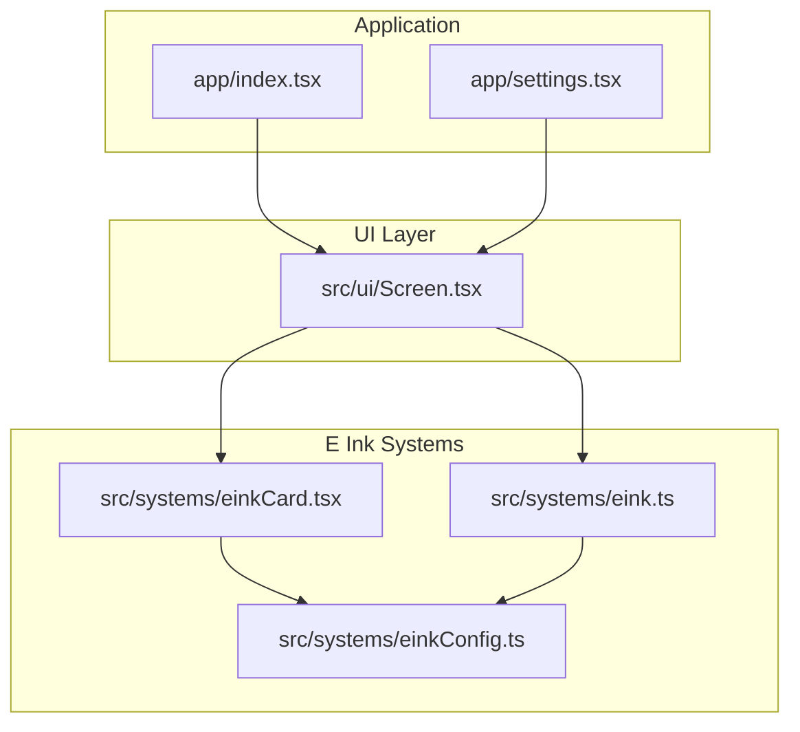
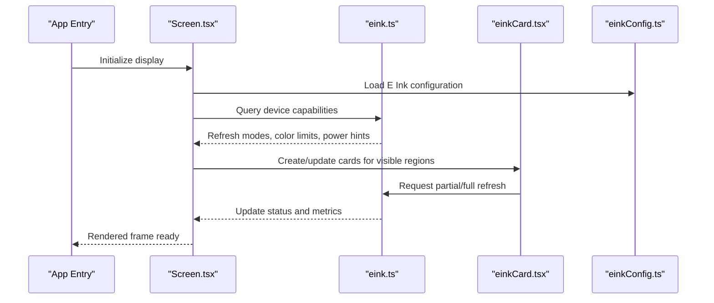
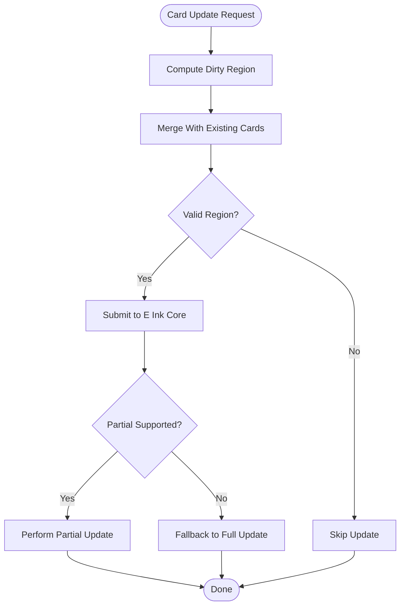

# E Ink Device Support

<cite>
**Referenced Files in This Document**
- [eink.ts](file://src/systems/eink.ts)
- [einkCard.tsx](file://src/systems/einkCard.tsx)
- [einkConfig.ts](file://src/systems/einkConfig.ts)
- [Screen.tsx](file://src/ui/Screen.tsx)
- [index.tsx](file://app/index.tsx)
- [settings.tsx](file://app/settings.tsx)
</cite>

## Table of Contents

1. [Introduction](#introduction)
2. [Project Structure](#project-structure)
3. [Core Components](#core-components)
4. [Architecture Overview](#architecture-overview)
5. [Detailed Component Analysis](#detailed-component-analysis)
6. [Dependency Analysis](#dependency-analysis)
7. [Performance Considerations](#performance-considerations)
8. [Troubleshooting Guide](#troubleshooting-guide)
9. [Conclusion](#conclusion)
10. [Appendices](#appendices)

## Introduction

This document explains how the application adapts to E Ink display characteristics, including refresh behavior, color limitations, and power consumption considerations. It documents the E Ink card rendering system, partial updates, and optimization techniques used to minimize ghosting and flicker while keeping battery usage low. It also provides configuration options for different E Ink devices, performance tuning parameters, testing strategies, and practical solutions for common E Ink-specific issues.

## Project Structure

E Ink support is implemented primarily under src/systems with supporting UI integration in src/ui and app entry points. The key modules are:

- eink.ts: Core E Ink runtime utilities and device capabilities detection
- einkCard.tsx: Card-based rendering optimized for E Ink partial updates
- einkConfig.ts: Configuration schema and defaults for E Ink devices
- Screen.tsx: Display surface abstraction that integrates E Ink optimizations
- app/index.tsx and app/settings.tsx: Application bootstrap and settings surfaces where E Ink behaviors can be toggled or tuned

**Diagram sources**

- [index.tsx](file://app/index.tsx)
- [settings.tsx](file://app/settings.tsx)
- [Screen.tsx](file://src/ui/Screen.tsx)
- [eink.ts](file://src/systems/eink.ts)
- [einkCard.tsx](file://src/systems/einkCard.tsx)
- [einkConfig.ts](file://src/systems/einkConfig.ts)

**Section sources**

- [eink.ts](file://src/systems/eink.ts)
- [einkCard.tsx](file://src/systems/einkCard.tsx)
- [einkConfig.ts](file://src/systems/einkConfig.ts)
- [Screen.tsx](file://src/ui/Screen.tsx)
- [index.tsx](file://app/index.tsx)
- [settings.tsx](file://app/settings.tsx)

## Core Components

- E Ink Core (eink.ts): Provides device capability detection, refresh mode selection, and helper functions for partial updates and full refreshes. It encapsulates platform-specific behaviors and exposes a stable API to the rest of the app.
- E Ink Card Renderer (einkCard.tsx): Implements a card-based rendering model tailored for E Ink displays. Cards represent discrete visual regions that can be updated independently, reducing unnecessary redraws and minimizing power usage.
- E Ink Configuration (einkConfig.ts): Defines configuration keys, default values, and validation rules for E Ink behavior across devices. Includes options for refresh strategy, dithering, color palette constraints, and update throttling.
- Screen Surface (Screen.tsx): Integrates E Ink optimizations into the main display pipeline. It coordinates frame scheduling, batching updates, and applying E Ink-specific effects like inversion or grayscale conversion when needed.

Key responsibilities:

- Detect E Ink hardware capabilities and select appropriate refresh modes
- Render content using cards to enable partial updates
- Apply color and contrast adjustments suitable for E Ink panels
- Throttle and batch updates to reduce power consumption and avoid ghosting

**Section sources**

- [eink.ts](file://src/systems/eink.ts)
- [einkCard.tsx](file://src/systems/einkCard.tsx)
- [einkConfig.ts](file://src/systems/einkConfig.ts)
- [Screen.tsx](file://src/ui/Screen.tsx)

## Architecture Overview

The E Ink subsystem integrates at the UI layer and core systems. The Screen component orchestrates rendering and delegates E Ink-specific logic to the E Ink Core and Card Renderer. Configuration drives behavior based on detected device capabilities.

**Diagram sources**

- [Screen.tsx](file://src/ui/Screen.tsx)
- [eink.ts](file://src/systems/eink.ts)
- [einkCard.tsx](file://src/systems/einkCard.tsx)
- [einkConfig.ts](file://src/systems/einkConfig.ts)

## Detailed Component Analysis

### E Ink Core (eink.ts)

Responsibilities:

- Detect E Ink panel type and capabilities (monochrome vs. color, supported refresh modes)
- Provide helpers for partial updates and full refreshes
- Expose power-aware APIs to throttle or defer updates
- Maintain state for current refresh mode and last update timestamps

Optimization patterns:

- Debounce rapid updates to avoid excessive refresh cycles
- Batch multiple card updates into a single refresh operation
- Select conservative refresh modes by default and escalate only when necessary

Error handling:

- Gracefully fallback to full refresh if partial updates fail
- Log warnings for unsupported operations on specific devices

Performance considerations:

- Minimize full refresh frequency to conserve battery
- Use region-based updates to limit pixel changes
- Avoid heavy computations during critical render paths

**Section sources**

- [eink.ts](file://src/systems/eink.ts)

### E Ink Card Renderer (einkCard.tsx)

Responsibilities:

- Manage discrete cards representing screen regions
- Compute minimal bounding boxes for updates
- Coordinate with E Ink Core to apply partial updates efficiently
- Handle card lifecycle (creation, update, disposal)

Rendering strategy:

- Each card owns its content and computes dirty regions
- Cards are merged before submission to reduce redundant updates
- Supports grayscale and limited color palettes typical of E Ink panels

Partial update flow:

**Diagram sources**

- [einkCard.tsx](file://src/systems/einkCard.tsx)
- [eink.ts](file://src/systems/eink.ts)

**Section sources**

- [einkCard.tsx](file://src/systems/einkCard.tsx)

### E Ink Configuration (einkConfig.ts)

Configuration categories:

- Refresh strategy: Default mode, escalation thresholds, cooldown periods
- Color handling: Palette constraints, dithering options, grayscale conversion
- Power management: Update throttling, background update limits, sleep behavior
- Device profiles: Overrides per device ID or panel type

Validation and defaults:

- Ensures safe defaults for unknown devices
- Validates ranges for timing parameters to prevent excessive refreshes
- Provides migration paths for deprecated keys

Usage:

- Loaded at startup and applied to E Ink Core and Card Renderer
- Can be adjusted via settings UI for user control

**Section sources**

- [einkConfig.ts](file://src/systems/einkConfig.ts)

### Screen Integration (Screen.tsx)

Integration points:

- Initializes E Ink subsystem and loads configuration
- Batches UI updates into card updates
- Applies E Ink-specific effects (inversion, contrast adjustment)
- Monitors refresh metrics and adjusts behavior dynamically

Frame scheduling:

- Defers non-critical updates until idle
- Prioritizes user interactions over background updates
- Uses requestAnimationFrame-like mechanisms adapted for E Ink latency

**Section sources**

- [Screen.tsx](file://src/ui/Screen.tsx)

## Dependency Analysis

The E Ink subsystem has clear boundaries and dependencies:

- Screen depends on E Ink Core and Card Renderer for display optimization
- Card Renderer depends on E Ink Core for refresh operations
- All components depend on E Ink Configuration for behavior tuning

**Diagram sources**

- [Screen.tsx](file://src/ui/Screen.tsx)
- [eink.ts](file://src/systems/eink.ts)
- [einkCard.tsx](file://src/systems/einkCard.tsx)
- [einkConfig.ts](file://src/systems/einkConfig.ts)

**Section sources**

- [Screen.tsx](file://src/ui/Screen.tsx)
- [eink.ts](file://src/systems/eink.ts)
- [einkCard.tsx](file://src/systems/einkCard.tsx)
- [einkConfig.ts](file://src/systems/einkConfig.ts)

## Performance Considerations

- Prefer partial updates over full refreshes to reduce power consumption and improve perceived responsiveness
- Batch multiple small updates into larger regions to minimize refresh overhead
- Avoid frequent high-frequency animations; use static frames or slow transitions
- Limit color usage to supported palettes to prevent costly conversions
- Monitor device temperature and adjust refresh aggressiveness accordingly
- Use lazy loading for off-screen content to reduce initial load time

[No sources needed since this section provides general guidance]

## Troubleshooting Guide

Common E Ink issues and solutions:

- Ghosting: Reduce update frequency, increase cooldown between partial updates, ensure proper full refresh intervals
- Flickering: Avoid rapid theme switches, stabilize color palettes, disable aggressive dithering
- Slow refresh rates: Lower resolution where possible, simplify graphics, use grayscale instead of color
- Battery drain: Disable background updates, reduce animation frequency, implement aggressive throttling
- Inconsistent behavior across devices: Use device profiles in configuration, test on target hardware, log refresh metrics

Diagnostic steps:

- Enable detailed logging in E Ink Core to track refresh operations
- Measure update frequency and duration to identify bottlenecks
- Test with minimal UI to isolate rendering issues
- Validate configuration against known device profiles

**Section sources**

- [eink.ts](file://src/systems/eink.ts)
- [einkConfig.ts](file://src/systems/einkConfig.ts)

## Conclusion

The E Ink subsystem provides a robust foundation for optimizing applications on E Ink displays through card-based rendering, intelligent refresh management, and configurable behavior profiles. By following the guidelines and utilizing the provided tools, developers can achieve smooth, power-efficient experiences tailored to the unique characteristics of E Ink technology.

[No sources needed since this section summarizes without analyzing specific files]

## Appendices

### Configuration Reference

Key configuration options for E Ink devices:

- refresh_strategy: Controls default refresh mode and escalation behavior
- color_palette: Defines supported colors and dithering settings
- power_management: Sets update throttling and sleep policies
- device_profiles: Contains overrides for specific hardware configurations

Testing strategies:

- Unit tests for E Ink Core functions
- Integration tests for card rendering pipeline
- Hardware validation on target E Ink devices
- Performance profiling to measure refresh efficiency

**Section sources**

- [einkConfig.ts](file://src/systems/einkConfig.ts)
