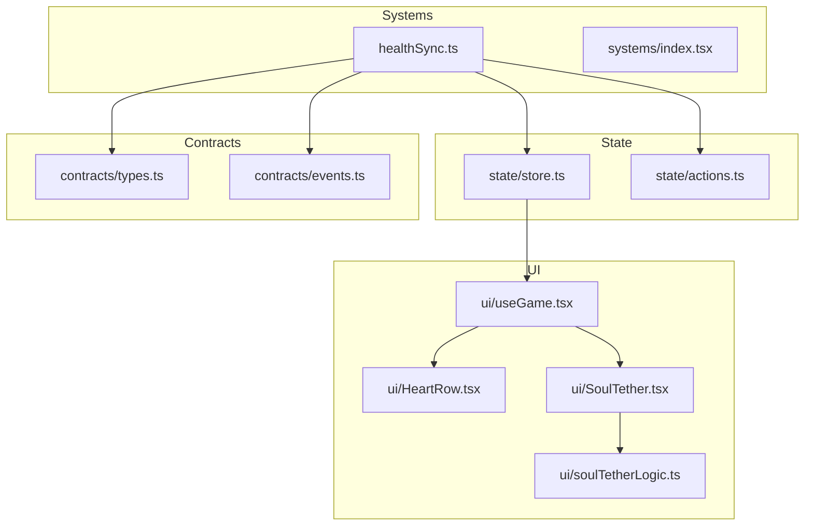
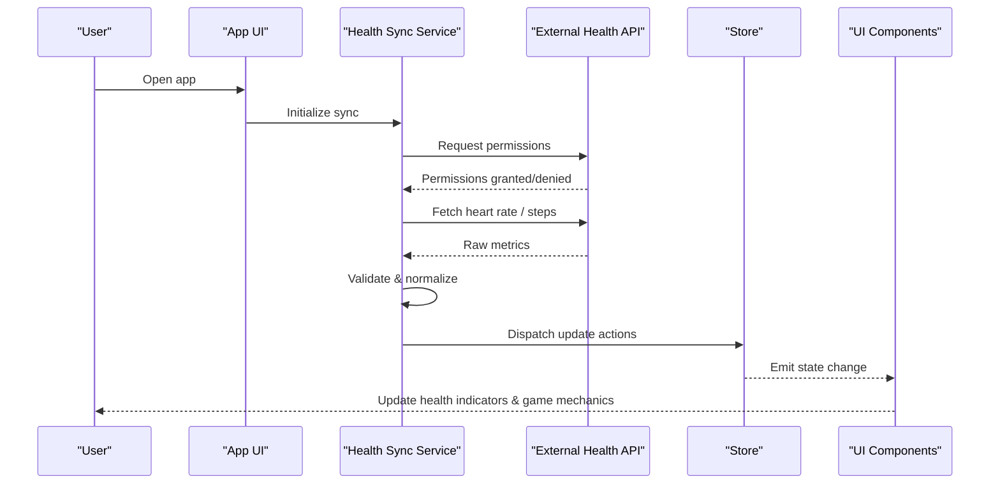
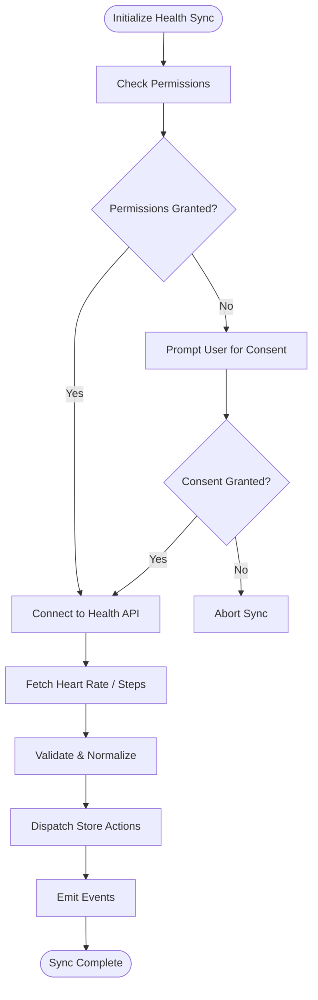
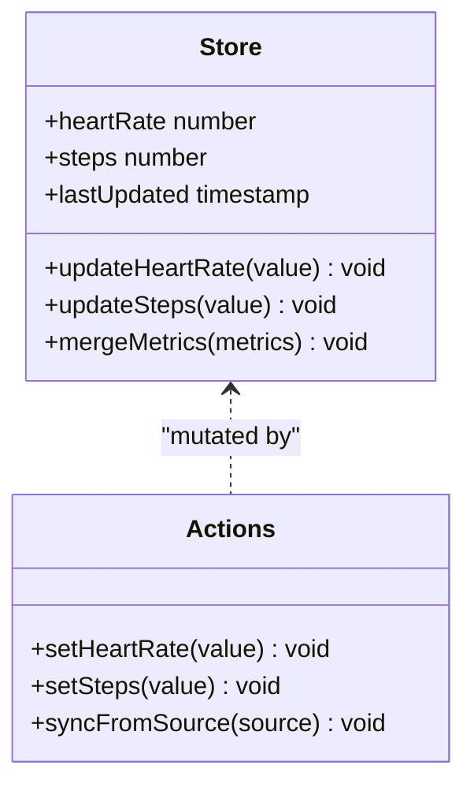
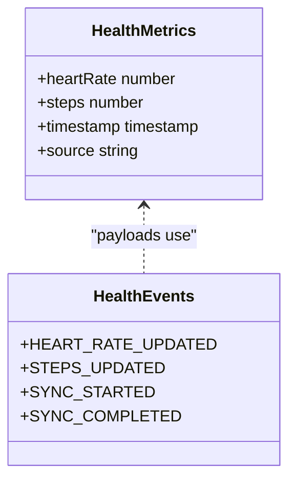
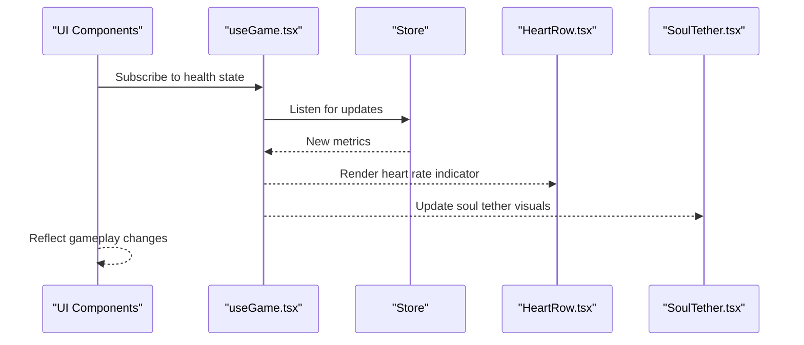
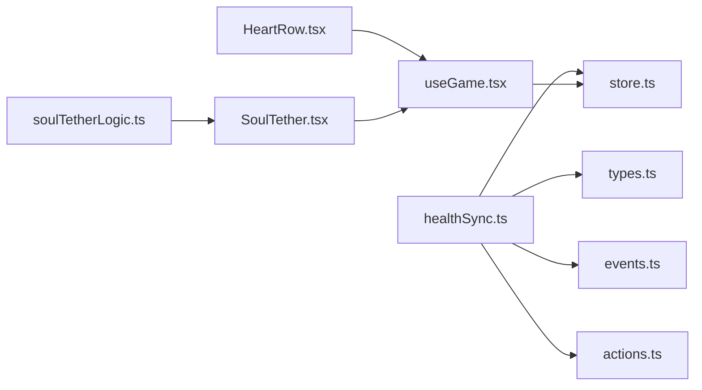

# Health Data Synchronization

<cite>
**Referenced Files in This Document**
- [healthSync.ts](file://src/systems/healthSync.ts)
- [index.tsx](file://src/systems/index.tsx)
- [store.ts](file://src/state/store.ts)
- [actions.ts](file://src/state/actions.ts)
- [types.ts](file://src/contracts/types.ts)
- [events.ts](file://src/contracts/events.ts)
- [useGame.tsx](file://src/ui/useGame.tsx)
- [HeartRow.tsx](file://src/ui/HeartRow.tsx)
- [SoulTether.tsx](file://src/ui/SoulTether.tsx)
- [soulTetherLogic.ts](file://src/ui/soulTetherLogic.ts)
</cite>

## Table of Contents

1. [Introduction](#introduction)
2. [Project Structure](#project-structure)
3. [Core Components](#core-components)
4. [Architecture Overview](#architecture-overview)
5. [Detailed Component Analysis](#detailed-component-analysis)
6. [Dependency Analysis](#dependency-analysis)
7. [Performance Considerations](#performance-considerations)
8. [Troubleshooting Guide](#troubleshooting-guide)
9. [Privacy and Security](#privacy-and-security)
10. [Conclusion](#conclusion)

## Introduction

This document explains the health data synchronization system that integrates with external health APIs and services to collect heart rate, step counts, and other health metrics. It details how these metrics are transformed and synchronized into the game state to influence gameplay mechanics such as stamina, progression, and character abilities. The guide covers API integrations, data transformation pipelines, conflict resolution strategies, permission handling, privacy considerations, and compliance measures for health data regulations.

## Project Structure

The health synchronization feature is implemented within the systems layer and integrates with the application state and UI components:

- Systems layer: Orchestrates health data collection, processing, and synchronization.
- State layer: Holds normalized health metrics and exposes actions to update game state.
- UI layer: Displays real-time health indicators and reacts to changes.

**Diagram sources**

- [healthSync.ts](file://src/systems/healthSync.ts)
- [index.tsx](file://src/systems/index.tsx)
- [store.ts](file://src/state/store.ts)
- [actions.ts](file://src/state/actions.ts)
- [types.ts](file://src/contracts/types.ts)
- [events.ts](file://src/contracts/events.ts)
- [useGame.tsx](file://src/ui/useGame.tsx)
- [HeartRow.tsx](file://src/ui/HeartRow.tsx)
- [SoulTether.tsx](file://src/ui/SoulTether.tsx)
- [soulTetherLogic.ts](file://src/ui/soulTetherLogic.ts)

**Section sources**

- [healthSync.ts](file://src/systems/healthSync.ts)
- [index.tsx](file://src/systems/index.tsx)
- [store.ts](file://src/state/store.ts)
- [actions.ts](file://src/state/actions.ts)
- [types.ts](file://src/contracts/types.ts)
- [events.ts](file://src/contracts/events.ts)
- [useGame.tsx](file://src/ui/useGame.tsx)
- [HeartRow.tsx](file://src/ui/HeartRow.tsx)
- [SoulTether.tsx](file://src/ui/SoulTether.tsx)
- [soulTetherLogic.ts](file://src/ui/soulTetherLogic.ts)

## Core Components

- Health Sync Service: Coordinates requests to external health APIs, handles permissions, normalizes incoming data, and dispatches updates to the store.
- Store and Actions: Maintain normalized health metrics (e.g., heart rate, steps), expose typed actions for updates, and ensure consistent state transitions.
- Contracts: Define shared types and events used across the system to ensure type safety and clear communication between modules.
- UI Integration: Consumes normalized health data to render live feedback and adjust game mechanics based on real-world activity.

Key responsibilities:

- Permission management for accessing health data.
- Polling or subscribing to health data streams.
- Data validation and normalization.
- Conflict resolution when multiple sources provide overlapping metrics.
- Dispatching state updates and emitting events for UI reactions.

**Section sources**

- [healthSync.ts](file://src/systems/healthSync.ts)
- [store.ts](file://src/state/store.ts)
- [actions.ts](file://src/state/actions.ts)
- [types.ts](file://src/contracts/types.ts)
- [events.ts](file://src/contracts/events.ts)

## Architecture Overview

The health synchronization pipeline follows a layered architecture:

- External Health APIs: Provide raw metrics like heart rate and step counts.
- Health Sync Service: Authenticates, requests permissions, fetches data, validates, and transforms it.
- State Layer: Normalizes and persists metrics; exposes actions for updates.
- UI Layer: Subscribes to state changes and renders health indicators and gameplay effects.

**Diagram sources**

- [healthSync.ts](file://src/systems/healthSync.ts)
- [store.ts](file://src/state/store.ts)
- [actions.ts](file://src/state/actions.ts)
- [types.ts](file://src/contracts/types.ts)
- [events.ts](file://src/contracts/events.ts)
- [useGame.tsx](file://src/ui/useGame.tsx)

## Detailed Component Analysis

### Health Sync Service

Responsibilities:

- Manage user consent and platform-specific permissions.
- Connect to external health APIs (e.g., device sensors, health platforms).
- Implement polling or subscription patterns for continuous data streams.
- Normalize raw metrics into a unified schema.
- Handle errors, retries, and backoff strategies.
- Emit events for downstream consumers.

**Diagram sources**

- [healthSync.ts](file://src/systems/healthSync.ts)
- [events.ts](file://src/contracts/events.ts)

**Section sources**

- [healthSync.ts](file://src/systems/healthSync.ts)
- [events.ts](file://src/contracts/events.ts)

### Store and Actions

Responsibilities:

- Hold normalized health metrics (heart rate, steps, timestamps).
- Expose typed actions to update metrics safely.
- Ensure idempotent updates and prevent race conditions.
- Persist metrics locally if required by the app’s design.

**Diagram sources**

- [store.ts](file://src/state/store.ts)
- [actions.ts](file://src/state/actions.ts)

**Section sources**

- [store.ts](file://src/state/store.ts)
- [actions.ts](file://src/state/actions.ts)

### Contracts (Types and Events)

Responsibilities:

- Define shared interfaces for health metrics and sync payloads.
- Enumerate event names and payloads for decoupled communication.
- Enforce type safety across systems, state, and UI layers.

**Diagram sources**

- [types.ts](file://src/contracts/types.ts)
- [events.ts](file://src/contracts/events.ts)

**Section sources**

- [types.ts](file://src/contracts/types.ts)
- [events.ts](file://src/contracts/events.ts)

### UI Integration

Responsibilities:

- Subscribe to store changes and render real-time health indicators.
- Adjust game mechanics based on updated metrics (e.g., stamina, movement speed).
- Provide visual feedback for permission states and sync status.

**Diagram sources**

- [useGame.tsx](file://src/ui/useGame.tsx)
- [HeartRow.tsx](file://src/ui/HeartRow.tsx)
- [SoulTether.tsx](file://src/ui/SoulTether.tsx)
- [soulTetherLogic.ts](file://src/ui/soulTetherLogic.ts)

**Section sources**

- [useGame.tsx](file://src/ui/useGame.tsx)
- [HeartRow.tsx](file://src/ui/HeartRow.tsx)
- [SoulTether.tsx](file://src/ui/SoulTether.tsx)
- [soulTetherLogic.ts](file://src/ui/soulTetherLogic.ts)

## Dependency Analysis

The health synchronization system exhibits clear separation of concerns:

- Health Sync depends on contracts (types, events) and interacts with the store via actions.
- UI components depend on the store through hooks and renderers.
- External APIs are abstracted behind the Health Sync service, minimizing coupling.

**Diagram sources**

- [healthSync.ts](file://src/systems/healthSync.ts)
- [types.ts](file://src/contracts/types.ts)
- [events.ts](file://src/contracts/events.ts)
- [store.ts](file://src/state/store.ts)
- [actions.ts](file://src/state/actions.ts)
- [useGame.tsx](file://src/ui/useGame.tsx)
- [HeartRow.tsx](file://src/ui/HeartRow.tsx)
- [SoulTether.tsx](file://src/ui/SoulTether.tsx)
- [soulTetherLogic.ts](file://src/ui/soulTetherLogic.ts)

**Section sources**

- [healthSync.ts](file://src/systems/healthSync.ts)
- [types.ts](file://src/contracts/types.ts)
- [events.ts](file://src/contracts/events.ts)
- [store.ts](file://src/state/store.ts)
- [actions.ts](file://src/state/actions.ts)
- [useGame.tsx](file://src/ui/useGame.tsx)
- [HeartRow.tsx](file://src/ui/HeartRow.tsx)
- [SoulTether.tsx](file://src/ui/SoulTether.tsx)
- [soulTetherLogic.ts](file://src/ui/soulTetherLogic.ts)

## Performance Considerations

- Debounce frequent updates to avoid excessive re-renders in the UI.
- Batch metric updates where possible to reduce store mutations.
- Use efficient polling intervals or subscribe to native streams for lower latency.
- Cache recent metrics locally to handle transient network issues gracefully.
- Avoid heavy computations on the main thread; offload transformations to workers if needed.

[No sources needed since this section provides general guidance]

## Troubleshooting Guide

Common issues and resolutions:

- Permission denied: Ensure explicit user consent flows are triggered before API calls.
- No data received: Verify connectivity, sensor availability, and platform-specific requirements.
- Stale metrics: Implement timestamp checks and prefer newer data sources.
- Conflicting sources: Apply deterministic merge rules (e.g., most recent timestamp wins).
- UI not updating: Confirm store subscriptions and event emissions are wired correctly.

**Section sources**

- [healthSync.ts](file://src/systems/healthSync.ts)
- [store.ts](file://src/state/store.ts)
- [actions.ts](file://src/state/actions.ts)
- [events.ts](file://src/contracts/events.ts)

## Privacy and Security

Privacy and security best practices:

- Obtain explicit user consent before accessing any health data.
- Minimize data collection to only what is necessary for gameplay features.
- Encrypt sensitive data at rest and in transit.
- Anonymize or aggregate data where feasible.
- Comply with applicable regulations (e.g., GDPR, HIPAA) and platform policies.
- Provide users with controls to view, export, and delete their health data.
- Log minimal diagnostic information without exposing personal identifiers.

[No sources needed since this section provides general guidance]

## Conclusion

The health data synchronization system integrates external health APIs to enrich gameplay with real-world activity metrics. By separating concerns across systems, state, contracts, and UI layers, the architecture ensures maintainability, performance, and compliance. Robust permission handling, data normalization, and conflict resolution strategies enable reliable synchronization while respecting user privacy and regulatory requirements.

[No sources needed since this section summarizes without analyzing specific files]
