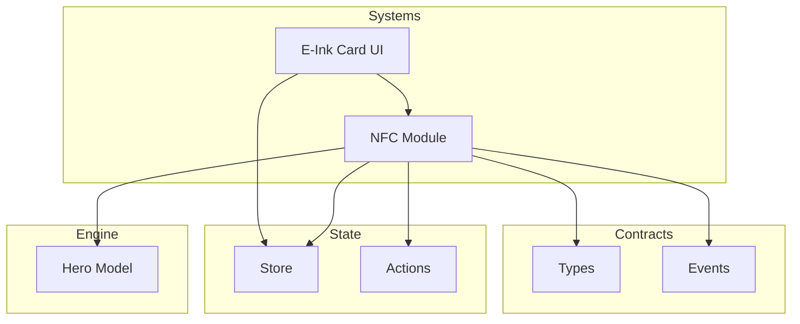
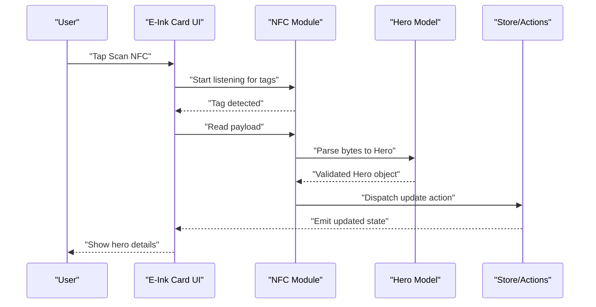
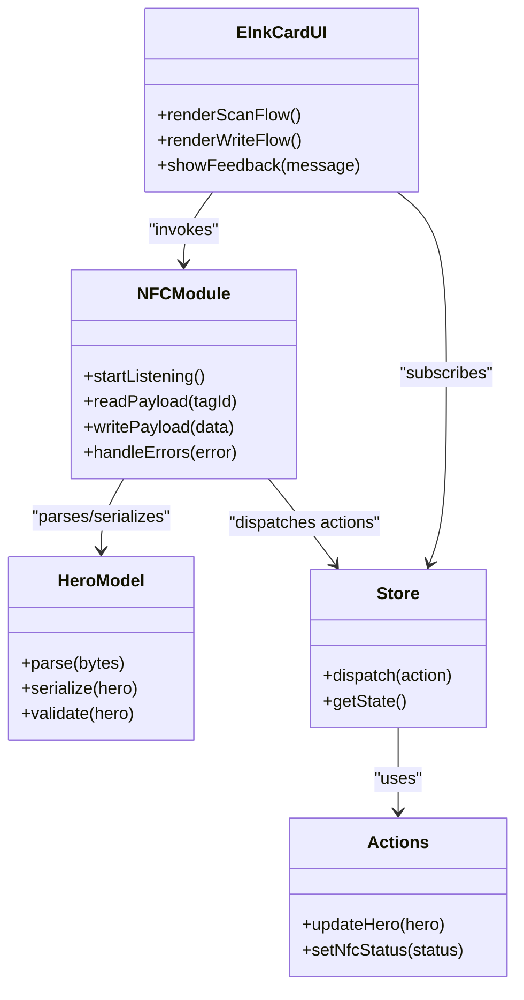
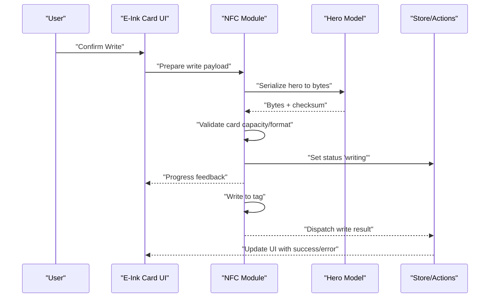
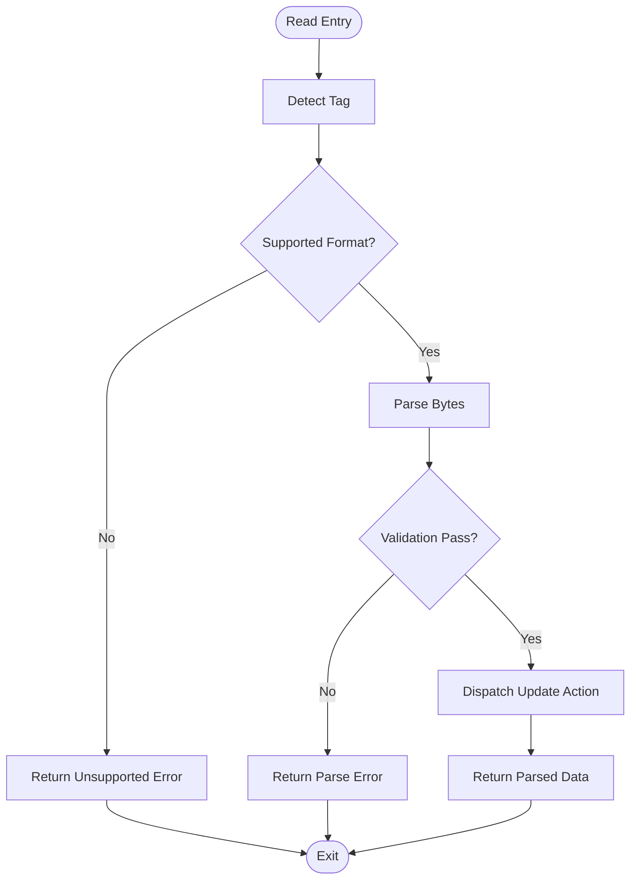
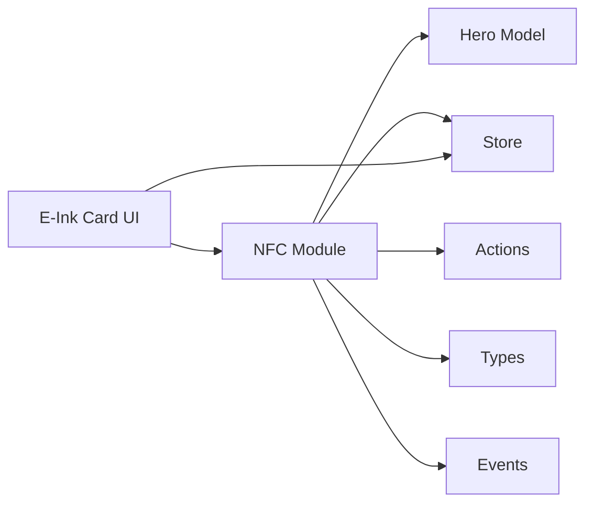

# NFC Card Integration

<cite>
**Referenced Files in This Document**
- [nfc.ts](file://src/systems/nfc.ts)
- [einkCard.tsx](file://src/systems/einkCard.tsx)
- [hero.ts](file://src/engine/hero.ts)
- [store.ts](file://src/state/store.ts)
- [actions.ts](file://src/state/actions.ts)
- [types.ts](file://src/contracts/types.ts)
- [events.ts](file://src/contracts/events.ts)
</cite>

## Table of Contents

1. [Introduction](#introduction)
2. [Project Structure](#project-structure)
3. [Core Components](#core-components)
4. [Architecture Overview](#architecture-overview)
5. [Detailed Component Analysis](#detailed-component-analysis)
6. [Dependency Analysis](#dependency-analysis)
7. [Performance Considerations](#performance-considerations)
8. [Troubleshooting Guide](#troubleshooting-guide)
9. [Conclusion](#conclusion)
10. [Appendices](#appendices)

## Introduction

This document explains the NFC card integration system used to read and write game data (such as hero profiles and game state) on NFC cards. It covers how card detection works, how raw card payloads are parsed into structured data, and how writes are performed safely. It also documents supported card formats, error handling strategies, platform-specific differences between iOS and Android, and security considerations. Examples illustrate reading hero data from NFC cards and writing game state back to cards, including failure scenarios.

## Project Structure

The NFC integration is implemented primarily within the systems layer and integrates with engine models and state management:

- NFC runtime logic and device interactions live in a dedicated module.
- UI components for NFC-related flows are provided separately.
- Game data models (like heroes) and state actions are used to serialize and deserialize data for NFC payloads.
- Contracts define shared types and events that bridge NFC operations with the rest of the app.

**Diagram sources**

- [nfc.ts](file://src/systems/nfc.ts)
- [einkCard.tsx](file://src/systems/einkCard.tsx)
- [hero.ts](file://src/engine/hero.ts)
- [store.ts](file://src/state/store.ts)
- [actions.ts](file://src/state/actions.ts)
- [types.ts](file://src/contracts/types.ts)
- [events.ts](file://src/contracts/events.ts)

**Section sources**

- [nfc.ts](file://src/systems/nfc.ts)
- [einkCard.tsx](file://src/systems/einkCard.tsx)
- [hero.ts](file://src/engine/hero.ts)
- [store.ts](file://src/state/store.ts)
- [actions.ts](file://src/state/actions.ts)
- [types.ts](file://src/contracts/types.ts)
- [events.ts](file://src/contracts/events.ts)

## Core Components

- NFC Module: Handles card detection, tag discovery, payload parsing, and write operations. It exposes functions to start listening for tags, parse incoming data, and persist changes via state actions.
- E-Ink Card UI: Provides user-facing flows for scanning and writing NFC cards, showing status, errors, and success feedback.
- Hero Model: Defines the structure of hero data serialized to/from NFC payloads.
- Store and Actions: Centralized state and reducers for applying NFC-driven updates (e.g., updating hero attributes after reading/writing).
- Contracts (Types and Events): Shared type definitions and event contracts used across modules to ensure consistent data shapes and signaling.

Key responsibilities:

- Detecting NFC tags and differentiating supported card types.
- Parsing raw bytes into typed structures with validation.
- Writing validated data back to cards with safety checks.
- Emitting events for UI updates and logging.
- Handling platform-specific permissions and capabilities.

**Section sources**

- [nfc.ts](file://src/systems/nfc.ts)
- [einkCard.tsx](file://src/systems/einkCard.tsx)
- [hero.ts](file://src/engine/hero.ts)
- [store.ts](file://src/state/store.ts)
- [actions.ts](file://src/state/actions.ts)
- [types.ts](file://src/contracts/types.ts)
- [events.ts](file://src/contracts/events.ts)

## Architecture Overview

The NFC flow connects device hardware through the NFC module to application state and UI. The sequence below shows a typical read operation from an NFC card containing hero data.

**Diagram sources**

- [nfc.ts](file://src/systems/nfc.ts)
- [einkCard.tsx](file://src/systems/einkCard.tsx)
- [hero.ts](file://src/engine/hero.ts)
- [store.ts](file://src/state/store.ts)
- [actions.ts](file://src/state/actions.ts)

## Detailed Component Analysis

### NFC Module

Responsibilities:

- Tag discovery and lifecycle management.
- Reading raw bytes and mapping them to typed structures.
- Writing validated structures back to cards.
- Error handling and retry/backoff strategies.
- Platform capability checks and permission prompts.

Typical operations:

- Start listener for NFC tags.
- On tag detected, determine card type and version.
- Parse payload using schema validation.
- Dispatch state actions to reflect changes.
- Write operations include checksum or integrity checks where applicable.

Error handling:

- Distinguish between no tag found, unsupported format, parse errors, and write failures.
- Provide actionable messages to the UI and log diagnostic details.

Platform differences:

- Android: Full access to NDEF records and background tag dispatch; requires specific permissions.
- iOS: Restricted NFC API surface; may require foreground-only scanning and limited record types.

**Section sources**

- [nfc.ts](file://src/systems/nfc.ts)

### E-Ink Card UI

Responsibilities:

- Present scan/write flows and status indicators.
- Handle user interactions (start scan, confirm write).
- Display errors and success states.
- Coordinate with store to reflect real-time updates.

User flows:

- Read mode: Show instructions, listen for tags, display parsed hero data.
- Write mode: Validate input, prepare payload, perform write, show confirmation or error.

**Section sources**

- [einkCard.tsx](file://src/systems/einkCard.tsx)

### Hero Model

Responsibilities:

- Define the shape of hero data stored on NFC cards.
- Provide serialization/deserialization helpers for NFC payloads.
- Validate fields and enforce constraints during parsing.

Data aspects:

- Immutable updates when applying changes from NFC reads/writes.
- Consistent field naming and types across platforms.

**Section sources**

- [hero.ts](file://src/engine/hero.ts)

### Store and Actions

Responsibilities:

- Manage global state for hero data and NFC session status.
- Apply actions triggered by NFC reads/writes.
- Ensure consistency and undo/redo if applicable.

Integration points:

- Actions dispatched by NFC module upon successful parse/write.
- UI subscribes to store updates to refresh screens.

**Section sources**

- [store.ts](file://src/state/store.ts)
- [actions.ts](file://src/state/actions.ts)

### Contracts (Types and Events)

Responsibilities:

- Define shared types for NFC payloads, card formats, and events.
- Ensure consistent interfaces between NFC module, UI, and engine.

Examples:

- Type definitions for hero profile fields.
- Event names and payloads emitted during NFC operations.

**Section sources**

- [types.ts](file://src/contracts/types.ts)
- [events.ts](file://src/contracts/events.ts)

#### Class Diagram: NFC Data Flow

**Diagram sources**

- [nfc.ts](file://src/systems/nfc.ts)
- [hero.ts](file://src/engine/hero.ts)
- [store.ts](file://src/state/store.ts)
- [actions.ts](file://src/state/actions.ts)
- [einkCard.tsx](file://src/systems/einkCard.tsx)

#### Sequence Diagram: Write Game State to NFC Card

**Diagram sources**

- [nfc.ts](file://src/systems/nfc.ts)
- [hero.ts](file://src/engine/hero.ts)
- [store.ts](file://src/state/store.ts)
- [actions.ts](file://src/state/actions.ts)
- [einkCard.tsx](file://src/systems/einkCard.tsx)

#### Flowchart: NFC Read Validation

**Diagram sources**

- [nfc.ts](file://src/systems/nfc.ts)
- [hero.ts](file://src/engine/hero.ts)
- [types.ts](file://src/contracts/types.ts)

## Dependency Analysis

The NFC module depends on engine models for data shaping, state management for persistence, and contracts for consistent interfaces. The UI layer depends on both NFC and store to render flows and feedback.

**Diagram sources**

- [nfc.ts](file://src/systems/nfc.ts)
- [hero.ts](file://src/engine/hero.ts)
- [store.ts](file://src/state/store.ts)
- [actions.ts](file://src/state/actions.ts)
- [types.ts](file://src/contracts/types.ts)
- [events.ts](file://src/contracts/events.ts)
- [einkCard.tsx](file://src/systems/einkCard.tsx)

**Section sources**

- [nfc.ts](file://src/systems/nfc.ts)
- [hero.ts](file://src/engine/hero.ts)
- [store.ts](file://src/state/store.ts)
- [actions.ts](file://src/state/actions.ts)
- [types.ts](file://src/contracts/types.ts)
- [events.ts](file://src/contracts/events.ts)
- [einkCard.tsx](file://src/systems/einkCard.tsx)

## Performance Considerations

- Minimize repeated scans by debouncing tag detection and caching recent results.
- Batch state updates to avoid excessive re-renders in the UI.
- Use efficient serialization formats and validate early to fail fast on invalid payloads.
- Avoid blocking the main thread during I/O; offload heavy parsing to workers if needed.
- Respect platform limits on NFC operations to prevent throttling or timeouts.

[No sources needed since this section provides general guidance]

## Troubleshooting Guide

Common issues and resolutions:

- No tag detected:
  - Ensure device supports NFC and permissions are granted.
  - Verify the card is within range and properly oriented.
- Unsupported format:
  - Confirm the card uses the expected schema and version.
  - Check for legacy or incompatible card types.
- Parse errors:
  - Inspect byte alignment, field lengths, and checksums.
  - Validate against the latest contract types.
- Write failures:
  - Check available space and write protection settings.
  - Retry with backoff and report detailed diagnostics.

Platform-specific notes:

- Android:
  - Requires NFC permission and appropriate intent filters.
  - Background tag dispatch may be restricted depending on OS version.
- iOS:
  - Foreground-only scanning; ensure proper activation and session management.
  - Limited NDEF record types; verify compatibility.

Security considerations:

- Validate all incoming payloads strictly before use.
- Implement integrity checks (checksums or signatures) for critical data.
- Avoid storing sensitive information unless encrypted and access-controlled.
- Prompt users explicitly for NFC permissions and explain usage.

**Section sources**

- [nfc.ts](file://src/systems/nfc.ts)
- [types.ts](file://src/contracts/types.ts)
- [events.ts](file://src/contracts/events.ts)

## Conclusion

The NFC integration provides a robust pathway to read and write game data on physical cards. By separating concerns across NFC runtime, UI, engine models, and state management, the system remains maintainable and extensible. Careful validation, clear error handling, and platform-aware implementation ensure reliable experiences across iOS and Android. Following the guidelines here will help developers extend support for new card formats and enhance security and performance.

[No sources needed since this section summarizes without analyzing specific files]

## Appendices

### NFC Card Format Specifications

- Payload structure:
  - Header: version, card type, length.
  - Body: hero fields and metadata.
  - Footer: checksum or signature.
- Supported card types:
  - Standard NDEF-compatible cards.
  - Custom binary layouts defined by the contract types.
- Versioning:
  - Backward compatibility handled via version negotiation.
  - Migration routines applied when upgrading schemas.

**Section sources**

- [types.ts](file://src/contracts/types.ts)
- [hero.ts](file://src/engine/hero.ts)

### Example Workflows

- Reading hero data from NFC:
  - Start scan, detect tag, parse bytes to hero model, dispatch update, render details.
- Writing game state to NFC:
  - Serialize current state, validate card capacity, write payload, confirm success.
- Handling connection failures:
  - Detect timeout or I/O errors, prompt retry, show diagnostic info.

**Section sources**

- [nfc.ts](file://src/systems/nfc.ts)
- [einkCard.tsx](file://src/systems/einkCard.tsx)
- [store.ts](file://src/state/store.ts)
- [actions.ts](file://src/state/actions.ts)
