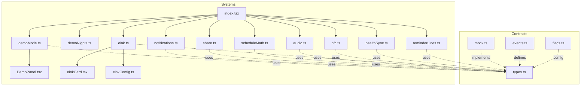
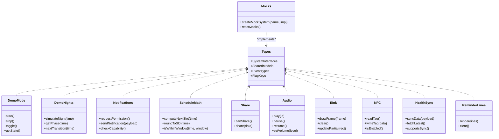
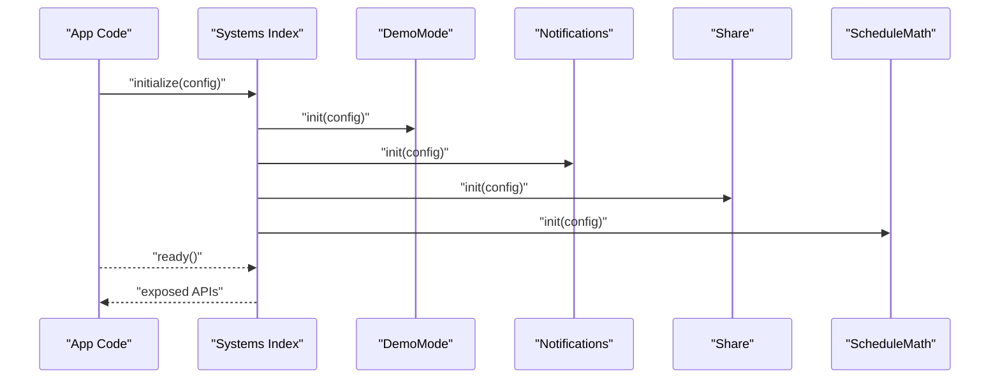
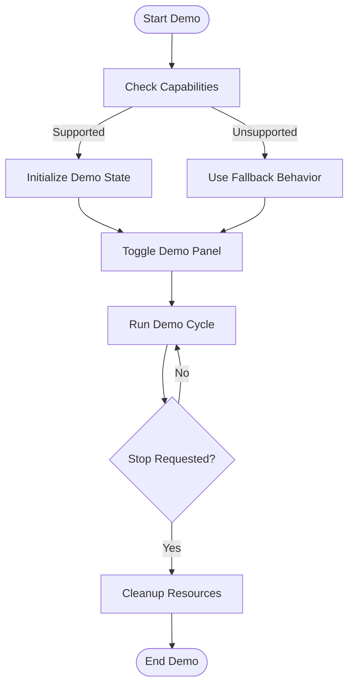
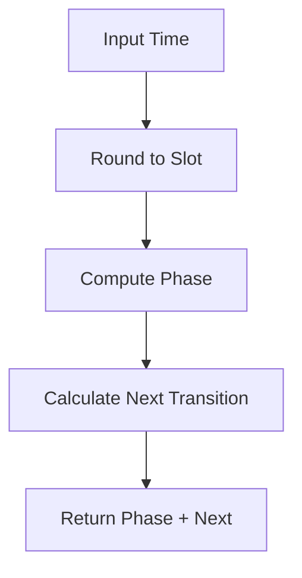
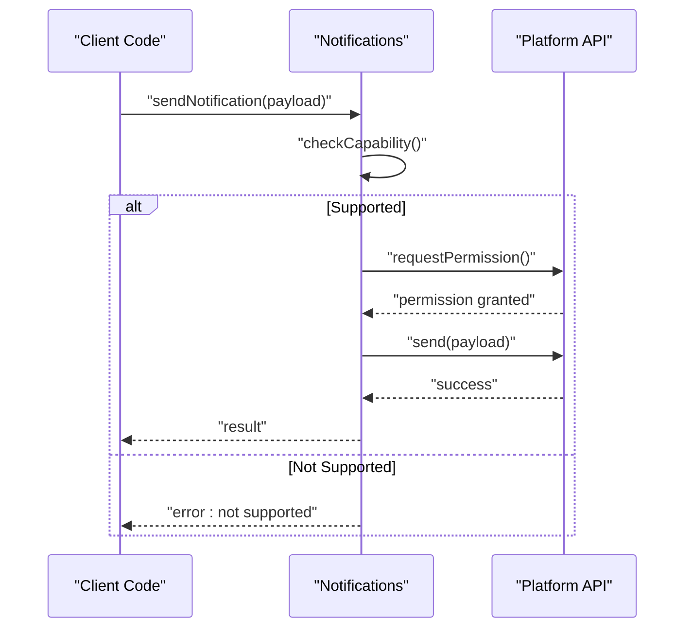
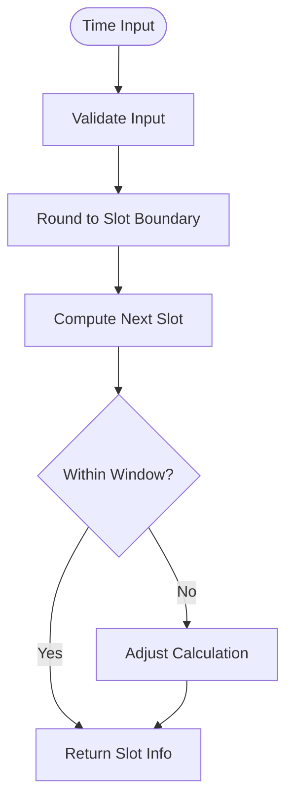
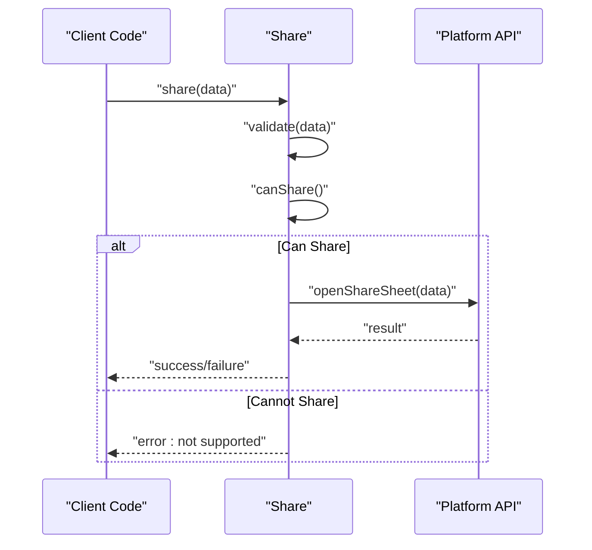
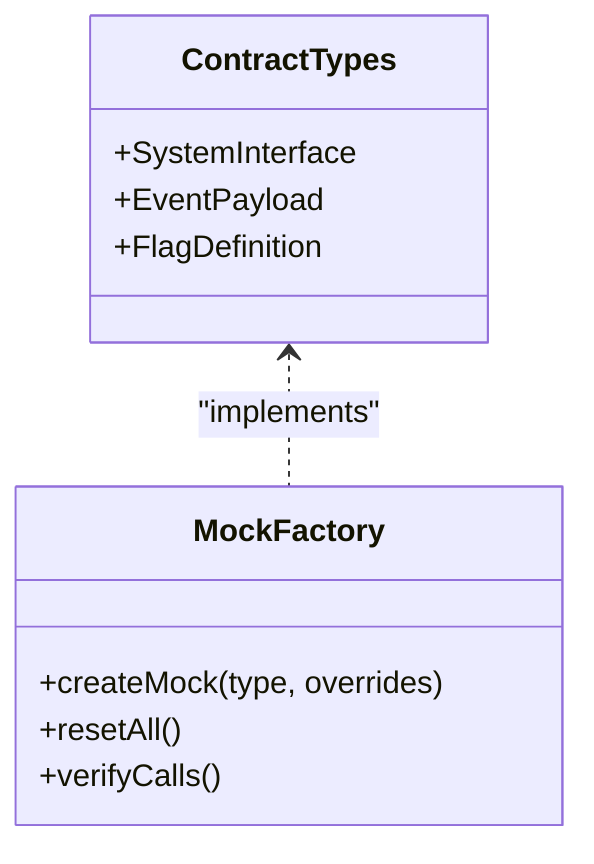
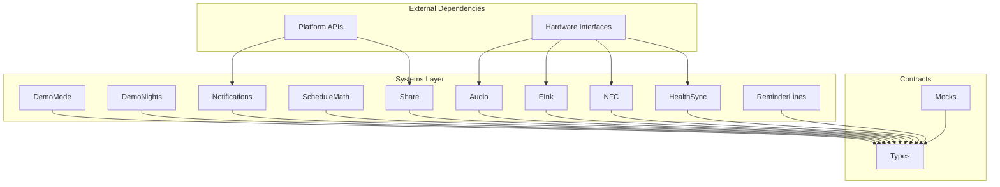

# System Abstraction Layer

<cite>
**Referenced Files in This Document**
- [src/systems/index.tsx](file://src/systems/index.tsx)
- [src/systems/demoMode.ts](file://src/systems/demoMode.ts)
- [src/systems/demoNights.ts](file://src/systems/demoNights.ts)
- [src/systems/notifications.ts](file://src/systems/notifications.ts)
- [src/systems/scheduleMath.ts](file://src/systems/scheduleMath.ts)
- [src/systems/share.ts](file://src/systems/share.ts)
- [src/systems/audio.ts](file://src/systems/audio.ts)
- [src/systems/eink.ts](file://src/systems/eink.ts)
- [src/systems/nfc.ts](file://src/systems/nfc.ts)
- [src/systems/healthSync.ts](file://src/systems/healthSync.ts)
- [src/systems/reminderLines.ts](file://src/systems/reminderLines.ts)
- [src/systems/DemoPanel.tsx](file://src/systems/DemoPanel.tsx)
- [src/systems/einkCard.tsx](file://src/systems/einkCard.tsx)
- [src/systems/einkConfig.ts](file://src/systems/einkConfig.ts)
- [src/contracts/mock.ts](file://src/contracts/mock.ts)
- [src/contracts/types.ts](file://src/contracts/types.ts)
- [src/contracts/events.ts](file://src/contracts/events.ts)
- [src/contracts/flags.ts](file://src/contracts/flags.ts)
- [src/systems/__tests__/demoNights.test.ts](file://src/systems/__tests__/demoNights.test.ts)
- [src/systems/__tests__/parseDeviceId.test.ts](file://src/systems/__tests__/parseDeviceId.test.ts)
- [src/systems/__tests__/scheduleMath.test.ts](file://src/systems/__tests__/scheduleMath.test.ts)
</cite>

## Table of Contents

1. [Introduction](#introduction)
2. [Project Structure](#project-structure)
3. [Core Components](#core-components)
4. [Architecture Overview](#architecture-overview)
5. [Detailed Component Analysis](#detailed-component-analysis)
6. [Dependency Analysis](#dependency-analysis)
7. [Performance Considerations](#performance-considerations)
8. [Troubleshooting Guide](#troubleshooting-guide)
9. [Conclusion](#conclusion)
10. [Appendices](#appendices)

## Introduction

This document explains the system abstraction layer that provides consistent interfaces for hardware and platform-specific functionality. It focuses on architectural patterns used to abstract device capabilities, create mock implementations for testing, and handle platform differences across devices. The documentation covers the demo mode system, notification handling, scheduling utilities, and sharing functionality. It also includes guidance for adding new system integrations, implementing test mocks, and performing feature detection across different devices. Dependency injection patterns, error handling strategies, and performance monitoring approaches are addressed throughout.

## Project Structure

The system abstraction layer is primarily implemented under src/systems, with contracts and mocks defined under src/contracts. Key responsibilities include:

- Centralized system entry point and exports
- Demo mode orchestration and UI panel
- Night simulation logic for demos
- Notifications API abstraction
- Scheduling math utilities
- Sharing API abstraction
- Platform-specific integrations (audio, e-ink, NFC, health sync, reminder lines)
- Contracts and mock implementations for testing

**Diagram sources**

- [src/systems/index.tsx](file://src/systems/index.tsx)
- [src/systems/demoMode.ts](file://src/systems/demoMode.ts)
- [src/systems/demoNights.ts](file://src/systems/demoNights.ts)
- [src/systems/notifications.ts](file://src/systems/notifications.ts)
- [src/systems/scheduleMath.ts](file://src/systems/scheduleMath.ts)
- [src/systems/share.ts](file://src/systems/share.ts)
- [src/systems/audio.ts](file://src/systems/audio.ts)
- [src/systems/eink.ts](file://src/systems/eink.ts)
- [src/systems/nfc.ts](file://src/systems/nfc.ts)
- [src/systems/healthSync.ts](file://src/systems/healthSync.ts)
- [src/systems/reminderLines.ts](file://src/systems/reminderLines.ts)
- [src/systems/DemoPanel.tsx](file://src/systems/DemoPanel.tsx)
- [src/systems/einkCard.tsx](file://src/systems/einkCard.tsx)
- [src/systems/einkConfig.ts](file://src/systems/einkConfig.ts)
- [src/contracts/mock.ts](file://src/contracts/mock.ts)
- [src/contracts/types.ts](file://src/contracts/types.ts)
- [src/contracts/events.ts](file://src/contracts/events.ts)
- [src/contracts/flags.ts](file://src/contracts/flags.ts)

**Section sources**

- [src/systems/index.tsx](file://src/systems/index.tsx)
- [src/contracts/types.ts](file://src/contracts/types.ts)

## Core Components

- Systems index: centralizes exports and dependency wiring for all subsystems.
- Demo mode: orchestrates demo behavior and exposes a UI panel for interactive control.
- Demo nights: simulates night cycles for demo scenarios.
- Notifications: abstracts platform notification APIs behind a consistent interface.
- Schedule math: provides deterministic scheduling calculations for time-based features.
- Share: abstracts platform sharing mechanisms.
- Integrations: audio, e-ink display, NFC, health sync, and reminder lines each implement a focused capability.
- Contracts and mocks: define shared types, events, flags, and mock implementations for tests.

Key responsibilities and interactions:

- Each subsystem exposes a stable interface via src/contracts/types.ts.
- Mock implementations in src/contracts/mock.ts enable deterministic testing.
- Feature detection and capability checks are performed at runtime to adapt behavior per device.
- Error handling is localized within each subsystem, with consistent error shapes propagated upward.

**Section sources**

- [src/systems/index.tsx](file://src/systems/index.tsx)
- [src/systems/demoMode.ts](file://src/systems/demoMode.ts)
- [src/systems/demoNights.ts](file://src/systems/demoNights.ts)
- [src/systems/notifications.ts](file://src/systems/notifications.ts)
- [src/systems/scheduleMath.ts](file://src/systems/scheduleMath.ts)
- [src/systems/share.ts](file://src/systems/share.ts)
- [src/systems/audio.ts](file://src/systems/audio.ts)
- [src/systems/eink.ts](file://src/systems/eink.ts)
- [src/systems/nfc.ts](file://src/systems/nfc.ts)
- [src/systems/healthSync.ts](file://src/systems/healthSync.ts)
- [src/systems/reminderLines.ts](file://src/systems/reminderLines.ts)
- [src/contracts/types.ts](file://src/contracts/types.ts)
- [src/contracts/mock.ts](file://src/contracts/mock.ts)

## Architecture Overview

The system abstraction layer follows these architectural patterns:

- Interface-driven design: All subsystems conform to shared type contracts, enabling interchangeable implementations.
- Dependency injection: Subsystems receive dependencies explicitly, facilitating testability and decoupling.
- Capability detection: Runtime checks determine available features per device, allowing graceful fallbacks.
- Mock-first testing: Comprehensive mocks allow deterministic unit tests without external dependencies.
- Event-driven integration: Events and flags coordinate cross-system behaviors.

**Diagram sources**

- [src/contracts/types.ts](file://src/contracts/types.ts)
- [src/contracts/mock.ts](file://src/contracts/mock.ts)
- [src/systems/demoMode.ts](file://src/systems/demoMode.ts)
- [src/systems/demoNights.ts](file://src/systems/demoNights.ts)
- [src/systems/notifications.ts](file://src/systems/notifications.ts)
- [src/systems/scheduleMath.ts](file://src/systems/scheduleMath.ts)
- [src/systems/share.ts](file://src/systems/share.ts)
- [src/systems/audio.ts](file://src/systems/audio.ts)
- [src/systems/eink.ts](file://src/systems/eink.ts)
- [src/systems/nfc.ts](file://src/systems/nfc.ts)
- [src/systems/healthSync.ts](file://src/systems/healthSync.ts)
- [src/systems/reminderLines.ts](file://src/systems/reminderLines.ts)

## Detailed Component Analysis

### Systems Index and Dependency Injection

The systems index centralizes exports and wires dependencies for all subsystems. It ensures consistent initialization order and provides a single entry point for consumers.

- Responsibilities:
  - Export unified APIs for each subsystem
  - Provide dependency injection points for configuration and environment
  - Expose feature flags and event hooks

- Patterns:
  - Explicit dependency passing to avoid global state
  - Lazy initialization where appropriate
  - Capability detection before exposing APIs

**Diagram sources**

- [src/systems/index.tsx](file://src/systems/index.tsx)

**Section sources**

- [src/systems/index.tsx](file://src/systems/index.tsx)

### Demo Mode System

Demo mode controls application behavior for demonstration scenarios, including toggling states and coordinating UI panels.

- Responsibilities:
  - Start/stop demo sessions
  - Manage demo state and lifecycle
  - Integrate with the demo panel UI

- Patterns:
  - State machine-like transitions
  - Event emission for UI updates
  - Capability checks for supported features

**Diagram sources**

- [src/systems/demoMode.ts](file://src/systems/demoMode.ts)
- [src/systems/DemoPanel.tsx](file://src/systems/DemoPanel.tsx)

**Section sources**

- [src/systems/demoMode.ts](file://src/systems/demoMode.ts)
- [src/systems/DemoPanel.tsx](file://src/systems/DemoPanel.tsx)

### Demo Nights Simulation

Demo nights simulate night cycles for demonstration purposes, providing deterministic transitions and phases.

- Responsibilities:
  - Compute night phases based on time inputs
  - Determine next transition times
  - Provide phase information for UI rendering

- Patterns:
  - Pure functions for predictable results
  - Time-based calculations with rounding rules
  - Configurable parameters for flexibility

**Diagram sources**

- [src/systems/demoNights.ts](file://src/systems/demoNights.ts)
- [src/systems/scheduleMath.ts](file://src/systems/scheduleMath.ts)

**Section sources**

- [src/systems/demoNights.ts](file://src/systems/demoNights.ts)
- [src/systems/scheduleMath.ts](file://src/systems/scheduleMath.ts)

### Notification Handling

The notifications subsystem abstracts platform-specific notification APIs behind a consistent interface.

- Responsibilities:
  - Request permissions
  - Send notifications with standardized payloads
  - Check platform capabilities

- Patterns:
  - Capability detection before operations
  - Error handling for unsupported platforms
  - Consistent payload structure

**Diagram sources**

- [src/systems/notifications.ts](file://src/systems/notifications.ts)

**Section sources**

- [src/systems/notifications.ts](file://src/systems/notifications.ts)

### Scheduling Utilities

Schedule math provides deterministic scheduling calculations for time-based features.

- Responsibilities:
  - Compute next scheduled slots
  - Round times to predefined intervals
  - Check if times fall within specified windows

- Patterns:
  - Pure functions for predictability
  - Configurable slot sizes
  - Robust time handling

**Diagram sources**

- [src/systems/scheduleMath.ts](file://src/systems/scheduleMath.ts)

**Section sources**

- [src/systems/scheduleMath.ts](file://src/systems/scheduleMath.ts)

### Sharing Functionality

The share subsystem abstracts platform-specific sharing mechanisms.

- Responsibilities:
  - Check sharing capabilities
  - Share data through native APIs
  - Handle errors gracefully

- Patterns:
  - Capability detection
  - Data validation before sharing
  - Consistent error responses

**Diagram sources**

- [src/systems/share.ts](file://src/systems/share.ts)

**Section sources**

- [src/systems/share.ts](file://src/systems/share.ts)

### Platform-Specific Integrations

Each integration provides a focused capability with consistent interfaces:

- Audio: playback control and volume management
- E-ink: frame drawing and partial updates
- NFC: tag reading and writing
- Health sync: data synchronization with health services
- Reminder lines: text rendering for reminders

These integrations follow the same patterns:

- Capability detection
- Error handling
- Configuration options
- Testable interfaces

**Section sources**

- [src/systems/audio.ts](file://src/systems/audio.ts)
- [src/systems/eink.ts](file://src/systems/eink.ts)
- [src/systems/nfc.ts](file://src/systems/nfc.ts)
- [src/systems/healthSync.ts](file://src/systems/healthSync.ts)
- [src/systems/reminderLines.ts](file://src/systems/reminderLines.ts)

### Contracts and Mock Implementations

Contracts define shared types, events, and flags, while mocks provide test implementations.

- Responsibilities:
  - Define system interfaces
  - Provide mock implementations for testing
  - Standardize event structures
  - Configure feature flags

- Patterns:
  - TypeScript interfaces for type safety
  - Factory functions for mock creation
  - Reset mechanisms for test isolation

**Diagram sources**

- [src/contracts/types.ts](file://src/contracts/types.ts)
- [src/contracts/mock.ts](file://src/contracts/mock.ts)
- [src/contracts/events.ts](file://src/contracts/events.ts)
- [src/contracts/flags.ts](file://src/contracts/flags.ts)

**Section sources**

- [src/contracts/types.ts](file://src/contracts/types.ts)
- [src/contracts/mock.ts](file://src/contracts/mock.ts)
- [src/contracts/events.ts](file://src/contracts/events.ts)
- [src/contracts/flags.ts](file://src/contracts/flags.ts)

## Dependency Analysis

The system abstraction layer maintains clear separation of concerns with minimal coupling between components.

**Diagram sources**

- [src/systems/index.tsx](file://src/systems/index.tsx)
- [src/contracts/types.ts](file://src/contracts/types.ts)
- [src/contracts/mock.ts](file://src/contracts/mock.ts)

**Section sources**

- [src/systems/index.tsx](file://src/systems/index.tsx)
- [src/contracts/types.ts](file://src/contracts/types.ts)

## Performance Considerations

- Lazy initialization: Defer expensive setup until APIs are actually used
- Capability caching: Cache capability detection results to avoid repeated checks
- Batch operations: Group multiple operations when possible to reduce overhead
- Memory management: Properly clean up resources in demo mode and long-running operations
- Async handling: Use non-blocking operations for I/O-heavy tasks like notifications and sharing

## Troubleshooting Guide

Common issues and solutions:

- Permission errors: Ensure proper permission requests before operations
- Platform incompatibility: Implement fallback behaviors for unsupported features
- Timing issues: Verify time calculations and timezone handling
- Resource leaks: Monitor memory usage during long demo sessions
- Test failures: Use mock factories to isolate tests from external dependencies

**Section sources**

- [src/systems/**tests**/demoNights.test.ts](file://src/systems/__tests__/demoNights.test.ts)
- [src/systems/**tests**/parseDeviceId.test.ts](file://src/systems/__tests__/parseDeviceId.test.ts)
- [src/systems/**tests**/scheduleMath.test.ts](file://src/systems/__tests__/scheduleMath.test.ts)

## Conclusion

The system abstraction layer provides a robust foundation for handling hardware and platform-specific functionality through consistent interfaces. By following established architectural patterns, implementing comprehensive mocks, and maintaining clear separation of concerns, the system achieves high testability and maintainability. The modular design allows for easy extension with new integrations while preserving existing functionality.

## Appendices

### Adding New System Integrations

Steps to add a new system integration:

1. Define interfaces in contracts/types.ts
2. Implement the integration in src/systems/
3. Add capability detection methods
4. Create mock implementation in contracts/mock.ts
5. Write comprehensive tests
6. Update systems index with exports
7. Add feature flag if needed

### Implementing Test Mocks

Best practices for mock implementations:

- Use factory functions for consistent mock creation
- Provide override capabilities for specific test scenarios
- Include verification methods for assertion
- Ensure proper cleanup between tests
- Mock both success and failure paths

### Feature Detection Across Devices

Approach to feature detection:

- Check platform capabilities at startup
- Cache results to avoid repeated checks
- Provide fallback implementations for missing features
- Log capability mismatches for debugging
- Allow runtime capability queries
