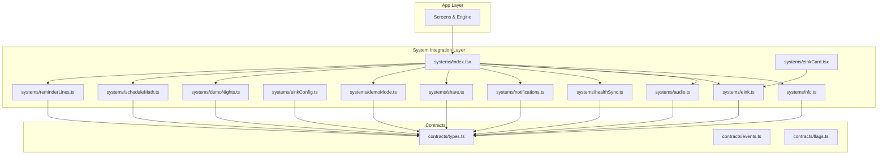
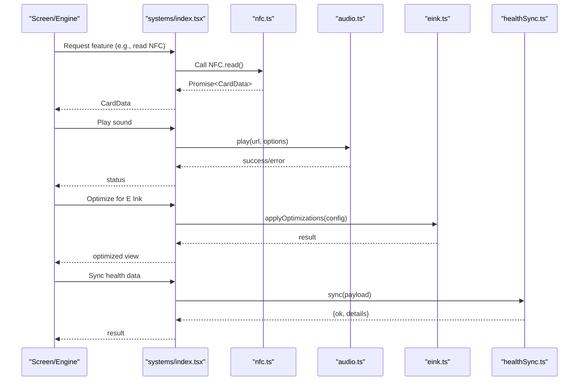
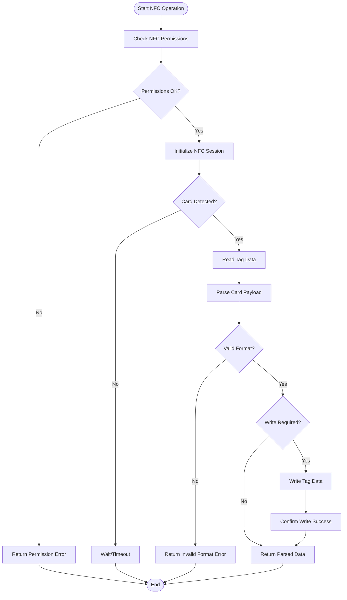
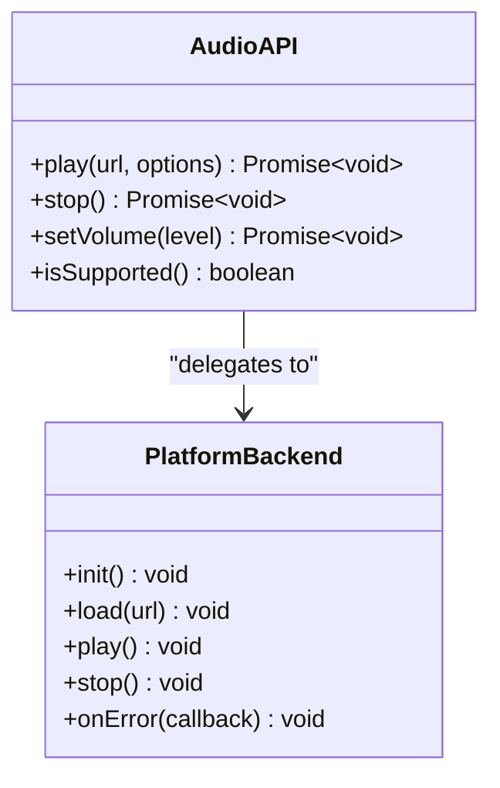
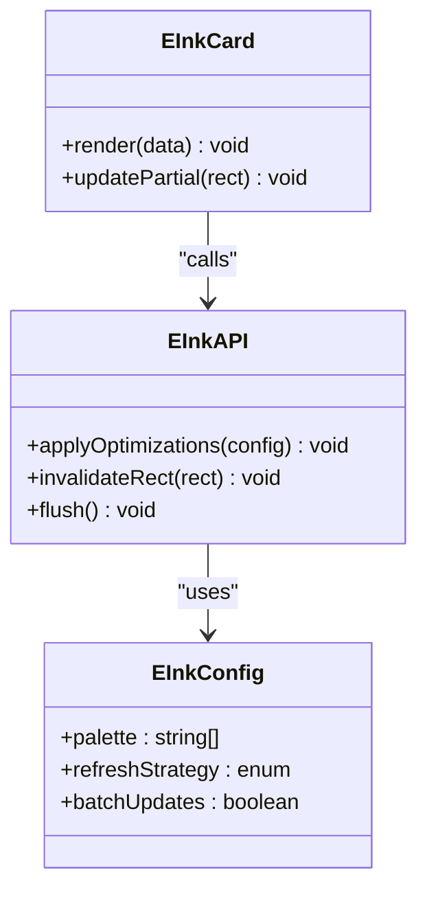
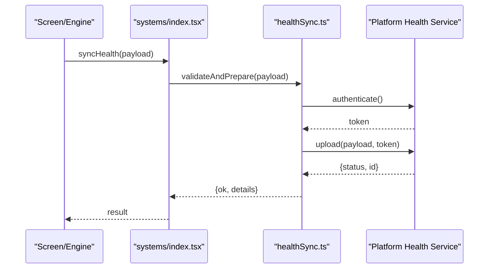
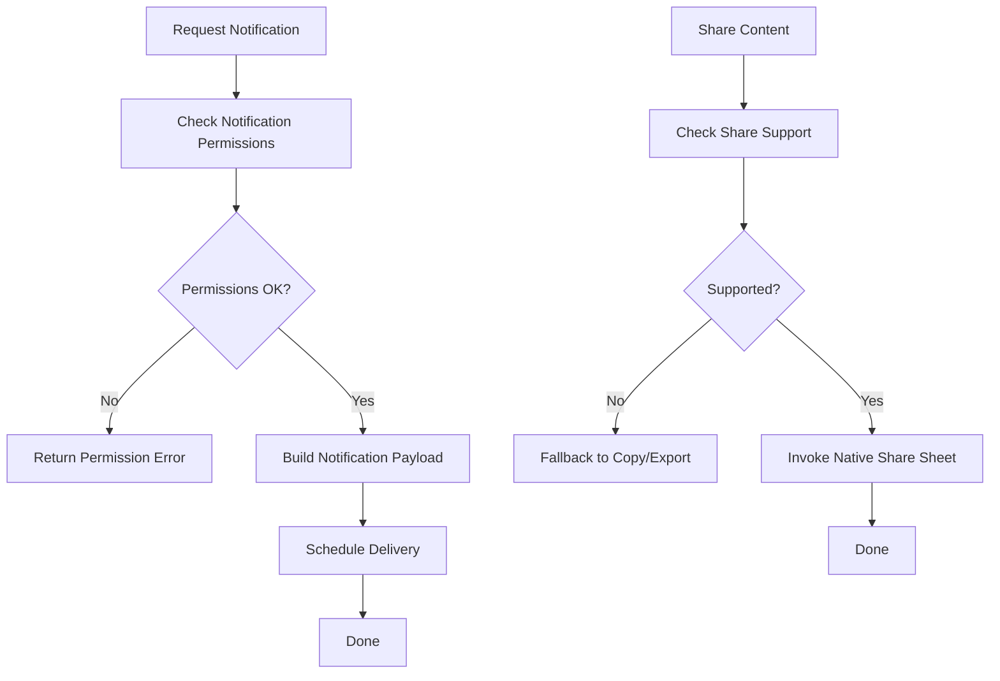
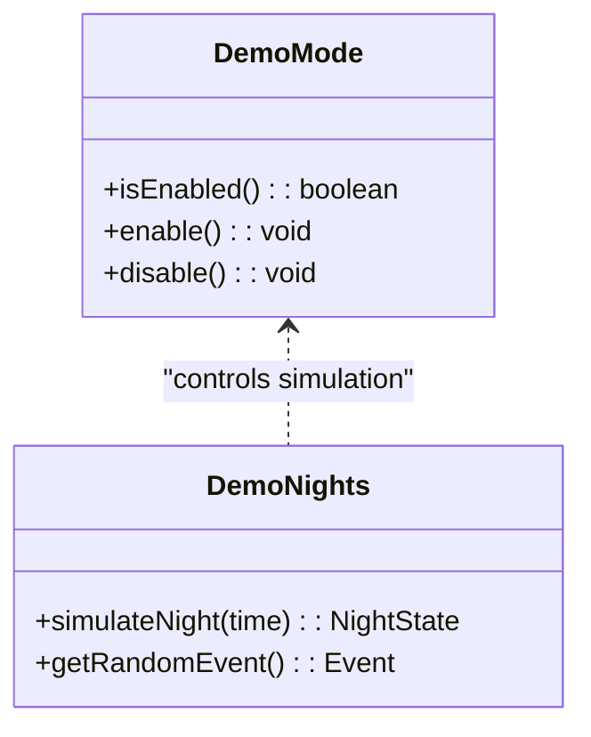
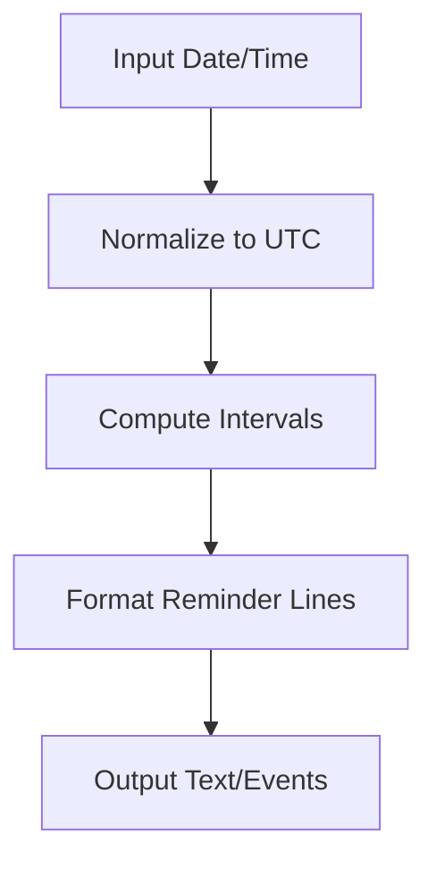
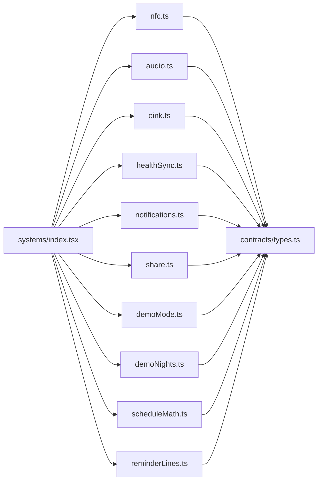

# System Integrations

<cite>
**Referenced Files in This Document**
- [src/systems/index.tsx](file://src/systems/index.tsx)
- [src/systems/nfc.ts](file://src/systems/nfc.ts)
- [src/systems/audio.ts](file://src/systems/audio.ts)
- [src/systems/eink.ts](file://src/systems/eink.ts)
- [src/systems/einkConfig.ts](file://src/systems/einkConfig.ts)
- [src/systems/einkCard.tsx](file://src/systems/einkCard.tsx)
- [src/systems/healthSync.ts](file://src/systems/healthSync.ts)
- [src/systems/notifications.ts](file://src/systems/notifications.ts)
- [src/systems/share.ts](file://src/systems/share.ts)
- [src/systems/demoMode.ts](file://src/systems/demoMode.ts)
- [src/systems/demoNights.ts](file://src/systems/demoNights.ts)
- [src/systems/scheduleMath.ts](file://src/systems/scheduleMath.ts)
- [src/systems/reminderLines.ts](file://src/systems/reminderLines.ts)
- [src/contracts/types.ts](file://src/contracts/types.ts)
- [src/contracts/events.ts](file://src/contracts/events.ts)
- [src/contracts/flags.ts](file://src/contracts/flags.ts)
</cite>

## Table of Contents

1. [Introduction](#introduction)
2. [Project Structure](#project-structure)
3. [Core Components](#core-components)
4. [Architecture Overview](#architecture-overview)
5. [Detailed Component Analysis](#detailed-component-analysis)
6. [Dependency Analysis](#dependency-analysis)
7. [Performance Considerations](#performance-considerations)
8. [Troubleshooting Guide](#troubleshooting-guide)
9. [Conclusion](#conclusion)
10. [Appendices](#appendices)

## Introduction

This document explains the system integration layer that abstracts hardware and platform-specific functionality for the application. It focuses on how NFC card reading/writing, audio playback, E Ink device optimizations, and health data synchronization are implemented behind consistent APIs. The layer provides a unified interface so higher-level screens and engine logic can interact with devices without caring about platform differences. It also includes guidance on extending the system layer with new integrations and handling platform-specific edge cases.

## Project Structure

The integration layer is organized under src/systems, with each subsystem encapsulated in its own module. Contracts live under src/contracts to define shared types, events, and flags used across the app and systems. UI components and screens consume these modules through stable interfaces rather than direct platform calls.

**Diagram sources**

- [src/systems/index.tsx](file://src/systems/index.tsx)
- [src/systems/nfc.ts](file://src/systems/nfc.ts)
- [src/systems/audio.ts](file://src/systems/audio.ts)
- [src/systems/eink.ts](file://src/systems/eink.ts)
- [src/systems/einkConfig.ts](file://src/systems/einkConfig.ts)
- [src/systems/einkCard.tsx](file://src/systems/einkCard.tsx)
- [src/systems/healthSync.ts](file://src/systems/healthSync.ts)
- [src/systems/notifications.ts](file://src/systems/notifications.ts)
- [src/systems/share.ts](file://src/systems/share.ts)
- [src/systems/demoMode.ts](file://src/systems/demoMode.ts)
- [src/systems/demoNights.ts](file://src/systems/demoNights.ts)
- [src/systems/scheduleMath.ts](file://src/systems/scheduleMath.ts)
- [src/systems/reminderLines.ts](file://src/systems/reminderLines.ts)
- [src/contracts/types.ts](file://src/contracts/types.ts)
- [src/contracts/events.ts](file://src/contracts/events.ts)
- [src/contracts/flags.ts](file://src/contracts/flags.ts)

**Section sources**

- [src/systems/index.tsx](file://src/systems/index.tsx)
- [src/contracts/types.ts](file://src/contracts/types.ts)
- [src/contracts/events.ts](file://src/contracts/events.ts)
- [src/contracts/flags.ts](file://src/contracts/flags.ts)

## Core Components

The system integration layer exposes cohesive modules:

- NFC: Abstraction for reading and writing NFC cards with platform-specific implementations.
- Audio: Unified API for playing sounds and managing audio state across platforms.
- E Ink: Optimizations and utilities tailored for E Ink displays, including refresh strategies and color palettes.
- Health Sync: Synchronization of health data with platform services or external APIs.
- Notifications: Cross-platform notification scheduling and delivery.
- Share: Sharing content via native share sheets or platform mechanisms.
- Demo Mode and Demo Nights: Utilities to simulate features during development and testing.
- Schedule Math and Reminder Lines: Time-based calculations and reminder generation helpers.

These modules are composed and exported from the systems index to provide a single entry point for consumers.

**Section sources**

- [src/systems/index.tsx](file://src/systems/index.tsx)
- [src/systems/nfc.ts](file://src/systems/nfc.ts)
- [src/systems/audio.ts](file://src/systems/audio.ts)
- [src/systems/eink.ts](file://src/systems/eink.ts)
- [src/systems/einkConfig.ts](file://src/systems/einkConfig.ts)
- [src/systems/einkCard.tsx](file://src/systems/einkCard.tsx)
- [src/systems/healthSync.ts](file://src/systems/healthSync.ts)
- [src/systems/notifications.ts](file://src/systems/notifications.ts)
- [src/systems/share.ts](file://src/systems/share.ts)
- [src/systems/demoMode.ts](file://src/systems/demoMode.ts)
- [src/systems/demoNights.ts](file://src/systems/demoNights.ts)
- [src/systems/scheduleMath.ts](file://src/systems/scheduleMath.ts)
- [src/systems/reminderLines.ts](file://src/systems/reminderLines.ts)

## Architecture Overview

The integration layer follows an abstraction pattern where each subsystem defines a stable interface and delegates to platform-specific implementations. Consumers call into the systems index, which wires together capabilities and returns consistent results regardless of the underlying device or OS.

**Diagram sources**

- [src/systems/index.tsx](file://src/systems/index.tsx)
- [src/systems/nfc.ts](file://src/systems/nfc.ts)
- [src/systems/audio.ts](file://src/systems/audio.ts)
- [src/systems/eink.ts](file://src/systems/eink.ts)
- [src/systems/healthSync.ts](file://src/systems/healthSync.ts)

## Detailed Component Analysis

### NFC Integration

The NFC module abstracts card detection, reading, and writing operations. It normalizes platform differences by exposing a uniform API that returns structured card data or errors. Higher-level flows can trigger NFC sessions, handle timeouts, and manage permissions consistently.

**Diagram sources**

- [src/systems/nfc.ts](file://src/systems/nfc.ts)

**Section sources**

- [src/systems/nfc.ts](file://src/systems/nfc.ts)

### Audio Playback

The audio module provides a consistent API for playing sounds, controlling volume, and handling platform-specific audio backends. It abstracts initialization, resource loading, and error states, ensuring screens can request playback without worrying about device specifics.

**Diagram sources**

- [src/systems/audio.ts](file://src/systems/audio.ts)

**Section sources**

- [src/systems/audio.ts](file://src/systems/audio.ts)

### E Ink Device Optimizations

E Ink optimizations focus on minimizing refresh artifacts, managing color palettes, and batching updates. The eink module coordinates configuration and rendering hints, while einkCard handles specialized card layouts suited for low-power displays.

**Diagram sources**

- [src/systems/eink.ts](file://src/systems/eink.ts)
- [src/systems/einkConfig.ts](file://src/systems/einkConfig.ts)
- [src/systems/einkCard.tsx](file://src/systems/einkCard.tsx)

**Section sources**

- [src/systems/eink.ts](file://src/systems/eink.ts)
- [src/systems/einkConfig.ts](file://src/systems/einkConfig.ts)
- [src/systems/einkCard.tsx](file://src/systems/einkCard.tsx)

### Health Data Synchronization

The health sync module abstracts interactions with platform health services or external APIs. It normalizes payloads, handles authentication, retries, and error mapping, providing a simple interface for syncing user health metrics.

**Diagram sources**

- [src/systems/healthSync.ts](file://src/systems/healthSync.ts)

**Section sources**

- [src/systems/healthSync.ts](file://src/systems/healthSync.ts)

### Notifications and Sharing

Notifications and sharing modules provide cross-platform abstractions for scheduling notifications and invoking native share dialogs. They encapsulate permission checks, payload formatting, and error handling.

**Diagram sources**

- [src/systems/notifications.ts](file://src/systems/notifications.ts)
- [src/systems/share.ts](file://src/systems/share.ts)

**Section sources**

- [src/systems/notifications.ts](file://src/systems/notifications.ts)
- [src/systems/share.ts](file://src/systems/share.ts)

### Demo Mode and Demo Nights

Demo utilities simulate features like nights and schedules to aid development and testing. They expose toggles and helpers to enable mock behaviors without impacting production code paths.

**Diagram sources**

- [src/systems/demoMode.ts](file://src/systems/demoMode.ts)
- [src/systems/demoNights.ts](file://src/systems/demoNights.ts)

**Section sources**

- [src/systems/demoMode.ts](file://src/systems/demoMode.ts)
- [src/systems/demoNights.ts](file://src/systems/demoNights.ts)

### Schedule Math and Reminder Lines

Time-based utilities compute schedules and generate reminder lines for display. They encapsulate date/time math and formatting rules, ensuring consistent behavior across platforms.

**Diagram sources**

- [src/systems/scheduleMath.ts](file://src/systems/scheduleMath.ts)
- [src/systems/reminderLines.ts](file://src/systems/reminderLines.ts)

**Section sources**

- [src/systems/scheduleMath.ts](file://src/systems/scheduleMath.ts)
- [src/systems/reminderLines.ts](file://src/systems/reminderLines.ts)

## Dependency Analysis

The systems index aggregates capabilities and exports them to consumers. Each subsystem depends on contracts for shared types and may rely on platform-specific libraries internally. This design minimizes coupling between screens/engine and platform details.

**Diagram sources**

- [src/systems/index.tsx](file://src/systems/index.tsx)
- [src/systems/nfc.ts](file://src/systems/nfc.ts)
- [src/systems/audio.ts](file://src/systems/audio.ts)
- [src/systems/eink.ts](file://src/systems/eink.ts)
- [src/systems/healthSync.ts](file://src/systems/healthSync.ts)
- [src/systems/notifications.ts](file://src/systems/notifications.ts)
- [src/systems/share.ts](file://src/systems/share.ts)
- [src/systems/demoMode.ts](file://src/systems/demoMode.ts)
- [src/systems/demoNights.ts](file://src/systems/demoNights.ts)
- [src/systems/scheduleMath.ts](file://src/systems/scheduleMath.ts)
- [src/systems/reminderLines.ts](file://src/systems/reminderLines.ts)
- [src/contracts/types.ts](file://src/contracts/types.ts)

**Section sources**

- [src/systems/index.tsx](file://src/systems/index.tsx)
- [src/contracts/types.ts](file://src/contracts/types.ts)

## Performance Considerations

- NFC: Batch operations when possible; avoid frequent polling; handle timeouts gracefully to prevent blocking UI threads.
- Audio: Preload assets where feasible; reuse instances; minimize runtime allocations; handle platform audio session conflicts.
- E Ink: Use partial updates and batched invalidations; limit palette complexity; avoid high-frequency refreshes; prefer static images for complex scenes.
- Health Sync: Implement retry with exponential backoff; cache tokens securely; compress payloads; debounce rapid updates.
- Notifications: Defer heavy work off the main thread; respect user preferences; coalesce similar notifications.
- Demo/Schedule: Keep demo toggles lightweight; avoid unnecessary recomputation; memoize schedule outputs.

[No sources needed since this section provides general guidance]

## Troubleshooting Guide

Common issues and resolutions:

- NFC failures: Verify permissions, check device capability, ensure tag format compatibility, and log raw errors for diagnostics.
- Audio playback errors: Confirm asset availability, platform audio session state, and volume settings; catch and surface backend exceptions.
- E Ink artifacts: Adjust refresh strategy, reduce color depth, and ensure proper flush calls after batch updates.
- Health sync errors: Inspect authentication flow, network connectivity, payload validation, and server responses; implement robust error mapping.
- Notifications not delivered: Check OS-level permissions, do-not-disturb modes, and scheduling constraints; verify payload structure.
- Sharing failures: Validate supported formats, fallback mechanisms, and user consent prompts.

**Section sources**

- [src/systems/nfc.ts](file://src/systems/nfc.ts)
- [src/systems/audio.ts](file://src/systems/audio.ts)
- [src/systems/eink.ts](file://src/systems/eink.ts)
- [src/systems/healthSync.ts](file://src/systems/healthSync.ts)
- [src/systems/notifications.ts](file://src/systems/notifications.ts)
- [src/systems/share.ts](file://src/systems/share.ts)

## Conclusion

The system integration layer provides a clean abstraction over hardware and platform specifics, enabling consistent APIs for NFC, audio, E Ink optimizations, and health synchronization. By centralizing platform logic and exposing stable interfaces, it simplifies development, improves maintainability, and facilitates extension with new integrations. Following the patterns outlined here ensures reliable behavior across diverse devices and environments.

[No sources needed since this section summarizes without analyzing specific files]

## Appendices

### Extending the System Layer

To add a new integration:

- Define a new module under src/systems with a clear interface.
- Implement platform-specific logic inside the module while keeping the public API stable.
- Wire the module into src/systems/index.tsx and export it alongside existing capabilities.
- Add tests under src/systems/**tests** to validate behavior and edge cases.
- Update contracts if new shared types or events are required.

**Section sources**

- [src/systems/index.tsx](file://src/systems/index.tsx)
- [src/contracts/types.ts](file://src/contracts/types.ts)
- [src/contracts/events.ts](file://src/contracts/events.ts)
- [src/contracts/flags.ts](file://src/contracts/flags.ts)
