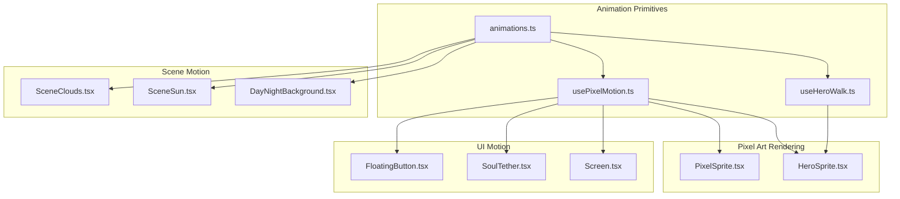
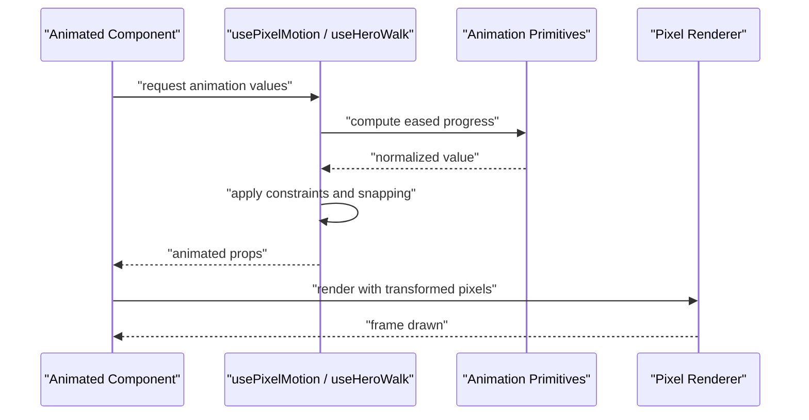
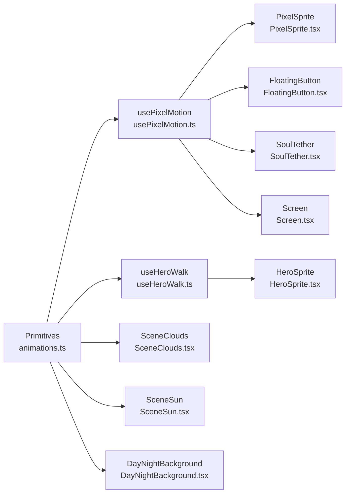

# Animation System

<cite>
**Referenced Files in This Document**
- [animations.ts](file://src/ui/animations.ts)
- [usePixelMotion.ts](file://src/ui/usePixelMotion.ts)
- [useHeroWalk.ts](file://src/ui/useHeroWalk.ts)
- [PixelSprite.tsx](file://src/ui/PixelSprite.tsx)
- [HeroSprite.tsx](file://src/ui/HeroSprite.tsx)
- [SceneClouds.tsx](file://src/ui/SceneClouds.tsx)
- [SceneSun.tsx](file://src/ui/SceneSun.tsx)
- [Screen.tsx](file://src/ui/Screen.tsx)
- [DayNightBackground.tsx](file://src/ui/DayNightBackground.tsx)
- [SoulTether.tsx](file://src/ui/SoulTether.tsx)
- [FloatingButton.tsx](file://src/ui/FloatingButton.tsx)
</cite>

## Table of Contents

1. [Introduction](#introduction)
2. [Project Structure](#project-structure)
3. [Core Components](#core-components)
4. [Architecture Overview](#architecture-overview)
5. [Detailed Component Analysis](#detailed-component-analysis)
6. [Dependency Analysis](#dependency-analysis)
7. [Performance Considerations](#performance-considerations)
8. [Troubleshooting Guide](#troubleshooting-guide)
9. [Conclusion](#conclusion)
10. [Appendices](#appendices)

## Introduction

This document explains the animation system that powers smooth transitions and motion effects across the application, with a focus on pixel art integration. It covers animation primitives, hooks such as usePixelMotion and useHeroWalk, configuration patterns, performance considerations, and guidance for creating custom animations that match the game’s visual language.

## Project Structure

The animation system is implemented primarily under src/ui:

- Core animation utilities and hooks live in dedicated files (e.g., animations.ts, usePixelMotion.ts, useHeroWalk.ts).
- Pixel-art rendering components consume these hooks to animate sprites and scenes (e.g., PixelSprite.tsx, HeroSprite.tsx).
- Scene-level components integrate ambient motion (e.g., clouds, sun) using shared animation primitives.
- UI elements leverage lightweight motion for feedback and polish (e.g., floating buttons, tethers).

**Diagram sources**

- [animations.ts](file://src/ui/animations.ts)
- [usePixelMotion.ts](file://src/ui/usePixelMotion.ts)
- [useHeroWalk.ts](file://src/ui/useHeroWalk.ts)
- [PixelSprite.tsx](file://src/ui/PixelSprite.tsx)
- [HeroSprite.tsx](file://src/ui/HeroSprite.tsx)
- [SceneClouds.tsx](file://src/ui/SceneClouds.tsx)
- [SceneSun.tsx](file://src/ui/SceneSun.tsx)
- [DayNightBackground.tsx](file://src/ui/DayNightBackground.tsx)
- [FloatingButton.tsx](file://src/ui/FloatingButton.tsx)
- [SoulTether.tsx](file://src/ui/SoulTether.tsx)
- [Screen.tsx](file://src/ui/Screen.tsx)

**Section sources**

- [animations.ts](file://src/ui/animations.ts)
- [usePixelMotion.ts](file://src/ui/usePixelMotion.ts)
- [useHeroWalk.ts](file://src/ui/useHeroWalk.ts)
- [PixelSprite.tsx](file://src/ui/PixelSprite.tsx)
- [HeroSprite.tsx](file://src/ui/HeroSprite.tsx)
- [SceneClouds.tsx](file://src/ui/SceneClouds.tsx)
- [SceneSun.tsx](file://src/ui/SceneSun.tsx)
- [DayNightBackground.tsx](file://src/ui/DayNightBackground.tsx)
- [FloatingButton.tsx](file://src/ui/FloatingButton.tsx)
- [SoulTether.tsx](file://src/ui/SoulTether.tsx)
- [Screen.tsx](file://src/ui/Screen.tsx)

## Core Components

- Animation primitives: Shared easing functions, timing utilities, and interpolation helpers used by all animated components.
- usePixelMotion hook: Provides frame-driven motion values optimized for pixel-perfect updates, including position, scale, opacity, and rotation.
- useHeroWalk hook: Specialized motion controller for hero characters, combining walk cycles, direction changes, and sprite sheet sequencing.
- PixelSprite and HeroSprite: Render pixel art frames and apply motion transforms driven by the hooks while preserving crisp edges.
- Scene motion components: Ambient animations like clouds and sun movement that rely on shared primitives and hooks for subtle parallax or drift.
- UI motion components: Lightweight interactions (hover, press, ripple) powered by usePixelMotion for consistent feel.

Key responsibilities:

- Centralize timing and easing to ensure consistent motion across the app.
- Provide hooks that abstract animation state and lifecycle management.
- Keep pixel art crisp by avoiding fractional transforms where possible and snapping to grid when needed.

**Section sources**

- [animations.ts](file://src/ui/animations.ts)
- [usePixelMotion.ts](file://src/ui/usePixelMotion.ts)
- [useHeroWalk.ts](file://src/ui/useHeroWalk.ts)
- [PixelSprite.tsx](file://src/ui/PixelSprite.tsx)
- [HeroSprite.tsx](file://src/ui/HeroSprite.tsx)
- [SceneClouds.tsx](file://src/ui/SceneClouds.tsx)
- [SceneSun.tsx](file://src/ui/SceneSun.tsx)
- [DayNightBackground.tsx](file://src/ui/DayNightBackground.tsx)
- [FloatingButton.tsx](file://src/ui/FloatingButton.tsx)
- [SoulTether.tsx](file://src/ui/SoulTether.tsx)
- [Screen.tsx](file://src/ui/Screen.tsx)

## Architecture Overview

The animation architecture separates concerns into three layers:

- Primitives layer: Pure functions for easing, timing, and interpolation.
- Hooks layer: React hooks encapsulating animation state, update loops, and side effects.
- Components layer: Pixel art and scene components consuming hooks to render animated visuals.

**Diagram sources**

- [animations.ts](file://src/ui/animations.ts)
- [usePixelMotion.ts](file://src/ui/usePixelMotion.ts)
- [useHeroWalk.ts](file://src/ui/useHeroWalk.ts)
- [PixelSprite.tsx](file://src/ui/PixelSprite.tsx)
- [HeroSprite.tsx](file://src/ui/HeroSprite.tsx)

## Detailed Component Analysis

### Animation Primitives (animations.ts)

Purpose:

- Provide reusable easing curves and timing utilities.
- Normalize time inputs to 0..1 ranges for consistent interpolation.
- Offer helper functions for common motion patterns (bounce, ease-in-out, linear).

Design highlights:

- Stateless functions to maximize reusability and testability.
- Deterministic outputs based on input time and duration.
- Optional parameters for amplitude, frequency, and damping where applicable.

Usage patterns:

- Import specific easing functions per component need.
- Combine primitives to build complex sequences via composition.

**Section sources**

- [animations.ts](file://src/ui/animations.ts)

### usePixelMotion Hook (usePixelMotion.ts)

Purpose:

- Drive smooth, frame-based motion for any animated property (position, scale, opacity, rotation).
- Maintain pixel-perfect output by snapping values when configured.
- Expose a simple API for starting, pausing, and resetting animations.

Key behaviors:

- Uses requestAnimationFrame or equivalent scheduling for smooth updates.
- Applies easing curves from primitives to produce natural motion.
- Supports chaining multiple properties with independent timings.

Integration points:

- Consumed by PixelSprite and HeroSprite for transform updates.
- Used by UI components for micro-interactions and transitions.

**Section sources**

- [usePixelMotion.ts](file://src/ui/usePixelMotion.ts)
- [PixelSprite.tsx](file://src/ui/PixelSprite.tsx)
- [HeroSprite.tsx](file://src/ui/HeroSprite.tsx)
- [FloatingButton.tsx](file://src/ui/FloatingButton.tsx)
- [SoulTether.tsx](file://src/ui/SoulTether.tsx)
- [Screen.tsx](file://src/ui/Screen.tsx)

### useHeroWalk Hook (useHeroWalk.ts)

Purpose:

- Manage hero character walking animations, including sprite sheet cycling and directional logic.
- Coordinate movement with frame selection to keep pixel art crisp and aligned.

Key behaviors:

- Tracks direction and speed to select appropriate frames.
- Syncs step cadence with movement progress.
- Handles idle, walk, and transition states seamlessly.

Integration points:

- Consumed by HeroSprite to render correct frames during movement.
- Works alongside usePixelMotion for overall positioning and scaling.

**Section sources**

- [useHeroWalk.ts](file://src/ui/useHeroWalk.ts)
- [HeroSprite.tsx](file://src/ui/HeroSprite.tsx)

### PixelSprite and HeroSprite (PixelSprite.tsx, HeroSprite.tsx)

Purpose:

- Render pixel art assets efficiently while applying motion transforms.
- Ensure crisp edges by avoiding anti-aliasing artifacts and snapping to grid when necessary.

Key behaviors:

- Accept animated props from hooks and map them to transform attributes.
- Optimize frame selection for sprite sheets used by heroes.
- Debounce or throttle updates to maintain performance on lower-end devices.

**Section sources**

- [PixelSprite.tsx](file://src/ui/PixelSprite.tsx)
- [HeroSprite.tsx](file://src/ui/HeroSprite.tsx)

### Scene Motion Components (SceneClouds.tsx, SceneSun.tsx, DayNightBackground.tsx)

Purpose:

- Add ambient motion to backgrounds and environmental elements.
- Use subtle parallax and drift to create depth without distracting from gameplay.

Key behaviors:

- Leverage shared primitives for smooth looping animations.
- Respect device performance by limiting update frequency and complexity.
- Integrate with theme and lighting to adjust colors and intensities over time.

**Section sources**

- [SceneClouds.tsx](file://src/ui/SceneClouds.tsx)
- [SceneSun.tsx](file://src/ui/SceneSun.tsx)
- [DayNightBackground.tsx](file://src/ui/DayNightBackground.tsx)

### UI Motion Components (FloatingButton.tsx, SoulTether.tsx, Screen.tsx)

Purpose:

- Provide responsive feedback through small, polished animations.
- Enhance user experience with hover, press, and transition effects.

Key behaviors:

- Use usePixelMotion for lightweight, short-duration animations.
- Keep animations accessible and non-blocking for user interactions.
- Maintain consistency with the game’s visual language and pacing.

**Section sources**

- [FloatingButton.tsx](file://src/ui/FloatingButton.tsx)
- [SoulTether.tsx](file://src/ui/SoulTether.tsx)
- [Screen.tsx](file://src/ui/Screen.tsx)

## Dependency Analysis

The animation system exhibits clear separation between primitives, hooks, and components:

- Primitives are pure and dependency-free, enabling reuse across hooks and components.
- Hooks depend on primitives and provide stateful behavior to components.
- Components depend on hooks and render pixel art or scene elements with animated props.

**Diagram sources**

- [animations.ts](file://src/ui/animations.ts)
- [usePixelMotion.ts](file://src/ui/usePixelMotion.ts)
- [useHeroWalk.ts](file://src/ui/useHeroWalk.ts)
- [PixelSprite.tsx](file://src/ui/PixelSprite.tsx)
- [HeroSprite.tsx](file://src/ui/HeroSprite.tsx)
- [SceneClouds.tsx](file://src/ui/SceneClouds.tsx)
- [SceneSun.tsx](file://src/ui/SceneSun.tsx)
- [DayNightBackground.tsx](file://src/ui/DayNightBackground.tsx)
- [FloatingButton.tsx](file://src/ui/FloatingButton.tsx)
- [SoulTether.tsx](file://src/ui/SoulTether.tsx)
- [Screen.tsx](file://src/ui/Screen.tsx)

**Section sources**

- [animations.ts](file://src/ui/animations.ts)
- [usePixelMotion.ts](file://src/ui/usePixelMotion.ts)
- [useHeroWalk.ts](file://src/ui/useHeroWalk.ts)
- [PixelSprite.tsx](file://src/ui/PixelSprite.tsx)
- [HeroSprite.tsx](file://src/ui/HeroSprite.tsx)
- [SceneClouds.tsx](file://src/ui/SceneClouds.tsx)
- [SceneSun.tsx](file://src/ui/SceneSun.tsx)
- [DayNightBackground.tsx](file://src/ui/DayNightBackground.tsx)
- [FloatingButton.tsx](file://src/ui/FloatingButton.tsx)
- [SoulTether.tsx](file://src/ui/SoulTether.tsx)
- [Screen.tsx](file://src/ui/Screen.tsx)

## Performance Considerations

- Prefer frame-based updates via hooks rather than frequent re-renders; batch property updates where possible.
- Snap transforms to integer values for pixel-perfect rendering and reduced blur.
- Limit the number of concurrent animations per frame; prioritize foreground elements.
- Use lightweight easing functions for short interactions; reserve heavier curves for prominent transitions.
- Avoid unnecessary layout recalculations by animating transform and opacity properties.
- Throttle or pause background animations when off-screen or when the app is minimized.

[No sources needed since this section provides general guidance]

## Troubleshooting Guide

Common issues and resolutions:

- Jittery or stuttering animations: Check update frequency and ensure animations are not blocking the main thread. Reduce complexity or defer non-critical animations.
- Blurry pixel art: Verify that transforms are snapped to grid and avoid fractional scales. Confirm that anti-aliasing is disabled for pixel sprites.
- Out-of-sync sprite frames: Validate that useHeroWalk’s step cadence matches movement speed and frame count. Ensure sprite sheet dimensions align with expected frame sizes.
- Excessive memory usage: Reuse animation instances and avoid allocating new objects per frame. Clear references when components unmount.

**Section sources**

- [usePixelMotion.ts](file://src/ui/usePixelMotion.ts)
- [useHeroWalk.ts](file://src/ui/useHeroWalk.ts)
- [PixelSprite.tsx](file://src/ui/PixelSprite.tsx)
- [HeroSprite.tsx](file://src/ui/HeroSprite.tsx)

## Conclusion

The animation system delivers smooth, pixel-perfect motion through a layered architecture of primitives, hooks, and components. By centralizing timing and easing, providing robust hooks for motion and hero walking, and integrating tightly with pixel art rendering, it ensures consistent visual language and strong performance. Follow the guidelines for creating custom animations to maintain cohesion and efficiency across the application.

[No sources needed since this section summarizes without analyzing specific files]

## Appendices

### Creating Custom Animations

Steps:

- Define or reuse easing functions from primitives for desired motion feel.
- Implement or extend usePixelMotion to compute animated values over time.
- Apply transforms in your component while snapping to grid for pixel art.
- Test on target devices to verify performance and visual quality.

Best practices:

- Keep animations short and purposeful.
- Avoid heavy computations inside animation loops.
- Use consistent easing curves to unify the experience.
- Provide accessibility-friendly options (e.g., reduced motion).

[No sources needed since this section provides general guidance]
