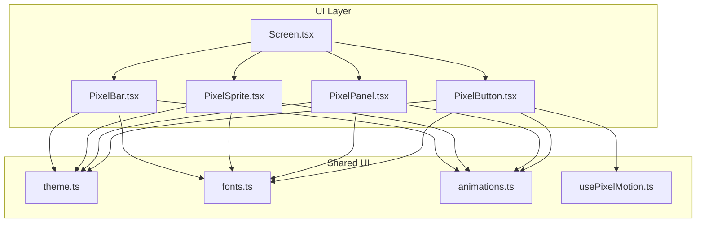
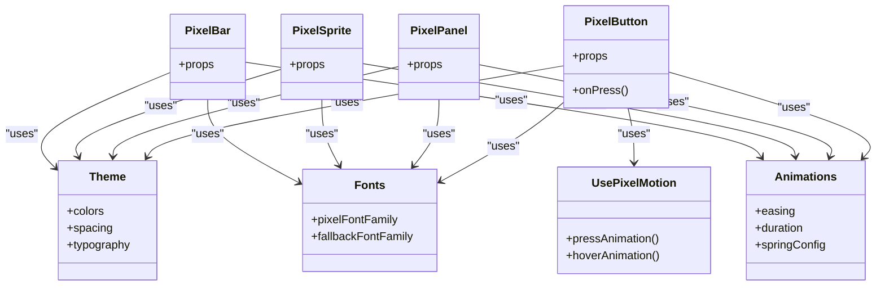
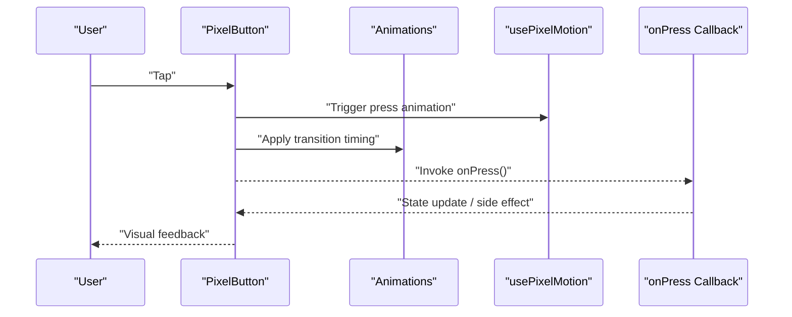
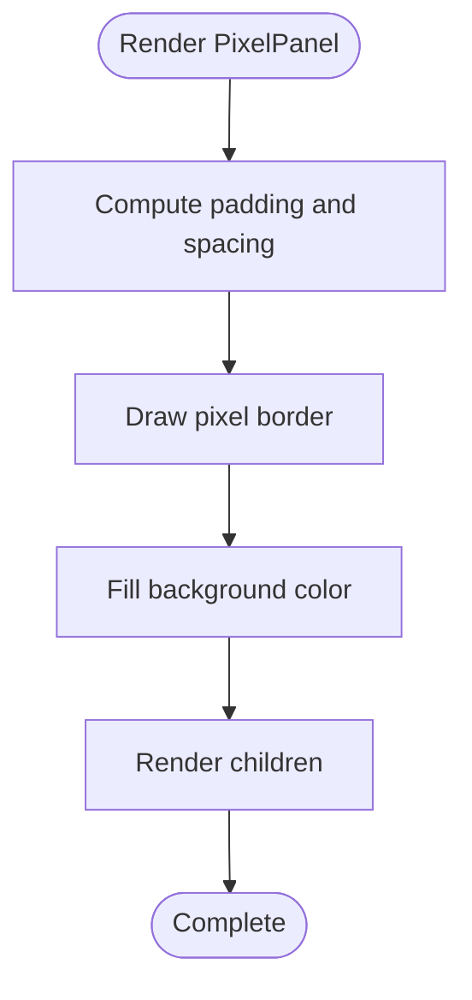
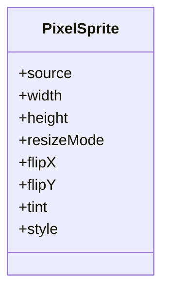
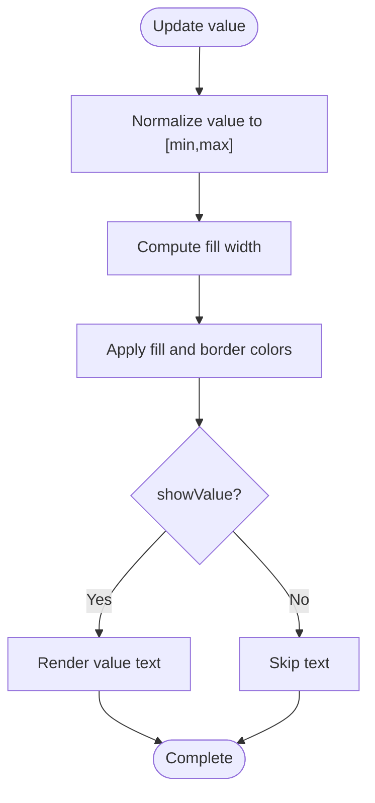
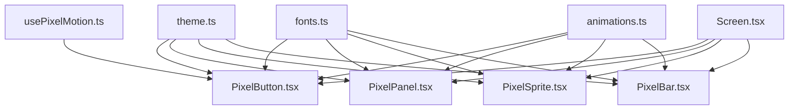

# Pixel Art Components

<cite>
**Referenced Files in This Document**
- [PixelButton.tsx](file://src/ui/PixelButton.tsx)
- [PixelPanel.tsx](file://src/ui/PixelPanel.tsx)
- [PixelSprite.tsx](file://src/ui/PixelSprite.tsx)
- [PixelBar.tsx](file://src/ui/PixelBar.tsx)
- [theme.ts](file://src/ui/theme.ts)
- [fonts.ts](file://src/ui/fonts.ts)
- [animations.ts](file://src/ui/animations.ts)
- [usePixelMotion.ts](file://src/ui/usePixelMotion.ts)
- [Screen.tsx](file://src/ui/Screen.tsx)
</cite>

## Table of Contents

1. [Introduction](#introduction)
2. [Project Structure](#project-structure)
3. [Core Components](#core-components)
4. [Architecture Overview](#architecture-overview)
5. [Detailed Component Analysis](#detailed-component-analysis)
6. [Dependency Analysis](#dependency-analysis)
7. [Performance Considerations](#performance-considerations)
8. [Troubleshooting Guide](#troubleshooting-guide)
9. [Conclusion](#conclusion)
10. [Appendices](#appendices)

## Introduction

This document explains the core pixel art UI components used across the application: PixelButton, PixelPanel, PixelSprite, and PixelBar. It covers their props, events, customization options, and how they preserve a consistent pixel art aesthetic while leveraging modern React Native capabilities such as animations, theming, and accessibility. You will also find usage examples, composition patterns, and best practices for extending these base components to build rich, retro-styled interfaces.

## Project Structure

The pixel art components live under src/ui and are consumed by screens and other UI modules. They rely on shared theme, fonts, animations, and motion hooks to maintain consistency and performance.

**Diagram sources**

- [PixelButton.tsx](file://src/ui/PixelButton.tsx)
- [PixelPanel.tsx](file://src/ui/PixelPanel.tsx)
- [PixelSprite.tsx](file://src/ui/PixelSprite.tsx)
- [PixelBar.tsx](file://src/ui/PixelBar.tsx)
- [Screen.tsx](file://src/ui/Screen.tsx)
- [theme.ts](file://src/ui/theme.ts)
- [fonts.ts](file://src/ui/fonts.ts)
- [animations.ts](file://src/ui/animations.ts)
- [usePixelMotion.ts](file://src/ui/usePixelMotion.ts)

**Section sources**

- [PixelButton.tsx](file://src/ui/PixelButton.tsx)
- [PixelPanel.tsx](file://src/ui/PixelPanel.tsx)
- [PixelSprite.tsx](file://src/ui/PixelSprite.tsx)
- [PixelBar.tsx](file://src/ui/PixelBar.tsx)
- [Screen.tsx](file://src/ui/Screen.tsx)
- [theme.ts](file://src/ui/theme.ts)
- [fonts.ts](file://src/ui/fonts.ts)
- [animations.ts](file://src/ui/animations.ts)
- [usePixelMotion.ts](file://src/ui/usePixelMotion.ts)

## Core Components

This section summarizes each component’s purpose, key props, events, and customization points.

- PixelButton
  - Purpose: A pixel-art styled pressable button with optional icon, label, and states (default, pressed, disabled).
  - Key props: label, onPress, disabled, variant, size, colorScheme, style, accessibilityLabel.
  - Events: onPress, onLongPress (if supported), accessibility actions.
  - Customization: Colors from theme, font family from fonts, animation timing via animations, motion via usePixelMotion.

- PixelPanel
  - Purpose: A container that frames content with pixel borders and background colors.
  - Key props: children, padding, borderColor, backgroundColor, borderRadius, style.
  - Events: none intrinsic; forwards child interactions.
  - Customization: Theme colors, border thickness, corner radius, spacing.

- PixelSprite
  - Purpose: Renders a pixelated image or sprite sheet frame with crisp scaling.
  - Key props: source, width, height, resizeMode, flipX, flipY, tint, style.
  - Events: none intrinsic; can wrap with pressables if needed.
  - Customization: Tinting via theme colors, pixel-perfect rendering settings, animation integration.

- PixelBar
  - Purpose: Displays a progress or health bar with pixel-style fill and border.
  - Key props: value, min, max, color, backgroundColor, borderColor, height, showValue, style.
  - Events: none intrinsic; can be wrapped for interactivity.
  - Customization: Color scheme, dimensions, value formatting, animation transitions.

**Section sources**

- [PixelButton.tsx](file://src/ui/PixelButton.tsx)
- [PixelPanel.tsx](file://src/ui/PixelPanel.tsx)
- [PixelSprite.tsx](file://src/ui/PixelSprite.tsx)
- [PixelBar.tsx](file://src/ui/PixelBar.tsx)

## Architecture Overview

The components share a common design system:

- Theme provides palette, typography, and spacing tokens.
- Fonts define pixel-friendly typefaces.
- Animations standardizes easing and durations for pixel-feel transitions.
- usePixelMotion offers reusable motion helpers for subtle effects like hover or press.

**Diagram sources**

- [theme.ts](file://src/ui/theme.ts)
- [fonts.ts](file://src/ui/fonts.ts)
- [animations.ts](file://src/ui/animations.ts)
- [usePixelMotion.ts](file://src/ui/usePixelMotion.ts)
- [PixelButton.tsx](file://src/ui/PixelButton.tsx)
- [PixelPanel.tsx](file://src/ui/PixelPanel.tsx)
- [PixelSprite.tsx](file://src/ui/PixelSprite.tsx)
- [PixelBar.tsx](file://src/ui/PixelBar.tsx)

## Detailed Component Analysis

### PixelButton

- Props
  - label: string displayed inside the button
  - onPress: function invoked on press
  - disabled: boolean to disable interaction
  - variant: visual style variant (e.g., primary, secondary)
  - size: small, medium, large
  - colorScheme: overrides default theme colors
  - style: additional styles
  - accessibilityLabel: screen reader text
- Events
  - onPress: primary interaction
  - Optional long press support depending on implementation
- Customization
  - Uses theme colors and typography
  - Animation timings from animations module
  - Motion effects via usePixelMotion hook
- Usage example pattern
  - Wrap with Screen for layout context
  - Provide label and onPress handler
  - Optionally set disabled and variant
- Composition patterns
  - Combine with PixelPanel for grouped controls
  - Nest icons using PixelSprite for visual feedback
- Best practices
  - Always provide accessibilityLabel
  - Keep labels concise and descriptive
  - Use variants consistently across screens

**Diagram sources**

- [PixelButton.tsx](file://src/ui/PixelButton.tsx)
- [animations.ts](file://src/ui/animations.ts)
- [usePixelMotion.ts](file://src/ui/usePixelMotion.ts)

**Section sources**

- [PixelButton.tsx](file://src/ui/PixelButton.tsx)
- [animations.ts](file://src/ui/animations.ts)
- [usePixelMotion.ts](file://src/ui/usePixelMotion.ts)

### PixelPanel

- Props
  - children: any React nodes
  - padding: number or spacing token
  - borderColor: hex or theme color
  - backgroundColor: hex or theme color
  - borderRadius: pixel-aligned radius
  - style: additional styles
- Events
  - None intrinsic; forwards child interactions
- Customization
  - Border thickness and color from theme
  - Background color and spacing tokens
- Usage example pattern
  - Encapsulate groups of controls or content
  - Apply consistent padding and borders
- Composition patterns
  - Stack multiple panels for layered layouts
  - Place PixelButton and PixelBar inside for cohesive UI
- Best practices
  - Use consistent padding values
  - Avoid excessive nesting to keep layout predictable

**Diagram sources**

- [PixelPanel.tsx](file://src/ui/PixelPanel.tsx)

**Section sources**

- [PixelPanel.tsx](file://src/ui/PixelPanel.tsx)

### PixelSprite

- Props
  - source: image asset or sprite sheet reference
  - width: target width
  - height: target height
  - resizeMode: fit, cover, stretch
  - flipX: horizontal mirror
  - flipY: vertical mirror
  - tint: color overlay
  - style: additional styles
- Events
  - None intrinsic; wrap with pressable if needed
- Customization
  - Tinting via theme colors
  - Crisp pixel rendering settings
- Usage example pattern
  - Display character sprites, icons, or scene elements
  - Animate frames or transitions using animations
- Composition patterns
  - Combine with PixelPanel for framed sprites
  - Use within lists or grids for inventory or gallery views
- Best practices
  - Ensure images are pixel-perfect at intended sizes
  - Prefer sprite sheets for animated sequences

**Diagram sources**

- [PixelSprite.tsx](file://src/ui/PixelSprite.tsx)

**Section sources**

- [PixelSprite.tsx](file://src/ui/PixelSprite.tsx)

### PixelBar

- Props
  - value: current numeric value
  - min: minimum bound
  - max: maximum bound
  - color: fill color
  - backgroundColor: track color
  - borderColor: border color
  - height: bar height
  - showValue: boolean to display value text
  - style: additional styles
- Events
  - None intrinsic; wrap with pressable for interactive bars
- Customization
  - Color scheme from theme
  - Value formatting and animation transitions
- Usage example pattern
  - Health, stamina, or progress indicators
  - Update value reactively with state changes
- Composition patterns
  - Pair with labels or icons for context
  - Group multiple bars for status displays
- Best practices
  - Clamp values between min and max
  - Use smooth but snappy animations for responsiveness

**Diagram sources**

- [PixelBar.tsx](file://src/ui/PixelBar.tsx)

**Section sources**

- [PixelBar.tsx](file://src/ui/PixelBar.tsx)

## Dependency Analysis

These components depend on shared UI primitives to ensure consistency:

- theme.ts: centralizes colors, spacing, and typography tokens
- fonts.ts: defines pixel-friendly font families
- animations.ts: standardizes easing and duration
- usePixelMotion.ts: provides reusable motion helpers
- Screen.tsx: provides layout context and safe areas

**Diagram sources**

- [theme.ts](file://src/ui/theme.ts)
- [fonts.ts](file://src/ui/fonts.ts)
- [animations.ts](file://src/ui/animations.ts)
- [usePixelMotion.ts](file://src/ui/usePixelMotion.ts)
- [Screen.tsx](file://src/ui/Screen.tsx)
- [PixelButton.tsx](file://src/ui/PixelButton.tsx)
- [PixelPanel.tsx](file://src/ui/PixelPanel.tsx)
- [PixelSprite.tsx](file://src/ui/PixelSprite.tsx)
- [PixelBar.tsx](file://src/ui/PixelBar.tsx)

**Section sources**

- [theme.ts](file://src/ui/theme.ts)
- [fonts.ts](file://src/ui/fonts.ts)
- [animations.ts](file://src/ui/animations.ts)
- [usePixelMotion.ts](file://src/ui/usePixelMotion.ts)
- [Screen.tsx](file://src/ui/Screen.tsx)
- [PixelButton.tsx](file://src/ui/PixelButton.tsx)
- [PixelPanel.tsx](file://src/ui/PixelPanel.tsx)
- [PixelSprite.tsx](file://src/ui/PixelSprite.tsx)
- [PixelBar.tsx](file://src/ui/PixelBar.tsx)

## Performance Considerations

- Prefer memoization for heavy components or frequently re-rendered lists.
- Use sprite sheets and preloaded assets to avoid runtime decoding overhead.
- Keep animations short and use hardware-accelerated properties.
- Avoid deep nesting of panels to reduce layout recalculations.
- Reuse theme tokens to minimize style object churn.

[No sources needed since this section provides general guidance]

## Troubleshooting Guide

- Buttons not responding
  - Verify onPress is provided and not overridden by parent gestures.
  - Check disabled prop and accessibility focus behavior.
- Sprites appear blurry
  - Ensure correct resizeMode and pixel-perfect dimensions.
  - Confirm asset resolution matches target size.
- Bars misalign or overflow
  - Validate min/max/value ranges and clamp logic.
  - Inspect container widths and flex behavior.
- Inconsistent styling
  - Confirm theme tokens are applied correctly.
  - Check for local style overrides conflicting with theme.

**Section sources**

- [PixelButton.tsx](file://src/ui/PixelButton.tsx)
- [PixelSprite.tsx](file://src/ui/PixelSprite.tsx)
- [PixelBar.tsx](file://src/ui/PixelBar.tsx)
- [theme.ts](file://src/ui/theme.ts)

## Conclusion

PixelButton, PixelPanel, PixelSprite, and PixelBar form a cohesive, pixel-art-focused UI layer that blends retro aesthetics with modern React Native features. By leveraging shared theme, fonts, animations, and motion hooks, these components deliver consistent visuals, responsive interactions, and accessible experiences. Follow the composition patterns and best practices outlined here to extend and scale your pixel art interface effectively.

[No sources needed since this section summarizes without analyzing specific files]

## Appendices

- Accessibility tips
  - Provide meaningful accessibilityLabel for buttons and interactive elements.
  - Ensure sufficient contrast for text and icons.
- Extending components
  - Create derived components by composing base components with custom props and styles.
  - Centralize new variants in theme.ts for global consistency.
- Example compositions
  - Inventory grid using PixelPanel containers and PixelSprite items.
  - Status dashboard combining PixelBar instances with labels.

[No sources needed since this section provides general guidance]
