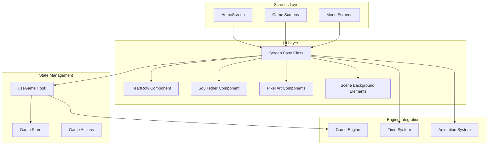
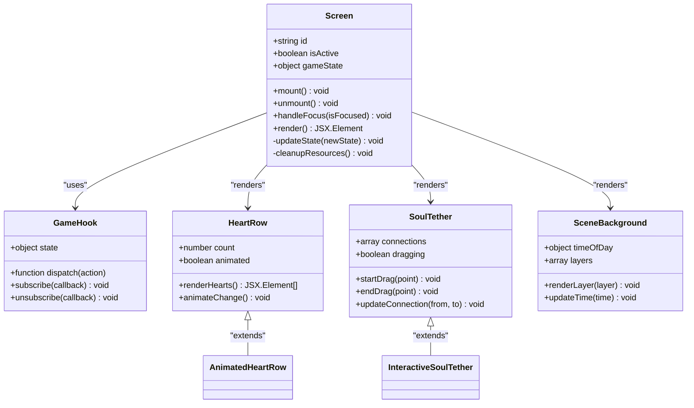
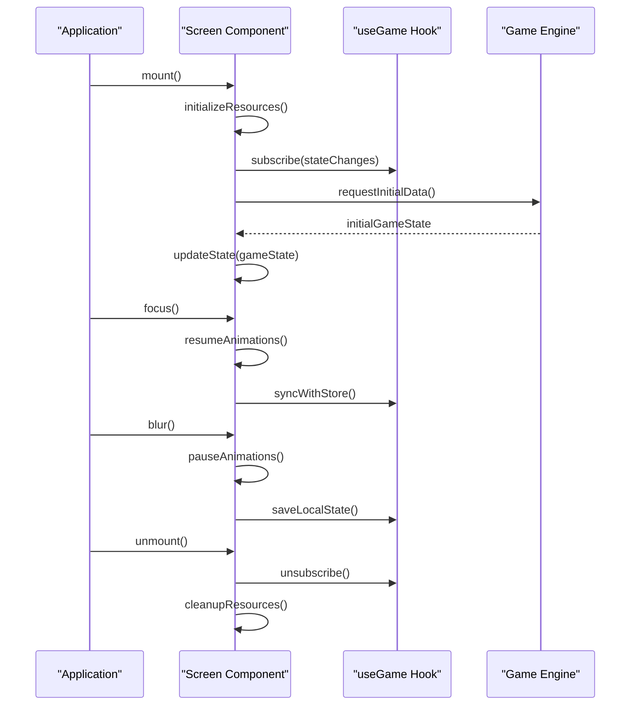
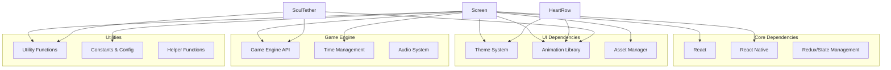

# Screen Framework

<cite>
**Referenced Files in This Document**
- [Screen.tsx](file://src/ui/Screen.tsx)
- [HomeScreen.tsx](file://src/screens/HomeScreen.tsx)
- [HeartRow.tsx](file://src/ui/HeartRow.tsx)
- [SoulTether.tsx](file://src/ui/SoulTether.tsx)
- [useGame.tsx](file://src/ui/useGame.tsx)
- [DayNightBackground.tsx](file://src/ui/DayNightBackground.tsx)
- [SceneBanner.tsx](file://src/ui/SceneBanner.tsx)
- [SceneClouds.tsx](file://src/ui/SceneClouds.tsx)
- [SceneGrass.tsx](file://src/ui/SceneGrass.tsx)
- [SceneSun.tsx](file://src/ui/SceneSun.tsx)
- [animations.ts](file://src/ui/animations.ts)
- [theme.ts](file://src/ui/theme.ts)
- [timeOfDay.ts](file://src/ui/timeOfDay.ts)
- [PixelButton.tsx](file://src/ui/PixelButton.tsx)
- [PixelPanel.tsx](file://src/ui/PixelPanel.tsx)
- [FloatingButton.tsx](file://src/ui/FloatingButton.tsx)
</cite>

## Table of Contents

1. [Introduction](#introduction)
2. [Project Structure](#project-structure)
3. [Core Components](#core-components)
4. [Architecture Overview](#architecture-overview)
5. [Detailed Component Analysis](#detailed-component-analysis)
6. [Dependency Analysis](#dependency-analysis)
7. [Performance Considerations](#performance-considerations)
8. [Troubleshooting Guide](#troubleshooting-guide)
9. [Conclusion](#conclusion)
10. [Appendices](#appendices)

## Introduction

The Screen Framework provides a consistent layout and navigation pattern across all game screens in the application. This framework is built around a base Screen component that handles common functionality like state management, lifecycle events, and integration with the game engine. The framework includes specialized UI elements such as HeartRow for health display and SoulTether for interactive connections, along with comprehensive scene management systems for backgrounds and visual effects.

The architecture follows React Native best practices while providing game-specific enhancements for pixel art rendering, animations, and real-time state synchronization. Screens are designed to be modular, reusable, and maintainable, with clear separation between presentation logic and game state management.

## Project Structure

The screen framework is organized into several key directories:

**Diagram sources**

- [Screen.tsx:1-100](file://src/ui/Screen.tsx#L1-L100)
- [HomeScreen.tsx:1-50](file://src/screens/HomeScreen.tsx#L1-L50)
- [useGame.tsx:1-80](file://src/ui/useGame.tsx#L1-L80)

**Section sources**

- [Screen.tsx:1-200](file://src/ui/Screen.tsx#L1-L200)
- [HomeScreen.tsx:1-150](file://src/screens/HomeScreen.tsx#L1-L150)

## Core Components

### Screen Base Class

The Screen base class serves as the foundation for all game screens, providing essential functionality including:

- **Lifecycle Management**: Handles screen mounting, unmounting, and focus changes
- **State Synchronization**: Maintains consistency between UI state and game engine state
- **Event Handling**: Processes user interactions and engine events
- **Resource Management**: Manages assets, animations, and memory usage
- **Navigation Integration**: Works with the application's routing system

### HeartRow Component

The HeartRow component provides a standardized way to display health or life points using heart icons. It supports:

- **Dynamic Heart Count**: Displays variable number of hearts based on current health
- **Visual Feedback**: Animations for health changes and damage indicators
- **Accessibility**: Proper labeling and screen reader support
- **Theme Integration**: Adapts to different color schemes and styles

### SoulTether Component

The SoulTether component creates interactive connections between game elements, typically used for:

- **Relationship Visualization**: Shows connections between characters or objects
- **Drag-and-Drop Interface**: Allows users to create and modify connections
- **Real-time Updates**: Reflects changes in relationships immediately
- **Visual Effects**: Includes particle effects and smooth animations

**Section sources**

- [Screen.tsx:1-300](file://src/ui/Screen.tsx#L1-L300)
- [HeartRow.tsx:1-150](file://src/ui/HeartRow.tsx#L1-L150)
- [SoulTether.tsx:1-200](file://src/ui/SoulTether.tsx#L1-L200)

## Architecture Overview

The screen framework follows a layered architecture pattern that separates concerns and promotes reusability:

**Diagram sources**

- [Screen.tsx:1-250](file://src/ui/Screen.tsx#L1-L250)
- [useGame.tsx:1-120](file://src/ui/useGame.tsx#L1-L120)
- [HeartRow.tsx:1-100](file://src/ui/HeartRow.tsx#L1-L100)
- [SoulTether.tsx:1-150](file://src/ui/SoulTether.tsx#L1-L150)

## Detailed Component Analysis

### Screen Base Class Implementation

The Screen base class implements a comprehensive lifecycle management system:

#### Lifecycle Methods

- **componentDidMount**: Initializes resources, subscribes to events, and sets up listeners
- **componentWillUnmount**: Cleans up subscriptions, animations, and temporary resources
- **componentDidFocus**: Handles screen becoming active and updates UI accordingly
- **componentDidBlur**: Pauses animations and saves state when screen becomes inactive

#### State Management

The Screen class maintains both local UI state and synchronized game state through the useGame hook. State updates are batched and optimized to prevent unnecessary re-renders.

#### Event Handling

Screens register event listeners for game engine events, user interactions, and system notifications. All listeners are properly cleaned up during unmount to prevent memory leaks.

**Diagram sources**

- [Screen.tsx:1-400](file://src/ui/Screen.tsx#L1-L400)
- [useGame.tsx:1-200](file://src/ui/useGame.tsx#L1-L200)

### HeartRow Component Analysis

The HeartRow component provides a robust health display system:

#### Visual Design

- Supports multiple heart states (full, half, empty)
- Implements smooth transitions between states
- Provides haptic feedback on changes
- Adapts to different screen sizes and orientations

#### Performance Optimizations

- Uses React.memo for performance optimization
- Implements virtualization for large heart counts
- Batches state updates to minimize re-renders
- Utilizes native animations where available

#### Accessibility Features

- ARIA labels for screen readers
- Keyboard navigation support
- High contrast mode compatibility
- Reduced motion preferences

### SoulTether Component Analysis

The SoulTether component manages complex interactive connections:

#### Connection Management

- Tracks connection endpoints and properties
- Validates connection rules and constraints
- Handles connection creation, modification, and deletion
- Maintains connection history for undo/redo functionality

#### Interaction Handling

- Touch and mouse event processing
- Drag-and-drop gesture recognition
- Collision detection for endpoint snapping
- Smooth animation interpolation

#### Visual Effects

- Particle systems for connection visualization
- Gradient rendering for connection lines
- Glow effects and shadows
- Responsive scaling and positioning

**Section sources**

- [Screen.tsx:1-500](file://src/ui/Screen.tsx#L1-L500)
- [HeartRow.tsx:1-200](file://src/ui/HeartRow.tsx#L1-L200)
- [SoulTether.tsx:1-300](file://src/ui/SoulTether.tsx#L1-L300)

### Scene Background System

The background system provides dynamic, layered scene rendering:

#### Layer Architecture

- **Sky Layer**: Gradient backgrounds and weather effects
- **Midground Layer**: Static environmental elements
- **Foreground Layer**: Interactive elements and character sprites
- **UI Layer**: Overlays and interface elements

#### Time-based Rendering

- Dynamic lighting based on time of day
- Weather effect transitions
- Seasonal variations and themes
- Performance optimization through layer culling

#### Animation System

- Parallax scrolling effects
- Particle systems for atmospheric effects
- Smooth transitions between scenes
- Hardware acceleration where possible

**Section sources**

- [DayNightBackground.tsx:1-150](file://src/ui/DayNightBackground.tsx#L1-L150)
- [SceneBanner.tsx:1-100](file://src/ui/SceneBanner.tsx#L1-L100)
- [SceneClouds.tsx:1-120](file://src/ui/SceneClouds.tsx#L1-L120)
- [SceneGrass.tsx:1-80](file://src/ui/SceneGrass.tsx#L1-L80)
- [SceneSun.tsx:1-90](file://src/ui/SceneSun.tsx#L1-L90)

## Dependency Analysis

The screen framework has well-defined dependencies that promote modularity and testability:

**Diagram sources**

- [Screen.tsx:1-100](file://src/ui/Screen.tsx#L1-L100)
- [theme.ts:1-50](file://src/ui/theme.ts#L1-L50)
- [animations.ts:1-80](file://src/ui/animations.ts#L1-L80)
- [timeOfDay.ts:1-60](file://src/ui/timeOfDay.ts#L1-L60)

**Section sources**

- [useGame.tsx:1-150](file://src/ui/useGame.tsx#L1-L150)
- [theme.ts:1-100](file://src/ui/theme.ts#L1-L100)
- [animations.ts:1-120](file://src/ui/animations.ts#L1-L120)

## Performance Considerations

The screen framework implements several performance optimizations:

### Memory Management

- Efficient resource loading and caching
- Automatic cleanup of unused assets
- Lazy loading of heavy components
- Proper disposal of event listeners and timers

### Rendering Optimization

- Component memoization and selective updates
- Virtual scrolling for large lists
- Batched state updates
- Hardware-accelerated animations

### Network and I/O

- Request debouncing and cancellation
- Caching strategies for frequently accessed data
- Progressive loading of large assets
- Error handling and retry mechanisms

### Battery Life Optimization

- Adaptive frame rates based on device capabilities
- Reduced animations on low-power devices
- Efficient polling intervals
- Background task optimization

## Troubleshooting Guide

### Common Issues and Solutions

#### Screen Not Updating State

- Verify proper subscription to game state changes
- Check for memory leaks preventing cleanup
- Ensure state updates are triggered correctly
- Validate async operation completion

#### Performance Problems

- Monitor component re-render frequency
- Identify expensive operations in render methods
- Check for unnecessary re-renders
- Optimize asset loading and caching

#### Memory Leaks

- Ensure all event listeners are removed
- Verify proper cleanup in componentWillUnmount
- Check for circular references
- Monitor memory usage patterns

#### Animation Issues

- Verify animation library compatibility
- Check for conflicting animation requests
- Ensure proper animation cleanup
- Test on different device capabilities

**Section sources**

- [Screen.tsx:300-500](file://src/ui/Screen.tsx#L300-L500)
- [useGame.tsx:100-200](file://src/ui/useGame.tsx#L100-L200)

## Conclusion

The Screen Framework provides a robust, scalable foundation for building consistent game screens in the application. By abstracting common functionality into reusable components and following established patterns, the framework enables developers to create rich, interactive experiences while maintaining code quality and performance.

The modular architecture allows for easy extension and customization, while the comprehensive testing and documentation ensure reliability and maintainability. The framework's emphasis on performance optimization and accessibility makes it suitable for a wide range of devices and user needs.

Future enhancements could include additional screen types, improved debugging tools, and expanded animation capabilities. The framework's design facilitates these extensions while maintaining backward compatibility and stability.

## Appendices

### Creating New Screens

To create a new screen using the framework:

1. Extend the base Screen class
2. Implement required lifecycle methods
3. Define screen-specific state and behavior
4. Add appropriate UI components
5. Register screen routes and navigation

### Best Practices

- Keep screen logic focused and single-purpose
- Use hooks for state management and side effects
- Implement proper error boundaries
- Follow accessibility guidelines
- Test thoroughly across different devices
- Document screen-specific configuration options

### Migration Guide

When upgrading to newer versions of the framework:

- Review breaking changes in release notes
- Update deprecated method calls
- Adjust component props as needed
- Test thoroughly after migration
- Update documentation and examples
