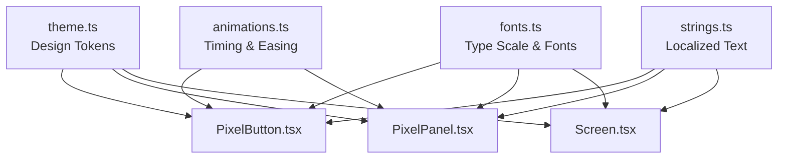
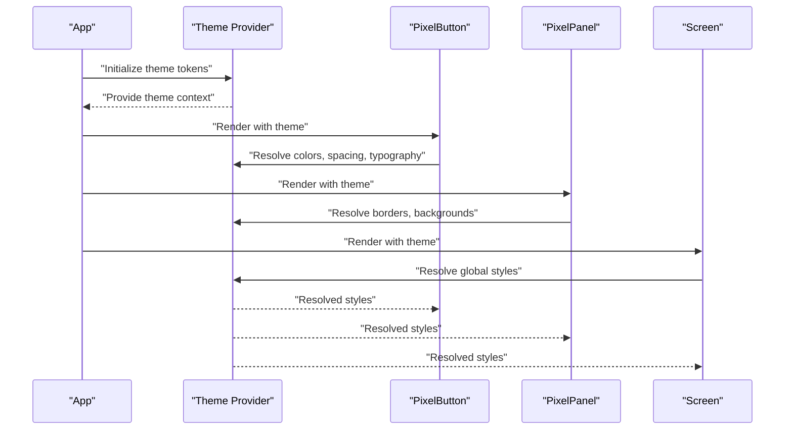
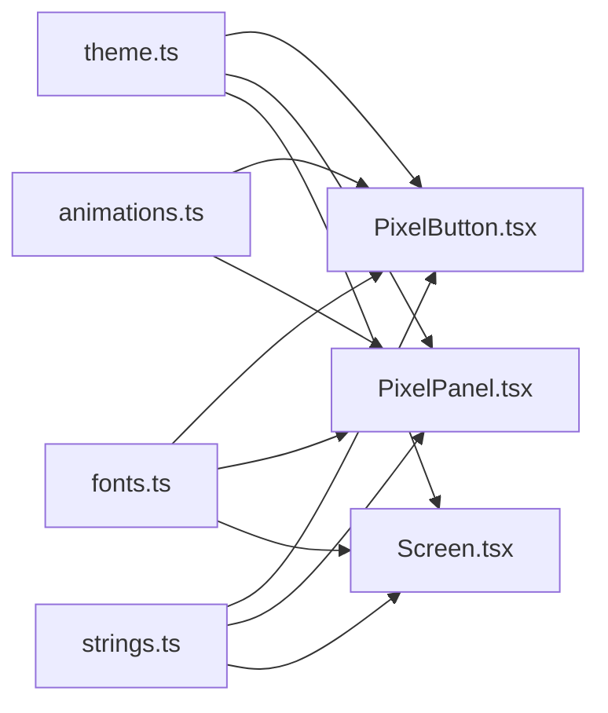

# Theme System

<cite>
**Referenced Files in This Document**
- [theme.ts](file://src/ui/theme.ts)
- [fonts.ts](file://src/ui/fonts.ts)
- [PixelButton.tsx](file://src/ui/PixelButton.tsx)
- [PixelPanel.tsx](file://src/ui/PixelPanel.tsx)
- [Screen.tsx](file://src/ui/Screen.tsx)
- [animations.ts](file://src/ui/animations.ts)
- [strings.ts](file://src/ui/strings.ts)
</cite>

## Table of Contents

1. [Introduction](#introduction)
2. [Project Structure](#project-structure)
3. [Core Components](#core-components)
4. [Architecture Overview](#architecture-overview)
5. [Detailed Component Analysis](#detailed-component-analysis)
6. [Dependency Analysis](#dependency-analysis)
7. [Performance Considerations](#performance-considerations)
8. [Troubleshooting Guide](#troubleshooting-guide)
9. [Conclusion](#conclusion)
10. [Appendices](#appendices)

## Introduction

This document explains the theme system that powers the pixel art visual style across the application. It covers how colors, fonts, spacing, and design tokens are defined and organized; how components consume theme values; and how to extend or customize themes while preserving the pixel aesthetic.

## Project Structure

The theme system is centered around a dedicated theme module and supporting UI primitives:

- Centralized theme definitions (colors, typography, spacing, borders, shadows, animation timings)
- Font configuration and pixel-safe type scales
- Pixel-aware UI components that consume theme tokens consistently
- Animation timing and easing aligned with the pixel art feel
- String localization resources for text content

**Diagram sources**

- [theme.ts](file://src/ui/theme.ts)
- [fonts.ts](file://src/ui/fonts.ts)
- [PixelButton.tsx](file://src/ui/PixelButton.tsx)
- [PixelPanel.tsx](file://src/ui/PixelPanel.tsx)
- [Screen.tsx](file://src/ui/Screen.tsx)
- [animations.ts](file://src/ui/animations.ts)
- [strings.ts](file://src/ui/strings.ts)

**Section sources**

- [theme.ts](file://src/ui/theme.ts)
- [fonts.ts](file://src/ui/fonts.ts)
- [PixelButton.tsx](file://src/ui/PixelButton.tsx)
- [PixelPanel.tsx](file://src/ui/PixelPanel.tsx)
- [Screen.tsx](file://src/ui/Screen.tsx)
- [animations.ts](file://src/ui/animations.ts)
- [strings.ts](file://src/ui/strings.ts)

## Core Components

- Theme token registry: centralizes color palettes, typography scales, spacing units, border radii, and animation timings.
- Font manager: defines pixel-friendly font families, sizes, weights, and line heights.
- Pixel UI primitives: buttons, panels, screens, and other components that read from the theme to render consistent visuals.
- Animation helpers: standardized durations and easing curves tuned for crisp pixel transitions.
- Strings: localized labels and messages consumed by UI components.

Key responsibilities:

- Provide a single source of truth for all visual tokens.
- Enforce pixel-perfect spacing and sizing.
- Ensure consistent typography and color usage across screens.
- Offer extension points for custom themes without breaking component contracts.

**Section sources**

- [theme.ts](file://src/ui/theme.ts)
- [fonts.ts](file://src/ui/fonts.ts)
- [PixelButton.tsx](file://src/ui/PixelButton.tsx)
- [PixelPanel.tsx](file://src/ui/PixelPanel.tsx)
- [Screen.tsx](file://src/ui/Screen.tsx)
- [animations.ts](file://src/ui/animations.ts)
- [strings.ts](file://src/ui/strings.ts)

## Architecture Overview

The theme system follows a token-driven architecture:

- Theme tokens are defined once and consumed by components via typed hooks or context.
- Components never hardcode colors, fonts, or spacing; they reference tokens.
- Custom themes override tokens at runtime or build time, enabling variants (e.g., high contrast, dark mode).
- Animations and strings remain decoupled from layout logic, improving maintainability.

**Diagram sources**

- [theme.ts](file://src/ui/theme.ts)
- [PixelButton.tsx](file://src/ui/PixelButton.tsx)
- [PixelPanel.tsx](file://src/ui/PixelPanel.tsx)
- [Screen.tsx](file://src/ui/Screen.tsx)

## Detailed Component Analysis

### Theme Token Registry

Purpose:

- Define and export all design tokens: colors, typography, spacing, borders, shadows, and animation timings.
- Maintain strict naming conventions and grouping for clarity and discoverability.
- Provide default values and optional overrides for customization.

Token categories:

- Colors: primary, secondary, background, surface, text, success, warning, error, and semantic overlays.
- Typography: font families, size scale, weight scale, line height, letter spacing.
- Spacing: base unit and derived scale for margins, paddings, gaps.
- Borders: radius, width, and style presets.
- Shadows: elevation levels optimized for pixel rendering.
- Animation: durations, delays, and easing curves suited for pixel motion.

Extension points:

- Merge partial theme objects to override specific tokens.
- Provide variant themes (e.g., high contrast) by composing over defaults.

Customization example outline:

- Create a new theme object that extends the default palette and typography.
- Replace selected tokens (e.g., primary color, spacing scale).
- Inject the theme into the app’s provider so components consume the new values.

**Section sources**

- [theme.ts](file://src/ui/theme.ts)

### Font Configuration

Purpose:

- Centralize font families, sizes, weights, and line heights.
- Ensure pixel-friendly scaling and readability.
- Expose type scales for headings, body, captions, and labels.

Key aspects:

- Pixel-safe font selection and fallbacks.
- Consistent baseline alignment and vertical rhythm.
- Type scale tied to spacing units for harmonious layouts.

Customization example outline:

- Add a new font family and map it to semantic roles (e.g., heading, body).
- Adjust size and line-height to preserve readability at small sizes.
- Re-export updated type scales for components to consume.

**Section sources**

- [fonts.ts](file://src/ui/fonts.ts)

### Pixel Button

Purpose:

- Render a button that adheres to theme tokens for colors, typography, spacing, and borders.
- Provide states (default, pressed, disabled) with consistent visual feedback.
- Support accessibility labels and keyboard navigation.

Consumed tokens:

- Background and text colors per state.
- Padding and gap tokens for internal spacing.
- Border radius and width for crisp edges.
- Typography tokens for label styling.

Behavior highlights:

- State transitions use animation timings from the theme.
- Focus and press states align with pixel grid constraints.

**Section sources**

- [PixelButton.tsx](file://src/ui/PixelButton.tsx)
- [theme.ts](file://src/ui/theme.ts)
- [fonts.ts](file://src/ui/fonts.ts)
- [animations.ts](file://src/ui/animations.ts)

### Pixel Panel

Purpose:

- Container component that applies theme-based backgrounds, borders, and padding.
- Provides consistent card-like surfaces across the app.

Consumed tokens:

- Surface and border colors.
- Spacing tokens for inner padding.
- Shadow tokens for elevation.

Usage guidance:

- Wrap grouped controls or content within a panel for visual hierarchy.
- Combine with buttons and lists to form cohesive sections.

**Section sources**

- [PixelPanel.tsx](file://src/ui/PixelPanel.tsx)
- [theme.ts](file://src/ui/theme.ts)

### Screen

Purpose:

- Top-level screen wrapper applying global theme styles, safe areas, and background.
- Ensures consistent layout behavior across devices.

Consumed tokens:

- Background color and typography defaults.
- Safe area insets and spacing tokens.

**Section sources**

- [Screen.tsx](file://src/ui/Screen.tsx)
- [theme.ts](file://src/ui/theme.ts)
- [fonts.ts](file://src/ui/fonts.ts)

### Animations

Purpose:

- Standardize durations and easing curves for pixel-friendly motion.
- Keep animations snappy and aligned with the pixel aesthetic.

Key aspects:

- Short durations for micro-interactions.
- Linear or step-like easing where appropriate to emphasize pixel movement.

**Section sources**

- [animations.ts](file://src/ui/animations.ts)

### Strings

Purpose:

- Centralize localized text for UI elements.
- Keep components free of hardcoded strings.

**Section sources**

- [strings.ts](file://src/ui/strings.ts)

## Dependency Analysis

Components depend on theme tokens rather than concrete values, reducing coupling and enabling easy overrides.

**Diagram sources**

- [theme.ts](file://src/ui/theme.ts)
- [fonts.ts](file://src/ui/fonts.ts)
- [PixelButton.tsx](file://src/ui/PixelButton.tsx)
- [PixelPanel.tsx](file://src/ui/PixelPanel.tsx)
- [Screen.tsx](file://src/ui/Screen.tsx)
- [animations.ts](file://src/ui/animations.ts)
- [strings.ts](file://src/ui/strings.ts)

**Section sources**

- [theme.ts](file://src/ui/theme.ts)
- [fonts.ts](file://src/ui/fonts.ts)
- [PixelButton.tsx](file://src/ui/PixelButton.tsx)
- [PixelPanel.tsx](file://src/ui/PixelPanel.tsx)
- [Screen.tsx](file://src/ui/Screen.tsx)
- [animations.ts](file://src/ui/animations.ts)
- [strings.ts](file://src/ui/strings.ts)

## Performance Considerations

- Prefer static token resolution at render boundaries to avoid unnecessary recompositions.
- Use memoization for computed styles derived from theme tokens.
- Keep animation durations short to maintain responsiveness on low-power devices.
- Avoid heavy font loading; preload only necessary glyph sets for pixel fonts.

[No sources needed since this section provides general guidance]

## Troubleshooting Guide

Common issues and resolutions:

- Colors not updating after theme change: ensure the theme provider wraps the component tree and that components consume tokens through the correct hook/context.
- Misaligned pixel edges: verify spacing and border tokens are multiples of the base pixel unit.
- Blurry text: confirm font families support pixel rendering and that sizes are integer pixels.
- Inconsistent button states: check that state-specific tokens are defined and applied in order.

**Section sources**

- [theme.ts](file://src/ui/theme.ts)
- [PixelButton.tsx](file://src/ui/PixelButton.tsx)
- [fonts.ts](file://src/ui/fonts.ts)

## Conclusion

The theme system centralizes design decisions for colors, typography, spacing, and motion, enabling consistent pixel art visuals across the app. By consuming tokens instead of hardcoding values, components remain flexible and easy to customize. Extending or overriding themes is straightforward: compose new token sets and inject them at the provider level, ensuring all components automatically adopt the new look while preserving the pixel aesthetic.

[No sources needed since this section summarizes without analyzing specific files]

## Appendices

### Creating a Custom Theme

Steps:

- Import the default theme and define a new theme object.
- Override specific tokens (e.g., primary color, spacing scale, font family).
- Compose additional variants if needed (e.g., high contrast).
- Provide the custom theme at the app root so components consume it.

Best practices:

- Keep token names stable to avoid breaking changes.
- Maintain pixel-aligned spacing and sizing.
- Test across devices to ensure readability and contrast.

**Section sources**

- [theme.ts](file://src/ui/theme.ts)
- [fonts.ts](file://src/ui/fonts.ts)

### Overriding Default Styles While Preserving Pixel Aesthetic

Guidelines:

- Preserve integer pixel dimensions for borders, gaps, and icon sizes.
- Use semantic color tokens to keep contrast ratios accessible.
- Retain crisp typography by selecting pixel-friendly fonts and sizes.
- Validate animations with short durations and step-like easing.

**Section sources**

- [theme.ts](file://src/ui/theme.ts)
- [PixelButton.tsx](file://src/ui/PixelButton.tsx)
- [PixelPanel.tsx](file://src/ui/PixelPanel.tsx)
- [Screen.tsx](file://src/ui/Screen.tsx)
- [animations.ts](file://src/ui/animations.ts)
- [fonts.ts](file://src/ui/fonts.ts)
