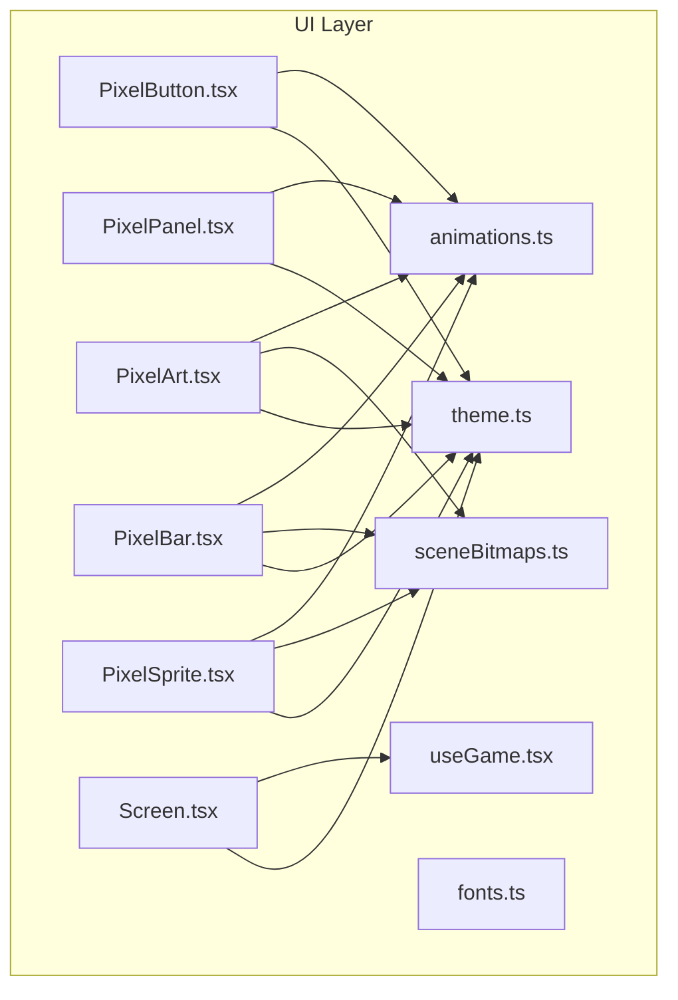
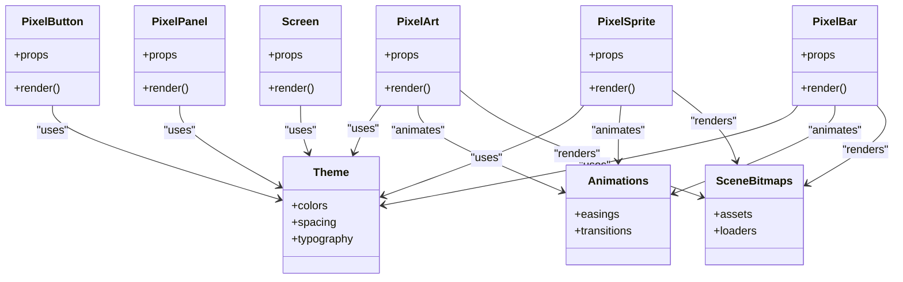
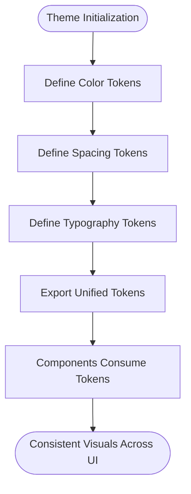
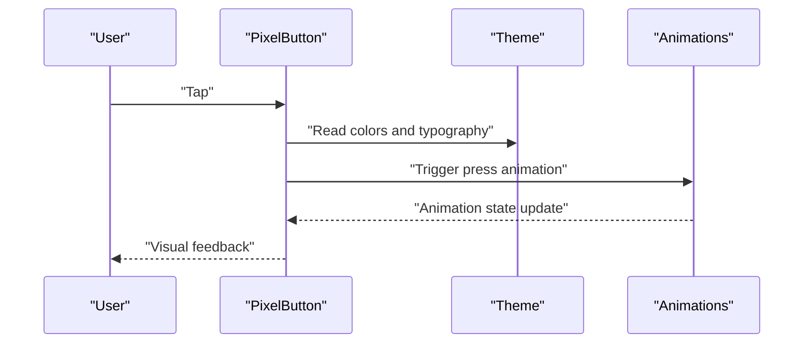
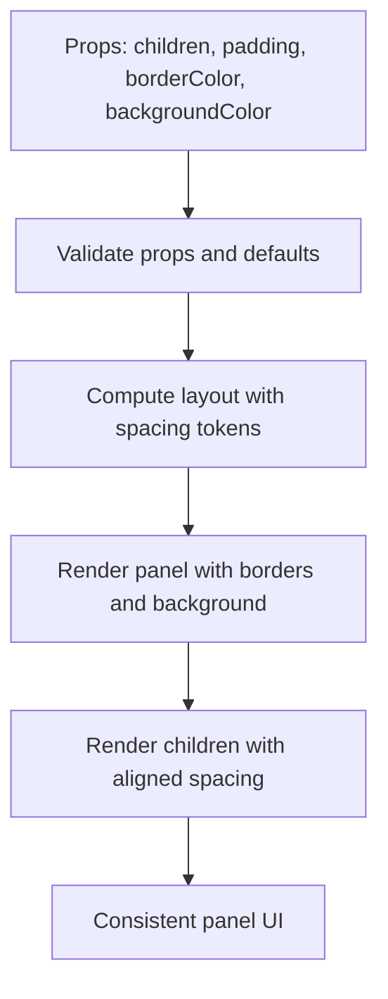
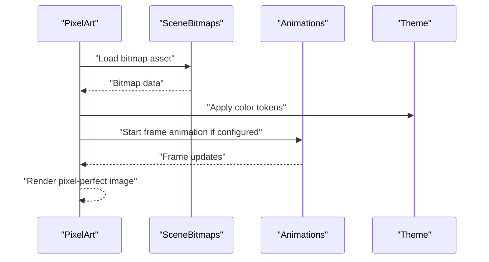
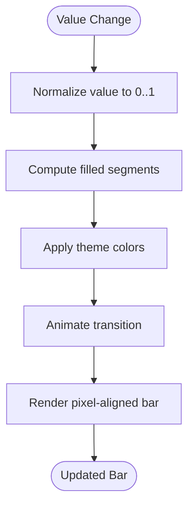
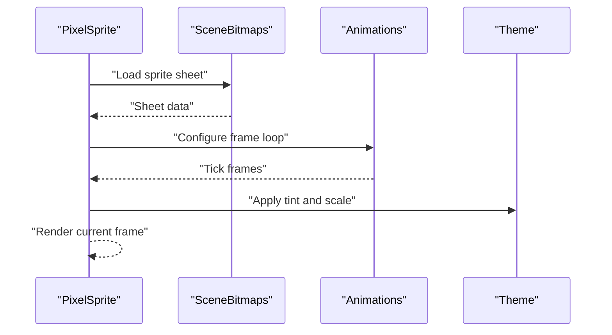
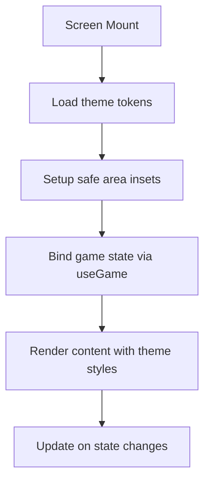
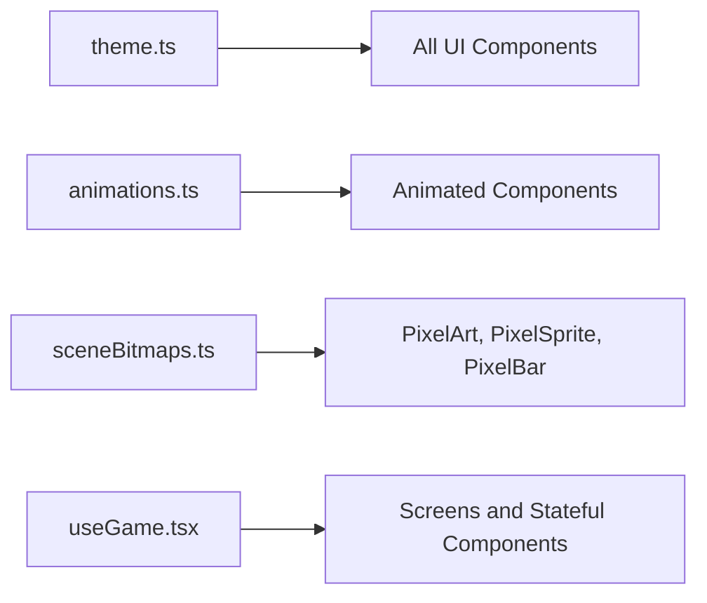

# UI Component System

<cite>
**Referenced Files in This Document**
- [theme.ts](file://src/ui/theme.ts)
- [PixelButton.tsx](file://src/ui/PixelButton.tsx)
- [PixelPanel.tsx](file://src/ui/PixelPanel.tsx)
- [animations.ts](file://src/ui/animations.ts)
- [fonts.ts](file://src/ui/fonts.ts)
- [PixelArt.tsx](file://src/ui/PixelArt.tsx)
- [PixelBar.tsx](file://src/ui/PixelBar.tsx)
- [PixelSprite.tsx](file://src/ui/PixelSprite.tsx)
- [Screen.tsx](file://src/ui/Screen.tsx)
- [useGame.tsx](file://src/ui/useGame.tsx)
- [sceneBitmaps.ts](file://src/ui/sceneBitmaps.ts)
</cite>

## Table of Contents

1. [Introduction](#introduction)
2. [Project Structure](#project-structure)
3. [Core Components](#core-components)
4. [Architecture Overview](#architecture-overview)
5. [Detailed Component Analysis](#detailed-component-analysis)
6. [Dependency Analysis](#dependency-analysis)
7. [Performance Considerations](#performance-considerations)
8. [Troubleshooting Guide](#troubleshooting-guide)
9. [Conclusion](#conclusion)
10. [Appendices](#appendices)

## Introduction

This document explains the custom UI component system built on top of React Native for a pixel-art themed game. It covers the theme system, reusable components such as PixelButton and PixelPanel, animation implementation, styling approaches, and composition patterns that ensure visual consistency across screens. It also provides guidance for creating new pixel-art components that integrate seamlessly with the game’s visual style.

## Project Structure

The UI layer is organized under src/ui and includes:

- Theme and fonts definitions
- Reusable pixel-art components (buttons, panels, bars, sprites, art)
- Animation utilities and hooks
- Scene assets and helpers
- Screen wrapper and game integration hooks

**Diagram sources**

- [theme.ts](file://src/ui/theme.ts)
- [fonts.ts](file://src/ui/fonts.ts)
- [animations.ts](file://src/ui/animations.ts)
- [sceneBitmaps.ts](file://src/ui/sceneBitmaps.ts)
- [PixelButton.tsx](file://src/ui/PixelButton.tsx)
- [PixelPanel.tsx](file://src/ui/PixelPanel.tsx)
- [PixelArt.tsx](file://src/ui/PixelArt.tsx)
- [PixelBar.tsx](file://src/ui/PixelBar.tsx)
- [PixelSprite.tsx](file://src/ui/PixelSprite.tsx)
- [Screen.tsx](file://src/ui/Screen.tsx)
- [useGame.tsx](file://src/ui/useGame.tsx)

**Section sources**

- [theme.ts](file://src/ui/theme.ts)
- [PixelButton.tsx](file://src/ui/PixelButton.tsx)
- [PixelPanel.tsx](file://src/ui/PixelPanel.tsx)
- [animations.ts](file://src/ui/animations.ts)
- [fonts.ts](file://src/ui/fonts.ts)
- [PixelArt.tsx](file://src/ui/PixelArt.tsx)
- [PixelBar.tsx](file://src/ui/PixelBar.tsx)
- [PixelSprite.tsx](file://src/ui/PixelSprite.tsx)
- [Screen.tsx](file://src/ui/Screen.tsx)
- [useGame.tsx](file://src/ui/useGame.tsx)
- [sceneBitmaps.ts](file://src/ui/sceneBitmaps.ts)

## Core Components

- PixelButton: A pixel-styled button with consistent borders, typography, and press feedback. It uses the theme colors and font settings to maintain the pixel-art aesthetic.
- PixelPanel: A container with pixel-aligned padding, borders, and background color from the theme. It composes other components while preserving spacing and alignment rules.
- PixelArt: Renders pixel-art images or bitmaps with crisp edges and optional animations.
- PixelBar: Displays progress or health bars using pixel-aligned segments and theme colors.
- PixelSprite: Renders sprite sheets or animated sequences with frame control and timing.
- Screen: A base screen wrapper that applies theme-aware backgrounds, safe areas, and common layout behaviors.

These components share a unified design token set defined in the theme file, ensuring consistent colors, spacing, and typography across the app.

**Section sources**

- [PixelButton.tsx](file://src/ui/PixelButton.tsx)
- [PixelPanel.tsx](file://src/ui/PixelPanel.tsx)
- [PixelArt.tsx](file://src/ui/PixelArt.tsx)
- [PixelBar.tsx](file://src/ui/PixelBar.tsx)
- [PixelSprite.tsx](file://src/ui/PixelSprite.tsx)
- [Screen.tsx](file://src/ui/Screen.tsx)
- [theme.ts](file://src/ui/theme.ts)

## Architecture Overview

The UI architecture centers around a theme-driven approach:

- Theme tokens define colors, spacing, and typography used by all components.
- Reusable components consume these tokens to render consistent visuals.
- Animations are provided via shared utilities and hooks, enabling smooth transitions without duplicating logic.
- Scene assets (bitmaps/sprites) are centralized for reuse across components.

**Diagram sources**

- [theme.ts](file://src/ui/theme.ts)
- [PixelButton.tsx](file://src/ui/PixelButton.tsx)
- [PixelPanel.tsx](file://src/ui/PixelPanel.tsx)
- [PixelArt.tsx](file://src/ui/PixelArt.tsx)
- [PixelBar.tsx](file://src/ui/PixelBar.tsx)
- [PixelSprite.tsx](file://src/ui/PixelSprite.tsx)
- [Screen.tsx](file://src/ui/Screen.tsx)
- [animations.ts](file://src/ui/animations.ts)
- [sceneBitmaps.ts](file://src/ui/sceneBitmaps.ts)

## Detailed Component Analysis

### Theme System

The theme defines:

- Colors: primary, secondary, background, text, border, and semantic variants
- Spacing: consistent margins, paddings, and gaps
- Typography: pixel-friendly fonts and sizes

Components read these tokens to ensure uniform appearance. The theme acts as the single source of truth for visual consistency.

**Diagram sources**

- [theme.ts](file://src/ui/theme.ts)

**Section sources**

- [theme.ts](file://src/ui/theme.ts)

### PixelButton

PixelButton encapsulates:

- Press states with subtle scale or color changes
- Border and background colors from the theme
- Text rendering with pixel-appropriate font settings
- Accessibility labels and focus behavior

It composes well within PixelPanel and other containers while maintaining alignment and spacing.

**Diagram sources**

- [PixelButton.tsx](file://src/ui/PixelButton.tsx)
- [theme.ts](file://src/ui/theme.ts)
- [animations.ts](file://src/ui/animations.ts)

**Section sources**

- [PixelButton.tsx](file://src/ui/PixelButton.tsx)
- [theme.ts](file://src/ui/theme.ts)
- [animations.ts](file://src/ui/animations.ts)

### PixelPanel

PixelPanel provides:

- Consistent padding and border styles
- Background color and contrast management
- Layout constraints for child components
- Optional scrollable content area

It ensures child elements align to the pixel grid and respect spacing tokens.

**Diagram sources**

- [PixelPanel.tsx](file://src/ui/PixelPanel.tsx)
- [theme.ts](file://src/ui/theme.ts)

**Section sources**

- [PixelPanel.tsx](file://src/ui/PixelPanel.tsx)
- [theme.ts](file://src/ui/theme.ts)

### PixelArt

PixelArt renders pixel-art images or bitmaps with:

- Crisp scaling and anti-aliasing disabled for pixel-perfect display
- Optional animation frames and transitions
- Integration with scene bitmap assets

It leverages the theme for color overlays and masks when needed.

**Diagram sources**

- [PixelArt.tsx](file://src/ui/PixelArt.tsx)
- [sceneBitmaps.ts](file://src/ui/sceneBitmaps.ts)
- [animations.ts](file://src/ui/animations.ts)
- [theme.ts](file://src/ui/theme.ts)

**Section sources**

- [PixelArt.tsx](file://src/ui/PixelArt.tsx)
- [sceneBitmaps.ts](file://src/ui/sceneBitmaps.ts)
- [animations.ts](file://src/ui/animations.ts)
- [theme.ts](file://src/ui/theme.ts)

### PixelBar

PixelBar displays progress or health with:

- Segment-based rendering aligned to the pixel grid
- Theme colors for fill and track
- Smooth transitions for value changes

It can animate width or segment count changes for feedback.

**Diagram sources**

- [PixelBar.tsx](file://src/ui/PixelBar.tsx)
- [theme.ts](file://src/ui/theme.ts)
- [animations.ts](file://src/ui/animations.ts)

**Section sources**

- [PixelBar.tsx](file://src/ui/PixelBar.tsx)
- [theme.ts](file://src/ui/theme.ts)
- [animations.ts](file://src/ui/animations.ts)

### PixelSprite

PixelSprite handles:

- Sprite sheet loading and frame indexing
- Frame timing and looping
- Optional scaling and tinting via theme colors

It integrates with animations for walk cycles or action sequences.

**Diagram sources**

- [PixelSprite.tsx](file://src/ui/PixelSprite.tsx)
- [sceneBitmaps.ts](file://src/ui/sceneBitmaps.ts)
- [animations.ts](file://src/ui/animations.ts)
- [theme.ts](file://src/ui/theme.ts)

**Section sources**

- [PixelSprite.tsx](file://src/ui/PixelSprite.tsx)
- [sceneBitmaps.ts](file://src/ui/sceneBitmaps.ts)
- [animations.ts](file://src/ui/animations.ts)
- [theme.ts](file://src/ui/theme.ts)

### Screen Wrapper

Screen provides:

- Theme-aware background and safe area handling
- Common layout structure for game screens
- Integration with game state via useGame hook

It standardizes how screens present content consistently.

**Diagram sources**

- [Screen.tsx](file://src/ui/Screen.tsx)
- [useGame.tsx](file://src/ui/useGame.tsx)
- [theme.ts](file://src/ui/theme.ts)

**Section sources**

- [Screen.tsx](file://src/ui/Screen.tsx)
- [useGame.tsx](file://src/ui/useGame.tsx)
- [theme.ts](file://src/ui/theme.ts)

## Dependency Analysis

The UI components depend on:

- Theme tokens for consistent styling
- Animations for motion and transitions
- Scene bitmaps for visual assets
- Game state hooks for dynamic behavior

**Diagram sources**

- [theme.ts](file://src/ui/theme.ts)
- [animations.ts](file://src/ui/animations.ts)
- [sceneBitmaps.ts](file://src/ui/sceneBitmaps.ts)
- [useGame.tsx](file://src/ui/useGame.tsx)

**Section sources**

- [theme.ts](file://src/ui/theme.ts)
- [animations.ts](file://src/ui/animations.ts)
- [sceneBitmaps.ts](file://src/ui/sceneBitmaps.ts)
- [useGame.tsx](file://src/ui/useGame.tsx)

## Performance Considerations

- Use memoization for expensive computations in components that frequently re-render.
- Prefer immutable props and stable references to avoid unnecessary re-renders.
- Optimize bitmap loading and caching to reduce memory usage during animations.
- Keep animation durations short and use hardware-accelerated properties where possible.
- Avoid heavy layouts inside pixel components; prefer fixed dimensions and minimal nesting.

[No sources needed since this section provides general guidance]

## Troubleshooting Guide

Common issues and resolutions:

- Misaligned pixels: Ensure scaling is set to integer multiples and disable anti-aliasing for crisp edges.
- Inconsistent colors: Verify theme tokens are correctly imported and not overridden locally.
- Stuttering animations: Check frame rates and simplify complex transitions; consider reducing asset sizes.
- Memory leaks: Unsubscribe from listeners and clear timers in component cleanup.
- Font rendering issues: Confirm pixel-friendly fonts are loaded and sized appropriately.

**Section sources**

- [theme.ts](file://src/ui/theme.ts)
- [animations.ts](file://src/ui/animations.ts)
- [fonts.ts](file://src/ui/fonts.ts)

## Conclusion

The UI component system leverages a strong theme foundation and reusable pixel-art components to deliver a cohesive visual experience. By centralizing design tokens, animations, and assets, it ensures consistency and simplifies the creation of new components that fit the game’s aesthetic. Following the patterns outlined here will help maintain quality and performance across the application.

[No sources needed since this section summarizes without analyzing specific files]

## Appendices

### Creating Custom Pixel-Art Components

Steps to build a new component:

- Define or extend theme tokens for colors, spacing, and typography.
- Compose existing components like PixelPanel and PixelButton for layout and interaction.
- Use PixelArt or PixelSprite for visual assets, integrating with sceneBitmaps.
- Apply animations via the shared animations utilities for smooth transitions.
- Test on multiple devices to ensure pixel-perfect rendering and accessibility.

Example pattern:

- Create a container using PixelPanel with theme colors and spacing.
- Add interactive elements with PixelButton and accessible labels.
- Render visuals with PixelArt or PixelSprite, applying theme tints.
- Wire up state via useGame hook for dynamic behavior.

[No sources needed since this section provides general guidance]
