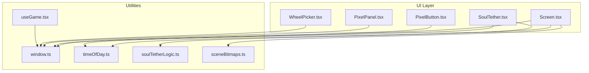
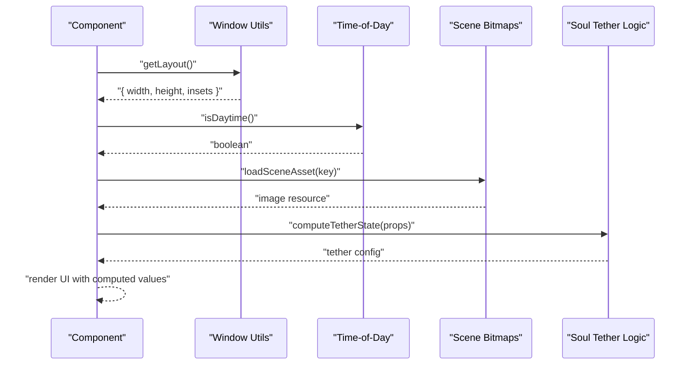
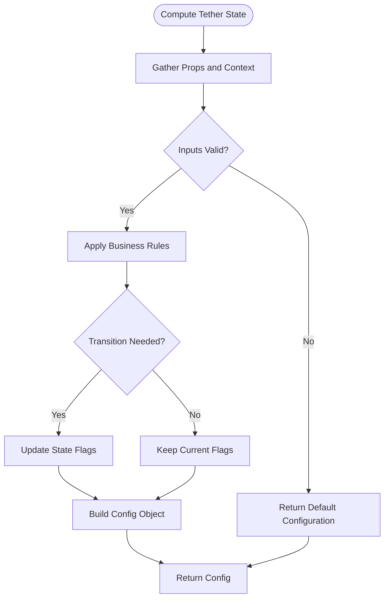
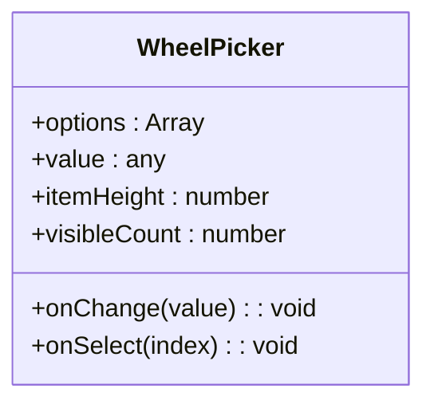
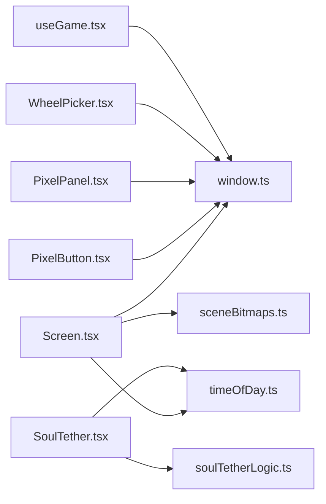

# UI Utilities and Helpers

<cite>
**Referenced Files in This Document**
- [window.ts](file://src/ui/window.ts)
- [timeOfDay.ts](file://src/ui/timeOfDay.ts)
- [soulTetherLogic.ts](file://src/ui/soulTetherLogic.ts)
- [sceneBitmaps.ts](file://src/ui/sceneBitmaps.ts)
- [WheelPicker.tsx](file://src/ui/WheelPicker.tsx)
- [SoulTether.tsx](file://src/ui/SoulTether.tsx)
- [useGame.tsx](file://src/ui/useGame.tsx)
- [PixelButton.tsx](file://src/ui/PixelButton.tsx)
- [PixelPanel.tsx](file://src/ui/PixelPanel.tsx)
- [Screen.tsx](file://src/ui/Screen.tsx)
</cite>

## Table of Contents

1. [Introduction](#introduction)
2. [Project Structure](#project-structure)
3. [Core Components](#core-components)
4. [Architecture Overview](#architecture-overview)
5. [Detailed Component Analysis](#detailed-component-analysis)
6. [Dependency Analysis](#dependency-analysis)
7. [Performance Considerations](#performance-considerations)
8. [Troubleshooting Guide](#troubleshooting-guide)
9. [Conclusion](#conclusion)

## Introduction

This document explains the utility functions and helper components that power the UI system. It focuses on window management utilities, time-of-day calculations, soul tether logic, scene bitmap handling, and specialized components like WheelPicker. These modules abstract complex functionality and provide reusable logic for the UI layer, enabling consistent behavior across screens and scenes.

## Project Structure

The UI utilities live under src/ui and are consumed by screens and other UI components. Key areas:

- Window management: sizing, safe area, and layout helpers
- Time utilities: deriving day/night state from current time
- Soul tether logic: rules and computations for tether visuals and interactions
- Scene bitmaps: loading and managing scene assets
- Specialized components: interactive controls and visual elements built on top of these utilities

**Diagram sources**

- [Screen.tsx](file://src/ui/Screen.tsx)
- [PixelButton.tsx](file://src/ui/PixelButton.tsx)
- [PixelPanel.tsx](file://src/ui/PixelPanel.tsx)
- [WheelPicker.tsx](file://src/ui/WheelPicker.tsx)
- [SoulTether.tsx](file://src/ui/SoulTether.tsx)
- [window.ts](file://src/ui/window.ts)
- [timeOfDay.ts](file://src/ui/timeOfDay.ts)
- [soulTetherLogic.ts](file://src/ui/soulTetherLogic.ts)
- [sceneBitmaps.ts](file://src/ui/sceneBitmaps.ts)
- [useGame.tsx](file://src/ui/useGame.tsx)

**Section sources**

- [window.ts](file://src/ui/window.ts)
- [timeOfDay.ts](file://src/ui/timeOfDay.ts)
- [soulTetherLogic.ts](file://src/ui/soulTetherLogic.ts)
- [sceneBitmaps.ts](file://src/ui/sceneBitmaps.ts)
- [WheelPicker.tsx](file://src/ui/WheelPicker.tsx)
- [SoulTether.tsx](file://src/ui/SoulTether.tsx)
- [useGame.tsx](file://src/ui/useGame.tsx)
- [PixelButton.tsx](file://src/ui/PixelButton.tsx)
- [PixelPanel.tsx](file://src/ui/PixelPanel.tsx)
- [Screen.tsx](file://src/ui/Screen.tsx)

## Core Components

- Window management utilities: Provide screen dimensions, safe area insets, and layout helpers to ensure consistent rendering across devices.
- Time-of-day calculations: Derive whether it is day or night based on the current time, used to adjust backgrounds and lighting.
- Soul tether logic: Encapsulates rules for tether state transitions and visual properties.
- Scene bitmap handling: Centralizes loading and caching of scene-related images for performance and consistency.
- WheelPicker component: A reusable picker control with smooth selection and accessibility features.
- SoulTether component: Visual representation of the tether using the logic module and time-of-day context.

These utilities are designed to be pure where possible, making them easy to test and reuse across the UI.

**Section sources**

- [window.ts](file://src/ui/window.ts)
- [timeOfDay.ts](file://src/ui/timeOfDay.ts)
- [soulTetherLogic.ts](file://src/ui/soulTetherLogic.ts)
- [sceneBitmaps.ts](file://src/ui/sceneBitmaps.ts)
- [WheelPicker.tsx](file://src/ui/WheelPicker.tsx)
- [SoulTether.tsx](file://src/ui/SoulTether.tsx)

## Architecture Overview

The UI architecture separates concerns between presentation (components) and logic (utilities). Components consume utilities via props, hooks, or direct imports. This keeps components lightweight and focused on rendering and user interaction.

**Diagram sources**

- [window.ts](file://src/ui/window.ts)
- [timeOfDay.ts](file://src/ui/timeOfDay.ts)
- [sceneBitmaps.ts](file://src/ui/sceneBitmaps.ts)
- [soulTetherLogic.ts](file://src/ui/soulTetherLogic.ts)

## Detailed Component Analysis

### Window Management Utilities

Purpose:

- Provide normalized screen metrics and safe area insets.
- Offer helpers for responsive layout decisions.

Key responsibilities:

- Measure device dimensions and orientation changes.
- Expose safe area insets to avoid notches and status bars.
- Supply layout constants for pixel-perfect rendering.

Usage patterns:

- Import the window module and call layout helpers at render time.
- Use insets to pad content and avoid overlapping system UI.

Example usage in a custom component:

- Read layout dimensions to compute positions and sizes.
- Apply insets when positioning overlays or bottom sheets.

**Section sources**

- [window.ts](file://src/ui/window.ts)
- [Screen.tsx](file://src/ui/Screen.tsx)
- [PixelButton.tsx](file://src/ui/PixelButton.tsx)
- [PixelPanel.tsx](file://src/ui/PixelPanel.tsx)

### Time-of-Day Calculations

Purpose:

- Determine whether the current time falls within daytime or nighttime ranges.
- Provide derived values for UI themes and background selection.

Key responsibilities:

- Compute boolean flags for day/night states.
- Optionally expose transition windows for smoother theme switching.

Usage patterns:

- Call the time-of-day function during render or in a hook to react to time changes.
- Use the result to select backgrounds, colors, or scene elements.

Example usage in a custom component:

- Toggle background color or asset based on the returned flag.
- Adjust contrast or brightness for readability.

**Section sources**

- [timeOfDay.ts](file://src/ui/timeOfDay.ts)
- [SoulTether.tsx](file://src/ui/SoulTether.tsx)

### Soul Tether Logic

Purpose:

- Encapsulate rules governing tether state transitions and visual configuration.
- Keep UI components free of complex conditional logic.

Key responsibilities:

- Accept component props and environment state.
- Return a deterministic tether configuration object.
- Handle edge cases such as missing data or invalid inputs.

Usage patterns:

- Import the logic module and pass relevant props.
- Render the SoulTether component with the computed configuration.

Example usage in a custom component:

- Compute tether state once per render cycle.
- Pass the result to the visual component for display.

**Diagram sources**

- [soulTetherLogic.ts](file://src/ui/soulTetherLogic.ts)

**Section sources**

- [soulTetherLogic.ts](file://src/ui/soulTetherLogic.ts)
- [SoulTether.tsx](file://src/ui/SoulTether.tsx)

### Scene Bitmap Handling

Purpose:

- Centralize loading and caching of scene-related images.
- Ensure consistent asset resolution across components.

Key responsibilities:

- Map logical keys to actual image resources.
- Cache results to avoid repeated loads.
- Provide error handling for missing assets.

Usage patterns:

- Request an asset by key; receive a resolved image reference.
- Use the resolved image in rendering pipelines.

Example usage in a custom component:

- Load a background or banner asset before rendering.
- Display fallback placeholders if assets fail to load.

**Section sources**

- [sceneBitmaps.ts](file://src/ui/sceneBitmaps.ts)

### WheelPicker Component

Purpose:

- Provide a reusable wheel-style picker for selecting values from a list.
- Support smooth scrolling, keyboard navigation, and accessibility.

Key responsibilities:

- Manage selected index and scroll position.
- Render items with proper spacing and alignment.
- Emit selection events to parent components.

Usage patterns:

- Pass an array of options and a value change handler.
- Configure item height and visible count for desired UX.

Example usage in a custom component:

- Wrap the picker with labels and validation feedback.
- Integrate with form state to persist selections.

**Diagram sources**

- [WheelPicker.tsx](file://src/ui/WheelPicker.tsx)

**Section sources**

- [WheelPicker.tsx](file://src/ui/WheelPicker.tsx)

### SoulTether Component

Purpose:

- Render the tether visualization using computed logic and time-of-day context.
- Abstract rendering details so consumers only supply state.

Key responsibilities:

- Consume tether configuration from the logic module.
- Adapt visuals based on day/night state.
- Provide animation hooks for smooth transitions.

Usage patterns:

- Compute tether configuration and pass it as props.
- Let the component handle drawing and animations.

Example usage in a custom component:

- Combine window layout and time-of-day to position the tether correctly.
- React to state changes to trigger updates.

**Section sources**

- [SoulTether.tsx](file://src/ui/SoulTether.tsx)
- [soulTetherLogic.ts](file://src/ui/soulTetherLogic.ts)
- [timeOfDay.ts](file://src/ui/timeOfDay.ts)

### Integration with useGame Hook

Purpose:

- Bridge game state and UI components through a shared hook.
- Provide access to window utilities and other helpers consistently.

Key responsibilities:

- Expose layout and time-of-day values derived from global state.
- Normalize data shapes for UI consumption.

Usage patterns:

- Use the hook in components to get consistent values.
- Avoid duplicating logic across screens.

**Section sources**

- [useGame.tsx](file://src/ui/useGame.tsx)
- [window.ts](file://src/ui/window.ts)
- [timeOfDay.ts](file://src/ui/timeOfDay.ts)

## Dependency Analysis

The following diagram shows how UI components depend on utilities:

**Diagram sources**

- [Screen.tsx](file://src/ui/Screen.tsx)
- [PixelButton.tsx](file://src/ui/PixelButton.tsx)
- [PixelPanel.tsx](file://src/ui/PixelPanel.tsx)
- [WheelPicker.tsx](file://src/ui/WheelPicker.tsx)
- [SoulTether.tsx](file://src/ui/SoulTether.tsx)
- [useGame.tsx](file://src/ui/useGame.tsx)
- [window.ts](file://src/ui/window.ts)
- [timeOfDay.ts](file://src/ui/timeOfDay.ts)
- [soulTetherLogic.ts](file://src/ui/soulTetherLogic.ts)
- [sceneBitmaps.ts](file://src/ui/sceneBitmaps.ts)

**Section sources**

- [window.ts](file://src/ui/window.ts)
- [timeOfDay.ts](file://src/ui/timeOfDay.ts)
- [soulTetherLogic.ts](file://src/ui/soulTetherLogic.ts)
- [sceneBitmaps.ts](file://src/ui/sceneBitmaps.ts)
- [WheelPicker.tsx](file://src/ui/WheelPicker.tsx)
- [SoulTether.tsx](file://src/ui/SoulTether.tsx)
- [useGame.tsx](file://src/ui/useGame.tsx)
- [PixelButton.tsx](file://src/ui/PixelButton.tsx)
- [PixelPanel.tsx](file://src/ui/PixelPanel.tsx)
- [Screen.tsx](file://src/ui/Screen.tsx)

## Performance Considerations

- Memoize expensive computations in utility functions to avoid re-renders.
- Cache scene bitmaps to prevent repeated asset loading.
- Use hooks to derive values efficiently and minimize unnecessary recalculations.
- Prefer pure functions in logic modules to enable predictable performance and easier testing.

## Troubleshooting Guide

Common issues and resolutions:

- Incorrect layout due to missing safe area: Ensure insets are applied consistently using window utilities.
- Day/night mismatch: Verify time-of-day function returns expected values for the current timezone and device settings.
- Tether visuals not updating: Confirm that tether logic receives updated props and that state transitions are triggered.
- Missing scene assets: Check bitmap keys and fallback handling; log errors when assets fail to resolve.

[No sources needed since this section provides general guidance]

## Conclusion

The UI utilities and helpers encapsulate core responsibilities such as window management, time-of-day calculations, soul tether logic, and scene bitmap handling. By centralizing these concerns, the UI layer remains clean, maintainable, and performant. Reusable components like WheelPicker and SoulTether build on these utilities to deliver consistent experiences across the application.

[No sources needed since this section summarizes without analyzing specific files]
