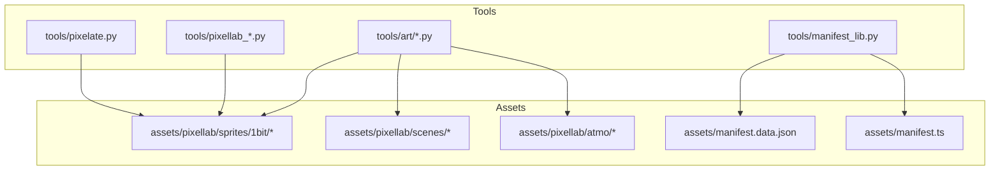
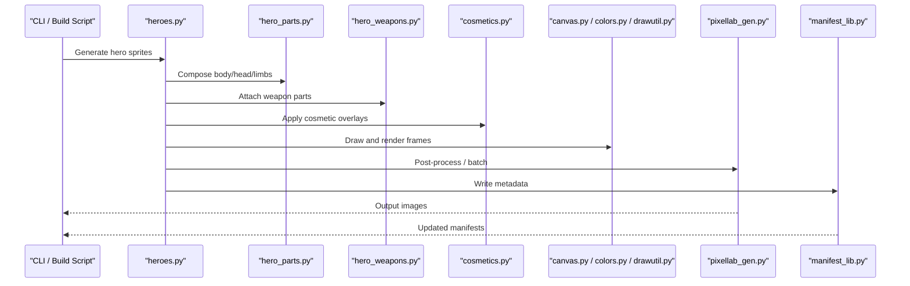
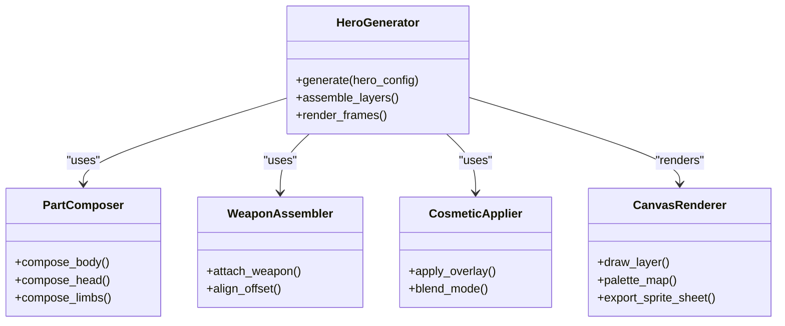
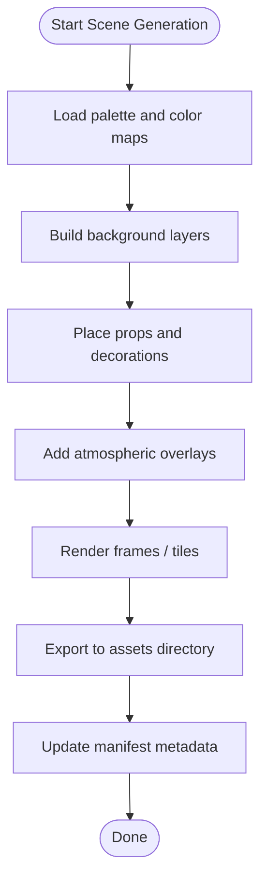
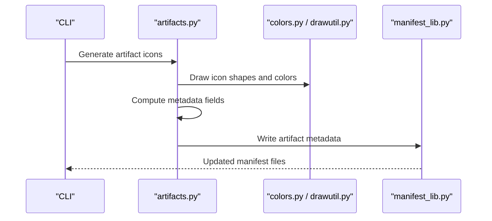
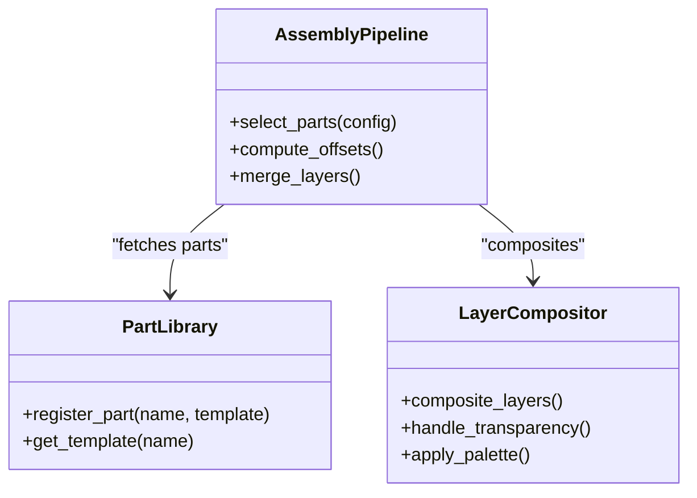
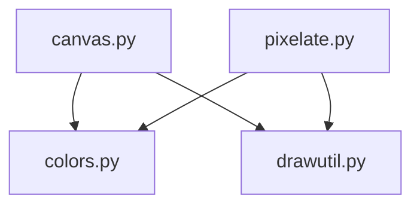
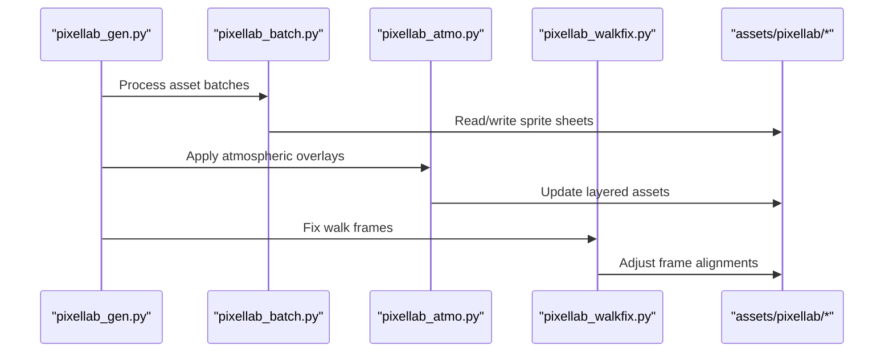
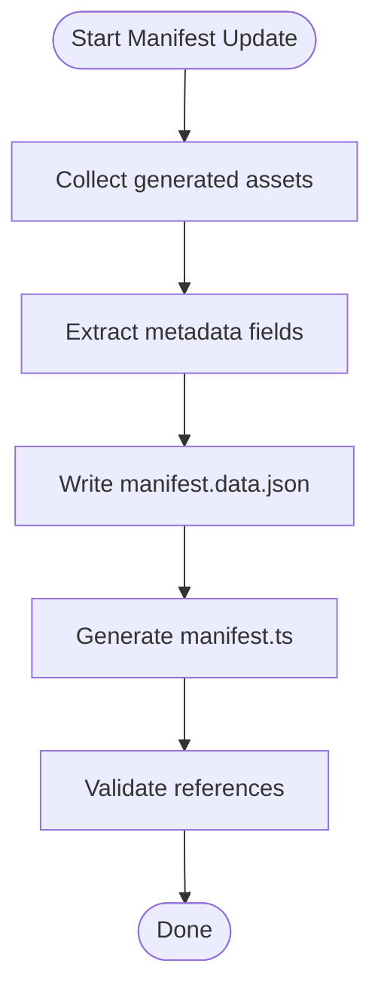
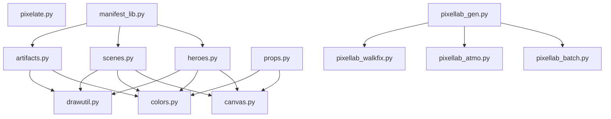

# Asset Generators

<cite>
**Referenced Files in This Document**
- [tools/art/heroes.py](file://tools/art/heroes.py)
- [tools/art/hero_parts.py](file://tools/art/hero_parts.py)
- [tools/art/hero_weapons.py](file://tools/art/hero_weapons.py)
- [tools/art/cosmetics.py](file://tools/art/cosmetics.py)
- [tools/art/hero_defs.py](file://tools/art/hero_defs.py)
- [tools/art/hero_contact.py](file://tools/art/hero_contact.py)
- [tools/art/artifacts.py](file://tools/art/artifacts.py)
- [tools/art/props.py](file://tools/art/props.py)
- [tools/art/scenes.py](file://tools/art/scenes.py)
- [tools/art/scene_common.py](file://tools/art/scene_common.py)
- [tools/art/scene_contact.py](file://tools/art/scene_contact.py)
- [tools/art/canvas.py](file://tools/art/canvas.py)
- [tools/art/colors.py](file://tools/art/colors.py)
- [tools/art/drawutil.py](file://tools/art/drawutil.py)
- [tools/pixellab_gen.py](file://tools/pixellab_gen.py)
- [tools/pixellab_batch.py](file://tools/pixellab_batch.py)
- [tools/pixellab_atmo.py](file://tools/pixellab_atmo.py)
- [tools/pixellab_walkfix.py](file://tools/pixellab_walkfix.py)
- [tools/pixelate.py](file://tools/pixelate.py)
- [tools/manifest_lib.py](file://tools/manifest_lib.py)
- [assets/manifest.data.json](file://assets/manifest.data.json)
- [assets/manifest.ts](file://assets/manifest.ts)
</cite>

## Table of Contents

1. [Introduction](#introduction)
2. [Project Structure](#project-structure)
3. [Core Components](#core-components)
4. [Architecture Overview](#architecture-overview)
5. [Detailed Component Analysis](#detailed-component-analysis)
6. [Dependency Analysis](#dependency-analysis)
7. [Performance Considerations](#performance-considerations)
8. [Troubleshooting Guide](#troubleshooting-guide)
9. [Conclusion](#conclusion)
10. [Appendices](#appendices)

## Introduction

This document explains the Python-based asset generation tools used to produce game assets such as heroes, scenes, artifacts, and props. It covers character creation, sprite assembly, animation frames, scene background elements, environmental assets, artifact/item generation with icons and metadata extraction, and the modular approach for building complex sprites from reusable parts. It also includes usage examples, command-line parameters, integration with the build process, and troubleshooting techniques.

## Project Structure

The asset generation tooling is primarily located under tools/art and related scripts at the tools root. The generated assets are consumed by the application via manifest files under assets.

**Diagram sources**

- [tools/art/heroes.py](file://tools/art/heroes.py)
- [tools/art/scenes.py](file://tools/art/scenes.py)
- [tools/art/artifacts.py](file://tools/art/artifacts.py)
- [tools/pixellab_gen.py](file://tools/pixellab_gen.py)
- [tools/pixelate.py](file://tools/pixelate.py)
- [tools/manifest_lib.py](file://tools/manifest_lib.py)
- [assets/manifest.data.json](file://assets/manifest.data.json)
- [assets/manifest.ts](file://assets/manifest.ts)

**Section sources**

- [tools/art/heroes.py](file://tools/art/heroes.py)
- [tools/art/scenes.py](file://tools/art/scenes.py)
- [tools/art/artifacts.py](file://tools/art/artifacts.py)
- [tools/pixellab_gen.py](file://tools/pixellab_gen.py)
- [tools/pixelate.py](file://tools/pixelate.py)
- [tools/manifest_lib.py](file://tools/manifest_lib.py)
- [assets/manifest.data.json](file://assets/manifest.data.json)
- [assets/manifest.ts](file://assets/manifest.ts)

## Core Components

- Hero generation system: Creates characters by composing modular parts (body, head, limbs), weapons, and cosmetics; produces sprite sheets and animation frames.
- Scene generation tools: Builds backgrounds, environmental layers, and props using shared utilities and palettes.
- Artifact and item generation: Produces icons and associated metadata for items and artifacts.
- Shared utilities: Canvas abstraction, color management, drawing helpers, and pixelation routines.
- Pixellab integration: Batch processing, atmospheric effects, walk-frame fixes, and generation orchestration.
- Manifest management: Generates and updates asset manifests consumed by the app.

**Section sources**

- [tools/art/hero_parts.py](file://tools/art/hero_parts.py)
- [tools/art/hero_weapons.py](file://tools/art/hero_weapons.py)
- [tools/art/cosmetics.py](file://tools/art/cosmetics.py)
- [tools/art/scenes.py](file://tools/art/scenes.py)
- [tools/art/artifacts.py](file://tools/art/artifacts.py)
- [tools/art/canvas.py](file://tools/art/canvas.py)
- [tools/art/colors.py](file://tools/art/colors.py)
- [tools/art/drawutil.py](file://tools/art/drawutil.py)
- [tools/pixellab_gen.py](file://tools/pixellab_gen.py)
- [tools/pixellab_batch.py](file://tools/pixellab_batch.py)
- [tools/pixellab_atmo.py](file://tools/pixellab_atmo.py)
- [tools/pixellab_walkfix.py](file://tools/pixellab_walkfix.py)
- [tools/pixelate.py](file://tools/pixelate.py)
- [tools/manifest_lib.py](file://tools/manifest_lib.py)

## Architecture Overview

The asset pipeline is modular and composable:

- High-level generators orchestrate composition of parts into final sprites or scene frames.
- Low-level utilities handle drawing primitives, palette mapping, and canvas operations.
- Pixellab scripts integrate batch operations and post-processing steps.
- Manifest library writes structured metadata consumed by the application.

**Diagram sources**

- [tools/art/heroes.py](file://tools/art/heroes.py)
- [tools/art/hero_parts.py](file://tools/art/hero_parts.py)
- [tools/art/hero_weapons.py](file://tools/art/hero_weapons.py)
- [tools/art/cosmetics.py](file://tools/art/cosmetics.py)
- [tools/art/canvas.py](file://tools/art/canvas.py)
- [tools/art/colors.py](file://tools/art/colors.py)
- [tools/art/drawutil.py](file://tools/art/drawutil.py)
- [tools/pixellab_gen.py](file://tools/pixellab_gen.py)
- [tools/manifest_lib.py](file://tools/manifest_lib.py)

## Detailed Component Analysis

### Hero Generation System

Hero generation composes modular parts to create characters and their animations:

- Character creation: Base templates define proportions and layering order.
- Sprite assembly: Layers are drawn onto a canvas with palette-aware rendering.
- Animation frames: Walk cycles and state transitions are produced as frame sequences.
- Modularity: Body, head, limbs, weapons, and cosmetics can be mixed and matched.

**Diagram sources**

- [tools/art/heroes.py](file://tools/art/heroes.py)
- [tools/art/hero_parts.py](file://tools/art/hero_parts.py)
- [tools/art/hero_weapons.py](file://tools/art/hero_weapons.py)
- [tools/art/cosmetics.py](file://tools/art/cosmetics.py)
- [tools/art/canvas.py](file://tools/art/canvas.py)

Usage example:

- Generate a hero sprite sheet with specific parts and weapons:
  - python tools/art/heroes.py --config <path_to_hero_config> --output <output_dir>
- Produce animation frames for a walk cycle:
  - python tools/art/heroes.py --mode frames --cycle walk --frames <count> --output <output_dir>

Command-line parameters:

- Common flags include configuration path, output directory, mode selection (sprite, frames), cycle type, and frame count. Refer to the script’s help for exact options.

Integration with build:

- Invoke via pixellab batch or a custom build step that calls the hero generator and then updates manifests.

**Section sources**

- [tools/art/heroes.py](file://tools/art/heroes.py)
- [tools/art/hero_parts.py](file://tools/art/hero_parts.py)
- [tools/art/hero_weapons.py](file://tools/art/hero_weapons.py)
- [tools/art/cosmetics.py](file://tools/art/cosmetics.py)
- [tools/art/canvas.py](file://tools/art/canvas.py)

### Scene Generation Tools

Scene generation builds backgrounds, environmental layers, and props:

- Backgrounds: Gradient fills, sky layers, and terrain tiles.
- Props: Trees, rocks, and decorative elements placed on layers.
- Environmental assets: Atmospheric effects like clouds and lighting overlays.

**Diagram sources**

- [tools/art/scenes.py](file://tools/art/scenes.py)
- [tools/art/scene_common.py](file://tools/art/scene_common.py)
- [tools/art/scene_contact.py](file://tools/art/scene_contact.py)
- [tools/art/colors.py](file://tools/art/colors.py)
- [tools/manifest_lib.py](file://tools/manifest_lib.py)

Usage example:

- Generate a scene tile set:
  - python tools/art/scenes.py --type background --palette <palette_file> --output <output_dir>
- Add props to a scene:
  - python tools/art/scenes.py --type props --layout <layout_file> --output <output_dir>

Command-line parameters:

- Type selector (background, props, environment), palette file path, layout configuration, and output directory.

Integration with build:

- Scenes are generated before UI assets and referenced by the app through manifest entries.

**Section sources**

- [tools/art/scenes.py](file://tools/art/scenes.py)
- [tools/art/scene_common.py](file://tools/art/scene_common.py)
- [tools/art/scene_contact.py](file://tools/art/scene_contact.py)
- [tools/art/colors.py](file://tools/art/colors.py)
- [tools/manifest_lib.py](file://tools/manifest_lib.py)

### Artifact and Item Generation

Artifact and item generation creates icons and extracts metadata:

- Icon creation: Pixel-art icons sized for UI display.
- Metadata extraction: Properties such as rarity, stats, and identifiers are written to manifest structures.

**Diagram sources**

- [tools/art/artifacts.py](file://tools/art/artifacts.py)
- [tools/art/colors.py](file://tools/art/colors.py)
- [tools/art/drawutil.py](file://tools/art/drawutil.py)
- [tools/manifest_lib.py](file://tools/manifest_lib.py)

Usage example:

- Generate artifact icons and metadata:
  - python tools/art/artifacts.py --input <artifact_definitions> --output <output_dir>

Command-line parameters:

- Input definitions file, output directory, optional palette override, and metadata format flags.

Integration with build:

- Artifact metadata is merged into the global manifest consumed by the app’s inventory and UI systems.

**Section sources**

- [tools/art/artifacts.py](file://tools/art/artifacts.py)
- [tools/art/colors.py](file://tools/art/colors.py)
- [tools/art/drawutil.py](file://tools/art/drawutil.py)
- [tools/manifest_lib.py](file://tools/manifest_lib.py)

### Modular Approach to Complex Sprites

Complex sprites are built from reusable parts:

- Heroes: Combine body, head, limbs, weapons, and cosmetics.
- Weapons: Define shape, offset, and attachment points.
- Cosmetics: Overlay patterns, trims, and highlights.

**Diagram sources**

- [tools/art/hero_parts.py](file://tools/art/hero_parts.py)
- [tools/art/hero_weapons.py](file://tools/art/hero_weapons.py)
- [tools/art/cosmetics.py](file://tools/art/cosmetics.py)
- [tools/art/canvas.py](file://tools/art/canvas.py)

Usage example:

- Assemble a hero with specific parts:
  - python tools/art/heroes.py --parts <part_config> --weapons <weapon_config> --cosmetics <cosmetic_config> --output <output_dir>

Command-line parameters:

- Part configuration paths, weapon and cosmetic overrides, output directory, and rendering options.

Integration with build:

- Generated sprites are exported to the sprites directory and referenced by the app’s hero screens.

**Section sources**

- [tools/art/hero_parts.py](file://tools/art/hero_parts.py)
- [tools/art/hero_weapons.py](file://tools/art/hero_weapons.py)
- [tools/art/cosmetics.py](file://tools/art/cosmetics.py)
- [tools/art/canvas.py](file://tools/art/canvas.py)

### Shared Utilities and Rendering

Shared modules provide foundational capabilities:

- Canvas abstraction: Drawing surface and export functions.
- Color management: Palette handling and color mapping.
- Drawing utilities: Primitives, transformations, and blending helpers.
- Pixelation: Converts vector or high-res inputs to pixel art.

**Diagram sources**

- [tools/art/canvas.py](file://tools/art/canvas.py)
- [tools/art/colors.py](file://tools/art/colors.py)
- [tools/art/drawutil.py](file://tools/art/drawutil.py)
- [tools/pixelate.py](file://tools/pixelate.py)

Usage example:

- Convert an image to pixel art:
  - python tools/pixelate.py --input <image_path> --size <pixel_size> --palette <palette_file> --output <output_dir>

Command-line parameters:

- Input image path, target pixel size, palette file, and output directory.

Integration with build:

- Pixelated assets feed into hero and scene generators for consistent style.

**Section sources**

- [tools/art/canvas.py](file://tools/art/canvas.py)
- [tools/art/colors.py](file://tools/art/colors.py)
- [tools/art/drawutil.py](file://tools/art/drawutil.py)
- [tools/pixelate.py](file://tools/pixelate.py)

### Pixellab Integration and Post-Processing

Pixellab scripts support batch operations and specialized processing:

- Generation orchestration: Coordinates multiple asset generators.
- Batch processing: Processes large sets of assets efficiently.
- Atmospheric effects: Adds overlays and visual enhancements.
- Walk-frame fixes: Corrects alignment and timing for animation frames.

**Diagram sources**

- [tools/pixellab_gen.py](file://tools/pixellab_gen.py)
- [tools/pixellab_batch.py](file://tools/pixellab_batch.py)
- [tools/pixellab_atmo.py](file://tools/pixellab_atmo.py)
- [tools/pixellab_walkfix.py](file://tools/pixellab_walkfix.py)
- [assets/pixellab/sprites/1bit/*](file://assets/pixellab/sprites/1bit/*)

Usage example:

- Run full asset pipeline:
  - python tools/pixellab_gen.py --pipeline full --output <output_dir>
- Apply atmospheric effects:
  - python tools/pixellab_atmo.py --input <asset_dir> --output <output_dir>
- Fix walk frames:
  - python tools/pixellab_walkfix.py --input <sprites_dir> --output <output_dir>

Command-line parameters:

- Pipeline selection, input/output directories, effect toggles, and frame correction options.

Integration with build:

- Pixellab scripts are invoked after core asset generation to finalize outputs and ensure consistency.

**Section sources**

- [tools/pixellab_gen.py](file://tools/pixellab_gen.py)
- [tools/pixellab_batch.py](file://tools/pixellab_batch.py)
- [tools/pixellab_atmo.py](file://tools/pixellab_atmo.py)
- [tools/pixellab_walkfix.py](file://tools/pixellab_walkfix.py)

### Manifest Management

Manifest management generates and updates metadata consumed by the app:

- Writes structured JSON and TypeScript manifests.
- Tracks asset paths, IDs, and properties.
- Ensures synchronization between generated assets and runtime references.

**Diagram sources**

- [tools/manifest_lib.py](file://tools/manifest_lib.py)
- [assets/manifest.data.json](file://assets/manifest.data.json)
- [assets/manifest.ts](file://assets/manifest.ts)

Usage example:

- Update manifests after asset generation:
  - python tools/manifest_lib.py --scan <assets_dir> --output <manifest_dir>

Command-line parameters:

- Scan directory, output directory, format flags, and validation options.

Integration with build:

- Manifests are updated at the end of the pipeline so the app can load assets reliably.

**Section sources**

- [tools/manifest_lib.py](file://tools/manifest_lib.py)
- [assets/manifest.data.json](file://assets/manifest.data.json)
- [assets/manifest.ts](file://assets/manifest.ts)

## Dependency Analysis

Asset generators depend on shared utilities and coordinate via manifests:

- Core dependencies: canvas, colors, drawutil, pixelate.
- Generator modules: heroes, scenes, artifacts, props.
- Pixellab integration: gen, batch, atmo, walkfix.
- Manifest library: JSON and TS outputs.

**Diagram sources**

- [tools/art/heroes.py](file://tools/art/heroes.py)
- [tools/art/scenes.py](file://tools/art/scenes.py)
- [tools/art/artifacts.py](file://tools/art/artifacts.py)
- [tools/art/props.py](file://tools/art/props.py)
- [tools/art/canvas.py](file://tools/art/canvas.py)
- [tools/art/colors.py](file://tools/art/colors.py)
- [tools/art/drawutil.py](file://tools/art/drawutil.py)
- [tools/pixelate.py](file://tools/pixelate.py)
- [tools/pixellab_gen.py](file://tools/pixellab_gen.py)
- [tools/pixellab_batch.py](file://tools/pixellab_batch.py)
- [tools/pixellab_atmo.py](file://tools/pixellab_atmo.py)
- [tools/pixellab_walkfix.py](file://tools/pixellab_walkfix.py)
- [tools/manifest_lib.py](file://tools/manifest_lib.py)

**Section sources**

- [tools/art/heroes.py](file://tools/art/heroes.py)
- [tools/art/scenes.py](file://tools/art/scenes.py)
- [tools/art/artifacts.py](file://tools/art/artifacts.py)
- [tools/art/props.py](file://tools/art/props.py)
- [tools/art/canvas.py](file://tools/art/canvas.py)
- [tools/art/colors.py](file://tools/art/colors.py)
- [tools/art/drawutil.py](file://tools/art/drawutil.py)
- [tools/pixelate.py](file://tools/pixelate.py)
- [tools/pixellab_gen.py](file://tools/pixellab_gen.py)
- [tools/pixellab_batch.py](file://tools/pixellab_batch.py)
- [tools/pixellab_atmo.py](file://tools/pixellab_atmo.py)
- [tools/pixellab_walkfix.py](file://tools/pixellab_walkfix.py)
- [tools/manifest_lib.py](file://tools/manifest_lib.py)

## Performance Considerations

- Batch processing: Use pixellab batch to process large asset sets efficiently.
- Reuse templates: Leverage part libraries to avoid redundant computations.
- Palette optimization: Ensure consistent palettes to reduce memory overhead.
- Incremental generation: Regenerate only changed assets to speed up iteration.
- Frame caching: Cache intermediate frames during animation generation.

[No sources needed since this section provides general guidance]

## Troubleshooting Guide

Common issues and debugging techniques:

- Missing palette files: Verify palette paths and ensure files exist.
- Incorrect offsets: Check weapon and cosmetic attachment offsets in configurations.
- Frame misalignment: Use walk-frame fixer to correct timing and positioning.
- Manifest mismatches: Re-run manifest update after asset changes.
- Rendering errors: Inspect canvas and drawing utility logs for invalid coordinates.

Debugging tips:

- Enable verbose logging in generators to trace asset creation steps.
- Validate generated sprites visually against expected templates.
- Cross-check manifest entries with actual asset paths.
- Use pixelate tool to verify pixel sizes and palette mappings.

**Section sources**

- [tools/pixellab_walkfix.py](file://tools/pixellab_walkfix.py)
- [tools/manifest_lib.py](file://tools/manifest_lib.py)
- [tools/pixelate.py](file://tools/pixelate.py)

## Conclusion

The asset generation system is modular, composable, and integrated with the build pipeline. By leveraging shared utilities, pixellab post-processing, and manifest management, it supports efficient production of heroes, scenes, artifacts, and props. Following the usage examples and troubleshooting guidance ensures reliable asset generation and smooth integration with the application.

[No sources needed since this section summarizes without analyzing specific files]

## Appendices

- Command-line reference: Consult each script’s help output for detailed parameter lists.
- Configuration formats: Review part and weapon configuration schemas for valid fields.
- Build integration: Integrate generator invocations into your CI/CD pipeline for automated asset updates.

[No sources needed since this section provides general guidance]
