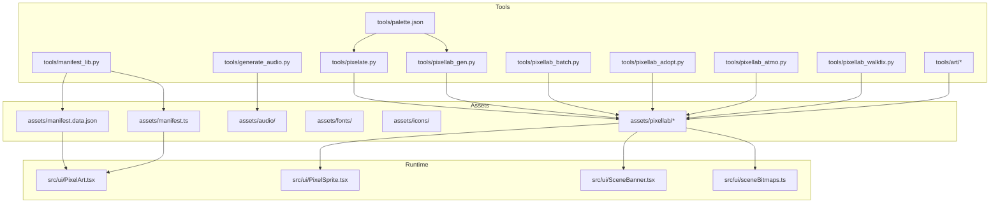
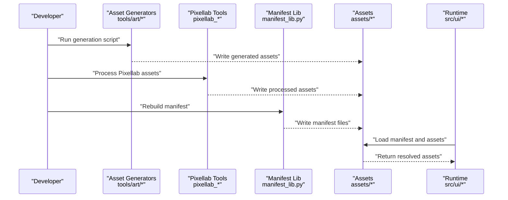
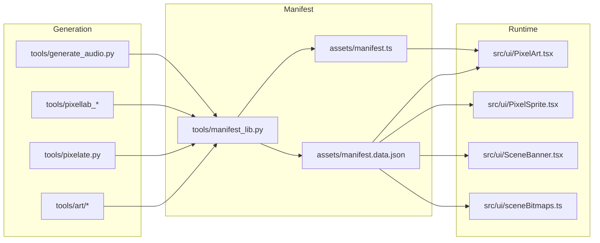

# Asset Pipeline

<cite>
**Referenced Files in This Document**
- [manifest.data.json](file://assets/manifest.data.json)
- [manifest.ts](file://assets/manifest.ts)
- [palette.json](file://tools/palette.json)
- [pixelate.py](file://tools/pixelate.py)
- [pixellab_adopt.py](file://tools/pixellab_adopt.py)
- [pixellab_atmo.py](file://tools/pixellab_atmo.py)
- [pixellab_batch.py](file://tools/pixellab_batch.py)
- [pixellab_gen.py](file://tools/pixellab_gen.py)
- [pixellab_walkfix.py](file://tools/pixellab_walkfix.py)
- [manifest_lib.py](file://tools/manifest_lib.py)
- [artifacts.py](file://tools/art/artifacts.py)
- [canvas.py](file://tools/art/canvas.py)
- [colors.py](file://tools/art/colors.py)
- [contact.py](file://tools/art/contact.py)
- [cosmetics.py](file://tools/art/cosmetics.py)
- [drawutil.py](file://tools/art/drawutil.py)
- [hearts.py](file://tools/art/hearts.py)
- [hero_contact.py](file://tools/art/hero_contact.py)
- [hero_defs.py](file://tools/art/hero_defs.py)
- [hero_parts.py](file://tools/art/hero_parts.py)
- [hero_profile.py](file://tools/art/hero_profile.py)
- [hero_weapons.py](file://tools/art/hero_weapons.py)
- [heroes.py](file://tools/art/heroes.py)
- [logo.py](file://tools/art/logo.py)
- [props.py](file://tools/art/props.py)
- [scene_common.py](file://tools/art/scene_common.py)
- [scene_contact.py](file://tools/art/scene_contact.py)
- [scenes.py](file://tools/art/scenes.py)
- [tether.py](file://tools/art/tether.py)
- [generate_audio.py](file://tools/generate_audio.py)
- [PixelArt.tsx](file://src/ui/PixelArt.tsx)
- [PixelSprite.tsx](file://src/ui/PixelSprite.tsx)
- [SceneBanner.tsx](file://src/ui/SceneBanner.tsx)
- [SceneClouds.tsx](file://src/ui/SceneClouds.tsx)
- [SceneGrass.tsx](file://src/ui/SceneGrass.tsx)
- [SceneSun.tsx](file://src/ui/SceneSun.tsx)
- [sceneBitmaps.ts](file://src/ui/sceneBitmaps.ts)
</cite>

## Table of Contents

1. [Introduction](#introduction)
2. [Project Structure](#project-structure)
3. [Core Components](#core-components)
4. [Architecture Overview](#architecture-overview)
5. [Detailed Component Analysis](#detailed-component-analysis)
6. [Dependency Analysis](#dependency-analysis)
7. [Performance Considerations](#performance-considerations)
8. [Troubleshooting Guide](#troubleshooting-guide)
9. [Conclusion](#conclusion)
10. [Appendices](#appendices)

## Introduction

This document describes the asset pipeline that generates and manages game assets for the project. It covers Python-based tools used to create pixel art, character sprites, scenes, and UI elements; the manifest system that tracks and loads assets efficiently; the pixel art workflow from creation to optimization (including palette management and format conversion); and integration with Pixellab for advanced processing. It also provides guidelines for adding new assets, maintaining consistency, optimizing performance, and troubleshooting common issues.

## Project Structure

The asset pipeline spans three main areas:

- Generation tools under tools/: Python scripts for asset generation, Pixellab integration, and manifest handling.
- Generated assets under assets/: JSON manifests and directories for audio, fonts, icons, and Pixellab outputs.
- Runtime consumers under src/ui/: TypeScript components that render pixel art, sprites, and scene bitmaps using the generated assets.

**Diagram sources**

- [pixelate.py](file://tools/pixelate.py)
- [pixellab_gen.py](file://tools/pixellab_gen.py)
- [pixellab_batch.py](file://tools/pixellab_batch.py)
- [pixellab_adopt.py](file://tools/pixellab_adopt.py)
- [pixellab_atmo.py](file://tools/pixellab_atmo.py)
- [pixellab_walkfix.py](file://tools/pixellab_walkfix.py)
- [manifest_lib.py](file://tools/manifest_lib.py)
- [palette.json](file://tools/palette.json)
- [artifacts.py](file://tools/art/artifacts.py)
- [generate_audio.py](file://tools/generate_audio.py)
- [manifest.data.json](file://assets/manifest.data.json)
- [manifest.ts](file://assets/manifest.ts)
- [PixelArt.tsx](file://src/ui/PixelArt.tsx)
- [PixelSprite.tsx](file://src/ui/PixelSprite.tsx)
- [SceneBanner.tsx](file://src/ui/SceneBanner.tsx)
- [sceneBitmaps.ts](file://src/ui/sceneBitmaps.ts)

**Section sources**

- [manifest.data.json](file://assets/manifest.data.json)
- [manifest.ts](file://assets/manifest.ts)
- [palette.json](file://tools/palette.json)
- [pixelate.py](file://tools/pixelate.py)
- [pixellab_gen.py](file://tools/pixellab_gen.py)
- [pixellab_batch.py](file://tools/pixellab_batch.py)
- [pixellab_adopt.py](file://tools/pixellab_adopt.py)
- [pixellab_atmo.py](file://tools/pixellab_atmo.py)
- [pixellab_walkfix.py](file://tools/pixellab_walkfix.py)
- [manifest_lib.py](file://tools/manifest_lib.py)
- [artifacts.py](file://tools/art/artifacts.py)
- [generate_audio.py](file://tools/generate_audio.py)
- [PixelArt.tsx](file://src/ui/PixelArt.tsx)
- [PixelSprite.tsx](file://src/ui/PixelSprite.tsx)
- [SceneBanner.tsx](file://src/ui/SceneBanner.tsx)
- [sceneBitmaps.ts](file://src/ui/sceneBitmaps.ts)

## Core Components

- Pixelation tool: Converts images to pixel art with configurable grid sizes and color quantization.
- Pixellab integration: Generates, batches, adopts, and post-processes assets created or edited in Pixellab.
- Manifest library: Builds and maintains a central manifest that maps asset IDs to file paths and metadata for efficient loading.
- Art generators: Specialized modules for heroes, artifacts, props, scenes, hearts, logos, and other visual elements.
- Audio generator: Produces audio assets for gameplay events.
- Runtime consumers: UI components that load and render assets via the manifest.

Key responsibilities:

- Consistent palette usage across all generated assets.
- Deterministic output for reproducible builds.
- Centralized tracking of assets through the manifest.
- Efficient runtime loading via precomputed indices and typed exports.

**Section sources**

- [pixelate.py](file://tools/pixelate.py)
- [pixellab_gen.py](file://tools/pixellab_gen.py)
- [pixellab_batch.py](file://tools/pixellab_batch.py)
- [pixellab_adopt.py](file://tools/pixellab_adopt.py)
- [pixellab_atmo.py](file://tools/pixellab_atmo.py)
- [pixellab_walkfix.py](file://tools/pixellab_walkfix.py)
- [manifest_lib.py](file://tools/manifest_lib.py)
- [artifacts.py](file://tools/art/artifacts.py)
- [generate_audio.py](file://tools/generate_audio.py)
- [manifest.data.json](file://assets/manifest.data.json)
- [manifest.ts](file://assets/manifest.ts)
- [PixelArt.tsx](file://src/ui/PixelArt.tsx)
- [PixelSprite.tsx](file://src/ui/PixelSprite.tsx)
- [SceneBanner.tsx](file://src/ui/SceneBanner.tsx)
- [sceneBitmaps.ts](file://src/ui/sceneBitmaps.ts)

## Architecture Overview

The pipeline follows a clear separation between generation, registration, and consumption:

- Generation: Python tools produce optimized assets and update the manifest.
- Registration: The manifest records asset identifiers, paths, and metadata.
- Consumption: TypeScript components read the manifest to resolve and render assets at runtime.

**Diagram sources**

- [artifacts.py](file://tools/art/artifacts.py)
- [pixellab_gen.py](file://tools/pixellab_gen.py)
- [pixellab_batch.py](file://tools/pixellab_batch.py)
- [pixellab_adopt.py](file://tools/pixellab_adopt.py)
- [pixellab_atmo.py](file://tools/pixellab_atmo.py)
- [pixellab_walkfix.py](file://tools/pixellab_walkfix.py)
- [manifest_lib.py](file://tools/manifest_lib.py)
- [manifest.data.json](file://assets/manifest.data.json)
- [manifest.ts](file://assets/manifest.ts)
- [PixelArt.tsx](file://src/ui/PixelArt.tsx)
- [PixelSprite.tsx](file://src/ui/PixelSprite.tsx)
- [SceneBanner.tsx](file://src/ui/SceneBanner.tsx)
- [sceneBitmaps.ts](file://src/ui/sceneBitmaps.ts)

## Detailed Component Analysis

### Pixelation Tool

Purpose:

- Convert source images into pixelated assets with consistent grid sizing and palette constraints.
- Ensure deterministic output by applying fixed dithering and color reduction strategies.

Workflow:

- Input image validation and resizing to target grid dimensions.
- Palette mapping using the shared palette definition.
- Output PNG generation with optimized compression settings.

Optimization considerations:

- Grid size selection impacts memory footprint and rendering speed.
- Palette quantization reduces color variance and improves cache locality.

**Section sources**

- [pixelate.py](file://tools/pixelate.py)
- [palette.json](file://tools/palette.json)

### Pixellab Integration

Components:

- pixellab_gen.py: Generates assets based on Pixellab project definitions.
- pixellab_batch.py: Batches multiple Pixellab operations for efficiency.
- pixellab_adopt.py: Imports existing Pixellab assets into the pipeline with normalization.
- pixellab_atmo.py: Processes atmospheric effects and background layers.
- pixellab_walkfix.py: Fixes animation frames for walking sprites.

Integration points:

- Reads Pixellab project structures and exports standardized assets.
- Applies palette corrections and frame alignment.
- Updates manifest entries for newly adopted assets.

Best practices:

- Keep Pixellab projects aligned with palette definitions.
- Use batch operations to minimize I/O overhead.
- Validate frame sequences before adoption.

**Section sources**

- [pixellab_gen.py](file://tools/pixellab_gen.py)
- [pixellab_batch.py](file://tools/pixellab_batch.py)
- [pixellab_adopt.py](file://tools/pixellab_adopt.py)
- [pixellab_atmo.py](file://tools/pixellab_atmo.py)
- [pixellab_walkfix.py](file://tools/pixellab_walkfix.py)
- [palette.json](file://tools/palette.json)

### Manifest System

Responsibilities:

- Track asset IDs, file paths, and metadata.
- Provide fast lookups for runtime resolution.
- Generate both JSON and TypeScript exports for flexible consumption.

Structure:

- manifest.data.json: Raw manifest data consumed by build tools and runtime loaders.
- manifest.ts: Typed exports derived from the manifest for type-safe access.

Operations:

- Add new assets: Update generation scripts to emit entries and rebuild the manifest.
- Remove assets: Delete entries and ensure no runtime references remain.
- Rebuild: Regenerate manifest files to reflect current asset state.

Efficiency:

- Precomputed indices reduce lookup time.
- Type-safe exports prevent mismatched asset references.

**Section sources**

- [manifest_lib.py](file://tools/manifest_lib.py)
- [manifest.data.json](file://assets/manifest.data.json)
- [manifest.ts](file://assets/manifest.ts)

### Art Generators

Modules:

- heroes.py, hero_parts.py, hero_profile.py, hero_weapons.py, hero_contact.py: Generate hero-related sprites and profiles.
- artifacts.py: Creates artifact visuals and metadata.
- props.py: Generates interactive props and environmental objects.
- scenes.py, scene_common.py, scene_contact.py: Build scene compositions and shared scene utilities.
- hearts.py: Renders heart icons and health indicators.
- logo.py: Produces application branding assets.
- tether.py: Generates tether-related graphics.

Consistency:

- All modules use shared drawing utilities and palette definitions.
- Outputs are validated against expected dimensions and color constraints.

Extensibility:

- New asset types can be added by creating a module following the established patterns.
- Integrate with the manifest builder to register new assets automatically.

**Section sources**

- [heroes.py](file://tools/art/heroes.py)
- [hero_parts.py](file://tools/art/hero_parts.py)
- [hero_profile.py](file://tools/art/hero_profile.py)
- [hero_weapons.py](file://tools/art/hero_weapons.py)
- [hero_contact.py](file://tools/art/hero_contact.py)
- [artifacts.py](file://tools/art/artifacts.py)
- [props.py](file://tools/art/props.py)
- [scenes.py](file://tools/art/scenes.py)
- [scene_common.py](file://tools/art/scene_common.py)
- [scene_contact.py](file://tools/art/scene_contact.py)
- [hearts.py](file://tools/art/hearts.py)
- [logo.py](file://tools/art/logo.py)
- [tether.py](file://tools/art/tether.py)
- [canvas.py](file://tools/art/canvas.py)
- [colors.py](file://tools/art/colors.py)
- [drawutil.py](file://tools/art/drawutil.py)

### Audio Generator

Purpose:

- Synthesize or convert audio files for gameplay events.
- Maintain consistent sample rates and formats compatible with the runtime.

Workflow:

- Input audio sources or parameters.
- Apply transformations (e.g., trimming, resampling).
- Output standardized audio files and update manifest entries.

**Section sources**

- [generate_audio.py](file://tools/generate_audio.py)
- [manifest_lib.py](file://tools/manifest_lib.py)

### Runtime Consumers

Components:

- PixelArt.tsx: Renders pixel art images with support for scaling and caching.
- PixelSprite.tsx: Displays animated sprite sheets with frame control.
- SceneBanner.tsx, SceneClouds.tsx, SceneGrass.tsx, SceneSun.tsx: Render scene-specific elements.
- sceneBitmaps.ts: Provides bitmap utilities for scene composition.

Usage:

- Import assets via manifest exports for type safety.
- Load assets lazily when needed to optimize startup time.
- Cache frequently used assets to reduce I/O overhead.

**Section sources**

- [PixelArt.tsx](file://src/ui/PixelArt.tsx)
- [PixelSprite.tsx](file://src/ui/PixelSprite.tsx)
- [SceneBanner.tsx](file://src/ui/SceneBanner.tsx)
- [SceneClouds.tsx](file://src/ui/SceneClouds.tsx)
- [SceneGrass.tsx](file://src/ui/SceneGrass.tsx)
- [SceneSun.tsx](file://src/ui/SceneSun.tsx)
- [sceneBitmaps.ts](file://src/ui/sceneBitmaps.ts)
- [manifest.ts](file://assets/manifest.ts)

## Dependency Analysis

The asset pipeline has clear dependencies between generation tools, manifest management, and runtime consumers.

**Diagram sources**

- [artifacts.py](file://tools/art/artifacts.py)
- [pixelate.py](file://tools/pixelate.py)
- [pixellab_gen.py](file://tools/pixellab_gen.py)
- [pixellab_batch.py](file://tools/pixellab_batch.py)
- [pixellab_adopt.py](file://tools/pixellab_adopt.py)
- [pixellab_atmo.py](file://tools/pixellab_atmo.py)
- [pixellab_walkfix.py](file://tools/pixellab_walkfix.py)
- [generate_audio.py](file://tools/generate_audio.py)
- [manifest_lib.py](file://tools/manifest_lib.py)
- [manifest.data.json](file://assets/manifest.data.json)
- [manifest.ts](file://assets/manifest.ts)
- [PixelArt.tsx](file://src/ui/PixelArt.tsx)
- [PixelSprite.tsx](file://src/ui/PixelSprite.tsx)
- [SceneBanner.tsx](file://src/ui/SceneBanner.tsx)
- [sceneBitmaps.ts](file://src/ui/sceneBitmaps.ts)

**Section sources**

- [manifest_lib.py](file://tools/manifest_lib.py)
- [manifest.data.json](file://assets/manifest.data.json)
- [manifest.ts](file://assets/manifest.ts)

## Performance Considerations

- Prefer smaller grid sizes for pixel art to reduce memory usage and improve rendering speed.
- Use batch operations in Pixellab tools to minimize file I/O overhead.
- Implement lazy loading for assets not immediately required at startup.
- Cache frequently accessed assets in memory to avoid repeated disk reads.
- Validate asset dimensions and palettes during generation to prevent runtime errors.
- Optimize PNG compression settings without sacrificing visual quality.

[No sources needed since this section provides general guidance]

## Troubleshooting Guide

Common issues and resolutions:

- Missing manifest entries: Rebuild the manifest after adding or removing assets.
- Incorrect palette colors: Verify palette definitions and ensure all generation tools reference the same palette file.
- Pixellab adoption failures: Check project structure and ensure assets conform to expected formats.
- Animation glitches: Use walkfix tool to correct frame sequences and timing.
- Runtime loading errors: Confirm asset paths in the manifest match actual file locations.

Debugging steps:

- Inspect manifest data for inconsistencies.
- Validate generated assets against expected dimensions and color counts.
- Review logs from generation tools for error messages.
- Test asset loading in isolation before integrating into larger scenes.

**Section sources**

- [manifest_lib.py](file://tools/manifest_lib.py)
- [pixellab_adopt.py](file://tools/pixellab_adopt.py)
- [pixellab_walkfix.py](file://tools/pixellab_walkfix.py)
- [palette.json](file://tools/palette.json)

## Conclusion

The asset pipeline provides a robust system for generating, managing, and consuming game assets. By leveraging Python-based tools for pixel art creation, Pixellab integration, and centralized manifest management, the pipeline ensures consistency, efficiency, and maintainability. Following the guidelines outlined here will help developers add new assets seamlessly, optimize performance, and troubleshoot issues effectively.

[No sources needed since this section summarizes without analyzing specific files]

## Appendices

### Adding New Assets

Steps:

1. Create or modify generation scripts in tools/art/ to produce the new asset.
2. Ensure the asset adheres to palette and dimension constraints.
3. Update the manifest builder to include the new asset entry.
4. Rebuild the manifest to generate updated JSON and TypeScript exports.
5. Reference the asset in runtime components using the typed manifest exports.

**Section sources**

- [artifacts.py](file://tools/art/artifacts.py)
- [manifest_lib.py](file://tools/manifest_lib.py)
- [manifest.ts](file://assets/manifest.ts)

### Maintaining Consistency

Guidelines:

- Always use the shared palette definition for color consistency.
- Follow established naming conventions for asset files and IDs.
- Validate outputs using automated checks where possible.
- Document any deviations from standard workflows.

**Section sources**

- [palette.json](file://tools/palette.json)
- [colors.py](file://tools/art/colors.py)
- [drawutil.py](file://tools/art/drawutil.py)

### Optimizing Performance

Recommendations:

- Choose appropriate grid sizes for pixel art based on target device capabilities.
- Implement asset caching strategies in runtime components.
- Profile asset loading times and identify bottlenecks.
- Consider texture atlasing for related assets to reduce draw calls.

[No sources needed since this section provides general guidance]
