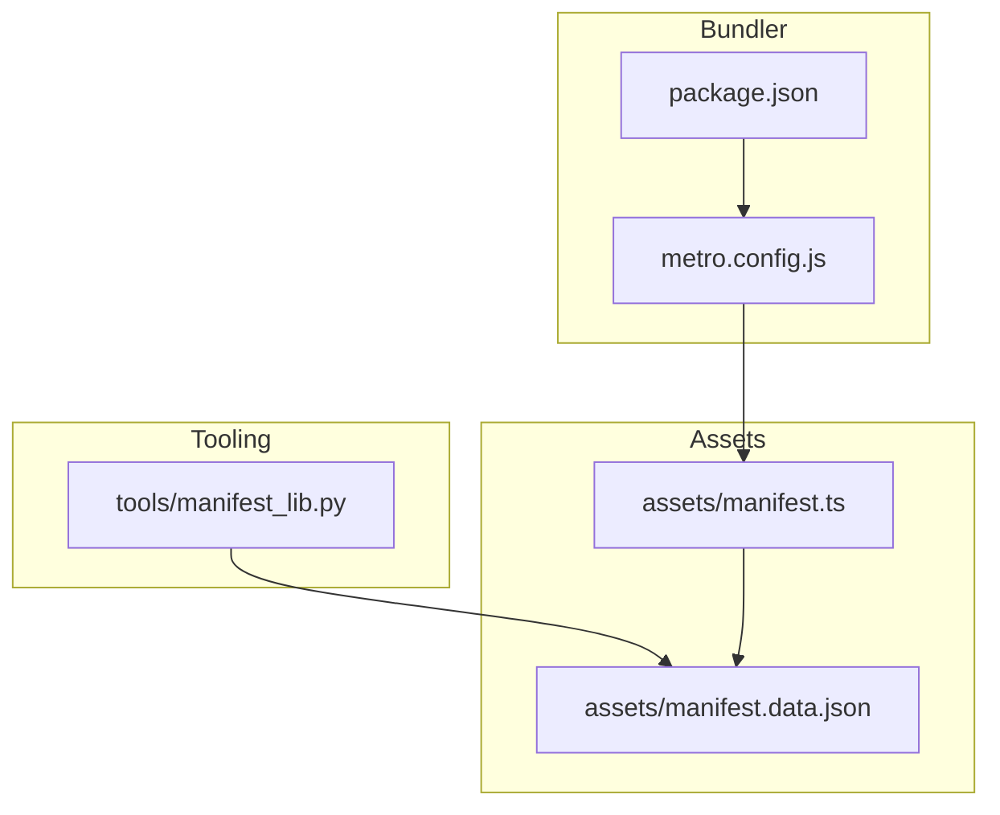
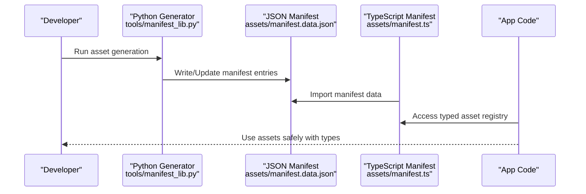
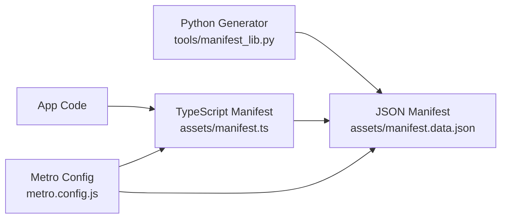

# Manifest System

<cite>
**Referenced Files in This Document**
- [assets/manifest.ts](file://assets/manifest.ts)
- [assets/manifest.data.json](file://assets/manifest.data.json)
- [tools/manifest_lib.py](file://tools/manifest_lib.py)
- [metro.config.js](file://metro.config.js)
- [package.json](file://package.json)
</cite>

## Table of Contents

1. [Introduction](#introduction)
2. [Project Structure](#project-structure)
3. [Core Components](#core-components)
4. [Architecture Overview](#architecture-overview)
5. [Detailed Component Analysis](#detailed-component-analysis)
6. [Dependency Analysis](#dependency-analysis)
7. [Performance Considerations](#performance-considerations)
8. [Troubleshooting Guide](#troubleshooting-guide)
9. [Conclusion](#conclusion)
10. [Appendices](#appendices)

## Introduction

This document explains the asset manifest system used to manage game resources. It covers how assets are declared, categorized, and loaded at runtime, focusing on:

- The TypeScript manifest that exposes typed asset metadata to the app
- The JSON manifest that stores canonical asset definitions
- The Python manifest library used during asset generation
- Integration with the bundler for efficient loading
- Versioning strategies and dependency handling
- Performance optimizations such as caching and lazy loading

## Project Structure

The manifest system centers around two primary files:

- A TypeScript manifest that provides typed access to assets
- A JSON manifest that holds the canonical asset registry

Asset generation tooling is implemented in Python and produces or updates manifests based on source assets.

**Diagram sources**

- [assets/manifest.ts](file://assets/manifest.ts)
- [assets/manifest.data.json](file://assets/manifest.data.json)
- [tools/manifest_lib.py](file://tools/manifest_lib.py)
- [metro.config.js](file://metro.config.js)
- [package.json](file://package.json)

**Section sources**

- [assets/manifest.ts](file://assets/manifest.ts)
- [assets/manifest.data.json](file://assets/manifest.data.json)
- [tools/manifest_lib.py](file://tools/manifest_lib.py)
- [metro.config.js](file://metro.config.js)
- [package.json](file://package.json)

## Core Components

- TypeScript manifest: Exposes a typed registry of assets consumed by the application code.
- JSON manifest: Stores the authoritative list of assets, including paths, categories, and metadata.
- Python manifest library: Generates or updates the JSON manifest from asset inputs and rules.
- Bundler integration: Ensures assets referenced by the manifest are bundled and available at runtime.

Key responsibilities:

- Centralized asset catalog with consistent categorization
- Type-safe consumption in TypeScript
- Automated generation and validation via Python tooling
- Efficient runtime loading through bundler optimization

**Section sources**

- [assets/manifest.ts](file://assets/manifest.ts)
- [assets/manifest.data.json](file://assets/manifest.data.json)
- [tools/manifest_lib.py](file://tools/manifest_lib.py)

## Architecture Overview

The manifest system follows a clear separation between authoring (Python), canonical data (JSON), and consumption (TypeScript).

**Diagram sources**

- [tools/manifest_lib.py](file://tools/manifest_lib.py)
- [assets/manifest.data.json](file://assets/manifest.data.json)
- [assets/manifest.ts](file://assets/manifest.ts)

## Detailed Component Analysis

### JSON Manifest Format

The JSON manifest defines the canonical asset registry. Typical fields include:

- Unique identifier for each asset
- File path or bundle reference
- Category (e.g., audio, fonts, icons, pixellab scenes/sprites)
- Metadata such as version, tags, and dependencies
- Optional flags for lazy loading or caching behavior

Categorization guidelines:

- Group assets by type (audio, fonts, icons, pixellab/*)
- Use consistent naming conventions for IDs and paths
- Maintain stable identifiers across versions

Versioning strategies:

- Incremental version per asset or per category
- Semantic versioning for major changes
- Hash-based content versioning for cache busting

Dependencies:

- Explicitly declare inter-asset dependencies where applicable
- Resolve dependency order during load time

**Section sources**

- [assets/manifest.data.json](file://assets/manifest.data.json)

### TypeScript Manifest Integration

The TypeScript manifest imports the JSON manifest and exposes a strongly-typed interface for app code. Benefits:

- Compile-time safety for asset keys and metadata
- Autocomplete and documentation in IDEs
- Centralized access point for asset resolution

Integration points:

- Import JSON manifest into TypeScript module
- Export typed getters or constants for categories
- Provide helper functions for resolving asset URLs or bundles

Runtime loader interaction:

- App code requests assets via typed API
- Loader resolves paths from manifest and fetches resources
- Supports lazy loading and caching policies

**Section sources**

- [assets/manifest.ts](file://assets/manifest.ts)
- [assets/manifest.data.json](file://assets/manifest.data.json)

### Python Manifest Library

The Python library automates manifest generation and maintenance:

- Scans asset directories and applies rules
- Produces JSON manifest entries with consistent structure
- Validates asset integrity and metadata completeness
- Supports batch updates and incremental regeneration

Usage patterns:

- Define asset catalogs and transformation rules
- Generate manifests before builds
- Integrate with CI pipelines for consistency

**Section sources**

- [tools/manifest_lib.py](file://tools/manifest_lib.py)

### Bundler Integration

Bundler configuration ensures assets referenced by the manifest are included in the build:

- Metro configuration includes asset modules
- Asset resolution respects manifest-defined paths
- Optimizations like tree-shaking and code-splitting can be applied

**Section sources**

- [metro.config.js](file://metro.config.js)
- [package.json](file://package.json)

## Dependency Analysis

The manifest system has clear boundaries and minimal coupling:

- Python generator writes JSON manifest without depending on TypeScript
- TypeScript manifest reads JSON manifest and exposes typed API
- App code depends only on the TypeScript manifest
- Bundler integrates with both JSON and TypeScript layers

**Diagram sources**

- [tools/manifest_lib.py](file://tools/manifest_lib.py)
- [assets/manifest.data.json](file://assets/manifest.data.json)
- [assets/manifest.ts](file://assets/manifest.ts)
- [metro.config.js](file://metro.config.js)

**Section sources**

- [tools/manifest_lib.py](file://tools/manifest_lib.py)
- [assets/manifest.data.json](file://assets/manifest.data.json)
- [assets/manifest.ts](file://assets/manifest.ts)
- [metro.config.js](file://metro.config.js)

## Performance Considerations

Optimization strategies for asset loading and caching:

- Lazy loading: Defer loading of non-critical assets until needed
- Caching: Cache frequently used assets in memory or persistent storage
- Prefetching: Preload likely assets based on user flow predictions
- Deduplication: Avoid duplicate loads by tracking asset instances
- Bundle splitting: Separate large assets into chunks for on-demand loading

Manifest-driven optimizations:

- Mark assets as eager or lazy in manifest metadata
- Use content hashes for cache invalidation
- Group related assets for efficient batch loading

**Section sources**

- [assets/manifest.data.json](file://assets/manifest.data.json)
- [assets/manifest.ts](file://assets/manifest.ts)

## Troubleshooting Guide

Common issues and resolutions:

- Missing asset references: Ensure all assets are registered in the JSON manifest
- Type errors in TypeScript: Verify manifest schema matches TypeScript definitions
- Build failures: Confirm bundler includes all required assets
- Runtime load errors: Validate asset paths and availability in production builds
- Stale caches: Clear caches when manifest versions change

Debugging steps:

- Inspect generated JSON manifest for correctness
- Check TypeScript compilation for type mismatches
- Review bundler logs for asset inclusion issues
- Validate asset accessibility at runtime

**Section sources**

- [assets/manifest.data.json](file://assets/manifest.data.json)
- [assets/manifest.ts](file://assets/manifest.ts)

## Conclusion

The manifest system provides a robust foundation for managing game resources through clear separation of concerns, type safety, and automation. By following the documented patterns for asset registration, categorization, and loading, teams can maintain consistent and performant asset management across the application lifecycle.

## Appendices

### Adding New Assets

Steps to add new assets:

1. Place asset files in appropriate directory under assets/
2. Update Python generator rules if needed
3. Regenerate JSON manifest using Python tooling
4. Verify TypeScript manifest exports updated types
5. Test asset loading in development environment

### Updating Existing Manifests

Best practices for updates:

- Increment version numbers appropriately
- Maintain backward compatibility when possible
- Document breaking changes in manifest schema
- Validate all dependent code compiles successfully

### Handling Asset Dependencies

Guidelines for dependencies:

- Declare explicit dependencies in manifest entries
- Resolve dependencies before loading dependent assets
- Handle circular dependencies gracefully
- Test dependency chains thoroughly

[No sources needed since this section provides general guidance]
