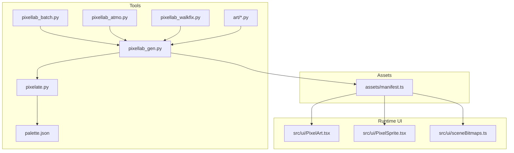
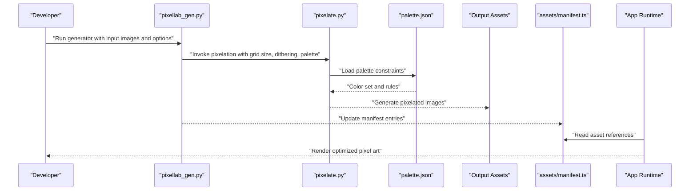
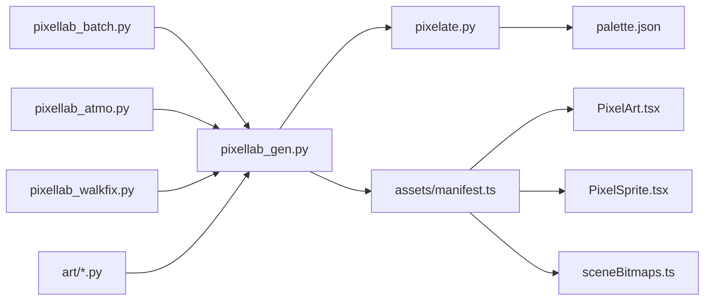

# Pixel Art Workflow

<cite>
**Referenced Files in This Document**
- [pixelate.py](file://tools/pixelate.py)
- [palette.json](file://tools/palette.json)
- [pixellab_gen.py](file://tools/pixellab_gen.py)
- [pixellab_batch.py](file://tools/pixellab_batch.py)
- [pixellab_atmo.py](file://tools/pixellab_atmo.py)
- [pixellab_walkfix.py](file://tools/pixellab_walkfix.py)
- [artifacts.py](file://tools/art/artifacts.py)
- [canvas.py](file://tools/art/canvas.py)
- [colors.py](file://tools/art/colors.py)
- [drawutil.py](file://tools/art/drawutil.py)
- [scene_common.py](file://tools/art/scene_common.py)
- [scenes.py](file://tools/art/scenes.py)
- [manifest.ts](file://assets/manifest.ts)
- [PixelArt.tsx](file://src/ui/PixelArt.tsx)
- [PixelSprite.tsx](file://src/ui/PixelSprite.tsx)
- [sceneBitmaps.ts](file://src/ui/sceneBitmaps.ts)
</cite>

## Table of Contents

1. [Introduction](#introduction)
2. [Project Structure](#project-structure)
3. [Core Components](#core-components)
4. [Architecture Overview](#architecture-overview)
5. [Detailed Component Analysis](#detailed-component-analysis)
6. [Dependency Analysis](#dependency-analysis)
7. [Performance Considerations](#performance-considerations)
8. [Troubleshooting Guide](#troubleshooting-guide)
9. [Conclusion](#conclusion)
10. [Appendices](#appendices)

## Introduction

This document describes the end-to-end pixel art creation and optimization workflow used by the project. It covers how raw images are converted into pixel art assets, palette management (including color constraints and dithering), format optimization, drawing utilities, common scene elements, and the pipeline from source images to optimized game assets. It also provides quality control and validation steps, guidelines for visual consistency and file size optimization, troubleshooting tips, and performance considerations.

## Project Structure

The pixel art toolchain is primarily implemented under tools/, with supporting runtime components under src/ui/ and asset manifests under assets/. The key areas:

- tools/pixelate.py: Core image-to-pixel-art conversion utility
- tools/palette.json: Centralized palette definition and constraints
- tools/pixellab_*.py: Batch generation, atmospheric effects, walk frame fixes, and other automation scripts
- tools/art/*.py: Drawing utilities, canvas helpers, color utilities, scene composition helpers, and asset generators
- assets/manifest.ts: Asset manifest consumed by the app
- src/ui/*: Runtime rendering components that display pixel art and scene elements

**Diagram sources**

- [pixelate.py](file://tools/pixelate.py)
- [palette.json](file://tools/palette.json)
- [pixellab_gen.py](file://tools/pixellab_gen.py)
- [pixellab_batch.py](file://tools/pixellab_batch.py)
- [pixellab_atmo.py](file://tools/pixellab_atmo.py)
- [pixellab_walkfix.py](file://tools/pixellab_walkfix.py)
- [artifacts.py](file://tools/art/artifacts.py)
- [canvas.py](file://tools/art/canvas.py)
- [colors.py](file://tools/art/colors.py)
- [drawutil.py](file://tools/art/drawutil.py)
- [scene_common.py](file://tools/art/scene_common.py)
- [scenes.py](file://tools/art/scenes.py)
- [manifest.ts](file://assets/manifest.ts)
- [PixelArt.tsx](file://src/ui/PixelArt.tsx)
- [PixelSprite.tsx](file://src/ui/PixelSprite.tsx)
- [sceneBitmaps.ts](file://src/ui/sceneBitmaps.ts)

**Section sources**

- [pixelate.py](file://tools/pixelate.py)
- [palette.json](file://tools/palette.json)
- [pixellab_gen.py](file://tools/pixellab_gen.py)
- [pixellab_batch.py](file://tools/pixellab_batch.py)
- [pixellab_atmo.py](file://tools/pixellab_atmo.py)
- [pixellab_walkfix.py](file://tools/pixellab_walkfix.py)
- [artifacts.py](file://tools/art/artifacts.py)
- [canvas.py](file://tools/art/canvas.py)
- [colors.py](file://tools/art/colors.py)
- [drawutil.py](file://tools/art/drawutil.py)
- [scene_common.py](file://tools/art/scene_common.py)
- [scenes.py](file://tools/art/scenes.py)
- [manifest.ts](file://assets/manifest.ts)
- [PixelArt.tsx](file://src/ui/PixelArt.tsx)
- [PixelSprite.tsx](file://src/ui/PixelSprite.tsx)
- [sceneBitmaps.ts](file://src/ui/sceneBitmaps.ts)

## Core Components

- Image pixelation engine: Converts raster images to pixelated representations using configurable grid sizes, color quantization, and optional dithering.
- Palette management: Centralized palette definitions enforce color constraints and ensure consistent visuals across assets.
- Batch and automation scripts: Generate multiple assets, apply atmospheric effects, and fix animation frames.
- Drawing utilities: Provide reusable primitives and helpers for constructing complex sprites and scenes.
- Scene elements: Common background and foreground components reused across scenes.
- Runtime rendering: Efficiently displays pixel art and animated sprites within the application.

**Section sources**

- [pixelate.py](file://tools/pixelate.py)
- [palette.json](file://tools/palette.json)
- [pixellab_gen.py](file://tools/pixellab_gen.py)
- [pixellab_batch.py](file://tools/pixellab_batch.py)
- [pixellab_atmo.py](file://tools/pixellab_atmo.py)
- [pixellab_walkfix.py](file://tools/pixellab_walkfix.py)
- [artifacts.py](file://tools/art/artifacts.py)
- [canvas.py](file://tools/art/canvas.py)
- [colors.py](file://tools/art/colors.py)
- [drawutil.py](file://tools/art/drawutil.py)
- [scene_common.py](file://tools/art/scene_common.py)
- [scenes.py](file://tools/art/scenes.py)
- [manifest.ts](file://assets/manifest.ts)
- [PixelArt.tsx](file://src/ui/PixelArt.tsx)
- [PixelSprite.tsx](file://src/ui/PixelSprite.tsx)
- [sceneBitmaps.ts](file://src/ui/sceneBitmaps.ts)

## Architecture Overview

The pipeline transforms raw images into optimized pixel art assets through a series of processing stages, governed by palette constraints and output formats. Assets are then referenced via a manifest and rendered efficiently at runtime.

**Diagram sources**

- [pixellab_gen.py](file://tools/pixellab_gen.py)
- [pixelate.py](file://tools/pixelate.py)
- [palette.json](file://tools/palette.json)
- [manifest.ts](file://assets/manifest.ts)

## Detailed Component Analysis

### Pixelation Engine (pixelate.py)

Responsibilities:

- Accept raw images and convert them to pixel art based on target grid dimensions.
- Apply color quantization constrained by the central palette.
- Support optional dithering modes to preserve perceived detail while staying within palette limits.
- Output optimized images suitable for game use.

Key behaviors:

- Grid sizing controls resolution and visual style.
- Palette enforcement ensures consistent colors across assets.
- Dithering options balance fidelity and palette constraints.
- Format selection optimizes storage and loading performance.

Quality control:

- Validate output against palette constraints.
- Check for unintended banding or artifacts.
- Ensure consistent scaling across asset sets.

**Section sources**

- [pixelate.py](file://tools/pixelate.py)
- [palette.json](file://tools/palette.json)

### Palette Management (palette.json)

Responsibilities:

- Define the allowed color set and constraints.
- Provide a single source of truth for color consistency.
- Enable deterministic quantization and dithering behavior.

Guidelines:

- Keep palettes small to reduce memory and improve performance.
- Maintain contrast ratios for readability.
- Group related colors logically for easier maintenance.

Validation:

- Reject out-of-palette colors during generation.
- Warn on near-misses to guide artists toward valid colors.

**Section sources**

- [palette.json](file://tools/palette.json)

### Generation and Automation Scripts

- pixellab_gen.py: Orchestrates asset generation, invoking pixelation and applying transformations.
- pixellab_batch.py: Processes multiple inputs in batch mode for efficiency.
- pixellab_atmo.py: Applies atmospheric effects such as fog or lighting overlays.
- pixellab_walkfix.py: Fixes walking frames to ensure smooth animation transitions.

Workflow:

- Input validation and normalization.
- Pixelation with palette constraints.
- Optional post-processing (atmosphere, frame correction).
- Manifest updates and output organization.

**Section sources**

- [pixellab_gen.py](file://tools/pixellab_gen.py)
- [pixellab_batch.py](file://tools/pixellab_batch.py)
- [pixellab_atmo.py](file://tools/pixellab_atmo.py)
- [pixellab_walkfix.py](file://tools/pixellab_walkfix.py)

### Drawing Utilities and Scene Elements

- canvas.py: Provides drawing surfaces and transformation helpers.
- drawutil.py: Offers reusable drawing primitives and convenience functions.
- colors.py: Color manipulation utilities aligned with palette constraints.
- scene_common.py: Shared scene building blocks (e.g., backgrounds, clouds).
- scenes.py: Composes complex scenes from common elements.
- artifacts.py: Generates specific asset types (e.g., items, props).

Best practices:

- Reuse shared components to maintain visual consistency.
- Keep drawing operations efficient to avoid bottlenecks.
- Align outputs with palette and format requirements.

**Section sources**

- [canvas.py](file://tools/art/canvas.py)
- [drawutil.py](file://tools/art/drawutil.py)
- [colors.py](file://tools/art/colors.py)
- [scene_common.py](file://tools/art/scene_common.py)
- [scenes.py](file://tools/art/scenes.py)
- [artifacts.py](file://tools/art/artifacts.py)

### Runtime Rendering Components

- PixelArt.tsx: Renders static pixel art images efficiently.
- PixelSprite.tsx: Displays animated sprite sheets with frame control.
- sceneBitmaps.ts: Manages bitmap resources for scenes.

Optimization strategies:

- Use appropriate image formats (e.g., PNG for transparency, optimized JPEG where applicable).
- Cache loaded assets to minimize re-decoding.
- Limit texture sizes to match target resolutions.

**Section sources**

- [PixelArt.tsx](file://src/ui/PixelArt.tsx)
- [PixelSprite.tsx](file://src/ui/PixelSprite.tsx)
- [sceneBitmaps.ts](file://src/ui/sceneBitmaps.ts)

## Dependency Analysis

The pipeline has clear separation between generation tools, palette constraints, and runtime rendering. Dependencies flow from tools to assets and then to the application.

**Diagram sources**

- [pixelate.py](file://tools/pixelate.py)
- [palette.json](file://tools/palette.json)
- [pixellab_gen.py](file://tools/pixellab_gen.py)
- [pixellab_batch.py](file://tools/pixellab_batch.py)
- [pixellab_atmo.py](file://tools/pixellab_atmo.py)
- [pixellab_walkfix.py](file://tools/pixellab_walkfix.py)
- [artifacts.py](file://tools/art/artifacts.py)
- [canvas.py](file://tools/art/canvas.py)
- [colors.py](file://tools/art/colors.py)
- [drawutil.py](file://tools/art/drawutil.py)
- [scene_common.py](file://tools/art/scene_common.py)
- [scenes.py](file://tools/art/scenes.py)
- [manifest.ts](file://assets/manifest.ts)
- [PixelArt.tsx](file://src/ui/PixelArt.tsx)
- [PixelSprite.tsx](file://src/ui/PixelSprite.tsx)
- [sceneBitmaps.ts](file://src/ui/sceneBitmaps.ts)

**Section sources**

- [pixelate.py](file://tools/pixelate.py)
- [palette.json](file://tools/palette.json)
- [pixellab_gen.py](file://tools/pixellab_gen.py)
- [pixellab_batch.py](file://tools/pixellab_batch.py)
- [pixellab_atmo.py](file://tools/pixellab_atmo.py)
- [pixellab_walkfix.py](file://tools/pixellab_walkfix.py)
- [artifacts.py](file://tools/art/artifacts.py)
- [canvas.py](file://tools/art/canvas.py)
- [colors.py](file://tools/art/colors.py)
- [drawutil.py](file://tools/art/drawutil.py)
- [scene_common.py](file://tools/art/scene_common.py)
- [scenes.py](file://tools/art/scenes.py)
- [manifest.ts](file://assets/manifest.ts)
- [PixelArt.tsx](file://src/ui/PixelArt.tsx)
- [PixelSprite.tsx](file://src/ui/PixelSprite.tsx)
- [sceneBitmaps.ts](file://src/ui/sceneBitmaps.ts)

## Performance Considerations

- Choose appropriate pixel grid sizes to balance detail and memory usage.
- Prefer indexed color formats when possible to reduce file size.
- Avoid excessive dithering; it can increase visual noise and decoding overhead.
- Cache frequently used assets in memory to prevent repeated loading.
- Optimize sprite sheet dimensions to minimize texture swaps.
- Monitor frame rates during animations and adjust complexity accordingly.

[No sources needed since this section provides general guidance]

## Troubleshooting Guide

Common issues and resolutions:

- Colors outside palette: Ensure all inputs conform to palette.json constraints; re-quantize if necessary.
- Banding artifacts: Adjust dithering settings or increase grid resolution slightly.
- Blurry edges: Verify pixelation grid alignment and avoid unnecessary smoothing.
- Animation flicker: Use pixellab_walkfix.py to correct frame inconsistencies.
- Large file sizes: Reduce palette size, optimize image formats, and remove unused assets.
- Slow loading: Implement asset caching and preload critical resources.

**Section sources**

- [palette.json](file://tools/palette.json)
- [pixellab_walkfix.py](file://tools/pixellab_walkfix.py)
- [pixelate.py](file://tools/pixelate.py)

## Conclusion

The pixel art workflow combines robust pixelation tools, strict palette management, and efficient runtime rendering to produce visually consistent and performant game assets. By following the guidelines and leveraging the provided utilities, teams can maintain high-quality visuals while optimizing for size and speed.

[No sources needed since this section summarizes without analyzing specific files]

## Appendices

- Recommended asset naming conventions and folder structure.
- Checklist for validating new assets before integration.
- Tips for collaborating on palette evolution and versioning.

[No sources needed since this section provides general guidance]
