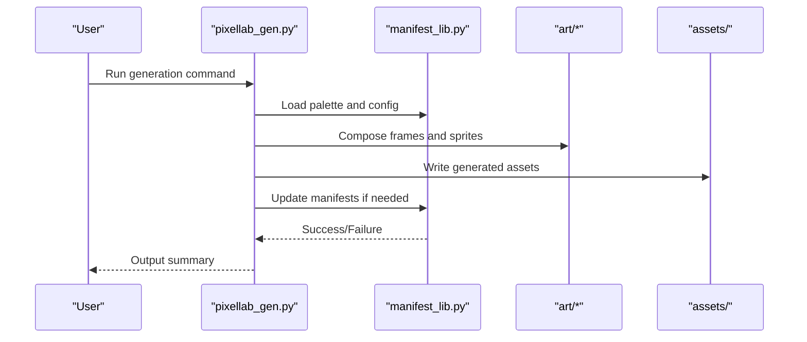
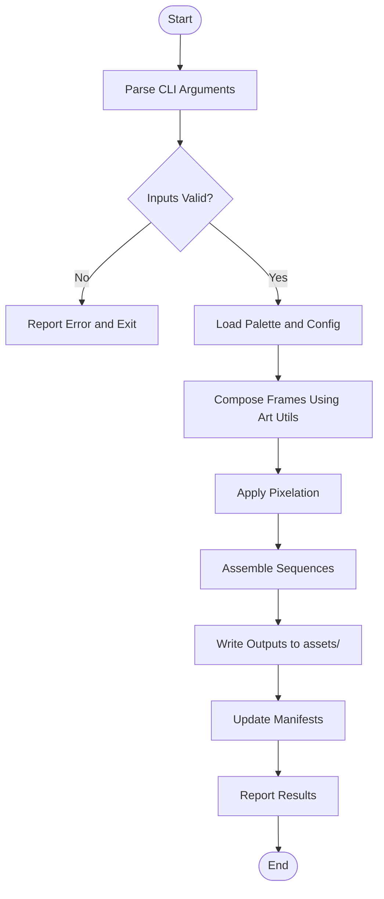
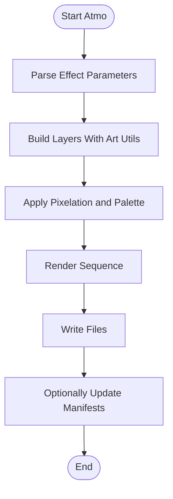
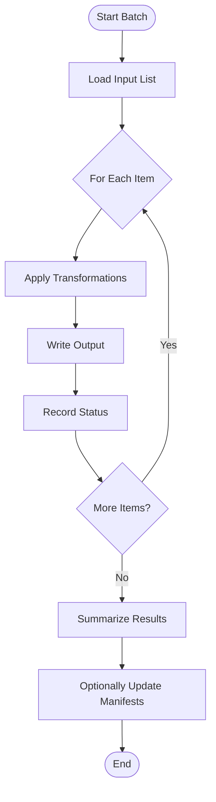
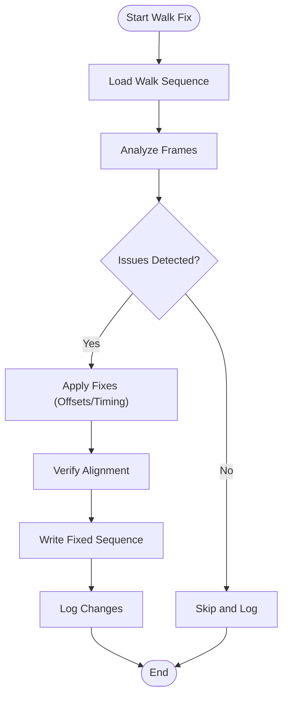
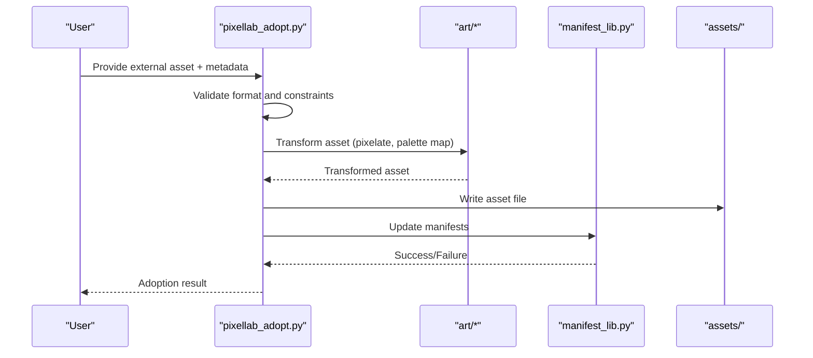
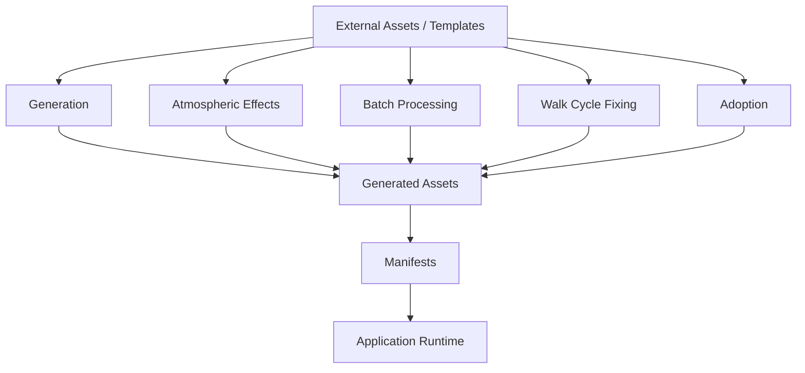
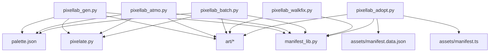

# Pixellab Integration

<cite>
**Referenced Files in This Document**
- [pixellab_gen.py](file://tools/pixellab_gen.py)
- [pixellab_atmo.py](file://tools/pixellab_atmo.py)
- [pixellab_batch.py](file://tools/pixellab_batch.py)
- [pixellab_walkfix.py](file://tools/pixellab_walkfix.py)
- [pixellab_adopt.py](file://tools/pixellab_adopt.py)
- [manifest_lib.py](file://tools/manifest_lib.py)
- [palette.json](file://tools/palette.json)
- [pixelate.py](file://tools/pixelate.py)
- [artifacts.py](file://tools/art/artifacts.py)
- [canvas.py](file://tools/art/canvas.py)
- [colors.py](file://tools/art/colors.py)
- [scene_common.py](file://tools/art/scene_common.py)
- [scenes.py](file://tools/art/scenes.py)
- [hero_defs.py](file://tools/art/hero_defs.py)
- [hero_parts.py](file://tools/art/hero_parts.py)
- [hero_weapons.py](file://tools/art/hero_weapons.py)
- [hearts.py](file://tools/art/hearts.py)
- [contact.py](file://tools/art/contact.py)
- [cosmetics.py](file://tools/art/cosmetics.py)
- [props.py](file://tools/art/props.py)
- [tether.py](file://tools/art/tether.py)
- [logo.py](file://tools/art/logo.py)
- [manifest.ts](file://assets/manifest.ts)
- [manifest.data.json](file://assets/manifest.data.json)
</cite>

## Table of Contents

1. Introduction
2. Project Structure
3. Core Components
4. Architecture Overview
5. Detailed Component Analysis
6. Dependency Analysis
7. Performance Considerations
8. Troubleshooting Guide
9. Conclusion
10. Appendices

## Introduction

This document explains the Pixellab integration system used to generate, process, and adopt pixel-art assets for animated sprites, sequences, atmospheric effects, and character animations. It covers:

- Main generation script for creating animated sprites and sequences
- Atmospheric effects generation for weather and ambient animations
- Batch processing capabilities for large-scale asset operations
- Walk cycle fixing tools for character animation correction
- Adoption system for integrating external assets into the pipeline
- Setup instructions, configuration options, and troubleshooting guides
- Examples of common workflows and automation patterns

## Project Structure

The Pixellab tooling lives under tools/ and integrates with assets/ via manifest files. The Python scripts implement generation, batch processing, adoption, and fix utilities. Shared art utilities live under tools/art/.

```mermaid
graph TB
subgraph "Tools"
gen["pixellab_gen.py"]
atmo["pixellab_atmo.py"]
batch["pixellab_batch.py"]
walkfix["pixellab_walkfix.py"]
adopt["pixellab_adopt.py"]
lib["manifest_lib.py"]
palette["palette.json"]
px["pixelate.py"]
end
subgraph "Art Utilities"
artifacts["artifacts.py"]
canvas["canvas.py"]
colors["colors.py"]
scene_common["scene_common.py"]
scenes["scenes.py"]
hero_defs["hero_defs.py"]
hero_parts["hero_parts.py"]
hero_weapons["hero_weapons.py"]
hearts["hearts.py"]
contact["contact.py"]
cosmetics["cosmetics.py"]
props["props.py"]
tether["tether.py"]
logo["logo.py"]
end
subgraph "Assets"
mts["assets/manifest.ts"]
mdj["assets/manifest.data.json"]
end
gen --> lib
atmo --> lib
batch --> lib
walkfix --> lib
adopt --> lib
gen --> px
atmo --> px
batch --> px
gen --> artifacts
atmo --> artifacts
batch --> artifacts
walkfix --> artifacts
adopt --> artifacts
gen --> palette
atmo --> palette
batch --> palette
adopt --> mts
adopt --> mdj
```

**Diagram sources**

- [pixellab_gen.py](file://tools/pixellab_gen.py)
- [pixellab_atmo.py](file://tools/pixellab_atmo.py)
- [pixellab_batch.py](file://tools/pixellab_batch.py)
- [pixellab_walkfix.py](file://tools/pixellab_walkfix.py)
- [pixellab_adopt.py](file://tools/pixellab_adopt.py)
- [manifest_lib.py](file://tools/manifest_lib.py)
- [palette.json](file://tools/palette.json)
- [pixelate.py](file://tools/pixelate.py)
- [artifacts.py](file://tools/art/artifacts.py)
- [canvas.py](file://tools/art/canvas.py)
- [colors.py](file://tools/art/colors.py)
- [scene_common.py](file://tools/art/scene_common.py)
- [scenes.py](file://tools/art/scenes.py)
- [hero_defs.py](file://tools/art/hero_defs.py)
- [hero_parts.py](file://tools/art/hero_parts.py)
- [hero_weapons.py](file://tools/art/hero_weapons.py)
- [hearts.py](file://tools/art/hearts.py)
- [contact.py](file://tools/art/contact.py)
- [cosmetics.py](file://tools/art/cosmetics.py)
- [props.py](file://tools/art/props.py)
- [tether.py](file://tools/art/tether.py)
- [logo.py](file://tools/art/logo.py)
- [manifest.ts](file://assets/manifest.ts)
- [manifest.data.json](file://assets/manifest.data.json)

**Section sources**

- [pixellab_gen.py](file://tools/pixellab_gen.py)
- [pixellab_atmo.py](file://tools/pixellab_atmo.py)
- [pixellab_batch.py](file://tools/pixellab_batch.py)
- [pixellab_walkfix.py](file://tools/pixellab_walkfix.py)
- [pixellab_adopt.py](file://tools/pixellab_adopt.py)
- [manifest_lib.py](file://tools/manifest_lib.py)
- [palette.json](file://tools/palette.json)
- [pixelate.py](file://tools/pixelate.py)
- [artifacts.py](file://tools/art/artifacts.py)
- [canvas.py](file://tools/art/canvas.py)
- [colors.py](file://tools/art/colors.py)
- [scene_common.py](file://tools/art/scene_common.py)
- [scenes.py](file://tools/art/scenes.py)
- [hero_defs.py](file://tools/art/hero_defs.py)
- [hero_parts.py](file://tools/art/hero_parts.py)
- [hero_weapons.py](file://tools/art/hero_weapons.py)
- [hearts.py](file://tools/art/hearts.py)
- [contact.py](file://tools/art/contact.py)
- [cosmetics.py](file://tools/art/cosmetics.py)
- [props.py](file://tools/art/props.py)
- [tether.py](file://tools/art/tether.py)
- [logo.py](file://tools/art/logo.py)
- [manifest.ts](file://assets/manifest.ts)
- [manifest.data.json](file://assets/manifest.data.json)

## Core Components

- pixellab_gen.py: Main generator for animated sprites and sequences. Orchestrates frame creation, palette usage, and output assembly.
- pixellab_atmo.py: Generates atmospheric effects (weather and ambient animations). Composes layers and applies pixelation and color mapping.
- pixellab_batch.py: Batch processor for large-scale asset operations. Iterates over inputs, applies transformations, and writes outputs efficiently.
- pixellab_walkfix.py: Walk cycle fixing tool for character animation correction. Detects misaligned frames and adjusts timing or offsets.
- pixellab_adopt.py: Adoption system for integrating external assets. Validates, transforms, and registers assets into the project manifests.
- manifest_lib.py: Manifest read/write helpers for assets/manifest.ts and assets/manifest.data.json.
- palette.json: Centralized color palette used across generators and processors.
- pixelate.py: Pixelation utility used by generators and batch jobs.
- Art utilities (tools/art/*): Shared drawing primitives, scene composition, hero definitions, weapons, hearts, contacts, cosmetics, props, tether, and logo helpers.

**Section sources**

- [pixellab_gen.py](file://tools/pixellab_gen.py)
- [pixellab_atmo.py](file://tools/pixellab_atmo.py)
- [pixellab_batch.py](file://tools/pixellab_batch.py)
- [pixellab_walkfix.py](file://tools/pixellab_walkfix.py)
- [pixellab_adopt.py](file://tools/pixellab_adopt.py)
- [manifest_lib.py](file://tools/manifest_lib.py)
- [palette.json](file://tools/palette.json)
- [pixelate.py](file://tools/pixelate.py)
- [artifacts.py](file://tools/art/artifacts.py)
- [canvas.py](file://tools/art/canvas.py)
- [colors.py](file://tools/art/colors.py)
- [scene_common.py](file://tools/art/scene_common.py)
- [scenes.py](file://tools/art/scenes.py)
- [hero_defs.py](file://tools/art/hero_defs.py)
- [hero_parts.py](file://tools/art/hero_parts.py)
- [hero_weapons.py](file://tools/art/hero_weapons.py)
- [hearts.py](file://tools/art/hearts.py)
- [contact.py](file://tools/art/contact.py)
- [cosmetics.py](file://tools/art/cosmetics.py)
- [props.py](file://tools/art/props.py)
- [tether.py](file://tools/art/tether.py)
- [logo.py](file://tools/art/logo.py)

## Architecture Overview

The Pixellab pipeline is modular:

- Entry points are CLI scripts that accept parameters for input/output paths, modes, and options.
- Shared libraries handle manifest I/O, palette management, and pixelation.
- Art utilities provide reusable drawing and composition functions.
- Outputs are written to assets/ and registered via manifests.

**Diagram sources**

- [pixellab_gen.py](file://tools/pixellab_gen.py)
- [manifest_lib.py](file://tools/manifest_lib.py)
- [artifacts.py](file://tools/art/artifacts.py)
- [canvas.py](file://tools/art/canvas.py)
- [colors.py](file://tools/art/colors.py)
- [scene_common.py](file://tools/art/scene_common.py)
- [scenes.py](file://tools/art/scenes.py)
- [hero_defs.py](file://tools/art/hero_defs.py)
- [hero_parts.py](file://tools/art/hero_parts.py)
- [hero_weapons.py](file://tools/art/hero_weapons.py)
- [hearts.py](file://tools/art/hearts.py)
- [contact.py](file://tools/art/contact.py)
- [cosmetics.py](file://tools/art/cosmetics.py)
- [props.py](file://tools/art/props.py)
- [tether.py](file://tools/art/tether.py)
- [logo.py](file://tools/art/logo.py)
- [manifest.ts](file://assets/manifest.ts)
- [manifest.data.json](file://assets/manifest.data.json)

## Detailed Component Analysis

### Main Generation Script (pixellab_gen.py)

Purpose:

- Creates animated sprites and sequences from templates or inputs.
- Applies palette mapping, pixelation, and frame composition.
- Writes outputs and updates manifests.

Key behaviors:

- Parses CLI arguments for input sources, output directories, and generation modes.
- Uses palette.json for consistent color mapping.
- Leverages art utilities for drawing primitives and scene composition.
- Integrates with manifest_lib to register new assets.

Typical workflow:

- Validate inputs and options.
- Generate frames using art utilities.
- Apply pixelation and palette mapping.
- Assemble sequences and write outputs.
- Update manifests and report results.

**Diagram sources**

- [pixellab_gen.py](file://tools/pixellab_gen.py)
- [palette.json](file://tools/palette.json)
- [pixelate.py](file://tools/pixelate.py)
- [artifacts.py](file://tools/art/artifacts.py)
- [canvas.py](file://tools/art/canvas.py)
- [colors.py](file://tools/art/colors.py)
- [scene_common.py](file://tools/art/scene_common.py)
- [scenes.py](file://tools/art/scenes.py)
- [hero_defs.py](file://tools/art/hero_defs.py)
- [hero_parts.py](file://tools/art/hero_parts.py)
- [hero_weapons.py](file://tools/art/hero_weapons.py)
- [hearts.py](file://tools/art/hearts.py)
- [contact.py](file://tools/art/contact.py)
- [cosmetics.py](file://tools/art/cosmetics.py)
- [props.py](file://tools/art/props.py)
- [tether.py](file://tools/art/tether.py)
- [logo.py](file://tools/art/logo.py)
- [manifest_lib.py](file://tools/manifest_lib.py)

**Section sources**

- [pixellab_gen.py](file://tools/pixellab_gen.py)
- [palette.json](file://tools/palette.json)
- [pixelate.py](file://tools/pixelate.py)
- [artifacts.py](file://tools/art/artifacts.py)
- [canvas.py](file://tools/art/canvas.py)
- [colors.py](file://tools/art/colors.py)
- [scene_common.py](file://tools/art/scene_common.py)
- [scenes.py](file://tools/art/scenes.py)
- [hero_defs.py](file://tools/art/hero_defs.py)
- [hero_parts.py](file://tools/art/hero_parts.py)
- [hero_weapons.py](file://tools/art/hero_weapons.py)
- [hearts.py](file://tools/art/hearts.py)
- [contact.py](file://tools/art/contact.py)
- [cosmetics.py](file://tools/art/cosmetics.py)
- [props.py](file://tools/art/props.py)
- [tether.py](file://tools/art/tether.py)
- [logo.py](file://tools/art/logo.py)
- [manifest_lib.py](file://tools/manifest_lib.py)

### Atmospheric Effects Generator (pixellab_atmo.py)

Purpose:

- Generates weather and ambient animations (e.g., clouds, rain, fog).
- Composes layered effects and applies consistent pixelation and palette mapping.

Key behaviors:

- Accepts effect type and parameters (density, speed, opacity).
- Uses art utilities for layer drawing and blending.
- Writes sequence outputs and optionally updates manifests.

Common use cases:

- Background ambiance for scenes.
- Weather transitions and dynamic overlays.

**Diagram sources**

- [pixellab_atmo.py](file://tools/pixellab_atmo.py)
- [pixelate.py](file://tools/pixelate.py)
- [artifacts.py](file://tools/art/artifacts.py)
- [canvas.py](file://tools/art/canvas.py)
- [colors.py](file://tools/art/colors.py)
- [scene_common.py](file://tools/art/scene_common.py)
- [scenes.py](file://tools/art/scenes.py)
- [manifest_lib.py](file://tools/manifest_lib.py)

**Section sources**

- [pixellab_atmo.py](file://tools/pixellab_atmo.py)
- [pixelate.py](file://tools/pixelate.py)
- [artifacts.py](file://tools/art/artifacts.py)
- [canvas.py](file://tools/art/canvas.py)
- [colors.py](file://tools/art/colors.py)
- [scene_common.py](file://tools/art/scene_common.py)
- [scenes.py](file://tools/art/scenes.py)
- [manifest_lib.py](file://tools/manifest_lib.py)

### Batch Processing (pixellab_batch.py)

Purpose:

- Processes large sets of assets efficiently.
- Iterates over inputs, applies transformations, and writes outputs.

Key behaviors:

- Supports parallel or sequential processing modes.
- Handles errors per item without aborting entire runs.
- Optionally updates manifests after successful batches.

Typical workflows:

- Bulk pixelation or palette conversion.
- Resizing and format normalization.
- Generating multiple variants (sizes, palettes).

**Diagram sources**

- [pixellab_batch.py](file://tools/pixellab_batch.py)
- [pixelate.py](file://tools/pixelate.py)
- [artifacts.py](file://tools/art/artifacts.py)
- [manifest_lib.py](file://tools/manifest_lib.py)

**Section sources**

- [pixellab_batch.py](file://tools/pixellab_batch.py)
- [pixelate.py](file://tools/pixelate.py)
- [artifacts.py](file://tools/art/artifacts.py)
- [manifest_lib.py](file://tools/manifest_lib.py)

### Walk Cycle Fixer (pixellab_walkfix.py)

Purpose:

- Corrects misaligned frames in character walk cycles.
- Adjusts timing, offsets, and alignment to ensure smooth animation.

Key behaviors:

- Analyzes frame sequences to detect inconsistencies.
- Applies corrections based on configurable rules.
- Outputs fixed sequences and logs changes.

Common issues addressed:

- Frame drift and offset mismatches.
- Timing irregularities causing stutter.
- Inconsistent sprite centering.

**Diagram sources**

- [pixellab_walkfix.py](file://tools/pixellab_walkfix.py)
- [artifacts.py](file://tools/art/artifacts.py)
- [canvas.py](file://tools/art/canvas.py)
- [colors.py](file://tools/art/colors.py)

**Section sources**

- [pixellab_walkfix.py](file://tools/pixellab_walkfix.py)
- [artifacts.py](file://tools/art/artifacts.py)
- [canvas.py](file://tools/art/canvas.py)
- [colors.py](file://tools/art/colors.py)

### Adoption System (pixellab_adopt.py)

Purpose:

- Integrates external assets into the pipeline.
- Validates, transforms, and registers assets into manifests.

Key behaviors:

- Accepts external asset paths and metadata.
- Runs validation checks (format, size, palette compatibility).
- Transforms assets (pixelation, resizing, palette mapping).
- Updates assets/manifest.ts and assets/manifest.data.json.

Adoption workflow:

- Validate inputs and metadata.
- Transform assets using shared utilities.
- Write outputs to assets/.
- Update manifests and confirm adoption.

**Diagram sources**

- [pixellab_adopt.py](file://tools/pixellab_adopt.py)
- [artifacts.py](file://tools/art/artifacts.py)
- [canvas.py](file://tools/art/canvas.py)
- [colors.py](file://tools/art/colors.py)
- [manifest_lib.py](file://tools/manifest_lib.py)
- [manifest.ts](file://assets/manifest.ts)
- [manifest.data.json](file://assets/manifest.data.json)

**Section sources**

- [pixellab_adopt.py](file://tools/pixellab_adopt.py)
- [artifacts.py](file://tools/art/artifacts.py)
- [canvas.py](file://tools/art/canvas.py)
- [colors.py](file://tools/art/colors.py)
- [manifest_lib.py](file://tools/manifest_lib.py)
- [manifest.ts](file://assets/manifest.ts)
- [manifest.data.json](file://assets/manifest.data.json)

### Conceptual Overview

The Pixellab system provides a cohesive pipeline for generating, processing, and adopting pixel-art assets. Scripts coordinate through shared libraries and art utilities, ensuring consistency and reusability. Outputs are integrated into the application via manifest files.

[No sources needed since this diagram shows conceptual workflow, not actual code structure]

## Dependency Analysis

Pixellab components share dependencies:

- manifest_lib.py centralizes manifest I/O.
- palette.json standardizes color mapping.
- pixelate.py provides pixelation services.
- art/* modules supply drawing and composition primitives.

**Diagram sources**

- [pixellab_gen.py](file://tools/pixellab_gen.py)
- [pixellab_atmo.py](file://tools/pixellab_atmo.py)
- [pixellab_batch.py](file://tools/pixellab_batch.py)
- [pixellab_walkfix.py](file://tools/pixellab_walkfix.py)
- [pixellab_adopt.py](file://tools/pixellab_adopt.py)
- [manifest_lib.py](file://tools/manifest_lib.py)
- [palette.json](file://tools/palette.json)
- [pixelate.py](file://tools/pixelate.py)
- [artifacts.py](file://tools/art/artifacts.py)
- [canvas.py](file://tools/art/canvas.py)
- [colors.py](file://tools/art/colors.py)
- [scene_common.py](file://tools/art/scene_common.py)
- [scenes.py](file://tools/art/scenes.py)
- [hero_defs.py](file://tools/art/hero_defs.py)
- [hero_parts.py](file://tools/art/hero_parts.py)
- [hero_weapons.py](file://tools/art/hero_weapons.py)
- [hearts.py](file://tools/art/hearts.py)
- [contact.py](file://tools/art/contact.py)
- [cosmetics.py](file://tools/art/cosmetics.py)
- [props.py](file://tools/art/props.py)
- [tether.py](file://tools/art/tether.py)
- [logo.py](file://tools/art/logo.py)
- [manifest.ts](file://assets/manifest.ts)
- [manifest.data.json](file://assets/manifest.data.json)

**Section sources**

- [pixellab_gen.py](file://tools/pixellab_gen.py)
- [pixellab_atmo.py](file://tools/pixellab_atmo.py)
- [pixellab_batch.py](file://tools/pixellab_batch.py)
- [pixellab_walkfix.py](file://tools/pixellab_walkfix.py)
- [pixellab_adopt.py](file://tools/pixellab_adopt.py)
- [manifest_lib.py](file://tools/manifest_lib.py)
- [palette.json](file://tools/palette.json)
- [pixelate.py](file://tools/pixelate.py)
- [artifacts.py](file://tools/art/artifacts.py)
- [canvas.py](file://tools/art/canvas.py)
- [colors.py](file://tools/art/colors.py)
- [scene_common.py](file://tools/art/scene_common.py)
- [scenes.py](file://tools/art/scenes.py)
- [hero_defs.py](file://tools/art/hero_defs.py)
- [hero_parts.py](file://tools/art/hero_parts.py)
- [hero_weapons.py](file://tools/art/hero_weapons.py)
- [hearts.py](file://tools/art/hearts.py)
- [contact.py](file://tools/art/contact.py)
- [cosmetics.py](file://tools/art/cosmetics.py)
- [props.py](file://tools/art/props.py)
- [tether.py](file://tools/art/tether.py)
- [logo.py](file://tools/art/logo.py)
- [manifest.ts](file://assets/manifest.ts)
- [manifest.data.json](file://assets/manifest.data.json)

## Performance Considerations

- Use batch mode for large datasets to minimize overhead and improve throughput.
- Prefer parallel processing where supported to accelerate transformations.
- Cache repeated computations (e.g., palette mappings) to avoid redundant work.
- Limit memory usage by streaming large assets when possible.
- Optimize pixelation parameters to balance quality and performance.

[No sources needed since this section provides general guidance]

## Troubleshooting Guide

Common issues and resolutions:

- Invalid inputs: Ensure paths exist and formats are supported.
- Palette mismatches: Verify palette.json contains required colors.
- Manifest update failures: Check permissions and file integrity for manifest files.
- Pixelation artifacts: Adjust pixelation settings or source resolution.
- Walk cycle anomalies: Re-run fixer with stricter alignment rules.

Checklists:

- Validate all input files before running generators.
- Confirm palette completeness and correctness.
- Review logs for per-item errors in batch runs.
- Inspect generated outputs visually for quality assurance.

**Section sources**

- [pixellab_gen.py](file://tools/pixellab_gen.py)
- [pixellab_atmo.py](file://tools/pixellab_atmo.py)
- [pixellab_batch.py](file://tools/pixellab_batch.py)
- [pixellab_walkfix.py](file://tools/pixellab_walkfix.py)
- [pixellab_adopt.py](file://tools/pixellab_adopt.py)
- [manifest_lib.py](file://tools/manifest_lib.py)
- [palette.json](file://tools/palette.json)
- [pixelate.py](file://tools/pixelate.py)
- [artifacts.py](file://tools/art/artifacts.py)
- [canvas.py](file://tools/art/canvas.py)
- [colors.py](file://tools/art/colors.py)
- [scene_common.py](file://tools/art/scene_common.py)
- [scenes.py](file://tools/art/scenes.py)
- [hero_defs.py](file://tools/art/hero_defs.py)
- [hero_parts.py](file://tools/art/hero_parts.py)
- [hero_weapons.py](file://tools/art/hero_weapons.py)
- [hearts.py](file://tools/art/hearts.py)
- [contact.py](file://tools/art/contact.py)
- [cosmetics.py](file://tools/art/cosmetics.py)
- [props.py](file://tools/art/props.py)
- [tether.py](file://tools/art/tether.py)
- [logo.py](file://tools/art/logo.py)
- [manifest.ts](file://assets/manifest.ts)
- [manifest.data.json](file://assets/manifest.data.json)

## Conclusion

The Pixellab integration system provides a robust, modular pipeline for generating, processing, and adopting pixel-art assets. By leveraging shared utilities and centralized manifests, it ensures consistency, scalability, and ease of maintenance. Following the documented workflows and troubleshooting steps will help teams automate asset production effectively.

[No sources needed since this section summarizes without analyzing specific files]

## Appendices

### Setup Instructions

- Install Python dependencies as required by the scripts.
- Ensure palette.json is present and configured.
- Verify access to assets/ directory for writing outputs and updating manifests.
- Run scripts with appropriate CLI arguments for your workflow.

### Configuration Options

- Palette selection and overrides via palette.json.
- Pixelation parameters for quality/performance trade-offs.
- Batch processing modes (parallel/sequential).
- Walk fixer alignment thresholds and timing rules.
- Adoption metadata requirements for external assets.

### Common Workflows

- Generate sprites and sequences from templates.
- Create atmospheric effects for scenes.
- Process large asset libraries in batch mode.
- Fix walk cycles for character animations.
- Adopt external assets into the project manifests.

[No sources needed since this section provides general guidance]
