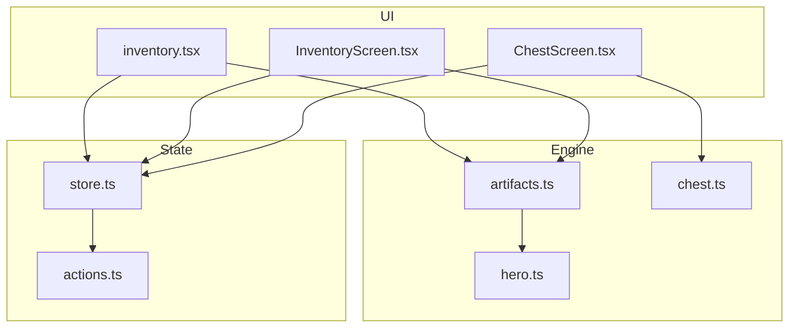
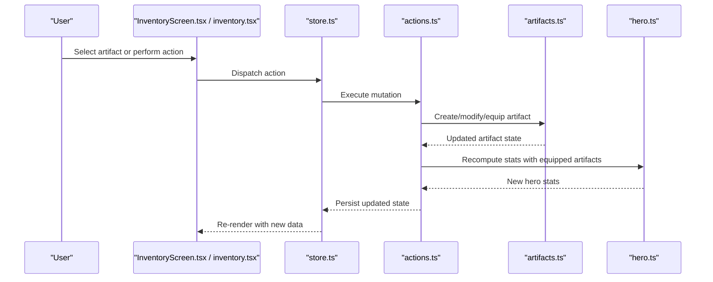
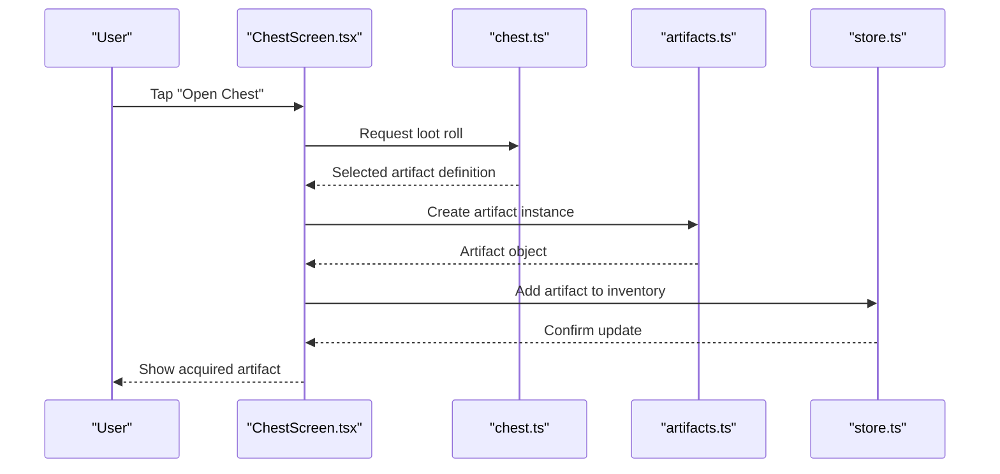
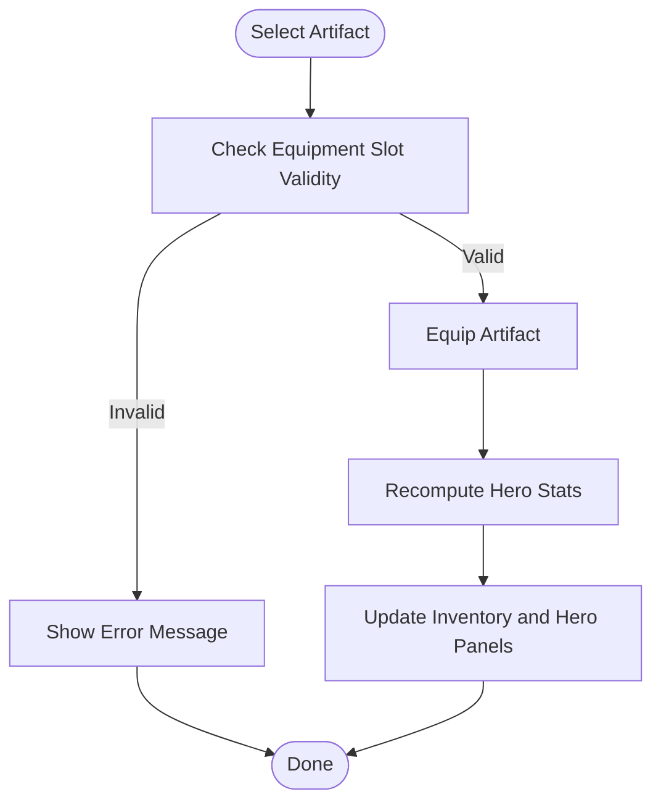
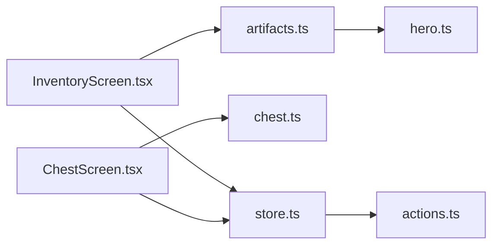

# Artifacts & Inventory

<cite>
**Referenced Files in This Document**
- [artifacts.ts](file://src/engine/artifacts.ts)
- [inventory.tsx](file://app/inventory.tsx)
- [InventoryScreen.tsx](file://src/screens/InventoryScreen.tsx)
- [chest.ts](file://src/engine/chest.ts)
- [ChestScreen.tsx](file://src/screens/ChestScreen.tsx)
- [hero.ts](file://src/engine/hero.ts)
- [store.ts](file://src/state/store.ts)
- [actions.ts](file://src/state/actions.ts)
- [artifacts.test.ts](file://src/engine/__tests__/artifacts.test.ts)
- [chest.test.ts](file://src/engine/__tests__/chest.test.ts)
</cite>

## Table of Contents

1. Introduction
2. Project Structure
3. Core Components
4. Architecture Overview
5. Detailed Component Analysis
6. Dependency Analysis
7. Performance Considerations
8. Troubleshooting Guide
9. Conclusion

## Introduction

This document explains the artifact system and inventory management, covering item types, effects, creation and modification mechanics, usage patterns, inventory constraints, stacking rules, equipment slots, rarity, effect calculations, and interactions with hero stats. It also provides practical examples for acquiring artifacts, using them, and managing inventory workflows.

## Project Structure

The artifact and inventory features are implemented across engine logic (stateful systems), UI screens, and state management:

- Engine layer defines artifact data models, creation/modification, effects, and inventory operations.
- Screens provide user-facing flows for viewing and interacting with artifacts and chests.
- State layer persists and coordinates game state changes triggered by actions.

**Diagram sources**

- [artifacts.ts](file://src/engine/artifacts.ts)
- [chest.ts](file://src/engine/chest.ts)
- [hero.ts](file://src/engine/hero.ts)
- [inventory.tsx](file://app/inventory.tsx)
- [InventoryScreen.tsx](file://src/screens/InventoryScreen.tsx)
- [ChestScreen.tsx](file://src/screens/ChestScreen.tsx)
- [store.ts](file://src/state/store.ts)
- [actions.ts](file://src/state/actions.ts)

**Section sources**

- [artifacts.ts](file://src/engine/artifacts.ts)
- [inventory.tsx](file://app/inventory.tsx)
- [InventoryScreen.tsx](file://src/screens/InventoryScreen.tsx)
- [chest.ts](file://src/engine/chest.ts)
- [ChestScreen.tsx](file://src/screens/ChestScreen.tsx)
- [hero.ts](file://src/engine/hero.ts)
- [store.ts](file://src/state/store.ts)
- [actions.ts](file://src/state/actions.ts)

## Core Components

- Artifact definitions and types: define item categories, properties, and effect schemas.
- Artifact creation and modification: factory functions to generate new artifacts and mutate existing ones.
- Effects and calculations: compute stat bonuses, durations, and conditional modifiers based on hero attributes.
- Inventory management: add/remove items, enforce capacity limits, handle stacking, and equip/unequip into slots.
- Chest integration: open chests to acquire artifacts with randomized outcomes.
- Hero interaction: apply equipped artifacts’ effects to hero stats and runtime behavior.

Key responsibilities:

- artifacts.ts: artifact schema, creation, modification, effect computation, and inventory operations.
- chest.ts: loot tables, randomization, and artifact acquisition flow.
- hero.ts: stat aggregation and how equipped artifacts influence hero performance.
- InventoryScreen.tsx and inventory.tsx: UI for browsing, equipping, and organizing artifacts.
- ChestScreen.tsx: UI for opening chests and confirming acquisitions.
- store.ts and actions.ts: persistence and event-driven updates for artifact and inventory state.

**Section sources**

- [artifacts.ts](file://src/engine/artifacts.ts)
- [chest.ts](file://src/engine/chest.ts)
- [hero.ts](file://src/engine/hero.ts)
- [InventoryScreen.tsx](file://src/screens/InventoryScreen.tsx)
- [inventory.tsx](file://app/inventory.tsx)
- [ChestScreen.tsx](file://src/screens/ChestScreen.tsx)
- [store.ts](file://src/state/store.ts)
- [actions.ts](file://src/state/actions.ts)

## Architecture Overview

The artifact system follows a layered architecture:

- UI layers trigger actions via screens.
- Actions update the centralized store.
- Engine modules compute effects and enforce rules.
- Hero module aggregates final stats from equipped artifacts.

**Diagram sources**

- [InventoryScreen.tsx](file://src/screens/InventoryScreen.tsx)
- [inventory.tsx](file://app/inventory.tsx)
- [store.ts](file://src/state/store.ts)
- [actions.ts](file://src/state/actions.ts)
- [artifacts.ts](file://src/engine/artifacts.ts)
- [hero.ts](file://src/engine/hero.ts)

## Detailed Component Analysis

### Artifact Data Model and Types

- Artifact types include categories such as weapons, armor, accessories, and consumables.
- Each artifact has properties like id, name, type, rarity, base stats, and effect definitions.
- Rarity influences probability of acquisition and magnitude of effects.
- Effect definitions specify stat modifications, conditions, and durations.

Complexity considerations:

- O(1) lookup by id for quick access during equipping and effect application.
- Effect calculation is typically O(n) over active effects per artifact.

**Section sources**

- [artifacts.ts](file://src/engine/artifacts.ts)

### Artifact Creation and Modification

- Creation functions generate artifacts with randomized or deterministic properties based on context (e.g., chest loot).
- Modification functions allow upgrading, rerolling, or combining artifacts where supported.
- Validation ensures required fields and consistent effect schemas.

Usage patterns:

- Chest opens call creation routines to produce an artifact instance.
- UI actions can trigger upgrades or merges if enabled by game rules.

**Section sources**

- [artifacts.ts](file://src/engine/artifacts.ts)
- [chest.ts](file://src/engine/chest.ts)

### Effects and Calculations

- Effects modify hero stats such as attack, defense, speed, and special attributes.
- Calculations consider base values, artifact bonuses, and conditional multipliers.
- Duration-based effects may be temporary or persistent depending on artifact type.

Interaction with hero stats:

- Equipped artifacts contribute additive or multiplicative bonuses.
- Conflicting effects are resolved by precedence rules defined in the engine.

**Section sources**

- [artifacts.ts](file://src/engine/artifacts.ts)
- [hero.ts](file://src/engine/hero.ts)

### Inventory Management

- Capacity constraints limit total number of artifacts stored.
- Stacking rules apply to consumable-type artifacts; unique items do not stack.
- Equipment slots restrict which artifact types can be equipped to specific slots (e.g., weapon slot, accessory slot).
- Operations include add, remove, equip, unequip, and reorder.

Workflow example:

- Acquire artifact -> validate capacity -> add to inventory -> optionally equip -> recalc stats.

**Section sources**

- [artifacts.ts](file://src/engine/artifacts.ts)
- [InventoryScreen.tsx](file://src/screens/InventoryScreen.tsx)
- [inventory.tsx](file://app/inventory.tsx)

### Chest Integration and Acquisition

- Chests contain loot tables mapping rarities to artifact pools.
- Opening a chest triggers random selection based on weights and current game state.
- UI confirms acquisition and updates inventory accordingly.

Acquisition flow:

- Open chest -> roll rarity -> select artifact -> create instance -> add to inventory -> notify user.

**Section sources**

- [chest.ts](file://src/engine/chest.ts)
- [ChestScreen.tsx](file://src/screens/ChestScreen.tsx)

### Hero Interaction and Stat Aggregation

- Hero stats aggregate base values plus contributions from equipped artifacts.
- Active effects are evaluated each time stats are computed.
- Changes to equipped artifacts trigger recomputation and UI refresh.

Stat computation highlights:

- Additive bonuses sum directly.
- Multiplicative bonuses apply after additive totals.
- Conditional effects check hero state or environment before applying.

**Section sources**

- [hero.ts](file://src/engine/hero.ts)
- [artifacts.ts](file://src/engine/artifacts.ts)

### Rarity System

- Rarity levels determine acquisition probability and effect strength.
- Common artifacts are frequent; rare artifacts have stronger effects but lower drop rates.
- Some artifacts may have special variants tied to higher rarities.

Rarity impact:

- Loot tables weight selections by rarity.
- Effect magnitudes scale with rarity tier.

**Section sources**

- [artifacts.ts](file://src/engine/artifacts.ts)
- [chest.ts](file://src/engine/chest.ts)

### Example Workflows

#### Artifact Acquisition from Chest

**Diagram sources**

- [ChestScreen.tsx](file://src/screens/ChestScreen.tsx)
- [chest.ts](file://src/engine/chest.ts)
- [artifacts.ts](file://src/engine/artifacts.ts)
- [store.ts](file://src/state/store.ts)

#### Equipping an Artifact

**Diagram sources**

- [InventoryScreen.tsx](file://src/screens/InventoryScreen.tsx)
- [artifacts.ts](file://src/engine/artifacts.ts)
- [hero.ts](file://src/engine/hero.ts)

**Section sources**

- [ChestScreen.tsx](file://src/screens/ChestScreen.tsx)
- [chest.ts](file://src/engine/chest.ts)
- [InventoryScreen.tsx](file://src/screens/InventoryScreen.tsx)
- [artifacts.ts](file://src/engine/artifacts.ts)
- [hero.ts](file://src/engine/hero.ts)

## Dependency Analysis

The artifact system depends on several core modules:

- UI screens depend on engine modules for business logic.
- Engine modules depend on hero stats for effect application.
- State management centralizes changes and propagates updates.

**Diagram sources**

- [InventoryScreen.tsx](file://src/screens/InventoryScreen.tsx)
- [ChestScreen.tsx](file://src/screens/ChestScreen.tsx)
- [artifacts.ts](file://src/engine/artifacts.ts)
- [chest.ts](file://src/engine/chest.ts)
- [hero.ts](file://src/engine/hero.ts)
- [store.ts](file://src/state/store.ts)
- [actions.ts](file://src/state/actions.ts)

**Section sources**

- [InventoryScreen.tsx](file://src/screens/InventoryScreen.tsx)
- [ChestScreen.tsx](file://src/screens/ChestScreen.tsx)
- [artifacts.ts](file://src/engine/artifacts.ts)
- [chest.ts](file://src/engine/chest.ts)
- [hero.ts](file://src/engine/hero.ts)
- [store.ts](file://src/state/store.ts)
- [actions.ts](file://src/state/actions.ts)

## Performance Considerations

- Minimize recalculations by caching hero stats and invalidating only when equipped artifacts change.
- Use efficient data structures for inventory lookups (maps by id) to support O(1) operations.
- Batch UI updates to avoid excessive re-renders when multiple artifacts are modified.
- Keep effect evaluation lightweight; precompute constant factors where possible.

[No sources needed since this section provides general guidance]

## Troubleshooting Guide

Common issues and resolutions:

- Inventory full: Ensure capacity checks are enforced before adding new artifacts; provide clear UI feedback.
- Stacking conflicts: Validate that only consumable-type artifacts stack; prevent stacking of unique items.
- Equipment slot errors: Verify slot compatibility rules; show actionable messages when equipping fails.
- Effect anomalies: Inspect effect definitions and precedence rules; ensure conditional checks align with hero state.
- Chest acquisition failures: Confirm loot table weights and artifact pool availability; log randomization results.

Validation and testing:

- Unit tests cover artifact creation, effect calculations, and inventory operations.
- Chest tests verify randomization and acquisition flows.

**Section sources**

- [artifacts.test.ts](file://src/engine/__tests__/artifacts.test.ts)
- [chest.test.ts](file://src/engine/__tests__/chest.test.ts)

## Conclusion

The artifact system integrates tightly with inventory management, hero stats, and UI flows to deliver a cohesive gameplay experience. Clear separation between engine logic, state management, and screens enables maintainability and extensibility. Proper enforcement of capacity, stacking, and slot rules ensures predictable behavior, while robust effect calculations and rarity systems provide depth and balance. Testing and validation help maintain reliability across artifact creation, modification, and usage scenarios.

[No sources needed since this section summarizes without analyzing specific files]
