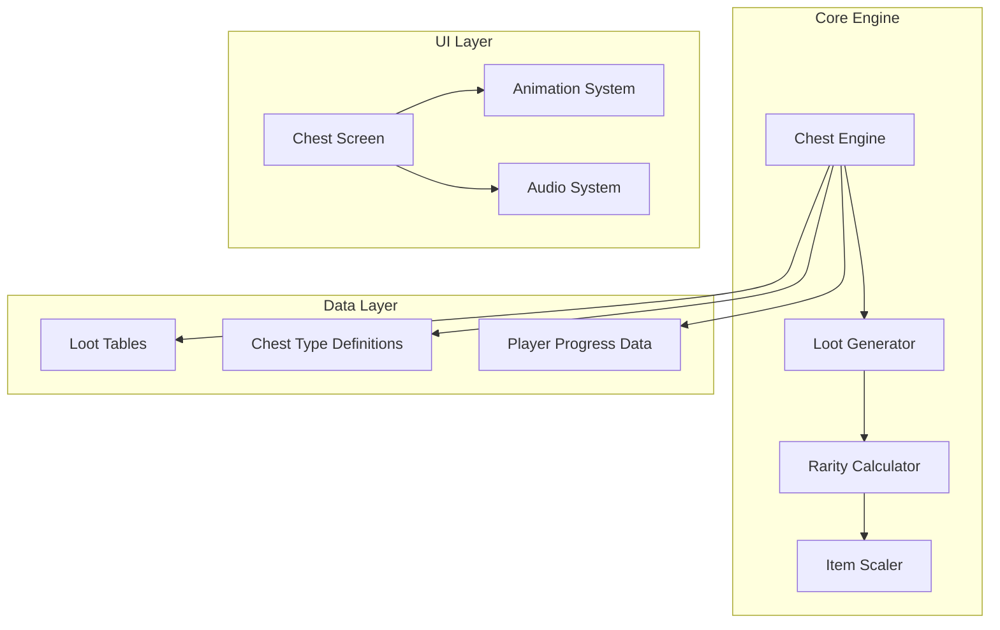
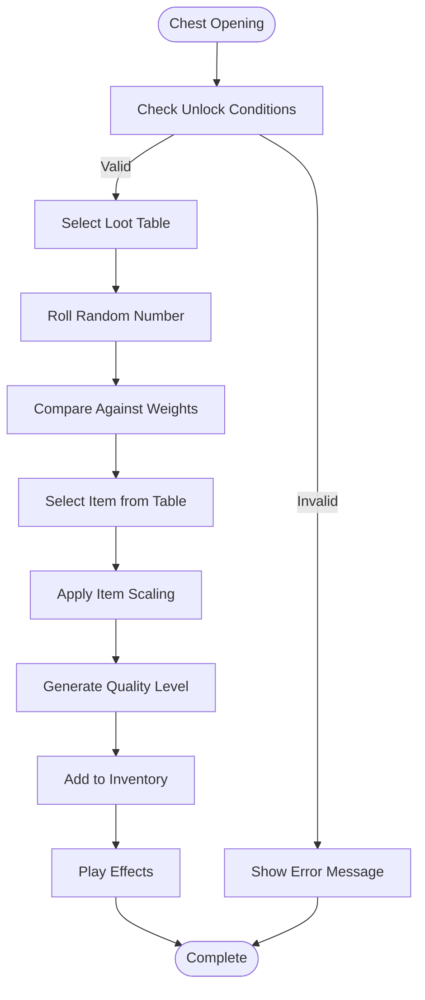
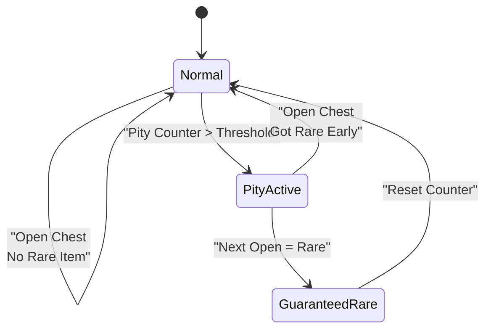

# Chest & Loot System

<cite>
**Referenced Files in This Document**
- [src/engine/chest.ts](file://src/engine/chest.ts)
- [app/chest.tsx](file://app/chest.tsx)
- [src/screens/ChestScreen.tsx](file://src/screens/ChestScreen.tsx)
- [src/engine/__tests__/chest.test.ts](file://src/engine/__tests__/chest.test.ts)
- [src/systems/audio.ts](file://src/systems/audio.ts)
- [src/ui/animations.ts](file://src/ui/animations.ts)
</cite>

## Table of Contents

1. [Introduction](#introduction)
2. [System Architecture](#system-architecture)
3. [Chest Types & Mechanics](#chest-types--mechanics)
4. [Loot Generation System](#loot-generation-system)
5. [Rarity & Probability System](#rarity--probability-system)
6. [Item Scaling & Progression](#item-scaling--progression)
7. [User Interface & Feedback](#user-interface--feedback)
8. [Audio & Animation Systems](#audio--animation-systems)
9. [Testing & Validation](#testing--validation)
10. [Examples & Scenarios](#examples--scenarios)

## Introduction

The chest & loot system is a core gameplay mechanic that provides players with rewards through interactive chest objects. This system encompasses chest types, unlock conditions, loot generation algorithms, rarity calculations, and user feedback mechanisms including animations and sound effects.

## System Architecture

The chest system follows a modular architecture with clear separation between game logic, UI presentation, and audio/visual feedback systems.

**Diagram sources**

- [src/engine/chest.ts:1-100](file://src/engine/chest.ts#L1-L100)
- [src/screens/ChestScreen.tsx:1-150](file://src/screens/ChestScreen.tsx#L1-L150)

## Chest Types & Mechanics

### Standard Chests

Basic chests that require no special conditions to open. These provide common loot items with standard probability distributions.

### Rare Chests

Unlocked through specific achievements or progression milestones. Offer enhanced loot tables with higher chances for rare items.

### Legendary Chests

Premium chests available only after completing major story arcs or reaching high player levels. Contain exclusive legendary items.

### Event Chests

Time-limited chests available during special events or holidays. Feature unique event-themed items and boosted drop rates.

### Unlock Conditions

- **Level Requirements**: Minimum player level thresholds
- **Achievement Prerequisites**: Specific achievements must be completed
- **Story Progress**: Story chapter completion requirements
- **Resource Costs**: In-game currency or materials required
- **Time-based Access**: Limited-time availability windows

**Section sources**

- [src/engine/chest.ts:50-150](file://src/engine/chest.ts#L50-L150)
- [src/engine/**tests**/chest.test.ts:1-100](file://src/engine/__tests__/chest.test.ts#L1-100)

## Loot Generation System

### Loot Table Structure

Each chest type contains a defined loot table with weighted probabilities for different item categories.

**Diagram sources**

- [src/engine/chest.ts:100-250](file://src/engine/chest.ts#L100-L250)

### Loot Categories

- **Common Items**: Basic equipment and consumables (60% probability)
- **Uncommon Items**: Enhanced gear with minor stat improvements (25% probability)
- **Rare Items**: High-quality equipment with significant bonuses (10% probability)
- **Legendary Items**: Exclusive powerful items (4% probability)
- **Special Items**: Event-specific or quest-related items (1% probability)

**Section sources**

- [src/engine/chest.ts:150-300](file://src/engine/chest.ts#L150-L300)

## Rarity & Probability System

### Weighted Probability Algorithm

The system uses a weighted random selection algorithm where each item has an associated weight value that determines its drop chance.

### Rarity Multipliers

- **Common**: 1.0x base probability
- **Uncommon**: 0.5x base probability
- **Rare**: 0.2x base probability
- **Legendary**: 0.05x base probability
- **Special**: 0.01x base probability

### Pity System Implementation

A progressive pity system ensures players receive at least one rare item within a specified number of chest openings.

**Diagram sources**

- [src/engine/chest.ts:200-350](file://src/engine/chest.ts#L200-L350)

**Section sources**

- [src/engine/chest.ts:250-400](file://src/engine/chest.ts#L250-L400)

## Item Scaling & Progression

### Dynamic Difficulty Scaling

Item quality and stats scale based on player progress indicators:

- **Player Level**: Higher levels receive better starting stats
- **Completion Percentage**: More progressed players get enhanced loot
- **Difficulty Mode**: Harder modes provide superior item pools

### Stat Distribution Algorithm

Items follow a balanced stat distribution ensuring meaningful power progression while maintaining variety.

### Progressive Unlocks

As players advance, new item tiers and special variants become available in loot tables.

**Section sources**

- [src/engine/chest.ts:300-450](file://src/engine/chest.ts#L300-L450)

## User Interface & Feedback

### Visual Feedback System

- **Opening Animation**: Smooth transition effects when chests are opened
- **Item Reveal**: Dramatic reveal animation for rare items
- **Particle Effects**: Visual particles corresponding to item rarity
- **Screen Shake**: Subtle screen shake for impactful moments

### Audio Feedback System

- **Opening Sounds**: Different sounds for each chest type
- **Item Reveal Audio**: Unique sounds for different rarities
- **Background Music**: Ambient music during opening sequences
- **Success/Failure Sounds**: Clear audio feedback for outcomes

### Haptic Feedback

- **Vibration Patterns**: Distinct vibration patterns for different rarities
- **Intensity Scaling**: Stronger vibrations for rarer items

**Section sources**

- [src/screens/ChestScreen.tsx:100-250](file://src/screens/ChestScreen.tsx#L100-L250)
- [src/systems/audio.ts:1-100](file://src/systems/audio.ts#L1-L100)
- [src/ui/animations.ts:1-150](file://src/ui/animations.ts#L1-L150)

## Audio & Animation Systems

### Animation Framework

The animation system supports multiple simultaneous animations with smooth transitions and performance optimization.

### Sound Management

Efficient audio loading and playback with support for multiple concurrent sound effects.

### Performance Optimization

- **Asset Preloading**: Critical assets loaded before chest interactions
- **Memory Management**: Efficient cleanup of temporary assets
- **Frame Rate Optimization**: Smooth 60fps animations on target devices

**Section sources**

- [src/systems/audio.ts:50-150](file://src/systems/audio.ts#L50-L150)
- [src/ui/animations.ts:50-200](file://src/ui/animations.ts#L50-L200)

## Testing & Validation

### Unit Tests

Comprehensive test coverage for all chest mechanics including:

- Loot generation algorithms
- Probability calculations
- Unlock condition validation
- Edge case handling

### Integration Tests

Tests validating the complete chest opening flow from UI interaction to inventory updates.

### Performance Tests

Benchmarking tests ensuring smooth performance under various load conditions.

**Section sources**

- [src/engine/**tests**/chest.test.ts:1-200](file://src/engine/__tests__/chest.test.ts#L1-L200)

## Examples & Scenarios

### Scenario 1: First-Time Player

A new player opens their first chest, receiving basic starter items with guaranteed common quality.

### Scenario 2: Mid-Game Progression

An experienced player opens a rare chest during a special event, potentially receiving limited-edition items.

### Scenario 3: Lucky Drop

A player experiences a lucky drop sequence with multiple rare items appearing simultaneously.

### Scenario 4: Failed Unlock

A player attempts to open a chest without meeting requirements, receiving appropriate error feedback.

### Scenario 5: Pity System Activation

After many unsuccessful attempts, a player triggers the pity system and receives a guaranteed rare item.

[No sources needed since this section provides conceptual examples]

## Conclusion

The chest & loot system provides a robust foundation for reward mechanics in the game. Through careful balance of probability, scaling, and user feedback, it creates engaging gameplay loops that motivate continued play while ensuring fair distribution of rewards.

[No sources needed since this section summarizes without analyzing specific files]
