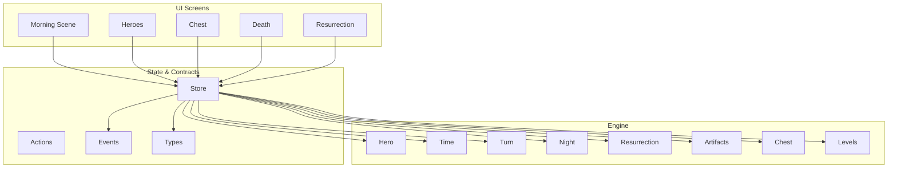
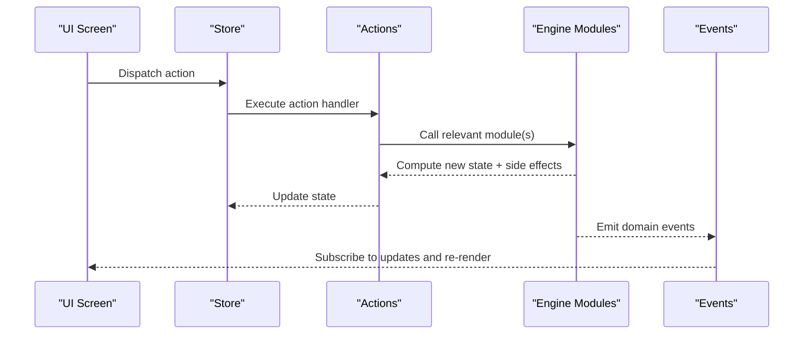
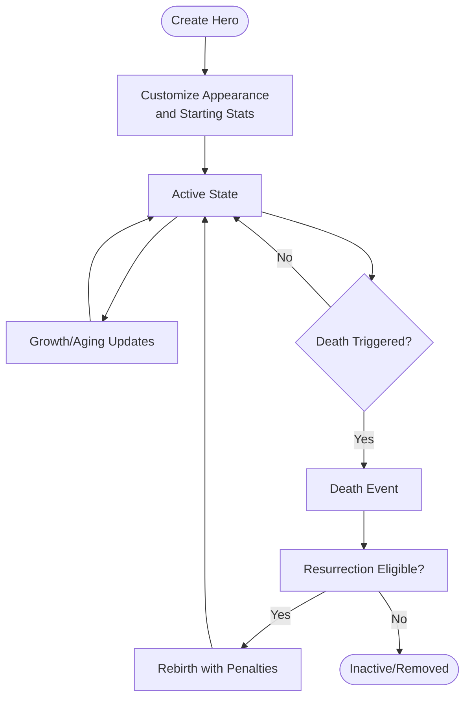
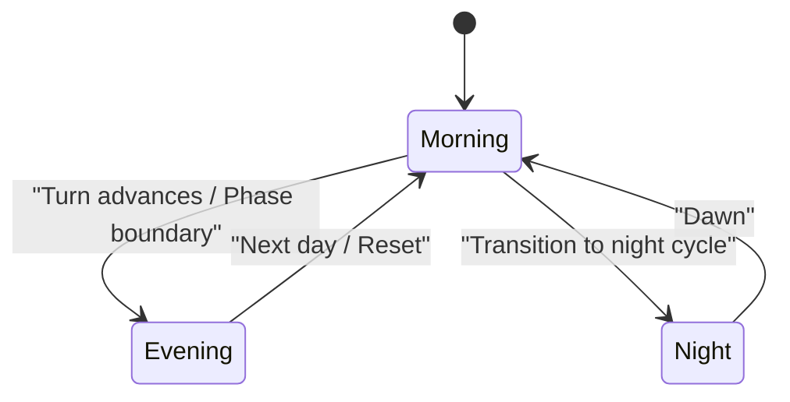
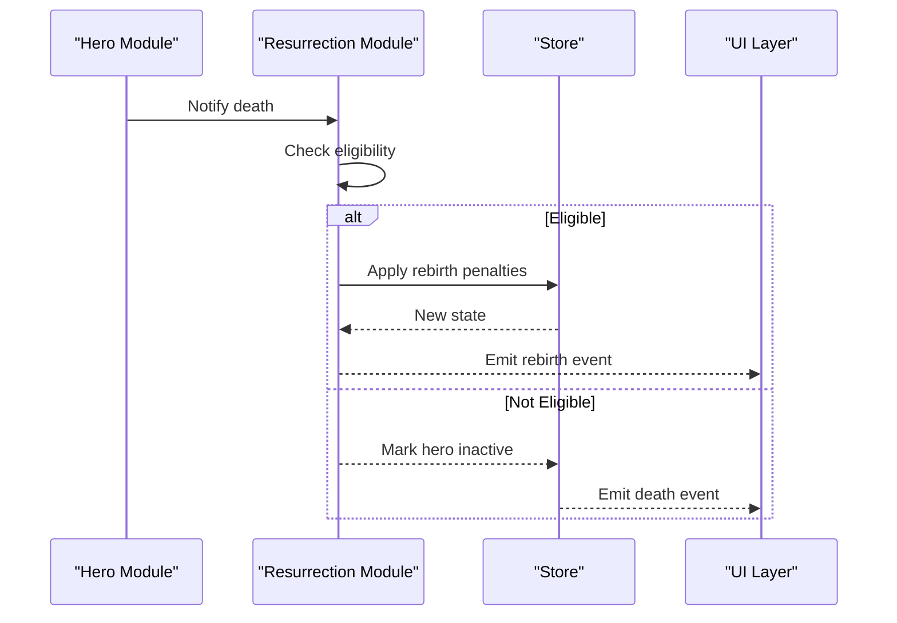
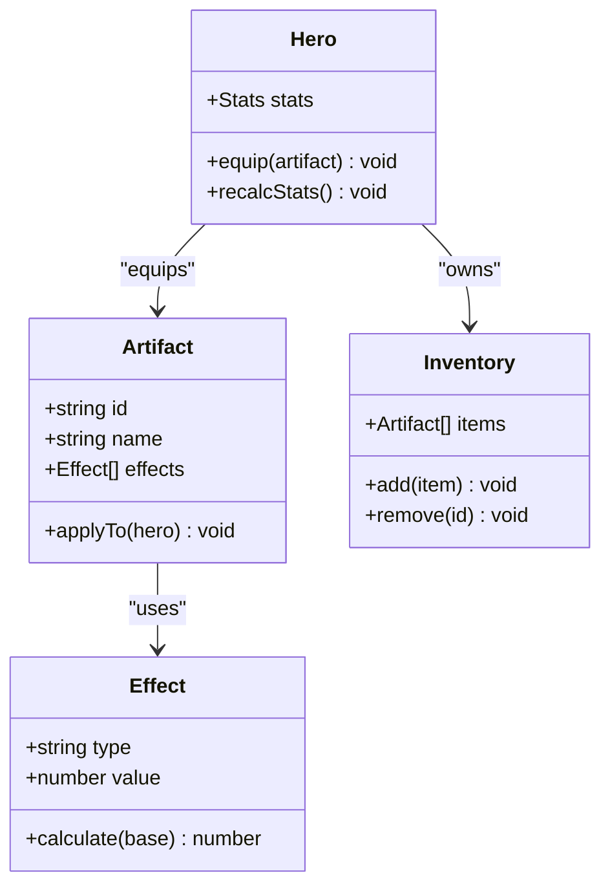
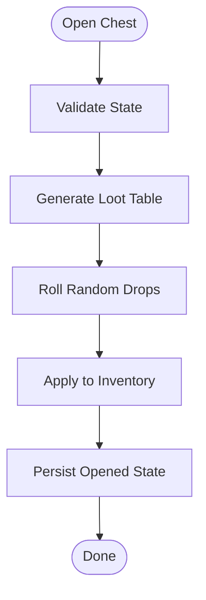
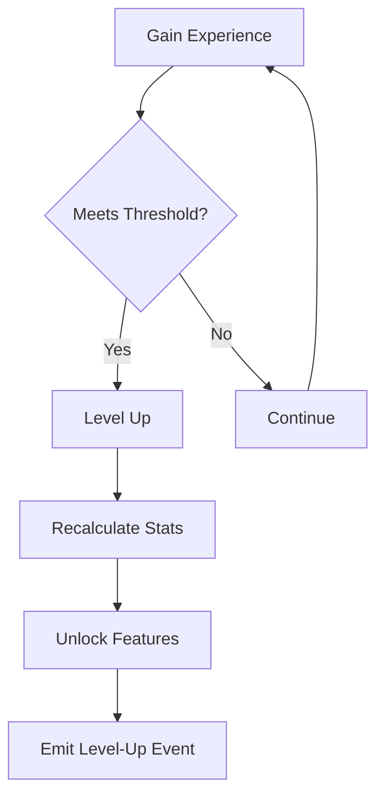
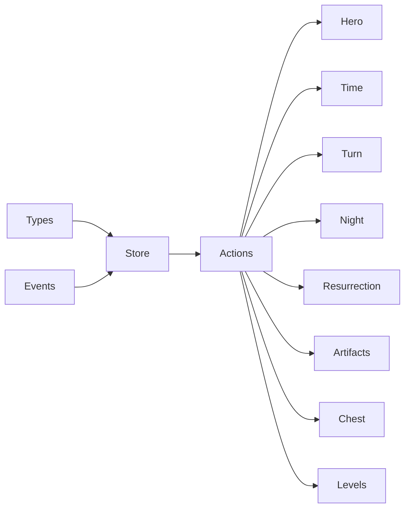

# Core Engine

<cite>
**Referenced Files in This Document**
- [hero.ts](file://src/engine/hero.ts)
- [time.ts](file://src/engine/time.ts)
- [turn.ts](file://src/engine/turn.ts)
- [night.ts](file://src/engine/night.ts)
- [resurrection.ts](file://src/engine/resurrection.ts)
- [artifacts.ts](file://src/engine/artifacts.ts)
- [chest.ts](file://src/engine/chest.ts)
- [levels.ts](file://src/engine/levels.ts)
- [events.ts](file://src/contracts/events.ts)
- [types.ts](file://src/contracts/types.ts)
- [store.ts](file://src/state/store.ts)
- [actions.ts](file://src/state/actions.ts)
- [useGame.tsx](file://src/ui/useGame.tsx)
- [morning-scene.tsx](file://app/morning-scene.tsx)
- [heroes.ts](file://app/heroes.ts)
- [chest.ts](file://app/chest.ts)
- [death.ts](file://app/death.ts)
- [resurrection.ts](file://app/resurrection.ts)
</cite>

## Table of Contents

1. Introduction
2. Project Structure
3. Core Components
4. Architecture Overview
5. Detailed Component Analysis
6. Dependency Analysis
7. Performance Considerations
8. Troubleshooting Guide
9. Conclusion

## Introduction

This document describes the core game engine responsible for all gameplay mechanics and business logic. It covers hero management (creation, customization, lifecycle, and stats), time-based cycles (morning/evening and turn progression), resurrection loops, artifact and chest interactions (item effects, loot generation, inventory), data models, state transitions, event handling, and UI integration points. The goal is to provide a clear, layered understanding that is accessible to both technical and non-technical readers.

## Project Structure

The project separates UI screens from engine logic:

- app/: React Native screens that render scenes and user flows.
- src/engine/: Pure engine modules implementing game rules and state transitions.
- src/contracts/: Shared types and events used across layers.
- src/state/: Centralized store and actions driving state changes.
- src/ui/: Reusable UI components and hooks that integrate with the engine.

**Diagram sources**

- [morning-scene.tsx](file://app/morning-scene.tsx)
- [heroes.ts](file://app/heroes.ts)
- [chest.ts](file://app/chest.ts)
- [death.ts](file://app/death.ts)
- [resurrection.ts](file://app/resurrection.ts)
- [hero.ts](file://src/engine/hero.ts)
- [time.ts](file://src/engine/time.ts)
- [turn.ts](file://src/engine/turn.ts)
- [night.ts](file://src/engine/night.ts)
- [resurrection.ts](file://src/engine/resurrection.ts)
- [artifacts.ts](file://src/engine/artifacts.ts)
- [chest.ts](file://src/engine/chest.ts)
- [levels.ts](file://src/engine/levels.ts)
- [store.ts](file://src/state/store.ts)
- [actions.ts](file://src/state/actions.ts)
- [events.ts](file://src/contracts/events.ts)
- [types.ts](file://src/contracts/types.ts)

**Section sources**

- [store.ts](file://src/state/store.ts)
- [actions.ts](file://src/state/actions.ts)
- [useGame.tsx](file://src/ui/useGame.tsx)

## Core Components

- Hero Management: Creation, customization, stat calculations, and lifecycle events such as birth, growth, death, and rebirth.
- Time System: Morning/evening cycles and turn progression that drive daily routines and scene transitions.
- Resurrection System: Death/rebirth loop handling persistence, penalties, and continuity of progress.
- Artifacts: Item effects, passive bonuses, and dynamic interactions with heroes and scenes.
- Chest System: Loot generation, item distribution, and inventory updates upon opening.
- Levels: Progression thresholds, experience or milestone tracking, and level-up triggers.

These components are orchestrated by the central store and exposed via actions and events to the UI layer.

**Section sources**

- [hero.ts](file://src/engine/hero.ts)
- [time.ts](file://src/engine/time.ts)
- [turn.ts](file://src/engine/turn.ts)
- [night.ts](file://src/engine/night.ts)
- [resurrection.ts](file://src/engine/resurrection.ts)
- [artifacts.ts](file://src/engine/artifacts.ts)
- [chest.ts](file://src/engine/chest.ts)
- [levels.ts](file://src/engine/levels.ts)

## Architecture Overview

The engine follows a unidirectional data flow:

- UI screens dispatch actions to the store.
- Store applies reducers that call engine modules to compute new state.
- Engine modules emit events to notify subscribers (e.g., UI updates).
- Types define contracts between layers; events describe domain occurrences.

**Diagram sources**

- [store.ts](file://src/state/store.ts)
- [actions.ts](file://src/state/actions.ts)
- [events.ts](file://src/contracts/events.ts)
- [useGame.tsx](file://src/ui/useGame.tsx)

## Detailed Component Analysis

### Hero Management

Responsibilities:

- Create and customize heroes (appearance, starting attributes).
- Calculate stats based on base values, artifacts, and modifiers.
- Manage lifecycle events: creation, aging/growth, death, and rebirth.
- Persist hero state and sync with inventory and levels.

Key behaviors:

- Stat calculation combines base stats, equipment/artifact bonuses, and temporary modifiers.
- Lifecycle transitions trigger events for UI updates and system integrations (e.g., night cycle).
- Death integrates with the resurrection system to restore state with defined penalties.

**Diagram sources**

- [hero.ts](file://src/engine/hero.ts)
- [resurrection.ts](file://src/engine/resurrection.ts)

**Section sources**

- [hero.ts](file://src/engine/hero.ts)
- [resurrection.ts](file://src/engine/resurrection.ts)
- [types.ts](file://src/contracts/types.ts)

### Time-Based Mechanics (Morning/Evening and Turns)

Responsibilities:

- Maintain current time-of-day and turn counters.
- Transition between morning and evening phases.
- Drive scene changes and daily routines based on time.

Key behaviors:

- Turn increments per action or tick; phase boundaries trigger events.
- Night integration coordinates darkness, ambient effects, and scene assets.
- UI subscribes to time events to update visuals and prompts.

**Diagram sources**

- [time.ts](file://src/engine/time.ts)
- [turn.ts](file://src/engine/turn.ts)
- [night.ts](file://src/engine/night.ts)

**Section sources**

- [time.ts](file://src/engine/time.ts)
- [turn.ts](file://src/engine/turn.ts)
- [night.ts](file://src/engine/night.ts)

### Resurrection System

Responsibilities:

- Handle death events and eligibility checks.
- Apply penalties and restore hero state during rebirth.
- Coordinate with hero lifecycle and UI feedback.

Key behaviors:

- Death triggers evaluation of resurrection conditions.
- Rebirth restores hero with modified stats or resources.
- Events propagate to UI to reflect status changes.

**Diagram sources**

- [resurrection.ts](file://src/engine/resurrection.ts)
- [hero.ts](file://src/engine/hero.ts)
- [store.ts](file://src/state/store.ts)

**Section sources**

- [resurrection.ts](file://src/engine/resurrection.ts)
- [hero.ts](file://src/engine/hero.ts)

### Artifact System

Responsibilities:

- Define artifact definitions and effects.
- Apply passive bonuses and active abilities to heroes.
- Integrate with inventory and stat calculations.

Key behaviors:

- Effects are computed at runtime based on equipped items.
- Inventory updates when artifacts are acquired or removed.
- Events notify UI of stat changes and ability unlocks.

**Diagram sources**

- [artifacts.ts](file://src/engine/artifacts.ts)
- [hero.ts](file://src/engine/hero.ts)

**Section sources**

- [artifacts.ts](file://src/engine/artifacts.ts)
- [hero.ts](file://src/engine/hero.ts)

### Chest Interaction System

Responsibilities:

- Generate loot tables and random drops.
- Open chests and distribute items to inventory.
- Track opened state and prevent duplicate rewards.

Key behaviors:

- Loot generation uses weighted probabilities and constraints.
- Opening updates inventory and emits events for UI feedback.
- Persistence ensures chests remain opened across sessions.

**Diagram sources**

- [chest.ts](file://src/engine/chest.ts)

**Section sources**

- [chest.ts](file://src/engine/chest.ts)

### Levels and Progression

Responsibilities:

- Track experience or milestones.
- Determine level thresholds and triggers.
- Provide level-up events and associated benefits.

Key behaviors:

- Level-up recalculates hero capabilities and unlocks features.
- Events notify UI and other systems of progression.
- Integration with hero stats and artifact bonuses.

**Diagram sources**

- [levels.ts](file://src/engine/levels.ts)
- [hero.ts](file://src/engine/hero.ts)

**Section sources**

- [levels.ts](file://src/engine/levels.ts)
- [hero.ts](file://src/engine/hero.ts)

## Dependency Analysis

The engine modules depend on shared contracts and are coordinated by the store:

- Types define data shapes consumed by UI and engine.
- Events bridge engine computations to UI subscriptions.
- Actions encapsulate state mutations and orchestrate engine calls.

**Diagram sources**

- [types.ts](file://src/contracts/types.ts)
- [events.ts](file://src/contracts/events.ts)
- [store.ts](file://src/state/store.ts)
- [actions.ts](file://src/state/actions.ts)
- [hero.ts](file://src/engine/hero.ts)
- [time.ts](file://src/engine/time.ts)
- [turn.ts](file://src/engine/turn.ts)
- [night.ts](file://src/engine/night.ts)
- [resurrection.ts](file://src/engine/resurrection.ts)
- [artifacts.ts](file://src/engine/artifacts.ts)
- [chest.ts](file://src/engine/chest.ts)
- [levels.ts](file://src/engine/levels.ts)

**Section sources**

- [types.ts](file://src/contracts/types.ts)
- [events.ts](file://src/contracts/events.ts)
- [store.ts](file://src/state/store.ts)
- [actions.ts](file://src/state/actions.ts)

## Performance Considerations

- Prefer immutable state updates to minimize re-renders and simplify debugging.
- Cache computed stats and loot tables where possible to reduce repeated calculations.
- Debounce frequent UI updates triggered by high-frequency events (e.g., turn ticks).
- Use lazy loading for heavy assets tied to time-of-day and night scenes.
- Keep event payloads minimal to avoid unnecessary serialization overhead.

## Troubleshooting Guide

Common issues and resolutions:

- Hero stats not updating after equipping artifacts: Verify artifact application order and recalculation triggers.
- Chest remains openable after session restart: Ensure persisted opened state is checked before generating loot.
- Time-of-day not transitioning: Confirm turn increment logic and phase boundary checks.
- Resurrection not triggering: Validate death eligibility and penalty application paths.
- UI not reflecting state changes: Check event subscriptions and store listeners.

**Section sources**

- [hero.ts](file://src/engine/hero.ts)
- [chest.ts](file://src/engine/chest.ts)
- [time.ts](file://src/engine/time.ts)
- [resurrection.ts](file://src/engine/resurrection.ts)
- [store.ts](file://src/state/store.ts)
- [useGame.tsx](file://src/ui/useGame.tsx)

## Conclusion

The core engine provides a robust foundation for gameplay through well-defined modules for hero management, time cycles, resurrection, artifacts, chests, and levels. By adhering to a unidirectional data flow and clear contracts, it enables predictable state transitions and smooth UI integration. Following the guidelines and diagrams here will help developers extend and maintain the system effectively while ensuring consistent player experiences.
