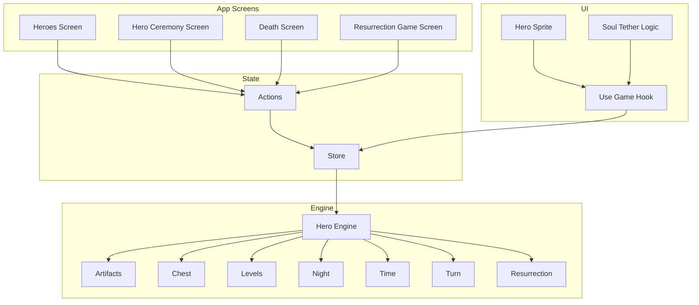
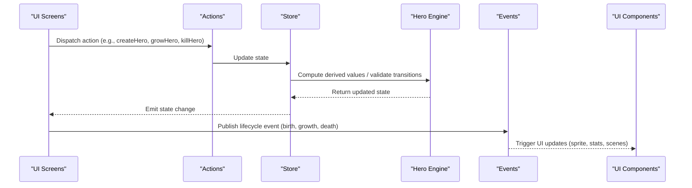
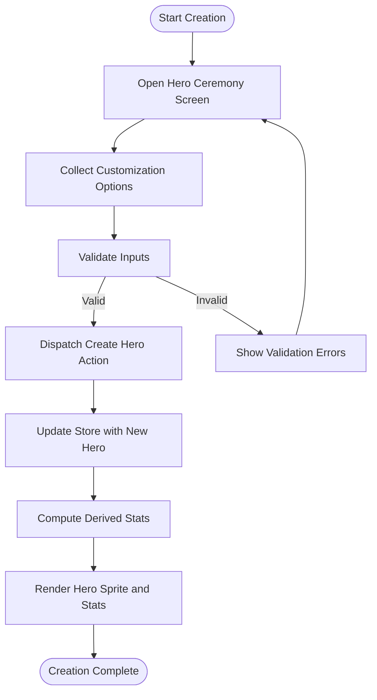
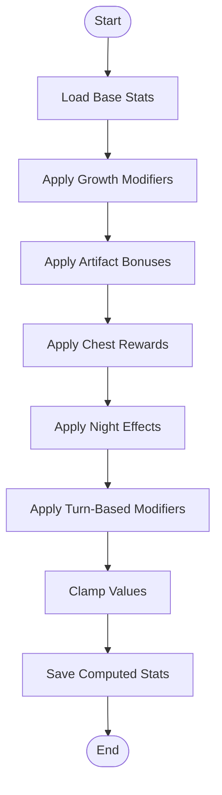
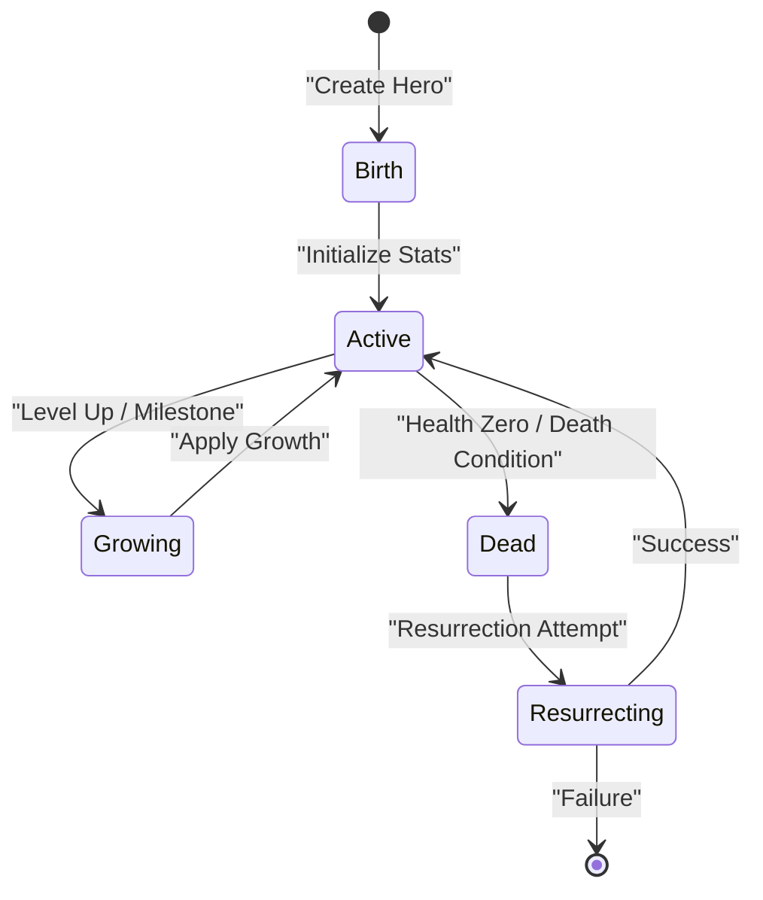
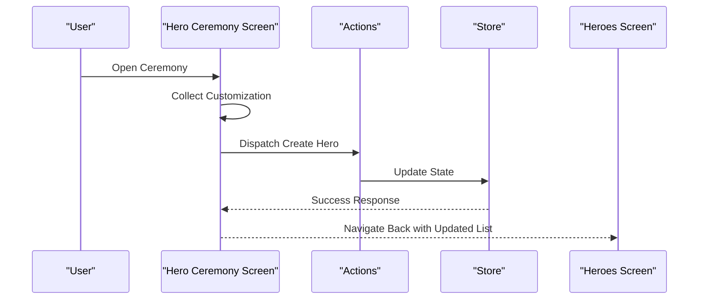
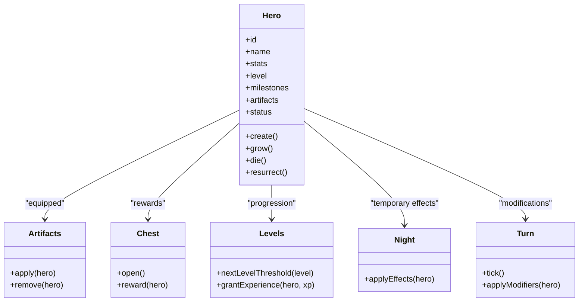
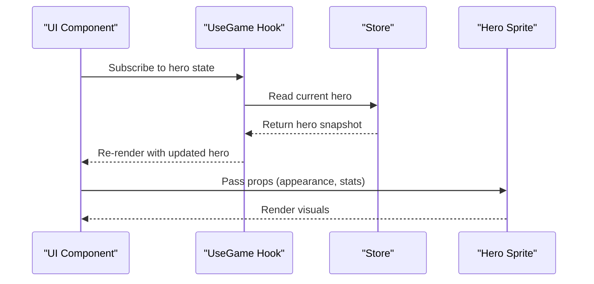
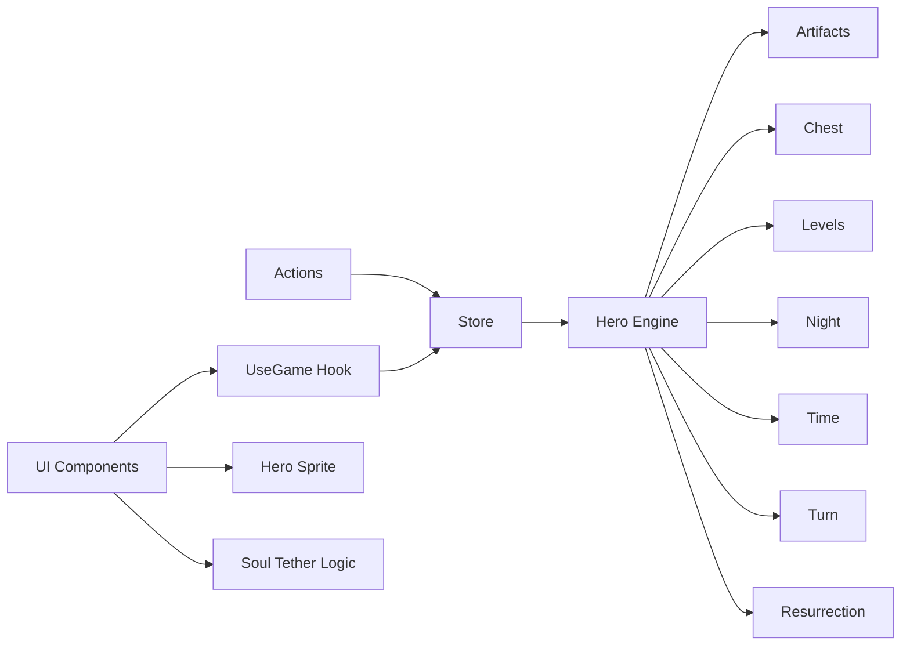

# Hero System

<cite>
**Referenced Files in This Document**
- [hero.ts](file://src/engine/hero.ts)
- [heroes.tsx](file://app/heroes.tsx)
- [HeroCeremonyScreen.tsx](file://src/screens/HeroCeremonyScreen.tsx)
- [death.tsx](file://app/death.tsx)
- [DeathScreen.tsx](file://src/screens/DeathScreen.tsx)
- [resurrection.ts](file://src/engine/resurrection.ts)
- [ResurrectionGameScreen.tsx](file://src/screens/ResurrectionGameScreen.tsx)
- [actions.ts](file://src/state/actions.ts)
- [store.ts](file://src/state/store.ts)
- [types.ts](file://src/contracts/types.ts)
- [events.ts](file://src/contracts/events.ts)
- [HeroSprite.tsx](file://src/ui/HeroSprite.tsx)
- [useGame.tsx](file://src/ui/useGame.tsx)
- [soulTetherLogic.ts](file://src/ui/soulTetherLogic.ts)
- [artifacts.ts](file://src/engine/artifacts.ts)
- [chest.ts](file://src/engine/chest.ts)
- [levels.ts](file://src/engine/levels.ts)
- [night.ts](file://src/engine/night.ts)
- [time.ts](file://src/engine/time.ts)
- [turn.ts](file://src/engine/turn.ts)
</cite>

## Table of Contents

1. [Introduction](#introduction)
2. [Project Structure](#project-structure)
3. [Core Components](#core-components)
4. [Architecture Overview](#architecture-overview)
5. [Detailed Component Analysis](#detailed-component-analysis)
6. [Dependency Analysis](#dependency-analysis)
7. [Performance Considerations](#performance-considerations)
8. [Troubleshooting Guide](#troubleshooting-guide)
9. [Conclusion](#conclusion)
10. [Appendices](#appendices)

## Introduction

This document explains the hero management system: how heroes are created, customized, leveled, and transition through lifecycle events such as birth, growth, death, and resurrection. It also covers ceremony mechanics, stat calculations, progression systems, and integration with UI components. The goal is to make the system understandable for both technical and non-technical readers while providing precise references to the codebase.

## Project Structure

The hero system spans engine logic, state management, screens, and UI components:

- Engine layer defines core data models, calculations, and lifecycle transitions.
- State layer provides actions and store updates that drive UI reactivity.
- App screens orchestrate user flows (creation, ceremony, death, resurrection).
- UI components render hero visuals, stats, and interactive elements.

**Diagram sources**

- [heroes.tsx](file://app/heroes.tsx)
- [HeroCeremonyScreen.tsx](file://src/screens/HeroCeremonyScreen.tsx)
- [DeathScreen.tsx](file://src/screens/DeathScreen.tsx)
- [ResurrectionGameScreen.tsx](file://src/screens/ResurrectionGameScreen.tsx)
- [hero.ts](file://src/engine/hero.ts)
- [artifacts.ts](file://src/engine/artifacts.ts)
- [chest.ts](file://src/engine/chest.ts)
- [levels.ts](file://src/engine/levels.ts)
- [night.ts](file://src/engine/night.ts)
- [time.ts](file://src/engine/time.ts)
- [turn.ts](file://src/engine/turn.ts)
- [resurrection.ts](file://src/engine/resurrection.ts)
- [actions.ts](file://src/state/actions.ts)
- [store.ts](file://src/state/store.ts)
- [HeroSprite.tsx](file://src/ui/HeroSprite.tsx)
- [soulTetherLogic.ts](file://src/ui/soulTetherLogic.ts)
- [useGame.tsx](file://src/ui/useGame.tsx)

**Section sources**

- [hero.ts](file://src/engine/hero.ts)
- [heroes.tsx](file://app/heroes.tsx)
- [HeroCeremonyScreen.tsx](file://src/screens/HeroCeremonyScreen.tsx)
- [DeathScreen.tsx](file://src/screens/DeathScreen.tsx)
- [ResurrectionGameScreen.tsx](file://src/screens/ResurrectionGameScreen.tsx)
- [actions.ts](file://src/state/actions.ts)
- [store.ts](file://src/state/store.ts)
- [types.ts](file://src/contracts/types.ts)
- [events.ts](file://src/contracts/events.ts)
- [HeroSprite.tsx](file://src/ui/HeroSprite.tsx)
- [soulTetherLogic.ts](file://src/ui/soulTetherLogic.ts)
- [useGame.tsx](file://src/ui/useGame.tsx)
- [artifacts.ts](file://src/engine/artifacts.ts)
- [chest.ts](file://src/engine/chest.ts)
- [levels.ts](file://src/engine/levels.ts)
- [night.ts](file://src/engine/night.ts)
- [time.ts](file://src/engine/time.ts)
- [turn.ts](file://src/engine/turn.ts)
- [resurrection.ts](file://src/engine/resurrection.ts)

## Core Components

- Hero Engine: Defines hero profiles, stats, customization options, and lifecycle transitions (birth, growth, death, resurrection).
- State Actions and Store: Provide typed actions to create, update, and transition heroes; persist and expose state to UI.
- Ceremony Flow: Orchestrates hero creation and customization via a dedicated screen.
- Death and Resurrection: Handles death triggers, game flow, and potential resurrection mechanics.
- UI Integration: Renders hero sprites, stats, and interactive elements; binds to game state via hooks.

Key responsibilities:

- Data modeling for hero profiles and stats.
- Stat calculation and modification pipelines.
- Lifecycle event handling and transitions.
- UI binding and rendering.

**Section sources**

- [hero.ts](file://src/engine/hero.ts)
- [actions.ts](file://src/state/actions.ts)
- [store.ts](file://src/state/store.ts)
- [types.ts](file://src/contracts/types.ts)
- [events.ts](file://src/contracts/events.ts)
- [HeroCeremonyScreen.tsx](file://src/screens/HeroCeremonyScreen.tsx)
- [DeathScreen.tsx](file://src/screens/DeathScreen.tsx)
- [ResurrectionGameScreen.tsx](file://src/screens/ResurrectionGameScreen.tsx)
- [HeroSprite.tsx](file://src/ui/HeroSprite.tsx)
- [useGame.tsx](file://src/ui/useGame.tsx)

## Architecture Overview

The hero system follows a layered architecture:

- UI screens dispatch actions.
- Actions mutate the store.
- Store updates trigger engine computations.
- Engine emits events and updates derived state.
- UI reacts to store changes and renders accordingly.

**Diagram sources**

- [actions.ts](file://src/state/actions.ts)
- [store.ts](file://src/state/store.ts)
- [hero.ts](file://src/engine/hero.ts)
- [events.ts](file://src/contracts/events.ts)
- [HeroSprite.tsx](file://src/ui/HeroSprite.tsx)
- [useGame.tsx](file://src/ui/useGame.tsx)

## Detailed Component Analysis

### Hero Creation and Customization

- Entry points: Heroes screen and Hero Ceremony screen guide users through creating a new hero and customizing appearance and initial stats.
- Workflow:
  - User selects or inputs customization options.
  - Action creates a hero profile with default base stats and customization flags.
  - Store persists the new hero and computes derived stats.
  - UI renders the hero sprite and initial stats.

**Diagram sources**

- [HeroCeremonyScreen.tsx](file://src/screens/HeroCeremonyScreen.tsx)
- [actions.ts](file://src/state/actions.ts)
- [store.ts](file://src/state/store.ts)
- [hero.ts](file://src/engine/hero.ts)
- [types.ts](file://src/contracts/types.ts)

**Section sources**

- [heroes.tsx](file://app/heroes.tsx)
- [HeroCeremonyScreen.tsx](file://src/screens/HeroCeremonyScreen.tsx)
- [actions.ts](file://src/state/actions.ts)
- [store.ts](file://src/state/store.ts)
- [hero.ts](file://src/engine/hero.ts)
- [types.ts](file://src/contracts/types.ts)

### Stat Calculations and Modifications

- Base stats are defined by the hero profile and modified by:
  - Growth events (leveling up, milestones).
  - Artifacts and equipment bonuses.
  - Chest rewards and consumables.
  - Night-time effects and turn-based modifiers.
- Calculation pipeline:
  - Start from base stats.
  - Apply additive and multiplicative modifiers.
  - Clamp values within allowed ranges.
  - Persist computed stats to store.

**Diagram sources**

- [hero.ts](file://src/engine/hero.ts)
- [artifacts.ts](file://src/engine/artifacts.ts)
- [chest.ts](file://src/engine/chest.ts)
- [night.ts](file://src/engine/night.ts)
- [turn.ts](file://src/engine/turn.ts)
- [store.ts](file://src/state/store.ts)

**Section sources**

- [hero.ts](file://src/engine/hero.ts)
- [artifacts.ts](file://src/engine/artifacts.ts)
- [chest.ts](file://src/engine/chest.ts)
- [night.ts](file://src/engine/night.ts)
- [turn.ts](file://src/engine/turn.ts)
- [store.ts](file://src/state/store.ts)

### Lifecycle Events: Birth, Growth, Death, Resurrection

- Birth:
  - Triggered upon hero creation.
  - Initializes state, sets starting stats, and publishes a birth event.
- Growth:
  - Triggered by leveling or milestone events.
  - Updates stats, unlocks features, and may grant artifacts.
- Death:
  - Triggered when health reaches zero or specific conditions.
  - Transitions to death screen and halts normal gameplay.
- Resurrection:
  - Optional mechanic allowing revival under certain conditions.
  - Resets or modifies state based on rules.

**Diagram sources**

- [hero.ts](file://src/engine/hero.ts)
- [death.tsx](file://app/death.tsx)
- [DeathScreen.tsx](file://src/screens/DeathScreen.tsx)
- [resurrection.ts](file://src/engine/resurrection.ts)
- [ResurrectionGameScreen.tsx](file://src/screens/ResurrectionGameScreen.tsx)

**Section sources**

- [hero.ts](file://src/engine/hero.ts)
- [death.tsx](file://app/death.tsx)
- [DeathScreen.tsx](file://src/screens/DeathScreen.tsx)
- [resurrection.ts](file://src/engine/resurrection.ts)
- [ResurrectionGameScreen.tsx](file://src/screens/ResurrectionGameScreen.tsx)

### Ceremony Mechanics

- The ceremony screen orchestrates hero creation and customization.
- It collects user inputs, validates them, and dispatches creation actions.
- On success, it updates the store and navigates back to the main heroes view.

**Diagram sources**

- [HeroCeremonyScreen.tsx](file://src/screens/HeroCeremonyScreen.tsx)
- [actions.ts](file://src/state/actions.ts)
- [store.ts](file://src/state/store.ts)
- [heroes.tsx](file://app/heroes.tsx)

**Section sources**

- [HeroCeremonyScreen.tsx](file://src/screens/HeroCeremonyScreen.tsx)
- [actions.ts](file://src/state/actions.ts)
- [store.ts](file://src/state/store.ts)
- [heroes.tsx](file://app/heroes.tsx)

### Progression Systems

- Leveling and milestones modify hero capabilities.
- Artifacts provide persistent bonuses.
- Chests offer random or deterministic rewards.
- Night and turn systems influence temporary modifiers.

**Diagram sources**

- [hero.ts](file://src/engine/hero.ts)
- [artifacts.ts](file://src/engine/artifacts.ts)
- [chest.ts](file://src/engine/chest.ts)
- [levels.ts](file://src/engine/levels.ts)
- [night.ts](file://src/engine/night.ts)
- [turn.ts](file://src/engine/turn.ts)

**Section sources**

- [hero.ts](file://src/engine/hero.ts)
- [artifacts.ts](file://src/engine/artifacts.ts)
- [chest.ts](file://src/engine/chest.ts)
- [levels.ts](file://src/engine/levels.ts)
- [night.ts](file://src/engine/night.ts)
- [turn.ts](file://src/engine/turn.ts)

### UI Integration

- HeroSprite renders the visual representation of the hero.
- Soul Tether Logic manages connections between hero and other entities.
- UseGame hook exposes store state and actions to components.

**Diagram sources**

- [HeroSprite.tsx](file://src/ui/HeroSprite.tsx)
- [soulTetherLogic.ts](file://src/ui/soulTetherLogic.ts)
- [useGame.tsx](file://src/ui/useGame.tsx)
- [store.ts](file://src/state/store.ts)

**Section sources**

- [HeroSprite.tsx](file://src/ui/HeroSprite.tsx)
- [soulTetherLogic.ts](file://src/ui/soulTetherLogic.ts)
- [useGame.tsx](file://src/ui/useGame.tsx)
- [store.ts](file://src/state/store.ts)

## Dependency Analysis

The hero system depends on several subsystems for complete functionality:

- Engine dependencies: artifacts, chest, levels, night, time, turn, resurrection.
- State dependencies: actions and store.
- UI dependencies: hero sprite, soul tether logic, use game hook.

**Diagram sources**

- [hero.ts](file://src/engine/hero.ts)
- [artifacts.ts](file://src/engine/artifacts.ts)
- [chest.ts](file://src/engine/chest.ts)
- [levels.ts](file://src/engine/levels.ts)
- [night.ts](file://src/engine/night.ts)
- [time.ts](file://src/engine/time.ts)
- [turn.ts](file://src/engine/turn.ts)
- [resurrection.ts](file://src/engine/resurrection.ts)
- [actions.ts](file://src/state/actions.ts)
- [store.ts](file://src/state/store.ts)
- [HeroSprite.tsx](file://src/ui/HeroSprite.tsx)
- [soulTetherLogic.ts](file://src/ui/soulTetherLogic.ts)
- [useGame.tsx](file://src/ui/useGame.tsx)

**Section sources**

- [hero.ts](file://src/engine/hero.ts)
- [artifacts.ts](file://src/engine/artifacts.ts)
- [chest.ts](file://src/engine/chest.ts)
- [levels.ts](file://src/engine/levels.ts)
- [night.ts](file://src/engine/night.ts)
- [time.ts](file://src/engine/time.ts)
- [turn.ts](file://src/engine/turn.ts)
- [resurrection.ts](file://src/engine/resurrection.ts)
- [actions.ts](file://src/state/actions.ts)
- [store.ts](file://src/state/store.ts)
- [HeroSprite.tsx](file://src/ui/HeroSprite.tsx)
- [soulTetherLogic.ts](file://src/ui/soulTetherLogic.ts)
- [useGame.tsx](file://src/ui/useGame.tsx)

## Performance Considerations

- Batch updates: Group multiple stat modifications into a single store update to reduce re-renders.
- Lazy loading: Defer heavy computations until needed (e.g., artifact effects).
- Memoization: Cache derived stats to avoid recomputation on every render.
- Event throttling: Limit frequency of lifecycle events to prevent excessive UI updates.

[No sources needed since this section provides general guidance]

## Troubleshooting Guide

Common issues and resolutions:

- Invalid hero creation: Ensure all required customization fields are provided and validated before dispatching actions.
- Stat anomalies: Check modifier application order and clamping logic; verify artifact and chest interactions.
- Stuck in death state: Confirm resurrection conditions and transitions; review death screen navigation logic.
- UI not updating: Verify store subscriptions and ensure actions correctly mutate state.

**Section sources**

- [HeroCeremonyScreen.tsx](file://src/screens/HeroCeremonyScreen.tsx)
- [hero.ts](file://src/engine/hero.ts)
- [artifacts.ts](file://src/engine/artifacts.ts)
- [chest.ts](file://src/engine/chest.ts)
- [DeathScreen.tsx](file://src/screens/DeathScreen.tsx)
- [resurrection.ts](file://src/engine/resurrection.ts)
- [store.ts](file://src/state/store.ts)

## Conclusion

The hero system integrates creation, customization, progression, and lifecycle management across engine, state, and UI layers. By following the documented workflows and diagrams, developers can extend and maintain the system effectively while ensuring consistent behavior and performance.

[No sources needed since this section summarizes without analyzing specific files]

## Appendices

### Data Models Summary

- Hero Profile: Contains identity, base stats, level, milestones, equipped artifacts, and status.
- Stat Definitions: Include health, attack, defense, speed, and derived attributes.
- State Transitions: Define valid transitions between birth, active, growing, dead, and resurrecting states.

[No sources needed since this section provides conceptual summaries]
