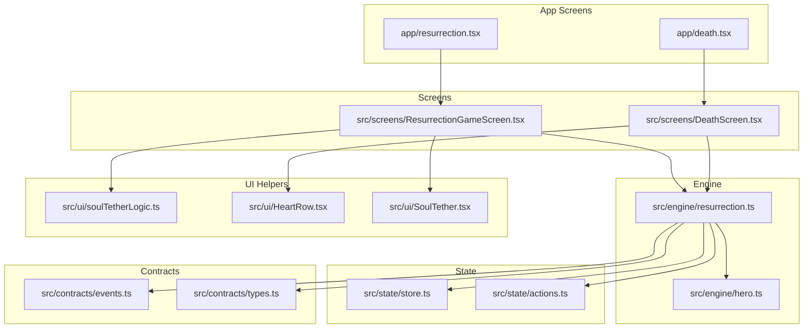
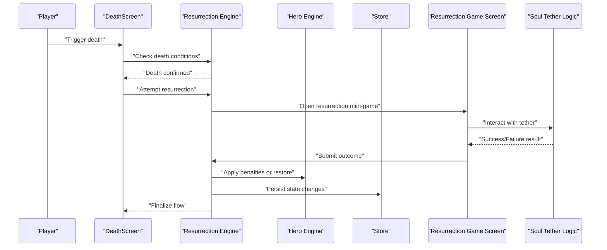
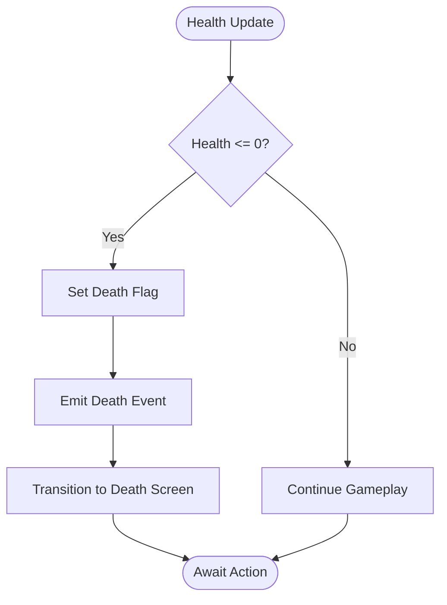
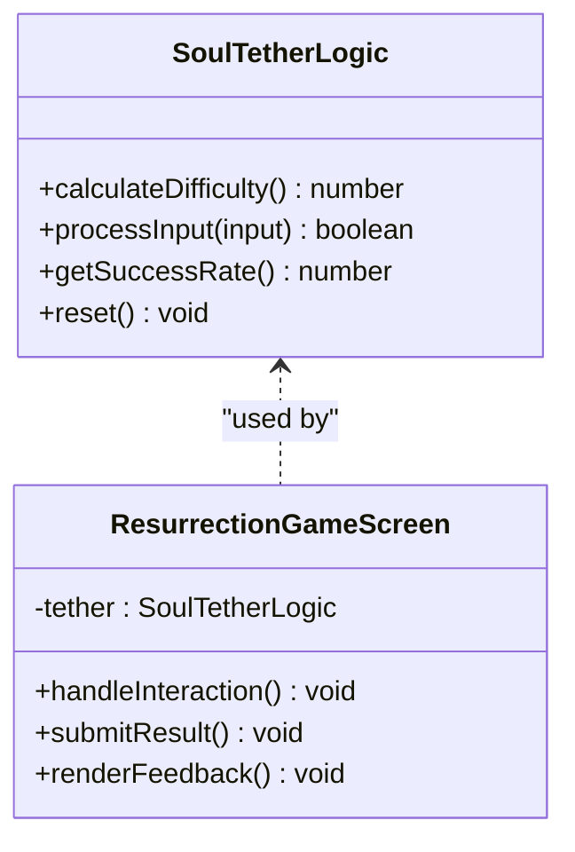
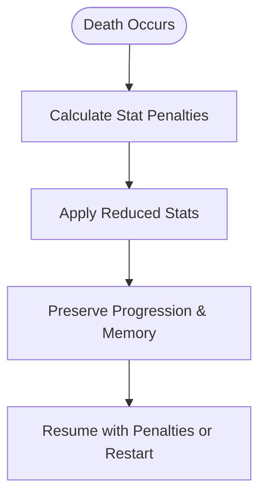
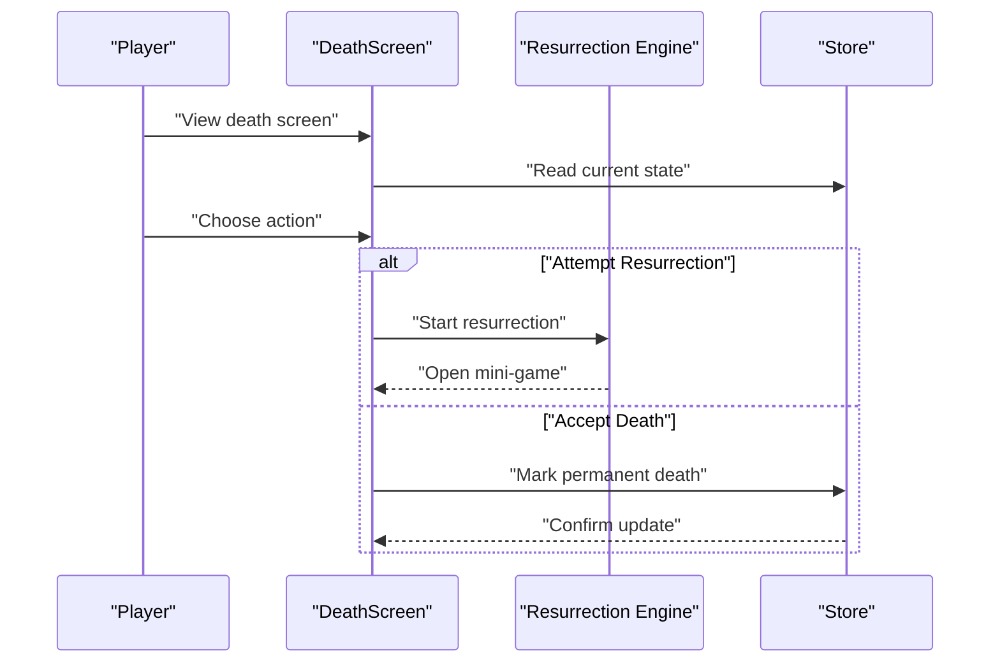
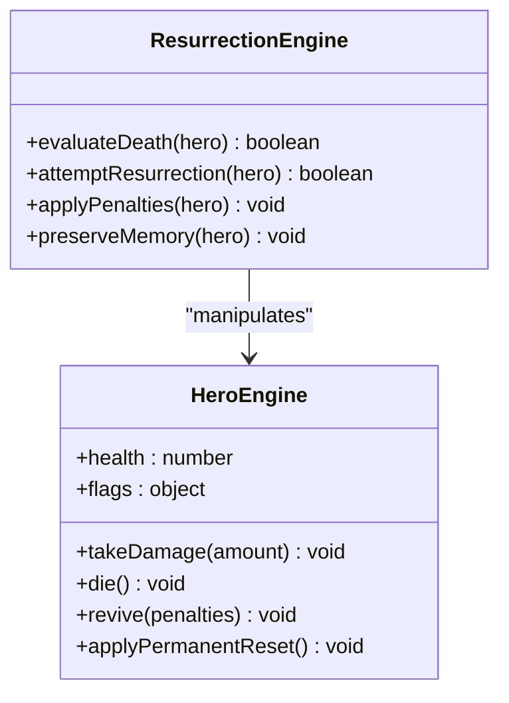
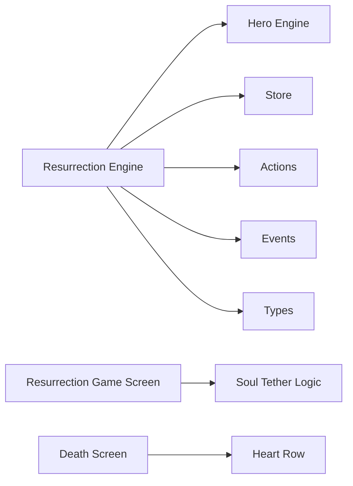

# Resurrection Mechanics

<cite>
**Referenced Files in This Document**
- [death.tsx](file://app/death.tsx)
- [resurrection.tsx](file://app/resurrection.tsx)
- [resurrection.ts](file://src/engine/resurrection.ts)
- [DeathScreen.tsx](file://src/screens/DeathScreen.tsx)
- [ResurrectionGameScreen.tsx](file://src/screens/ResurrectionGameScreen.tsx)
- [hero.ts](file://src/engine/hero.ts)
- [store.ts](file://src/state/store.ts)
- [actions.ts](file://src/state/actions.ts)
- [events.ts](file://src/contracts/events.ts)
- [types.ts](file://src/contracts/types.ts)
- [soulTetherLogic.ts](file://src/ui/soulTetherLogic.ts)
- [HeartRow.tsx](file://src/ui/HeartRow.tsx)
- [SoulTether.tsx](file://src/ui/SoulTether.tsx)
</cite>

## Table of Contents

1. [Introduction](#introduction)
2. [Project Structure](#project-structure)
3. [Core Components](#core-components)
4. [Architecture Overview](#architecture-overview)
5. [Detailed Component Analysis](#detailed-component-analysis)
6. [Dependency Analysis](#dependency-analysis)
7. [Performance Considerations](#performance-considerations)
8. [Troubleshooting Guide](#troubleshooting-guide)
9. [Conclusion](#conclusion)

## Introduction

This document explains the resurrection system that manages death and rebirth gameplay loops. It covers death conditions, triggers for resurrection, the resurrection mini-game mechanics, stat penalties, memory retention, progression continuity after death, death screen UI flow, resurrection game states, and integration with the hero lifecycle. It also provides examples of death scenarios and their outcomes.

## Project Structure

The resurrection system spans UI screens, engine logic, state management, and UI utilities:

- Engine: core rules for death, resurrection, and soul tether mechanics
- Screens: death screen and resurrection mini-game UI
- State: store and actions for persisting and updating game state across death/rebirth
- Contracts: shared types and events used by the resurrection flow
- UI helpers: visual components for health and soul tether during death/resurrection

**Diagram sources**

- [death.tsx](file://app/death.tsx)
- [resurrection.tsx](file://app/resurrection.tsx)
- [resurrection.ts](file://src/engine/resurrection.ts)
- [DeathScreen.tsx](file://src/screens/DeathScreen.tsx)
- [ResurrectionGameScreen.tsx](file://src/screens/ResurrectionGameScreen.tsx)
- [hero.ts](file://src/engine/hero.ts)
- [store.ts](file://src/state/store.ts)
- [actions.ts](file://src/state/actions.ts)
- [events.ts](file://src/contracts/events.ts)
- [types.ts](file://src/contracts/types.ts)
- [soulTetherLogic.ts](file://src/ui/soulTetherLogic.ts)
- [HeartRow.tsx](file://src/ui/HeartRow.tsx)
- [SoulTether.tsx](file://src/ui/SoulTether.tsx)

**Section sources**

- [death.tsx](file://app/death.tsx)
- [resurrection.tsx](file://app/resurrection.tsx)
- [resurrection.ts](file://src/engine/resurrection.ts)
- [DeathScreen.tsx](file://src/screens/DeathScreen.tsx)
- [ResurrectionGameScreen.tsx](file://src/screens/ResurrectionGameScreen.tsx)
- [hero.ts](file://src/engine/hero.ts)
- [store.ts](file://src/state/store.ts)
- [actions.ts](file://src/state/actions.ts)
- [events.ts](file://src/contracts/events.ts)
- [types.ts](file://src/contracts/types.ts)
- [soulTetherLogic.ts](file://src/ui/soulTetherLogic.ts)
- [HeartRow.tsx](file://src/ui/HeartRow.tsx)
- [SoulTether.tsx](file://src/ui/SoulTether.tsx)

## Core Components

- Resurrection engine: central logic for determining death, calculating penalties, and resolving resurrection attempts
- Death screen: presents death state and offers options to attempt resurrection or accept permanent death
- Resurrection mini-game: interactive challenge where players can restore the hero’s life based on soul tether mechanics
- Hero lifecycle integration: updates hero stats, flags, and progression state upon death or successful resurrection
- State persistence: ensures continuity of progress and memory across death/rebirth cycles

Key responsibilities:

- Evaluate death conditions from hero health and related systems
- Trigger resurrection UI and mini-game when possible
- Apply stat penalties and retain memory/progression as defined by rules
- Persist state changes via store and actions
- Emit events for external systems (e.g., analytics, audio)

**Section sources**

- [resurrection.ts](file://src/engine/resurrection.ts)
- [DeathScreen.tsx](file://src/screens/DeathScreen.tsx)
- [ResurrectionGameScreen.tsx](file://src/screens/ResurrectionGameScreen.tsx)
- [hero.ts](file://src/engine/hero.ts)
- [store.ts](file://src/state/store.ts)
- [actions.ts](file://src/state/actions.ts)
- [events.ts](file://src/contracts/events.ts)
- [types.ts](file://src/contracts/types.ts)

## Architecture Overview

The resurrection flow integrates UI, engine, and state layers:

**Diagram sources**

- [DeathScreen.tsx](file://src/screens/DeathScreen.tsx)
- [resurrection.ts](file://src/engine/resurrection.ts)
- [ResurrectionGameScreen.tsx](file://src/screens/ResurrectionGameScreen.tsx)
- [soulTetherLogic.ts](file://src/ui/soulTetherLogic.ts)
- [hero.ts](file://src/engine/hero.ts)
- [store.ts](file://src/state/store.ts)

## Detailed Component Analysis

### Death Conditions and Triggers

- Death is determined by evaluating hero health and related status flags
- When health reaches zero or critical thresholds, the system transitions to death state
- The death trigger emits an event and updates the store to reflect the new state

**Diagram sources**

- [resurrection.ts](file://src/engine/resurrection.ts)
- [hero.ts](file://src/engine/hero.ts)
- [events.ts](file://src/contracts/events.ts)

**Section sources**

- [resurrection.ts](file://src/engine/resurrection.ts)
- [hero.ts](file://src/engine/hero.ts)
- [events.ts](file://src/contracts/events.ts)

### Resurrection Mini-Game Mechanics

- The mini-game uses a soul tether mechanic to determine success probability
- Players interact with the tether through timed inputs or pattern matching
- Success restores the hero; failure may apply additional penalties or lock resurrection temporarily

**Diagram sources**

- [soulTetherLogic.ts](file://src/ui/soulTetherLogic.ts)
- [ResurrectionGameScreen.tsx](file://src/screens/ResurrectionGameScreen.tsx)

**Section sources**

- [soulTetherLogic.ts](file://src/ui/soulTetherLogic.ts)
- [ResurrectionGameScreen.tsx](file://src/screens/ResurrectionGameScreen.tsx)

### Stat Penalties and Memory Retention

- Upon death, certain stats are reduced according to penalty rules
- Memory retention preserves key progression markers, unlocked content, and learned patterns
- Continuity ensures players retain strategic knowledge while facing meaningful consequences

**Diagram sources**

- [resurrection.ts](file://src/engine/resurrection.ts)
- [hero.ts](file://src/engine/hero.ts)
- [store.ts](file://src/state/store.ts)

**Section sources**

- [resurrection.ts](file://src/engine/resurrection.ts)
- [hero.ts](file://src/engine/hero.ts)
- [store.ts](file://src/state/store.ts)

### Death Screen UI Flow

- Presents death state and options: attempt resurrection or accept permanent death
- Integrates with heart display and soul tether visuals to communicate status
- On selection, transitions to resurrection mini-game or finalizes death

**Diagram sources**

- [DeathScreen.tsx](file://src/screens/DeathScreen.tsx)
- [resurrection.ts](file://src/engine/resurrection.ts)
- [store.ts](file://src/state/store.ts)

**Section sources**

- [DeathScreen.tsx](file://src/screens/DeathScreen.tsx)
- [resurrection.ts](file://src/engine/resurrection.ts)
- [store.ts](file://src/state/store.ts)

### Integration with Hero Lifecycle

- Death affects hero health, flags, and possibly inventory or abilities
- Successful resurrection restores the hero with adjusted stats and preserved memory
- Permanent death resets specific progression elements while retaining long-term unlocks

**Diagram sources**

- [hero.ts](file://src/engine/hero.ts)
- [resurrection.ts](file://src/engine/resurrection.ts)

**Section sources**

- [hero.ts](file://src/engine/hero.ts)
- [resurrection.ts](file://src/engine/resurrection.ts)

### Examples of Death Scenarios and Outcomes

- Scenario A: Low health combat loss → death screen appears → resurrection attempted → success with minor stat reduction → continue gameplay
- Scenario B: Critical damage spike → death screen → resurrection fails → temporary lockout → retry later with restored chances
- Scenario C: Repeated deaths → increased penalties → memory retained → progression continues with higher difficulty

[No sources needed since this section provides conceptual examples]

## Dependency Analysis

The resurrection system depends on several modules:

**Diagram sources**

- [resurrection.ts](file://src/engine/resurrection.ts)
- [hero.ts](file://src/engine/hero.ts)
- [store.ts](file://src/state/store.ts)
- [actions.ts](file://src/state/actions.ts)
- [events.ts](file://src/contracts/events.ts)
- [types.ts](file://src/contracts/types.ts)
- [ResurrectionGameScreen.tsx](file://src/screens/ResurrectionGameScreen.tsx)
- [soulTetherLogic.ts](file://src/ui/soulTetherLogic.ts)
- [DeathScreen.tsx](file://src/screens/DeathScreen.tsx)
- [HeartRow.tsx](file://src/ui/HeartRow.tsx)

**Section sources**

- [resurrection.ts](file://src/engine/resurrection.ts)
- [hero.ts](file://src/engine/hero.ts)
- [store.ts](file://src/state/store.ts)
- [actions.ts](file://src/state/actions.ts)
- [events.ts](file://src/contracts/events.ts)
- [types.ts](file://src/contracts/types.ts)
- [ResurrectionGameScreen.tsx](file://src/screens/ResurrectionGameScreen.tsx)
- [soulTetherLogic.ts](file://src/ui/soulTetherLogic.ts)
- [DeathScreen.tsx](file://src/screens/DeathScreen.tsx)
- [HeartRow.tsx](file://src/ui/HeartRow.tsx)

## Performance Considerations

- Minimize state updates during resurrection mini-game to avoid UI lag
- Cache difficulty calculations for soul tether to reduce recomputation
- Debounce rapid inputs in the mini-game to prevent excessive processing
- Use efficient data structures for hero state to speed up penalty application

[No sources needed since this section provides general guidance]

## Troubleshooting Guide

Common issues and resolutions:

- Resurrection mini-game not responding: verify input handling and tether logic initialization
- Stats not applying correctly: check penalty calculation and store updates
- Memory not retained: ensure preservation step runs before state reset
- Death screen stuck: confirm transition logic and event emission

**Section sources**

- [resurrection.ts](file://src/engine/resurrection.ts)
- [ResurrectionGameScreen.tsx](file://src/screens/ResurrectionGameScreen.tsx)
- [soulTetherLogic.ts](file://src/ui/soulTetherLogic.ts)
- [store.ts](file://src/state/store.ts)

## Conclusion

The resurrection system provides a balanced death/rebirth loop that challenges players while preserving meaningful progression. Through clear UI flows, engaging mini-game mechanics, and thoughtful stat penalties, it enhances gameplay depth without frustrating repetition. Proper integration with hero lifecycle and state management ensures consistency and continuity across death and resurrection cycles.

[No sources needed since this section summarizes without analyzing specific files]
