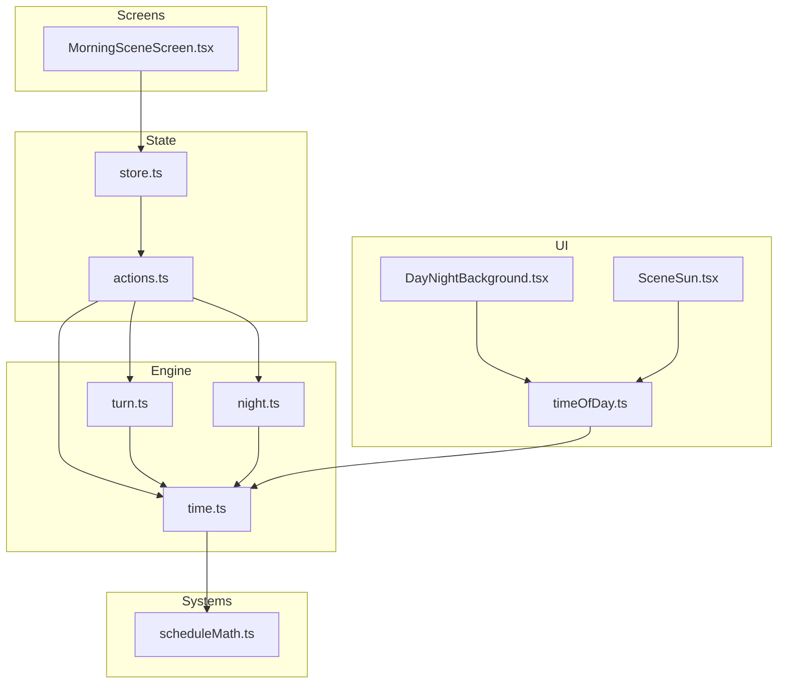
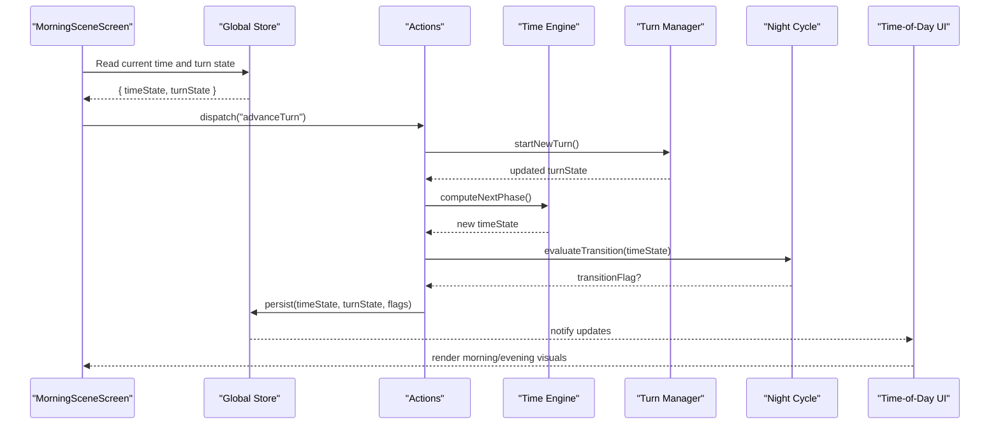
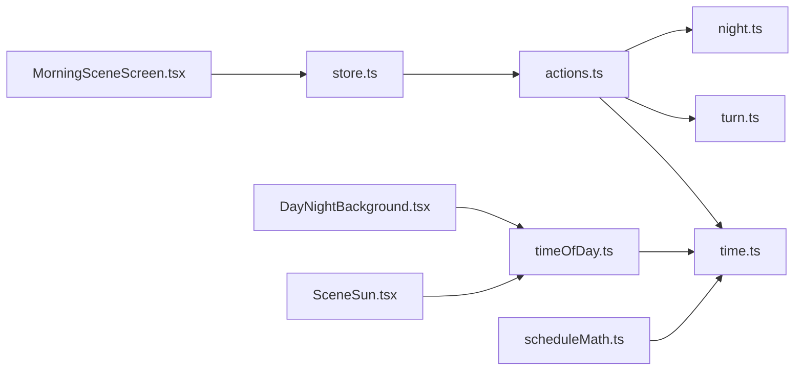

# Time & Turn System

<cite>
**Referenced Files in This Document**
- [time.ts](file://src/engine/time.ts)
- [turn.ts](file://src/engine/turn.ts)
- [night.ts](file://src/engine/night.ts)
- [scheduleMath.ts](file://src/systems/scheduleMath.ts)
- [timeOfDay.ts](file://src/ui/timeOfDay.ts)
- [store.ts](file://src/state/store.ts)
- [actions.ts](file://src/state/actions.ts)
- [MorningSceneScreen.tsx](file://app/morning-scene.tsx)
- [MorningSceneScreen.tsx](file://src/screens/MorningSceneScreen.tsx)
- [useGame.tsx](file://src/ui/useGame.tsx)
- [DayNightBackground.tsx](file://src/ui/DayNightBackground.tsx)
- [sceneSun.tsx](file://src/ui/SceneSun.tsx)
- [manifest.data.json](file://assets/manifest.data.json)
</cite>

## Table of Contents

1. [Introduction](#introduction)
2. [Project Structure](#project-structure)
3. [Core Components](#core-components)
4. [Architecture Overview](#architecture-overview)
5. [Detailed Component Analysis](#detailed-component-analysis)
6. [Dependency Analysis](#dependency-analysis)
7. [Performance Considerations](#performance-considerations)
8. [Troubleshooting Guide](#troubleshooting-guide)
9. [Conclusion](#conclusion)
10. [Appendices](#appendices)

## Introduction

This document explains the time-based mechanics that drive morning/evening cycles and turn progression, how time influences gameplay and event scheduling, and how scene transitions are triggered by time. It also details the turn management system including action points, cooldowns, and turn-based logic. Finally, it covers time zone handling, persistence of time state, and synchronization across game sessions, with examples of time-dependent events and turn-based interactions.

## Project Structure

The time and turn systems are implemented primarily in the engine layer (time and turn modules), supported by UI components for visual feedback and a schedule math utility for precise timing. State is persisted via the global store and actions. Screens orchestrate transitions based on time conditions.

**Diagram sources**

- [time.ts](file://src/engine/time.ts)
- [turn.ts](file://src/engine/turn.ts)
- [night.ts](file://src/engine/night.ts)
- [scheduleMath.ts](file://src/systems/scheduleMath.ts)
- [timeOfDay.ts](file://src/ui/timeOfDay.ts)
- [DayNightBackground.tsx](file://src/ui/DayNightBackground.tsx)
- [SceneSun.tsx](file://src/ui/SceneSun.tsx)
- [store.ts](file://src/state/store.ts)
- [actions.ts](file://src/state/actions.ts)
- [MorningSceneScreen.tsx](file://app/morning-scene.tsx)
- [MorningSceneScreen.tsx](file://src/screens/MorningSceneScreen.tsx)

**Section sources**

- [time.ts](file://src/engine/time.ts)
- [turn.ts](file://src/engine/turn.ts)
- [night.ts](file://src/engine/night.ts)
- [scheduleMath.ts](file://src/systems/scheduleMath.ts)
- [timeOfDay.ts](file://src/ui/timeOfDay.ts)
- [store.ts](file://src/state/store.ts)
- [actions.ts](file://src/state/actions.ts)
- [MorningSceneScreen.tsx](file://app/morning-scene.tsx)
- [MorningSceneScreen.tsx](file://src/screens/MorningSceneScreen.tsx)

## Core Components

- Time Engine: Computes current time-of-day, day boundaries, and cycle phases; exposes helpers to query whether it is morning or evening and to advance time deterministically.
- Turn Manager: Maintains action points per turn, cooldown tracking, and turn lifecycle (start, action, end). Integrates with time to gate actions and trigger transitions.
- Night Cycle: Coordinates night-specific logic and transitions between morning and evening states.
- Schedule Math: Provides deterministic calculations for scheduled events relative to device time and timezone offsets.
- UI Time-of-Day: Derives visual cues (backgrounds, sun position) from the computed time state.
- State Persistence: Stores time-related state and turn progress so sessions can resume consistently.

Key responsibilities:

- Compute and normalize local time using device settings and timezone offsets.
- Maintain persistent time-of-day and turn counters across app restarts.
- Gate actions based on available action points and cooldown windows.
- Trigger scene transitions when time thresholds are reached.

**Section sources**

- [time.ts](file://src/engine/time.ts)
- [turn.ts](file://src/engine/turn.ts)
- [night.ts](file://src/engine/night.ts)
- [scheduleMath.ts](file://src/systems/scheduleMath.ts)
- [timeOfDay.ts](file://src/ui/timeOfDay.ts)
- [store.ts](file://src/state/store.ts)
- [actions.ts](file://src/state/actions.ts)

## Architecture Overview

The architecture separates concerns into engine (time and turns), systems (schedule math), UI (visual time-of-day), and state (persistence and actions). Screens react to state changes and invoke actions to mutate time and turn state.

**Diagram sources**

- [MorningSceneScreen.tsx](file://app/morning-scene.tsx)
- [MorningSceneScreen.tsx](file://src/screens/MorningSceneScreen.tsx)
- [store.ts](file://src/state/store.ts)
- [actions.ts](file://src/state/actions.ts)
- [time.ts](file://src/engine/time.ts)
- [turn.ts](file://src/engine/turn.ts)
- [night.ts](file://src/engine/night.ts)
- [timeOfDay.ts](file://src/ui/timeOfDay.ts)

## Detailed Component Analysis

### Time Engine

Responsibilities:

- Determine current time-of-day phase (morning/evening) based on normalized local time.
- Provide deterministic advancement functions to move time forward within a session.
- Expose helpers for checking thresholds that trigger scene transitions.

Design patterns:

- Pure functions for time calculations to ensure reproducibility.
- Centralized time normalization to handle device clock drift and timezone differences.

Complexity:

- O(1) computations for phase checks and threshold comparisons.

Error handling:

- Validates inputs such as invalid timestamps or out-of-range offsets.
- Returns safe defaults when device time is unavailable.

Optimization opportunities:

- Cache recent time computations to avoid redundant recalculations during rapid UI updates.

Persistence and sync:

- Persisted via store fields for current phase and last update timestamp.
- On load, reconciles stored time with device time to maintain continuity.

**Section sources**

- [time.ts](file://src/engine/time.ts)
- [store.ts](file://src/state/store.ts)

### Turn Manager

Responsibilities:

- Manage action points per turn and enforce spending rules.
- Track cooldowns for abilities or actions, preventing reuse until cooldown expires.
- Coordinate turn lifecycle: initialization, action execution, and finalization.

Data structures:

- Action point pool with max capacity and current balance.
- Cooldown map keyed by action ID with expiration timestamps.
- Turn counter and status flags.

Algorithms:

- Spend action points atomically with validation.
- Update cooldowns by comparing current time against expiration times.
- End-turn cleanup resets or carries over state according to design rules.

Complexity:

- O(1) for spend and cooldown checks; O(n) for periodic cleanup if scanning all cooldowns.

Error handling:

- Rejects actions when insufficient action points or active cooldown.
- Guards against negative balances and invalid IDs.

Integration with time:

- Uses time engine to determine valid windows for actions and to expire cooldowns.
- Triggers transitions when turn ends at specific time thresholds.

**Section sources**

- [turn.ts](file://src/engine/turn.ts)
- [time.ts](file://src/engine/time.ts)

### Night Cycle

Responsibilities:

- Evaluate conditions to transition between morning and evening scenes.
- Apply night-specific effects and reset or carry over state as needed.

Logic flow:

- Check time thresholds and turn boundaries.
- Toggle cycle flag and update UI accordingly.

Edge cases:

- Handles rapid back-and-forth transitions by debouncing or enforcing minimum durations.

**Section sources**

- [night.ts](file://src/engine/night.ts)
- [time.ts](file://src/engine/time.ts)

### Schedule Math

Responsibilities:

- Compute deterministic schedules aligned with device time and timezone offsets.
- Provide utilities to calculate next event times and intervals.

Algorithm highlights:

- Normalizes timestamps to UTC before applying local offsets.
- Rounds to nearest schedule boundary to avoid jitter.

Complexity:

- O(1) per calculation with minimal allocations.

**Section sources**

- [scheduleMath.ts](file://src/systems/scheduleMath.ts)

### UI Time-of-Day

Responsibilities:

- Derive visual elements (backgrounds, sun position) from time state.
- Animate transitions smoothly when crossing thresholds.

Integration:

- Subscribes to store updates and re-renders only when time phase changes.

**Section sources**

- [timeOfDay.ts](file://src/ui/timeOfDay.ts)
- [DayNightBackground.tsx](file://src/ui/DayNightBackground.tsx)
- [SceneSun.tsx](file://src/ui/SceneSun.tsx)

### State Persistence and Synchronization

Responsibilities:

- Persist time state, turn counters, and cooldowns across sessions.
- Reconcile stored state with device time on startup to prevent drift.

Synchronization strategy:

- On app launch, read persisted values and adjust for elapsed real time.
- Debounce frequent writes to reduce I/O overhead.

**Section sources**

- [store.ts](file://src/state/store.ts)
- [actions.ts](file://src/state/actions.ts)

## Dependency Analysis

The following diagram shows how components depend on each other:

**Diagram sources**

- [MorningSceneScreen.tsx](file://app/morning-scene.tsx)
- [MorningSceneScreen.tsx](file://src/screens/MorningSceneScreen.tsx)
- [store.ts](file://src/state/store.ts)
- [actions.ts](file://src/state/actions.ts)
- [time.ts](file://src/engine/time.ts)
- [turn.ts](file://src/engine/turn.ts)
- [night.ts](file://src/engine/night.ts)
- [timeOfDay.ts](file://src/ui/timeOfDay.ts)
- [DayNightBackground.tsx](file://src/ui/DayNightBackground.tsx)
- [SceneSun.tsx](file://src/ui/SceneSun.tsx)
- [scheduleMath.ts](file://src/systems/scheduleMath.ts)

**Section sources**

- [store.ts](file://src/state/store.ts)
- [actions.ts](file://src/state/actions.ts)
- [time.ts](file://src/engine/time.ts)
- [turn.ts](file://src/engine/turn.ts)
- [night.ts](file://src/engine/night.ts)
- [timeOfDay.ts](file://src/ui/timeOfDay.ts)
- [DayNightBackground.tsx](file://src/ui/DayNightBackground.tsx)
- [SceneSun.tsx](file://src/ui/SceneSun.tsx)
- [scheduleMath.ts](file://src/systems/scheduleMath.ts)

## Performance Considerations

- Minimize recomputation by caching time-of-day results between frames.
- Batch state updates to reduce store write frequency.
- Use lightweight checks for cooldown expiration rather than full scans where possible.
- Avoid heavy UI work during critical transitions; defer animations until after state settles.

[No sources needed since this section provides general guidance]

## Troubleshooting Guide

Common issues and resolutions:

- Time drift: Ensure device time is synchronized and timezone offsets are applied correctly. Validate persisted timestamps against current device time on startup.
- Stuck turns: Verify action point spending logic and cooldown expiration checks. Confirm that end-turn cleanup runs reliably.
- Incorrect visuals: Check time-of-day derivation and UI subscription to store updates. Ensure transitions are not blocked by debouncing thresholds.
- Event scheduling anomalies: Review schedule math for rounding and boundary alignment. Confirm that events fire within expected windows.

**Section sources**

- [time.ts](file://src/engine/time.ts)
- [turn.ts](file://src/engine/turn.ts)
- [scheduleMath.ts](file://src/systems/scheduleMath.ts)
- [timeOfDay.ts](file://src/ui/timeOfDay.ts)

## Conclusion

The time and turn systems provide a robust foundation for morning/evening cycles and turn-based gameplay. By separating time computation, turn management, and UI rendering, the system remains maintainable and performant. Persistence and synchronization ensure consistent experiences across sessions, while schedule math guarantees reliable event timing.

[No sources needed since this section summarizes without analyzing specific files]

## Appendices

### Examples of Time-Dependent Events

- Morning scene unlocks when time crosses the morning threshold; evening scene triggers at dusk.
- Cooldowns expire based on current time, gating repeated actions until allowed.
- Scheduled rewards appear at predefined intervals calculated via schedule math.

**Section sources**

- [night.ts](file://src/engine/night.ts)
- [scheduleMath.ts](file://src/systems/scheduleMath.ts)
- [turn.ts](file://src/engine/turn.ts)

### Example Turn-Based Interactions

- Player initiates an action: validate action points and cooldowns, then consume points and set cooldown expiration.
- Turn end: finalize pending actions, apply effects, and prepare next turn’s action point budget.
- Transition: if turn end aligns with time threshold, trigger morning/evening scene change.

**Section sources**

- [turn.ts](file://src/engine/turn.ts)
- [time.ts](file://src/engine/time.ts)
- [night.ts](file://src/engine/night.ts)
