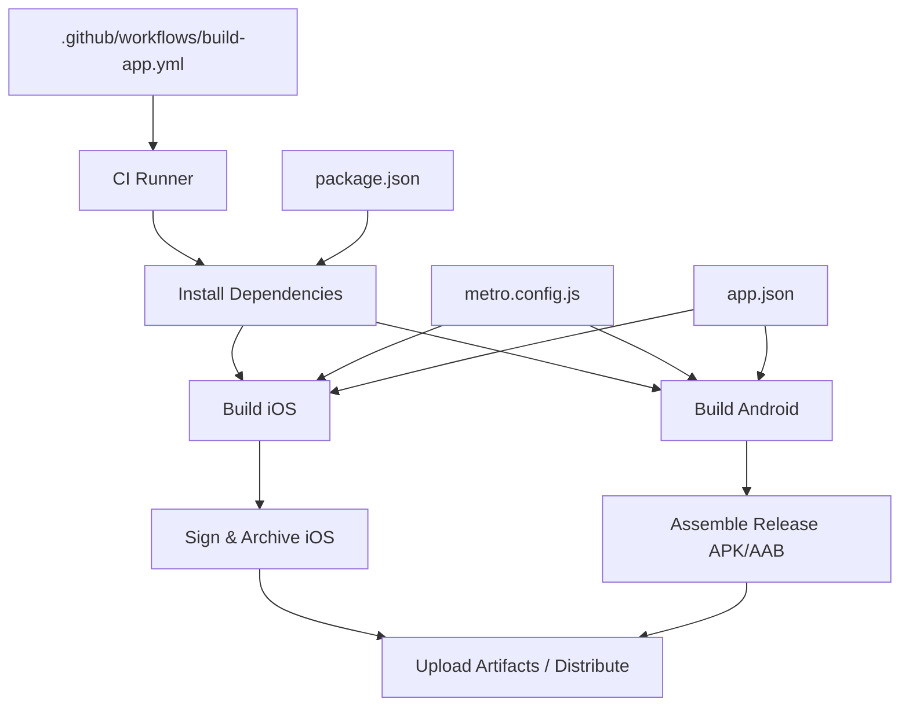
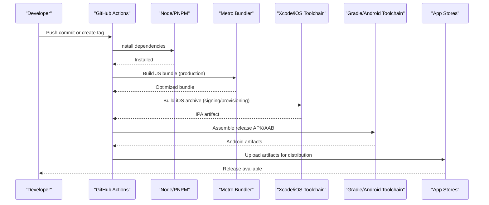
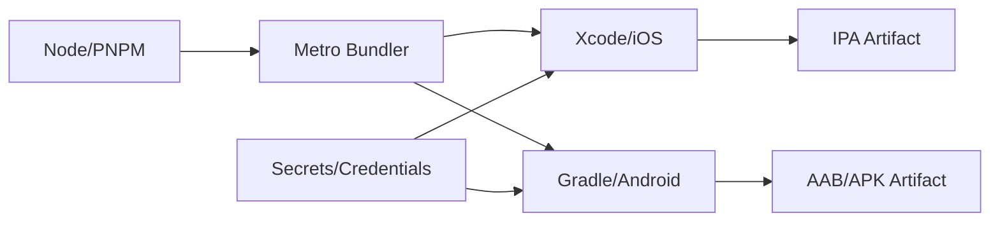

# Deployment Guide

<cite>
**Referenced Files in This Document**
- [build-app.yml](file://.github/workflows/build-app.yml)
- [metro.config.js](file://metro.config.js)
- [package.json](file://package.json)
- [app.json](file://app.json)
- [README.md](file://README.md)
</cite>

## Table of Contents

1. [Introduction](#introduction)
2. [Project Structure](#project-structure)
3. [Core Components](#core-components)
4. [Architecture Overview](#architecture-overview)
5. [Detailed Component Analysis](#detailed-component-analysis)
6. [Dependency Analysis](#dependency-analysis)
7. [Performance Considerations](#performance-considerations)
8. [Troubleshooting Guide](#troubleshooting-guide)
9. [Conclusion](#conclusion)
10. [Appendices](#appendices)

## Introduction

This guide explains how to build, sign, and distribute the React Native mobile application for iOS and Android using a GitHub Actions CI/CD pipeline. It covers Metro bundler configuration for production builds, asset optimization, code splitting strategies, release management, versioning, and distribution channels. It also includes troubleshooting tips and performance recommendations for production builds.

## Project Structure

The repository is organized into feature directories (app, src, assets, tools) with configuration files at the root level that drive the build and deployment process:

- .github/workflows/build-app.yml: Defines the CI/CD pipeline for automated builds.
- metro.config.js: Configures Metro bundler behavior for development and production.
- package.json: Declares dependencies, scripts, and metadata used by the build pipeline.
- app.json: Contains app metadata and platform-specific settings relevant to builds.
- README.md: Provides project context and usage information.

**Diagram sources**

- [build-app.yml](file://.github/workflows/build-app.yml)
- [metro.config.js](file://metro.config.js)
- [package.json](file://package.json)
- [app.json](file://app.json)

**Section sources**

- [build-app.yml](file://.github/workflows/build-app.yml)
- [metro.config.js](file://metro.config.js)
- [package.json](file://package.json)
- [app.json](file://app.json)
- [README.md](file://README.md)

## Core Components

- CI/CD Pipeline (.github/workflows/build-app.yml): Orchestrates dependency installation, building, signing, archiving, and artifact upload for both platforms.
- Metro Configuration (metro.config.js): Controls bundling behavior, asset handling, and optimizations for production.
- Package Scripts and Metadata (package.json): Defines commands for building, testing, and packaging; provides app metadata consumed by build tools.
- App Metadata (app.json): Supplies app identifiers, versions, and platform-specific settings used during build and store preparation.

Key responsibilities:

- Automated builds on push or tag events.
- Secure handling of signing keys and provisioning profiles via secrets.
- Production-optimized bundles through Metro.
- Artifact generation for distribution channels.

**Section sources**

- [build-app.yml](file://.github/workflows/build-app.yml)
- [metro.config.js](file://metro.config.js)
- [package.json](file://package.json)
- [app.json](file://app.json)

## Architecture Overview

The deployment architecture integrates GitHub Actions with platform toolchains (Xcode for iOS, Gradle for Android) and Metro for JavaScript bundling. The pipeline ensures consistent builds across environments, enforces signing policies, and produces distributable artifacts.

**Diagram sources**

- [build-app.yml](file://.github/workflows/build-app.yml)
- [metro.config.js](file://metro.config.js)
- [package.json](file://package.json)

## Detailed Component Analysis

### CI/CD Pipeline (GitHub Actions)

The workflow automates the end-to-end build process:

- Triggers: On push or tag events to initiate builds.
- Environment setup: Installs Node/PNPM and dependencies.
- iOS build: Uses Xcode to build and sign an archive; requires provisioning profiles and signing certificates stored securely.
- Android build: Uses Gradle to assemble release APK/AAB; requires keystore and signing properties configured via secrets.
- Artifacts: Uploads generated binaries for distribution or further processing.

Best practices:

- Use environment variables and secrets for sensitive data (signing keys, provisioning profiles).
- Cache dependencies to speed up builds.
- Separate jobs for iOS and Android to parallelize execution.
- Validate outputs before uploading to stores.

**Section sources**

- [build-app.yml](file://.github/workflows/build-app.yml)

### Metro Bundler Configuration

Metro controls how JavaScript and assets are bundled for production:

- Platform targets: Ensures correct output for iOS and Android.
- Asset handling: Processes images, fonts, and other resources efficiently.
- Optimization flags: Enables minification, dead code elimination, and tree shaking where applicable.
- Code splitting: Configures lazy loading for large modules to reduce initial load time.
- Custom resolvers/plugins: Integrates with third-party tools if needed.

Recommendations:

- Enable production mode for faster, smaller bundles.
- Optimize asset sizes (compress images, use appropriate formats).
- Avoid heavy synchronous operations in entry points.
- Monitor bundle size and split large screens or features.

**Section sources**

- [metro.config.js](file://metro.config.js)

### Package Scripts and Metadata

package.json defines the build and distribution commands:

- Scripts: Commands for building, testing, and packaging apps.
- Dependencies: Libraries required for runtime and build-time processes.
- Metadata: App name, version, and identifiers used by build tools.

Usage:

- Run build scripts to generate platform-specific outputs.
- Ensure consistent dependency versions across environments.
- Keep metadata aligned with app store requirements.

**Section sources**

- [package.json](file://package.json)

### App Metadata (app.json)

app.json contains critical settings for builds:

- App identifier and versioning fields.
- Platform-specific configurations (icons, splash screens, permissions).
- Settings consumed by Metro and native toolchains.

Guidelines:

- Keep version numbers synchronized with Git tags for traceability.
- Update platform-specific settings when preparing for store releases.
- Validate metadata against store guidelines.

**Section sources**

- [app.json](file://app.json)

## Dependency Analysis

The deployment pipeline depends on several layers:

- Node/PNPM for dependency management and script execution.
- Metro for bundling JavaScript and assets.
- Xcode for iOS builds, signing, and archiving.
- Gradle for Android builds, signing, and packaging.
- Secrets and credentials for secure signing and provisioning.

**Diagram sources**

- [build-app.yml](file://.github/workflows/build-app.yml)
- [metro.config.js](file://metro.config.js)
- [package.json](file://package.json)

**Section sources**

- [build-app.yml](file://.github/workflows/build-app.yml)
- [metro.config.js](file://metro.config.js)
- [package.json](file://package.json)

## Performance Considerations

- Bundle size: Minimize JavaScript payload by enabling production optimizations and removing unused code.
- Asset optimization: Compress images, use vector graphics where possible, and avoid redundant assets.
- Lazy loading: Split large screens or features to reduce initial load time.
- Native modules: Audit native dependencies for performance impact and ensure they are necessary.
- Caching: Leverage dependency caching in CI to speed up builds.
- Profiling: Use profiling tools to identify bottlenecks in JavaScript and native layers.

[No sources needed since this section provides general guidance]

## Troubleshooting Guide

Common issues and resolutions:

- Missing signing certificates or provisioning profiles: Ensure secrets are correctly configured and valid for the target environment.
- Gradle build failures: Verify keystore paths, passwords, and signing configurations; check platform SDK versions.
- Xcode archive errors: Confirm provisioning profiles match app identifiers and entitlements; update Xcode and toolchain versions as needed.
- Metro bundling errors: Inspect module resolution issues, unsupported syntax, or asset paths; validate Metro configuration.
- Large bundle sizes: Analyze bundle contents, remove unused dependencies, and enable code splitting.

Diagnostic steps:

- Review CI logs for error messages and stack traces.
- Reproduce builds locally with the same environment variables and toolchain versions.
- Validate app metadata and platform settings against store requirements.

**Section sources**

- [build-app.yml](file://.github/workflows/build-app.yml)
- [metro.config.js](file://metro.config.js)
- [package.json](file://package.json)
- [app.json](file://app.json)

## Conclusion

This deployment guide outlines a robust CI/CD pipeline for building and distributing the React Native application across iOS and Android. By leveraging GitHub Actions, Metro optimizations, and secure signing practices, teams can automate releases, maintain consistency, and deliver high-quality builds to users. Following the recommended practices and troubleshooting steps will help streamline the release process and improve overall performance.

[No sources needed since this section summarizes without analyzing specific files]

## Appendices

- Versioning strategy: Align app versions with Git tags for clear traceability.
- Distribution channels: Use TestFlight/App Store Connect for iOS and Google Play Console for Android.
- Pre-release checks: Run tests, linting, and bundle analysis before promoting to production.

[No sources needed since this section provides general guidance]
