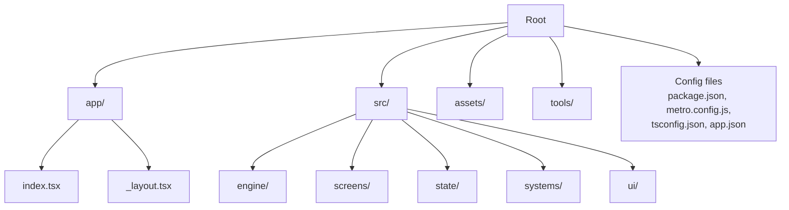
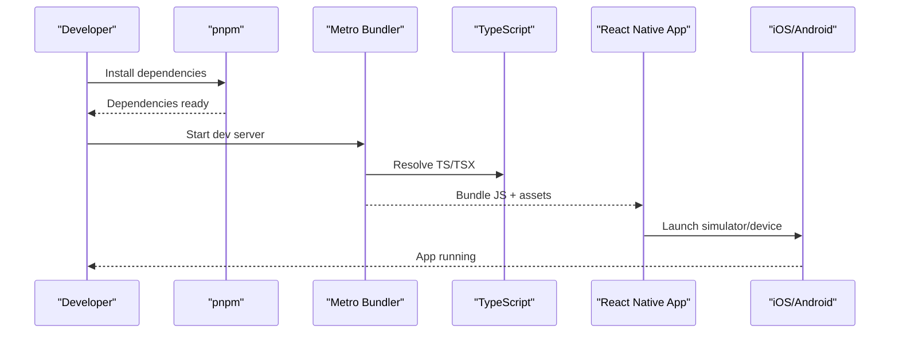
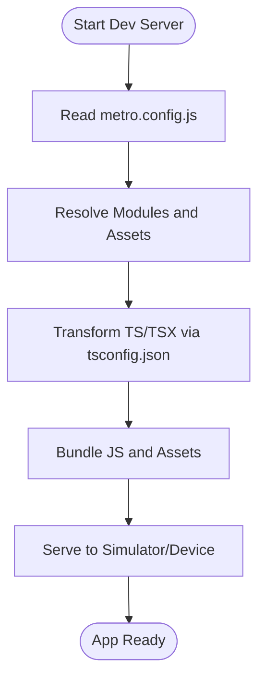
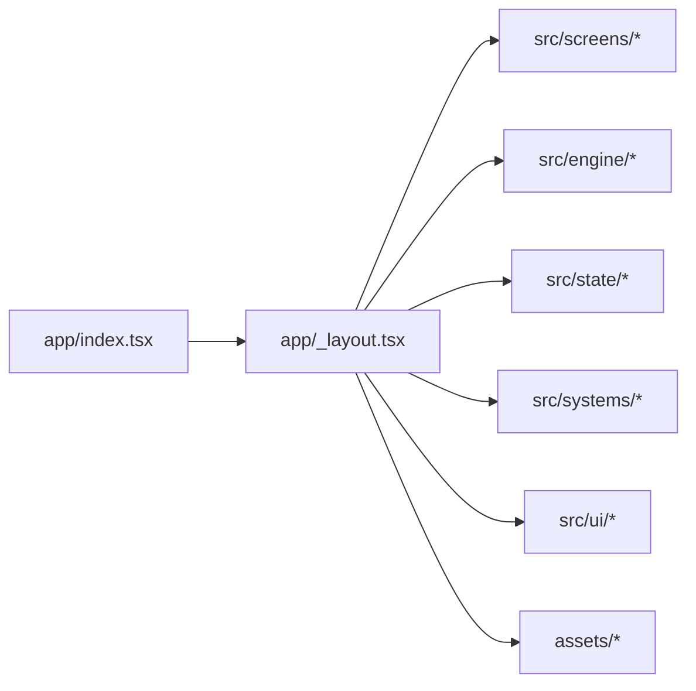
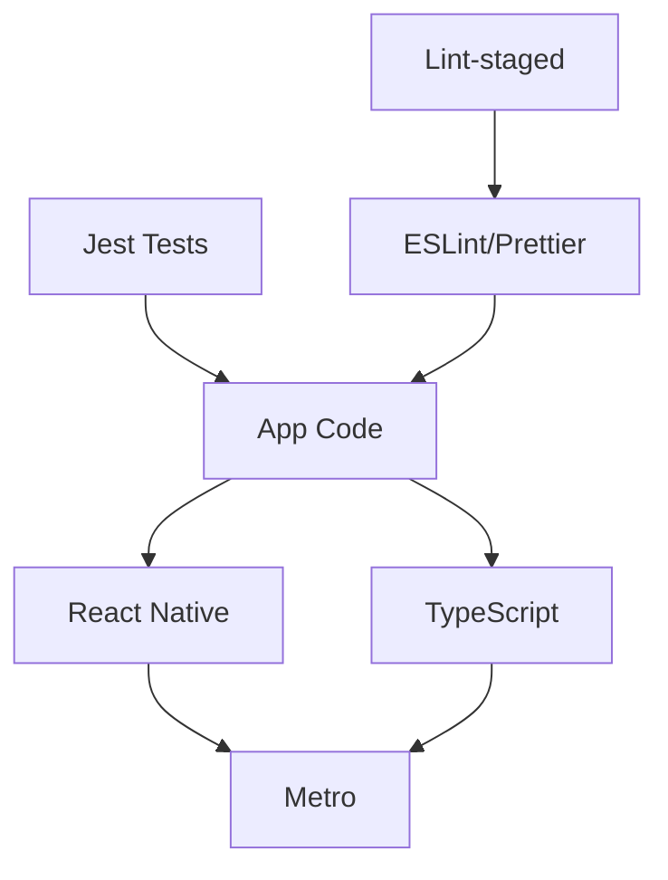

# Getting Started

<cite>
**Referenced Files in This Document**
- [README.md](file://README.md)
- [package.json](file://package.json)
- [pnpm-workspace.yaml](file://pnpm-workspace.yaml)
- [.npmrc](file://.npmrc)
- [metro.config.js](file://metro.config.js)
- [tsconfig.json](file://tsconfig.json)
- [app.json](file://app.json)
- [jest.config.js](file://jest.config.js)
- [jest.setup.ts](file://jest.setup.ts)
- [eslint.config.js](file://eslint.config.js)
- [.prettierrc](file://.prettierrc)
- [.lintstagedrc.json](file://.lintstagedrc.json)
- [build-app.yml](file://.github/workflows/build-app.yml)
- [index.tsx](file://app/index.tsx)
- [_layout.tsx](file://app/_layout.tsx)
</cite>

## Table of Contents

1. Introduction
2. Project Structure
3. Core Components
4. Architecture Overview
5. Detailed Component Analysis
6. Dependency Analysis
7. Performance Considerations
8. Troubleshooting Guide
9. Conclusion
10. Appendices

## Introduction

This guide helps you set up a development environment for the React Native mobile game, install dependencies with pnpm, configure Metro and TypeScript, and run the app on iOS and Android simulators. It also covers debugging, first-time workflow, verification steps, and common troubleshooting.

## Project Structure

The project is organized into clear layers:

- app: App entry points and navigation layout using Expo Router-style files.
- src: Source code split by feature (engine, screens, state, systems, ui).
- assets: Game assets including audio, fonts, icons, and Pixellab resources.
- tools: Utility scripts for asset generation and processing.
- Configuration files at the root define bundling, types, linting, testing, and package manager settings.

**Section sources**

- [package.json](file://package.json)
- [app/index.tsx](file://app/index.tsx)
- [app/_layout.tsx](file://app/_layout.tsx)

## Core Components

Key configuration components that shape your development experience:

- Package manager and scripts: Defined in package.json to manage dependencies and commands.
- Workspace config: pnpm-workspace.yaml enables workspace features if used.
- NPM registry and behavior: .npmrc controls npm/pnpm behavior.
- Bundler: metro.config.js configures Metro for React Native assets and modules.
- TypeScript: tsconfig.json sets compiler options and paths.
- App metadata: app.json defines app name, slug, version, and platform-specific settings.
- Testing: jest.config.js and jest.setup.ts configure Jest for unit tests.
- Code quality: eslint.config.js and .prettierrc enforce style and lint rules.
- Pre-commit hooks: .lintstagedrc.json integrates linting/formatting before commits.
- CI pipeline: .github/workflows/build-app.yml automates builds in CI.

**Section sources**

- [package.json](file://package.json)
- [pnpm-workspace.yaml](file://pnpm-workspace.yaml)
- [.npmrc](file://.npmrc)
- [metro.config.js](file://metro.config.js)
- [tsconfig.json](file://tsconfig.json)
- [app.json](file://app.json)
- [jest.config.js](file://jest.config.js)
- [jest.setup.ts](file://jest.setup.ts)
- [eslint.config.js](file://eslint.config.js)
- [.prettierrc](file://.prettierrc)
- [.lintstagedrc.json](file://.lintstagedrc.json)
- [build-app.yml](file://.github/workflows/build-app.yml)

## Architecture Overview

High-level flow from project root to running the app:

- Node.js runtime executes pnpm commands defined in package.json.
- pnpm installs dependencies and resolves workspaces.
- Metro reads metro.config.js to bundle JS and assets.
- TypeScript compiles TS/TSX via tsconfig.json during development or build.
- The app entry renders through app/index.tsx and app/_layout.tsx.
- Platform-specific toolchains (iOS/Android) are invoked by Expo CLI or native commands.

[No sources needed since this diagram shows conceptual workflow, not actual code structure]

## Detailed Component Analysis

### Environment Setup and Installation

- Prerequisites:
  - Node.js LTS recommended.
  - pnpm installed globally.
  - iOS: Xcode and command-line tools installed; CocoaPods configured.
  - Android: Android Studio with SDK and emulator configured.
- Install dependencies:
  - Run the project’s install script from package.json using pnpm.
- Verify installation:
  - Confirm node and pnpm versions.
  - Ensure dependency tree is clean.

**Section sources**

- [package.json](file://package.json)
- [.npmrc](file://.npmrc)

### Build Process with Metro

- Metro configuration:
  - metro.config.js defines resolver, transformer, and bundler settings.
  - Asset handling includes images, fonts, and audio.
- Running Metro:
  - Use the start command from package.json to launch the dev server.
- TypeScript integration:
  - tsconfig.json ensures type checking and module resolution.
- First build:
  - For production, use the build command from package.json which invokes platform-specific builders.

**Section sources**

- [metro.config.js](file://metro.config.js)
- [tsconfig.json](file://tsconfig.json)
- [package.json](file://package.json)

### TypeScript Setup

- Compiler options:
  - tsconfig.json sets target, module, strictness, and path mappings.
- Type checking:
  - Run type checks via the script in package.json.
- IDE support:
  - Configure VS Code to use the project’s tsconfig.json.

**Section sources**

- [tsconfig.json](file://tsconfig.json)
- [package.json](file://package.json)

### Initial Project Structure Navigation

- Entry points:
  - app/index.tsx is the main screen entry.
  - app/_layout.tsx defines global layout and navigation context.
- Feature folders:
  - src/engine: Core game logic and state machines.
  - src/screens: UI screens mapped to app routes.
  - src/state: Centralized state management and actions.
  - src/systems: Cross-cutting concerns like audio, NFC, notifications.
  - src/ui: Reusable UI components and pixel art helpers.
- Assets:
  - assets/audio, assets/fonts, assets/icons, assets/pixellab.

**Section sources**

- [app/index.tsx](file://app/index.tsx)
- [app/_layout.tsx](file://app/_layout.tsx)
- [package.json](file://package.json)

### Running on iOS Simulator

- Prerequisites:
  - Xcode installed and command-line tools selected.
  - CocoaPods installed and updated.
- Steps:
  - Start Metro dev server.
  - Open iOS project in Xcode or use the provided command to build and run.
  - Select an iOS simulator and launch.

**Section sources**

- [package.json](file://package.json)
- [app.json](file://app.json)

### Running on Android Emulator

- Prerequisites:
  - Android Studio installed with SDK and emulator configured.
- Steps:
  - Start Metro dev server.
  - Use the provided command to build and run on Android emulator.
  - Ensure an emulator device is running.

**Section sources**

- [package.json](file://package.json)
- [app.json](file://app.json)

### Debugging Setup

- JavaScript debugging:
  - Use Chrome DevTools or React Native Debugger connected to Metro.
- Network debugging:
  - Enable network inspection in developer menu.
- Logs:
  - Use console logging and platform logs for deeper insights.

**Section sources**

- [package.json](file://package.json)

### First-Time Development Workflow

- Clone repository and install dependencies.
- Verify environment with type checks and linters.
- Start Metro and run on a simulator.
- Iterate on code and reload the app.
- Commit changes with pre-commit hooks enforcing style and lint.

**Section sources**

- [.lintstagedrc.json](file://.lintstagedrc.json)
- [package.json](file://package.json)

## Dependency Analysis

Core dependencies and their roles:

- React Native and Expo: Provide framework and tooling.
- Metro: Bundles JS and assets.
- TypeScript: Adds static typing and improves DX.
- Jest: Unit testing framework.
- ESLint and Prettier: Enforce code quality and formatting.
- Lint-staged: Integrates checks into Git hooks.

**Section sources**

- [package.json](file://package.json)
- [jest.config.js](file://jest.config.js)
- [eslint.config.js](file://eslint.config.js)
- [.prettierrc](file://.prettierrc)
- [.lintstagedrc.json](file://.lintstagedrc.json)

## Performance Considerations

- Keep Metro cache warm by avoiding unnecessary restarts.
- Use incremental builds and avoid heavy synchronous operations in JS.
- Optimize assets (images, audio) and lazy-load large modules.
- Profile JS execution and native bridges when encountering jank.

[No sources needed since this section provides general guidance]

## Troubleshooting Guide

Common setup issues and resolutions:

- Node version mismatch:
  - Ensure Node LTS matches project requirements.
- pnpm lock conflicts:
  - Delete lock file and reinstall dependencies.
- Metro bundling errors:
  - Clear Metro cache and restart dev server.
- iOS build failures:
  - Update CocoaPods and ensure Xcode command-line tools are set.
- Android build failures:
  - Check SDK paths and emulator availability.
- TypeScript errors:
  - Run type check and fix reported issues.
- Linting/formatting failures:
  - Run formatters and linters locally before committing.

Verification steps:

- Run type checks successfully.
- Start Metro without errors.
- Launch app on both iOS and Android simulators.
- Execute unit tests and confirm pass rate.

**Section sources**

- [package.json](file://package.json)
- [metro.config.js](file://metro.config.js)
- [tsconfig.json](file://tsconfig.json)
- [jest.config.js](file://jest.config.js)
- [eslint.config.js](file://eslint.config.js)
- [.prettierrc](file://.prettierrc)
- [.lintstagedrc.json](file://.lintstagedrc.json)

## Conclusion

You now have a complete guide to set up the development environment, understand the project structure, and run the React Native mobile game on iOS and Android. Follow the verification steps and troubleshooting tips to maintain a smooth development workflow.

## Appendices

- CI pipeline overview:
  - .github/workflows/build-app.yml automates builds and tests in CI.
- App metadata:
  - app.json defines app identity and platform settings.

**Section sources**

- [build-app.yml](file://.github/workflows/build-app.yml)
- [app.json](file://app.json)
