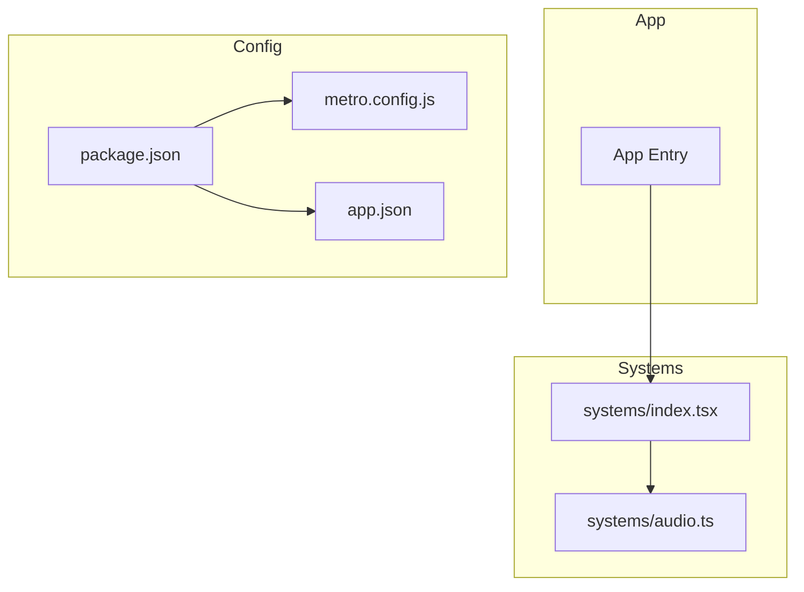
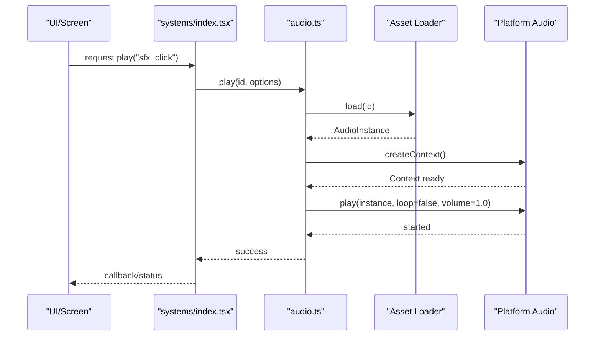
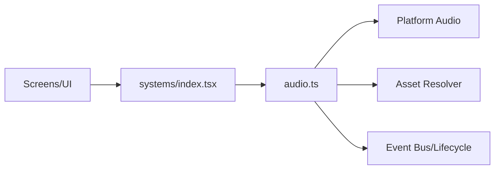

# Audio Playback System

<cite>
**Referenced Files in This Document**
- [audio.ts](file://src/systems/audio.ts)
- [index.tsx](file://src/systems/index.tsx)
- [package.json](file://package.json)
- [metro.config.js](file://metro.config.js)
- [app.json](file://app.json)
</cite>

## Table of Contents

1. [Introduction](#introduction)
2. [Project Structure](#project-structure)
3. [Core Components](#core-components)
4. [Architecture Overview](#architecture-overview)
5. [Detailed Component Analysis](#detailed-component-analysis)
6. [Dependency Analysis](#dependency-analysis)
7. [Performance Considerations](#performance-considerations)
8. [Troubleshooting Guide](#troubleshooting-guide)
9. [Conclusion](#conclusion)
10. [Appendices](#appendices)

## Introduction

This document explains the audio playback system that manages sound effects and music across the application. It covers how audio assets are loaded, how playback is controlled, volume management, background audio handling, context setup, supported formats, platform-specific optimizations, memory considerations for large files, performance techniques, cross-platform compatibility, and debugging strategies. The goal is to help developers integrate and maintain audio features reliably on both mobile platforms and web.

## Project Structure

The audio subsystem lives under src/systems and is integrated into the app via a systems index. Asset configuration and bundling settings influence how audio is packaged and served at runtime.

**Diagram sources**

- [index.tsx](file://src/systems/index.tsx)
- [audio.ts](file://src/systems/audio.ts)
- [package.json](file://package.json)
- [metro.config.js](file://metro.config.js)
- [app.json](file://app.json)

**Section sources**

- [index.tsx](file://src/systems/index.tsx)
- [audio.ts](file://src/systems/audio.ts)
- [package.json](file://package.json)
- [metro.config.js](file://metro.config.js)
- [app.json](file://app.json)

## Core Components

- Audio manager module: centralizes loading, playback, looping, volume, and interruption handling.
- Systems integration: exposes audio functionality to screens and UI components through a consistent API surface.
- Configuration: defines asset paths, default volumes, and platform toggles.

Key responsibilities:

- Initialize audio context safely on user gesture where required.
- Load and cache audio assets by identifier.
- Play sound effects with optional looping and fade-in/out.
- Manage background audio state (pause/resume) when the app transitions.
- Provide global and per-track volume controls.
- Handle interruptions (phone calls, system prompts) gracefully.

**Section sources**

- [audio.ts](file://src/systems/audio.ts)
- [index.tsx](file://src/systems/index.tsx)

## Architecture Overview

The audio system follows a layered design:

- Presentation layer (screens/UI) triggers events or calls methods on the audio manager.
- Audio manager abstracts platform-specific details and maintains state (active tracks, volumes, contexts).
- Asset loader resolves audio files from bundles or network, normalizing formats and caching results.
- Platform integrations handle context creation, permissions, and lifecycle events.

**Diagram sources**

- [index.tsx](file://src/systems/index.tsx)
- [audio.ts](file://src/systems/audio.ts)

## Detailed Component Analysis

### Audio Manager (audio.ts)

Responsibilities:

- Context initialization and lifecycle management.
- Asset registry and caching.
- Playback control: play, pause, resume, stop, seek.
- Looping and scheduling for music tracks.
- Volume normalization and per-track gain.
- Interruption handling and auto-resume policies.
- Memory cleanup for large assets.

Design patterns:

- Singleton-like module exposing a stable API.
- Event-driven callbacks for playback state changes.
- Strategy abstraction for platform-specific backends.

Common usage patterns:

- Preload frequently used sound effects during app startup.
- Start background music once and keep it running across scenes.
- Use short loops for ambient tracks; avoid overlapping multiple loops.
- Apply fade-in/out for smooth transitions.

Memory considerations:

- Prefer compressed formats for long tracks.
- Unload unused assets after playback completes.
- Limit concurrent active instances to reduce memory pressure.

**Section sources**

- [audio.ts](file://src/systems/audio.ts)

### Systems Integration (index.tsx)

Responsibilities:

- Expose audio functions to the rest of the app.
- Wire up global event listeners for interruptions and lifecycle changes.
- Provide convenience hooks for common scenarios (e.g., playOnce, loopMusic).

Integration points:

- Import and re-export audio APIs for easy access in screens.
- Initialize audio context lazily on first user interaction.

**Section sources**

- [index.tsx](file://src/systems/index.tsx)

### Configuration and Bundling

- package.json: declares dependencies and scripts that may affect audio tooling.
- metro.config.js: configures asset resolution and transformation for audio files.
- app.json: may include platform-specific audio capabilities and permissions.

Best practices:

- Ensure audio assets are included in the bundle or available at runtime paths.
- Validate supported MIME types for web targets.
- Configure platform capabilities for background audio if needed.

**Section sources**

- [package.json](file://package.json)
- [metro.config.js](file://metro.config.js)
- [app.json](file://app.json)

## Dependency Analysis

The audio module depends on:

- Platform audio APIs (native or web-based).
- Asset resolver for locating and decoding audio files.
- Optional event bus for interruption and lifecycle signals.

**Diagram sources**

- [index.tsx](file://src/systems/index.tsx)
- [audio.ts](file://src/systems/audio.ts)

**Section sources**

- [index.tsx](file://src/systems/index.tsx)
- [audio.ts](file://src/systems/audio.ts)

## Performance Considerations

- Preloading: preload critical sound effects to avoid latency on interactions.
- Caching: cache decoded audio instances to reduce CPU spikes.
- Concurrency: limit simultaneous playback instances; queue or prioritize urgent sounds.
- Format selection: use efficient codecs (e.g., AAC/MP3 for music, OGG/WAV for short SFX).
- Streaming: stream large music files instead of loading fully into memory.
- Throttling: avoid rapid repeated plays of the same effect; debounce if necessary.
- Background mode: ensure proper session configuration to maintain playback when app is backgrounded.

[No sources needed since this section provides general guidance]

## Troubleshooting Guide

Common issues and resolutions:

- No sound on first interaction: initialize audio context on user gesture; check platform restrictions.
- Music stops unexpectedly: handle interruption events; implement auto-resume logic.
- High memory usage: unload unused assets; prefer streaming for long tracks.
- Cross-platform inconsistencies: verify supported formats and MIME types; test on iOS, Android, and web.
- Volume not applied: confirm per-track vs global volume chain; check mute states.
- Web autoplay policy: ensure audio starts within a user-initiated event.

Debugging tips:

- Log playback events and errors.
- Inspect asset loading times and sizes.
- Use platform debuggers to monitor audio sessions and interruptions.
- Validate bundle inclusion of audio files.

[No sources needed since this section provides general guidance]

## Conclusion

The audio playback system centralizes audio operations, providing a robust interface for playing sound effects and managing music across platforms. By following the recommended patterns for loading, playback, volume control, and interruption handling, developers can deliver a consistent and performant audio experience. Proper configuration and attention to memory and concurrency will further enhance reliability and quality.

[No sources needed since this section summarizes without analyzing specific files]

## Appendices

### Example Workflows

#### Playing a Sound Effect on User Interaction

- Trigger on button press or tap.
- Ensure audio context is initialized.
- Play the effect with no loop and full volume.
- Optionally fade out quickly for crisp feedback.

#### Managing Music Loops

- Start background music once at app entry.
- Keep track of the active instance.
- Pause on app background; resume on foreground.
- Avoid overlapping loops; stop previous track before starting new one.

#### Handling Audio Interruptions

- Listen for interruption events.
- Pause playback immediately.
- Resume automatically when appropriate.
- Notify UI of state changes.

[No sources needed since this section provides conceptual workflows]
