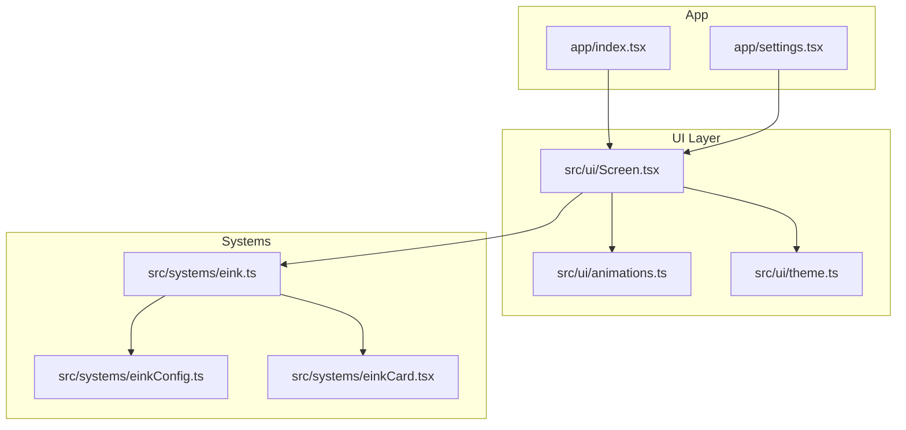
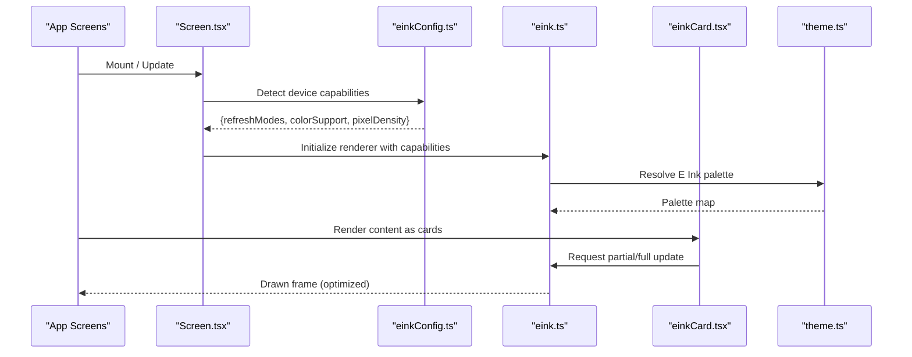
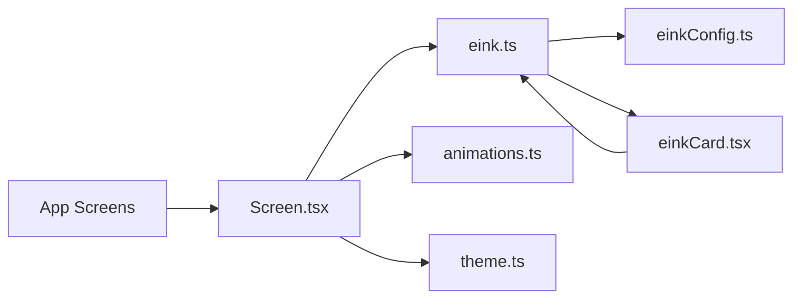

# E Ink Display Optimization

<cite>
**Referenced Files in This Document**
- [eink.ts](file://src/systems/eink.ts)
- [einkCard.tsx](file://src/systems/einkCard.tsx)
- [einkConfig.ts](file://src/systems/einkConfig.ts)
- [Screen.tsx](file://src/ui/Screen.tsx)
- [animations.ts](file://src/ui/animations.ts)
- [theme.ts](file://src/ui/theme.ts)
- [index.tsx](file://app/index.tsx)
- [settings.tsx](file://app/settings.tsx)
</cite>

## Table of Contents

1. [Introduction](#introduction)
2. [Project Structure](#project-structure)
3. [Core Components](#core-components)
4. [Architecture Overview](#architecture-overview)
5. [Detailed Component Analysis](#detailed-component-analysis)
6. [Dependency Analysis](#dependency-analysis)
7. [Performance Considerations](#performance-considerations)
8. [Troubleshooting Guide](#troubleshooting-guide)
9. [Conclusion](#conclusion)

## Introduction

This document explains how the project optimizes for E Ink displays to deliver a paper-like reading experience on e-reader devices. It covers device detection, rendering strategies for slow refresh rates, color palette adaptations, and the E Ink card system that structures content into discrete, flicker-friendly panels. It also provides configuration guidance per device model, animation techniques to minimize ghosting and power use, partial update strategies, and practical workarounds for common E Ink limitations.

## Project Structure

E Ink–related logic is primarily implemented under src/systems and integrated with UI components under src/ui and app screens. The key modules are:

- Device detection and capabilities: src/systems/einkConfig.ts
- Rendering and refresh orchestration: src/systems/eink.ts
- Card-based presentation layer: src/systems/einkCard.tsx
- Screen container and platform integration: src/ui/Screen.tsx
- Animation utilities: src/ui/animations.ts
- Theme and color palette: src/ui/theme.ts
- App entry points and settings: app/index.tsx, app/settings.tsx

**Diagram sources**

- [index.tsx](file://app/index.tsx)
- [settings.tsx](file://app/settings.tsx)
- [Screen.tsx](file://src/ui/Screen.tsx)
- [animations.ts](file://src/ui/animations.ts)
- [theme.ts](file://src/ui/theme.ts)
- [einkConfig.ts](file://src/systems/einkConfig.ts)
- [eink.ts](file://src/systems/eink.ts)
- [einkCard.tsx](file://src/systems/einkCard.tsx)

**Section sources**

- [eink.ts](file://src/systems/eink.ts)
- [einkCard.tsx](file://src/systems/einkCard.tsx)
- [einkConfig.ts](file://src/systems/einkConfig.ts)
- [Screen.tsx](file://src/ui/Screen.tsx)
- [animations.ts](file://src/ui/animations.ts)
- [theme.ts](file://src/ui/theme.ts)
- [index.tsx](file://app/index.tsx)
- [settings.tsx](file://app/settings.tsx)

## Core Components

- E Ink configuration and device detection: Determines device model, supported refresh modes (full/partial), color support, and pixel density. Used to select appropriate rendering paths and palettes.
- E Ink renderer: Coordinates screen updates, batching draws, selecting refresh modes, and minimizing full-screen flashes. Handles partial updates where available.
- E Ink card system: Structures content into cards that can be updated independently, enabling flicker-free transitions and efficient redraws.
- Screen container: Integrates E Ink features with the React Native screen lifecycle, orientation changes, and visibility events.
- Animations and theme: Provides low-flicker animation patterns and E Ink-friendly color palettes.

**Section sources**

- [einkConfig.ts](file://src/systems/einkConfig.ts)
- [eink.ts](file://src/systems/eink.ts)
- [einkCard.tsx](file://src/systems/einkCard.tsx)
- [Screen.tsx](file://src/ui/Screen.tsx)
- [animations.ts](file://src/ui/animations.ts)
- [theme.ts](file://src/ui/theme.ts)

## Architecture Overview

The E Ink subsystem sits between the UI layer and the platform’s display pipeline. Configuration drives capability detection; the renderer applies optimized draw calls; the card system composes content into discrete update regions; and animations are constrained to avoid rapid full refreshes.

**Diagram sources**

- [Screen.tsx](file://src/ui/Screen.tsx)
- [einkConfig.ts](file://src/systems/einkConfig.ts)
- [eink.ts](file://src/systems/eink.ts)
- [einkCard.tsx](file://src/systems/einkCard.tsx)
- [theme.ts](file://src/ui/theme.ts)

## Detailed Component Analysis

### E Ink Configuration and Device Detection

Responsibilities:

- Identify device model and capabilities (partial refresh, color, resolution).
- Provide normalized feature flags consumed by the renderer and UI.
- Expose configuration overrides for testing or per-device tuning.

Key behaviors:

- Capability detection returns a structured profile used to choose rendering strategies.
- Feature flags include partial update availability, supported refresh modes, and color depth.
- Configuration can be extended to add new device profiles without changing core logic.

Optimization impact:

- Enables selective use of partial updates to reduce flicker and power.
- Guides palette selection based on color support.
- Prevents unsupported operations on older E Ink panels.

**Section sources**

- [einkConfig.ts](file://src/systems/einkConfig.ts)

### E Ink Renderer

Responsibilities:

- Orchestrate drawing operations with minimal full-screen refreshes.
- Batch multiple updates into a single pass when possible.
- Select appropriate refresh mode per operation (fast/partial/full).
- Manage timing to avoid excessive redraws during user interactions.

Rendering strategy:

- Prefer partial updates for small changes; fall back to full refresh only when necessary.
- Coalesce rapid state changes to reduce the number of physical refreshes.
- Respect device-specific constraints returned by the configuration module.

Power considerations:

- Avoid frequent full refreshes to conserve battery.
- Defer non-critical redraws until idle or next user interaction.

**Section sources**

- [eink.ts](file://src/systems/eink.ts)

### E Ink Card System

Responsibilities:

- Represent content as independent cards that can be rendered and updated separately.
- Provide APIs to create, update, and remove cards efficiently.
- Integrate with the renderer to perform targeted partial updates.

User experience benefits:

- Paper-like layout where each card resembles a page segment.
- Smooth transitions by updating only changed cards instead of the entire screen.
- Predictable memory usage through bounded card lifecycles.

Implementation highlights:

- Card boundaries define update regions for the renderer.
- Card states drive incremental redraws.
- Card composition supports stacking and ordering.

**Section sources**

- [einkCard.tsx](file://src/systems/einkCard.tsx)

### Screen Integration

Responsibilities:

- Bridge React Native screen lifecycle with E Ink optimizations.
- Handle orientation changes, visibility toggles, and focus events.
- Apply theme and animation policies suited for E Ink.

Integration points:

- On mount, initialize renderer with device capabilities.
- On visibility change, pause heavy updates and resume when visible.
- On orientation change, recalculate card layouts and update regions.

**Section sources**

- [Screen.tsx](file://src/ui/Screen.tsx)

### Animations and Palettes

Responsibilities:

- Provide animation primitives that respect E Ink refresh characteristics.
- Offer E Ink-friendly color palettes that maximize contrast and readability.

Animation guidelines:

- Use long-duration, low-frequency transitions to avoid ghosting.
- Prefer fade-in/out over rapid positional changes.
- Batch animated frames to reduce refresh count.

Palette design:

- High-contrast black/white/gray tones for monochrome devices.
- Limited color set for color E Ink panels to maintain readability.
- Consistent semantic colors across cards and UI elements.

**Section sources**

- [animations.ts](file://src/ui/animations.ts)
- [theme.ts](file://src/ui/theme.ts)

### App Entry Points and Settings

Responsibilities:

- Initialize application with E Ink-aware defaults.
- Expose settings to adjust behavior per device model or user preference.

Settings options:

- Toggle partial updates if supported.
- Choose animation intensity suitable for the device.
- Override palette for specific models.

**Section sources**

- [index.tsx](file://app/index.tsx)
- [settings.tsx](file://app/settings.tsx)

## Dependency Analysis

The E Ink subsystem has clear dependencies:

- Screen depends on renderer, animations, and theme.
- Renderer depends on configuration and card system.
- Cards depend on renderer for drawing.
- App screens depend on Screen and settings.

**Diagram sources**

- [Screen.tsx](file://src/ui/Screen.tsx)
- [eink.ts](file://src/systems/eink.ts)
- [einkConfig.ts](file://src/systems/einkConfig.ts)
- [einkCard.tsx](file://src/systems/einkCard.tsx)
- [animations.ts](file://src/ui/animations.ts)
- [theme.ts](file://src/ui/theme.ts)

**Section sources**

- [Screen.tsx](file://src/ui/Screen.tsx)
- [eink.ts](file://src/systems/eink.ts)
- [einkConfig.ts](file://src/systems/einkConfig.ts)
- [einkCard.tsx](file://src/systems/einkCard.tsx)
- [animations.ts](file://src/ui/animations.ts)
- [theme.ts](file://src/ui/theme.ts)

## Performance Considerations

- Prefer partial updates for small changes to reduce flicker and power consumption.
- Batch multiple state updates before triggering a redraw.
- Avoid rapid animations; favor slow fades and large-area transitions.
- Limit the number of active cards to control memory and redraw complexity.
- Use high-contrast palettes to improve readability without additional effects.
- Defer non-essential rendering until the user stops interacting.

[No sources needed since this section provides general guidance]

## Troubleshooting Guide

Common issues and resolutions:

- Excessive flickering: Ensure partial updates are enabled and avoid full refreshes for minor changes.
- Ghosting after animations: Reduce animation frequency and duration; prefer fade transitions.
- Slow perceived performance: Batch updates and limit concurrent card renders.
- Incorrect color rendering: Verify palette selection matches device capabilities from configuration.
- Orientation glitches: Recalculate card bounds and update regions on rotation.

Operational checks:

- Confirm device capabilities detected by configuration match expectations.
- Validate that renderer selects appropriate refresh modes.
- Inspect card boundaries to ensure they align with intended update regions.

**Section sources**

- [einkConfig.ts](file://src/systems/einkConfig.ts)
- [eink.ts](file://src/systems/eink.ts)
- [einkCard.tsx](file://src/systems/einkCard.tsx)
- [Screen.tsx](file://src/ui/Screen.tsx)
- [theme.ts](file://src/ui/theme.ts)

## Conclusion

By combining device-aware configuration, careful rendering strategies, and a card-based presentation model, the application delivers a smooth, paper-like reading experience on E Ink devices. Animations and palettes are tuned to minimize flicker and power use while maintaining readability. With these practices, developers can optimize user interactions and extend support to new E Ink models through configuration-driven capabilities.

[No sources needed since this section summarizes without analyzing specific files]
