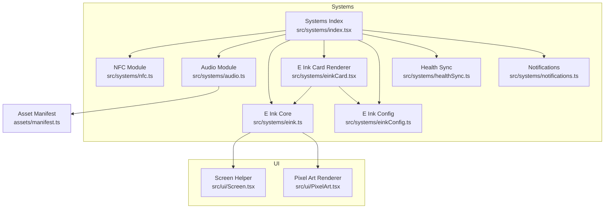
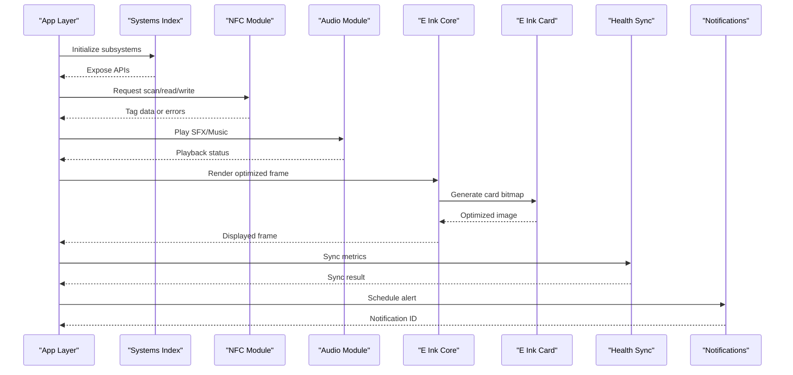
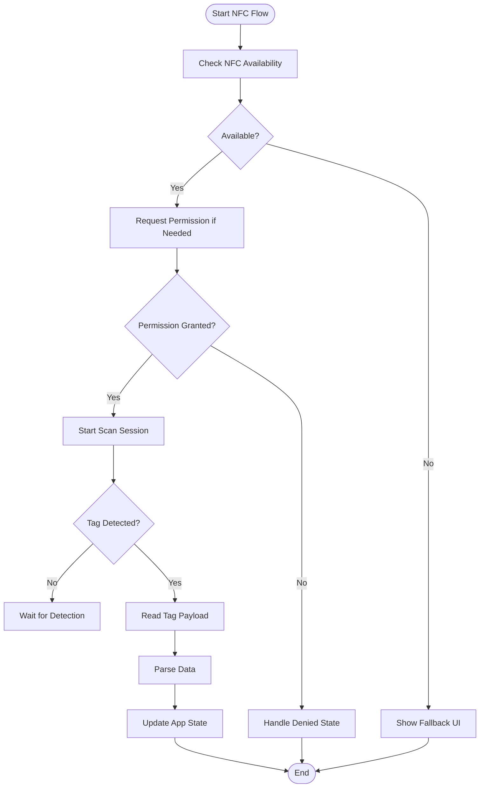
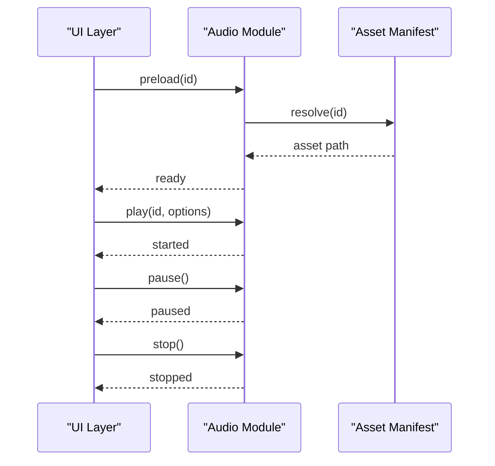
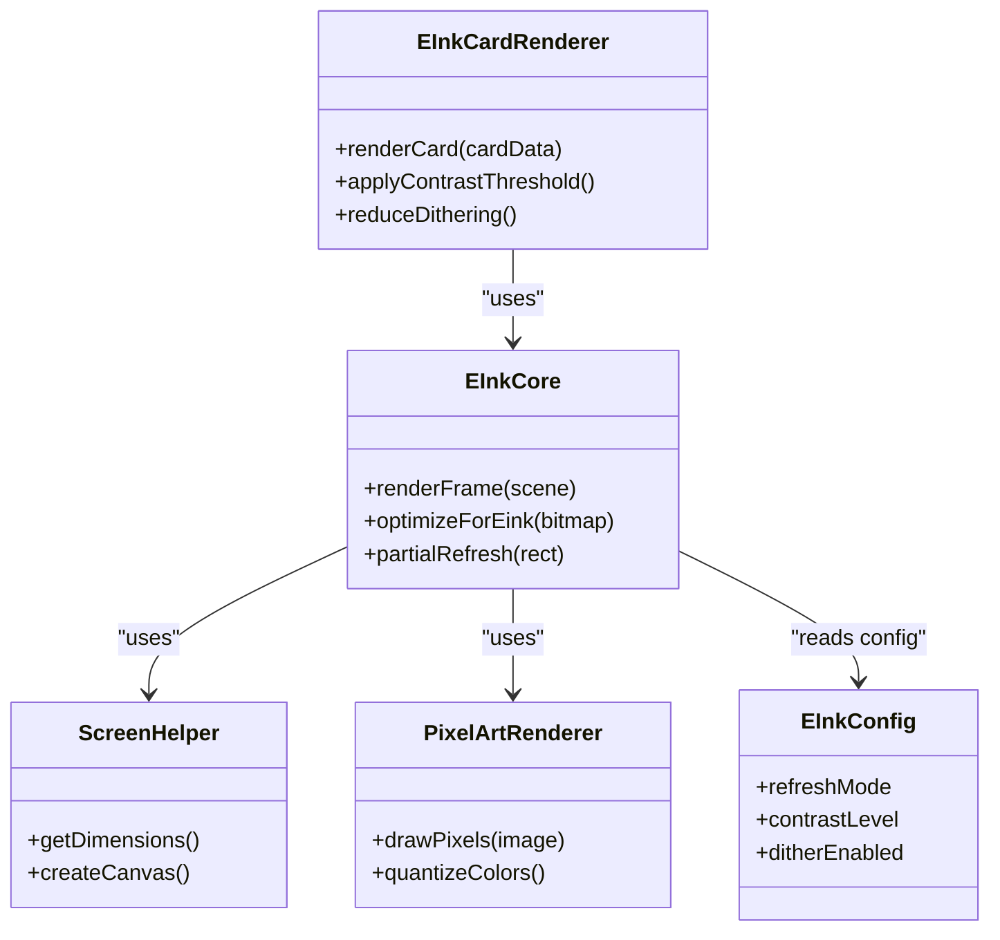
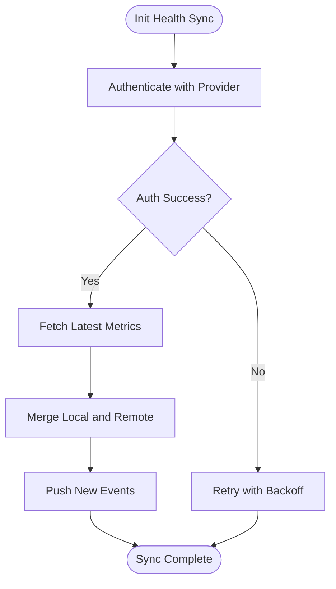
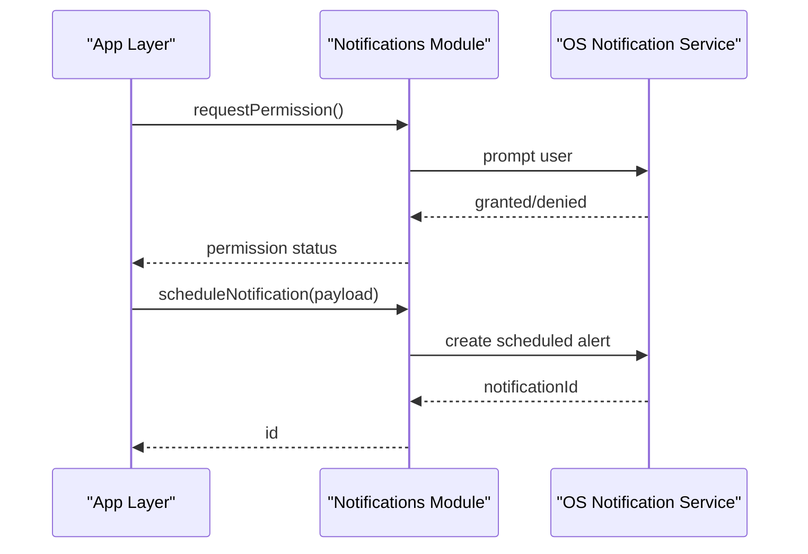
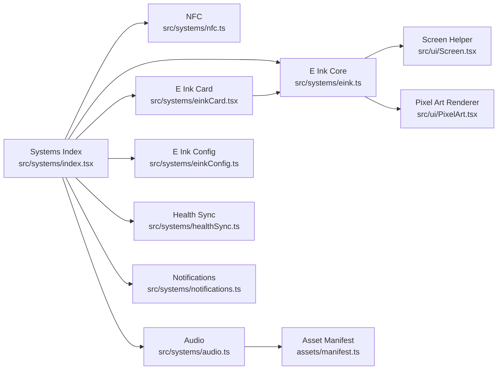

# Hardware Integration

<cite>
**Referenced Files in This Document**
- [nfc.ts](file://src/systems/nfc.ts)
- [audio.ts](file://src/systems/audio.ts)
- [eink.ts](file://src/systems/eink.ts)
- [einkCard.tsx](file://src/systems/einkCard.tsx)
- [einkConfig.ts](file://src/systems/einkConfig.ts)
- [healthSync.ts](file://src/systems/healthSync.ts)
- [notifications.ts](file://src/systems/notifications.ts)
- [index.tsx](file://src/systems/index.tsx)
- [Screen.tsx](file://src/ui/Screen.tsx)
- [PixelArt.tsx](file://src/ui/PixelArt.tsx)
- [manifest.ts](file://assets/manifest.ts)
</cite>

## Table of Contents

1. [Introduction](#introduction)
2. [Project Structure](#project-structure)
3. [Core Components](#core-components)
4. [Architecture Overview](#architecture-overview)
5. [Detailed Component Analysis](#detailed-component-analysis)
6. [Dependency Analysis](#dependency-analysis)
7. [Performance Considerations](#performance-considerations)
8. [Troubleshooting Guide](#troubleshooting-guide)
9. [Conclusion](#conclusion)
10. [Appendices](#appendices)

## Introduction

This document explains the hardware integration systems that connect the application to device capabilities. It covers NFC card reading and writing for physical media interaction, audio playback for sound effects and music, E Ink optimizations and display-specific rendering, health data synchronization with external APIs, and notification systems. It also includes error handling strategies, permission management, platform-specific considerations, examples of integrating each hardware feature, and troubleshooting guidance for common issues.

## Project Structure

The hardware integrations are implemented under src/systems as modular components:

- NFC: nfc.ts
- Audio: audio.ts
- E Ink: eink.ts, einkCard.tsx, einkConfig.ts
- Health Sync: healthSync.ts
- Notifications: notifications.ts
- Systems index: index.tsx (exports and aggregates subsystems)
- UI rendering helpers: Screen.tsx, PixelArt.tsx
- Asset manifest: assets/manifest.ts

**Diagram sources**

- [index.tsx](file://src/systems/index.tsx)
- [nfc.ts](file://src/systems/nfc.ts)
- [audio.ts](file://src/systems/audio.ts)
- [eink.ts](file://src/systems/eink.ts)
- [einkCard.tsx](file://src/systems/einkCard.tsx)
- [einkConfig.ts](file://src/systems/einkConfig.ts)
- [healthSync.ts](file://src/systems/healthSync.ts)
- [notifications.ts](file://src/systems/notifications.ts)
- [Screen.tsx](file://src/ui/Screen.tsx)
- [PixelArt.tsx](file://src/ui/PixelArt.tsx)
- [manifest.ts](file://assets/manifest.ts)

**Section sources**

- [index.tsx](file://src/systems/index.tsx)
- [nfc.ts](file://src/systems/nfc.ts)
- [audio.ts](file://src/systems/audio.ts)
- [eink.ts](file://src/systems/eink.ts)
- [einkCard.tsx](file://src/systems/einkCard.tsx)
- [einkConfig.ts](file://src/systems/einkConfig.ts)
- [healthSync.ts](file://src/systems/healthSync.ts)
- [notifications.ts](file://src/systems/notifications.ts)
- [Screen.tsx](file://src/ui/Screen.tsx)
- [PixelArt.tsx](file://src/ui/PixelArt.tsx)
- [manifest.ts](file://assets/manifest.ts)

## Core Components

- NFC module provides scanning, reading, and writing flows for NFC tags/cards.
- Audio module manages playback of sound effects and background music with lifecycle control.
- E Ink modules provide optimized rendering paths, refresh strategies, and card rendering tailored for monochrome displays.
- Health sync module integrates with external health APIs to synchronize user metrics and events.
- Notifications module handles local notifications and system-level alerts.

Key responsibilities and interactions are coordinated via the systems index, which exposes a unified API surface to screens and game logic.

**Section sources**

- [nfc.ts](file://src/systems/nfc.ts)
- [audio.ts](file://src/systems/audio.ts)
- [eink.ts](file://src/systems/eink.ts)
- [einkCard.tsx](file://src/systems/einkCard.tsx)
- [einkConfig.ts](file://src/systems/einkConfig.ts)
- [healthSync.ts](file://src/systems/healthSync.ts)
- [notifications.ts](file://src/systems/notifications.ts)
- [index.tsx](file://src/systems/index.tsx)

## Architecture Overview

The hardware integration architecture follows a modular design where each capability is encapsulated in its own module. The systems index aggregates these modules and exports them consistently to the rest of the app. UI layers consume these modules through well-defined interfaces, ensuring separation between presentation and hardware concerns.

**Diagram sources**

- [index.tsx](file://src/systems/index.tsx)
- [nfc.ts](file://src/systems/nfc.ts)
- [audio.ts](file://src/systems/audio.ts)
- [eink.ts](file://src/systems/eink.ts)
- [einkCard.tsx](file://src/systems/einkCard.tsx)
- [healthSync.ts](file://src/systems/healthSync.ts)
- [notifications.ts](file://src/systems/notifications.ts)

## Detailed Component Analysis

### NFC Card Reading/Writing System

Responsibilities:

- Detect NFC availability and request permissions.
- Start/stop scanning sessions.
- Read tag payloads and parse into structured data.
- Write data to supported tags safely.
- Handle platform differences and error conditions.

Integration example:

- On screen mount, initialize NFC session and register event listeners.
- When a tag is detected, read payload and update state.
- On write action, validate input, perform write, and confirm success.

Error handling:

- Gracefully handle unsupported devices, denied permissions, and I/O errors.
- Provide user feedback and fallback flows when NFC is unavailable.

Permission management:

- Check and request NFC permissions at runtime on platforms requiring explicit consent.

Platform considerations:

- Android typically requires foreground service or activity-based NFC access; iOS has limited NFC support depending on context.

**Diagram sources**

- [nfc.ts](file://src/systems/nfc.ts)

**Section sources**

- [nfc.ts](file://src/systems/nfc.ts)

### Audio Playback System

Responsibilities:

- Load and manage audio assets from the manifest.
- Play sound effects and background music with volume control.
- Pause/resume/cleanup audio resources appropriately.
- Handle interruptions and platform audio routing.

Integration example:

- Preload critical SFX on app start.
- Trigger SFX on user actions (clicks, transitions).
- Manage music lifecycle across scenes to avoid overlapping playback.

Error handling:

- Catch decoding failures, missing assets, and playback errors.
- Provide silent fallbacks and log diagnostics.

Permission management:

- Ensure required audio permissions are granted on platforms that require it.

Platform considerations:

- Background audio policies differ by OS; respect system interruptions and do not assume persistent playback.

**Diagram sources**

- [audio.ts](file://src/systems/audio.ts)
- [manifest.ts](file://assets/manifest.ts)

**Section sources**

- [audio.ts](file://src/systems/audio.ts)
- [manifest.ts](file://assets/manifest.ts)

### E Ink Device Optimizations and Display-Specific Rendering

Responsibilities:

- Optimize rendering for monochrome, low-refresh displays.
- Minimize full-screen refreshes and use partial updates where possible.
- Generate high-contrast bitmaps suitable for E Ink panels.
- Provide card rendering utilities tailored for E Ink constraints.

Integration example:

- Use E Ink core to render frames efficiently.
- Compose card visuals using the E Ink card renderer.
- Configure E Ink behavior via configuration module.

Error handling:

- Handle unsupported display modes and fallback to standard rendering.
- Validate bitmap dimensions and color depth before sending to display.

Platform considerations:

- Respect device-specific refresh limits and power-saving features.

**Diagram sources**

- [eink.ts](file://src/systems/eink.ts)
- [einkCard.tsx](file://src/systems/einkCard.tsx)
- [einkConfig.ts](file://src/systems/einkConfig.ts)
- [Screen.tsx](file://src/ui/Screen.tsx)
- [PixelArt.tsx](file://src/ui/PixelArt.tsx)

**Section sources**

- [eink.ts](file://src/systems/eink.ts)
- [einkCard.tsx](file://src/systems/einkCard.tsx)
- [einkConfig.ts](file://src/systems/einkConfig.ts)
- [Screen.tsx](file://src/ui/Screen.tsx)
- [PixelArt.tsx](file://src/ui/PixelArt.tsx)

### Health Data Synchronization

Responsibilities:

- Connect to external health APIs for syncing metrics and events.
- Authenticate securely and manage tokens.
- Batch and reconcile data to avoid conflicts.
- Handle rate limits and retries.

Integration example:

- On user login, establish connection and fetch latest metrics.
- Periodically push new data based on app state changes.
- Show sync status and allow manual retry on failure.

Error handling:

- Network errors, authentication failures, and schema mismatches must be handled gracefully.
- Queue failed operations and retry with backoff.

Permission management:

- Request health data permissions explicitly and explain purpose to users.

Platform considerations:

- Different APIs per platform (e.g., Apple HealthKit vs Google Fit); abstract behind a unified interface.

**Diagram sources**

- [healthSync.ts](file://src/systems/healthSync.ts)

**Section sources**

- [healthSync.ts](file://src/systems/healthSync.ts)

### Notification Systems

Responsibilities:

- Create and schedule local notifications.
- Handle permission requests and user preferences.
- Support recurring reminders and one-time alerts.

Integration example:

- Schedule daily reminders based on user settings.
- Trigger contextual notifications during gameplay milestones.

Error handling:

- Handle denied permissions and system limitations.
- Provide fallback messaging when notifications are unavailable.

Platform considerations:

- Respect OS-specific notification channels and scheduling rules.

**Diagram sources**

- [notifications.ts](file://src/systems/notifications.ts)

**Section sources**

- [notifications.ts](file://src/systems/notifications.ts)

## Dependency Analysis

The systems index centralizes imports and exports, reducing coupling between screens and hardware modules. Each module depends only on its specific domain and shared UI helpers where necessary.

**Diagram sources**

- [index.tsx](file://src/systems/index.tsx)
- [nfc.ts](file://src/systems/nfc.ts)
- [audio.ts](file://src/systems/audio.ts)
- [eink.ts](file://src/systems/eink.ts)
- [einkCard.tsx](file://src/systems/einkCard.tsx)
- [einkConfig.ts](file://src/systems/einkConfig.ts)
- [healthSync.ts](file://src/systems/healthSync.ts)
- [notifications.ts](file://src/systems/notifications.ts)
- [Screen.tsx](file://src/ui/Screen.tsx)
- [PixelArt.tsx](file://src/ui/PixelArt.tsx)
- [manifest.ts](file://assets/manifest.ts)

**Section sources**

- [index.tsx](file://src/systems/index.tsx)

## Performance Considerations

- NFC: Avoid continuous scanning; use event-driven detection to conserve battery.
- Audio: Preload frequently used assets and reuse instances to reduce allocation overhead.
- E Ink: Prefer partial updates and minimize full refreshes; quantize colors and reduce dithering for faster rendering.
- Health Sync: Batch operations and implement exponential backoff for retries.
- Notifications: Coalesce similar notifications and respect system batching policies.

[No sources needed since this section provides general guidance]

## Troubleshooting Guide

Common issues and resolutions:

- NFC not detected:
  - Verify device compatibility and permissions.
  - Ensure tags are within range and properly formatted.
- Audio playback fails:
  - Confirm asset paths exist in the manifest.
  - Check platform audio permissions and interruption handling.
- E Ink rendering artifacts:
  - Validate bitmap dimensions and color thresholds.
  - Adjust contrast and dithering settings via configuration.
- Health sync errors:
  - Inspect authentication tokens and network connectivity.
  - Review API rate limits and retry policies.
- Notifications not appearing:
  - Confirm permission grants and OS-specific channel setup.
  - Test scheduling intervals and payload validity.

**Section sources**

- [nfc.ts](file://src/systems/nfc.ts)
- [audio.ts](file://src/systems/audio.ts)
- [eink.ts](file://src/systems/eink.ts)
- [einkCard.tsx](file://src/systems/einkCard.tsx)
- [einkConfig.ts](file://src/systems/einkConfig.ts)
- [healthSync.ts](file://src/systems/healthSync.ts)
- [notifications.ts](file://src/systems/notifications.ts)

## Conclusion

The hardware integration layer provides robust, modular capabilities for NFC, audio, E Ink rendering, health synchronization, and notifications. By adhering to clear interfaces and centralized exports, the app maintains flexibility and maintainability while delivering reliable device interactions. Proper error handling, permission management, and platform awareness ensure consistent experiences across diverse environments.

[No sources needed since this section summarizes without analyzing specific files]

## Appendices

- Example integration patterns:
  - NFC: Initialize on screen mount, listen for tag events, read/write with validation.
  - Audio: Preload assets, trigger SFX on interactions, manage music lifecycle.
  - E Ink: Use optimized rendering pipeline, configure contrast and refresh modes.
  - Health Sync: Authenticate, fetch and merge data, schedule periodic syncs.
  - Notifications: Request permissions, schedule alerts, handle user preferences.

[No sources needed since this section provides general guidance]
