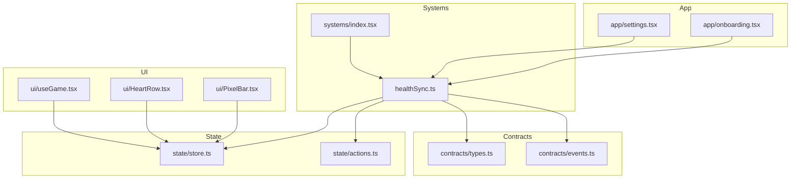
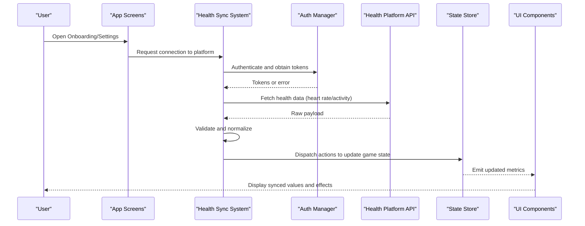
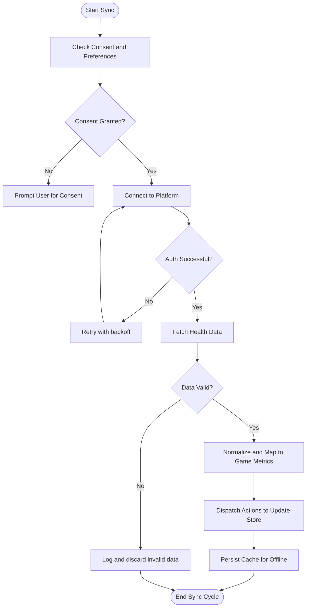
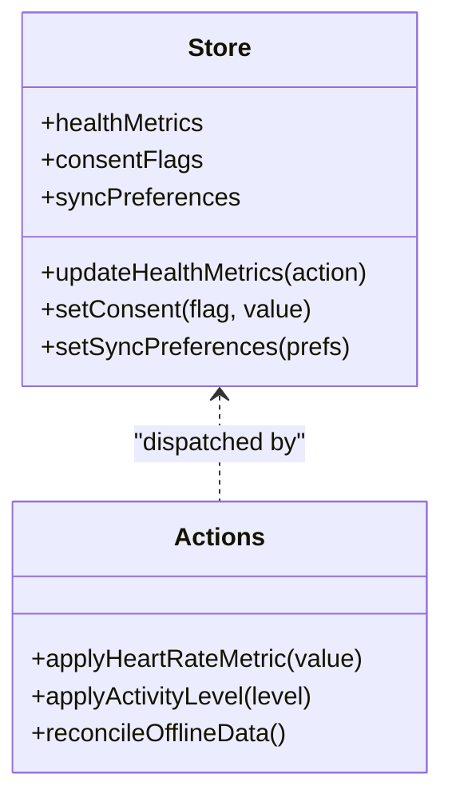
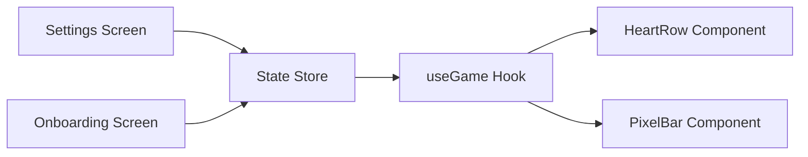
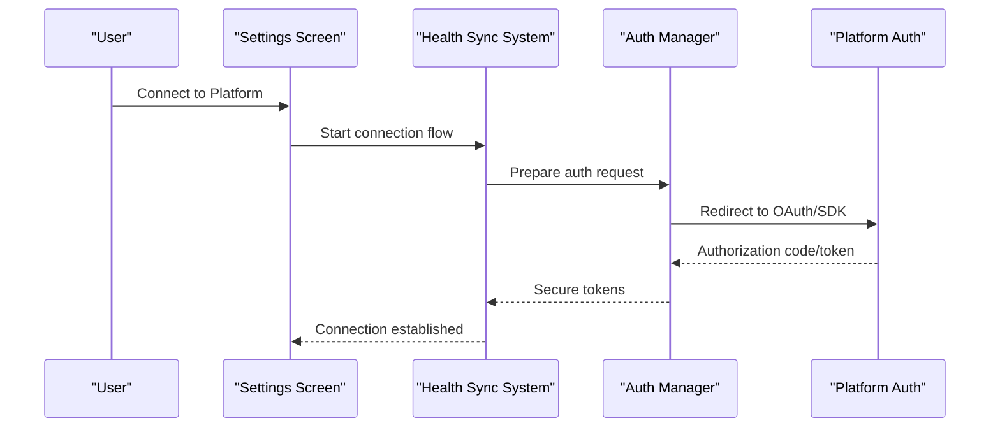
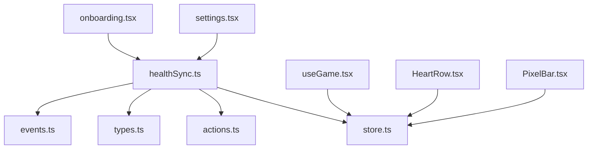

# Health Data Synchronization

<cite>
**Referenced Files in This Document**
- [healthSync.ts](file://src/systems/healthSync.ts)
- [index.tsx](file://src/systems/index.tsx)
- [store.ts](file://src/state/store.ts)
- [actions.ts](file://src/state/actions.ts)
- [types.ts](file://src/contracts/types.ts)
- [events.ts](file://src/contracts/events.ts)
- [useGame.tsx](file://src/ui/useGame.tsx)
- [HeartRow.tsx](file://src/ui/HeartRow.tsx)
- [PixelBar.tsx](file://src/ui/PixelBar.tsx)
- [settings.tsx](file://app/settings.tsx)
- [onboarding.tsx](file://app/onboarding.tsx)
</cite>

## Table of Contents

1. [Introduction](#introduction)
2. [Project Structure](#project-structure)
3. [Core Components](#core-components)
4. [Architecture Overview](#architecture-overview)
5. [Detailed Component Analysis](#detailed-component-analysis)
6. [Dependency Analysis](#dependency-analysis)
7. [Performance Considerations](#performance-considerations)
8. [Troubleshooting Guide](#troubleshooting-guide)
9. [Conclusion](#conclusion)
10. [Appendices](#appendices)

## Introduction

This document explains the health data synchronization system that connects game mechanics with external health APIs and services. It covers how heart rate and activity metrics are mapped to in-game effects, authentication flows for accessing health platforms, real-time synchronization patterns, supported platforms, privacy and consent management, offline handling, error handling, validation, and security best practices. The goal is to provide both a high-level understanding and detailed implementation guidance for developers integrating health data into the game.

## Project Structure

The health synchronization feature is implemented as a dedicated system within the systems layer, integrated with state management, UI components, and app settings. Key areas include:

- Systems layer: health sync orchestration and scheduling
- State layer: store and actions for persisting and updating health-related game state
- Contracts: shared types and events used across modules
- UI layer: components that visualize health metrics and allow user configuration
- App screens: onboarding and settings where users grant consent and configure preferences

**Diagram sources**

- [healthSync.ts](file://src/systems/healthSync.ts)
- [index.tsx](file://src/systems/index.tsx)
- [store.ts](file://src/state/store.ts)
- [actions.ts](file://src/state/actions.ts)
- [types.ts](file://src/contracts/types.ts)
- [events.ts](file://src/contracts/events.ts)
- [useGame.tsx](file://src/ui/useGame.tsx)
- [HeartRow.tsx](file://src/ui/HeartRow.tsx)
- [PixelBar.tsx](file://src/ui/PixelBar.tsx)
- [settings.tsx](file://app/settings.tsx)
- [onboarding.tsx](file://app/onboarding.tsx)

**Section sources**

- [healthSync.ts](file://src/systems/healthSync.ts)
- [index.tsx](file://src/systems/index.tsx)
- [store.ts](file://src/state/store.ts)
- [actions.ts](file://src/state/actions.ts)
- [types.ts](file://src/contracts/types.ts)
- [events.ts](file://src/contracts/events.ts)
- [useGame.tsx](file://src/ui/useGame.tsx)
- [HeartRow.tsx](file://src/ui/HeartRow.tsx)
- [PixelBar.tsx](file://src/ui/PixelBar.tsx)
- [settings.tsx](file://app/settings.tsx)
- [onboarding.tsx](file://app/onboarding.tsx)

## Core Components

- Health Sync System: Orchestrates polling or event-driven updates from health platforms, validates incoming data, maps it to game metrics, and dispatches state changes.
- State Store and Actions: Holds health-derived game state (e.g., stamina, energy, buffs), exposes actions to update state safely, and persists preferences and consent flags.
- Contracts (Types and Events): Defines shared interfaces for health payloads, mapping rules, and events emitted during sync lifecycle.
- UI Integration: Visualizes health metrics and allows users to toggle features, view status, and manage consent.
- App Screens: Onboarding collects consent; Settings manages platform connections and sync preferences.

Key responsibilities:

- Authentication and authorization for health platforms
- Real-time or periodic synchronization
- Data validation and normalization
- Mapping health metrics to game mechanics
- Error handling and retry strategies
- Offline caching and reconciliation
- Privacy controls and consent management

**Section sources**

- [healthSync.ts](file://src/systems/healthSync.ts)
- [store.ts](file://src/state/store.ts)
- [actions.ts](file://src/state/actions.ts)
- [types.ts](file://src/contracts/types.ts)
- [events.ts](file://src/contracts/events.ts)
- [useGame.tsx](file://src/ui/useGame.tsx)
- [HeartRow.tsx](file://src/ui/HeartRow.tsx)
- [PixelBar.tsx](file://src/ui/PixelBar.tsx)
- [settings.tsx](file://app/settings.tsx)
- [onboarding.tsx](file://app/onboarding.tsx)

## Architecture Overview

The health sync architecture follows a layered approach:

- External Health Platforms: Provide authenticated access to health data via APIs or device integrations.
- Sync Engine: Authenticates, fetches, validates, and transforms raw health data into normalized metrics.
- Game State Layer: Applies transformations to update player stats and gameplay effects.
- UI Layer: Displays current health metrics and sync status; surfaces consent and configuration options.
- Persistence: Stores consent, preferences, and cached data for offline scenarios.

**Diagram sources**

- [healthSync.ts](file://src/systems/healthSync.ts)
- [store.ts](file://src/state/store.ts)
- [actions.ts](file://src/state/actions.ts)
- [types.ts](file://src/contracts/types.ts)
- [events.ts](file://src/contracts/events.ts)
- [useGame.tsx](file://src/ui/useGame.tsx)
- [HeartRow.tsx](file://src/ui/HeartRow.tsx)
- [PixelBar.tsx](file://src/ui/PixelBar.tsx)
- [settings.tsx](file://app/settings.tsx)
- [onboarding.tsx](file://app/onboarding.tsx)

## Detailed Component Analysis

### Health Sync System

Responsibilities:

- Manage platform connections and token lifecycles
- Poll or subscribe to health data streams
- Validate and transform incoming data
- Map metrics to game mechanics
- Emit lifecycle events and errors
- Handle offline caching and reconciliation

**Diagram sources**

- [healthSync.ts](file://src/systems/healthSync.ts)
- [store.ts](file://src/state/store.ts)
- [actions.ts](file://src/state/actions.ts)
- [types.ts](file://src/contracts/types.ts)
- [events.ts](file://src/contracts/events.ts)

**Section sources**

- [healthSync.ts](file://src/systems/healthSync.ts)
- [store.ts](file://src/state/store.ts)
- [actions.ts](file://src/state/actions.ts)
- [types.ts](file://src/contracts/types.ts)
- [events.ts](file://src/contracts/events.ts)

### State Management and Actions

Responsibilities:

- Maintain health-derived game state (e.g., stamina, energy, buffs)
- Expose actions to update state atomically
- Persist consent flags and sync preferences
- Provide selectors for UI consumption

**Diagram sources**

- [store.ts](file://src/state/store.ts)
- [actions.ts](file://src/state/actions.ts)
- [types.ts](file://src/contracts/types.ts)

**Section sources**

- [store.ts](file://src/state/store.ts)
- [actions.ts](file://src/state/actions.ts)
- [types.ts](file://src/contracts/types.ts)

### UI Integration

Responsibilities:

- Render health metrics and sync status
- Allow toggling features and viewing consent status
- Reflect real-time updates from the store

**Diagram sources**

- [useGame.tsx](file://src/ui/useGame.tsx)
- [HeartRow.tsx](file://src/ui/HeartRow.tsx)
- [PixelBar.tsx](file://src/ui/PixelBar.tsx)
- [store.ts](file://src/state/store.ts)
- [settings.tsx](file://app/settings.tsx)
- [onboarding.tsx](file://app/onboarding.tsx)

**Section sources**

- [useGame.tsx](file://src/ui/useGame.tsx)
- [HeartRow.tsx](file://src/ui/HeartRow.tsx)
- [PixelBar.tsx](file://src/ui/PixelBar.tsx)
- [store.ts](file://src/state/store.ts)
- [settings.tsx](file://app/settings.tsx)
- [onboarding.tsx](file://app/onboarding.tsx)

### Supported Health Platforms

Typical integrations include:

- Apple HealthKit (iOS)
- Google Fit / Health Connect (Android)
- Wearable SDKs (e.g., Garmin, Fitbit) when available

Integration considerations:

- Platform-specific authentication flows and permissions
- Data schema differences and normalization requirements
- Rate limits and background sync constraints
- Privacy policies and compliance requirements

[No sources needed since this section provides general guidance]

### Data Mapping Between Game Mechanics and Health Metrics

Common mappings:

- Heart rate -> Stamina or energy regeneration rate
- Steps or distance -> Experience points or progress toward goals
- Activity level -> Buffs/debuffs affecting movement speed or combat effectiveness
- Rest periods -> Cooldown reduction or recovery bonuses

Mapping principles:

- Normalize units and timestamps
- Apply thresholds and smoothing to avoid jitter
- Ensure monotonicity where appropriate (e.g., cumulative steps)
- Debounce rapid fluctuations to maintain stable gameplay

[No sources needed since this section provides general guidance]

### Authentication Flows for Health Service Access

Flow overview:

- Initiate connection from settings or onboarding
- Redirect to platform auth if required
- Receive tokens securely and store them encrypted
- Refresh tokens automatically before expiration
- Handle permission denials gracefully

**Diagram sources**

- [healthSync.ts](file://src/systems/healthSync.ts)
- [store.ts](file://src/state/store.ts)
- [actions.ts](file://src/state/actions.ts)
- [settings.tsx](file://app/settings.tsx)
- [onboarding.tsx](file://app/onboarding.tsx)

**Section sources**

- [healthSync.ts](file://src/systems/healthSync.ts)
- [store.ts](file://src/state/store.ts)
- [actions.ts](file://src/state/actions.ts)
- [settings.tsx](file://app/settings.tsx)
- [onboarding.tsx](file://app/onboarding.tsx)

### Real-Time Data Synchronization Patterns

Patterns:

- Polling with exponential backoff for batch endpoints
- Event-driven subscriptions where supported
- Local batching and debouncing to reduce network calls
- Conflict resolution for overlapping updates

Best practices:

- Use timestamps to order events
- Deduplicate identical measurements
- Throttle UI updates to avoid re-renders
- Queue operations when offline and reconcile later

[No sources needed since this section provides general guidance]

### Data Privacy Considerations and User Consent Management

Privacy principles:

- Collect only necessary data
- Provide clear explanations of usage
- Allow granular consent per metric type
- Support revocation and deletion

Consent management:

- Capture explicit consent during onboarding
- Persist consent flags in secure storage
- Re-prompt when permissions change
- Respect platform-specific consent models

[No sources needed since this section provides general guidance]

### Examples of Syncing Heart Rate Data with Game Mechanics

Examples:

- Heart rate above threshold increases stamina regeneration
- Sustained elevated heart rate grants temporary speed boost
- Recovery periods reduce cooldown timers
- Variance in heart rate influences buff duration

Implementation notes:

- Normalize heart rate to a 0–1 scale
- Apply smoothing filters to prevent abrupt changes
- Map ranges to discrete game effects
- Debounce frequent updates to maintain performance

[No sources needed since this section provides general guidance]

### Updating Player Stats Based on Activity Levels

Examples:

- Steps converted to experience points
- Distance walked unlocks achievements
- Active minutes influence daily challenges
- Sedentary periods trigger reminders or gentle penalties

Implementation notes:

- Aggregate activity over time windows
- Cap gains to prevent exploitation
- Ensure fairness across different activity levels
- Provide feedback to users about progress

[No sources needed since this section provides general guidance]

### Handling Offline Scenarios

Strategies:

- Cache recent health data locally
- Queue state updates until connectivity resumes
- Reconcile conflicts using timestamps and deduplication
- Gracefully degrade UI when data is unavailable

[No sources needed since this section provides general guidance]

## Dependency Analysis

The health sync system depends on:

- State store and actions for consistent updates
- Contracts for shared types and events
- UI hooks and components for rendering and interaction
- App screens for consent and configuration

**Diagram sources**

- [healthSync.ts](file://src/systems/healthSync.ts)
- [store.ts](file://src/state/store.ts)
- [actions.ts](file://src/state/actions.ts)
- [types.ts](file://src/contracts/types.ts)
- [events.ts](file://src/contracts/events.ts)
- [useGame.tsx](file://src/ui/useGame.tsx)
- [HeartRow.tsx](file://src/ui/HeartRow.tsx)
- [PixelBar.tsx](file://src/ui/PixelBar.tsx)
- [settings.tsx](file://app/settings.tsx)
- [onboarding.tsx](file://app/onboarding.tsx)

**Section sources**

- [healthSync.ts](file://src/systems/healthSync.ts)
- [store.ts](file://src/state/store.ts)
- [actions.ts](file://src/state/actions.ts)
- [types.ts](file://src/contracts/types.ts)
- [events.ts](file://src/contracts/events.ts)
- [useGame.tsx](file://src/ui/useGame.tsx)
- [HeartRow.tsx](file://src/ui/HeartRow.tsx)
- [PixelBar.tsx](file://src/ui/PixelBar.tsx)
- [settings.tsx](file://app/settings.tsx)
- [onboarding.tsx](file://app/onboarding.tsx)

## Performance Considerations

- Debounce and throttle updates to minimize re-renders
- Batch network requests and responses
- Use efficient data structures for caching and deduplication
- Avoid heavy computations on the UI thread
- Implement adaptive polling intervals based on connectivity and battery

[No sources needed since this section provides general guidance]

## Troubleshooting Guide

Common issues and resolutions:

- Network failures: Implement retries with backoff and fallback to cached data
- Invalid data: Validate schemas and discard malformed payloads
- Permission denied: Re-prompt consent and explain required permissions
- Token expiration: Auto-refresh tokens and handle refresh failures
- Offline mode: Queue updates and reconcile upon reconnection

Error handling best practices:

- Centralize error logging and reporting
- Provide user-friendly messages
- Distinguish transient vs permanent errors
- Preserve user state across failures

Security best practices:

- Encrypt sensitive health information at rest
- Use secure storage for tokens and preferences
- Minimize data exposure in logs and analytics
- Follow platform privacy guidelines and regulations

**Section sources**

- [healthSync.ts](file://src/systems/healthSync.ts)
- [store.ts](file://src/state/store.ts)
- [actions.ts](file://src/state/actions.ts)
- [types.ts](file://src/contracts/types.ts)
- [events.ts](file://src/contracts/events.ts)
- [settings.tsx](file://app/settings.tsx)
- [onboarding.tsx](file://app/onboarding.tsx)

## Conclusion

The health data synchronization system integrates external health platforms with game mechanics through robust authentication, validation, mapping, and state management. By following the outlined patterns and best practices, developers can deliver engaging, privacy-respecting experiences that leverage real-world health data while maintaining performance and reliability.

[No sources needed since this section summarizes without analyzing specific files]

## Appendices

- Glossary: Definitions of key terms such as consent, normalization, reconciliation
- References: Links to platform documentation and privacy guidelines
- Checklist: Pre-release verification for health integration features

[No sources needed since this section provides general guidance]
