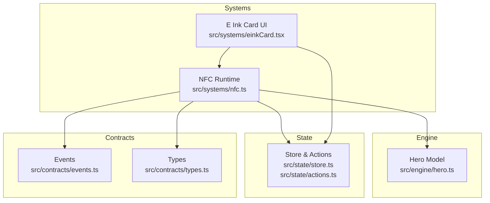
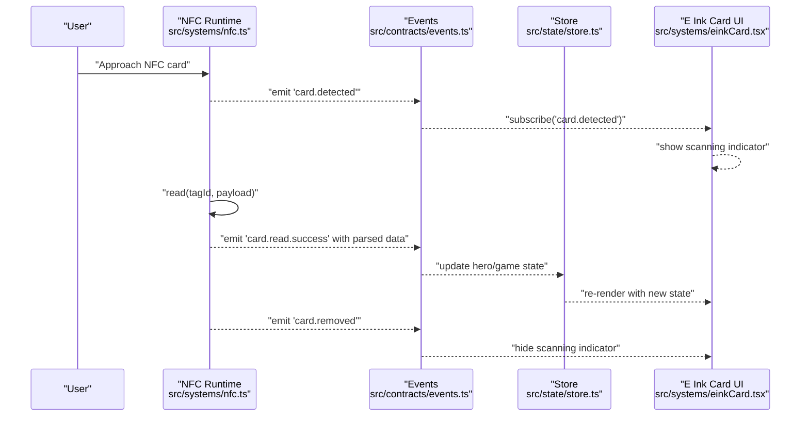
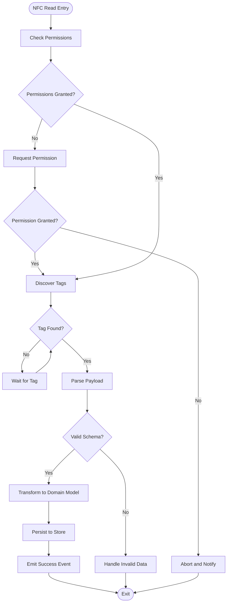
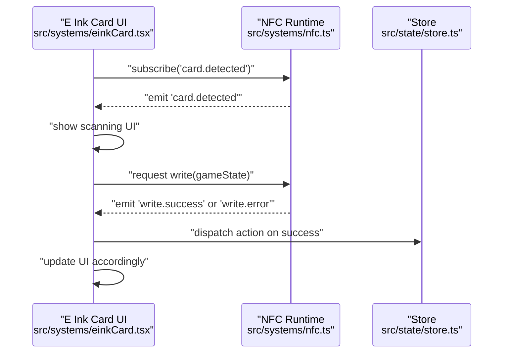
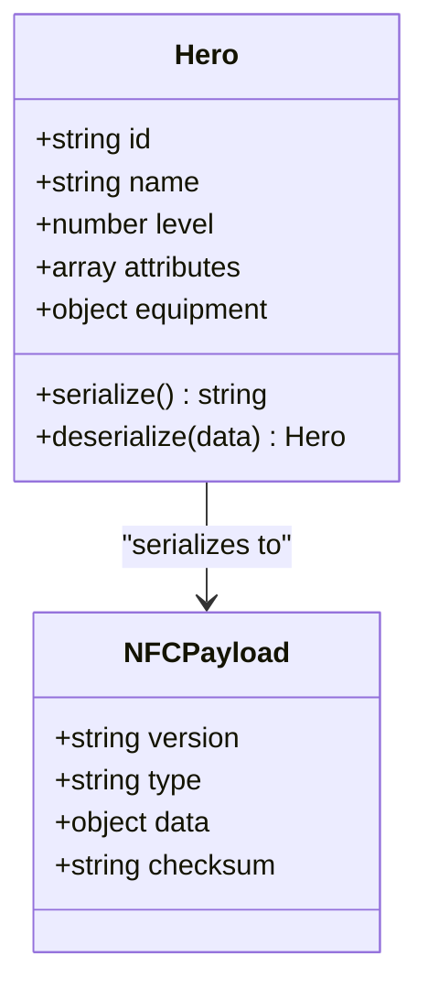
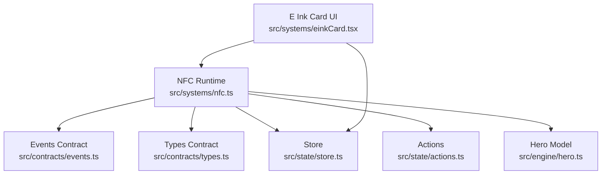

# NFC Card System

<cite>
**Referenced Files in This Document**
- [nfc.ts](file://src/systems/nfc.ts)
- [einkCard.tsx](file://src/systems/einkCard.tsx)
- [hero.ts](file://src/engine/hero.ts)
- [store.ts](file://src/state/store.ts)
- [actions.ts](file://src/state/actions.ts)
- [events.ts](file://src/contracts/events.ts)
- [types.ts](file://src/contracts/types.ts)
</cite>

## Table of Contents

1. [Introduction](#introduction)
2. [Project Structure](#project-structure)
3. [Core Components](#core-components)
4. [Architecture Overview](#architecture-overview)
5. [Detailed Component Analysis](#detailed-component-analysis)
6. [Dependency Analysis](#dependency-analysis)
7. [Performance Considerations](#performance-considerations)
8. [Troubleshooting Guide](#troubleshooting-guide)
9. [Conclusion](#conclusion)
10. [Appendices](#appendices)

## Introduction

This document explains the NFC card system that enables physical media interaction with the application. It covers how cards are detected, read, and written; the data formats used for serialization; lifecycle events such as card insertion and removal; error handling strategies; platform permission requirements; and security considerations to ensure data integrity and authentication. It also provides practical examples for reading hero data from NFC cards, writing game state to cards, and handling card removal events, along with troubleshooting guidance for common NFC issues like reader compatibility and signal strength problems.

## Project Structure

The NFC subsystem is implemented primarily within the systems layer and integrates with the engine’s domain models and the global state store. Key files:

- NFC runtime and event handling: src/systems/nfc.ts
- E Ink card UI integration: src/systems/einkCard.tsx
- Hero model and transformations: src/engine/hero.ts
- Global state and actions: src/state/store.ts, src/state/actions.ts
- Contracts (events and types): src/contracts/events.ts, src/contracts/types.ts

**Diagram sources**

- [nfc.ts](file://src/systems/nfc.ts)
- [einkCard.tsx](file://src/systems/einkCard.tsx)
- [hero.ts](file://src/engine/hero.ts)
- [store.ts](file://src/state/store.ts)
- [actions.ts](file://src/state/actions.ts)
- [events.ts](file://src/contracts/events.ts)
- [types.ts](file://src/contracts/types.ts)

**Section sources**

- [nfc.ts](file://src/systems/nfc.ts)
- [einkCard.tsx](file://src/systems/einkCard.tsx)
- [hero.ts](file://src/engine/hero.ts)
- [store.ts](file://src/state/store.ts)
- [actions.ts](file://src/state/actions.ts)
- [events.ts](file://src/contracts/events.ts)
- [types.ts](file://src/contracts/types.ts)

## Core Components

- NFC Runtime (src/systems/nfc.ts): Manages NFC capabilities, permissions, tag discovery, read/write operations, and emits lifecycle events for card presence changes.
- E Ink Card UI (src/systems/einkCard.tsx): Presents card-related UI and reacts to NFC events to update visuals or trigger flows.
- Hero Model (src/engine/hero.ts): Defines the structure and transformations for hero data that may be serialized to/from NFC cards.
- State Store and Actions (src/state/store.ts, src/state/actions.ts): Centralized state management for game state and user interactions, including updates triggered by NFC reads/writes.
- Contracts (src/contracts/events.ts, src/contracts/types.ts): Shared event definitions and type contracts used across the NFC subsystem and other modules.

Key responsibilities:

- Detecting NFC hardware and requesting necessary permissions on Android/iOS.
- Subscribing to tag events and parsing payloads into typed structures.
- Validating and transforming data before persisting to the store.
- Writing structured payloads back to cards with integrity checks.
- Emitting consistent events for UI and engine reactions.

**Section sources**

- [nfc.ts](file://src/systems/nfc.ts)
- [einkCard.tsx](file://src/systems/einkCard.tsx)
- [hero.ts](file://src/engine/hero.ts)
- [store.ts](file://src/state/store.ts)
- [actions.ts](file://src/state/actions.ts)
- [events.ts](file://src/contracts/events.ts)
- [types.ts](file://src/contracts/types.ts)

## Architecture Overview

The NFC subsystem follows an event-driven architecture:

- Hardware abstraction: The NFC runtime interfaces with platform-specific NFC APIs to discover tags and perform I/O.
- Event emission: On tag detection, read success, write success, or errors, the system emits standardized events.
- State synchronization: Handlers update the global store, which drives UI components and engine logic.
- UI integration: E Ink card UI listens to NFC events and renders appropriate feedback.

**Diagram sources**

- [nfc.ts](file://src/systems/nfc.ts)
- [events.ts](file://src/contracts/events.ts)
- [store.ts](file://src/state/store.ts)
- [einkCard.tsx](file://src/systems/einkCard.tsx)

## Detailed Component Analysis

### NFC Runtime (src/systems/nfc.ts)

Responsibilities:

- Capability check and permission requests for Android/iOS.
- Tag discovery and subscription to presence events.
- Read/write operations with validation and error handling.
- Serialization/deserialization of payloads using defined types.
- Emitting lifecycle events for card detection, read/write outcomes, and removal.

Data flow:

- On tag detection, parse raw bytes into typed structures.
- Validate checksums/signatures if present.
- Update store via actions when data is valid.
- On write, serialize data, compute integrity markers, and handle failures gracefully.

Error handling:

- Distinguish between permission errors, unsupported hardware, read timeouts, and malformed payloads.
- Provide actionable messages and fallback states.

Security:

- Enforce payload schema validation.
- Optionally verify signatures or hashes for integrity.
- Avoid storing sensitive secrets directly on cards; prefer references or tokens.

**Diagram sources**

- [nfc.ts](file://src/systems/nfc.ts)
- [events.ts](file://src/contracts/events.ts)
- [store.ts](file://src/state/store.ts)

**Section sources**

- [nfc.ts](file://src/systems/nfc.ts)
- [events.ts](file://src/contracts/events.ts)

### E Ink Card UI (src/systems/einkCard.tsx)

Responsibilities:

- Render card-related screens and indicators.
- Subscribe to NFC events to show/hide scanning states.
- Trigger write flows based on user actions and current game state.

Integration points:

- Listens to events emitted by the NFC runtime.
- Dispatches actions to update store when writes succeed.
- Displays feedback for errors and retries.

**Diagram sources**

- [einkCard.tsx](file://src/systems/einkCard.tsx)
- [nfc.ts](file://src/systems/nfc.ts)
- [store.ts](file://src/state/store.ts)

**Section sources**

- [einkCard.tsx](file://src/systems/einkCard.tsx)

### Hero Model and Serialization (src/engine/hero.ts)

Responsibilities:

- Define hero data structures used for NFC payloads.
- Provide transformation functions to convert between internal models and serialized formats.
- Ensure deterministic serialization for reliable cross-session persistence.

Serialization patterns:

- Use stable field ordering and versioned schemas.
- Include integrity markers (e.g., checksums) where applicable.
- Handle optional fields gracefully during deserialization.

**Diagram sources**

- [hero.ts](file://src/engine/hero.ts)

**Section sources**

- [hero.ts](file://src/engine/hero.ts)

### State Management Integration (src/state/store.ts, src/state/actions.ts)

Responsibilities:

- Maintain game state and hero data.
- Expose actions for updating state based on NFC reads/writes.
- Ensure consistency across UI and engine layers.

Integration with NFC:

- Actions dispatched upon successful reads/writes.
- Reducers validate and normalize incoming data.
- Emits derived state for UI consumption.

**Section sources**

- [store.ts](file://src/state/store.ts)
- [actions.ts](file://src/state/actions.ts)

### Contracts (src/contracts/events.ts, src/contracts/types.ts)

Responsibilities:

- Define event names and payloads for NFC lifecycle.
- Provide shared types for payloads, errors, and configuration.

Usage:

- NFC runtime emits events conforming to these contracts.
- UI and store handlers subscribe to these events and act accordingly.

**Section sources**

- [events.ts](file://src/contracts/events.ts)
- [types.ts](file://src/contracts/types.ts)

## Dependency Analysis

The NFC subsystem depends on platform NFC APIs and integrates tightly with the store and UI.

**Diagram sources**

- [nfc.ts](file://src/systems/nfc.ts)
- [events.ts](file://src/contracts/events.ts)
- [types.ts](file://src/contracts/types.ts)
- [store.ts](file://src/state/store.ts)
- [actions.ts](file://src/state/actions.ts)
- [hero.ts](file://src/engine/hero.ts)
- [einkCard.tsx](file://src/systems/einkCard.tsx)

**Section sources**

- [nfc.ts](file://src/systems/nfc.ts)
- [einkCard.tsx](file://src/systems/einkCard.tsx)
- [hero.ts](file://src/engine/hero.ts)
- [store.ts](file://src/state/store.ts)
- [actions.ts](file://src/state/actions.ts)
- [events.ts](file://src/contracts/events.ts)
- [types.ts](file://src/contracts/types.ts)

## Performance Considerations

- Minimize repeated tag scans by debouncing detection events.
- Batch store updates to avoid excessive re-renders.
- Cache parsed payloads locally to reduce redundant processing.
- Use efficient serialization formats and avoid unnecessary object cloning.
- Implement retry logic with exponential backoff for transient NFC errors.

[No sources needed since this section provides general guidance]

## Troubleshooting Guide

Common issues and resolutions:

- Reader compatibility:
  - Verify device supports NFC and the required standards (e.g., ISO 14443).
  - Test with known-good cards and readers to isolate hardware vs software issues.
- Signal strength and proximity:
  - Ensure proper alignment and distance; some cards require precise positioning.
  - Remove thick cases or metal objects that interfere with NFC signals.
- Permission errors:
  - Confirm NFC permissions are granted at runtime on Android/iOS.
  - Re-request permissions if previously denied.
- Malformed payloads:
  - Validate schema and checksums; log detailed error context.
  - Fall back to safe defaults or prompt user to re-scan.
- Write failures:
  - Check card write protection settings and capacity limits.
  - Retry with reduced payload size or segmented writes if supported.

Platform-specific notes:

- Android:
  - Use foreground dispatch for immediate tag handling.
  - Handle background launch intents for tag detection.
- iOS:
  - Ensure app is configured for NFC tag reading in Info.plist.
  - Respect session lifecycle and background limitations.

**Section sources**

- [nfc.ts](file://src/systems/nfc.ts)
- [events.ts](file://src/contracts/events.ts)

## Conclusion

The NFC card system provides a robust, event-driven interface for interacting with physical media. By combining strict payload validation, clear lifecycle events, and tight integration with the store and UI, it ensures reliable reading and writing of game data. Following the recommended practices for permissions, error handling, and security will help maintain data integrity and a smooth user experience across platforms.

[No sources needed since this section summarizes without analyzing specific files]

## Appendices

### Examples

- Reading hero data from NFC cards:
  - Approach a card containing serialized hero data.
  - NFC runtime detects tag, parses payload, validates schema, and transforms to hero model.
  - Store updates with new hero data; UI reflects changes.
  - Reference implementation paths:
    - [nfc.ts](file://src/systems/nfc.ts)
    - [hero.ts](file://src/engine/hero.ts)
    - [store.ts](file://src/state/store.ts)

- Writing game state to cards:
  - Serialize current game state into a structured payload with integrity markers.
  - NFC runtime writes payload to card; on success, emit event and update UI.
  - Reference implementation paths:
    - [nfc.ts](file://src/systems/nfc.ts)
    - [einkCard.tsx](file://src/systems/einkCard.tsx)
    - [store.ts](file://src/state/store.ts)

- Handling card removal events:
  - NFC runtime emits removal event after tag disappears.
  - UI hides scanning indicators and resets temporary states.
  - Reference implementation paths:
    - [nfc.ts](file://src/systems/nfc.ts)
    - [events.ts](file://src/contracts/events.ts)
    - [einkCard.tsx](file://src/systems/einkCard.tsx)

### Security Considerations

- Data integrity:
  - Include checksums or hashes in payloads to detect tampering.
  - Validate versions and schemas strictly on deserialization.
- Authentication:
  - If sensitive data is stored, consider signed payloads or token-based access.
  - Avoid embedding secrets directly on cards; use references or server-side verification.
- Privacy:
  - Do not store personally identifiable information on cards unless necessary and consented.
  - Encrypt payloads if the platform and card support secure storage.

[No sources needed since this section provides general guidance]
