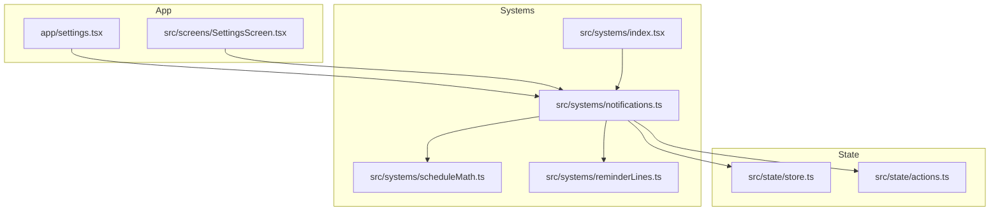
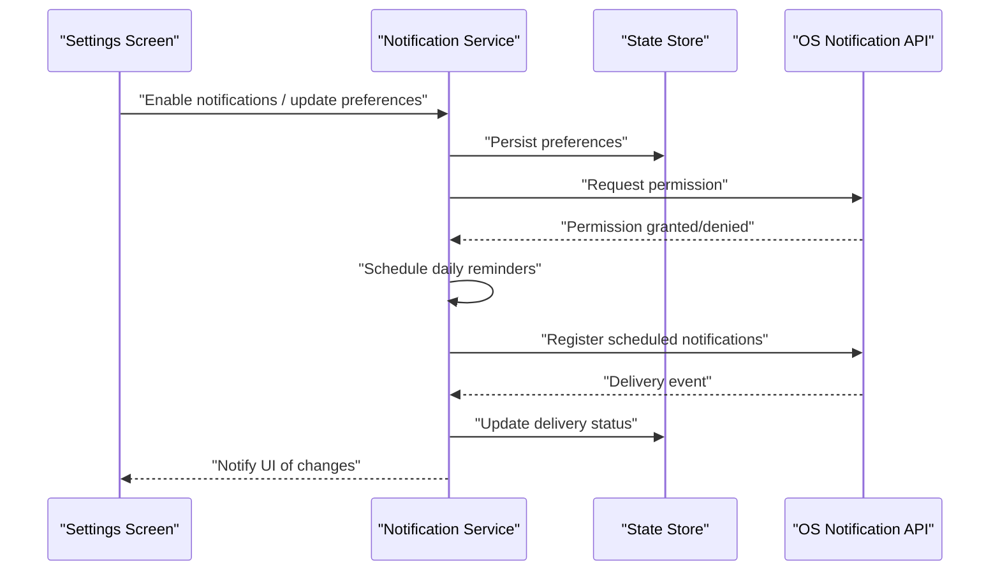
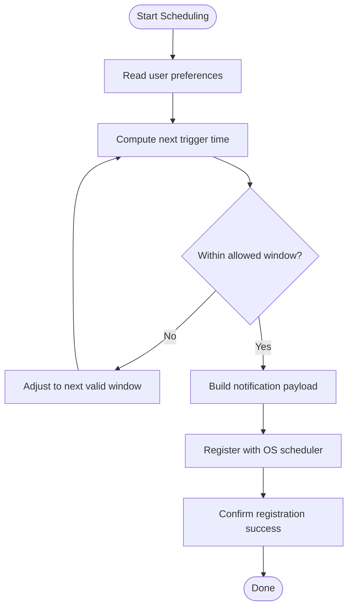
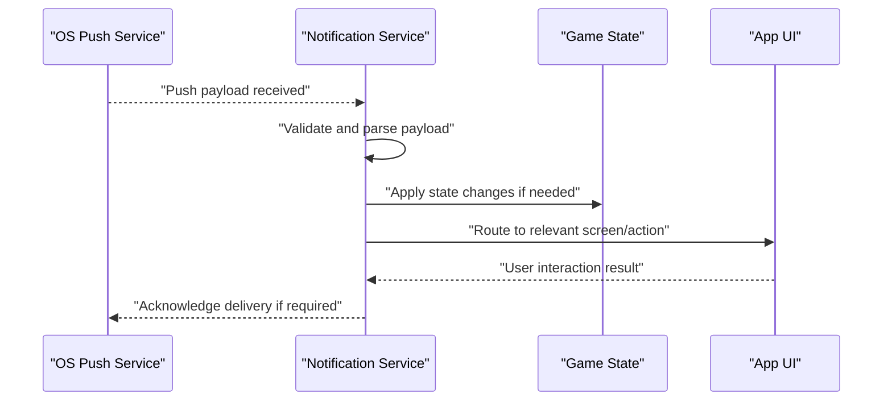
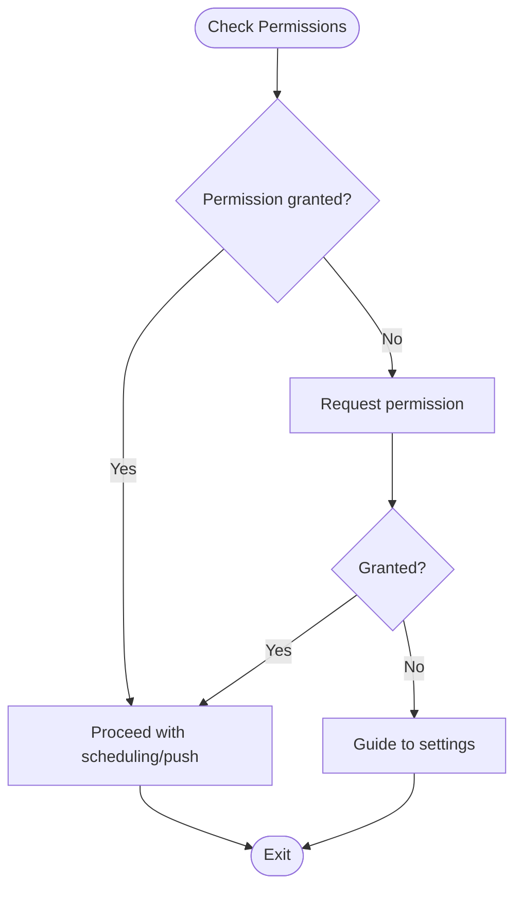
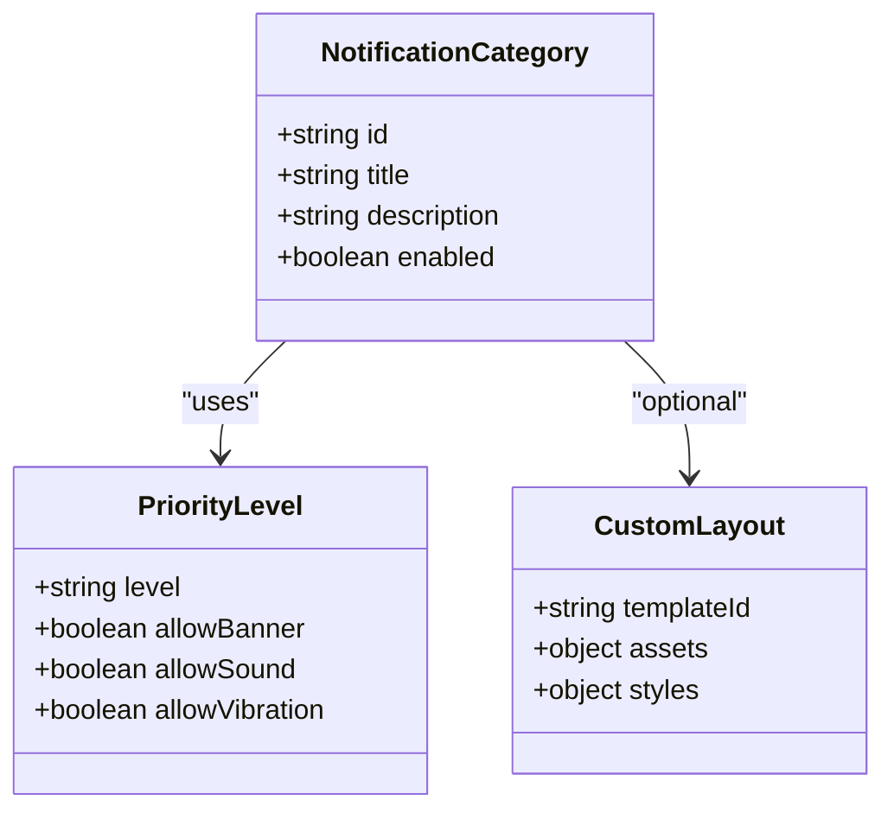
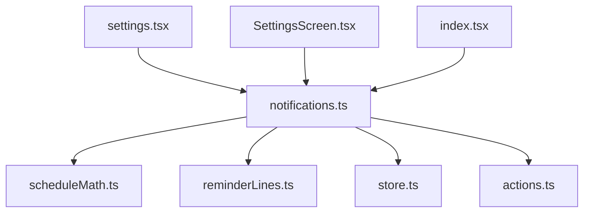

# Notification System

<cite>
**Referenced Files in This Document**
- [notifications.ts](file://src/systems/notifications.ts)
- [scheduleMath.ts](file://src/systems/scheduleMath.ts)
- [reminderLines.ts](file://src/systems/reminderLines.ts)
- [index.tsx](file://src/systems/index.tsx)
- [store.ts](file://src/state/store.ts)
- [actions.ts](file://src/state/actions.ts)
- [settings.tsx](file://app/settings.tsx)
- [SettingsScreen.tsx](file://src/screens/SettingsScreen.tsx)
</cite>

## Table of Contents

1. [Introduction](#introduction)
2. [Project Structure](#project-structure)
3. [Core Components](#core-components)
4. [Architecture Overview](#architecture-overview)
5. [Detailed Component Analysis](#detailed-component-analysis)
6. [Dependency Analysis](#dependency-analysis)
7. [Performance Considerations](#performance-considerations)
8. [Troubleshooting Guide](#troubleshooting-guide)
9. [Conclusion](#conclusion)
10. [Appendices](#appendices)

## Introduction

This document explains the notification system that delivers timely alerts and reminders to users across iOS and Android. It covers local notification scheduling, push notification handling, permission management, categories, priority levels, custom layouts, batching, delivery guarantees, user preferences, platform-specific limitations, and testing strategies. The goal is to provide both a high-level understanding and actionable guidance for developers integrating or extending notifications within the application.

## Project Structure

The notification system is implemented primarily under src/systems with supporting state and UI integration:

- Notification orchestration and scheduling logic live in src/systems/notifications.ts
- Time-based scheduling utilities are in src/systems/scheduleMath.ts
- Reminder content generation is in src/systems/reminderLines.ts
- Feature registration and exports are in src/systems/index.tsx
- User preferences and persistence are managed via src/state/store.ts and src/state/actions.ts
- Settings screens expose notification controls on app/settings.tsx and src/screens/SettingsScreen.tsx

**Diagram sources**

- [notifications.ts](file://src/systems/notifications.ts)
- [scheduleMath.ts](file://src/systems/scheduleMath.ts)
- [reminderLines.ts](file://src/systems/reminderLines.ts)
- [index.tsx](file://src/systems/index.tsx)
- [store.ts](file://src/state/store.ts)
- [actions.ts](file://src/state/actions.ts)
- [settings.tsx](file://app/settings.tsx)
- [SettingsScreen.tsx](file://src/screens/SettingsScreen.tsx)

**Section sources**

- [notifications.ts](file://src/systems/notifications.ts)
- [scheduleMath.ts](file://src/systems/scheduleMath.ts)
- [reminderLines.ts](file://src/systems/reminderLines.ts)
- [index.tsx](file://src/systems/index.tsx)
- [store.ts](file://src/state/store.ts)
- [actions.ts](file://src/state/actions.ts)
- [settings.tsx](file://app/settings.tsx)
- [SettingsScreen.tsx](file://src/screens/SettingsScreen.tsx)

## Core Components

- Local notification scheduler: Schedules daily reminders and contextual alerts based on game state using time utilities and reminder content generators.
- Permission manager: Requests and tracks notification permissions on iOS and Android, gating features when denied.
- Push handler: Receives and processes incoming push payloads, mapping them to in-app actions or state updates.
- Category and priority manager: Defines notification categories (e.g., reminders, game events), priority levels, and optional custom layouts per category.
- Preference store: Persists user choices such as enabled categories, quiet hours, and delivery frequency.

Key responsibilities:

- Schedule recurring daily reminders at preferred times
- Deliver contextual notifications when specific game states occur
- Handle user interactions (taps, dismissals, actions)
- Batch notifications where supported by the platform
- Provide delivery guarantees aligned with OS capabilities

**Section sources**

- [notifications.ts](file://src/systems/notifications.ts)
- [scheduleMath.ts](file://src/systems/scheduleMath.ts)
- [reminderLines.ts](file://src/systems/reminderLines.ts)
- [store.ts](file://src/state/store.ts)
- [actions.ts](file://src/state/actions.ts)

## Architecture Overview

The notification system integrates with the app’s state and settings while delegating OS-specific behaviors to platform APIs. The flow includes permission checks, scheduling, delivery, and interaction handling.

**Diagram sources**

- [notifications.ts](file://src/systems/notifications.ts)
- [store.ts](file://src/state/store.ts)
- [SettingsScreen.tsx](file://src/screens/SettingsScreen.tsx)

## Detailed Component Analysis

### Local Notification Scheduling

- Daily reminders are computed using scheduleMath utilities to determine next trigger times respecting user preferences and quiet hours.
- Reminder content is generated via reminderLines to produce localized, context-aware messages.
- Scheduling respects platform constraints (e.g., background execution limits) and batches where possible.

**Diagram sources**

- [scheduleMath.ts](file://src/systems/scheduleMath.ts)
- [reminderLines.ts](file://src/systems/reminderLines.ts)
- [notifications.ts](file://src/systems/notifications.ts)

**Section sources**

- [scheduleMath.ts](file://src/systems/scheduleMath.ts)
- [reminderLines.ts](file://src/systems/reminderLines.ts)
- [notifications.ts](file://src/systems/notifications.ts)

### Push Notification Handling

- Incoming push payloads are parsed and mapped to internal actions or state updates.
- Contextual notifications can be triggered based on game state transitions derived from push data.
- Interaction callbacks route taps and actions back into the app’s navigation and state machine.

**Diagram sources**

- [notifications.ts](file://src/systems/notifications.ts)
- [store.ts](file://src/state/store.ts)

**Section sources**

- [notifications.ts](file://src/systems/notifications.ts)
- [store.ts](file://src/state/store.ts)

### Permission Management

- Requests notification permissions on first use and caches results.
- Provides graceful fallbacks when permissions are denied, guiding users to system settings.
- Respects platform differences between iOS and Android permission models.

**Diagram sources**

- [notifications.ts](file://src/systems/notifications.ts)
- [store.ts](file://src/state/store.ts)

**Section sources**

- [notifications.ts](file://src/systems/notifications.ts)
- [store.ts](file://src/state/store.ts)

### Categories, Priority Levels, and Custom Layouts

- Categories define groups such as reminders, game events, and system alerts.
- Priority levels influence display behavior (e.g., heads-up vs. silent).
- Custom layouts can be applied per category where supported by the platform.

**Diagram sources**

- [notifications.ts](file://src/systems/notifications.ts)

**Section sources**

- [notifications.ts](file://src/systems/notifications.ts)

### Examples: Scheduling and Contextual Notifications

- Daily reminders: Use scheduleMath to compute next trigger time and register a repeating notification respecting user preferences.
- Contextual notifications: On specific game state changes (e.g., completing a level), build a payload and deliver immediately if permitted.
- Interaction handling: Map tap actions to navigation routes and state updates; log outcomes for analytics.

**Section sources**

- [scheduleMath.ts](file://src/systems/scheduleMath.ts)
- [reminderLines.ts](file://src/systems/reminderLines.ts)
- [notifications.ts](file://src/systems/notifications.ts)
- [store.ts](file://src/state/store.ts)

### Notification Batching and Delivery Guarantees

- Batching: Group multiple notifications when supported by the OS to reduce interruptions and improve battery life.
- Delivery guarantees: Align expectations with OS capabilities; immediate delivery may be throttled in background on some platforms.
- Retry strategy: Implement best-effort retries for critical reminders, respecting rate limits and user preferences.

**Section sources**

- [notifications.ts](file://src/systems/notifications.ts)

### User Preference Management

- Preferences include enabling/disabling categories, setting quiet hours, choosing delivery frequency, and opting out of specific channels.
- Persisted via the state store and exposed through settings screens.
- Changes take effect on next scheduling cycle or immediately for non-recurring notifications.

**Section sources**

- [store.ts](file://src/state/store.ts)
- [actions.ts](file://src/state/actions.ts)
- [settings.tsx](file://app/settings.tsx)
- [SettingsScreen.tsx](file://src/screens/SettingsScreen.tsx)

## Dependency Analysis

The notification system depends on scheduling utilities, reminder content generation, and the state store. It also integrates with app settings to reflect user choices.

**Diagram sources**

- [notifications.ts](file://src/systems/notifications.ts)
- [scheduleMath.ts](file://src/systems/scheduleMath.ts)
- [reminderLines.ts](file://src/systems/reminderLines.ts)
- [store.ts](file://src/state/store.ts)
- [actions.ts](file://src/state/actions.ts)
- [settings.tsx](file://app/settings.tsx)
- [SettingsScreen.tsx](file://src/screens/SettingsScreen.tsx)
- [index.tsx](file://src/systems/index.tsx)

**Section sources**

- [notifications.ts](file://src/systems/notifications.ts)
- [scheduleMath.ts](file://src/systems/scheduleMath.ts)
- [reminderLines.ts](file://src/systems/reminderLines.ts)
- [store.ts](file://src/state/store.ts)
- [actions.ts](file://src/state/actions.ts)
- [settings.tsx](file://app/settings.tsx)
- [SettingsScreen.tsx](file://src/screens/SettingsScreen.tsx)
- [index.tsx](file://src/systems/index.tsx)

## Performance Considerations

- Minimize scheduling overhead by computing triggers efficiently and avoiding redundant registrations.
- Batch notifications to reduce system wake-ups and user interruptions.
- Respect OS background execution limits; defer heavy processing until foreground.
- Cache preference reads and permission results to avoid repeated I/O.

[No sources needed since this section provides general guidance]

## Troubleshooting Guide

Common issues and resolutions:

- Permission denied: Ensure the app requests permissions before scheduling; guide users to system settings if denied.
- Missed reminders: Verify quiet hours and do-not-disturb settings; check OS restrictions on background scheduling.
- Duplicate notifications: Deduplicate payloads and ensure unique identifiers per schedule.
- Push not delivered: Validate payload format and server-side delivery; handle offline scenarios gracefully.

**Section sources**

- [notifications.ts](file://src/systems/notifications.ts)
- [store.ts](file://src/state/store.ts)

## Conclusion

The notification system provides robust scheduling, push handling, and permission management across iOS and Android. By leveraging scheduling utilities, reminder content generation, and user preferences, it delivers timely and contextual alerts while respecting platform constraints. Proper batching, delivery guarantees, and testing strategies ensure reliability and a positive user experience.

[No sources needed since this section summarizes without analyzing specific files]

## Appendices

### Platform-Specific Limitations

- iOS: Background delivery may be delayed; requires proper entitlements and payload configuration.
- Android: Doze mode and app standby can delay delivery; use appropriate alarm types and channel priorities.

[No sources needed since this section provides general guidance]

### Testing Strategies

- Unit tests for scheduling calculations and reminder content generation.
- Integration tests simulating permission flows and OS notification responses.
- Manual testing on devices to validate real-world behavior under different OS modes.

[No sources needed since this section provides general guidance]
