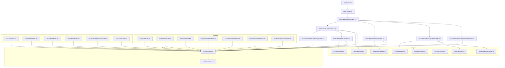
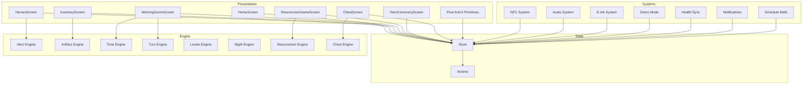
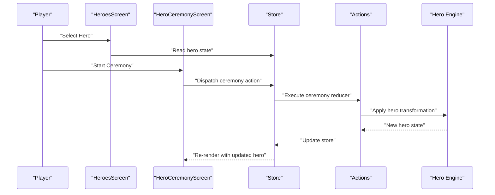
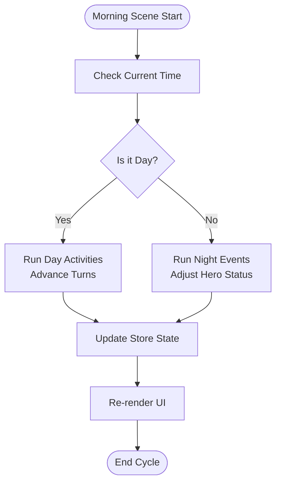
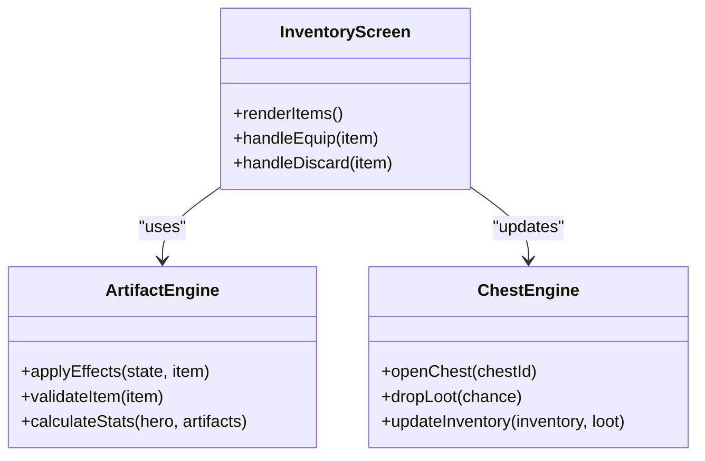
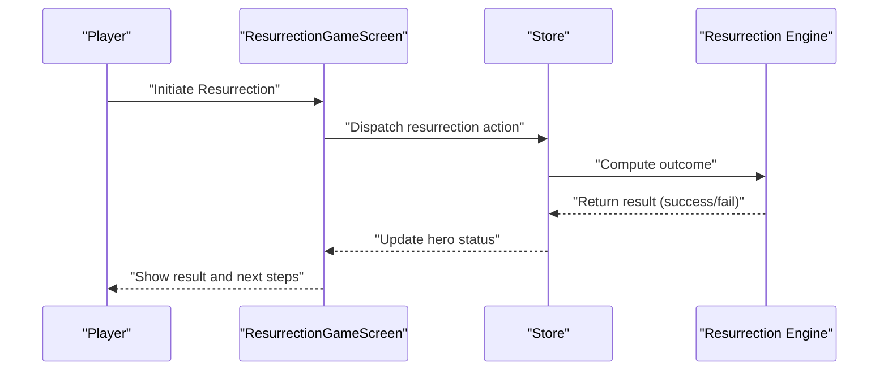
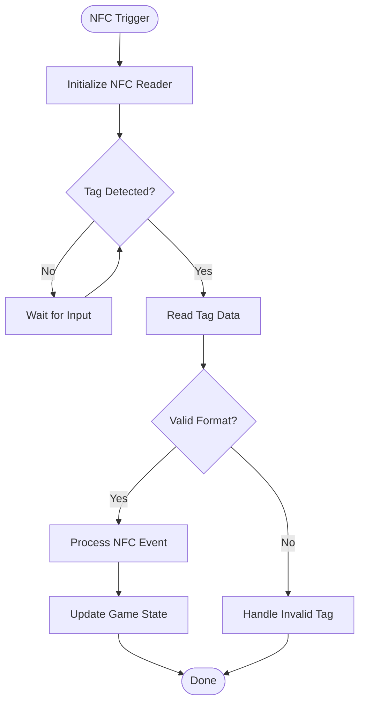
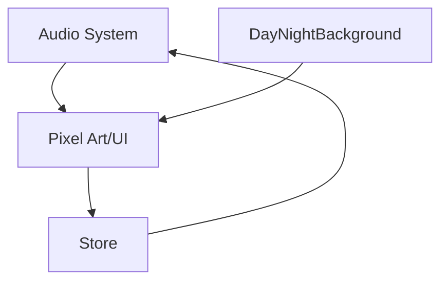
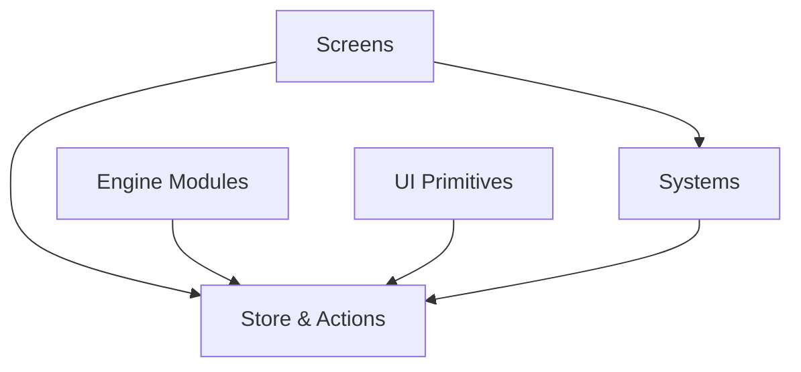

# Project Overview

<cite>
**Referenced Files in This Document**
- [README.md](file://README.md)
- [package.json](file://package.json)
- [app.json](file://app.json)
- [metro.config.js](file://metro.config.js)
- [tsconfig.json](file://tsconfig.json)
- [jest.config.js](file://jest.config.js)
- [eslint.config.js](file://eslint.config.js)
- [.prettierrc](file://.prettierrc)
- [app/index.tsx](file://app/index.tsx)
- [app/_layout.tsx](file://app/_layout.tsx)
- [src/engine/hero.ts](file://src/engine/hero.ts)
- [src/engine/artifacts.ts](file://src/engine/artifacts.ts)
- [src/engine/time.ts](file://src/engine/time.ts)
- [src/engine/turn.ts](file://src/engine/turn.ts)
- [src/engine/levels.ts](file://src/engine/levels.ts)
- [src/engine/night.ts](file://src/engine/night.ts)
- [src/engine/resurrection.ts](file://src/engine/resurrection.ts)
- [src/engine/chest.ts](file://src/engine/chest.ts)
- [src/state/store.ts](file://src/state/store.ts)
- [src/state/actions.ts](file://src/state/actions.ts)
- [src/screens/HeroesScreen.tsx](file://src/screens/HeroesScreen.tsx)
- [src/screens/HeroCeremonyScreen.tsx](file://src/screens/HeroCeremonyScreen.tsx)
- [src/screens/InventoryScreen.tsx](file://src/screens/InventoryScreen.tsx)
- [src/screens/MorningSceneScreen.tsx](file://src/screens/MorningSceneScreen.tsx)
- [src/screens/ResurrectionGameScreen.tsx](file://src/screens/ResurrectionGameScreen.tsx)
- [src/screens/ChestScreen.tsx](file://src/screens/ChestScreen.tsx)
- [src/screens/HomeScreen.tsx](file://src/screens/HomeScreen.tsx)
- [src/screens/OnboardingScreen.tsx](file://src/screens/OnboardingScreen.tsx)
- [src/screens/TutorialScreen.tsx](file://src/screens/TutorialScreen.tsx)
- [src/screens/SettingsScreen.tsx](file://src/screens/SettingsScreen.tsx)
- [src/systems/nfc.ts](file://src/systems/nfc.ts)
- [src/systems/audio.ts](file://src/systems/audio.ts)
- [src/systems/eink.ts](file://src/systems/eink.ts)
- [src/systems/demoMode.ts](file://src/systems/demoMode.ts)
- [src/systems/healthSync.ts](file://src/systems/healthSync.ts)
- [src/systems/notifications.ts](file://src/systems/notifications.ts)
- [src/systems/scheduleMath.ts](file://src/systems/scheduleMath.ts)
- [src/ui/PixelArt.tsx](file://src/ui/PixelArt.tsx)
- [src/ui/PixelButton.tsx](file://src/ui/PixelButton.tsx)
- [src/ui/PixelPanel.tsx](file://src/ui/PixelPanel.tsx)
- [src/ui/PixelSprite.tsx](file://src/ui/PixelSprite.tsx)
- [src/ui/DayNightBackground.tsx](file://src/ui/DayNightBackground.tsx)
- [src/ui/useGame.tsx](file://src/ui/useGame.tsx)
- [assets/manifest.ts](file://assets/manifest.ts)
</cite>

## Table of Contents

1. Introduction
2. Project Structure
3. Core Components
4. Architecture Overview
5. Detailed Component Analysis
6. Dependency Analysis
7. Performance Considerations
8. Troubleshooting Guide
9. Conclusion

## Introduction

This project is a React Native mobile game that blends interactive pixel art with hero management, time-based mechanics, and artifact systems. Players guide heroes through day-night cycles, perform ceremonies, manage inventories, and engage in resurrection gameplay. The app targets iOS and Android platforms and integrates system features such as NFC for device interactions, audio feedback, and optional e-Ink optimizations. It uses TypeScript for type safety and a component-based architecture with centralized state management to keep the game logic decoupled from UI rendering.

Key goals:

- Deliver an engaging pixel-art experience on mobile devices
- Provide structured hero progression via ceremonies and artifacts
- Implement time-driven gameplay loops (day/night, turns)
- Offer platform integrations like NFC and notifications
- Maintain clean separation between engine logic, state, screens, and UI components

## Project Structure

The codebase follows a clear separation of concerns:

- app/: Entry points and screen-level navigation files
- src/: Core application logic including engine, state, screens, systems, and UI
- assets/: Pixel art, fonts, icons, and asset manifests
- tools/: Asset generation scripts and utilities
- Configuration files at the root for build, linting, testing, and formatting

**Diagram sources**

- [app/index.tsx](file://app/index.tsx)
- [app/_layout.tsx](file://app/_layout.tsx)
- [src/screens/HomeScreen.tsx](file://src/screens/HomeScreen.tsx)
- [src/screens/HeroesScreen.tsx](file://src/screens/HeroesScreen.tsx)
- [src/screens/InventoryScreen.tsx](file://src/screens/InventoryScreen.tsx)
- [src/screens/MorningSceneScreen.tsx](file://src/screens/MorningSceneScreen.tsx)
- [src/screens/ResurrectionGameScreen.tsx](file://src/screens/ResurrectionGameScreen.tsx)
- [src/screens/HeroCeremonyScreen.tsx](file://src/screens/HeroCeremonyScreen.tsx)
- [src/screens/ChestScreen.tsx](file://src/screens/ChestScreen.tsx)
- [src/engine/hero.ts](file://src/engine/hero.ts)
- [src/engine/artifacts.ts](file://src/engine/artifacts.ts)
- [src/engine/time.ts](file://src/engine/time.ts)
- [src/engine/turn.ts](file://src/engine/turn.ts)
- [src/engine/levels.ts](file://src/engine/levels.ts)
- [src/engine/night.ts](file://src/engine/night.ts)
- [src/engine/resurrection.ts](file://src/engine/resurrection.ts)
- [src/engine/chest.ts](file://src/engine/chest.ts)
- [src/state/store.ts](file://src/state/store.ts)
- [src/state/actions.ts](file://src/state/actions.ts)
- [src/systems/nfc.ts](file://src/systems/nfc.ts)
- [src/systems/audio.ts](file://src/systems/audio.ts)
- [src/systems/eink.ts](file://src/systems/eink.ts)
- [src/systems/demoMode.ts](file://src/systems/demoMode.ts)
- [src/systems/healthSync.ts](file://src/systems/healthSync.ts)
- [src/systems/notifications.ts](file://src/systems/notifications.ts)
- [src/systems/scheduleMath.ts](file://src/systems/scheduleMath.ts)
- [src/ui/PixelArt.tsx](file://src/ui/PixelArt.tsx)
- [src/ui/PixelButton.tsx](file://src/ui/PixelButton.tsx)
- [src/ui/PixelPanel.tsx](file://src/ui/PixelPanel.tsx)
- [src/ui/PixelSprite.tsx](file://src/ui/PixelSprite.tsx)
- [src/ui/DayNightBackground.tsx](file://src/ui/DayNightBackground.tsx)
- [src/ui/useGame.tsx](file://src/ui/useGame.tsx)

**Section sources**

- [app/index.tsx](file://app/index.tsx)
- [app/_layout.tsx](file://app/_layout.tsx)
- [src/screens/HomeScreen.tsx](file://src/screens/HomeScreen.tsx)
- [src/screens/HeroesScreen.tsx](file://src/screens/HeroesScreen.tsx)
- [src/screens/InventoryScreen.tsx](file://src/screens/InventoryScreen.tsx)
- [src/screens/MorningSceneScreen.tsx](file://src/screens/MorningSceneScreen.tsx)
- [src/screens/ResurrectionGameScreen.tsx](file://src/screens/ResurrectionGameScreen.tsx)
- [src/screens/HeroCeremonyScreen.tsx](file://src/screens/HeroCeremonyScreen.tsx)
- [src/screens/ChestScreen.tsx](file://src/screens/ChestScreen.tsx)
- [src/engine/hero.ts](file://src/engine/hero.ts)
- [src/engine/artifacts.ts](file://src/engine/artifacts.ts)
- [src/engine/time.ts](file://src/engine/time.ts)
- [src/engine/turn.ts](file://src/engine/turn.ts)
- [src/engine/levels.ts](file://src/engine/levels.ts)
- [src/engine/night.ts](file://src/engine/night.ts)
- [src/engine/resurrection.ts](file://src/engine/resurrection.ts)
- [src/engine/chest.ts](file://src/engine/chest.ts)
- [src/state/store.ts](file://src/state/store.ts)
- [src/state/actions.ts](file://src/state/actions.ts)
- [src/systems/nfc.ts](file://src/systems/nfc.ts)
- [src/systems/audio.ts](file://src/systems/audio.ts)
- [src/systems/eink.ts](file://src/systems/eink.ts)
- [src/systems/demoMode.ts](file://src/systems/demoMode.ts)
- [src/systems/healthSync.ts](file://src/systems/healthSync.ts)
- [src/systems/notifications.ts](file://src/systems/notifications.ts)
- [src/systems/scheduleMath.ts](file://src/systems/scheduleMath.ts)
- [src/ui/PixelArt.tsx](file://src/ui/PixelArt.tsx)
- [src/ui/PixelButton.tsx](file://src/ui/PixelButton.tsx)
- [src/ui/PixelPanel.tsx](file://src/ui/PixelPanel.tsx)
- [src/ui/PixelSprite.tsx](file://src/ui/PixelSprite.tsx)
- [src/ui/DayNightBackground.tsx](file://src/ui/DayNightBackground.tsx)
- [src/ui/useGame.tsx](file://src/ui/useGame.tsx)

## Core Components

- Engine layer: Pure logic modules for heroes, artifacts, time, turns, levels, night cycle, resurrection, and chests. These encapsulate game rules and transformations without UI coupling.
- State layer: Centralized store and actions to manage global game state, ensuring consistent updates across screens.
- Screens: Feature-focused UI containers that render scenes, handle user input, and dispatch actions.
- Systems: Platform integrations and utilities (NFC, audio, e-Ink, demo mode, health sync, notifications, schedule math).
- UI primitives: Pixel art rendering, buttons, panels, sprites, backgrounds, and hooks for game integration.

Key responsibilities:

- Engine modules compute state transitions deterministically based on inputs and current state.
- Store exposes selectors and reducers; actions trigger state changes.
- Screens subscribe to state and call actions on user interactions.
- Systems provide capabilities like NFC scanning or audio playback and are consumed by screens or engine where appropriate.
- UI components focus on presentation and animation, using theme and asset manifests.

**Section sources**

- [src/engine/hero.ts](file://src/engine/hero.ts)
- [src/engine/artifacts.ts](file://src/engine/artifacts.ts)
- [src/engine/time.ts](file://src/engine/time.ts)
- [src/engine/turn.ts](file://src/engine/turn.ts)
- [src/engine/levels.ts](file://src/engine/levels.ts)
- [src/engine/night.ts](file://src/engine/night.ts)
- [src/engine/resurrection.ts](file://src/engine/resurrection.ts)
- [src/engine/chest.ts](file://src/engine/chest.ts)
- [src/state/store.ts](file://src/state/store.ts)
- [src/state/actions.ts](file://src/state/actions.ts)
- [src/screens/HeroesScreen.tsx](file://src/screens/HeroesScreen.tsx)
- [src/screens/InventoryScreen.tsx](file://src/screens/InventoryScreen.tsx)
- [src/screens/MorningSceneScreen.tsx](file://src/screens/MorningSceneScreen.tsx)
- [src/screens/ResurrectionGameScreen.tsx](file://src/screens/ResurrectionGameScreen.tsx)
- [src/screens/HeroCeremonyScreen.tsx](file://src/screens/HeroCeremonyScreen.tsx)
- [src/screens/ChestScreen.tsx](file://src/screens/ChestScreen.tsx)
- [src/systems/nfc.ts](file://src/systems/nfc.ts)
- [src/systems/audio.ts](file://src/systems/audio.ts)
- [src/systems/eink.ts](file://src/systems/eink.ts)
- [src/systems/demoMode.ts](file://src/systems/demoMode.ts)
- [src/systems/healthSync.ts](file://src/systems/healthSync.ts)
- [src/systems/notifications.ts](file://src/systems/notifications.ts)
- [src/systems/scheduleMath.ts](file://src/systems/scheduleMath.ts)
- [src/ui/PixelArt.tsx](file://src/ui/PixelArt.tsx)
- [src/ui/PixelButton.tsx](file://src/ui/PixelButton.tsx)
- [src/ui/PixelPanel.tsx](file://src/ui/PixelPanel.tsx)
- [src/ui/PixelSprite.tsx](file://src/ui/PixelSprite.tsx)
- [src/ui/DayNightBackground.tsx](file://src/ui/DayNightBackground.tsx)
- [src/ui/useGame.tsx](file://src/ui/useGame.tsx)

## Architecture Overview

The application follows a layered architecture:

- Presentation layer (screens and UI primitives) renders pixel art and handles user interactions.
- State layer centralizes game state and actions, enabling predictable updates.
- Engine layer contains pure functions and data structures defining game mechanics.
- Systems layer provides platform-specific features and utilities.

**Diagram sources**

- [src/screens/HomeScreen.tsx](file://src/screens/HomeScreen.tsx)
- [src/screens/HeroesScreen.tsx](file://src/screens/HeroesScreen.tsx)
- [src/screens/InventoryScreen.tsx](file://src/screens/InventoryScreen.tsx)
- [src/screens/MorningSceneScreen.tsx](file://src/screens/MorningSceneScreen.tsx)
- [src/screens/ResurrectionGameScreen.tsx](file://src/screens/ResurrectionGameScreen.tsx)
- [src/screens/HeroCeremonyScreen.tsx](file://src/screens/HeroCeremonyScreen.tsx)
- [src/screens/ChestScreen.tsx](file://src/screens/ChestScreen.tsx)
- [src/ui/PixelArt.tsx](file://src/ui/PixelArt.tsx)
- [src/state/store.ts](file://src/state/store.ts)
- [src/state/actions.ts](file://src/state/actions.ts)
- [src/engine/hero.ts](file://src/engine/hero.ts)
- [src/engine/artifacts.ts](file://src/engine/artifacts.ts)
- [src/engine/time.ts](file://src/engine/time.ts)
- [src/engine/turn.ts](file://src/engine/turn.ts)
- [src/engine/levels.ts](file://src/engine/levels.ts)
- [src/engine/night.ts](file://src/engine/night.ts)
- [src/engine/resurrection.ts](file://src/engine/resurrection.ts)
- [src/engine/chest.ts](file://src/engine/chest.ts)
- [src/systems/nfc.ts](file://src/systems/nfc.ts)
- [src/systems/audio.ts](file://src/systems/audio.ts)
- [src/systems/eink.ts](file://src/systems/eink.ts)
- [src/systems/demoMode.ts](file://src/systems/demoMode.ts)
- [src/systems/healthSync.ts](file://src/systems/healthSync.ts)
- [src/systems/notifications.ts](file://src/systems/notifications.ts)
- [src/systems/scheduleMath.ts](file://src/systems/scheduleMath.ts)

## Detailed Component Analysis

### Hero Management and Ceremonies

- HeroesScreen manages hero selection and progression.
- HeroCeremonyScreen orchestrates ceremony flows that modify hero attributes or unlock abilities.
- Engine modules define hero states, stats, and transitions.

**Diagram sources**

- [src/screens/HeroesScreen.tsx](file://src/screens/HeroesScreen.tsx)
- [src/screens/HeroCeremonyScreen.tsx](file://src/screens/HeroCeremonyScreen.tsx)
- [src/state/store.ts](file://src/state/store.ts)
- [src/state/actions.ts](file://src/state/actions.ts)
- [src/engine/hero.ts](file://src/engine/hero.ts)

**Section sources**

- [src/screens/HeroesScreen.tsx](file://src/screens/HeroesScreen.tsx)
- [src/screens/HeroCeremonyScreen.tsx](file://src/screens/HeroCeremonyScreen.tsx)
- [src/engine/hero.ts](file://src/engine/hero.ts)

### Time-Based Mechanics and Turn System

- MorningSceneScreen drives daily activities and time progression.
- Time and turn engines coordinate day/night cycles and turn advancement.
- Night engine introduces nighttime events and challenges.

**Diagram sources**

- [src/screens/MorningSceneScreen.tsx](file://src/screens/MorningSceneScreen.tsx)
- [src/engine/time.ts](file://src/engine/time.ts)
- [src/engine/turn.ts](file://src/engine/turn.ts)
- [src/engine/night.ts](file://src/engine/night.ts)
- [src/state/store.ts](file://src/state/store.ts)

**Section sources**

- [src/screens/MorningSceneScreen.tsx](file://src/screens/MorningSceneScreen.tsx)
- [src/engine/time.ts](file://src/engine/time.ts)
- [src/engine/turn.ts](file://src/engine/turn.ts)
- [src/engine/night.ts](file://src/engine/night.ts)

### Artifact System and Inventory Management

- InventoryScreen displays and manages collected artifacts.
- Artifact engine defines item properties, effects, and interactions.
- Chest engine handles loot drops and inventory updates.

**Diagram sources**

- [src/screens/InventoryScreen.tsx](file://src/screens/InventoryScreen.tsx)
- [src/engine/artifacts.ts](file://src/engine/artifacts.ts)
- [src/engine/chest.ts](file://src/engine/chest.ts)

**Section sources**

- [src/screens/InventoryScreen.tsx](file://src/screens/InventoryScreen.tsx)
- [src/engine/artifacts.ts](file://src/engine/artifacts.ts)
- [src/engine/chest.ts](file://src/engine/chest.ts)

### Resurrection Gameplay

- ResurrectionGameScreen implements mini-game or ritual mechanics to revive heroes.
- Resurrection engine computes success probabilities and outcomes.

**Diagram sources**

- [src/screens/ResurrectionGameScreen.tsx](file://src/screens/ResurrectionGameScreen.tsx)
- [src/engine/resurrection.ts](file://src/engine/resurrection.ts)
- [src/state/store.ts](file://src/state/store.ts)

**Section sources**

- [src/screens/ResurrectionGameScreen.tsx](file://src/screens/ResurrectionGameScreen.tsx)
- [src/engine/resurrection.ts](file://src/engine/resurrection.ts)

### NFC Integration

- NFC system enables device-to-device or tag interactions for gameplay features.
- Screens can trigger NFC operations and update state based on results.

**Diagram sources**

- [src/systems/nfc.ts](file://src/systems/nfc.ts)
- [src/state/store.ts](file://src/state/store.ts)

**Section sources**

- [src/systems/nfc.ts](file://src/systems/nfc.ts)

### Audio and Visual Feedback

- Audio system plays sound effects and ambient tracks.
- Pixel art and scene components render animations and backgrounds.
- Day/night background adapts visuals to time-of-day state.

**Diagram sources**

- [src/systems/audio.ts](file://src/systems/audio.ts)
- [src/ui/PixelArt.tsx](file://src/ui/PixelArt.tsx)
- [src/ui/DayNightBackground.tsx](file://src/ui/DayNightBackground.tsx)
- [src/state/store.ts](file://src/state/store.ts)

**Section sources**

- [src/systems/audio.ts](file://src/systems/audio.ts)
- [src/ui/PixelArt.tsx](file://src/ui/PixelArt.tsx)
- [src/ui/DayNightBackground.tsx](file://src/ui/DayNightBackground.tsx)

## Dependency Analysis

High-level dependencies:

- Screens depend on Store and Actions for state mutations and subscriptions.
- Engine modules are independent and only interact via state updates.
- Systems provide side effects and platform APIs consumed by screens or engine when necessary.
- UI primitives rely on theme, fonts, and asset manifests.

**Diagram sources**

- [src/screens/HomeScreen.tsx](file://src/screens/HomeScreen.tsx)
- [src/state/store.ts](file://src/state/store.ts)
- [src/state/actions.ts](file://src/state/actions.ts)
- [src/engine/hero.ts](file://src/engine/hero.ts)
- [src/systems/nfc.ts](file://src/systems/nfc.ts)
- [src/ui/PixelArt.tsx](file://src/ui/PixelArt.tsx)

**Section sources**

- [src/screens/HomeScreen.tsx](file://src/screens/HomeScreen.tsx)
- [src/state/store.ts](file://src/state/store.ts)
- [src/state/actions.ts](file://src/state/actions.ts)
- [src/engine/hero.ts](file://src/engine/hero.ts)
- [src/systems/nfc.ts](file://src/systems/nfc.ts)
- [src/ui/PixelArt.tsx](file://src/ui/PixelArt.tsx)

## Performance Considerations

- Keep engine functions pure and memoize expensive computations to avoid unnecessary re-renders.
- Use selective subscriptions in screens to minimize state updates.
- Optimize pixel art rendering by batching draws and reusing textures.
- Leverage e-Ink optimizations for low-power displays where applicable.
- Profile audio playback to prevent blocking the main thread.

[No sources needed since this section provides general guidance]

## Troubleshooting Guide

Common issues and resolutions:

- State inconsistencies: Verify actions correctly transform state and ensure no direct mutations outside reducers.
- NFC failures: Check permissions and device compatibility; log tag read errors and handle invalid formats gracefully.
- Audio not playing: Confirm media assets are loaded and permissions granted; test on target devices.
- UI flickering: Ensure stable keys for lists and avoid excessive re-renders by memoizing components.
- Time drift: Validate time calculations against device clock and timezone settings.

**Section sources**

- [src/state/store.ts](file://src/state/store.ts)
- [src/state/actions.ts](file://src/state/actions.ts)
- [src/systems/nfc.ts](file://src/systems/nfc.ts)
- [src/systems/audio.ts](file://src/systems/audio.ts)

## Conclusion

This React Native mobile game delivers a cohesive pixel-art experience centered around hero management, time-driven gameplay, and artifact collection. Its layered architecture separates engine logic, state management, screens, systems, and UI primitives, enabling maintainability and scalability. With platform integrations like NFC and audio, plus e-Ink optimizations, the app targets both iOS and Android while providing rich gameplay mechanics. Developers can extend features by adding new engine modules, screens, and systems while adhering to the established patterns.

[No sources needed since this section summarizes without analyzing specific files]
