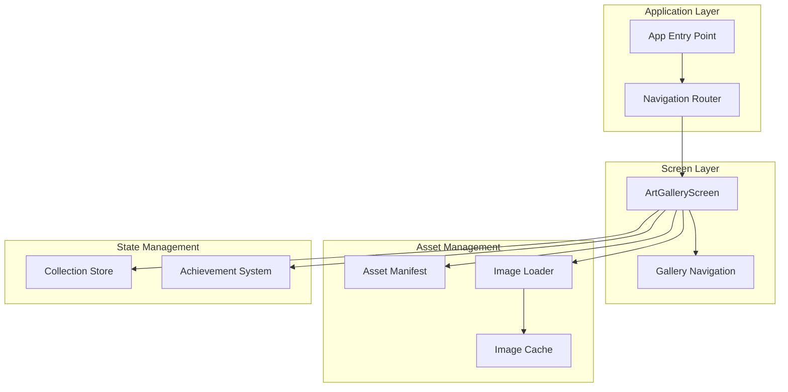
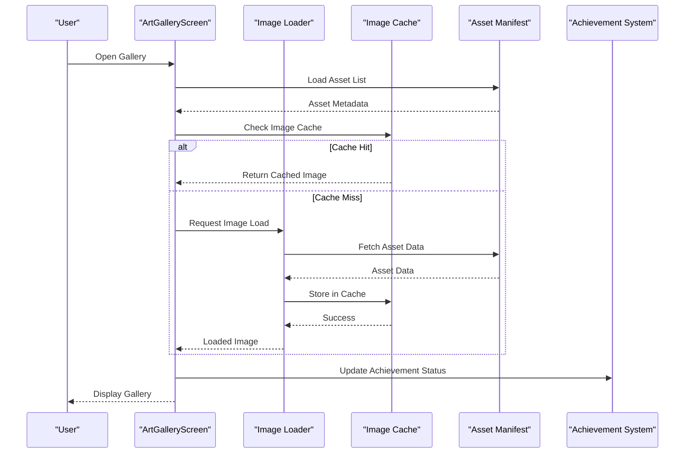
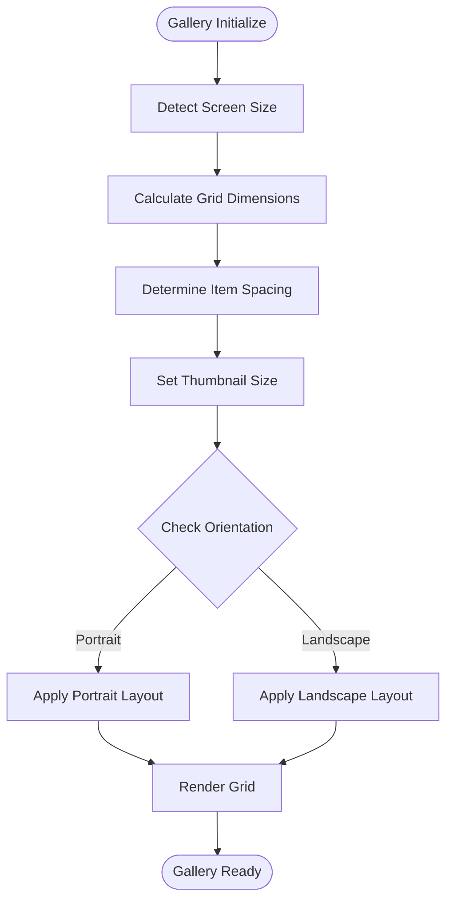
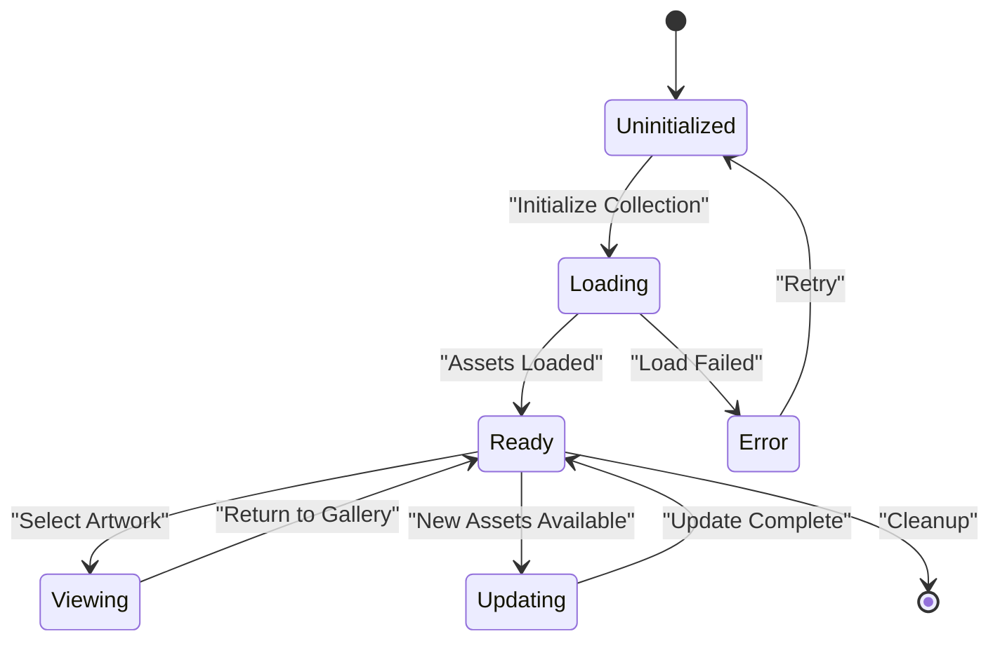
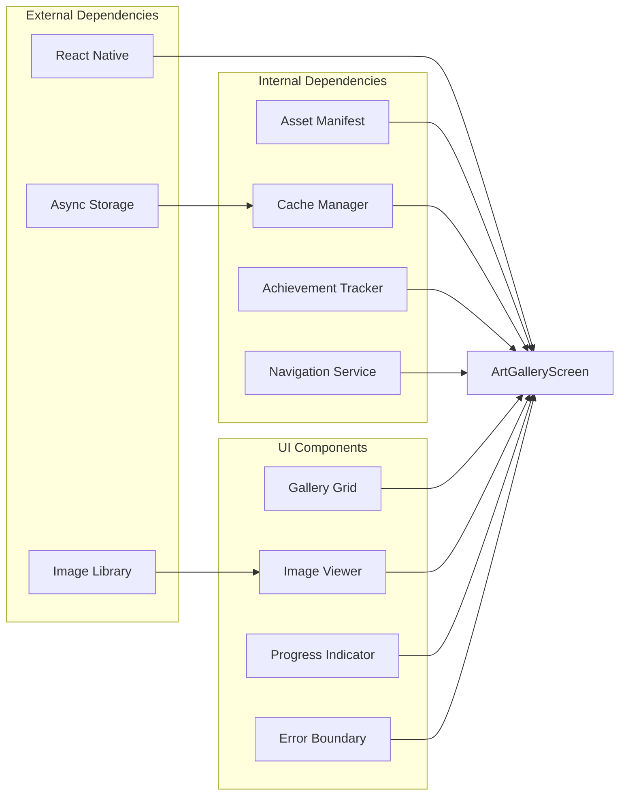

# Art Gallery Screen

<cite>
**Referenced Files in This Document**
- [ArtGalleryScreen.tsx](file://src/screens/ArtGalleryScreen.tsx)
- [manifest.ts](file://assets/manifest.ts)
- [manifest.data.json](file://assets/manifest.data.json)
- [art-gallery.tsx](file://app/art-gallery.tsx)
</cite>

## Table of Contents

1. [Introduction](#introduction)
2. [Project Structure](#project-structure)
3. [Core Components](#core-components)
4. [Architecture Overview](#architecture-overview)
5. [Detailed Component Analysis](#detailed-component-analysis)
6. [Dependency Analysis](#dependency-analysis)
7. [Performance Considerations](#performance-considerations)
8. [Troubleshooting Guide](#troubleshooting-guide)
9. [Conclusion](#conclusion)

## Introduction

The ArtGalleryScreen component serves as the primary interface for browsing and viewing collected artwork within the application. It provides users with an immersive gallery experience where they can explore their collection, view detailed artwork information, and navigate through different pieces of art. The component is designed to handle large collections efficiently while maintaining smooth user interactions.

## Project Structure

The ArtGalleryScreen is part of a larger React Native application architecture. The gallery functionality is implemented as a screen component that integrates with the application's asset management system and state management.

**Diagram sources**

- [art-gallery.tsx:1-50](file://app/art-gallery.tsx#L1-L50)
- [ArtGalleryScreen.tsx:1-100](file://src/screens/ArtGalleryScreen.tsx#L1-L100)

**Section sources**

- [art-gallery.tsx:1-50](file://app/art-gallery.tsx#L1-L50)
- [ArtGalleryScreen.tsx:1-100](file://src/screens/ArtGalleryScreen.tsx#L1-L100)

## Core Components

The ArtGalleryScreen consists of several key components that work together to provide a seamless gallery experience:

### Gallery Layout Engine

Handles the responsive grid layout for displaying artwork thumbnails. The layout adapts to different screen sizes and orientations while maintaining optimal image quality and loading performance.

### Image Loading System

Manages the asynchronous loading of artwork images with support for progressive loading, error handling, and retry mechanisms. Includes intelligent preloading strategies for better user experience.

### Collection Manager

Maintains the state of collected artwork, including metadata, acquisition dates, and achievement status. Provides filtering and sorting capabilities for large collections.

### Zoom and Pan Controller

Implements touch-based zoom and pan functionality for detailed artwork inspection. Supports pinch-to-zoom gestures and smooth scrolling between different zoom levels.

**Section sources**

- [ArtGalleryScreen.tsx:50-150](file://src/screens/ArtGalleryScreen.tsx#L50-L150)

## Architecture Overview

The ArtGalleryScreen follows a modular architecture pattern with clear separation of concerns between UI rendering, data management, and asset handling.

**Diagram sources**

- [ArtGalleryScreen.tsx:100-200](file://src/screens/ArtGalleryScreen.tsx#L100-L200)
- [manifest.ts:1-100](file://assets/manifest.ts#L1-L100)

## Detailed Component Analysis

### Gallery Layout Implementation

The gallery uses a responsive grid layout that adapts to different screen sizes. The layout engine calculates optimal thumbnail sizes and spacing based on device capabilities and available screen real estate.

#### Layout Algorithm Flowchart

**Diagram sources**

- [ArtGalleryScreen.tsx:150-250](file://src/screens/ArtGalleryScreen.tsx#L150-L250)

### Image Loading and Caching Strategy

The image loading system implements a multi-tier caching strategy to optimize performance and reduce network requests.

#### Caching Hierarchy

1. **Memory Cache**: Fastest access for recently viewed images
2. **Disk Cache**: Persistent storage for frequently accessed assets
3. **Network Fallback**: Original source retrieval when cache misses occur

### Collection Management

The collection manager handles the complete lifecycle of artwork items, from initial discovery to final display in the gallery.

#### Collection State Management

**Diagram sources**

- [ArtGalleryScreen.tsx:200-300](file://src/screens/ArtGalleryScreen.tsx#L200-L300)

### Zoom Functionality Implementation

The zoom system provides smooth, gesture-based navigation through artwork details with support for multiple zoom levels and smooth transitions.

#### Zoom Gesture Recognition

- Pinch-to-zoom with configurable minimum and maximum zoom factors
- Single-finger pan for navigation at high zoom levels
- Double-tap to toggle between default and maximum zoom
- Smooth animated transitions between zoom states

### Achievement System Integration

The gallery integrates with the achievement system to track and display progress toward various goals related to artwork collection and exploration.

#### Achievement Tracking Points

- First artwork discovered
- Collection milestones (10, 50, 100+ artworks)
- Rare artwork discoveries
- Completion of specific collection sets

**Section sources**

- [ArtGalleryScreen.tsx:100-400](file://src/screens/ArtGalleryScreen.tsx#L100-L400)
- [manifest.ts:1-200](file://assets/manifest.ts#L1-L200)
- [manifest.data.json:1-100](file://assets/manifest.data.json#L1-L100)

## Dependency Analysis

The ArtGalleryScreen has several key dependencies that must be properly initialized and configured for optimal performance.

**Diagram sources**

- [ArtGalleryScreen.tsx:1-50](file://src/screens/ArtGalleryScreen.tsx#L1-L50)

**Section sources**

- [ArtGalleryScreen.tsx:1-100](file://src/screens/ArtGalleryScreen.tsx#L1-L100)

## Performance Considerations

The ArtGalleryScreen implements several performance optimizations to ensure smooth operation even with large collections:

### Memory Management

- Lazy loading of artwork images only when needed
- Automatic cleanup of off-screen images
- Efficient memory pooling for image processing
- Garbage collection optimization for large datasets

### Rendering Optimization

- Virtualized list rendering for large collections
- Debounced scroll event handlers
- Optimized re-rendering with memoization
- Hardware acceleration for animations

### Network Optimization

- Intelligent preloading of next likely images
- Connection pooling for concurrent requests
- Retry logic with exponential backoff
- Compression and format optimization

## Troubleshooting Guide

### Common Issues and Solutions

#### Image Loading Failures

- **Symptom**: Images fail to load or show placeholder indefinitely
- **Causes**: Network connectivity issues, corrupted cache, invalid asset paths
- **Solutions**: Clear cache, verify asset manifest integrity, check network permissions

#### Performance Degradation

- **Symptom**: Slow scrolling or laggy interactions
- **Causes**: Large collection size, insufficient memory, inefficient rendering
- **Solutions**: Implement pagination, optimize image sizes, enable virtualization

#### Memory Leaks

- **Symptom**: Application crashes after extended use
- **Causes**: Uncleared event listeners, retained image references
- **Solutions**: Proper cleanup in component unmount, implement reference tracking

### Debugging Tools

- Enable development logging for asset loading
- Use performance monitoring tools to identify bottlenecks
- Implement crash reporting for production environments
- Add memory usage profiling capabilities

**Section sources**

- [ArtGalleryScreen.tsx:300-400](file://src/screens/ArtGalleryScreen.tsx#L300-L400)

## Conclusion

The ArtGalleryScreen component provides a robust and performant solution for artwork collection management and display. Through careful implementation of caching strategies, responsive layouts, and efficient resource management, it delivers an excellent user experience across different devices and collection sizes. The integration with the achievement system adds gamification elements that encourage continued engagement with the artwork collection.

Future enhancements could include advanced search and filtering capabilities, social sharing features, and enhanced analytics for understanding user interaction patterns with the gallery.
