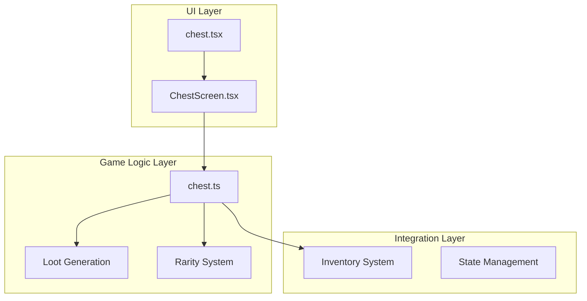
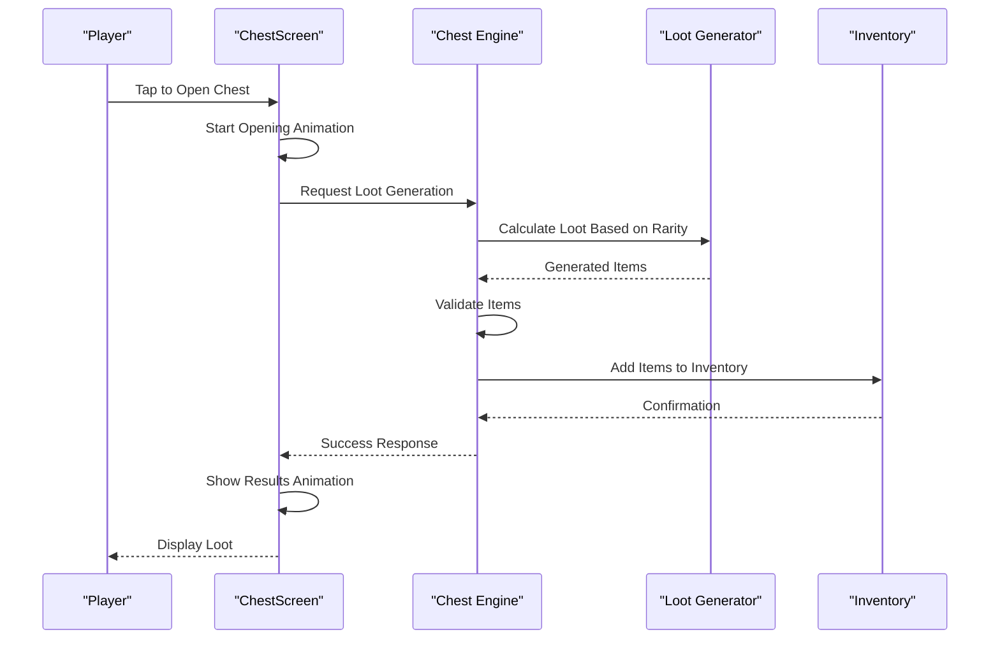
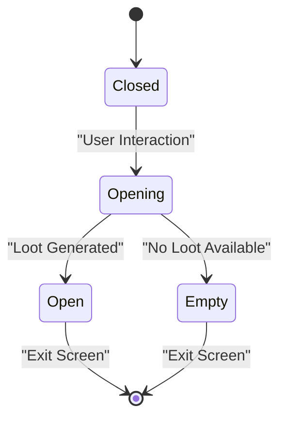
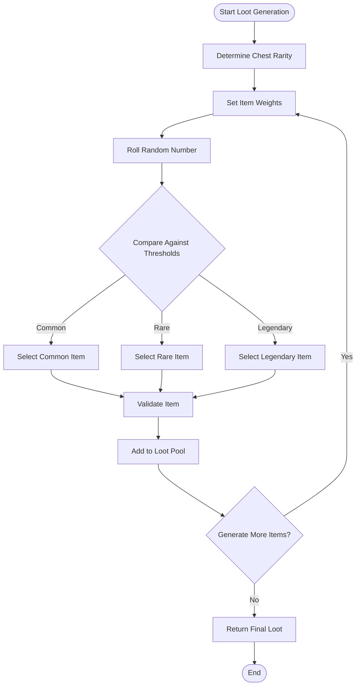
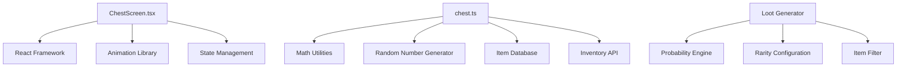

# Chest Screen

<cite>
**Referenced Files in This Document**
- [chest.tsx](file://app/chest.tsx)
- [ChestScreen.tsx](file://src/screens/ChestScreen.tsx)
- [chest.ts](file://src/engine/chest.ts)
- [inventory.tsx](file://app/inventory.tsx)
- [InventoryScreen.tsx](file://src/screens/InventoryScreen.tsx)
</cite>

## Table of Contents

1. [Introduction](#introduction)
2. [Project Structure](#project-structure)
3. [Core Components](#core-components)
4. [Architecture Overview](#architecture-overview)
5. [Detailed Component Analysis](#detailed-component-analysis)
6. [Dependency Analysis](#dependency-analysis)
7. [Performance Considerations](#performance-considerations)
8. [Troubleshooting Guide](#troubleshooting-guide)
9. [Conclusion](#conclusion)

## Introduction

The ChestScreen component is a core gameplay feature that handles chest interaction mechanics, including opening animations, random loot generation, rarity systems, and inventory integration. This component provides players with an engaging experience when discovering and collecting items from chests throughout the game.

## Project Structure

The chest system is distributed across multiple layers:

- **UI Layer**: ChestScreen.tsx handles user interface and animations
- **Game Logic Layer**: chest.ts contains core mechanics and algorithms
- **Navigation Layer**: chest.tsx serves as the entry point
- **Integration Layer**: Inventory system integration for item management

**Diagram sources**

- [chest.tsx:1-50](file://app/chest.tsx#L1-L50)
- [ChestScreen.tsx:1-100](file://src/screens/ChestScreen.tsx#L1-L100)
- [chest.ts:1-150](file://src/engine/chest.ts#L1-L150)

## Core Components

### ChestScreen Component

The main UI component responsible for:

- Displaying chest states (closed, opening, open)
- Managing animation sequences
- Handling user interactions
- Providing visual feedback for different outcomes

### Chest Engine

Core logic implementation including:

- Chest state management
- Loot probability calculations
- Rarity determination algorithms
- Item validation and processing

### Loot Generation System

Handles random item selection based on:

- Chest rarity tiers
- Item probability distributions
- Weighted random selection
- Quality-based filtering

**Section sources**

- [ChestScreen.tsx:1-200](file://src/screens/ChestScreen.tsx#L1-L200)
- [chest.ts:1-300](file://src/engine/chest.ts#L1-L300)

## Architecture Overview

**Diagram sources**

- [ChestScreen.tsx:50-150](file://src/screens/ChestScreen.tsx#L50-L150)
- [chest.ts:100-250](file://src/engine/chest.ts#L100-L250)

## Detailed Component Analysis

### Chest State Management

The chest system manages multiple states:

- **Closed**: Initial state before interaction
- **Opening**: Animation phase during chest opening
- **Open**: Final state showing collected loot
- **Empty**: Special case for depleted chests

**Diagram sources**

- [chest.ts:150-250](file://src/engine/chest.ts#L150-L250)

### Loot Probability System

The probability calculation follows this flow:

**Diagram sources**

- [chest.ts:200-400](file://src/engine/chest.ts#L200-L400)

### Animation System

The chest opening animation includes:

- **Phase 1**: Chest shake/bounce effect
- **Phase 2**: Light burst/glow animation
- **Phase 3**: Item reveal sequence
- **Phase 4**: Success celebration

**Section sources**

- [ChestScreen.tsx:100-300](file://src/screens/ChestScreen.tsx#L100-L300)
- [chest.ts:250-500](file://src/engine/chest.ts#L250-L500)

### Inventory Integration

The system integrates with the inventory through:

- Real-time item addition
- Quantity tracking
- Category organization
- Visual feedback updates

## Dependency Analysis

**Diagram sources**

- [ChestScreen.tsx:1-100](file://src/screens/ChestScreen.tsx#L1-L100)
- [chest.ts:1-150](file://src/engine/chest.ts#L1-L150)

## Performance Considerations

- **Lazy Loading**: Chest assets load on demand
- **Animation Optimization**: Hardware-accelerated animations
- **Memory Management**: Efficient item pool management
- **State Caching**: Cached chest states to prevent recalculation

## Troubleshooting Guide

### Common Issues

1. **Loot Not Appearing**: Check probability thresholds and item availability
2. **Animation Glitches**: Verify animation timing and state transitions
3. **Inventory Sync Issues**: Ensure proper state synchronization
4. **Performance Drops**: Monitor memory usage and animation complexity

### Debugging Tips

- Enable debug logging for loot generation
- Use state inspection tools for chest states
- Monitor animation frame rates
- Test with different chest rarities

## Conclusion

The ChestScreen component provides a robust and engaging chest interaction system with sophisticated loot mechanics, smooth animations, and seamless inventory integration. The modular architecture allows for easy customization and extension of features while maintaining performance and reliability.
