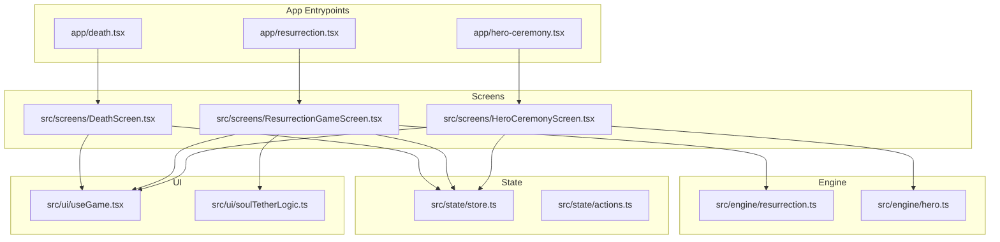
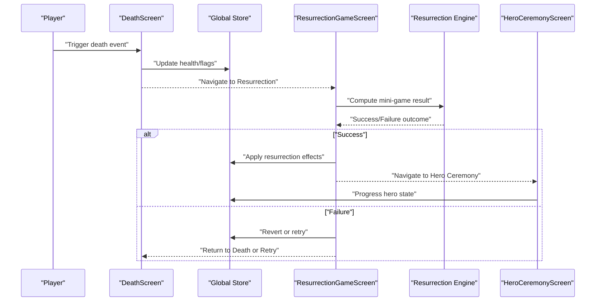
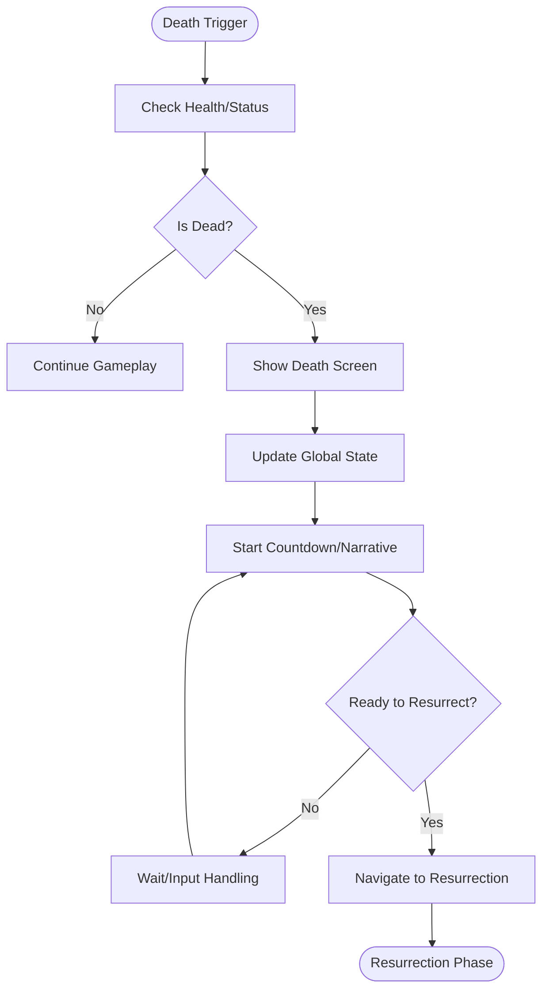
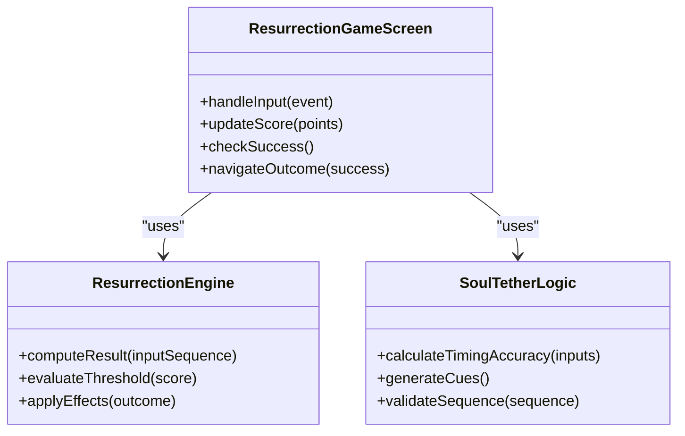
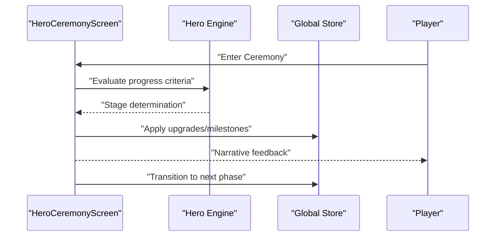
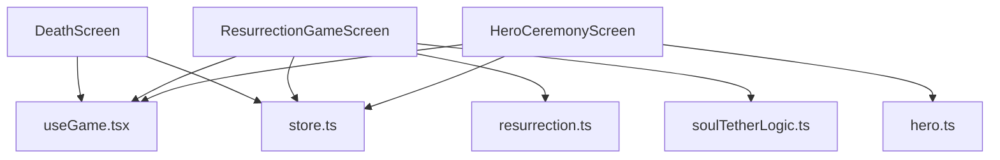

# Game Mechanics Screens

<cite>
**Referenced Files in This Document**
- [death.tsx](file://app/death.tsx)
- [resurrection.tsx](file://app/resurrection.tsx)
- [hero-ceremony.tsx](file://app/hero-ceremony.tsx)
- [DeathScreen.tsx](file://src/screens/DeathScreen.tsx)
- [ResurrectionGameScreen.tsx](file://src/screens/ResurrectionGameScreen.tsx)
- [HeroCeremonyScreen.tsx](file://src/screens/HeroCeremonyScreen.tsx)
- [resurrection.ts](file://src/engine/resurrection.ts)
- [hero.ts](file://src/engine/hero.ts)
- [store.ts](file://src/state/store.ts)
- [actions.ts](file://src/state/actions.ts)
- [useGame.tsx](file://src/ui/useGame.tsx)
- [soulTetherLogic.ts](file://src/ui/soulTetherLogic.ts)
</cite>

## Table of Contents

1. [Introduction](#introduction)
2. [Project Structure](#project-structure)
3. [Core Components](#core-components)
4. [Architecture Overview](#architecture-overview)
5. [Detailed Component Analysis](#detailed-component-analysis)
6. [Dependency Analysis](#dependency-analysis)
7. [Performance Considerations](#performance-considerations)
8. [Troubleshooting Guide](#troubleshooting-guide)
9. [Conclusion](#conclusion)

## Introduction

This document explains the specialized game mechanics screens that handle critical gameplay moments: Death, Resurrection, and Hero Ceremony. It covers how these screens orchestrate state transitions, manage user input during high-stakes sequences, and integrate with the core engine for timing, scoring, and narrative progression. The goal is to provide both a conceptual overview and concrete implementation references so developers can understand and extend these systems confidently.

## Project Structure

The project organizes screen entry points under app/ and their implementations under src/screens/. Engine logic lives under src/engine/, shared UI hooks under src/ui/, and global state under src/state/. The Death, Resurrection, and Hero Ceremony screens follow this pattern:

- Entry point files (app/*.tsx) route to dedicated screen components.
- Screen components encapsulate UI, input handling, and orchestration.
- Engine modules implement deterministic rules for resurrection and hero progression.
- State management centralizes game state updates and persistence.

**Diagram sources**

- [death.tsx](file://app/death.tsx)
- [resurrection.tsx](file://app/resurrection.tsx)
- [hero-ceremony.tsx](file://app/hero-ceremony.tsx)
- [DeathScreen.tsx](file://src/screens/DeathScreen.tsx)
- [ResurrectionGameScreen.tsx](file://src/screens/ResurrectionGameScreen.tsx)
- [HeroCeremonyScreen.tsx](file://src/screens/HeroCeremonyScreen.tsx)
- [resurrection.ts](file://src/engine/resurrection.ts)
- [hero.ts](file://src/engine/hero.ts)
- [store.ts](file://src/state/store.ts)
- [actions.ts](file://src/state/actions.ts)
- [useGame.tsx](file://src/ui/useGame.tsx)
- [soulTetherLogic.ts](file://src/ui/soulTetherLogic.ts)

**Section sources**

- [death.tsx](file://app/death.tsx)
- [resurrection.tsx](file://app/resurrection.tsx)
- [hero-ceremony.tsx](file://app/hero-ceremony.tsx)
- [DeathScreen.tsx](file://src/screens/DeathScreen.tsx)
- [ResurrectionGameScreen.tsx](file://src/screens/ResurrectionGameScreen.tsx)
- [HeroCeremonyScreen.tsx](file://src/screens/HeroCeremonyScreen.tsx)
- [resurrection.ts](file://src/engine/resurrection.ts)
- [hero.ts](file://src/engine/hero.ts)
- [store.ts](file://src/state/store.ts)
- [actions.ts](file://src/state/actions.ts)
- [useGame.tsx](file://src/ui/useGame.tsx)
- [soulTetherLogic.ts](file://src/ui/soulTetherLogic.ts)

## Core Components

- DeathScreen: Presents death events, manages countdown or fail states, and transitions to resurrection when appropriate. It coordinates with the global store to update health and flags.
- ResurrectionGameScreen: Implements the resurrection mini-game, including timing-based interactions, scoring, and success/failure outcomes. It uses engine logic to compute results and updates state accordingly.
- HeroCeremonyScreen: Guides the hero through ceremony progression, applying upgrades or narrative milestones based on player performance and current game state.

Key responsibilities:

- Input handling during critical moments (e.g., timed taps, holds).
- State transitions between screens and game phases.
- Integration with engine modules for deterministic calculations.
- Narrative pacing via timers and event sequencing.

**Section sources**

- [DeathScreen.tsx](file://src/screens/DeathScreen.tsx)
- [ResurrectionGameScreen.tsx](file://src/screens/ResurrectionGameScreen.tsx)
- [HeroCeremonyScreen.tsx](file://src/screens/HeroCeremonyScreen.tsx)
- [resurrection.ts](file://src/engine/resurrection.ts)
- [hero.ts](file://src/engine/hero.ts)
- [store.ts](file://src/state/store.ts)
- [actions.ts](file://src/state/actions.ts)

## Architecture Overview

The three screens form a cohesive lifecycle around death and rebirth:

- Death triggers a transition to Resurrection.
- Resurrection determines success via a mini-game and updates state.
- Success leads to Hero Ceremony; failure may return to a prior state or retry loop.

**Diagram sources**

- [DeathScreen.tsx](file://src/screens/DeathScreen.tsx)
- [ResurrectionGameScreen.tsx](file://src/screens/ResurrectionGameScreen.tsx)
- [HeroCeremonyScreen.tsx](file://src/screens/HeroCeremonyScreen.tsx)
- [resurrection.ts](file://src/engine/resurrection.ts)
- [store.ts](file://src/state/store.ts)

## Detailed Component Analysis

### Death Sequence Flow

The death sequence orchestrates a controlled transition from active gameplay to the resurrection phase. It typically involves:

- Detecting death conditions (health depletion or specific triggers).
- Displaying narrative cues and countdown elements.
- Updating global state to reflect death status.
- Navigating to the Resurrection screen when ready.

**Diagram sources**

- [DeathScreen.tsx](file://src/screens/DeathScreen.tsx)
- [store.ts](file://src/state/store.ts)

**Section sources**

- [DeathScreen.tsx](file://src/screens/DeathScreen.tsx)
- [store.ts](file://src/state/store.ts)

### Resurrection Mini-Game Mechanics

The resurrection mini-game centers on timing-based interactions to determine success. Key aspects include:

- Timed inputs (taps, holds) synchronized to visual/audio cues.
- Scoring system evaluating accuracy and speed.
- Engine-driven calculation of success thresholds.
- State updates reflecting resurrection outcome.

**Diagram sources**

- [ResurrectionGameScreen.tsx](file://src/screens/ResurrectionGameScreen.tsx)
- [resurrection.ts](file://src/engine/resurrection.ts)
- [soulTetherLogic.ts](file://src/ui/soulTetherLogic.ts)

**Section sources**

- [ResurrectionGameScreen.tsx](file://src/screens/ResurrectionGameScreen.tsx)
- [resurrection.ts](file://src/engine/resurrection.ts)
- [soulTetherLogic.ts](file://src/ui/soulTetherLogic.ts)

### Hero Ceremony Progression System

The Hero Ceremony guides the hero through narrative and mechanical progression after successful resurrection. It includes:

- Progressive stages based on performance metrics.
- Application of upgrades or story milestones.
- Integration with hero engine for stat changes.
- State transitions back to main gameplay or next scene.

**Diagram sources**

- [HeroCeremonyScreen.tsx](file://src/screens/HeroCeremonyScreen.tsx)
- [hero.ts](file://src/engine/hero.ts)
- [store.ts](file://src/state/store.ts)

**Section sources**

- [HeroCeremonyScreen.tsx](file://src/screens/HeroCeremonyScreen.tsx)
- [hero.ts](file://src/engine/hero.ts)
- [store.ts](file://src/state/store.ts)

## Dependency Analysis

The screens depend on shared UI hooks and state management for consistent behavior:

- useGame hook provides access to game state and actions.
- Store centralizes state mutations and persistence.
- Engine modules encapsulate deterministic logic for resurrection and hero progression.

**Diagram sources**

- [DeathScreen.tsx](file://src/screens/DeathScreen.tsx)
- [ResurrectionGameScreen.tsx](file://src/screens/ResurrectionGameScreen.tsx)
- [HeroCeremonyScreen.tsx](file://src/screens/HeroCeremonyScreen.tsx)
- [useGame.tsx](file://src/ui/useGame.tsx)
- [store.ts](file://src/state/store.ts)
- [resurrection.ts](file://src/engine/resurrection.ts)
- [soulTetherLogic.ts](file://src/ui/soulTetherLogic.ts)
- [hero.ts](file://src/engine/hero.ts)

**Section sources**

- [useGame.tsx](file://src/ui/useGame.tsx)
- [store.ts](file://src/state/store.ts)
- [actions.ts](file://src/state/actions.ts)

## Performance Considerations

- Minimize re-renders by memoizing expensive computations in resurrection timing logic.
- Batch state updates during death and resurrection sequences to avoid intermediate inconsistent states.
- Use efficient input handling to prevent missed taps during critical timing windows.
- Optimize narrative pacing by preloading assets and deferring heavy operations until after critical sequences.

## Troubleshooting Guide

Common issues and resolutions:

- Resurrection timing failures: Verify input sequence validation and threshold calculations in the resurrection engine.
- State inconsistencies: Ensure atomic updates to global state during death and resurrection transitions.
- Narrative desynchronization: Align timer callbacks with UI updates to maintain consistent pacing.
- Performance drops: Profile input handling and rendering loops during high-frequency interactions.

**Section sources**

- [resurrection.ts](file://src/engine/resurrection.ts)
- [store.ts](file://src/state/store.ts)
- [actions.ts](file://src/state/actions.ts)

## Conclusion

The Death, Resurrection, and Hero Ceremony screens form a critical gameplay loop that balances narrative pacing, player interaction, and deterministic engine logic. By understanding their architecture, dependencies, and state management patterns, developers can extend and refine these systems to enhance player experience while maintaining robustness and performance.
