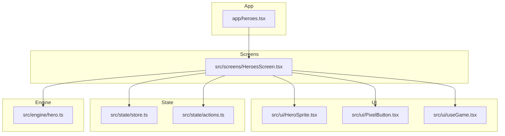
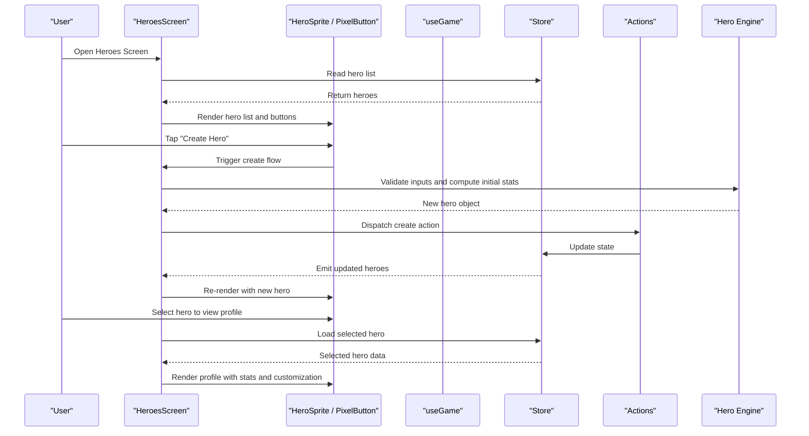
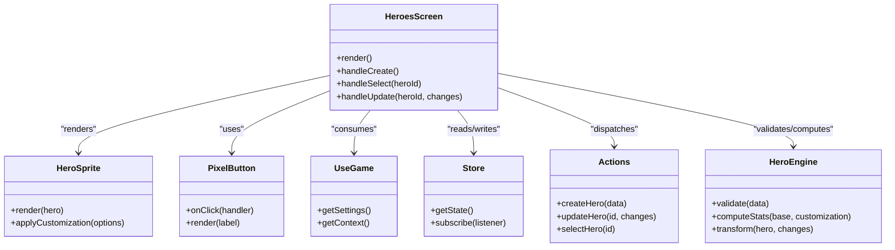

# Heroes Screen

<cite>
**Referenced Files in This Document**
- [HeroesScreen.tsx](file://src/screens/HeroesScreen.tsx)
- [heroes.tsx](file://app/heroes.tsx)
- [hero.ts](file://src/engine/hero.ts)
- [store.ts](file://src/state/store.ts)
- [actions.ts](file://src/state/actions.ts)
- [HeroSprite.tsx](file://src/ui/HeroSprite.tsx)
- [PixelButton.tsx](file://src/ui/PixelButton.tsx)
- [useGame.tsx](file://src/ui/useGame.tsx)
</cite>

## Table of Contents

1. [Introduction](#introduction)
2. [Project Structure](#project-structure)
3. [Core Components](#core-components)
4. [Architecture Overview](#architecture-overview)
5. [Detailed Component Analysis](#detailed-component-analysis)
6. [Dependency Analysis](#dependency-analysis)
7. [Performance Considerations](#performance-considerations)
8. [Troubleshooting Guide](#troubleshooting-guide)
9. [Conclusion](#conclusion)
10. [Appendices](#appendices)

## Introduction

This document provides comprehensive documentation for the HeroesScreen component, which manages hero creation, selection, and display within the application. It explains the hero list interface, the hero creation workflow, and hero profile management. It also details integration with the hero engine layer, data persistence via the state store, and user interactions for hero customization and stat displays. Examples of hero manipulation APIs and UI interaction patterns are included to help developers understand how heroes relate to game state and how to extend or modify behavior safely.

## Project Structure

The HeroesScreen feature spans multiple layers:

- UI layer: React components that render the hero list, creation forms, and profile views.
- State layer: Centralized store and actions for persisting and updating hero data.
- Engine layer: Core logic for hero definitions, stats, and transformations.
- App routing: Entry points that mount screen components.

**Diagram sources**

- [heroes.tsx](file://app/heroes.tsx)
- [HeroesScreen.tsx](file://src/screens/HeroesScreen.tsx)
- [HeroSprite.tsx](file://src/ui/HeroSprite.tsx)
- [PixelButton.tsx](file://src/ui/PixelButton.tsx)
- [useGame.tsx](file://src/ui/useGame.tsx)
- [store.ts](file://src/state/store.ts)
- [actions.ts](file://src/state/actions.ts)
- [hero.ts](file://src/engine/hero.ts)

**Section sources**

- [heroes.tsx](file://app/heroes.tsx)
- [HeroesScreen.tsx](file://src/screens/HeroesScreen.tsx)

## Core Components

- HeroesScreen: The main screen that renders the hero list, creation flow, and profile view. It coordinates user interactions and delegates to the engine and state layers.
- HeroSprite: Renders a hero’s visual representation (sprite), including any customization options like appearance or equipment.
- PixelButton: Reusable button component used throughout the hero flows for confirmations and navigation.
- useGame: Hook providing access to game context and utilities consumed by the screen.
- Store and Actions: Centralized state management for hero data persistence and updates.
- Hero Engine: Encapsulates core hero logic such as creation, validation, stat computation, and profile management.

Key responsibilities:

- Display a list of existing heroes with selectable entries.
- Provide a creation workflow to define new heroes, including name, stats, and customization.
- Show a detailed profile for the selected hero with editable fields and stat summaries.
- Persist changes to the store and reflect updates across the UI.

**Section sources**

- [HeroesScreen.tsx](file://src/screens/HeroesScreen.tsx)
- [HeroSprite.tsx](file://src/ui/HeroSprite.tsx)
- [PixelButton.tsx](file://src/ui/PixelButton.tsx)
- [useGame.tsx](file://src/ui/useGame.tsx)
- [store.ts](file://src/state/store.ts)
- [actions.ts](file://src/state/actions.ts)
- [hero.ts](file://src/engine/hero.ts)

## Architecture Overview

The HeroesScreen integrates three primary layers:

- UI Layer: Renders interactive elements and handles user input.
- State Layer: Persists hero data and exposes selectors/actions for updates.
- Engine Layer: Provides deterministic logic for hero creation, validation, and transformation.

**Diagram sources**

- [HeroesScreen.tsx](file://src/screens/HeroesScreen.tsx)
- [HeroSprite.tsx](file://src/ui/HeroSprite.tsx)
- [PixelButton.tsx](file://src/ui/PixelButton.tsx)
- [useGame.tsx](file://src/ui/useGame.tsx)
- [store.ts](file://src/state/store.ts)
- [actions.ts](file://src/state/actions.ts)
- [hero.ts](file://src/engine/hero.ts)

## Detailed Component Analysis

### HeroesScreen

Responsibilities:

- Manages the hero list view and selection state.
- Orchestrates the hero creation workflow, including form handling and validation.
- Displays hero profiles with stats and customization controls.
- Integrates with the store for persistence and with the engine for logic.

Data flow:

- Reads hero list from the store on mount.
- On creation, validates inputs via the engine, then dispatches an action to update the store.
- On selection, loads the selected hero’s profile and binds UI controls to store updates.

Error handling:

- Validates inputs before creating or updating heroes.
- Handles missing or invalid data gracefully and surfaces feedback to the user.

Performance considerations:

- Minimizes re-renders by selecting only necessary slices of state.
- Uses memoization where appropriate for derived stats and lists.

**Section sources**

- [HeroesScreen.tsx](file://src/screens/HeroesScreen.tsx)
- [store.ts](file://src/state/store.ts)
- [actions.ts](file://src/state/actions.ts)
- [hero.ts](file://src/engine/hero.ts)

### Hero Creation Workflow

Steps:

1. User initiates creation via UI.
2. Screen collects inputs (name, base attributes, customization).
3. Engine validates and computes initial stats.
4. Action dispatched to persist the new hero.
5. Store updates and UI reflects the new hero in the list and profile.

Validation and constraints:

- Name uniqueness and length limits.
- Stat ranges enforced by the engine.
- Customization options validated against allowed sets.

**Section sources**

- [HeroesScreen.tsx](file://src/screens/HeroesScreen.tsx)
- [hero.ts](file://src/engine/hero.ts)
- [actions.ts](file://src/state/actions.ts)

### Hero Profile Management

Features:

- Displays current hero stats and customization options.
- Allows editing of mutable fields (e.g., name, cosmetic choices).
- Recomputes derived stats when inputs change.

Persistence:

- Edits are persisted through store actions.
- Derived stats are computed on demand or cached for performance.

**Section sources**

- [HeroesScreen.tsx](file://src/screens/HeroesScreen.tsx)
- [store.ts](file://src/state/store.ts)
- [hero.ts](file://src/engine/hero.ts)

### UI Components Integration

- HeroSprite: Renders the hero’s sprite and applies customization visuals.
- PixelButton: Used for confirmations, navigation, and toggles within the hero flows.
- useGame: Provides context for game-wide settings and utilities consumed by the screen.

Interaction patterns:

- Button presses trigger state updates via actions.
- Sprite selections update the selected hero in the store.

**Section sources**

- [HeroSprite.tsx](file://src/ui/HeroSprite.tsx)
- [PixelButton.tsx](file://src/ui/PixelButton.tsx)
- [useGame.tsx](file://src/ui/useGame.tsx)

### Data Persistence and Game State Relationship

- Store holds the canonical list of heroes and the selected hero.
- Actions encapsulate mutations and ensure consistent updates.
- Engine ensures data integrity and computes derived values.
- UI subscribes to store changes and re-renders accordingly.

Relationships:

- Each hero is an entity with immutable identifiers and mutable properties.
- Stats may be derived from base attributes and customization choices.
- Selection state influences which hero’s profile is displayed.

**Section sources**

- [store.ts](file://src/state/store.ts)
- [actions.ts](file://src/state/actions.ts)
- [hero.ts](file://src/engine/hero.ts)

## Dependency Analysis

The HeroesScreen depends on:

- UI components for rendering and interaction.
- Store and actions for state management.
- Engine for core hero logic.

**Diagram sources**

- [HeroesScreen.tsx](file://src/screens/HeroesScreen.tsx)
- [HeroSprite.tsx](file://src/ui/HeroSprite.tsx)
- [PixelButton.tsx](file://src/ui/PixelButton.tsx)
- [useGame.tsx](file://src/ui/useGame.tsx)
- [store.ts](file://src/state/store.ts)
- [actions.ts](file://src/state/actions.ts)
- [hero.ts](file://src/engine/hero.ts)

**Section sources**

- [HeroesScreen.tsx](file://src/screens/HeroesScreen.tsx)
- [store.ts](file://src/state/store.ts)
- [actions.ts](file://src/state/actions.ts)
- [hero.ts](file://src/engine/hero.ts)

## Performance Considerations

- Memoize derived stats to avoid recomputation on every render.
- Batch store updates to reduce re-renders during bulk operations.
- Use selective subscriptions in the screen to minimize unnecessary updates.
- Defer heavy computations until needed (e.g., on profile open).

[No sources needed since this section provides general guidance]

## Troubleshooting Guide

Common issues and resolutions:

- Invalid hero creation: Ensure inputs meet engine constraints; check validation error messages.
- Missing hero in list after creation: Verify that the action was dispatched and the store updated.
- Profile not reflecting changes: Confirm that derived stats are recomputed and the store emits updates.
- UI not responding to interactions: Check event handlers bound to buttons and sprites.

Debugging tips:

- Inspect store state snapshots around key events.
- Log engine validations and transformations to trace data flow.
- Use UI logs to verify handler invocations and parameter values.

**Section sources**

- [HeroesScreen.tsx](file://src/screens/HeroesScreen.tsx)
- [store.ts](file://src/state/store.ts)
- [actions.ts](file://src/state/actions.ts)
- [hero.ts](file://src/engine/hero.ts)

## Conclusion

The HeroesScreen orchestrates hero creation, selection, and profile management by integrating UI components, state management, and core engine logic. It ensures data integrity through validation and derived stat computation, while providing a responsive and intuitive user experience. Developers can extend functionality by adding new customization options, modifying stats computation, or enhancing the UI flows while maintaining separation of concerns across layers.

[No sources needed since this section summarizes without analyzing specific files]

## Appendices

### API Examples and Interaction Patterns

- Create a hero:
  - Collect inputs, validate via engine, dispatch create action, and update store.
- Select a hero:
  - Dispatch select action to set the active hero and load its profile.
- Update a hero:
  - Apply changes, recompute stats via engine, and persist through store actions.
- Render hero sprite:
  - Pass hero data and customization options to the sprite component.

These patterns demonstrate typical interactions between the screen, UI components, store, and engine.

**Section sources**

- [HeroesScreen.tsx](file://src/screens/HeroesScreen.tsx)
- [actions.ts](file://src/state/actions.ts)
- [hero.ts](file://src/engine/hero.ts)
- [HeroSprite.tsx](file://src/ui/HeroSprite.tsx)
