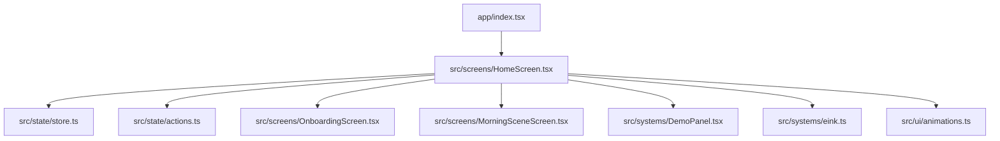
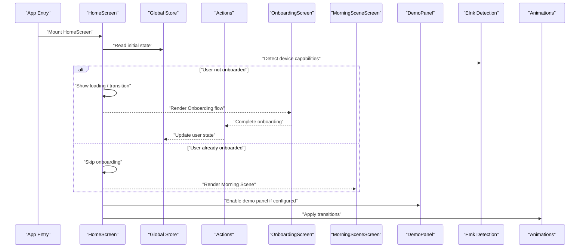
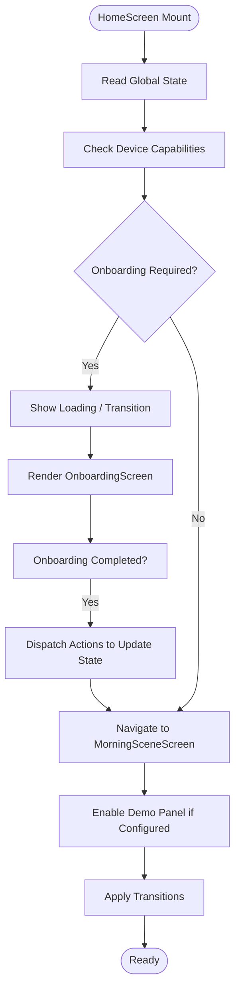
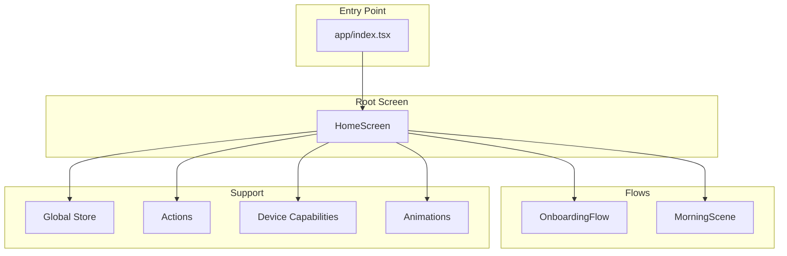
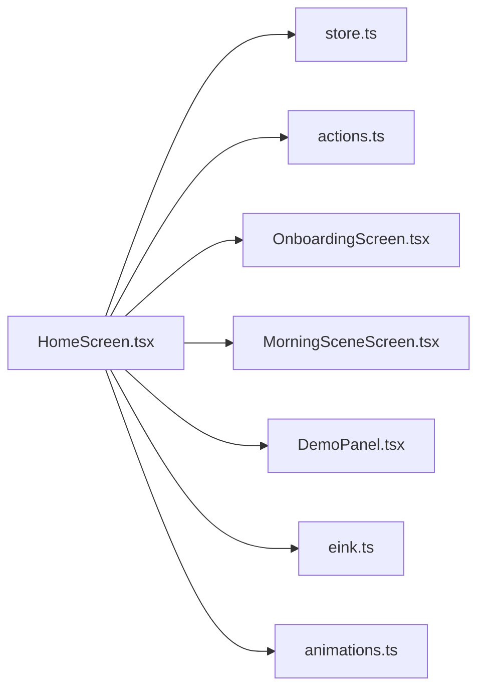

# Home Screen

<cite>
**Referenced Files in This Document**
- [HomeScreen.tsx](file://src/screens/HomeScreen.tsx)
- [index.tsx](file://app/index.tsx)
- [store.ts](file://src/state/store.ts)
- [actions.ts](file://src/state/actions.ts)
- [OnboardingScreen.tsx](file://src/screens/OnboardingScreen.tsx)
- [MorningSceneScreen.tsx](file://src/screens/MorningSceneScreen.tsx)
- [DemoPanel.tsx](file://src/systems/DemoPanel.tsx)
- [eink.ts](file://src/systems/eink.ts)
- [animations.ts](file://src/ui/animations.ts)
</cite>

## Table of Contents

1. [Introduction](#introduction)
2. [Project Structure](#project-structure)
3. [Core Components](#core-components)
4. [Architecture Overview](#architecture-overview)
5. [Detailed Component Analysis](#detailed-component-analysis)
6. [Dependency Analysis](#dependency-analysis)
7. [Performance Considerations](#performance-considerations)
8. [Troubleshooting Guide](#troubleshooting-guide)
9. [Conclusion](#conclusion)

## Introduction

This document provides comprehensive documentation for the HomeScreen component, which serves as the main entry point of the application. It explains how HomeScreen initializes navigation, sets up initial state, and orchestrates the user onboarding flow. The component handles app launch logic, device capability detection, and routes users to appropriate screens based on their state (for example, first-time onboarding versus returning to the morning scene). It also details prop interfaces, lifecycle behavior, integration with global state management, and any animations or conditional rendering patterns used during transitions.

## Project Structure

At a high level, HomeScreen is implemented as a screen component under src/screens and integrates with:

- Global state store for user progress and feature flags
- Navigation entry points defined in app/index.tsx
- Device capability modules such as eInk detection
- Animation utilities for smooth transitions between screens

**Diagram sources**

- [index.tsx](file://app/index.tsx)
- [HomeScreen.tsx](file://src/screens/HomeScreen.tsx)
- [store.ts](file://src/state/store.ts)
- [actions.ts](file://src/state/actions.ts)
- [OnboardingScreen.tsx](file://src/screens/OnboardingScreen.tsx)
- [MorningSceneScreen.tsx](file://src/screens/MorningSceneScreen.tsx)
- [DemoPanel.tsx](file://src/systems/DemoPanel.tsx)
- [eink.ts](file://src/systems/eink.ts)
- [animations.ts](file://src/ui/animations.ts)

**Section sources**

- [HomeScreen.tsx](file://src/screens/HomeScreen.tsx)
- [index.tsx](file://app/index.tsx)
- [store.ts](file://src/state/store.ts)
- [actions.ts](file://src/state/actions.ts)
- [OnboardingScreen.tsx](file://src/screens/OnboardingScreen.tsx)
- [MorningSceneScreen.tsx](file://src/screens/MorningSceneScreen.tsx)
- [DemoPanel.tsx](file://src/systems/DemoPanel.tsx)
- [eink.ts](file://src/systems/eink.ts)
- [animations.ts](file://src/ui/animations.ts)

## Core Components

HomeScreen acts as the root screen that:

- Initializes navigation and ensures the app’s routing is ready
- Reads global state to determine whether the user has completed onboarding
- Detects device capabilities (such as eInk support) and adjusts UI accordingly
- Renders either the Onboarding flow or the primary Morning Scene based on user state
- Manages loading states and transitions using animation utilities

Key responsibilities include:

- Prop interface definition for configuration and external control
- Lifecycle setup for one-time initialization tasks
- Conditional rendering based on state and device capabilities
- Integration with global actions to update user progress and settings

**Section sources**

- [HomeScreen.tsx](file://src/screens/HomeScreen.tsx)
- [store.ts](file://src/state/store.ts)
- [actions.ts](file://src/state/actions.ts)
- [eink.ts](file://src/systems/eink.ts)
- [animations.ts](file://src/ui/animations.ts)

## Architecture Overview

The HomeScreen coordinates the app’s initial flow by reading from the global store and dispatching actions when necessary. It decides whether to show the onboarding experience or jump directly to the morning scene. Device capability checks influence UI behavior and features exposed to the user.

**Diagram sources**

- [HomeScreen.tsx](file://src/screens/HomeScreen.tsx)
- [store.ts](file://src/state/store.ts)
- [actions.ts](file://src/state/actions.ts)
- [OnboardingScreen.tsx](file://src/screens/OnboardingScreen.tsx)
- [MorningSceneScreen.tsx](file://src/screens/MorningSceneScreen.tsx)
- [DemoPanel.tsx](file://src/systems/DemoPanel.tsx)
- [eink.ts](file://src/systems/eink.ts)
- [animations.ts](file://src/ui/animations.ts)

## Detailed Component Analysis

### HomeScreen Component

HomeScreen is responsible for:

- Defining its prop interface for configuration and external hooks
- Performing one-time initialization at mount time
- Reading global state to determine the next screen
- Handling device capability detection and feature toggles
- Rendering the appropriate screen with conditional logic
- Managing loading states and applying animations during transitions

Lifecycle and initialization:

- On mount, HomeScreen reads the current user state and feature flags from the global store
- It performs device capability checks (e.g., eInk detection) to tailor UI behavior
- If onboarding is required, it navigates to the Onboarding flow; otherwise, it proceeds to the Morning Scene
- It may enable a demo panel based on configuration or environment

State and data flow:

- Reads from the global store to determine user progress and preferences
- Dispatches actions to update state after onboarding completion or other user interactions
- Uses local state for transient UI concerns like loading indicators and transition states

Conditional rendering and animations:

- Conditionally renders Onboarding or Morning Scene based on user state
- Applies animations for smooth transitions between screens
- Displays loading placeholders while performing initialization tasks

Integration points:

- Global store for persistent state and cross-screen data sharing
- Actions module for state mutations
- Device capability modules for runtime feature detection
- Animation utilities for visual feedback and transitions

**Diagram sources**

- [HomeScreen.tsx](file://src/screens/HomeScreen.tsx)
- [store.ts](file://src/state/store.ts)
- [actions.ts](file://src/state/actions.ts)
- [OnboardingScreen.tsx](file://src/screens/OnboardingScreen.tsx)
- [MorningSceneScreen.tsx](file://src/screens/MorningSceneScreen.tsx)
- [DemoPanel.tsx](file://src/systems/DemoPanel.tsx)
- [eink.ts](file://src/systems/eink.ts)
- [animations.ts](file://src/ui/animations.ts)

**Section sources**

- [HomeScreen.tsx](file://src/screens/HomeScreen.tsx)
- [store.ts](file://src/state/store.ts)
- [actions.ts](file://src/state/actions.ts)
- [OnboardingScreen.tsx](file://src/screens/OnboardingScreen.tsx)
- [MorningSceneScreen.tsx](file://src/screens/MorningSceneScreen.tsx)
- [DemoPanel.tsx](file://src/systems/DemoPanel.tsx)
- [eink.ts](file://src/systems/eink.ts)
- [animations.ts](file://src/ui/animations.ts)

### Conceptual Overview

Conceptually, HomeScreen functions as the orchestrator for the app’s initial user journey. It ensures that:

- Navigation is initialized before any screen is shown
- User state is validated against onboarding requirements
- Device-specific features are enabled or disabled based on runtime capabilities
- Visual transitions provide a smooth experience between different flows

This conceptual model helps developers understand the separation of concerns: HomeScreen focuses on orchestration and routing, while individual screens handle their own domain logic and UI.

[No sources needed since this diagram shows conceptual workflow, not actual code structure]

## Dependency Analysis

HomeScreen depends on several modules to function correctly:

- Global store for reading and updating user state
- Actions for mutating state during onboarding completion
- Device capability modules for runtime feature detection
- Animation utilities for transitions
- Child screens for rendering specific flows

**Diagram sources**

- [HomeScreen.tsx](file://src/screens/HomeScreen.tsx)
- [store.ts](file://src/state/store.ts)
- [actions.ts](file://src/state/actions.ts)
- [OnboardingScreen.tsx](file://src/screens/OnboardingScreen.tsx)
- [MorningSceneScreen.tsx](file://src/screens/MorningSceneScreen.tsx)
- [DemoPanel.tsx](file://src/systems/DemoPanel.tsx)
- [eink.ts](file://src/systems/eink.ts)
- [animations.ts](file://src/ui/animations.ts)

**Section sources**

- [HomeScreen.tsx](file://src/screens/HomeScreen.tsx)
- [store.ts](file://src/state/store.ts)
- [actions.ts](file://src/state/actions.ts)
- [OnboardingScreen.tsx](file://src/screens/OnboardingScreen.tsx)
- [MorningSceneScreen.tsx](file://src/screens/MorningSceneScreen.tsx)
- [DemoPanel.tsx](file://src/systems/DemoPanel.tsx)
- [eink.ts](file://src/systems/eink.ts)
- [animations.ts](file://src/ui/animations.ts)

## Performance Considerations

- Minimize re-renders by keeping local state minimal and derived from global state where possible
- Defer heavy device capability checks until they are needed
- Use lazy loading for non-critical components if applicable
- Ensure animations are lightweight and do not block critical rendering paths
- Avoid unnecessary state updates during initialization

[No sources needed since this section provides general guidance]

## Troubleshooting Guide

Common issues and resolutions:

- Onboarding loop: Verify that onboarding completion actions are dispatched correctly and that global state reflects the updated user progress
- Incorrect routing: Confirm that device capability detection returns expected values and that conditional rendering logic matches intended behavior
- Stuck loading state: Ensure initialization tasks complete and that error handling paths reset loading flags appropriately
- Animation glitches: Validate that animation utilities are invoked with correct parameters and that transitions are not interrupted by rapid state changes

**Section sources**

- [HomeScreen.tsx](file://src/screens/HomeScreen.tsx)
- [store.ts](file://src/state/store.ts)
- [actions.ts](file://src/state/actions.ts)
- [eink.ts](file://src/systems/eink.ts)
- [animations.ts](file://src/ui/animations.ts)

## Conclusion

HomeScreen serves as the central orchestrator for the application’s initial user journey. It initializes navigation, sets up state, detects device capabilities, and routes users through onboarding or directly to the morning scene. By integrating with global state management and leveraging animations, it provides a smooth and responsive experience. Understanding its responsibilities and dependencies helps maintain clarity and scalability as the application evolves.

[No sources needed since this section summarizes without analyzing specific files]
