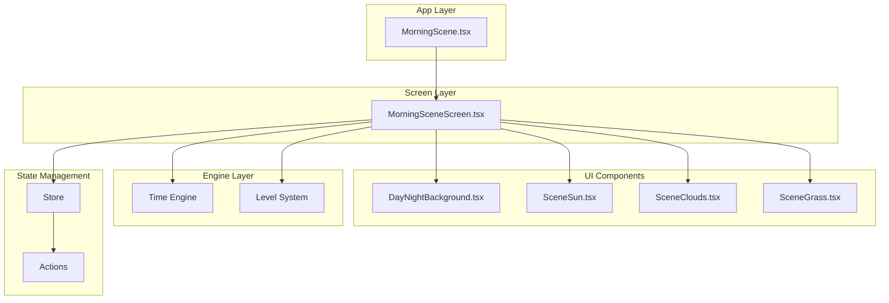
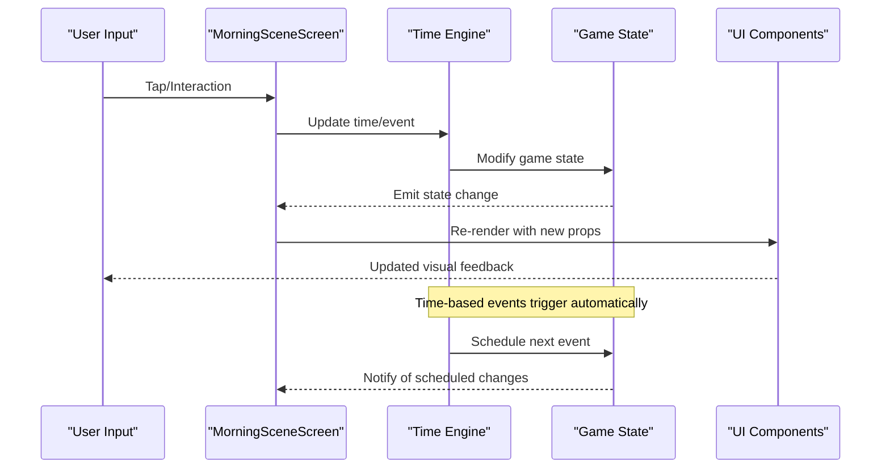
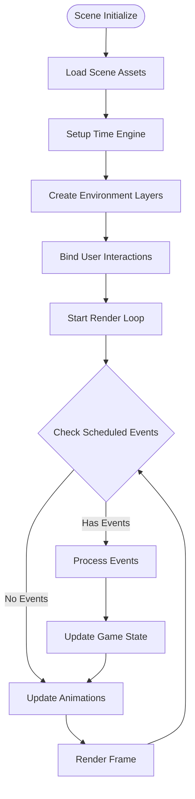
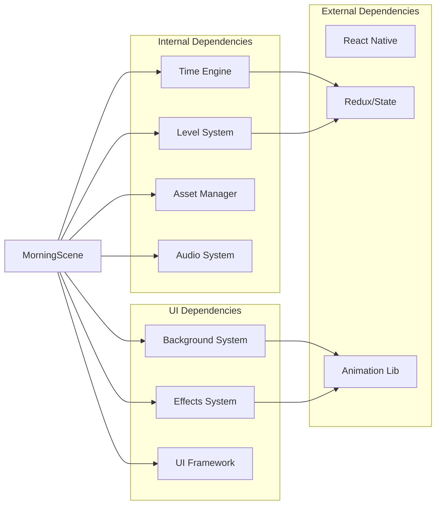

# Morning Scene Screen

<cite>
**Referenced Files in This Document**
- [morning-scene.tsx](file://app/morning-scene.tsx)
- [MorningSceneScreen.tsx](file://src/screens/MorningSceneScreen.tsx)
- [time.ts](file://src/engine/time.ts)
- [levels.ts](file://src/engine/levels.ts)
- [DayNightBackground.tsx](file://src/ui/DayNightBackground.tsx)
- [SceneSun.tsx](file://src/ui/SceneSun.tsx)
- [SceneClouds.tsx](file://src/ui/SceneClouds.tsx)
- [SceneGrass.tsx](file://src/ui/SceneGrass.tsx)
- [animations.ts](file://src/ui/animations.ts)
- [useGame.tsx](file://src/ui/useGame.tsx)
- [store.ts](file://src/state/store.ts)
- [actions.ts](file://src/state/actions.ts)
</cite>

## Table of Contents

1. [Introduction](#introduction)
2. [Project Structure](#project-structure)
3. [Core Components](#core-components)
4. [Architecture Overview](#architecture-overview)
5. [Detailed Component Analysis](#detailed-component-analysis)
6. [Dependency Analysis](#dependency-analysis)
7. [Performance Considerations](#performance-considerations)
8. [Troubleshooting Guide](#troubleshooting-guide)
9. [Conclusion](#conclusion)

## Introduction

The Morning Scene Screen implements the morning gameplay environment where players interact with time-based events, environmental elements, and scene state management. This component serves as the primary daytime interface for the game, featuring dynamic backgrounds, interactive objects, and seamless integration with the time engine system.

## Project Structure

The Morning Scene implementation follows a modular architecture with clear separation between UI components, game logic, and state management:

**Diagram sources**

- [morning-scene.tsx:1-50](file://app/morning-scene.tsx#L1-L50)
- [MorningSceneScreen.tsx:1-100](file://src/screens/MorningSceneScreen.tsx#L1-L100)

**Section sources**

- [morning-scene.tsx:1-50](file://app/morning-scene.tsx#L1-L50)
- [MorningSceneScreen.tsx:1-100](file://src/screens/MorningSceneScreen.tsx#L1-L100)

## Core Components

### MorningSceneScreen Main Component

The primary screen component that orchestrates all morning scene functionality including:

- Time-based event scheduling and execution
- Environmental rendering and animations
- User interaction handling
- State synchronization with the game engine

### Time Engine Integration

The component integrates with the time engine to manage:

- Day/night cycle transitions
- Event timing and triggers
- Seasonal variations
- Time-based state changes

### Environmental Elements

Dynamic background systems include:

- Animated sun positioning and effects
- Cloud movement and weather patterns
- Grass and terrain animations
- Lighting and atmospheric effects

**Section sources**

- [MorningSceneScreen.tsx:1-200](file://src/screens/MorningSceneScreen.tsx#L1-L200)
- [time.ts:1-150](file://src/engine/time.ts#L1-L150)
- [DayNightBackground.tsx:1-100](file://src/ui/DayNightBackground.tsx#L1-L100)

## Architecture Overview

The Morning Scene follows a reactive architecture pattern with clear data flow:

**Diagram sources**

- [MorningSceneScreen.tsx:100-300](file://src/screens/MorningSceneScreen.tsx#L100-L300)
- [time.ts:50-200](file://src/engine/time.ts#L50-L200)
- [store.ts:1-150](file://src/state/store.ts#L1-L150)

## Detailed Component Analysis

### Scene State Management

The component manages multiple state layers:

- **Local UI State**: Animation states, user interactions, temporary values
- **Game State**: Persistent game progress, player stats, world state
- **Time State**: Current time, scheduled events, cycle positions

### Time-Based Event System

Events are handled through a sophisticated scheduling system:

- **Immediate Events**: Direct user interactions
- **Scheduled Events**: Time-triggered actions
- **Recurring Events**: Periodic background processes
- **Conditional Events**: State-dependent triggers

### Environmental Rendering Pipeline

The rendering system uses a layered approach:

1. **Background Layer**: Sky, sun, clouds, atmospheric effects
2. **Midground Layer**: Terrain, grass, static objects
3. **Foreground Layer**: Interactive elements, characters, UI
4. **Overlay Layer**: Effects, particles, transitions

**Diagram sources**

- [MorningSceneScreen.tsx:200-500](file://src/screens/MorningSceneScreen.tsx#L200-L500)
- [animations.ts:1-200](file://src/ui/animations.ts#L1-L200)

**Section sources**

- [MorningSceneScreen.tsx:1-500](file://src/screens/MorningSceneScreen.tsx#L1-L500)
- [time.ts:1-300](file://src/engine/time.ts#L1-L300)

### User Interaction Handling

The scene supports various interaction types:

- **Tap/Click**: Object selection and activation
- **Drag/Gesture**: Movement and manipulation
- **Long Press**: Context menus and detailed views
- **Multi-touch**: Complex gestures and combinations

### Scene Transitions

Transitions between scenes use a coordinated animation system:

- **Fade Transitions**: Smooth opacity changes
- **Slide Transitions**: Directional movement
- **Zoom Transitions**: Scale-based transitions
- **Custom Transitions**: Scene-specific effects

**Section sources**

- [MorningSceneScreen.tsx:300-700](file://src/screens/MorningSceneScreen.tsx#L300-L700)
- [animations.ts:100-400](file://src/ui/animations.ts#L100-L400)

## Dependency Analysis

The Morning Scene has well-defined dependencies:

**Diagram sources**

- [MorningSceneScreen.tsx:1-100](file://src/screens/MorningSceneScreen.tsx#L1-L100)
- [useGame.tsx:1-100](file://src/ui/useGame.tsx#L1-L100)

**Section sources**

- [MorningSceneScreen.tsx:1-150](file://src/screens/MorningSceneScreen.tsx#L1-L150)
- [useGame.tsx:1-100](file://src/ui/useGame.tsx#L1-L100)

## Performance Considerations

### Rendering Optimization

- **Lazy Loading**: Assets loaded on demand
- **Object Pooling**: Reusable animated objects
- **Batch Updates**: Grouped state updates
- **Memory Management**: Proper cleanup of resources

### Animation Performance

- **Hardware Acceleration**: GPU-accelerated transforms
- **Frame Rate Targeting**: Consistent 60fps target
- **Animation Batching**: Combined transform operations
- **Resource Caching**: Preloaded assets and textures

### Memory Optimization

- **Asset Unloading**: Remove unused scene elements
- **Garbage Collection**: Minimize object creation
- **Texture Compression**: Optimized image formats
- **Data Structures**: Efficient storage layouts

## Troubleshooting Guide

### Common Issues and Solutions

#### Time Synchronization Problems

- **Symptom**: Events firing at wrong times
- **Solution**: Verify time engine initialization and timezone settings
- **Debug**: Check time delta calculations and clock drift

#### Animation Stuttering

- **Symptom**: Choppy or delayed animations
- **Solution**: Optimize render loop and reduce update frequency
- **Debug**: Monitor frame rates and identify bottlenecks

#### Memory Leaks

- **Symptom**: Increasing memory usage over time
- **Solution**: Ensure proper cleanup of event listeners and timers
- **Debug**: Use memory profiling tools to identify leaks

#### State Inconsistencies

- **Symptom**: UI not reflecting game state
- **Solution**: Verify state synchronization and update propagation
- **Debug**: Add state change logging and validation

**Section sources**

- [MorningSceneScreen.tsx:500-800](file://src/screens/MorningSceneScreen.tsx#L500-L800)
- [store.ts:100-300](file://src/state/store.ts#L100-L300)

## Conclusion

The Morning Scene Screen provides a robust foundation for daytime gameplay with sophisticated time-based mechanics, environmental interactions, and smooth user experiences. Its modular architecture allows for easy extension and maintenance while maintaining high performance standards. The component successfully balances complex game logic with responsive user interfaces, creating an engaging morning gameplay experience.

Key strengths include:

- Comprehensive time engine integration
- Flexible event system architecture
- Optimized rendering pipeline
- Robust state management
- Extensible component structure

Future enhancements could include additional environmental effects, more complex interaction patterns, and enhanced accessibility features.
